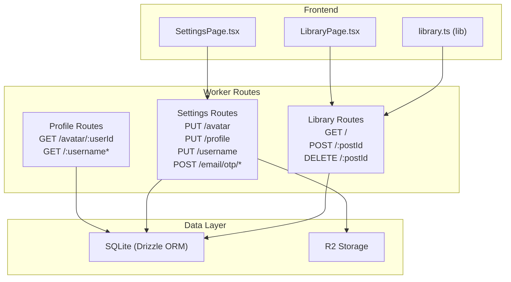
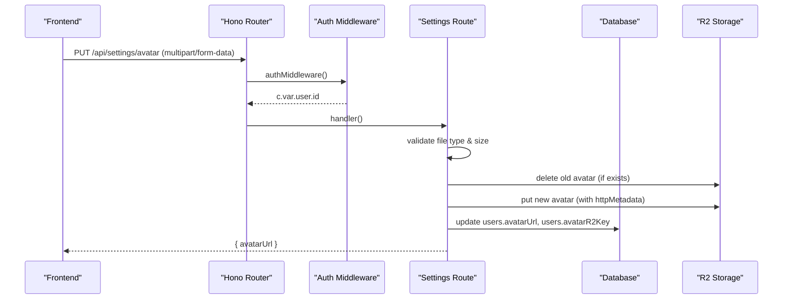
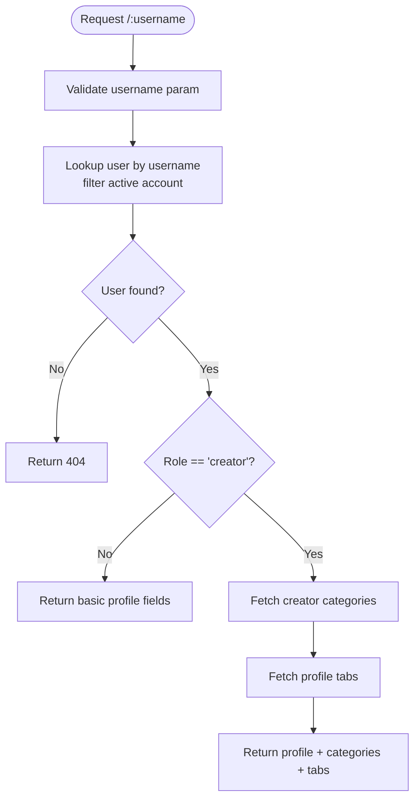
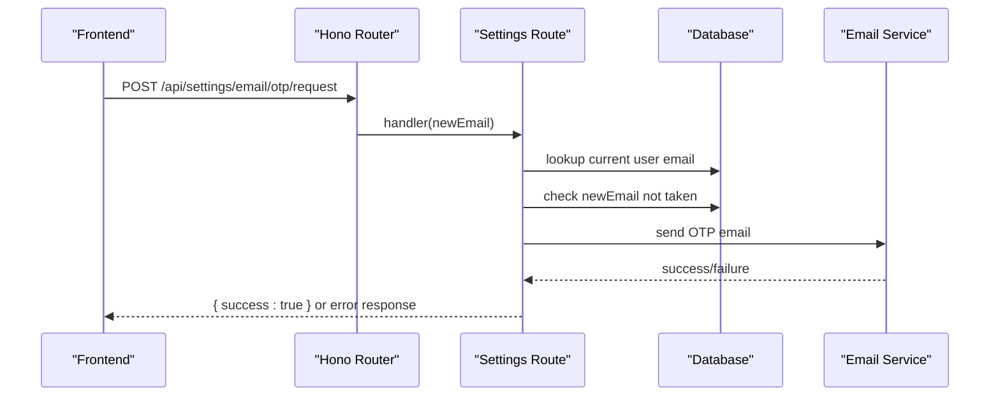
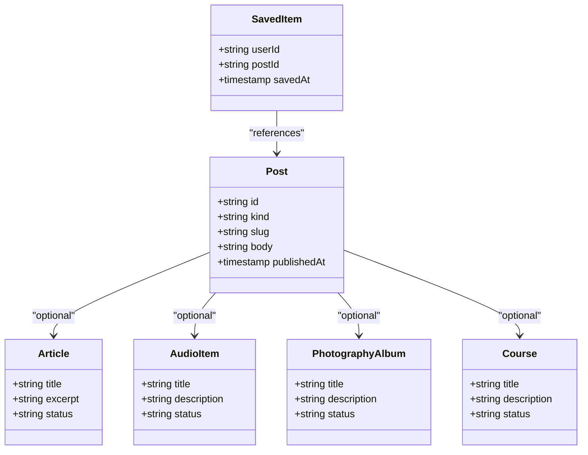

# User Management Routes

<cite>
**Referenced Files in This Document**
- [profile.ts](file://src/worker/routes/profile.ts)
- [settings.ts](file://src/worker/routes/settings.ts)
- [library.ts](file://src/worker/routes/library.ts)
- [schema.ts](file://src/worker/db/schema.ts)
- [schemas.ts](file://src/worker/lib/schemas.ts)
- [post-data.ts](file://src/worker/lib/post-data.ts)
- [library.ts (frontend)](file://src/react-app/lib/library.ts)
- [SettingsPage.tsx](file://src/react-app/pages/SettingsPage.tsx)
- [LibraryPage.tsx](file://src/react-app/pages/LibraryPage.tsx)
</cite>

## Table of Contents
1. Introduction
2. Project Structure
3. Core Components
4. Architecture Overview
5. Detailed Component Analysis
6. Dependency Analysis
7. Performance Considerations
8. Troubleshooting Guide
9. Conclusion

## Introduction
This document provides comprehensive documentation for user management route handlers covering profile management, account settings, and the library system for saved content. It explains:
- Profile CRUD operations and avatar uploads
- Preference management including profile tabs and notification preferences
- Data export/import patterns via the library system
- Privacy controls and access enforcement
- Validation, image processing, and storage optimization patterns

The backend is implemented with Hono routes and Drizzle ORM against a SQLite database, while the frontend uses React Query for data fetching and mutations.

## Project Structure
User management spans three primary route modules and supporting libraries:
- Profile routes: public profile views, avatar retrieval, and creator content listing
- Settings routes: profile updates, avatar upload, username/email changes, and profile tabs
- Library routes: saved items list, add/remove bookmarks, and rich filtering/pagination

**Diagram sources**
- [profile.ts:1-329](file://src/worker/routes/profile.ts#L1-L329)
- [settings.ts:1-327](file://src/worker/routes/settings.ts#L1-L327)
- [library.ts:1-366](file://src/worker/routes/library.ts#L1-L366)
- [SettingsPage.tsx:1-927](file://src/react-app/pages/SettingsPage.tsx#L1-L927)
- [LibraryPage.tsx:1-157](file://src/react-app/pages/LibraryPage.tsx#L1-L157)
- [library.ts (frontend):1-70](file://src/react-app/lib/library.ts#L1-L70)

**Section sources**
- [profile.ts:1-329](file://src/worker/routes/profile.ts#L1-L329)
- [settings.ts:1-327](file://src/worker/routes/settings.ts#L1-L327)
- [library.ts:1-366](file://src/worker/routes/library.ts#L1-L366)

## Core Components
- Profile routes expose read-only endpoints for public profiles, subscriptions, subscribers, and creator content listings. They enforce active accounts and role checks where applicable.
- Settings routes provide authenticated mutation endpoints for profile updates, avatar uploads, username changes, and email change via OTP flow.
- Library routes implement a bookmarking system with pagination, filtering by type and search query, and membership-aware availability.

Key responsibilities:
- Input validation using Zod schemas
- Database queries via Drizzle ORM
- Media handling with Cloudflare R2
- Access control based on roles and subscription entitlements

**Section sources**
- [profile.ts:1-329](file://src/worker/routes/profile.ts#L1-L329)
- [settings.ts:1-327](file://src/worker/routes/settings.ts#L1-L327)
- [library.ts:1-366](file://src/worker/routes/library.ts#L1-L366)
- [schemas.ts:1-221](file://src/worker/lib/schemas.ts#L1-L221)

## Architecture Overview
The user management system follows a layered architecture:
- Frontend components trigger API calls through React Query hooks
- Hono routes handle HTTP requests, validate inputs, enforce authentication and authorization
- Data layer uses Drizzle ORM to interact with SQLite
- Media assets are stored in R2 and served via dedicated endpoints

**Diagram sources**
- [settings.ts:66-133](file://src/worker/routes/settings.ts#L66-L133)
- [profile.ts:19-39](file://src/worker/routes/profile.ts#L19-L39)

## Detailed Component Analysis

### Profile Routes
Public profile endpoints:
- GET /avatar/:userId: Retrieves avatar from R2 if present; returns 404 otherwise
- GET /:username: Returns basic profile info and categories for creators
- GET /:username/subscriptions: Lists subscriptions visible to the profile owner
- GET /:username/subscribers: Creator-only endpoint listing subscribers with entitlement checks
- GET /:username/posts|articles|photography|audio|courses: Creator-only endpoints returning published content with access checks

Access control:
- Active account status enforced
- Role checks for creator-only endpoints
- Subscription-based access via hasCreatorAccess and membership entitlement SQL

**Diagram sources**
- [profile.ts:43-82](file://src/worker/routes/profile.ts#L43-L82)

**Section sources**
- [profile.ts:19-329](file://src/worker/routes/profile.ts#L19-L329)

### Settings Routes
Authenticated endpoints:
- PUT /avatar: Uploads avatar with validation, replaces old file, updates DB
- PUT /profile: Updates displayName, tagline, socialLinks with schema validation
- PUT /username: Changes username with uniqueness check
- POST /email/otp/request: Sends OTP to new email after validation and conflict checks
- POST /email/otp/verify: Confirms OTP and updates email; enforces attempts and expiry
- PUT /password: Disabled; redirects to code-based sign-in
- GET/PUT /profile-tabs: Creator-only tab visibility and ordering

Validation and error handling:
- Zod schemas ensure input correctness
- Specific error responses for unsupported media types and payload too large
- OTP flow includes rate limiting and expiration checks

**Diagram sources**
- [settings.ts:146-203](file://src/worker/routes/settings.ts#L146-L203)

**Section sources**
- [settings.ts:33-327](file://src/worker/routes/settings.ts#L33-L327)
- [schemas.ts:116-187](file://src/worker/lib/schemas.ts#L116-L187)

### Library System
Bookmarking and saved content:
- GET /: Paginated list of saved items with filtering by type and search query
- POST /:postId: Save item (idempotent insert)
- DELETE /:postId: Remove saved item

Availability logic:
- Items marked as unavailable if not published or author inactive
- Membership_required when subscriber lacks entitlement
- Available items include rich metadata and interactions

Search and filtering:
- Type filter: all, post, article, audio, photography, course
- Sort: newest, oldest
- Query: searches creator name/username and content titles/bodies

**Diagram sources**
- [library.ts:1-366](file://src/worker/routes/library.ts#L1-L366)
- [schema.ts:531-539](file://src/worker/db/schema.ts#L531-L539)

**Section sources**
- [library.ts:1-366](file://src/worker/routes/library.ts#L1-L366)
- [library.ts (frontend):1-70](file://src/react-app/lib/library.ts#L1-L70)

### Data Models and Schema
Core tables involved in user management:
- users: profile fields, avatar URLs, roles, account status
- saved_items: user bookmarks with timestamps
- creator_profile_tabs: per-creator tab configuration
- subscription_memberships: entitlements for access control

Indexes and constraints:
- Unique usernames and emails
- Composite keys for saved_items (userId, postId)
- Indexes on account_status, saved timestamps, and creator relationships

**Section sources**
- [schema.ts:5-32](file://src/worker/db/schema.ts#L5-L32)
- [schema.ts:46-61](file://src/worker/db/schema.ts#L46-L61)
- [schema.ts:531-539](file://src/worker/db/schema.ts#L531-L539)
- [schema.ts:761-799](file://src/worker/db/schema.ts#L761-L799)

## Dependency Analysis
Component relationships and coupling:
- Settings routes depend on auth middleware, Zod schemas, and database client
- Profile routes depend on post-data utilities for access checks and extras
- Library routes integrate multiple content types through shared post-data functions
- Frontend components use React Query hooks that map directly to backend endpoints

External dependencies:
- Cloudflare R2 for avatar storage
- Email service for OTP delivery
- Drizzle ORM for database operations

Potential circular dependencies:
- None detected; clear separation between routes, lib utilities, and data models

**Section sources**
- [profile.ts:1-16](file://src/worker/routes/profile.ts#L1-L16)
- [settings.ts:1-30](file://src/worker/routes/settings.ts#L1-L30)
- [library.ts:1-30](file://src/worker/routes/library.ts#L1-L30)
- [post-data.ts:1-102](file://src/worker/lib/post-data.ts#L1-L102)

## Performance Considerations
Optimization patterns implemented:
- Pagination in library queries with configurable page size (max 50)
- Parallel execution of count and row queries using Promise.all
- Efficient indexing on frequently queried columns (account_status, saved timestamps)
- Minimal data transfer by selecting only necessary fields
- R2 storage reduces database bloat for binary assets

Recommendations:
- Consider caching for profile pages with low update frequency
- Implement request throttling for OTP endpoints
- Use connection pooling for high-concurrency scenarios

[No sources needed since this section provides general guidance]

## Troubleshooting Guide
Common issues and resolutions:
- Avatar upload failures: Check file type validation (JPEG, PNG, WebP) and size limits (5 MB)
- Email OTP errors: Verify email routing configuration and OTP expiration (5 minutes)
- Library access denied: Confirm subscription status and creator entitlements
- Profile updates failing: Validate input schemas and check for unique constraint violations

Error response patterns:
- 404 for missing resources
- 403 for insufficient permissions
- 422 for validation failures
- 503 for external service unavailability

**Section sources**
- [settings.ts:66-133](file://src/worker/routes/settings.ts#L66-L133)
- [settings.ts:146-203](file://src/worker/routes/settings.ts#L146-L203)
- [library.ts:153-169](file://src/worker/routes/library.ts#L153-L169)

## Conclusion
The user management system provides a robust foundation for profile management, account settings, and content bookmarking. The implementation emphasizes security through validation and access control, performance through efficient queries and storage strategies, and usability through intuitive frontend interfaces. The modular architecture allows for easy extension and maintenance while maintaining clear separation of concerns.

[No sources needed since this section summarizes without analyzing specific files]