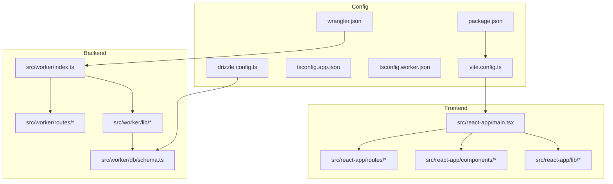
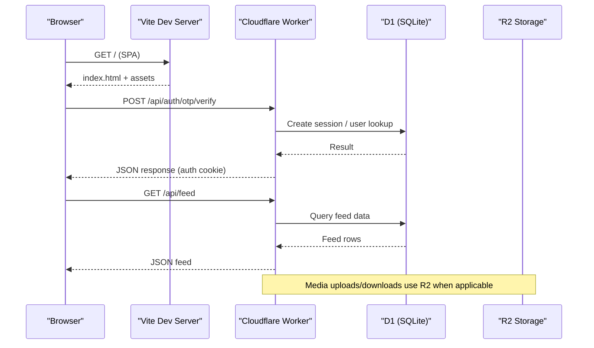
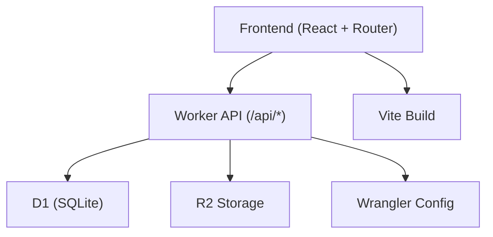

# Contributing Guide

<cite>
**Referenced Files in This Document**
- [package.json](file://package.json)
- [eslint.config.js](file://eslint.config.js)
- [tsconfig.json](file://tsconfig.json)
- [tsconfig.app.json](file://tsconfig.app.json)
- [tsconfig.worker.json](file://tsconfig.worker.json)
- [vite.config.ts](file://vite.config.ts)
- [vitest.config.ts](file://vitest.config.ts)
- [vitest.config.frontend.ts](file://vitest.config.frontend.ts)
- [wrangler.json](file://wrangler.json)
- [drizzle.config.ts](file://drizzle.config.ts)
- [src/worker/index.ts](file://src/worker/index.ts)
- [src/react-app/main.tsx](file://src/react-app/main.tsx)
- [src/worker/db/schema.ts](file://src/worker/db/schema.ts)
</cite>

## Table of Contents
1. [Introduction](#introduction)
2. [Project Structure](#project-structure)
3. [Core Components](#core-components)
4. [Architecture Overview](#architecture-overview)
5. [Detailed Component Analysis](#detailed-component-analysis)
6. [Dependency Analysis](#dependency-analysis)
7. [Performance Considerations](#performance-considerations)
8. [Troubleshooting Guide](#troubleshooting-guide)
9. [Conclusion](#conclusion)
10. [Appendices](#appendices)

## Introduction
This guide explains how to contribute to Zenith, a full-stack creator network app built with Cloudflare Workers, Hono, Drizzle ORM, and React. It covers development workflow, code style standards (ESLint + TypeScript), commit message conventions, branch naming strategies, pull request process, code review guidelines, testing requirements, project structure conventions, documentation standards, adding features, backward compatibility, release and versioning strategy, coding standards for frontend and backend, error handling patterns, logging conventions, bug reporting, feature requests, community participation, environment setup, debugging techniques, and troubleshooting common issues.

## Project Structure
Zenith is organized into two primary domains:
- Frontend (React + TanStack Router): src/react-app
- Backend (Cloudflare Worker + Hono routes): src/worker
- Database schema and migrations: drizzle and src/worker/db/schema.ts
- Configuration: package.json, tsconfig.*, vite.config.ts, vitest configs, wrangler.json, drizzle.config.ts

Key entry points:
- Frontend bootstrap: src/react-app/main.tsx
- Worker entrypoint: src/worker/index.ts



**Diagram sources**
- [src/react-app/main.tsx:1-38](file://src/react-app/main.tsx#L1-L38)
- [src/worker/index.ts:1-71](file://src/worker/index.ts#L1-L71)
- [vite.config.ts:1-28](file://vite.config.ts#L1-L28)
- [wrangler.json:1-139](file://wrangler.json#L1-L139)
- [drizzle.config.ts:1-14](file://drizzle.config.ts#L1-L14)

**Section sources**
- [package.json:1-98](file://package.json#L1-L98)
- [vite.config.ts:1-28](file://vite.config.ts#L1-L28)
- [src/react-app/main.tsx:1-38](file://src/react-app/main.tsx#L1-L38)
- [src/worker/index.ts:1-71](file://src/worker/index.ts#L1-L71)

## Core Components
- Linting and formatting: ESLint with TypeScript and React rules
- Type checking: TypeScript with separate configs for app and worker
- Build and dev server: Vite with React and Tailwind plugins
- Testing: Vitest for both worker and frontend tests
- Runtime configuration: Wrangler for Cloudflare Workers
- Database: Drizzle ORM with SQL migrations

Development scripts and tooling are defined in package.json. The ESLint config enforces recommended rules for JS/TS and React hooks. TypeScript configurations isolate the app and worker environments. Vite config sets up routing, React, Tailwind, and Cloudflare integration. Vitest configs configure test runners for worker and frontend. Wrangler config defines bindings, assets, and environment variables. Drizzle config connects to D1 via HTTP.

**Section sources**
- [package.json:83-95](file://package.json#L83-L95)
- [eslint.config.js:1-29](file://eslint.config.js#L1-L29)
- [tsconfig.json:1-17](file://tsconfig.json#L1-L17)
- [tsconfig.app.json:1-33](file://tsconfig.app.json#L1-L33)
- [tsconfig.worker.json:1-10](file://tsconfig.worker.json#L1-L10)
- [vite.config.ts:1-28](file://vite.config.ts#L1-L28)
- [vitest.config.ts:1-14](file://vitest.config.ts#L1-L14)
- [vitest.config.frontend.ts:1-19](file://vitest.config.frontend.ts#L1-L19)
- [wrangler.json:1-139](file://wrangler.json#L1-L139)
- [drizzle.config.ts:1-14](file://drizzle.config.ts#L1-L14)

## Architecture Overview
The application follows a clear separation between client and server:
- Client: React SPA served from dist/client, routed via TanStack Router
- Server: Cloudflare Worker exposing REST endpoints under /api/*
- Data: SQLite via D1, modeled with Drizzle schema and migrations
- Observability: Enabled in Wrangler for logs and traces



**Diagram sources**
- [src/worker/index.ts:1-71](file://src/worker/index.ts#L1-L71)
- [wrangler.json:1-139](file://wrangler.json#L1-L139)

## Detailed Component Analysis

### Development Workflow and Code Style
- Linting: Run ESLint across all TypeScript/JS files using the provided config. Rules include recommended settings for JS, TS, and React hooks.
- TypeScript: Strict mode enabled for the app; worker extends node config and includes generated types. Path aliases map @/* to src/react-app.
- Build: TypeScript build then Vite build; production builds set CLOUDFLARE_ENV=production.
- Preview: Build and preview locally.
- Deploy: Use Wrangler deploy commands; dry-run available.

Recommended practices:
- Keep imports aligned with path aliases.
- Ensure strict TS checks pass before committing.
- Follow ESLint recommendations; fix warnings promptly.

**Section sources**
- [eslint.config.js:1-29](file://eslint.config.js#L1-L29)
- [tsconfig.json:1-17](file://tsconfig.json#L1-L17)
- [tsconfig.app.json:1-33](file://tsconfig.app.json#L1-L33)
- [tsconfig.worker.json:1-10](file://tsconfig.worker.json#L1-L10)
- [package.json:83-95](file://package.json#L83-L95)

### Commit Message Conventions
Adopt a conventional commit format to keep history readable and automate changelogs:
- feat(scope): description
- fix(scope): description
- docs(scope): description
- refactor(scope): description
- test(scope): description
- chore(scope): description

Guidelines:
- Scope indicates module or feature area (e.g., auth, posts, notifications).
- Keep descriptions concise and imperative.
- Reference issue numbers where applicable.

[No sources needed since this section provides general guidance]

### Branch Naming Strategies
Use descriptive, scoped branch names:
- feature/<scope>-<short-description>
- fix/<scope>-<short-description>
- docs/<scope>-<short-description>
- refactor/<scope>-<short-description>
- test/<scope>-<short-description>
- chore/<scope>-<short-description>

Examples:
- feature/posts-add-polls
- fix/auth-otp-rate-limit
- docs/contributing-guide-update

[No sources needed since this section provides general guidance]

### Pull Request Process
Steps:
- Create a branch from main following naming conventions.
- Implement changes with tests and updated documentation if needed.
- Run lint, type checks, and tests locally.
- Open a PR with a clear description, linked issues, and screenshots for UI changes.
- Request reviews from maintainers.
- Address feedback and ensure CI passes.
- Squash and merge after approval.

Review checklist:
- Tests cover new logic and edge cases.
- No regressions in existing behavior.
- Documentation updated if APIs or UX changed.
- Backward compatibility maintained where required.

[No sources needed since this section provides general guidance]

### Code Review Guidelines
Focus on:
- Correctness and safety (auth, permissions, input validation)
- Performance implications (N+1 queries, heavy computations)
- Readability and consistency (naming, structure, comments)
- Test coverage and quality
- Adherence to ESLint and TS rules

Provide constructive feedback and suggest improvements. Approve only when confident.

[No sources needed since this section provides general guidance]

### Testing Requirements
- Worker tests: Located under src/worker/**/*.test.ts, run with Vitest configured for Cloudflare Workers.
- Frontend tests: Located under src/react-app/**/*.test.(tsx|ts), run with jsdom environment.
- Integration tests: Some route tests simulate authentication and database state.

Run tests:
- npm test (default runner)
- Ensure both worker and frontend tests pass before submitting PRs.

**Section sources**
- [vitest.config.ts:1-14](file://vitest.config.ts#L1-L14)
- [vitest.config.frontend.ts:1-19](file://vitest.config.frontend.ts#L1-L19)
- [package.json:94-94](file://package.json#L94-L94)

### Project Structure Conventions
- Frontend components: src/react-app/components
- Pages and routes: src/react-app/pages and src/react-app/routes
- Shared libraries: src/react-app/lib
- Worker routes: src/worker/routes
- Worker utilities: src/worker/lib
- Database schema: src/worker/db/schema.ts
- Migrations: drizzle/*.sql

Naming patterns:
- Components: PascalCase .tsx
- Utilities: camelCase .ts
- Routes: kebab-case filenames matching URL segments
- Tests: *.test.ts or *.test.tsx adjacent to source

**Section sources**
- [vite.config.ts:10-17](file://vite.config.ts#L10-L17)
- [src/worker/index.ts:24-45](file://src/worker/index.ts#L24-L45)

### Documentation Standards
- Update README or relevant docs when changing behavior.
- Add inline comments for complex logic.
- Include usage examples for new APIs or components.
- Keep migration notes for schema changes.

[No sources needed since this section provides general guidance]

### Adding New Features
Steps:
- Define API contracts and schemas (Zod validators in lib/schemas.ts if applicable).
- Implement worker route handlers under src/worker/routes.
- Add or update Drizzle schema and migrations.
- Create frontend pages/components and integrate via TanStack Router.
- Write unit and integration tests.
- Update environment variables in wrangler.json if needed.

Backward compatibility:
- Avoid breaking changes to public APIs.
- Use migrations that preserve existing data.
- Deprecate fields gradually with dual-write/read during transition.

**Section sources**
- [src/worker/index.ts:24-45](file://src/worker/index.ts#L24-L45)
- [drizzle.config.ts:1-14](file://drizzle.config.ts#L1-L14)
- [wrangler.json:34-43](file://wrangler.json#L34-L43)

### Modifying Existing Functionality
- Identify affected routes and components.
- Update tests to reflect new behavior.
- Validate schema changes with migrations.
- Ensure error responses remain consistent.

[No sources needed since this section provides general guidance]

### Maintaining Backward Compatibility
- Prefer additive changes to schemas and APIs.
- Provide deprecation notices for removed features.
- Maintain old endpoints during transition periods.

[No sources needed since this section provides general guidance]

### Release Process and Versioning Strategy
- Use semantic versioning (MAJOR.MINOR.PATCH).
- Tag releases and publish artifacts via Wrangler.
- Maintain a changelog summarizing notable changes per release.
- Production builds set CLOUDFLARE_ENV=production.

**Section sources**
- [package.json:85-90](file://package.json#L85-L90)
- [wrangler.json:67-113](file://wrangler.json#L67-L113)

### Changelog Maintenance
- Record breaking changes, new features, fixes, and deprecations.
- Group by scope for clarity.
- Link to related issues and PRs.

[No sources needed since this section provides general guidance]

### Coding Standards for Frontend and Backend
- Frontend:
  - React functional components with hooks
  - TanStack Router for navigation
  - Tailwind CSS for styling
  - React Hook Form for forms
- Backend:
  - Hono routes with middleware
  - Zod validators for input validation
  - Drizzle ORM for database access
  - Consistent error responses

**Section sources**
- [src/react-app/main.tsx:1-38](file://src/react-app/main.tsx#L1-L38)
- [src/worker/index.ts:1-23](file://src/worker/index.ts#L1-L23)

### Error Handling Patterns
- Centralized error handler in worker returns standardized errors.
- Not found handler serves SPA assets for non-API routes.
- Use typed errors and meaningful messages.

**Section sources**
- [src/worker/index.ts:47-60](file://src/worker/index.ts#L47-L60)

### Logging Conventions
- Enable observability in Wrangler for logs and traces.
- Log structured messages with context (user id, action, timestamp).
- Avoid sensitive data in logs.

**Section sources**
- [wrangler.json:13-24](file://wrangler.json#L13-L24)

### Reporting Bugs, Requesting Features, and Community Participation
- Report bugs with steps to reproduce, expected vs actual behavior, and environment details.
- Request features with clear use cases and impact.
- Participate in discussions respectfully and constructively.

[No sources needed since this section provides general guidance]

### Development Environment Setup
Prerequisites:
- Node.js and npm
- Wrangler CLI installed
- Cloudflare account with Workers and D1/R2 access

Setup steps:
- Install dependencies
- Configure environment variables in wrangler.json
- Run dev server and preview locally
- Apply migrations for local D1

**Section sources**
- [package.json:83-95](file://package.json#L83-L95)
- [wrangler.json:52-65](file://wrangler.json#L52-L65)

### Debugging Techniques
- Use browser dev tools for frontend issues.
- Inspect Worker logs via Wrangler and Cloudflare dashboard.
- Add console logs sparingly and remove before merging.
- Use Vitest to isolate failures.

[No sources needed since this section provides general guidance]

### Troubleshooting Common Development Issues
- Type errors: Ensure tsBuildInfo files are regenerated; check path aliases.
- Route not found: Verify route registration in worker index.
- Migration failures: Validate SQL statements and foreign keys.
- Auth issues: Confirm cookies and session handling.

**Section sources**
- [tsconfig.app.json:3-30](file://tsconfig.app.json#L3-L30)
- [src/worker/index.ts:24-45](file://src/worker/index.ts#L24-L45)
- [drizzle.config.ts:1-14](file://drizzle.config.ts#L1-L14)

## Dependency Analysis
High-level dependency relationships:
- Frontend depends on React, TanStack Router, and Tailwind
- Backend depends on Hono, Drizzle ORM, and Cloudflare bindings
- Tests depend on Vitest and Cloudflare test harness



**Diagram sources**
- [src/react-app/main.tsx:1-38](file://src/react-app/main.tsx#L1-L38)
- [src/worker/index.ts:1-71](file://src/worker/index.ts#L1-L71)
- [wrangler.json:1-139](file://wrangler.json#L1-L139)

**Section sources**
- [package.json:14-81](file://package.json#L14-L81)

## Performance Considerations
- Minimize N+1 queries by batching reads and using joins where appropriate.
- Leverage indexes defined in schema for frequent queries.
- Use pagination for large datasets.
- Cache frequently accessed data at the edge when possible.
- Optimize asset bundles with Vite’s code splitting.

[No sources needed since this section provides general guidance]

## Troubleshooting Guide
Common issues and resolutions:
- Lint failures: Run npm run lint and fix reported issues.
- Type errors: Rebuild TypeScript projects and verify paths.
- Test failures: Check environment setup and mock configurations.
- Deployment errors: Validate wrangler configuration and secrets.

**Section sources**
- [package.json:92-94](file://package.json#L92-L94)
- [vitest.config.ts:1-14](file://vitest.config.ts#L1-L14)
- [vitest.config.frontend.ts:1-19](file://vitest.config.frontend.ts#L1-L19)
- [wrangler.json:84-90](file://wrangler.json#L84-L90)

## Conclusion
Contributing to Zenith involves adhering to established workflows, coding standards, and testing practices. By following this guide, you can confidently add features, improve existing functionality, and maintain backward compatibility while ensuring high-quality code and reliable deployments.

[No sources needed since this section summarizes without analyzing specific files]

## Appendices

### Database Schema Overview
The schema defines core entities such as users, posts, articles, audio collections, photography albums, courses, subscriptions, payments, notifications, and moderation tables. Indexes and constraints ensure data integrity and query performance.

```mermaid
erDiagram
USERS {
text id PK
text email UK
text password_hash
boolean email_verified
enum role
enum account_status
text display_name
text username UK
timestamp created_at
timestamp updated_at
}
POSTS {
text id PK
text author_id FK
enum kind
text slug
text body
enum moderation_status
timestamp published_at
timestamp created_at
}
ARTICLES {
text post_id PK FK
text title
text excerpt
text markdown
enum status
timestamp published_at
}
AUDIO_COLLECTIONS {
text id PK
text creator_id FK
enum kind
text slug
text title
enum status
}
COURSES {
text id PK
text post_id PK FK
text creator_id FK
text slug
text title
enum status
}
SUBSCRIPTION_MEMBERSHIPS {
text id PK
text creator_id FK
text subscriber_id FK
text plan_id FK
text provider
enum access_type
enum interval
enum status
}
NOTIFICATIONS {
text id PK
text recipient_id FK
text actor_id FK
enum type
enum category
text title
text body
text target_url
text entity_type
text entity_id
}
USERS ||--o{ POSTS : "author"
POSTS ||--|| ARTICLES : "has"
POSTS ||--o{ AUDIO_ITEMS : "contains"
COURSES ||--o{ COURSE_MODULES : "has"
SUBSCRIPTION_MEMBERSHIPS ||--o{ USERS : "subscriber"
NOTIFICATIONS ||--o{ USERS : "recipient"
```

**Diagram sources**
- [src/worker/db/schema.ts:1-978](file://src/worker/db/schema.ts#L1-L978)

**Section sources**
- [src/worker/db/schema.ts:1-978](file://src/worker/db/schema.ts#L1-L978)