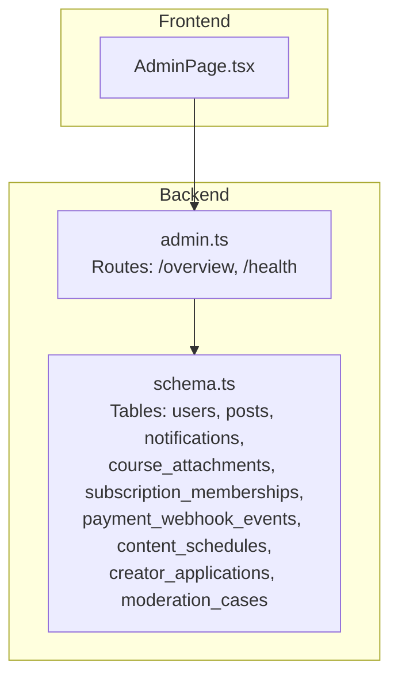
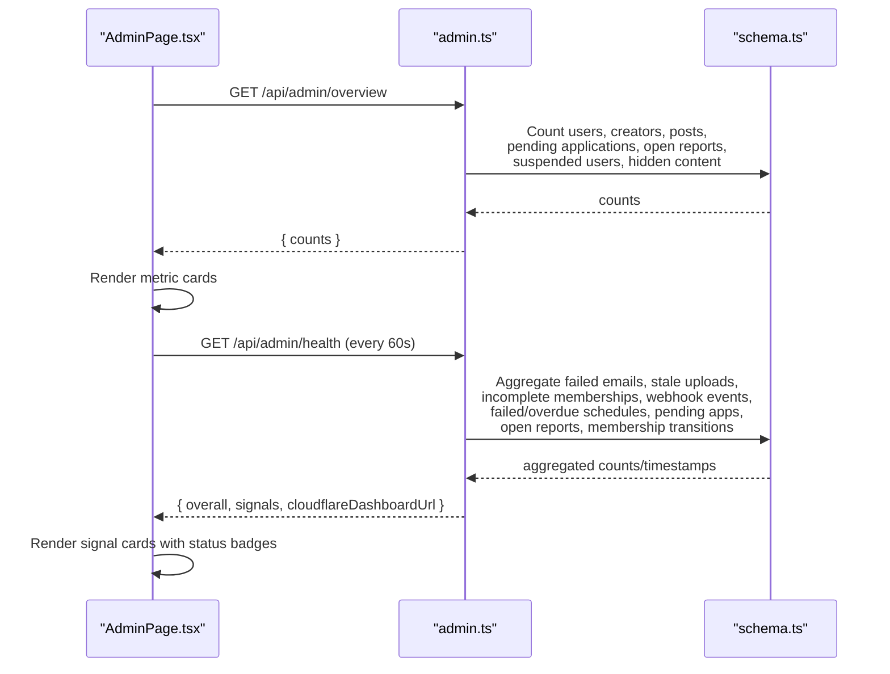
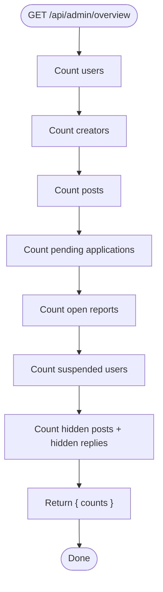
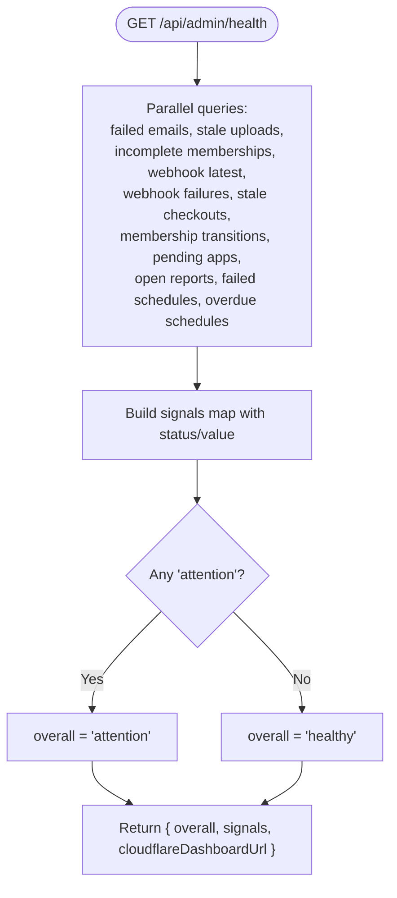
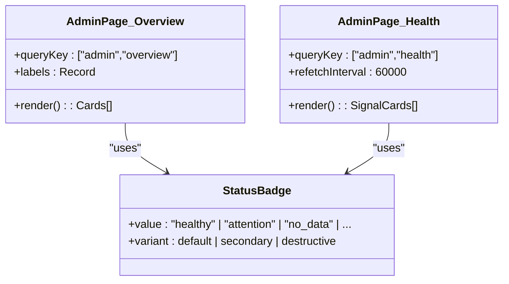
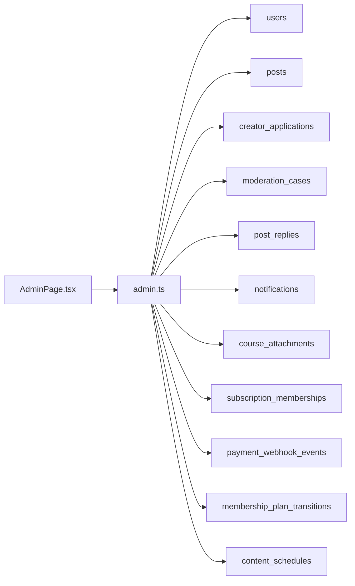

# Admin Overview and Dashboard

<cite>
**Referenced Files in This Document**
- [admin.ts](file://src/worker/routes/admin.ts)
- [AdminPage.tsx](file://src/react-app/pages/AdminPage.tsx)
- [schema.ts](file://src/worker/db/schema.ts)
- [notifications.ts](file://src/worker/lib/notifications.ts)
</cite>

## Table of Contents
1. [Introduction](#introduction)
2. [Project Structure](#project-structure)
3. [Core Components](#core-components)
4. [Architecture Overview](#architecture-overview)
5. [Detailed Component Analysis](#detailed-component-analysis)
6. [Dependency Analysis](#dependency-analysis)
7. [Performance Considerations](#performance-considerations)
8. [Troubleshooting Guide](#troubleshooting-guide)
9. [Conclusion](#conclusion)

## Introduction
This document explains the admin dashboard overview and platform health monitoring system. It covers:
- The /overview endpoint that returns key platform metrics such as user counts, creator statistics, content volume, pending applications, open reports, suspended users, and hidden content.
- The /health endpoint that aggregates system health signals including D1 database status, failed notification emails, stale course uploads, incomplete memberships, content scheduling issues, Stripe webhook processing, and review workload indicators.
- The admin UI components that display these metrics with visual indicators (healthy, attention, no_data states).
- Practical examples for administrators to monitor platform performance and identify areas requiring attention.

## Project Structure
The admin functionality is implemented across two layers:
- Backend API routes under src/worker/routes/admin.ts define /overview and /health endpoints and query the database schema defined in src/worker/db/schema.ts.
- Frontend admin pages under src/react-app/pages/AdminPage.tsx render the overview cards and health signal cards with status badges.

**Diagram sources**
- [admin.ts](file://src/worker/routes/admin.ts)
- [AdminPage.tsx](file://src/react-app/pages/AdminPage.tsx)
- [schema.ts](file://src/worker/db/schema.ts)

**Section sources**
- [admin.ts](file://src/worker/routes/admin.ts)
- [AdminPage.tsx](file://src/react-app/pages/AdminPage.tsx)
- [schema.ts](file://src/worker/db/schema.ts)

## Core Components
- Overview endpoint (/api/admin/overview): Returns a single object with counts for users, creators, content, pending applications, open reports, suspended users, and hidden content.
- Health endpoint (/api/admin/health): Returns an overall status and per-signal details with status values healthy, attention, or no_data. Signals include D1 availability, failed notification emails, stale course uploads, incomplete memberships, content schedules, Stripe webhooks and failures, stale checkouts, membership transitions, and review workload.
- Admin UI:
  - Overview section renders metric cards from the /overview response.
  - Health section polls /health every 60 seconds and displays each signal card with a status badge and value.

**Section sources**
- [admin.ts](file://src/worker/routes/admin.ts)
- [AdminPage.tsx](file://src/react-app/pages/AdminPage.tsx)

## Architecture Overview
The admin dashboard follows a simple request/response pattern:
- The frontend calls /api/admin/overview and /api/admin/health.
- The backend queries multiple tables concurrently and computes derived statuses.
- The frontend renders results using consistent status badges.

**Diagram sources**
- [admin.ts](file://src/worker/routes/admin.ts)
- [AdminPage.tsx](file://src/react-app/pages/AdminPage.tsx)
- [schema.ts](file://src/worker/db/schema.ts)

## Detailed Component Analysis

### Overview Endpoint (/api/admin/overview)
- Purpose: Provide a quick snapshot of platform scale and moderation load.
- Data sources:
  - users: total users and creators
  - posts: total content
  - creator_applications: pending applications
  - moderation_cases: open reports
  - post_replies: hidden replies
- Response shape: { counts: { users, creators, content, pendingApplications, openReports, suspendedUsers, hiddenContent } }
- UI behavior: Renders one card per metric with label mapping.

**Diagram sources**
- [admin.ts](file://src/worker/routes/admin.ts)
- [schema.ts](file://src/worker/db/schema.ts)

**Section sources**
- [admin.ts](file://src/worker/routes/admin.ts)
- [AdminPage.tsx](file://src/react-app/pages/AdminPage.tsx)
- [schema.ts](file://src/worker/db/schema.ts)

### Health Endpoint (/api/admin/health)
- Purpose: Provide a consolidated view of operational health signals to quickly identify issues.
- Key signals and logic:
  - d1: Always healthy when reachable; value indicates availability.
  - failedNotificationEmails: Counts recent failed email notifications; attention if > 0.
  - staleCourseUploads: Counts pending course attachments older than 24 hours; attention if > 0.
  - incompleteMemberships: Counts subscriptions in past_due or incomplete; attention if > 0.
  - contentSchedules: Combines failed and overdue schedule items; attention if any exist.
  - stripeWebhooks: Healthy if at least one processed event exists; otherwise no_data.
  - stripeSandbox: Healthy if configured; otherwise attention with configuration error.
  - stripeWebhookFailures: Attention if recent failures exist.
  - staleStripeCheckouts: Attention if pending checkout sessions are stuck beyond 24 hours.
  - membershipTransitions: Attention if plan transition failures exist.
  - reviewWorkload: Attention if combined pending applications and open reports exceed a threshold.
- Overall status: attention if any signal is attention; otherwise healthy.
- Additional data: Optional Cloudflare dashboard URL for external metrics.

**Diagram sources**
- [admin.ts](file://src/worker/routes/admin.ts)
- [schema.ts](file://src/worker/db/schema.ts)

**Section sources**
- [admin.ts](file://src/worker/routes/admin.ts)
- [schema.ts](file://src/worker/db/schema.ts)

### Admin UI Components
- Overview component:
  - Fetches /api/admin/overview once on mount.
  - Maps keys to human-readable labels and renders numeric cards.
- Health component:
  - Polls /api/admin/health every 60 seconds.
  - Displays overall status badge and a grid of signal cards.
  - Each card shows a capitalized signal name, a status badge (healthy, attention, no_data), and a formatted value (object or string).
  - Optionally links to Cloudflare metrics if provided by the backend.

**Diagram sources**
- [AdminPage.tsx](file://src/react-app/pages/AdminPage.tsx)

**Section sources**
- [AdminPage.tsx](file://src/react-app/pages/AdminPage.tsx)

## Dependency Analysis
- Backend dependencies:
  - Database tables used by /overview: users, posts, creator_applications, moderation_cases, post_replies.
  - Database tables used by /health: notifications, course_attachments, subscription_memberships, payment_webhook_events, membership_plan_transitions, creator_applications, moderation_cases, content_schedules.
- Frontend dependencies:
  - React Query for data fetching and caching.
  - UI primitives: Card, Badge, Button, Table, Dialog, Select.
- Cross-cutting:
  - Notification creation may trigger email delivery and update emailStatus fields, which feed into the failedNotificationEmails signal.

**Diagram sources**
- [admin.ts](file://src/worker/routes/admin.ts)
- [schema.ts](file://src/worker/db/schema.ts)
- [AdminPage.tsx](file://src/react-app/pages/AdminPage.tsx)

**Section sources**
- [admin.ts](file://src/worker/routes/admin.ts)
- [schema.ts](file://src/worker/db/schema.ts)
- [AdminPage.tsx](file://src/react-app/pages/AdminPage.tsx)

## Performance Considerations
- Concurrency: The health endpoint uses parallel queries to minimize latency while aggregating many signals.
- Caching: The frontend uses React Query with a 60-second refetch interval for health data to balance freshness and load.
- Indexing: Ensure indexes exist on frequently filtered columns (e.g., account_status, moderation_status, emailStatus, status, createdAt, nextAttemptAt) to keep count queries fast.
- Pagination: Other admin endpoints paginate results; consider similar patterns for large datasets if new metrics are added.

[No sources needed since this section provides general guidance]

## Troubleshooting Guide
- No data for stripeWebhooks: Indicates no processed webhook events yet; verify Stripe integration and webhook ingestion pipeline.
- Attention on failedNotificationEmails: Investigate email provider errors and retry policies; check emailError fields in notifications.
- Stale course uploads: Review pending course attachments older than 24 hours; ensure upload completion and processing jobs run.
- Incomplete memberships: Inspect subscription_memberships with past_due or incomplete; follow up with payment retries or customer outreach.
- Content schedules failed/overdue: Check content_schedules for failed statuses and overdue nextAttemptAt; investigate publishing pipeline and retries.
- Review workload attention: If pending applications plus open reports exceed the threshold, allocate more moderator capacity or automate triage.

**Section sources**
- [admin.ts](file://src/worker/routes/admin.ts)
- [notifications.ts](file://src/worker/lib/notifications.ts)
- [schema.ts](file://src/worker/db/schema.ts)

## Conclusion
The admin overview and health endpoints provide a concise, actionable view of platform metrics and operational health. Administrators can use the overview to gauge scale and moderation load, and the health dashboard to quickly detect and prioritize issues across notifications, payments, content scheduling, and reviews. Consistent status indicators (healthy, attention, no_data) make it easy to scan and act.

[No sources needed since this section summarizes without analyzing specific files]