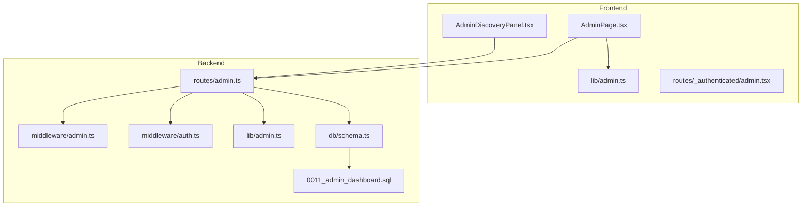
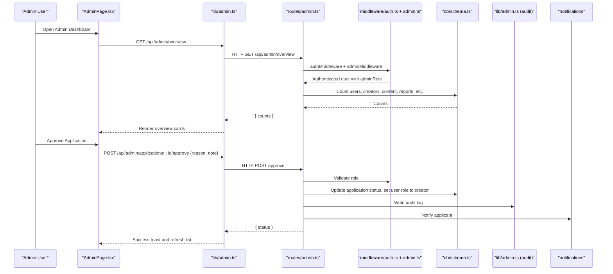
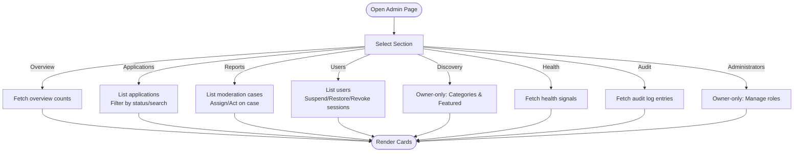
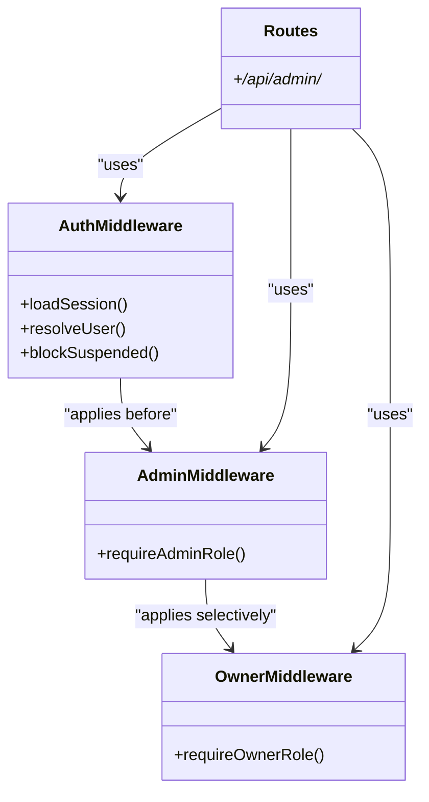
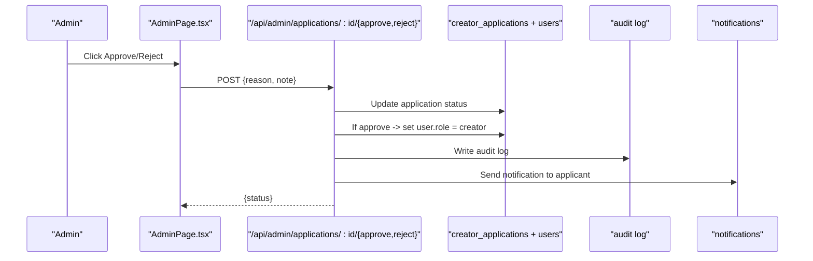
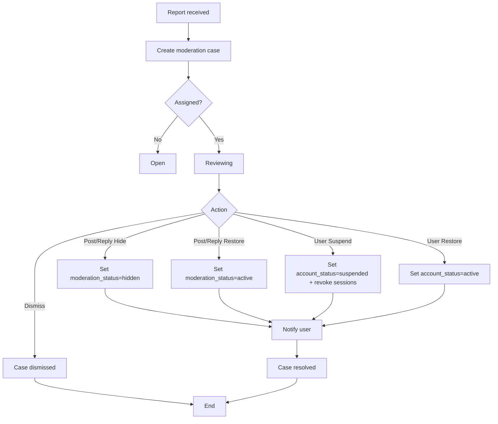
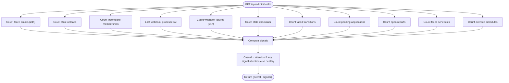
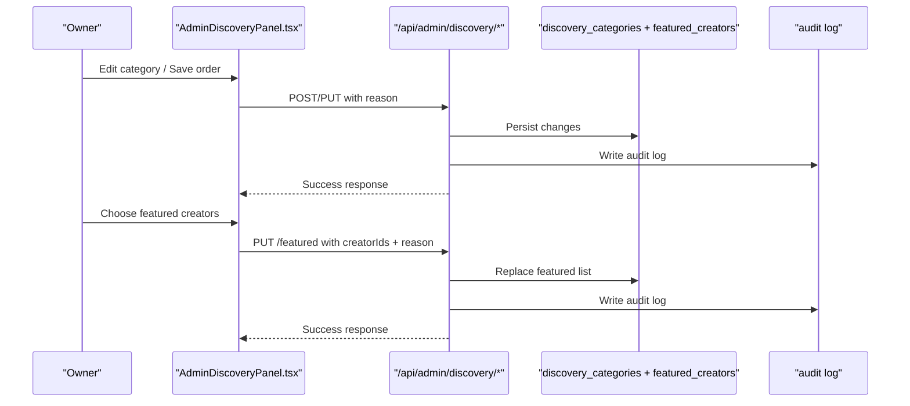
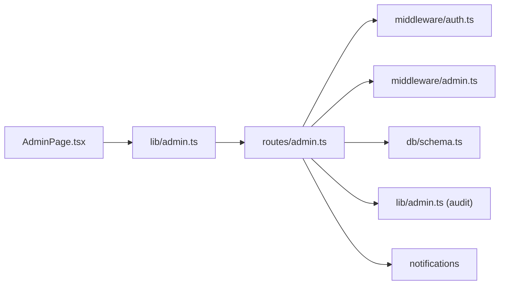

# Administration Dashboard

<cite>
**Referenced Files in This Document**
- [AdminPage.tsx](file://src/react-app/pages/AdminPage.tsx)
- [admin.ts (React lib)](file://src/react-app/lib/admin.ts)
- [admin.ts (Worker routes)](file://src/worker/routes/admin.ts)
- [admin.ts (Worker lib)](file://src/worker/lib/admin.ts)
- [auth.ts (Worker middleware)](file://src/worker/middleware/auth.ts)
- [admin.ts (Worker middleware)](file://src/worker/middleware/admin.ts)
- [0011_admin_dashboard.sql](file://drizzle/0011_admin_dashboard.sql)
- [schema.ts](file://src/worker/db/schema.ts)
- [admin.tsx (Route guard)](file://src/react-app/routes/_authenticated/admin.tsx)
- [AdminDiscoveryPanel.tsx](file://src/react-app/components/AdminDiscoveryPanel.tsx)
</cite>

## Table of Contents
1. Introduction
2. Project Structure
3. Core Components
4. Architecture Overview
5. Detailed Component Analysis
6. Dependency Analysis
7. Performance Considerations
8. Troubleshooting Guide
9. Conclusion
10. Appendices

## Introduction
This document explains Zenith’s administration dashboard and platform management features. It covers user moderation, content review and approval workflows, platform analytics and reporting, creator approval processes, administrative controls, admin-specific API endpoints, permission systems for different admin roles, bulk operations, platform health monitoring, admin UI components, data visualization, moderation tools, security considerations, audit logging, and privacy compliance. It also provides examples of common administrative tasks and guidance for customizing admin workflows.

## Project Structure
The administration system spans the React frontend and the worker backend:
- Frontend Admin UI: A single-page dashboard with sections for overview, creator applications, reports, users, discovery, health, audit log, and administrators.
- Backend Admin APIs: Hono-based routes under /api/admin that enforce authentication and role-based authorization, perform database operations, emit notifications, and write audit logs.
- Data Model: Drizzle schema and migrations define tables for users, admin memberships, creator applications, moderation cases, content reports, and audit logs.

**Diagram sources**
- [AdminPage.tsx](file://src/react-app/pages/AdminPage.tsx)
- [admin.ts (React lib)](file://src/react-app/lib/admin.ts)
- [AdminDiscoveryPanel.tsx](file://src/react-app/components/AdminDiscoveryPanel.tsx)
- [admin.ts (Worker routes)](file://src/worker/routes/admin.ts)
- [admin.ts (Worker middleware)](file://src/worker/middleware/admin.ts)
- [auth.ts (Worker middleware)](file://src/worker/middleware/auth.ts)
- [admin.ts (Worker lib)](file://src/worker/lib/admin.ts)
- [schema.ts](file://src/worker/db/schema.ts)
- [0011_admin_dashboard.sql](file://drizzle/0011_admin_dashboard.sql)

**Section sources**
- [AdminPage.tsx](file://src/react-app/pages/AdminPage.tsx)
- [admin.ts (Worker routes)](file://src/worker/routes/admin.ts)
- [schema.ts](file://src/worker/db/schema.ts)
- [0011_admin_dashboard.sql](file://drizzle/0011_admin_dashboard.sql)

## Core Components
- Admin UI Sections: Overview counts, Creator Applications, Reports, Users, Discovery, Health, Audit Log, Administrators.
- Permission System: Owner and Moderator roles enforced via middleware; owner-only endpoints protected by a stricter guard.
- Moderation Workflow: Case assignment, actions (hide/restore/suspend/restore_user/dismiss), status transitions, and notifications.
- Creator Approval: Approve/reject applications, grant creator role, and notify applicants.
- Platform Health: Aggregated signals across email failures, stale uploads, membership issues, webhooks, scheduling, and review workload.
- Audit Logging: Every admin action is recorded with actor, target, reason, and metadata.

**Section sources**
- [AdminPage.tsx](file://src/react-app/pages/AdminPage.tsx)
- [admin.ts (Worker routes)](file://src/worker/routes/admin.ts)
- [admin.ts (Worker lib)](file://src/worker/lib/admin.ts)
- [auth.ts (Worker middleware)](file://src/worker/middleware/auth.ts)
- [admin.ts (Worker middleware)](file://src/worker/middleware/admin.ts)

## Architecture Overview
The admin dashboard follows a clear separation of concerns:
- The React app calls typed admin endpoints using shared helpers.
- Worker routes validate inputs, enforce permissions, mutate state, send notifications, and persist audit logs.
- Database schema defines entities and indexes to support efficient queries and constraints.

**Diagram sources**
- [AdminPage.tsx](file://src/react-app/pages/AdminPage.tsx)
- [admin.ts (React lib)](file://src/react-app/lib/admin.ts)
- [admin.ts (Worker routes)](file://src/worker/routes/admin.ts)
- [auth.ts (Worker middleware)](file://src/worker/middleware/auth.ts)
- [admin.ts (Worker middleware)](file://src/worker/middleware/admin.ts)
- [admin.ts (Worker lib)](file://src/worker/lib/admin.ts)
- [schema.ts](file://src/worker/db/schema.ts)

## Detailed Component Analysis

### Admin UI: Sections and Controls
- Overview: Displays key metrics fetched from /api/admin/overview.
- Creator Applications: Paginated list with search and status filters; detail dialog; approve/reject flows requiring reason and optional note.
- Reports: Paginated moderation cases with assign, dismiss, hide/restore, suspend/restore_user; status transitions and audit reasons.
- Users: Searchable and filterable user list; suspend/restore and revoke sessions; per-user history view.
- Discovery: Owner-only panel for categories and featured creators; CRUD and ordering with audit reasons.
- Health: Aggregated signals indicating healthy or attention states across services.
- Audit Log: Filterable list of admin actions with actor details and timestamps.
- Administrators: Owner-only listing and role changes; revocation with safety checks.

**Diagram sources**
- [AdminPage.tsx](file://src/react-app/pages/AdminPage.tsx)

**Section sources**
- [AdminPage.tsx](file://src/react-app/pages/AdminPage.tsx)
- [AdminDiscoveryPanel.tsx](file://src/react-app/components/AdminDiscoveryPanel.tsx)

### Permission System and Role Guards
- Authentication: Middleware loads session, resolves user, and attaches adminRole. Suspended accounts are blocked.
- Authorization:
  - adminMiddleware: Requires any adminRole (owner or moderator).
  - ownerMiddleware: Requires adminRole === 'owner'.
- Role Enforcement:
  - Moderators cannot act on other administrators.
  - Owner removal/demotion ensures at least one owner remains.

**Diagram sources**
- [auth.ts (Worker middleware)](file://src/worker/middleware/auth.ts)
- [admin.ts (Worker middleware)](file://src/worker/middleware/admin.ts)
- [admin.ts (Worker routes)](file://src/worker/routes/admin.ts)

**Section sources**
- [auth.ts (Worker middleware)](file://src/worker/middleware/auth.ts)
- [admin.ts (Worker middleware)](file://src/worker/middleware/admin.ts)
- [admin.ts (Worker routes)](file://src/worker/routes/admin.ts)

### Creator Approval Workflow
- List applications with pagination and filters.
- View details and download identity documents.
- Approve: Set application status to approved, update user role to creator, notify applicant, and log audit entry.
- Reject: Set application status to rejected, record decision reason, notify applicant, and log audit entry.

**Diagram sources**
- [AdminPage.tsx](file://src/react-app/pages/AdminPage.tsx)
- [admin.ts (Worker routes)](file://src/worker/routes/admin.ts)
- [schema.ts](file://src/worker/db/schema.ts)

**Section sources**
- [AdminPage.tsx](file://src/react-app/pages/AdminPage.tsx)
- [admin.ts (Worker routes)](file://src/worker/routes/admin.ts)
- [schema.ts](file://src/worker/db/schema.ts)

### Moderation and Reporting Workflow
- Cases created when content is reported; can be assigned to an admin.
- Actions depend on target type:
  - Post/Reply: hide, restore, dismiss.
  - User: suspend, restore_user, dismiss.
- Status transitions: open → reviewing → resolved/dismissed.
- Notifications sent to affected users when content is hidden/restored.

**Diagram sources**
- [admin.ts (Worker routes)](file://src/worker/routes/admin.ts)
- [schema.ts](file://src/worker/db/schema.ts)

**Section sources**
- [admin.ts (Worker routes)](file://src/worker/routes/admin.ts)
- [schema.ts](file://src/worker/db/schema.ts)

### Platform Health Monitoring
- Aggregates signals:
  - Failed notification emails (last 24h)
  - Stale course attachments
  - Incomplete/past_due memberships
  - Stripe webhook last processed timestamp and failure count
  - Stale checkout sessions
  - Membership plan transition failures
  - Pending applications and open reports
  - Content schedule failures and overdue attempts
- Overall status is healthy unless any signal indicates attention.

**Diagram sources**
- [admin.ts (Worker routes)](file://src/worker/routes/admin.ts)

**Section sources**
- [admin.ts (Worker routes)](file://src/worker/routes/admin.ts)

### Discovery Management (Owner-only)
- Categories: Create, update, toggle active, reorder display order; all changes require audit reason.
- Featured Creators: Select up to a fixed maximum; order and persist; requires eligibility validation and audit reason.

**Diagram sources**
- [AdminDiscoveryPanel.tsx](file://src/react-app/components/AdminDiscoveryPanel.tsx)
- [admin.ts (Worker routes)](file://src/worker/routes/admin.ts)
- [schema.ts](file://src/worker/db/schema.ts)

**Section sources**
- [AdminDiscoveryPanel.tsx](file://src/react-app/components/AdminDiscoveryPanel.tsx)
- [admin.ts (Worker routes)](file://src/worker/routes/admin.ts)
- [schema.ts](file://src/worker/db/schema.ts)

### Admin UI Components and Data Visualization
- Overview cards render counts returned by /api/admin/overview.
- Tables use pagination controls and filters for applications, reports, and users.
- Status badges reflect current state (e.g., active, suspended, hidden, pending).
- Dialogs capture required reasons and optional notes for audit trails.

**Section sources**
- [AdminPage.tsx](file://src/react-app/pages/AdminPage.tsx)

## Dependency Analysis
- Frontend depends on:
  - React Query for data fetching and caching.
  - Shared API helpers for authenticated requests and admin decision payloads.
- Backend depends on:
  - Hono routing and Zod validators for input validation.
  - Drizzle ORM and raw SQL for queries and mutations.
  - Notification service for user messaging.
  - Audit logger for immutable records.
- Security dependencies:
  - Session-based authentication.
  - Role-based middleware guards.
  - Safety checks preventing demotion/removal of the last owner.

**Diagram sources**
- [AdminPage.tsx](file://src/react-app/pages/AdminPage.tsx)
- [admin.ts (React lib)](file://src/react-app/lib/admin.ts)
- [admin.ts (Worker routes)](file://src/worker/routes/admin.ts)
- [auth.ts (Worker middleware)](file://src/worker/middleware/auth.ts)
- [admin.ts (Worker middleware)](file://src/worker/middleware/admin.ts)
- [admin.ts (Worker lib)](file://src/worker/lib/admin.ts)
- [schema.ts](file://src/worker/db/schema.ts)

**Section sources**
- [admin.ts (Worker routes)](file://src/worker/routes/admin.ts)
- [auth.ts (Worker middleware)](file://src/worker/middleware/auth.ts)
- [admin.ts (Worker middleware)](file://src/worker/middleware/admin.ts)

## Performance Considerations
- Pagination: All list endpoints return page, pageSize, and total; default pageSize capped to prevent heavy queries.
- Indexes: Schema includes indexes on frequently filtered columns (account_status, moderation_status, status+updated_at, etc.).
- Batch Operations: Approve application updates both application and user in a single batch.
- Parallel Health Checks: Health endpoint aggregates multiple counts concurrently.
- Client-side Caching: React Query caches admin data and invalidates on mutations to reduce redundant requests.

[No sources needed since this section provides general guidance]

## Troubleshooting Guide
- Access Denied:
  - Ensure the user has an adminRole; suspended accounts are blocked by auth middleware.
  - Owner-only endpoints require adminRole === 'owner'.
- Validation Errors:
  - Reason fields must meet minimum length; payload schemas validated via Zod.
- Not Found:
  - Verify IDs for applications, reports, users, and categories exist.
- Audit Logs:
  - Use the Audit Log section to trace actions, actors, targets, reasons, and timestamps.
- Health Signals:
  - Investigate attention signals (failed emails, stale uploads, webhook failures, schedule issues) and resolve underlying causes.

**Section sources**
- [auth.ts (Worker middleware)](file://src/worker/middleware/auth.ts)
- [admin.ts (Worker routes)](file://src/worker/routes/admin.ts)
- [AdminPage.tsx](file://src/react-app/pages/AdminPage.tsx)

## Conclusion
Zenith’s administration dashboard provides a comprehensive, secure, and auditable interface for managing users, content, creator approvals, and platform settings. Role-based access control, robust validation, and detailed audit logging ensure safe operations. The health monitoring and moderation workflows enable proactive platform governance.

[No sources needed since this section summarizes without analyzing specific files]

## Appendices

### Admin API Endpoints Summary
- Overview
  - GET /api/admin/overview
- Health
  - GET /api/admin/health
- Creator Applications
  - GET /api/admin/applications
  - GET /api/admin/applications/:id
  - GET /api/admin/applications/:id/document
  - POST /api/admin/applications/:id/approve
  - POST /api/admin/applications/:id/reject
- Reports
  - GET /api/admin/reports
  - GET /api/admin/reports/:id
  - POST /api/admin/reports/:id/assign
  - POST /api/admin/reports/:id/action
- Users
  - GET /api/admin/users
  - GET /api/admin/users/:id
  - POST /api/admin/users/:id/suspend
  - POST /api/admin/users/:id/restore
  - POST /api/admin/users/:id/revoke-sessions
- Discovery (Owner-only)
  - GET /api/admin/discovery/categories
  - POST /api/admin/discovery/categories
  - PUT /api/admin/discovery/categories/order
  - PUT /api/admin/discovery/categories/:id
  - GET /api/admin/discovery/eligible-creators
  - GET /api/admin/discovery/featured
  - PUT /api/admin/discovery/featured
- Audit Log
  - GET /api/admin/audit-log
- Administrators (Owner-only)
  - GET /api/admin/administrators
  - POST /api/admin/administrators/:userId
  - DELETE /api/admin/administrators/:userId

**Section sources**
- [admin.ts (Worker routes)](file://src/worker/routes/admin.ts)

### Data Models Relevant to Admin
- Users: role, accountStatus, suspensionReason, suspendedAt, suspendedBy.
- Admin Memberships: userId, role (owner/moderator), grantedBy, timestamps.
- Creator Applications: id, userId, fullName, city, country, nidNumber, nidDocumentR2Key, socialLinks, contentLinks, status, reviewedBy, reviewedAt, decisionReason, adminNote, resubmittedAt.
- Moderation Cases: targetType, targetId, status, assignedAdminId, resolutionAction, resolutionNote, resolvedBy, resolvedAt.
- Content Reports: caseId, reporterId, reason, details.
- Audit Logs: actorId, action, targetType, targetId, reason, metadata.

**Section sources**
- [schema.ts](file://src/worker/db/schema.ts)
- [0011_admin_dashboard.sql](file://drizzle/0011_admin_dashboard.sql)

### Common Administrative Tasks
- Approve a creator application:
  - Navigate to Creator Applications, open details, click Approve, provide reason, confirm.
- Review and act on a report:
  - Open Reports, assign to yourself, choose action (hide/restore/suspend/restore_user/dismiss), provide reason.
- Suspend a user:
  - Go to Users, find user, select Suspend, enter reason.
- Revoke sessions:
  - From user detail, choose Revoke sessions, provide reason.
- Manage discovery categories:
  - Add/edit categories, toggle active, reorder, save with reason.
- Curate featured creators:
  - Search eligible creators, add/remove, order, save with reason.
- Monitor platform health:
  - Check Health section, investigate attention signals, resolve issues.
- Review audit log:
  - Filter by action, inspect actor and target details.

**Section sources**
- [AdminPage.tsx](file://src/react-app/pages/AdminPage.tsx)
- [AdminDiscoveryPanel.tsx](file://src/react-app/components/AdminDiscoveryPanel.tsx)
- [admin.ts (Worker routes)](file://src/worker/routes/admin.ts)

### Security and Privacy Considerations
- Authentication and Authorization:
  - Session-based auth with adminRole enforcement; suspended accounts blocked.
  - Owner-only endpoints restricted to owners.
- Safety Constraints:
  - Prevent removing or demoting the last owner.
  - Moderators cannot act on administrators.
- Auditability:
  - All admin actions logged with actor, target, reason, and metadata.
- Data Privacy:
  - Identity documents accessed via secure R2 keys; only viewed through authorized endpoints.
  - Minimize exposure of sensitive fields in responses.

**Section sources**
- [auth.ts (Worker middleware)](file://src/worker/middleware/auth.ts)
- [admin.ts (Worker middleware)](file://src/worker/middleware/admin.ts)
- [admin.ts (Worker routes)](file://src/worker/routes/admin.ts)
- [admin.ts (Worker lib)](file://src/worker/lib/admin.ts)

### Route Guard for Admin Pages
- The authenticated route redirects non-admin users away from /admin.

**Section sources**
- [admin.tsx (Route guard)](file://src/react-app/routes/_authenticated/admin.tsx)