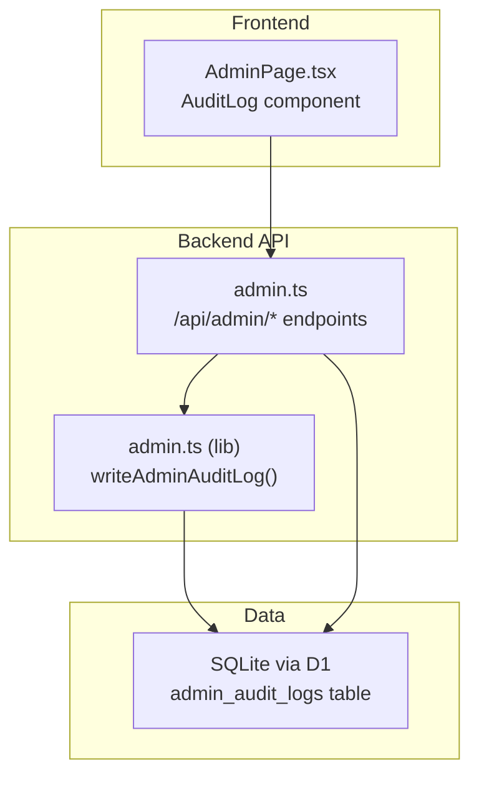
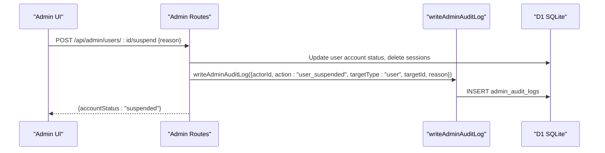
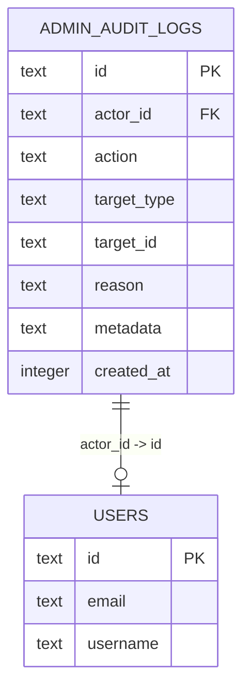
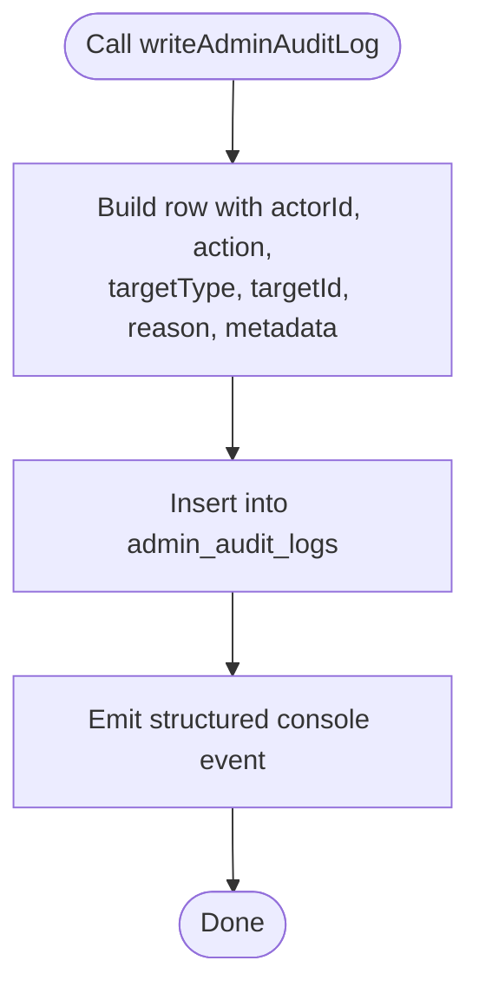
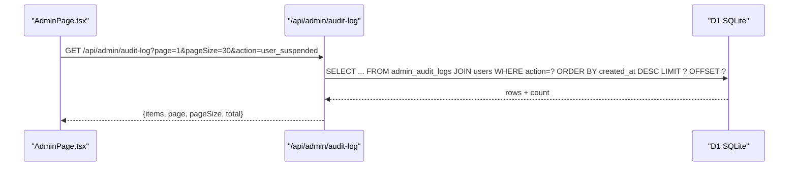
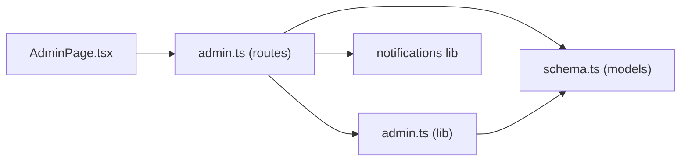

# Audit Logging and Compliance

<cite>
**Referenced Files in This Document**
- [schema.ts](file://src/worker/db/schema.ts)
- [admin.ts](file://src/worker/routes/admin.ts)
- [admin.ts (lib)](file://src/worker/lib/admin.ts)
- [AdminPage.tsx](file://src/react-app/pages/AdminPage.tsx)
- [discovery.test.ts](file://src/worker/routes/discovery.test.ts)
</cite>

## Table of Contents
1. [Introduction](#introduction)
2. [Project Structure](#project-structure)
3. [Core Components](#core-components)
4. [Architecture Overview](#architecture-overview)
5. [Detailed Component Analysis](#detailed-component-analysis)
6. [Dependency Analysis](#dependency-analysis)
7. [Performance Considerations](#performance-considerations)
8. [Troubleshooting Guide](#troubleshooting-guide)
9. [Conclusion](#conclusion)
10. [Appendices](#appendices)

## Introduction
This document describes the comprehensive audit logging system that records all administrative actions across the platform. It explains the data model, the set of action types captured, the querying interface for browsing and filtering logs, and how to use audit logs for compliance reporting, incident investigation, and understanding administrative workflows. It also covers security implications, privacy considerations, and recommended retention policies.

## Project Structure
The audit logging system spans three layers:
- Data layer: a dedicated table stores audit entries with actor, action, target, reason, metadata, and timestamp.
- API layer: admin routes write audit entries for every sensitive operation and expose a paginated query endpoint.
- UI layer: an Admin page renders the audit log with pagination and displays key fields for quick triage.

**Diagram sources**
- [AdminPage.tsx:943-998](file://src/react-app/pages/AdminPage.tsx#L943-L998)
- [admin.ts:476-485](file://src/worker/routes/admin.ts#L476-L485)
- [admin.ts (lib):7-31](file://src/worker/lib/admin.ts#L7-L31)
- [schema.ts:655-667](file://src/worker/db/schema.ts#L655-L667)

**Section sources**
- [schema.ts:655-667](file://src/worker/db/schema.ts#L655-L667)
- [admin.ts:476-485](file://src/worker/routes/admin.ts#L476-L485)
- [admin.ts (lib):7-31](file://src/worker/lib/admin.ts#L7-L31)
- [AdminPage.tsx:943-998](file://src/react-app/pages/AdminPage.tsx#L943-L998)

## Core Components
- Audit log schema: defines the immutable record structure including actor, action, target entity, reason, optional structured metadata, and creation time.
- Write function: centralizes insertion and emits a structured console event for observability.
- Admin routes: call the write function after performing privileged operations and expose a filtered, paginated query endpoint.
- Admin UI: presents the audit log with columns for administrator, action, target, reason, and time; supports pagination.

Key responsibilities:
- Consistent action naming and target typing to enable reliable filtering and aggregation.
- Optional reason field to capture human-readable justification.
- Optional JSON metadata to store before/after state or contextual details without bloaching core fields.
- Timestamps stored as epoch seconds for efficient indexing and sorting.

**Section sources**
- [schema.ts:655-667](file://src/worker/db/schema.ts#L655-L667)
- [admin.ts (lib):7-31](file://src/worker/lib/admin.ts#L7-L31)
- [admin.ts:476-485](file://src/worker/routes/admin.ts#L476-L485)
- [AdminPage.tsx:943-998](file://src/react-app/pages/AdminPage.tsx#L943-L998)

## Architecture Overview
The audit flow is triggered by admin operations and recorded atomically alongside business changes. The same table powers both per-entity history views and global audit browsing.

**Diagram sources**
- [admin.ts:334-342](file://src/worker/routes/admin.ts#L334-L342)
- [admin.ts (lib):7-31](file://src/worker/lib/admin.ts#L7-L31)
- [schema.ts:655-667](file://src/worker/db/schema.ts#L655-L667)

## Detailed Component Analysis

### Audit Log Schema and Indices
- Fields: id, actor_id, action, target_type, target_id, reason, metadata, created_at.
- Indexes: on created_at and composite (actor_id, created_at) to support recent-time queries and per-actor timelines.
- Foreign key: actor_id references users with restrict deletion to preserve audit integrity.

**Diagram sources**
- [schema.ts:655-667](file://src/worker/db/schema.ts#L655-L667)

**Section sources**
- [schema.ts:655-667](file://src/worker/db/schema.ts#L655-L667)

### Writing Audit Entries
- Centralized writer ensures consistent formatting and persists structured metadata as JSON when provided.
- Emits a structured console event for external log collectors.

**Diagram sources**
- [admin.ts (lib):7-31](file://src/worker/lib/admin.ts#L7-L31)

**Section sources**
- [admin.ts (lib):7-31](file://src/worker/lib/admin.ts#L7-L31)

### Action Types Logged
The following administrative actions are logged with their typical targets and reasons:
- Creator application decisions: creator_application_approved, creator_application_rejected
- User lifecycle: user_suspended, user_restored
- Session management: sessions_revoked
- Moderation workflow: moderation_case_assigned, moderation_hide, moderation_restore, moderation_suspend, moderation_restore_user, moderation_dismiss
- Administrator roles: administrator_role_changed, administrator_revoked
- Discovery taxonomy: discovery_category_created, discovery_category_updated, discovery_categories_reordered
- Featured curation: featured_creators_replaced
- Sensitive content access: creator_document_viewed

These actions are emitted immediately after the corresponding state change to ensure chronological accuracy.

**Section sources**
- [admin.ts:209-236](file://src/worker/routes/admin.ts#L209-L236)
- [admin.ts:261-305](file://src/worker/routes/admin.ts#L261-L305)
- [admin.ts:334-364](file://src/worker/routes/admin.ts#L334-L364)
- [admin.ts:374-420](file://src/worker/routes/admin.ts#L374-L420)
- [admin.ts:422-441](file://src/worker/routes/admin.ts#L422-L441)
- [admin.ts:452-474](file://src/worker/routes/admin.ts#L452-L474)
- [admin.ts:492-512](file://src/worker/routes/admin.ts#L492-L512)
- [admin.ts:196-207](file://src/worker/routes/admin.ts#L196-L207)

### Audit Log Querying Interface
- Endpoint: GET /api/admin/audit-log
- Parameters:
  - page: current page number (default 1)
  - pageSize: items per page (default 20, max 50)
  - action: optional filter by exact action string
- Response:
  - items: array of entries with actorEmail, action, targetType, targetId, reason, createdAt
  - page, pageSize, total: pagination metadata

**Diagram sources**
- [admin.ts:476-485](file://src/worker/routes/admin.ts#L476-L485)
- [AdminPage.tsx:943-998](file://src/react-app/pages/AdminPage.tsx#L943-L998)

**Section sources**
- [admin.ts:476-485](file://src/worker/routes/admin.ts#L476-L485)
- [AdminPage.tsx:943-998](file://src/react-app/pages/AdminPage.tsx#L943-L998)

### Per-Entity History View
- Endpoint: GET /api/admin/users/:id returns user details plus last 50 audit entries where target_type='user' and target_id matches.
- Useful for investigating a specific user’s administrative history.

**Section sources**
- [admin.ts:325-332](file://src/worker/routes/admin.ts#L325-L332)

### Tests Confirming Audit Emission
- Tests assert that category creation and featured creators replacement emit expected audit actions for the acting owner.

**Section sources**
- [discovery.test.ts:123-149](file://src/worker/routes/discovery.test.ts#L123-L149)

## Dependency Analysis
- Admin routes depend on:
  - Drizzle ORM models for schema definitions
  - writeAdminAuditLog utility for consistent logging
  - Notification utilities for user-facing messages
  - Middleware for authentication and authorization
- The audit table is referenced by:
  - Global audit log endpoint
  - Per-user history endpoint
  - Tests validating audit emission

**Diagram sources**
- [admin.ts:1-35](file://src/worker/routes/admin.ts#L1-L35)
- [admin.ts (lib):1-5](file://src/worker/lib/admin.ts#L1-L5)
- [schema.ts:655-667](file://src/worker/db/schema.ts#L655-L667)
- [AdminPage.tsx:943-998](file://src/react-app/pages/AdminPage.tsx#L943-L998)

**Section sources**
- [admin.ts:1-35](file://src/worker/routes/admin.ts#L1-L35)
- [admin.ts (lib):1-5](file://src/worker/lib/admin.ts#L1-L5)
- [schema.ts:655-667](file://src/worker/db/schema.ts#L655-L667)
- [AdminPage.tsx:943-998](file://src/react-app/pages/AdminPage.tsx#L943-L998)

## Performance Considerations
- Index usage: created_at and (actor_id, created_at) indexes support efficient recent-time queries and per-actor timelines.
- Pagination: enforced limits prevent large result sets; default page size is capped at 50.
- Join cost: actor_email is joined from users; consider materializing frequently accessed attributes if needed.
- Metadata storage: keep metadata compact; avoid large payloads to reduce I/O.

[No sources needed since this section provides general guidance]

## Troubleshooting Guide
Common issues and resolutions:
- Missing audit entry: verify that writeAdminAuditLog is called after successful state mutation; check transaction boundaries.
- Empty results when filtering by action: ensure the action string exactly matches the emitted value.
- Slow queries: confirm correct page/pageSize values; validate that indexes exist on created_at and (actor_id, created_at).
- Inconsistent timestamps: ensure server time is synchronized; timestamps are epoch seconds.

**Section sources**
- [admin.ts:476-485](file://src/worker/routes/admin.ts#L476-L485)
- [schema.ts:655-667](file://src/worker/db/schema.ts#L655-L667)

## Conclusion
The audit logging system provides a robust, indexed, and queryable record of all administrative actions. With standardized action names, rich context via reason and metadata, and a simple paginated interface, it supports compliance reporting, incident response, and operational transparency. Adhering to the recommended retention and privacy practices will further strengthen governance and trust.

[No sources needed since this section summarizes without analyzing specific files]

## Appendices

### A. Audit Entry Model
- id: unique identifier
- actorId: ID of the administrator who performed the action
- actorEmail: resolved email shown in UI (via join)
- action: normalized action type string
- targetType: entity type affected (e.g., user, creator_application, moderation_case, discovery_category, featured_creators)
- targetId: primary key of the affected entity
- reason: human-readable justification
- metadata: optional JSON object with additional context (e.g., previous/next state)
- createdAt: epoch seconds timestamp

**Section sources**
- [schema.ts:655-667](file://src/worker/db/schema.ts#L655-L667)
- [admin.ts:476-485](file://src/worker/routes/admin.ts#L476-L485)
- [AdminPage.tsx:943-998](file://src/react-app/pages/AdminPage.tsx#L943-L998)

### B. Action Type Catalog
- creator_application_approved
- creator_application_rejected
- user_suspended
- user_restored
- sessions_revoked
- moderation_case_assigned
- moderation_hide
- moderation_restore
- moderation_suspend
- moderation_restore_user
- moderation_dismiss
- administrator_role_changed
- administrator_revoked
- discovery_category_created
- discovery_category_updated
- discovery_categories_reordered
- featured_creators_replaced
- creator_document_viewed

**Section sources**
- [admin.ts:209-236](file://src/worker/routes/admin.ts#L209-L236)
- [admin.ts:261-305](file://src/worker/routes/admin.ts#L261-L305)
- [admin.ts:334-364](file://src/worker/routes/admin.ts#L334-L364)
- [admin.ts:374-420](file://src/worker/routes/admin.ts#L374-L420)
- [admin.ts:422-441](file://src/worker/routes/admin.ts#L422-L441)
- [admin.ts:452-474](file://src/worker/routes/admin.ts#L452-L474)
- [admin.ts:492-512](file://src/worker/routes/admin.ts#L492-L512)
- [admin.ts:196-207](file://src/worker/routes/admin.ts#L196-L207)

### C. Security and Compliance Notes
- Access control: audit endpoints require admin authentication; only authorized administrators can view logs.
- Integrity: foreign key constraints protect actor references; restrict deletion preserves historical integrity.
- Privacy: avoid storing PII in reason/metadata unless necessary; prefer IDs and short codes.
- Retention: implement tiered retention (e.g., hot storage for 90 days, cold archive for longer periods) aligned with legal requirements.
- Exportability: design export pipelines for compliance audits using the paginated endpoint.

[No sources needed since this section provides general guidance]

### D. Example Use Cases
- Investigating suspicious activity:
  - Filter by action=user_suspended or action=sessions_revoked and review reasons and timestamps.
  - Correlate with per-user history to understand sequence of events.
- Generating compliance reports:
  - Aggregate counts by action and actor over time windows.
  - Export metadata snapshots for regulatory reviews.
- Understanding administrative workflows:
  - Trace moderation case lifecycle via assigned/hide/restore/dismiss actions.
  - Review discovery taxonomy changes and featured curator updates.

[No sources needed since this section provides general guidance]