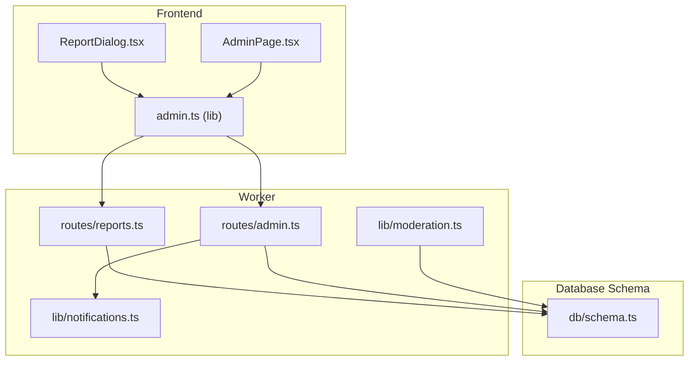
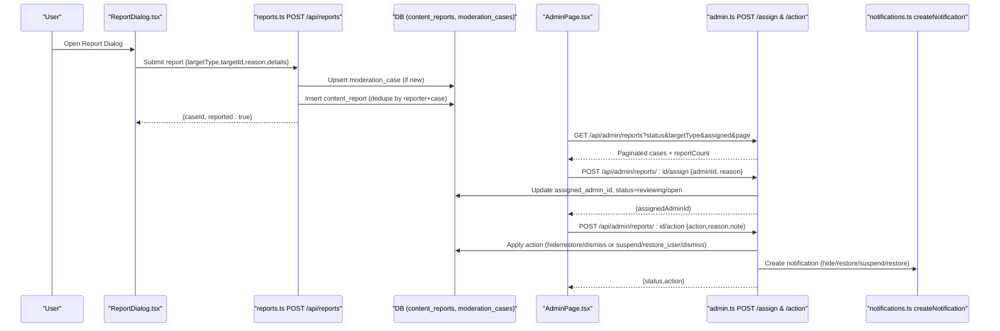
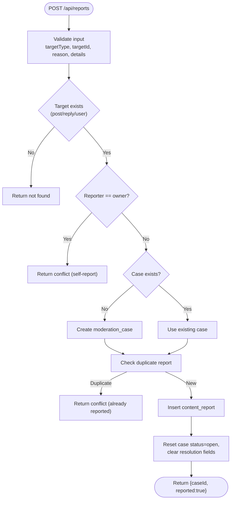
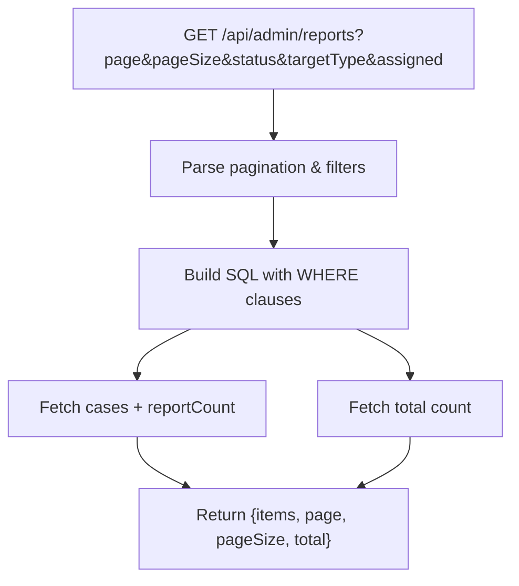
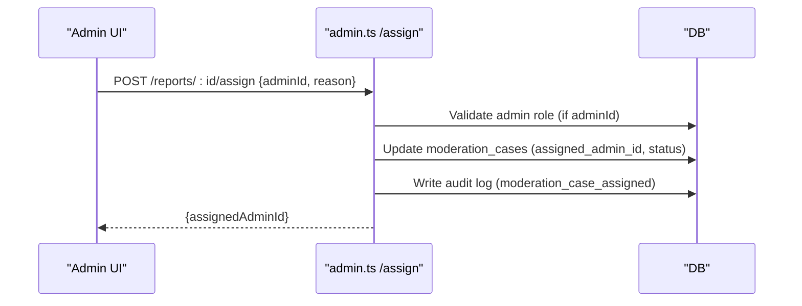
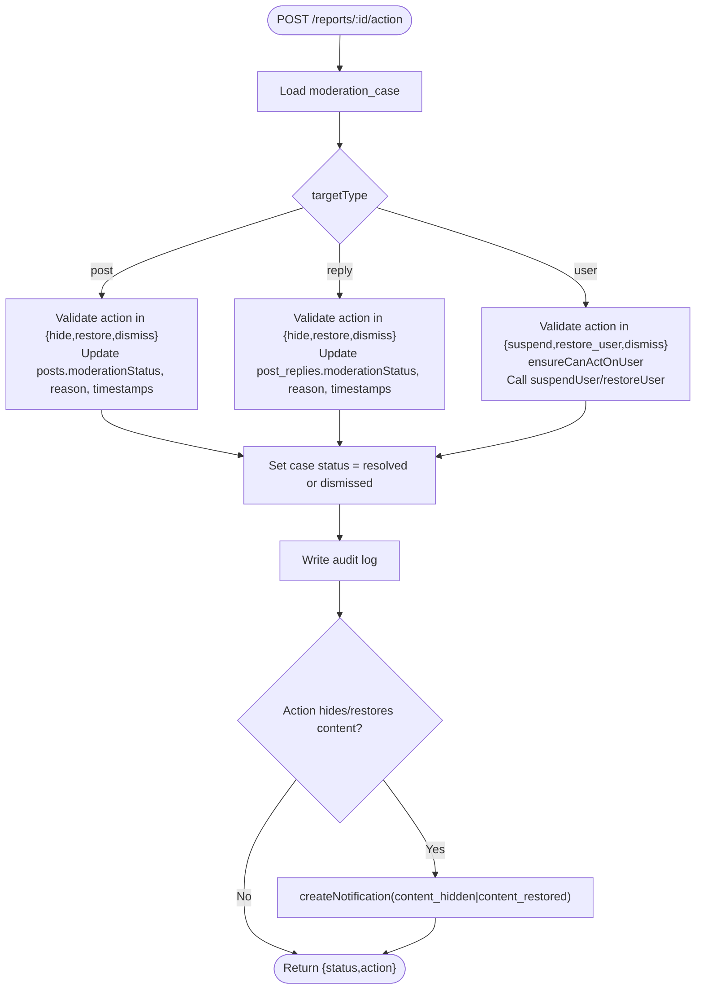
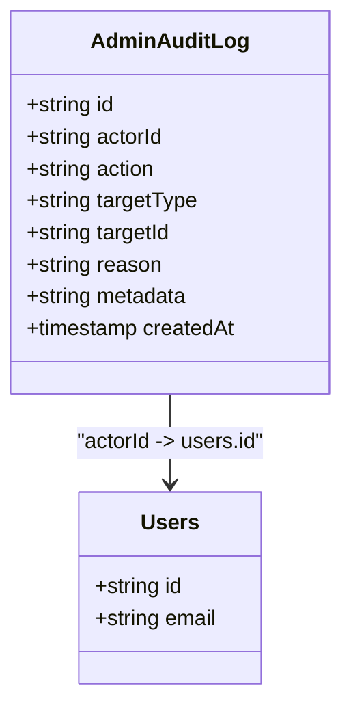
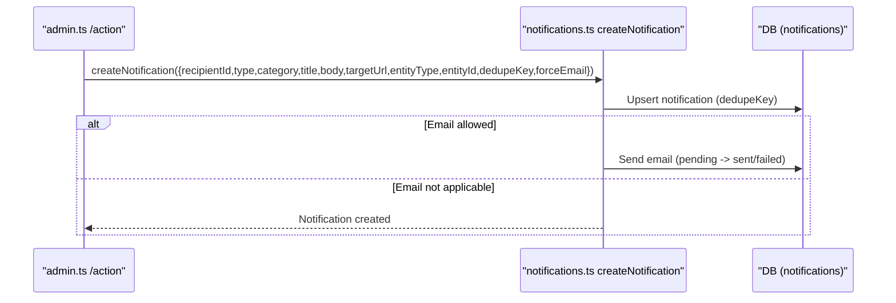
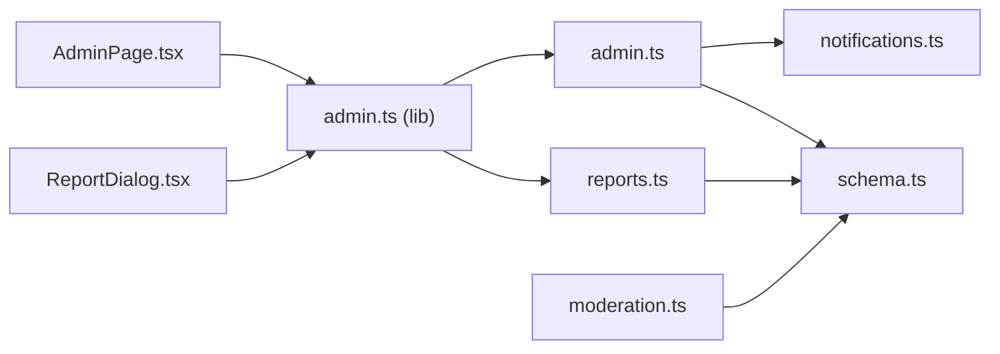

# Content Moderation and Reports

<cite>
**Referenced Files in This Document**
- [reports.ts](file://src/worker/routes/reports.ts)
- [admin.ts](file://src/worker/routes/admin.ts)
- [schema.ts](file://src/worker/db/schema.ts)
- [AdminPage.tsx](file://src/react-app/pages/AdminPage.tsx)
- [ReportDialog.tsx](file://src/react-app/components/ReportDialog.tsx)
- [admin.ts](file://src/react-app/lib/admin.ts)
- [notifications.ts](file://src/worker/lib/notifications.ts)
- [moderation.ts](file://src/worker/lib/moderation.ts)
</cite>

## Table of Contents
1. [Introduction](#introduction)
2. [Project Structure](#project-structure)
3. [Core Components](#core-components)
4. [Architecture Overview](#architecture-overview)
5. [Detailed Component Analysis](#detailed-component-analysis)
6. [Dependency Analysis](#dependency-analysis)
7. [Performance Considerations](#performance-considerations)
8. [Troubleshooting Guide](#troubleshooting-guide)
9. [Conclusion](#conclusion)

## Introduction
This document explains the content moderation and report management system, covering how user reports are aggregated into moderation cases, how administrators assign and resolve cases, supported actions per target type, status tracking, pagination/filtering, audit logging, and notifications to users when their content or account is affected.

## Project Structure
The moderation system spans:
- Worker routes for reporting and admin operations
- Database schema defining moderation entities and related tables
- Admin UI pages and dialogs for reporting and case management
- Notification utilities for informing users about changes
- Utility helpers for moderation state checks

**Diagram sources**
- [reports.ts:1-81](file://src/worker/routes/reports.ts#L1-L81)
- [admin.ts:238-305](file://src/worker/routes/admin.ts#L238-L305)
- [schema.ts:625-667](file://src/worker/db/schema.ts#L625-L667)
- [AdminPage.tsx:534-636](file://src/react-app/pages/AdminPage.tsx#L534-L636)
- [ReportDialog.tsx:1-92](file://src/react-app/components/ReportDialog.tsx#L1-L92)
- [admin.ts:1-69](file://src/react-app/lib/admin.ts#L1-L69)
- [notifications.ts:153-234](file://src/worker/lib/notifications.ts#L153-L234)
- [moderation.ts:1-17](file://src/worker/lib/moderation.ts#L1-L17)

**Section sources**
- [reports.ts:1-81](file://src/worker/routes/reports.ts#L1-L81)
- [admin.ts:238-305](file://src/worker/routes/admin.ts#L238-L305)
- [schema.ts:625-667](file://src/worker/db/schema.ts#L625-L667)
- [AdminPage.tsx:534-636](file://src/react-app/pages/AdminPage.tsx#L534-L636)
- [ReportDialog.tsx:1-92](file://src/react-app/components/ReportDialog.tsx#L1-L92)
- [admin.ts:1-69](file://src/react-app/lib/admin.ts#L1-L69)
- [notifications.ts:153-234](file://src/worker/lib/notifications.ts#L153-L234)
- [moderation.ts:1-17](file://src/worker/lib/moderation.ts#L1-L17)

## Core Components
- Reporting endpoint: accepts a report for post, reply, or user; aggregates multiple reports into one moderation case; prevents duplicate reports by the same user on the same target.
- Admin endpoints: list paginated reports with filters; assign cases to admins; perform resolution actions; view audit log.
- Data model: moderation_cases, content_reports, admin_audit_logs, plus posts/post_replies/users fields used by moderation.
- Notifications: informs users when content is hidden/restored or accounts suspended/restored.
- Moderation helpers: check visibility based on content moderation status and author account status.

**Section sources**
- [reports.ts:19-80](file://src/worker/routes/reports.ts#L19-L80)
- [admin.ts:238-305](file://src/worker/routes/admin.ts#L238-L305)
- [schema.ts:625-667](file://src/worker/db/schema.ts#L625-L667)
- [notifications.ts:153-234](file://src/worker/lib/notifications.ts#L153-L234)
- [moderation.ts:5-16](file://src/worker/lib/moderation.ts#L5-L16)

## Architecture Overview
The moderation workflow connects user-initiated reports to administrative review and resolution, with persistent audit trails and user notifications.

**Diagram sources**
- [reports.ts:19-80](file://src/worker/routes/reports.ts#L19-L80)
- [admin.ts:238-305](file://src/worker/routes/admin.ts#L238-L305)
- [notifications.ts:153-234](file://src/worker/lib/notifications.ts#L153-L234)
- [AdminPage.tsx:534-636](file://src/react-app/pages/AdminPage.tsx#L534-L636)

## Detailed Component Analysis

### Reporting System
- Supported targets: post, reply, user.
- Validation: ensures target exists and is published (for posts/replies), prevents self-reporting.
- Aggregation: creates a single moderation_case per unique (targetType, targetId); subsequent reports from different users append to content_reports.
- Deduplication: prevents the same user from reporting the same target twice.
- Status reset: each new report resets the case to open and clears prior resolution metadata.

**Diagram sources**
- [reports.ts:19-80](file://src/worker/routes/reports.ts#L19-L80)

**Section sources**
- [reports.ts:19-80](file://src/worker/routes/reports.ts#L19-L80)

### Admin Reports Listing and Filtering
- Endpoint: GET /api/admin/reports
- Filters:
  - status: open, reviewing, resolved, dismissed, or empty for all
  - targetType: post, reply, user, or empty for all
  - assigned: me, unassigned, or empty for all
- Pagination: page, pageSize (default 20, max 50)
- Response includes items with reportCount (number of reports per case).

**Diagram sources**
- [admin.ts:238-252](file://src/worker/routes/admin.ts#L238-L252)

**Section sources**
- [admin.ts:238-252](file://src/worker/routes/admin.ts#L238-L252)
- [AdminPage.tsx:534-547](file://src/react-app/pages/AdminPage.tsx#L534-L547)

### Case Assignment
- Endpoint: POST /api/admin/reports/:id/assign
- Input: adminId (nullable), reason
- Behavior:
  - Validates assignee has admin role if provided
  - Updates assigned_admin_id and sets status to reviewing when assigned, otherwise open
  - Writes audit log entry

**Diagram sources**
- [admin.ts:261-270](file://src/worker/routes/admin.ts#L261-L270)

**Section sources**
- [admin.ts:261-270](file://src/worker/routes/admin.ts#L261-L270)

### Resolution Actions
- Endpoint: POST /api/admin/reports/:id/action
- Allowed actions depend on target type:
  - Post: hide, restore, dismiss
  - Reply: hide, restore, dismiss
  - User: suspend, restore_user, dismiss
- Effects:
  - Post/Reply: update moderationStatus (hidden/active), set moderationReason when hiding, record moderatedAt/moderatedBy
  - User: suspend or restore via helper functions; ensureCanActOnUser protects against acting on admins
  - Case status becomes resolved unless action is dismiss, then dismissed
  - Audit log written with action-specific event
  - Notification created for affected user when hide/restore occurs

**Diagram sources**
- [admin.ts:272-305](file://src/worker/routes/admin.ts#L272-L305)
- [notifications.ts:153-234](file://src/worker/lib/notifications.ts#L153-L234)

**Section sources**
- [admin.ts:272-305](file://src/worker/routes/admin.ts#L272-L305)

### Audit Trail
- All administrative actions are recorded in admin_audit_logs with actor, action, target, reason, and optional metadata.
- Admin UI provides a paginated audit log endpoint with optional filtering by action.

**Diagram sources**
- [schema.ts:655-667](file://src/worker/db/schema.ts#L655-L667)
- [admin.ts:476-485](file://src/worker/routes/admin.ts#L476-L485)

**Section sources**
- [schema.ts:655-667](file://src/worker/db/schema.ts#L655-L667)
- [admin.ts:476-485](file://src/worker/routes/admin.ts#L476-L485)

### Notifications
- When content is hidden or restored, a notification is created for the affected user with forceEmail enabled.
- Account suspension and restoration also trigger notifications.
- Notification creation respects user preferences and deduplication keys.

**Diagram sources**
- [notifications.ts:153-234](file://src/worker/lib/notifications.ts#L153-L234)
- [admin.ts:303-304](file://src/worker/routes/admin.ts#L303-L304)

**Section sources**
- [notifications.ts:153-234](file://src/worker/lib/notifications.ts#L153-L234)
- [admin.ts:303-304](file://src/worker/routes/admin.ts#L303-L304)

### Moderation State Helpers
- getPostModerationState returns moderationStatus, moderationReason, and authorAccountStatus for a post.
- isPostMemberVisible determines if a post should be visible to members based on both content moderation and author account status.

**Section sources**
- [moderation.ts:5-16](file://src/worker/lib/moderation.ts#L5-L16)

## Dependency Analysis
- Frontend components call admin APIs for listing reports, assigning cases, and performing actions.
- Worker routes depend on Drizzle ORM schema definitions for data access.
- Notifications module is invoked during moderation actions to inform users.
- Admin endpoints enforce roles and permissions before taking actions on users.

**Diagram sources**
- [ReportDialog.tsx:1-92](file://src/react-app/components/ReportDialog.tsx#L1-L92)
- [AdminPage.tsx:534-636](file://src/react-app/pages/AdminPage.tsx#L534-L636)
- [admin.ts:1-69](file://src/react-app/lib/admin.ts#L1-L69)
- [reports.ts:1-81](file://src/worker/routes/reports.ts#L1-L81)
- [admin.ts:238-305](file://src/worker/routes/admin.ts#L238-L305)
- [schema.ts:625-667](file://src/worker/db/schema.ts#L625-L667)
- [notifications.ts:153-234](file://src/worker/lib/notifications.ts#L153-L234)
- [moderation.ts:1-17](file://src/worker/lib/moderation.ts#L1-L17)

**Section sources**
- [admin.ts:238-305](file://src/worker/routes/admin.ts#L238-L305)
- [reports.ts:1-81](file://src/worker/routes/reports.ts#L1-L81)
- [schema.ts:625-667](file://src/worker/db/schema.ts#L625-L667)
- [notifications.ts:153-234](file://src/worker/lib/notifications.ts#L153-L234)
- [moderation.ts:1-17](file://src/worker/lib/moderation.ts#L1-L17)

## Performance Considerations
- Pagination is enforced with safe defaults and bounds (page size capped at 50).
- Queries use indexes defined in schema (e.g., moderation_cases_status_updated_idx, content_reports_case_created_idx).
- Batch writes are used when creating reports to minimize round trips.
- Notification creation uses deduplication keys to avoid duplicates and retries.

[No sources needed since this section provides general guidance]

## Troubleshooting Guide
- Duplicate report submission: The reporting endpoint returns a conflict if the same user already reported the target. Ensure the user hasn’t previously reported the same item.
- Invalid action for target type: The action must match the target type; otherwise, a bad request error is returned. Verify targetType and action mapping.
- Unauthorized user actions: Moderators cannot act on other administrators; ensure the target user is not an administrator when attempting suspend/restore.
- Missing target: If the reported post/reply/user does not exist or is not published, the endpoint returns not found. Confirm IDs and publication status.
- Audit log gaps: If audit entries are missing, verify that writeAdminAuditLog is called after successful state changes.

**Section sources**
- [reports.ts:54-60](file://src/worker/routes/reports.ts#L54-L60)
- [admin.ts:280-298](file://src/worker/routes/admin.ts#L280-L298)
- [admin.ts:79-83](file://src/worker/routes/admin.ts#L79-L83)

## Conclusion
The moderation system provides a robust pipeline from user reports to administrative resolution, with clear status tracking, targeted actions per content type, comprehensive audit logging, and user notifications. It supports efficient browsing and filtering of cases, enforces role-based permissions, and maintains data integrity through deduplication and validation.

[No sources needed since this section summarizes without analyzing specific files]