# Creator Application Review

<cite>
**Referenced Files in This Document**
- [0001_add-creator-applications.sql](file://drizzle/0001_add-creator-applications.sql)
- [schema.ts](file://src/worker/db/schema.ts)
- [admin.ts](file://src/worker/routes/admin.ts)
- [creator.ts](file://src/worker/routes/creator.ts)
- [AdminPage.tsx](file://src/react-app/pages/AdminPage.tsx)
- [BecomeCreatorPage.tsx](file://src/react-app/pages/BecomeCreatorPage.tsx)
- [admin.ts](file://src/react-app/lib/admin.ts)
- [notifications.ts](file://src/worker/lib/notifications.ts)
- [email.ts](file://src/worker/lib/email.ts)
</cite>

## Table of Contents
1. [Introduction](#introduction)
2. [Project Structure](#project-structure)
3. [Core Components](#core-components)
4. [Architecture Overview](#architecture-overview)
5. [Detailed Component Analysis](#detailed-component-analysis)
6. [Dependency Analysis](#dependency-analysis)
7. [Performance Considerations](#performance-considerations)
8. [Troubleshooting Guide](#troubleshooting-guide)
9. [Conclusion](#conclusion)
10. [Appendices](#appendices)

## Introduction
This document explains the end-to-end creator application review and approval process, including how applicants submit applications, how administrators list and filter applications, how to view applicant details and uploaded identification documents, and how approvals or rejections are processed with audit logging and notifications. It also covers automatic role assignment upon approval and common review scenarios such as verifying identity documents, evaluating eligibility, and handling edge cases like duplicate applications or insufficient documentation.

## Project Structure
The feature spans both the backend worker (Hono routes, database schema, notifications, email) and the React frontend (admin dashboard and applicant form). Key areas:
- Database schema for creator applications and related tables
- Backend routes for application submission, listing, detail retrieval, document viewing, and admin decisions
- Frontend pages for applying and reviewing applications
- Notification system for informing applicants of decisions
- Audit logging for all administrative actions

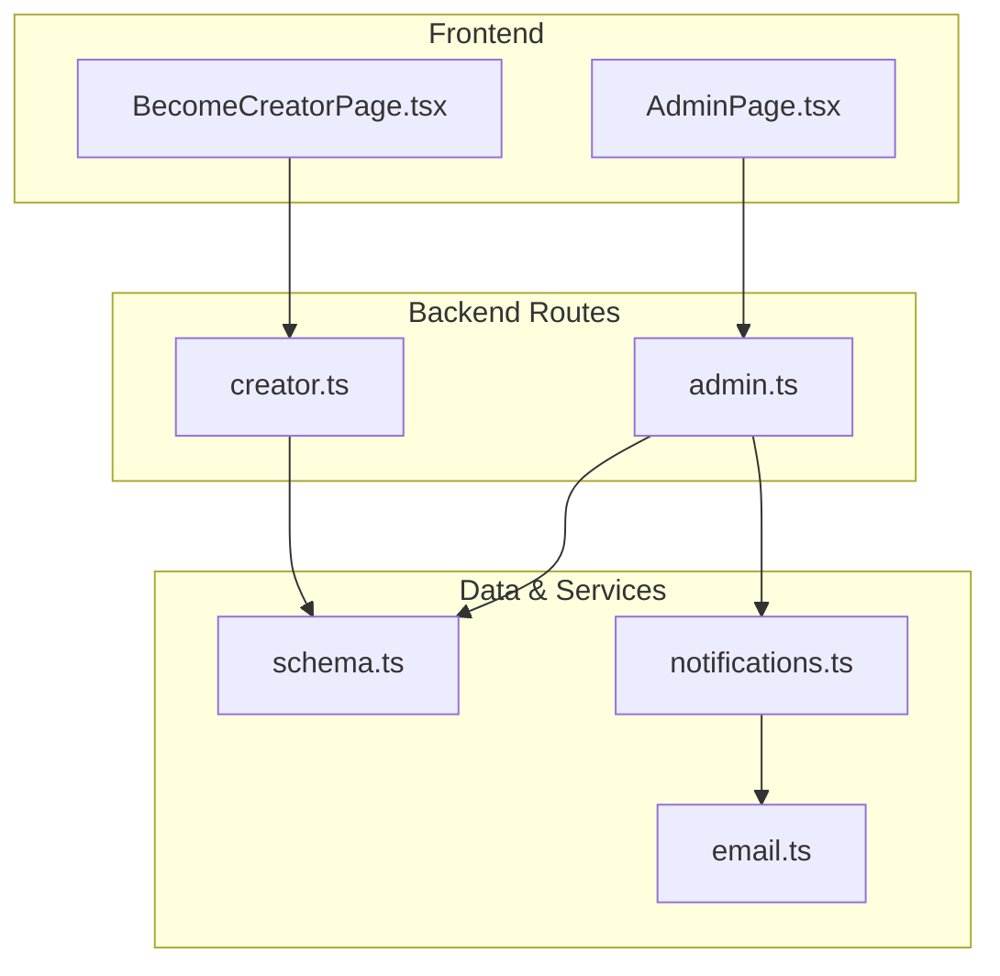

**Diagram sources**
- [AdminPage.tsx](file://src/react-app/pages/AdminPage.tsx)
- [BecomeCreatorPage.tsx](file://src/react-app/pages/BecomeCreatorPage.tsx)
- [creator.ts](file://src/worker/routes/creator.ts)
- [admin.ts](file://src/worker/routes/admin.ts)
- [schema.ts](file://src/worker/db/schema.ts)
- [notifications.ts](file://src/worker/lib/notifications.ts)
- [email.ts](file://src/worker/lib/email.ts)

**Section sources**
- [0001_add-creator-applications.sql](file://drizzle/0001_add-creator-applications.sql)
- [schema.ts](file://src/worker/db/schema.ts)
- [creator.ts](file://src/worker/routes/creator.ts)
- [admin.ts](file://src/worker/routes/admin.ts)
- [AdminPage.tsx](file://src/react-app/pages/AdminPage.tsx)
- [BecomeCreatorPage.tsx](file://src/react-app/pages/BecomeCreatorPage.tsx)
- [notifications.ts](file://src/worker/lib/notifications.ts)
- [email.ts](file://src/worker/lib/email.ts)

## Core Components
- Application submission endpoint that validates inputs, uploads NID documents, and persists a pending application.
- Admin endpoints to list applications with search and filtering, retrieve detailed application data, securely serve NID documents, approve/reject applications, and log actions.
- Frontend forms for applicants to submit applications and for admins to review and act on them.
- Notification system to inform applicants about decisions and ensure emails are sent when configured.
- Audit logging to record all admin actions with reasons and metadata.

**Section sources**
- [creator.ts](file://src/worker/routes/creator.ts)
- [admin.ts](file://src/worker/routes/admin.ts)
- [AdminPage.tsx](file://src/react-app/pages/AdminPage.tsx)
- [BecomeCreatorPage.tsx](file://src/react-app/pages/BecomeCreatorPage.tsx)
- [notifications.ts](file://src/worker/lib/notifications.ts)
- [email.ts](file://src/worker/lib/email.ts)

## Architecture Overview
The flow begins with an applicant submitting a form, which is validated and stored with an uploaded NID document. Administrators access a dashboard to list, filter, and review applications, view the NID document securely, and then approve or reject with required reasons and optional notes. Approvals automatically assign the creator role and trigger notifications; rejections include a reason visible to the applicant. All admin actions are logged.

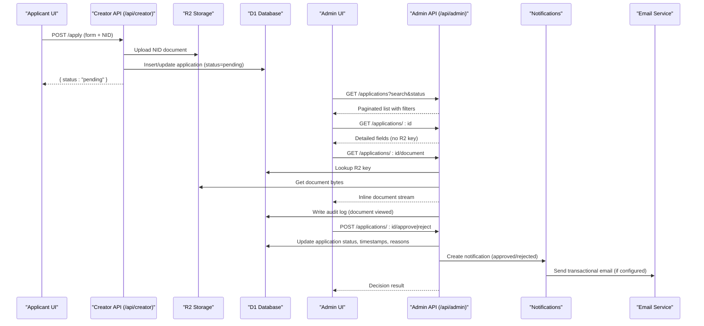

**Diagram sources**
- [creator.ts](file://src/worker/routes/creator.ts)
- [admin.ts](file://src/worker/routes/admin.ts)
- [notifications.ts](file://src/worker/lib/notifications.ts)
- [email.ts](file://src/worker/lib/email.ts)

## Detailed Component Analysis

### Application Submission Flow
- The applicant form collects identity details, NID number, NID document image, social profile URLs, and content sample URLs.
- The submission endpoint validates multipart/form-data, enforces allowed MIME types and size limits, checks for existing non-rejected applications, uploads the NID document to storage, and persists the application as pending. If resubmitting after rejection, it updates the existing record and clears prior decision fields.

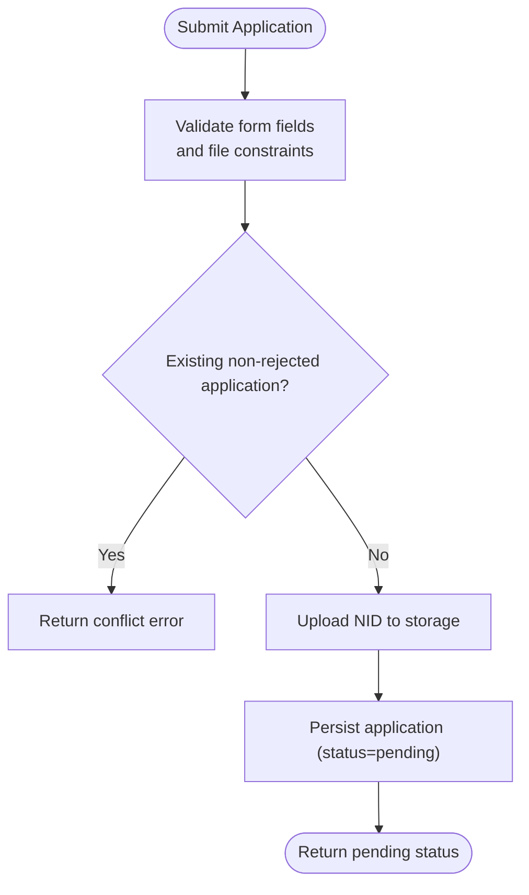

**Diagram sources**
- [creator.ts](file://src/worker/routes/creator.ts)

**Section sources**
- [BecomeCreatorPage.tsx](file://src/react-app/pages/BecomeCreatorPage.tsx)
- [creator.ts](file://src/worker/routes/creator.ts)

### Admin Listing and Filtering
- The admin page lists applications with pagination and supports filtering by status and searching across name, email, and username.
- The backend query joins users and applications, applies filters, and returns paginated results.

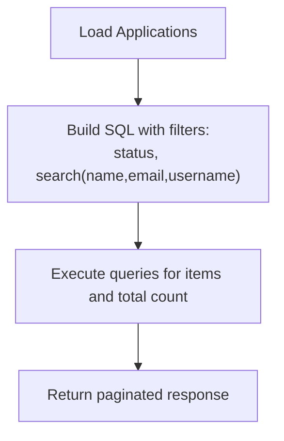

**Diagram sources**
- [admin.ts](file://src/worker/routes/admin.ts)
- [AdminPage.tsx](file://src/react-app/pages/AdminPage.tsx)

**Section sources**
- [admin.ts](file://src/worker/routes/admin.ts)
- [AdminPage.tsx](file://src/react-app/pages/AdminPage.tsx)

### Application Detail View
- The detail endpoint returns all application fields except the sensitive R2 key, parsing JSON arrays for links.
- The admin dialog displays these fields for review.

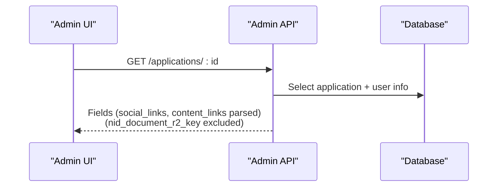

**Diagram sources**
- [admin.ts](file://src/worker/routes/admin.ts)
- [AdminPage.tsx](file://src/react-app/pages/AdminPage.tsx)

**Section sources**
- [admin.ts](file://src/worker/routes/admin.ts)
- [AdminPage.tsx](file://src/react-app/pages/AdminPage.tsx)

### Secure Document Viewing with Audit Logging
- The document endpoint retrieves the application’s R2 key, streams the document inline, and logs the view action with actor and target information.

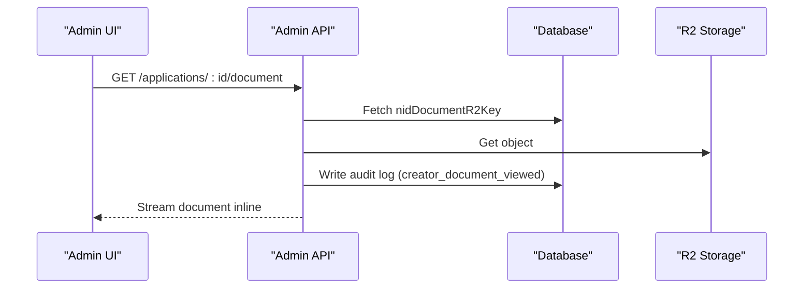

**Diagram sources**
- [admin.ts](file://src/worker/routes/admin.ts)

**Section sources**
- [admin.ts](file://src/worker/routes/admin.ts)

### Approval Workflow and Automatic Role Assignment
- Approve action sets application status to approved, records reviewer and timestamp, clears decision reason, stores optional note, and updates the user’s role to creator. An audit log entry is created and a notification is sent to the applicant.

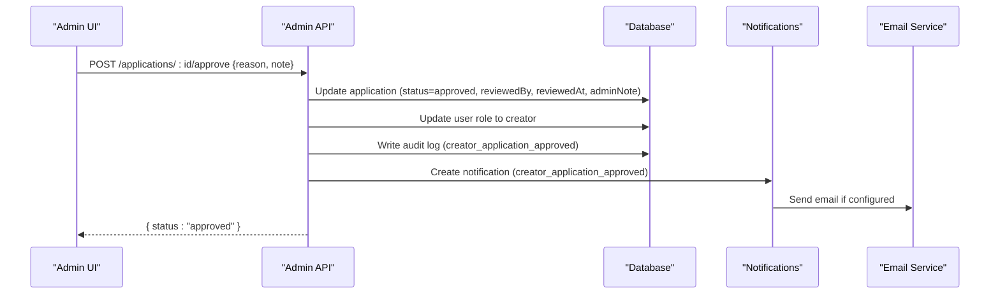

**Diagram sources**
- [admin.ts](file://src/worker/routes/admin.ts)
- [notifications.ts](file://src/worker/lib/notifications.ts)
- [email.ts](file://src/worker/lib/email.ts)

**Section sources**
- [admin.ts](file://src/worker/routes/admin.ts)
- [notifications.ts](file://src/worker/lib/notifications.ts)
- [email.ts](file://src/worker/lib/email.ts)

### Rejection Workflow and Notification
- Reject action sets application status to rejected, records reviewer and timestamp, stores the required reason and optional note, writes an audit log, and sends a notification to the applicant with the reason.

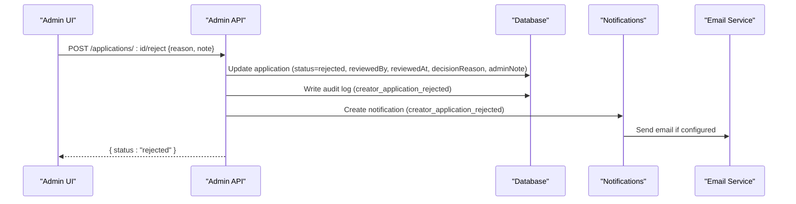

**Diagram sources**
- [admin.ts](file://src/worker/routes/admin.ts)
- [notifications.ts](file://src/worker/lib/notifications.ts)
- [email.ts](file://src/worker/lib/email.ts)

**Section sources**
- [admin.ts](file://src/worker/routes/admin.ts)
- [notifications.ts](file://src/worker/lib/notifications.ts)
- [email.ts](file://src/worker/lib/email.ts)

### Data Model and Relationships
- The creator applications table includes identity fields, NID number, R2 key for the document, JSON arrays for social and content links, status, reviewer metadata, decision reason, admin note, and timestamps.
- It references the users table and has a unique constraint per user.

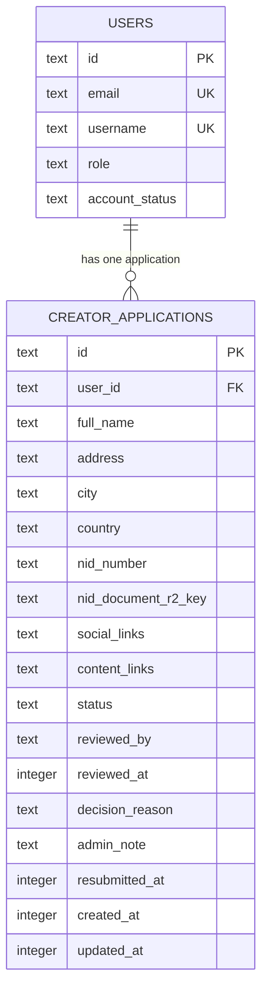

**Diagram sources**
- [schema.ts](file://src/worker/db/schema.ts)
- [0001_add-creator-applications.sql](file://drizzle/0001_add-creator-applications.sql)

**Section sources**
- [schema.ts](file://src/worker/db/schema.ts)
- [0001_add-creator-applications.sql](file://drizzle/0001_add-creator-applications.sql)

### Admin UI Components and Actions
- The admin dashboard provides a filtered table of applications with quick actions: open details, view NID document, approve, and reject.
- The detail dialog shows all fields except the sensitive R2 key.
- Action dialogs enforce a minimum length for the reason field and allow an optional private note.

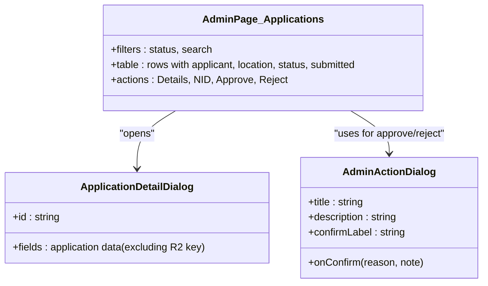

**Diagram sources**
- [AdminPage.tsx](file://src/react-app/pages/AdminPage.tsx)

**Section sources**
- [AdminPage.tsx](file://src/react-app/pages/AdminPage.tsx)

### Applicant Form and Resubmission Handling
- The form uses validation schemas and dynamic field arrays for social and content links.
- On rejection, the form pre-fills previous values and prompts resubmission with a new NID document.
- If already pending or previously applied, the UI shows appropriate messages.

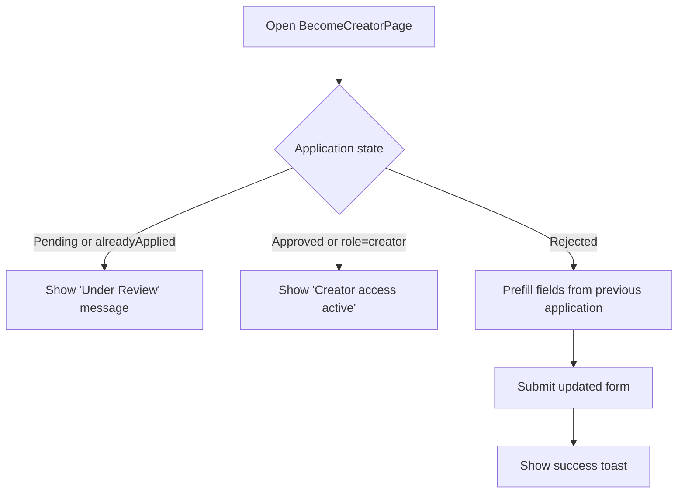

**Diagram sources**
- [BecomeCreatorPage.tsx](file://src/react-app/pages/BecomeCreatorPage.tsx)

**Section sources**
- [BecomeCreatorPage.tsx](file://src/react-app/pages/BecomeCreatorPage.tsx)

## Dependency Analysis
- Frontend components depend on API helpers to fetch and post data.
- Backend routes depend on database schema definitions and middleware for authentication and authorization.
- Notifications rely on email configuration and preferences.
- Audit logging depends on admin utilities and schema.

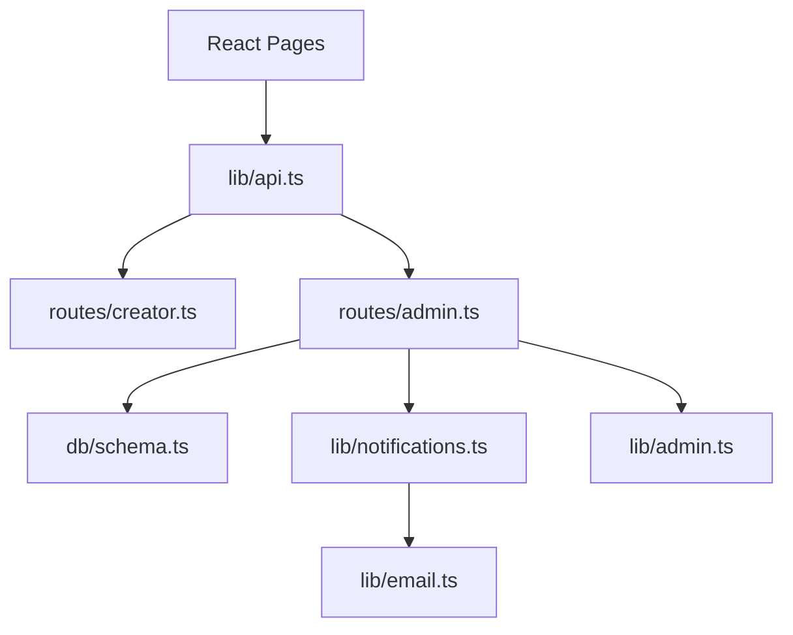

**Diagram sources**
- [AdminPage.tsx](file://src/react-app/pages/AdminPage.tsx)
- [BecomeCreatorPage.tsx](file://src/react-app/pages/BecomeCreatorPage.tsx)
- [admin.ts](file://src/worker/routes/admin.ts)
- [creator.ts](file://src/worker/routes/creator.ts)
- [schema.ts](file://src/worker/db/schema.ts)
- [notifications.ts](file://src/worker/lib/notifications.ts)
- [email.ts](file://src/worker/lib/email.ts)
- [admin.ts](file://src/react-app/lib/admin.ts)

**Section sources**
- [admin.ts](file://src/react-app/lib/admin.ts)
- [admin.ts](file://src/worker/routes/admin.ts)
- [creator.ts](file://src/worker/routes/creator.ts)
- [schema.ts](file://src/worker/db/schema.ts)
- [notifications.ts](file://src/worker/lib/notifications.ts)
- [email.ts](file://src/worker/lib/email.ts)

## Performance Considerations
- Pagination and server-side filtering reduce payload sizes for large datasets.
- Batch database operations during approval minimize round-trips.
- Streaming document responses avoid loading entire files into memory.
- Deduplication keys prevent duplicate notifications and redundant email sends.

[No sources needed since this section provides general guidance]

## Troubleshooting Guide
- Duplicate applications: The submission endpoint returns a conflict if a non-rejected application exists for the user. Ensure the previous application is rejected before resubmitting.
- Insufficient documentation: Rejections require a reason; ensure the reason meets minimum length requirements and clearly explains missing or invalid documents.
- Email delivery failures: Check notification preferences and email configuration; failed emails are recorded with error messages.
- Audit log visibility: Use the audit log endpoint to trace admin actions, including document views and decisions.

**Section sources**
- [creator.ts](file://src/worker/routes/creator.ts)
- [admin.ts](file://src/worker/routes/admin.ts)
- [notifications.ts](file://src/worker/lib/notifications.ts)

## Conclusion
The creator application review process integrates secure document handling, robust filtering and search, clear admin workflows with mandatory reasoning, automatic role assignment, comprehensive notifications, and thorough audit logging. This ensures transparency, accountability, and a smooth experience for both applicants and administrators.

[No sources needed since this section summarizes without analyzing specific files]

## Appendices

### Common Review Scenarios
- Verifying identity documents:
  - Open the application detail, click the NID link to view the document inline, confirm the NID number matches the provided value, and verify the document quality and authenticity.
- Evaluating creator eligibility:
  - Review social profile URLs and content samples for relevance and quality; ensure at least one valid URL per category.
- Handling duplicate applications:
  - If a conflict occurs, check whether there is an existing pending application; guide the applicant to wait for the decision or resubmit after a rejection.
- Handling insufficient documentation:
  - Reject with a clear reason specifying what is missing or incorrect; the applicant can resubmit with corrected documents.

[No sources needed since this section provides general guidance]