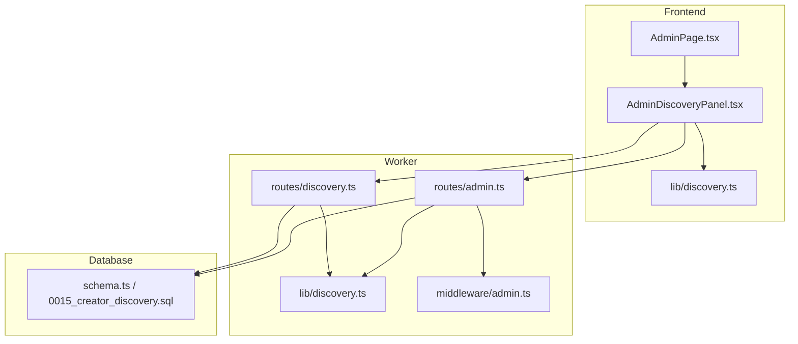
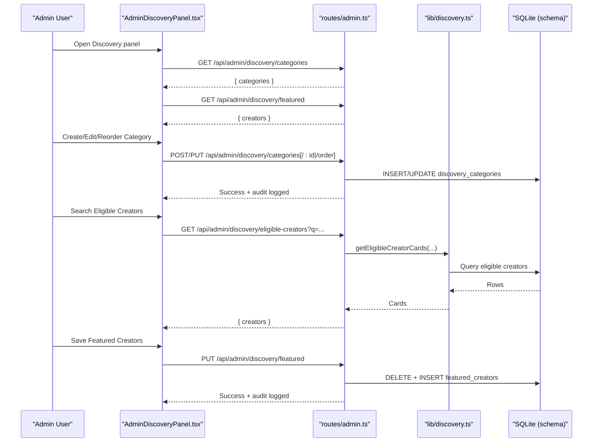
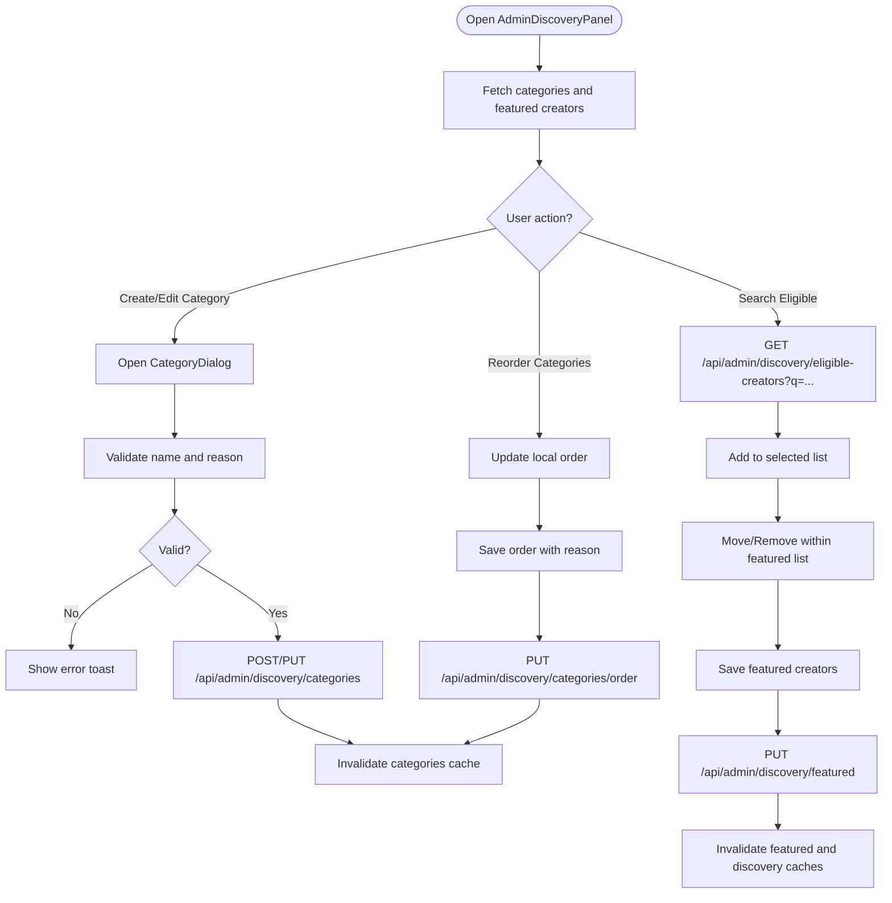
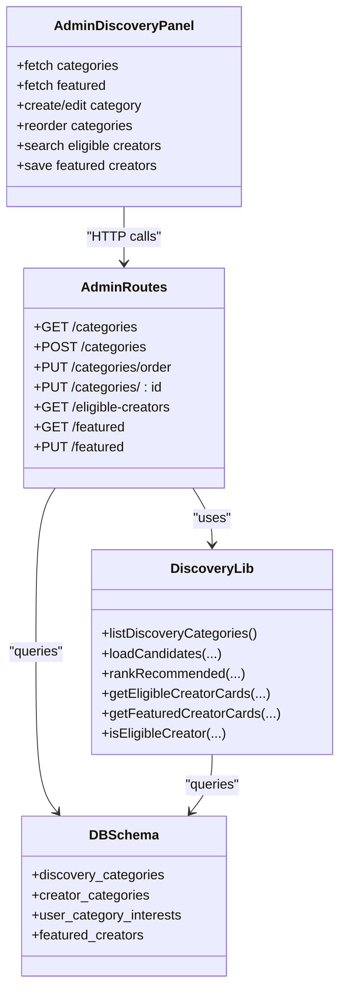

# Discovery Categories and Featured Creators

<cite>
**Referenced Files in This Document**
- [AdminDiscoveryPanel.tsx](file://src/react-app/components/AdminDiscoveryPanel.tsx)
- [discovery.ts (frontend lib)](file://src/react-app/lib/discovery.ts)
- [admin.ts (worker routes)](file://src/worker/routes/admin.ts)
- [discovery.ts (worker lib)](file://src/worker/lib/discovery.ts)
- [schema.ts (DB schema)](file://src/worker/db/schema.ts)
- [0015_creator_discovery.sql](file://drizzle/0015_creator_discovery.sql)
- [admin.ts (middleware)](file://src/worker/middleware/admin.ts)
- [AdminPage.tsx](file://src/react-app/pages/AdminPage.tsx)
</cite>

## Table of Contents
1. [Introduction](#introduction)
2. [Project Structure](#project-structure)
3. [Core Components](#core-components)
4. [Architecture Overview](#architecture-overview)
5. [Detailed Component Analysis](#detailed-component-analysis)
6. [Dependency Analysis](#dependency-analysis)
7. [Performance Considerations](#performance-considerations)
8. [Troubleshooting Guide](#troubleshooting-guide)
9. [Conclusion](#conclusion)
10. [Appendices](#appendices)

## Introduction
This document explains the discovery category management and featured creator curation system. It covers:
- Category CRUD operations with slug generation, active/inactive toggling, and drag-and-drop reordering
- Eligible creators filtering based on platform criteria and search
- Featured creators management for curating platform highlights with ordering and replacement
- Owner-only restrictions for discovery management operations
- The AdminDiscoveryPanel UI component that powers these operations
- Relationships between categories and creator profiles
- How featured creators appear in platform discovery algorithms

## Project Structure
The feature spans frontend components, worker routes, shared libraries, and database schema:
- Frontend UI: AdminDiscoveryPanel and related types/hooks
- Worker API: Admin routes for owner-only operations and discovery endpoints
- Shared logic: Discovery algorithms, eligibility checks, and data models
- Database: Tables for categories, creator-category assignments, user interests, and featured creators

**Diagram sources**
- [AdminDiscoveryPanel.tsx](file://src/react-app/components/AdminDiscoveryPanel.tsx)
- [discovery.ts (frontend lib)](file://src/react-app/lib/discovery.ts)
- [AdminPage.tsx](file://src/react-app/pages/AdminPage.tsx)
- [admin.ts (worker routes)](file://src/worker/routes/admin.ts)
- [discovery.ts (worker routes)](file://src/worker/routes/discovery.ts)
- [discovery.ts (worker lib)](file://src/worker/lib/discovery.ts)
- [admin.ts (middleware)](file://src/worker/middleware/admin.ts)
- [schema.ts (DB schema)](file://src/worker/db/schema.ts)
- [0015_creator_discovery.sql](file://drizzle/0015_creator_discovery.sql)

**Section sources**
- [AdminDiscoveryPanel.tsx](file://src/react-app/components/AdminDiscoveryPanel.tsx)
- [admin.ts (worker routes)](file://src/worker/routes/admin.ts)
- [discovery.ts (worker lib)](file://src/worker/lib/discovery.ts)
- [schema.ts (DB schema)](file://src/worker/db/schema.ts)
- [0015_creator_discovery.sql](file://drizzle/0015_creator_discovery.sql)

## Core Components
- AdminDiscoveryPanel: Provides the admin UI to manage discovery categories and curated featured creators. It fetches lists, handles local state for reordering, and persists changes via API calls with audit reasons.
- Worker admin routes: Enforce owner-only access and implement category CRUD, order updates, eligible creator listing, featured listing, and featured replacement.
- Worker discovery library: Implements eligibility checks, ranking/recommendation signals, and queries used by both public discovery and admin features.
- DB schema: Defines tables for discovery_categories, creator_categories, user_category_interests, and featured_creators.

Key responsibilities:
- Category creation with deterministic slug generation and uniqueness constraints
- Category updates including active/inactive status
- Category reordering with full list validation and batch updates
- Eligible creator search filtered by platform criteria
- Featured creators replacement with ordering and audit logging

**Section sources**
- [AdminDiscoveryPanel.tsx](file://src/react-app/components/AdminDiscoveryPanel.tsx)
- [admin.ts (worker routes)](file://src/worker/routes/admin.ts)
- [discovery.ts (worker lib)](file://src/worker/lib/discovery.ts)
- [schema.ts (DB schema)](file://src/worker/db/schema.ts)

## Architecture Overview
The system follows a clear separation of concerns:
- UI layer (React) manages user interactions and optimistic local state for reorder actions
- API layer (Hono routes) validates inputs, enforces ownership, performs DB operations, and logs audits
- Domain logic (worker lib) encapsulates eligibility, ranking, and query composition
- Persistence (D1 SQLite) stores taxonomy, relationships, and curated lists

**Diagram sources**
- [AdminDiscoveryPanel.tsx](file://src/react-app/components/AdminDiscoveryPanel.tsx)
- [admin.ts (worker routes)](file://src/worker/routes/admin.ts)
- [discovery.ts (worker lib)](file://src/worker/lib/discovery.ts)
- [schema.ts (DB schema)](file://src/worker/db/schema.ts)

## Detailed Component Analysis

### AdminDiscoveryPanel (UI)
Responsibilities:
- Fetches categories and featured creators
- Manages local state for category editing and ordering
- Validates input (name length, reason length) and shows errors
- Persists changes with required audit reasons
- Supports up to 12 featured creators with move-up/down and removal

User flows:
- Category dialog supports create and edit; slugs are stable once created
- Category reorder requires saving with an audit reason
- Eligible creators can be searched and added to the featured list
- Featured list can be reordered and saved atomically

**Diagram sources**
- [AdminDiscoveryPanel.tsx](file://src/react-app/components/AdminDiscoveryPanel.tsx)
- [admin.ts (worker routes)](file://src/worker/routes/admin.ts)

**Section sources**
- [AdminDiscoveryPanel.tsx](file://src/react-app/components/AdminDiscoveryPanel.tsx)

### Worker Admin Routes (Owner-only APIs)
Endpoints:
- GET /api/admin/discovery/categories: List all categories with assignment counts
- POST /api/admin/discovery/categories: Create category with slug generation and uniqueness checks
- PUT /api/admin/discovery/categories/order: Replace display_order for all categories after validating completeness
- PUT /api/admin/discovery/categories/:id: Update name, description, and active status
- GET /api/admin/discovery/eligible-creators: Return eligible creators filtered by optional query
- GET /api/admin/discovery/featured: Return current featured creators ordered
- PUT /api/admin/discovery/featured: Replace entire featured list with new ordered set

Security:
- All discovery admin endpoints require owner role via ownerMiddleware
- Changes are audited with actorId, action, targetType, targetId, reason, and metadata

Data integrity:
- Slug generation ensures lowercase, normalized, hyphenated identifiers
- Duplicate name/slug checks prevent conflicts
- Category order requires complete set and valid IDs
- Featured creators must pass eligibility check before insertion

**Section sources**
- [admin.ts (worker routes)](file://src/worker/routes/admin.ts)
- [admin.ts (middleware)](file://src/worker/middleware/admin.ts)

### Worker Discovery Library (Algorithms and Queries)
Key functions:
- listDiscoveryCategories: Returns active categories with creator counts
- loadCandidates: Builds SQL with filters for query, category, sort modes (relevance, popular, recent, featured)
- rankRecommended: Computes recommendation scores using interest, subscription, and behavior signals
- getEligibleCreatorCards: Returns eligible creators for admin selection
- getFeaturedCreatorCards: Returns current featured creators
- isEligibleCreator: Checks if a user qualifies as an eligible creator

Recommendation signals:
- Interest categories from user preferences
- Subscription categories from paid subscriptions
- Behavior categories from likes and saves
- Scores combine subscriber count, recency, and category matches

**Section sources**
- [discovery.ts (worker lib)](file://src/worker/lib/discovery.ts)

### Database Schema and Migrations
Tables:
- discovery_categories: id, slug (unique), name (unique case-insensitive), description, display_order, active, timestamps
- creator_categories: composite PK (creator_id, category_id), display_order, timestamps
- user_category_interests: composite PK (user_id, category_id), timestamps
- featured_creators: PK creator_id, display_order, featured_by, timestamps

Indexes:
- Active+order index for fast category listing
- Creator-order index for per-creator category ordering
- Featured order index for efficient featured listing

Migrations:
- Initial seed includes default categories with display_order

**Section sources**
- [schema.ts (DB schema)](file://src/worker/db/schema.ts)
- [0015_creator_discovery.sql](file://drizzle/0015_creator_discovery.sql)

### Admin Page Integration
- AdminPage renders AdminDiscoveryPanel only when the current user has adminRole 'owner'
- Section visibility respects ownerOnly flag for discovery section

**Section sources**
- [AdminPage.tsx](file://src/react-app/pages/AdminPage.tsx)

## Dependency Analysis

**Diagram sources**
- [AdminDiscoveryPanel.tsx](file://src/react-app/components/AdminDiscoveryPanel.tsx)
- [admin.ts (worker routes)](file://src/worker/routes/admin.ts)
- [discovery.ts (worker lib)](file://src/worker/lib/discovery.ts)
- [schema.ts (DB schema)](file://src/worker/db/schema.ts)

**Section sources**
- [admin.ts (worker routes)](file://src/worker/routes/admin.ts)
- [discovery.ts (worker lib)](file://src/worker/lib/discovery.ts)
- [schema.ts (DB schema)](file://src/worker/db/schema.ts)

## Performance Considerations
- Batched DB writes for category order and featured replacement reduce round-trips
- Pagination and limits in search queries prevent large result sets
- Indexes on active+display_order and creator_id+display_order optimize common queries
- Recommendation scoring uses bounded counts and early filtering to keep computation efficient
- Client-side optimistic reordering improves perceived responsiveness

[No sources needed since this section provides general guidance]

## Troubleshooting Guide
Common issues and resolutions:
- 403 Forbidden on discovery admin endpoints: Ensure the user has adminRole 'owner'
- Conflict on category creation: Name or slug already exists; choose a unique value
- Bad request on category order: Must include all category IDs exactly once
- Bad request on featured update: Every creator ID must be eligible; verify account status and published content
- Validation errors: Provide a reason with at least 3 characters for audit logging

**Section sources**
- [admin.ts (worker routes)](file://src/worker/routes/admin.ts)
- [admin.ts (middleware)](file://src/worker/middleware/admin.ts)

## Conclusion
The discovery system provides robust category management and curated featured creators with strong governance:
- Owner-only controls ensure high-quality taxonomy and highlights
- Audit logging captures every change with context
- Eligibility and recommendation algorithms maintain discoverability standards
- UI enables intuitive management with immediate feedback and safe operations

[No sources needed since this section summarizes without analyzing specific files]

## Appendices

### Examples and Best Practices
- Organizing content categories:
  - Use descriptive names and concise descriptions
  - Keep slugs stable; avoid frequent changes
  - Maintain a logical display order aligned with platform priorities
- Promoting quality creators:
  - Select eligible creators with active content and engaged audiences
  - Order featured creators to reflect prominence and diversity
  - Replace periodically to highlight fresh talent
- Maintaining discoverability standards:
  - Encourage creators to assign relevant categories
  - Monitor recommendation signals and adjust categories as needed
  - Keep active/inactive states accurate to control visibility

[No sources needed since this section provides general guidance]