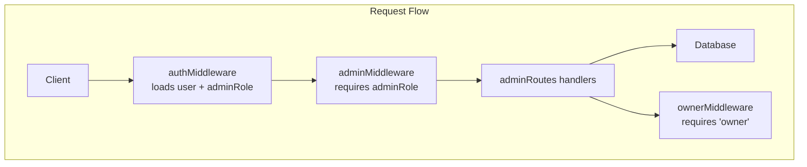
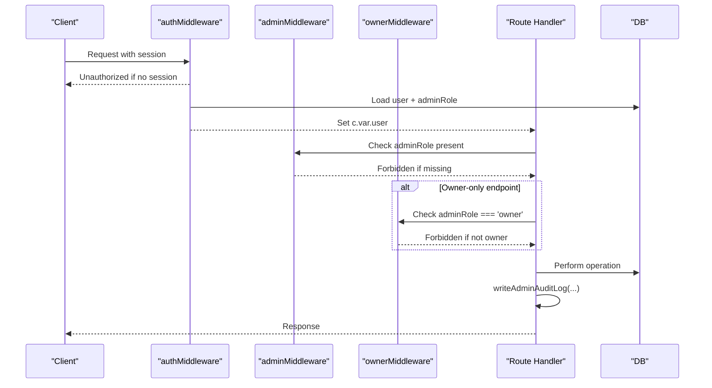
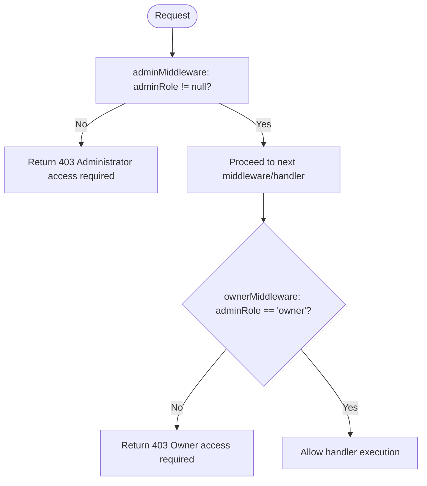
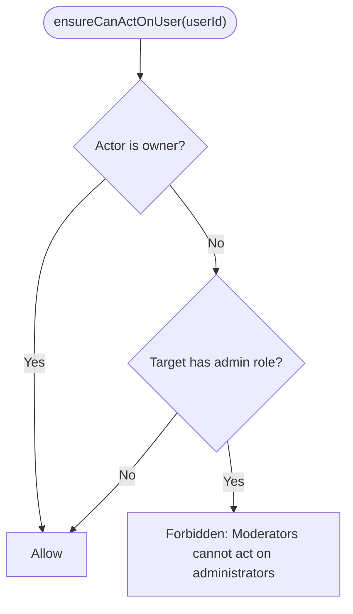
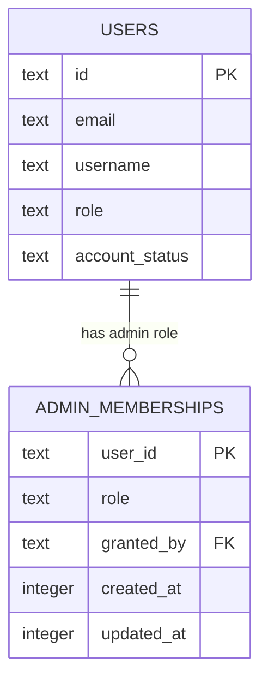
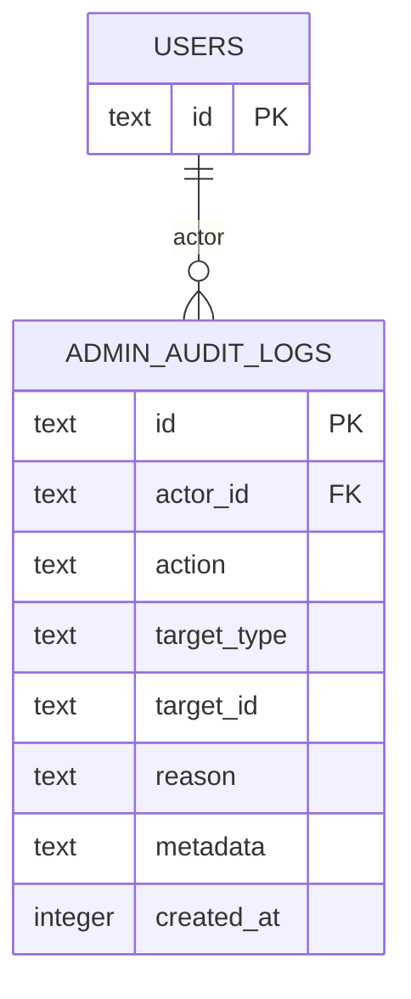
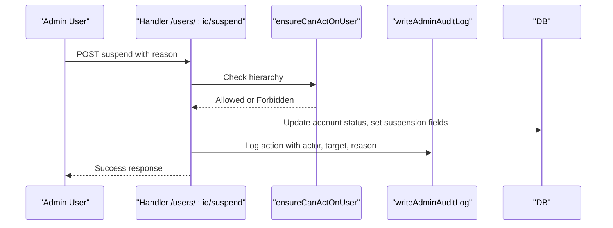
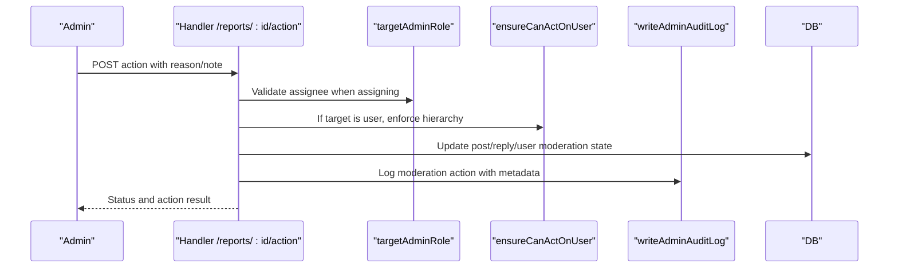
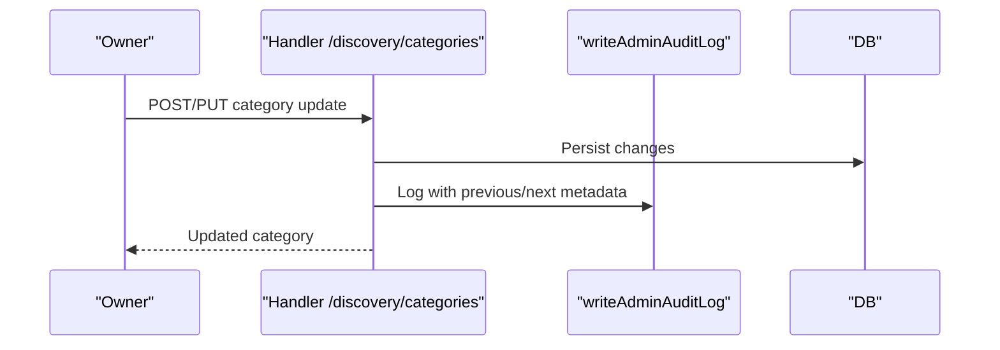
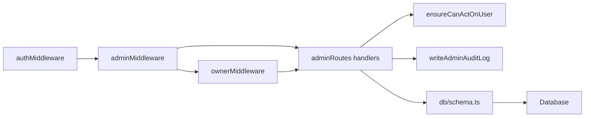

# Permission System and Access Control

<cite>
**Referenced Files in This Document**
- [admin.ts](file://src/worker/middleware/admin.ts)
- [auth.ts](file://src/worker/middleware/auth.ts)
- [admin.ts](file://src/worker/lib/admin.ts)
- [schema.ts](file://src/worker/db/schema.ts)
- [0011_admin_dashboard.sql](file://drizzle/0011_admin_dashboard.sql)
- [admin.ts](file://src/worker/routes/admin.ts)
- [AdminPage.tsx](file://src/react-app/pages/AdminPage.tsx)
</cite>

## Table of Contents
1. [Introduction](#introduction)
2. [Project Structure](#project-structure)
3. [Core Components](#core-components)
4. [Architecture Overview](#architecture-overview)
5. [Detailed Component Analysis](#detailed-component-analysis)
6. [Dependency Analysis](#dependency-analysis)
7. [Performance Considerations](#performance-considerations)
8. [Troubleshooting Guide](#troubleshooting-guide)
9. [Conclusion](#conclusion)
10. [Appendices](#appendices)

## Introduction
This document explains the permission system and access control mechanisms for the admin interface. It covers:
- Middleware-based authorization: adminMiddleware and ownerMiddleware
- Hierarchical permissions via ensureCanActOnUser to prevent moderators from acting on administrators while preserving owner supremacy
- The adminMemberships table structure for role assignments and grantor tracking
- Examples of permission enforcement across user management, content moderation, and system configuration
- The audit trail system that records all administrative actions with actor identification, target information, and reasons
- Security considerations including privilege escalation prevention and least privilege principles
- The relationship between user roles and available administrative functions

## Project Structure
The permission system spans middleware, routes, database schema, and UI components:
- Middleware enforces authentication and admin-level checks
- Routes implement business logic and enforce fine-grained permissions per endpoint
- Database schema defines admin memberships, audit logs, and moderation entities
- Frontend exposes admin UIs gated by backend permissions

**Diagram sources**
- [auth.ts:23-50](file://src/worker/middleware/auth.ts#L23-L50)
- [admin.ts:5-13](file://src/worker/middleware/admin.ts#L5-L13)
- [admin.ts:85-86](file://src/worker/routes/admin.ts#L85-L86)

**Section sources**
- [auth.ts:23-50](file://src/worker/middleware/auth.ts#L23-L50)
- [admin.ts:5-13](file://src/worker/middleware/admin.ts#L5-L13)
- [admin.ts:85-86](file://src/worker/routes/admin.ts#L85-L86)

## Core Components
- Authentication and context enrichment: authMiddleware loads user profile and adminRole into request context
- Authorization middleware:
  - adminMiddleware ensures the caller has any admin role (owner or moderator)
  - ownerMiddleware restricts endpoints to owners only
- Hierarchical guard: ensureCanActOnUser prevents moderators from acting on users who hold an admin role
- Audit logging: writeAdminAuditLog records actor, action, target, reason, and metadata
- Role storage: adminMemberships stores role assignments and who granted them

**Section sources**
- [auth.ts:23-50](file://src/worker/middleware/auth.ts#L23-L50)
- [admin.ts:5-13](file://src/worker/middleware/admin.ts#L5-L13)
- [admin.ts:79-83](file://src/worker/routes/admin.ts#L79-L83)
- [admin.ts:7-31](file://src/worker/lib/admin.ts#L7-L31)
- [schema.ts:35-43](file://src/worker/db/schema.ts#L35-L43)

## Architecture Overview
The admin API is protected by layered middleware and route-specific guards. All sensitive operations are audited.

**Diagram sources**
- [auth.ts:23-50](file://src/worker/middleware/auth.ts#L23-L50)
- [admin.ts:5-13](file://src/worker/middleware/admin.ts#L5-L13)
- [admin.ts:85-86](file://src/worker/routes/admin.ts#L85-L86)
- [admin.ts:7-31](file://src/worker/lib/admin.ts#L7-L31)

## Detailed Component Analysis

### Middleware: adminMiddleware and ownerMiddleware
- adminMiddleware requires a non-null adminRole; otherwise returns forbidden
- ownerMiddleware requires adminRole to be exactly 'owner'; otherwise returns forbidden
- Both rely on c.var.user populated by authMiddleware

**Diagram sources**
- [admin.ts:5-13](file://src/worker/middleware/admin.ts#L5-L13)
- [auth.ts:23-50](file://src/worker/middleware/auth.ts#L23-L50)

**Section sources**
- [admin.ts:5-13](file://src/worker/middleware/admin.ts#L5-L13)
- [auth.ts:23-50](file://src/worker/middleware/auth.ts#L23-L50)

### Hierarchical Permissions: ensureCanActOnUser
- Owners can act on any user without restriction
- Moderators cannot act on users who have any admin role (owner or moderator)
- Used before sensitive user-facing actions such as suspend/restore and moderation actions against users

**Diagram sources**
- [admin.ts:79-83](file://src/worker/routes/admin.ts#L79-L83)

**Section sources**
- [admin.ts:79-83](file://src/worker/routes/admin.ts#L79-L83)

### Admin Memberships: Role Assignments and Grantor Tracking
- admin_memberships stores:
  - user_id: primary key referencing users.id
  - role: enum values 'owner' or 'moderator'
  - granted_by: optional reference to users.id (who granted the role)
  - created_at, updated_at timestamps
- Indexes support querying by role
- Enforced via foreign keys and constraints

**Diagram sources**
- [schema.ts:35-43](file://src/worker/db/schema.ts#L35-L43)
- [0011_admin_dashboard.sql:25-33](file://drizzle/0011_admin_dashboard.sql#L25-L33)

**Section sources**
- [schema.ts:35-43](file://src/worker/db/schema.ts#L35-L43)
- [0011_admin_dashboard.sql:25-33](file://drizzle/0011_admin_dashboard.sql#L25-L33)

### Audit Trail System: admin_audit_logs
- Records every administrative action with:
  - actor_id: who performed the action
  - action: descriptive action name
  - target_type and target_id: what was affected
  - reason: optional human-readable justification
  - metadata: optional JSON payload for additional context
  - created_at timestamp
- Indexed for efficient querying by time and actor
- writeAdminAuditLog persists entries and emits structured logs

**Diagram sources**
- [schema.ts:655-667](file://src/worker/db/schema.ts#L655-L667)
- [0011_admin_dashboard.sql:72-84](file://drizzle/0011_admin_dashboard.sql#L72-L84)

**Section sources**
- [admin.ts:7-31](file://src/worker/lib/admin.ts#L7-L31)
- [schema.ts:655-667](file://src/worker/db/schema.ts#L655-L667)
- [0011_admin_dashboard.sql:72-84](file://drizzle/0011_admin_dashboard.sql#L72-L84)

### Permission Enforcement Examples

#### User Management
- Suspend/Restore user:
  - Requires admin access (adminMiddleware)
  - Uses ensureCanActOnUser to block moderators from acting on admins
  - Audits with writeAdminAuditLog
- Revoke sessions:
  - Same hierarchical check and audit trail

**Diagram sources**
- [admin.ts:334-342](file://src/worker/routes/admin.ts#L334-L342)
- [admin.ts:79-83](file://src/worker/routes/admin.ts#L79-L83)
- [admin.ts:7-31](file://src/worker/lib/admin.ts#L7-L31)

**Section sources**
- [admin.ts:334-342](file://src/worker/routes/admin.ts#L334-L342)
- [admin.ts:79-83](file://src/worker/routes/admin.ts#L79-L83)

#### Content Moderation
- Reports assignment and resolution:
  - Assignment validates assignee is an administrator
  - Resolution applies different actions based on target type (post/reply/user)
  - For user targets, ensureCanActOnUser is enforced
  - All changes are audited

**Diagram sources**
- [admin.ts:261-305](file://src/worker/routes/admin.ts#L261-L305)
- [admin.ts:79-83](file://src/worker/routes/admin.ts#L79-L83)
- [admin.ts:7-31](file://src/worker/lib/admin.ts#L7-L31)

**Section sources**
- [admin.ts:261-305](file://src/worker/routes/admin.ts#L261-L305)

#### System Configuration (Discovery Taxonomy and Featured Creators)
- Discovery categories CRUD and featured creators updates require ownerMiddleware
- Changes are audited with detailed metadata (previous/next states)
- Prevents unauthorized modifications to platform-wide settings

**Diagram sources**
- [admin.ts:366-396](file://src/worker/routes/admin.ts#L366-L396)
- [admin.ts:422-441](file://src/worker/routes/admin.ts#L422-L441)
- [admin.ts:7-31](file://src/worker/lib/admin.ts#L7-L31)

**Section sources**
- [admin.ts:366-396](file://src/worker/routes/admin.ts#L366-L396)
- [admin.ts:422-441](file://src/worker/routes/admin.ts#L422-L441)

### Relationship Between User Roles and Administrative Functions
- Regular user roles (subscriber, creator) are separate from admin roles (owner, moderator)
- adminMiddleware gates all admin endpoints; ownerMiddleware further restricts critical operations
- ensureCanActOnUser enforces hierarchical restrictions at the point of user-affecting actions
- Frontend surfaces admin capabilities based on server responses and roles

**Section sources**
- [auth.ts:8-14](file://src/worker/middleware/auth.ts#L8-L14)
- [admin.ts:5-13](file://src/worker/middleware/admin.ts#L5-L13)
- [admin.ts:79-83](file://src/worker/routes/admin.ts#L79-L83)
- [AdminPage.tsx:1000-1146](file://src/react-app/pages/AdminPage.tsx#L1000-L1146)

## Dependency Analysis
The permission system composes multiple layers:
- Middleware layer depends on auth context and DB schema
- Route handlers depend on middleware and utility functions for auditing and assertions
- Schema definitions underpin data integrity and relationships

**Diagram sources**
- [auth.ts:23-50](file://src/worker/middleware/auth.ts#L23-L50)
- [admin.ts:5-13](file://src/worker/middleware/admin.ts#L5-L13)
- [admin.ts:79-83](file://src/worker/routes/admin.ts#L79-L83)
- [admin.ts:7-31](file://src/worker/lib/admin.ts#L7-L31)
- [schema.ts:35-43](file://src/worker/db/schema.ts#L35-L43)

**Section sources**
- [auth.ts:23-50](file://src/worker/middleware/auth.ts#L23-L50)
- [admin.ts:5-13](file://src/worker/middleware/admin.ts#L5-L13)
- [admin.ts:79-83](file://src/worker/routes/admin.ts#L79-L83)
- [admin.ts:7-31](file://src/worker/lib/admin.ts#L7-L31)
- [schema.ts:35-43](file://src/worker/db/schema.ts#L35-L43)

## Performance Considerations
- Minimal overhead: middleware performs one DB join to load user and adminRole
- Auditing writes are lightweight inserts with indexes on created_at and actor_id
- Pagination and filtering in admin endpoints reduce payload sizes
- Avoid excessive nested queries; use prepared statements and batch operations where possible

[No sources needed since this section provides general guidance]

## Troubleshooting Guide
Common issues and resolutions:
- 403 Forbidden on admin endpoints:
  - Ensure the user has a non-null adminRole in admin_memberships
  - Confirm ownerMiddleware is applied only to endpoints requiring owner privileges
- Moderator blocked from acting on a user:
  - Verify the target user does not have an admin role; ensureCanActOnUser will deny if they do
- Missing audit entries:
  - Confirm writeAdminAuditLog is called for all administrative actions
  - Check DB constraints and indexes for admin_audit_logs
- Suspended accounts unable to access admin:
  - authMiddleware rejects suspended users; restore the account first

**Section sources**
- [admin.ts:5-13](file://src/worker/middleware/admin.ts#L5-L13)
- [auth.ts:44-46](file://src/worker/middleware/auth.ts#L44-L46)
- [admin.ts:79-83](file://src/worker/routes/admin.ts#L79-L83)
- [admin.ts:7-31](file://src/worker/lib/admin.ts#L7-L31)

## Conclusion
The admin permission system combines middleware-based authorization, hierarchical guards, and comprehensive auditing to enforce least privilege and prevent privilege escalation. Owners retain full control, moderators gain operational flexibility without compromising admin integrity, and every action is recorded for accountability and compliance.

[No sources needed since this section summarizes without analyzing specific files]

## Appendices

### Example Endpoints and Their Permissions
- GET /api/admin/overview: Requires adminMiddleware
- POST /api/admin/applications/:id/approve: Requires adminMiddleware
- POST /api/admin/reports/:id/action: Requires adminMiddleware; uses ensureCanActOnUser for user targets
- GET /api/admin/discovery/categories: Requires ownerMiddleware
- PUT /api/admin/discovery/categories/:id: Requires ownerMiddleware
- POST /api/admin/administrators/:userId: Requires ownerMiddleware; enforces assertOwnerWillRemain
- DELETE /api/admin/administrators/:userId: Requires ownerMiddleware; enforces assertOwnerWillRemain

**Section sources**
- [admin.ts:88-101](file://src/worker/routes/admin.ts#L88-L101)
- [admin.ts:209-236](file://src/worker/routes/admin.ts#L209-L236)
- [admin.ts:272-305](file://src/worker/routes/admin.ts#L272-L305)
- [admin.ts:366-396](file://src/worker/routes/admin.ts#L366-L396)
- [admin.ts:422-441](file://src/worker/routes/admin.ts#L422-L441)
- [admin.ts:492-512](file://src/worker/routes/admin.ts#L492-L512)

### Security Considerations
- Privilege escalation prevention:
  - ownerMiddleware protects critical admin role changes
  - assertOwnerWillRemain ensures at least one owner remains after demotions/removals
- Least privilege:
  - adminMiddleware grants minimal admin access; ownerMiddleware narrows further for sensitive operations
  - ensureCanActOnUser blocks moderators from impacting other admins
- Auditability:
  - writeAdminAuditLog captures actor, target, reason, and metadata for all admin actions
- Data integrity:
  - Foreign keys and constraints in admin_memberships and admin_audit_logs maintain referential integrity

**Section sources**
- [admin.ts:492-512](file://src/worker/routes/admin.ts#L492-L512)
- [admin.ts:41-52](file://src/worker/lib/admin.ts#L41-L52)
- [admin.ts:7-31](file://src/worker/lib/admin.ts#L7-L31)
- [schema.ts:35-43](file://src/worker/db/schema.ts#L35-L43)
- [schema.ts:655-667](file://src/worker/db/schema.ts#L655-L667)