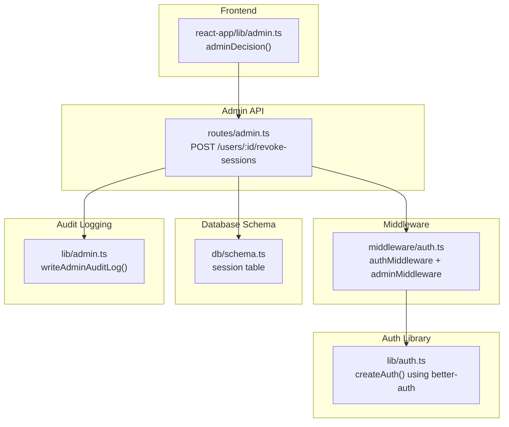
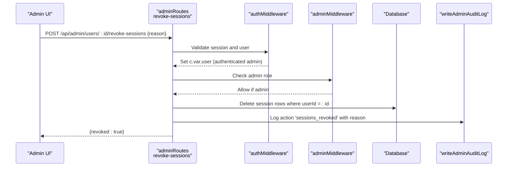
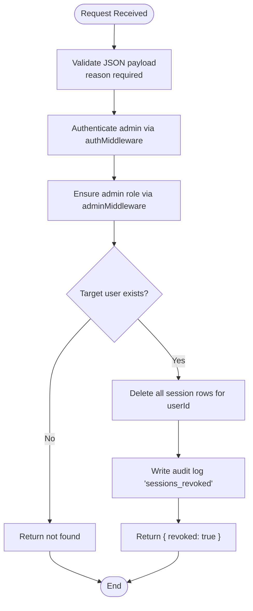
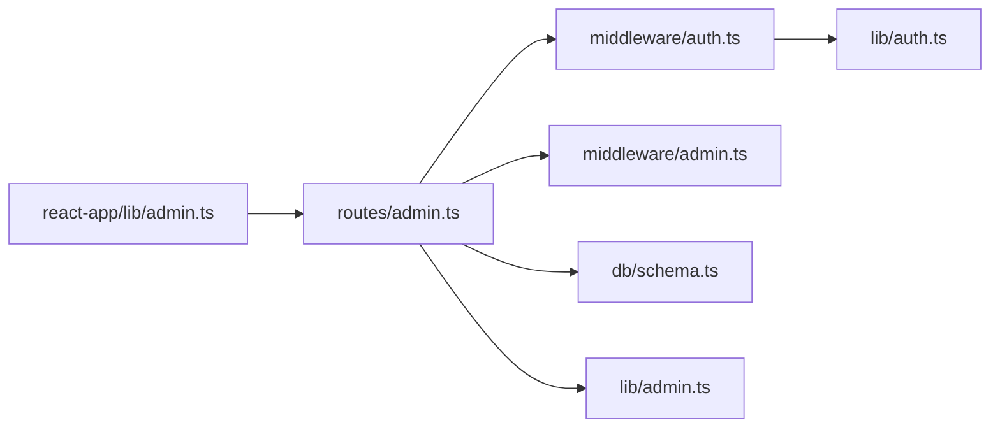

# Session Management and Revocation

<cite>
**Referenced Files in This Document**
- [admin.ts](file://src/worker/routes/admin.ts)
- [auth.ts](file://src/worker/middleware/auth.ts)
- [auth.ts](file://src/worker/lib/auth.ts)
- [schema.ts](file://src/worker/db/schema.ts)
- [admin.ts](file://src/worker/lib/admin.ts)
- [admin.ts](file://src/react-app/lib/admin.ts)
</cite>

## Table of Contents
1. [Introduction](#introduction)
2. [Project Structure](#project-structure)
3. [Core Components](#core-components)
4. [Architecture Overview](#architecture-overview)
5. [Detailed Component Analysis](#detailed-component-analysis)
6. [Dependency Analysis](#dependency-analysis)
7. [Performance Considerations](#performance-considerations)
8. [Troubleshooting Guide](#troubleshooting-guide)
9. [Conclusion](#conclusion)

## Introduction
This document explains the session management capabilities exposed to administrators, focusing on the POST /api/admin/users/:id/revoke-sessions endpoint. The endpoint enables immediate termination of all active sessions for a specified user by deleting their session records from the database. It requires an audit reason for compliance tracking and integrates with the authentication middleware that validates session tokens against the database. When invoked, it logs out the user across all devices instantly, which is essential for security incidents such as compromised accounts, suspicious activity detection, or policy violations.

## Project Structure
The session revocation feature spans several layers:
- Admin API routes define the endpoint and business logic.
- Authentication middleware validates requests and enforces admin privileges.
- Database schema defines the session table used by Better Auth.
- Audit logging persists administrative actions for compliance.
- Frontend utilities provide helper functions to call admin endpoints.

**Diagram sources**
- [admin.ts:354-364](file://src/worker/routes/admin.ts#L354-L364)
- [auth.ts:23-50](file://src/worker/middleware/auth.ts#L23-L50)
- [auth.ts:9-22](file://src/worker/lib/auth.ts#L9-L22)
- [schema.ts:107-124](file://src/worker/db/schema.ts#L107-L124)
- [admin.ts:7-31](file://src/worker/lib/admin.ts#L7-L31)
- [admin.ts:53-55](file://src/react-app/lib/admin.ts#L53-L55)

**Section sources**
- [admin.ts:354-364](file://src/worker/routes/admin.ts#L354-L364)
- [auth.ts:23-50](file://src/worker/middleware/auth.ts#L23-L50)
- [auth.ts:9-22](file://src/worker/lib/auth.ts#L9-L22)
- [schema.ts:107-124](file://src/worker/db/schema.ts#L107-L124)
- [admin.ts:7-31](file://src/worker/lib/admin.ts#L7-L31)
- [admin.ts:53-55](file://src/react-app/lib/admin.ts#L53-L55)

## Core Components
- Admin revoke-sessions endpoint: Validates input, ensures permissions, deletes all sessions for the target user, and writes an audit log.
- Authentication middleware: Ensures the caller is authenticated and has admin privileges; subsequent requests validate session tokens against the database via Better Auth.
- Session schema: Defines the session table with fields like token, expiresAt, userId, and indexes for efficient lookups and deletions.
- Audit logging: Persists admin actions with actor, action type, target, and reason for compliance.
- Frontend helpers: Provide typed calls to admin endpoints, including decision-based POSTs that include reason and optional note.

Key responsibilities:
- Input validation: reason must be present and within allowed length constraints.
- Authorization: Only users with admin roles can invoke this endpoint.
- Data mutation: Delete all session rows for the target user.
- Compliance: Record the action in the audit log with the provided reason.

**Section sources**
- [admin.ts:354-364](file://src/worker/routes/admin.ts#L354-L364)
- [auth.ts:23-50](file://src/worker/middleware/auth.ts#L23-L50)
- [schema.ts:107-124](file://src/worker/db/schema.ts#L107-L124)
- [admin.ts:7-31](file://src/worker/lib/admin.ts#L7-L31)
- [admin.ts:53-55](file://src/react-app/lib/admin.ts#L53-L55)

## Architecture Overview
The revoke-sessions workflow involves the following steps:
1. Admin client sends a POST request to /api/admin/users/:id/revoke-sessions with a JSON body containing reason (and optional note).
2. Middleware chain authenticates the admin and checks admin role.
3. Route handler validates the payload, verifies the target user exists, deletes all session rows for that user, and writes an audit log entry.
4. Subsequent requests from the target user will fail authentication because their session tokens are no longer valid in the database.

**Diagram sources**
- [admin.ts:354-364](file://src/worker/routes/admin.ts#L354-L364)
- [auth.ts:23-50](file://src/worker/middleware/auth.ts#L23-L50)
- [admin.ts:7-31](file://src/worker/lib/admin.ts#L7-L31)

## Detailed Component Analysis

### Revoke Sessions Endpoint
- Path: POST /api/admin/users/:id/revoke-sessions
- Request body:
  - reason: string (required, trimmed, min 3, max 500)
  - note: string (optional, trimmed, max 1000)
- Behavior:
  - Validates the request payload.
  - Ensures the calling admin can act on the target user (moderators cannot act on other admins).
  - Verifies the target user exists.
  - Deletes all session records for the target user.
  - Writes an audit log entry with action 'sessions_revoked', target type 'user', target id, and reason.
  - Returns a success response indicating revocation.

Security considerations:
- Requires admin role; unauthorized access returns forbidden.
- Immediate effect: All active sessions for the user are invalidated at once.
- Audit trail: Reason is persisted for compliance and incident review.

**Diagram sources**
- [admin.ts:354-364](file://src/worker/routes/admin.ts#L354-L364)
- [auth.ts:23-50](file://src/worker/middleware/auth.ts#L23-L50)
- [admin.ts:7-31](file://src/worker/lib/admin.ts#L7-L31)

**Section sources**
- [admin.ts:354-364](file://src/worker/routes/admin.ts#L354-L364)

### Authentication Middleware Integration
- authMiddleware:
  - Uses createAuth() to obtain Better Auth instance configured with Drizzle adapter.
  - Retrieves session via headers; if missing or invalid, returns unauthorized.
  - Loads user details and admin role; rejects suspended accounts.
  - Sets c.var.user for downstream handlers.
- adminMiddleware:
  - Enforces that c.var.user.adminRole is set; otherwise returns forbidden.

Impact on session revocation:
- After revoke-sessions deletes session rows, any subsequent request from the target user will fail at authMiddleware because the session token is no longer present in the database.
- Suspended accounts are rejected early, but revocation is independent of account status.

**Section sources**
- [auth.ts:23-50](file://src/worker/middleware/auth.ts#L23-L50)
- [auth.ts:9-22](file://src/worker/lib/auth.ts#L9-L22)

### Database Schema: Session Table
- Fields:
  - id: primary key
  - expiresAt: expiration timestamp
  - token: unique session token
  - createdAt, updatedAt: timestamps
  - ipAddress, userAgent: device context
  - userId: foreign key to users
- Indexes:
  - session_user_id_idx: supports fast deletion by userId during revocation.

Operational implications:
- Deleting by userId leverages the index for efficient bulk removal.
- Token uniqueness prevents duplicate sessions per token value.

**Section sources**
- [schema.ts:107-124](file://src/worker/db/schema.ts#L107-L124)

### Audit Logging
- writeAdminAuditLog:
  - Persists actorId, action, targetType, targetId, reason, and metadata.
  - Emits a structured console log for observability.
- Usage in revoke-sessions:
  - Records 'sessions_revoked' with the provided reason and target user id.

Compliance benefits:
- Provides an immutable record of administrative actions.
- Supports incident response and regulatory audits.

**Section sources**
- [admin.ts:7-31](file://src/worker/lib/admin.ts#L7-L31)
- [admin.ts:354-364](file://src/worker/routes/admin.ts#L354-L364)

### Frontend Integration
- adminDecision(path, reason, note?):
  - Helper to POST decisions to admin endpoints with reason and optional note.
- Typical usage:
  - Admin UI invokes revoke-sessions through this helper, ensuring consistent payload structure.

User experience implications:
- After revocation, the target user’s next request fails authentication, prompting re-login.
- Admin UI should notify the operator of successful revocation and guide them to communicate the change to the affected user if needed.

**Section sources**
- [admin.ts:53-55](file://src/react-app/lib/admin.ts#L53-L55)
- [admin.ts:354-364](file://src/worker/routes/admin.ts#L354-L364)

## Dependency Analysis
The revoke-sessions feature depends on:
- Hono routing and validation (@hono/zod-validator).
- Drizzle ORM for database operations.
- Better Auth for session lifecycle and validation.
- Admin middleware for authorization.
- Audit logging utility for compliance.

**Diagram sources**
- [admin.ts:354-364](file://src/worker/routes/admin.ts#L354-L364)
- [auth.ts:23-50](file://src/worker/middleware/auth.ts#L23-L50)
- [schema.ts:107-124](file://src/worker/db/schema.ts#L107-L124)
- [admin.ts:7-31](file://src/worker/lib/admin.ts#L7-L31)
- [auth.ts:9-22](file://src/worker/lib/auth.ts#L9-L22)
- [admin.ts:53-55](file://src/react-app/lib/admin.ts#L53-L55)

**Section sources**
- [admin.ts:354-364](file://src/worker/routes/admin.ts#L354-L364)
- [auth.ts:23-50](file://src/worker/middleware/auth.ts#L23-L50)
- [schema.ts:107-124](file://src/worker/db/schema.ts#L107-L124)
- [admin.ts:7-31](file://src/worker/lib/admin.ts#L7-L31)
- [auth.ts:9-22](file://src/worker/lib/auth.ts#L9-L22)
- [admin.ts:53-55](file://src/react-app/lib/admin.ts#L53-L55)

## Performance Considerations
- Deletion complexity: O(n) over the number of sessions for the target user; index on userId improves lookup performance.
- Batch operations: If multiple related actions occur (e.g., suspend + revoke), consider batching DB statements to reduce round trips.
- Concurrency: Ensure atomicity when revoking sessions alongside other account changes to avoid race conditions.
- Observability: Audit logs and console events help monitor revocation frequency and potential abuse patterns.

[No sources needed since this section provides general guidance]

## Troubleshooting Guide
Common issues and resolutions:
- Unauthorized or forbidden responses:
  - Ensure the caller has an active admin session and admin role.
  - Verify that moderators cannot act on other administrators.
- Not found errors:
  - Confirm the target user id exists before invoking revoke-sessions.
- Validation errors:
  - Provide a reason within the allowed length range; ensure proper trimming.
- Immediate logout behavior:
  - Clients may receive authentication failures on subsequent requests; implement re-login flows accordingly.
- Audit log verification:
  - Check the admin audit log endpoint to confirm 'sessions_revoked' entries with reasons.

**Section sources**
- [admin.ts:354-364](file://src/worker/routes/admin.ts#L354-L364)
- [auth.ts:23-50](file://src/worker/middleware/auth.ts#L23-L50)
- [admin.ts:7-31](file://src/worker/lib/admin.ts#L7-L31)

## Conclusion
The POST /api/admin/users/:id/revoke-sessions endpoint provides a robust mechanism for administrators to immediately terminate all active sessions for a user. By leveraging Better Auth’s database-backed sessions and enforcing strict admin authorization, it ensures rapid incident response while maintaining compliance through detailed audit logging. Proper frontend integration and clear user experience handling are essential to manage the immediate effects of session revocation across all devices.