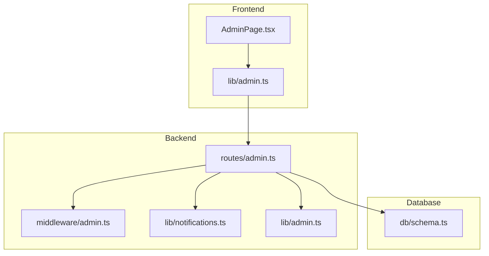
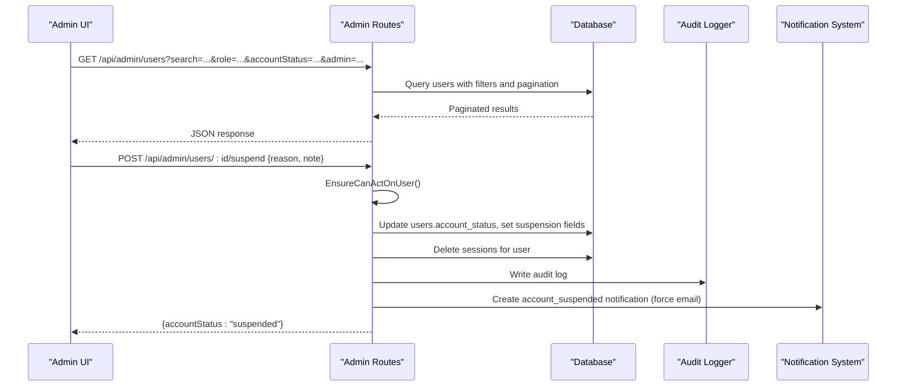
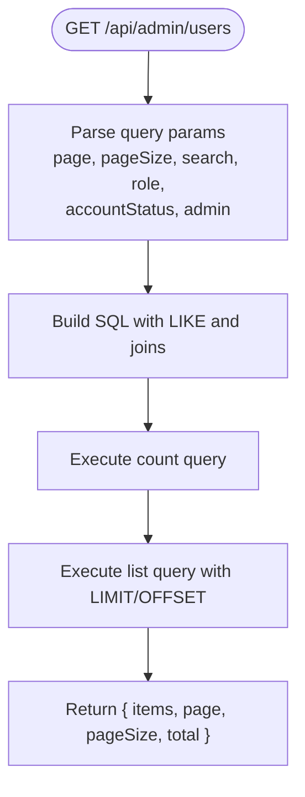
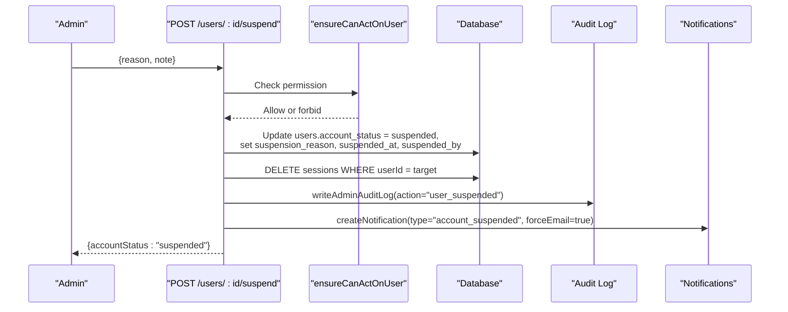
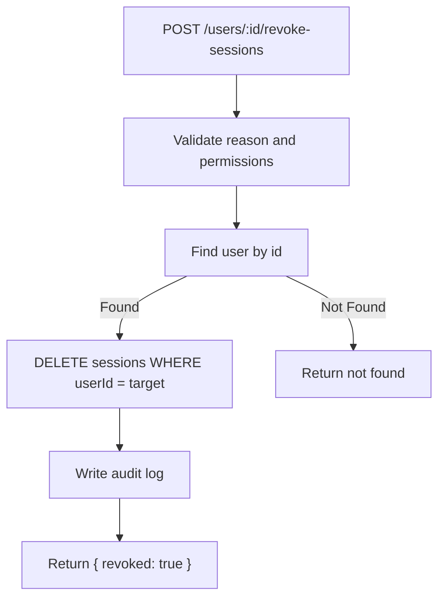
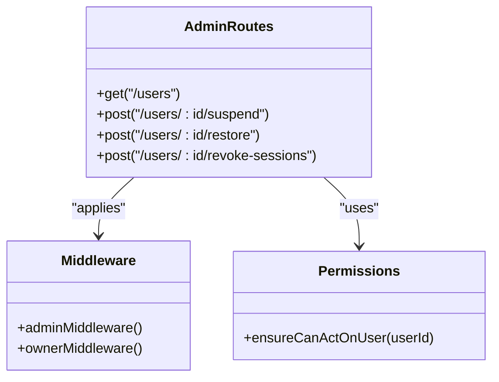
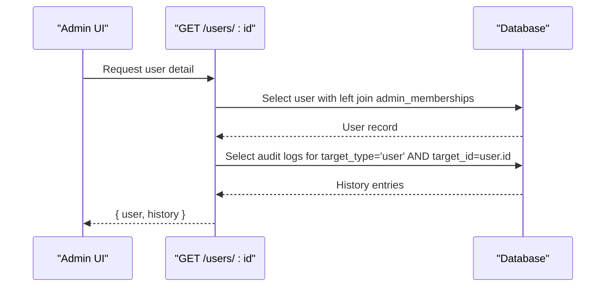
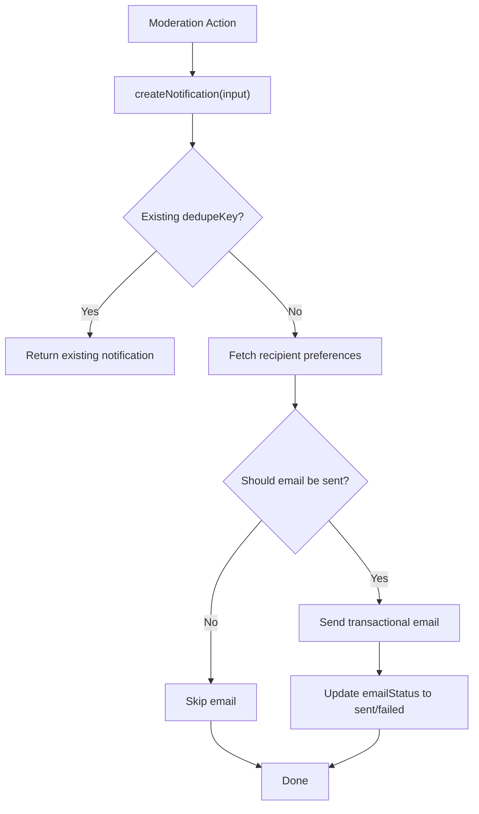
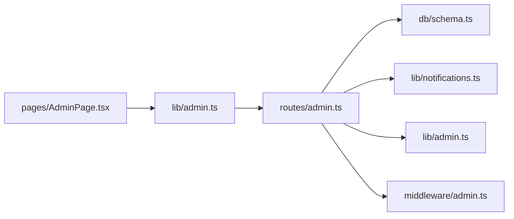

# User Moderation and Management

<cite>
**Referenced Files in This Document**
- [admin.ts](file://src/worker/routes/admin.ts)
- [AdminPage.tsx](file://src/react-app/pages/AdminPage.tsx)
- [admin.ts](file://src/react-app/lib/admin.ts)
- [schema.ts](file://src/worker/db/schema.ts)
- [notifications.ts](file://src/worker/lib/notifications.ts)
- [admin.ts](file://src/worker/lib/admin.ts)
- [admin.ts](file://src/worker/middleware/admin.ts)
</cite>

## Table of Contents
1. [Introduction](#introduction)
2. [Project Structure](#project-structure)
3. [Core Components](#core-components)
4. [Architecture Overview](#architecture-overview)
5. [Detailed Component Analysis](#detailed-component-analysis)
6. [Dependency Analysis](#dependency-analysis)
7. [Performance Considerations](#performance-considerations)
8. [Troubleshooting Guide](#troubleshooting-guide)
9. [Conclusion](#conclusion)
10. [Appendices](#appendices)

## Introduction
This document explains the user moderation and management capabilities in the admin system. It covers how administrators search and filter users, suspend and restore accounts with required reasons and audit logging, revoke sessions for security incidents, enforce permissions so moderators cannot act on other administrators while owners retain full access, view detailed user history including suspension records and administrative actions, and understand the notification system that informs users about account status changes.

## Project Structure
The admin functionality is implemented across:
- Backend routes handling all admin operations (search, filters, suspend/restore, session revocation, reports, audit log).
- Frontend pages providing the UI for moderation workflows.
- Database schema defining users, sessions, moderation cases, notifications, and audit logs.
- Notification library responsible for creating in-app notifications and sending transactional emails.
- Admin middleware enforcing role-based access control.

**Diagram sources**
- [AdminPage.tsx](file://src/react-app/pages/AdminPage.tsx)
- [admin.ts](file://src/react-app/lib/admin.ts)
- [admin.ts](file://src/worker/routes/admin.ts)
- [admin.ts](file://src/worker/middleware/admin.ts)
- [notifications.ts](file://src/worker/lib/notifications.ts)
- [admin.ts](file://src/worker/lib/admin.ts)
- [schema.ts](file://src/worker/db/schema.ts)

**Section sources**
- [admin.ts](file://src/worker/routes/admin.ts)
- [AdminPage.tsx](file://src/react-app/pages/AdminPage.tsx)
- [admin.ts](file://src/react-app/lib/admin.ts)
- [schema.ts](file://src/worker/db/schema.ts)
- [notifications.ts](file://src/worker/lib/notifications.ts)
- [admin.ts](file://src/worker/lib/admin.ts)
- [admin.ts](file://src/worker/middleware/admin.ts)

## Core Components
- User search and filtering: The admin users endpoint supports pagination and filters by email, username, role, account status, and whether the user has an administrator membership.
- Suspension and restoration: Dedicated endpoints require a reason field, update user state, clear sessions on suspension, and create notifications to inform users.
- Session revocation: An endpoint deletes all active sessions for a target user, with audit logging.
- Permission enforcement: Middleware enforces admin or owner roles; additional checks prevent moderators from acting on other administrators.
- Audit logging: All administrative actions are recorded with actor, action type, target, reason, and optional metadata.
- Notifications: Account-related events generate in-app notifications and optionally send transactional emails based on user preferences.

**Section sources**
- [admin.ts](file://src/worker/routes/admin.ts)
- [admin.ts](file://src/worker/middleware/admin.ts)
- [admin.ts](file://src/worker/lib/admin.ts)
- [notifications.ts](file://src/worker/lib/notifications.ts)
- [schema.ts](file://src/worker/db/schema.ts)

## Architecture Overview
The admin workflow follows a layered architecture:
- Frontend components call typed API helpers to perform actions.
- Backend routes validate inputs, enforce authorization, execute business logic, and persist changes.
- Data layer uses Drizzle ORM and raw SQL queries for performance-critical operations.
- Side effects include writing audit logs and creating notifications (with optional email delivery).

**Diagram sources**
- [admin.ts](file://src/worker/routes/admin.ts)
- [notifications.ts](file://src/worker/lib/notifications.ts)
- [admin.ts](file://src/worker/lib/admin.ts)
- [schema.ts](file://src/worker/db/schema.ts)

## Detailed Component Analysis

### User Search and Filtering
- Endpoint: GET /api/admin/users
- Filters:
  - search: matches against email, username, and id
  - role: subscriber or creator
  - accountStatus: active or suspended
  - admin: yes/no to filter users with or without administrator memberships
- Pagination: page and pageSize parameters with offset calculation
- Response includes user details and their admin role if present

**Diagram sources**
- [admin.ts](file://src/worker/routes/admin.ts)

**Section sources**
- [admin.ts](file://src/worker/routes/admin.ts)

### Suspension and Restoration Workflows
- Suspend:
  - Requires a reason field validated by schema
  - Updates user account status to suspended, sets suspension reason and timestamp, records who suspended
  - Deletes all sessions for the user
  - Creates an account_suspended notification with force email enabled
  - Writes an audit log entry
- Restore:
  - Requires a reason field validated by schema
  - Resets account status to active and clears suspension fields
  - Creates an account_restored notification with force email enabled
  - Writes an audit log entry

**Diagram sources**
- [admin.ts](file://src/worker/routes/admin.ts)
- [notifications.ts](file://src/worker/lib/notifications.ts)
- [admin.ts](file://src/worker/lib/admin.ts)

**Section sources**
- [admin.ts](file://src/worker/routes/admin.ts)
- [notifications.ts](file://src/worker/lib/notifications.ts)
- [admin.ts](file://src/worker/lib/admin.ts)

### Session Revocation for Security Incidents
- Endpoint: POST /api/admin/users/:id/revoke-sessions
- Validates reason and permission
- Deletes all sessions associated with the target user
- Writes an audit log entry
- Returns confirmation

**Diagram sources**
- [admin.ts](file://src/worker/routes/admin.ts)

**Section sources**
- [admin.ts](file://src/worker/routes/admin.ts)

### Permission System and Access Control
- Global admin route protection via adminMiddleware requiring adminRole presence
- Owner-only endpoints protected by ownerMiddleware
- Additional check ensureCanActOnUser prevents moderators from acting on administrators
- Owner can always act on any user; moderator cannot act on users with admin memberships

**Diagram sources**
- [admin.ts](file://src/worker/routes/admin.ts)
- [admin.ts](file://src/worker/middleware/admin.ts)

**Section sources**
- [admin.ts](file://src/worker/routes/admin.ts)
- [admin.ts](file://src/worker/middleware/admin.ts)

### User Detail View and History
- Endpoint: GET /api/admin/users/:id
- Returns user profile data including account status, suspension reason, timestamps, and admin role
- Includes recent administrative actions targeting this user from audit logs (limited to last 50 entries)

**Diagram sources**
- [admin.ts](file://src/worker/routes/admin.ts)

**Section sources**
- [admin.ts](file://src/worker/routes/admin.ts)

### Notification System for Account Status Changes
- Notification types relevant to moderation:
  - account_suspended
  - account_restored
  - content_hidden
  - content_restored
- Categories include 'account', which bypasses general email preference restrictions
- Deduplication ensures identical dedupeKey does not create duplicate notifications
- Email delivery respects per-user preferences unless forceEmail is set

**Diagram sources**
- [notifications.ts](file://src/worker/lib/notifications.ts)

**Section sources**
- [notifications.ts](file://src/worker/lib/notifications.ts)

### Common Moderation Scenarios
- Handling abusive users:
  - Use the Users page to locate the user by search filters
  - Suspend the account with a clear reason; sessions are revoked automatically
  - Optionally hide specific posts or replies via the Reports workflow
  - Review audit logs to track actions taken
- Resolving spam accounts:
  - Filter users by role and account status
  - Suspend the account and revoke sessions
  - Hide spam content through moderation actions
  - Document reasons in audit logs for compliance
- Managing compromised accounts:
  - Revoke all sessions immediately to force re-authentication
  - Suspend the account until ownership is verified
  - Communicate via notifications and maintain audit trail

[No sources needed since this section doesn't analyze specific files]

## Dependency Analysis
- Admin routes depend on:
  - Database schema for users, sessions, admin_memberships, moderation_cases, notifications, and audit logs
  - Notification library for creating notifications and sending emails
  - Admin utilities for audit logging and owner safety checks
- Frontend depends on:
  - Typed API helpers for consistent request/response handling
  - React Query for caching and refetching admin data

**Diagram sources**
- [admin.ts](file://src/worker/routes/admin.ts)
- [schema.ts](file://src/worker/db/schema.ts)
- [notifications.ts](file://src/worker/lib/notifications.ts)
- [admin.ts](file://src/worker/lib/admin.ts)
- [admin.ts](file://src/worker/middleware/admin.ts)
- [AdminPage.tsx](file://src/react-app/pages/AdminPage.tsx)
- [admin.ts](file://src/react-app/lib/admin.ts)

**Section sources**
- [admin.ts](file://src/worker/routes/admin.ts)
- [schema.ts](file://src/worker/db/schema.ts)
- [notifications.ts](file://src/worker/lib/notifications.ts)
- [admin.ts](file://src/worker/lib/admin.ts)
- [admin.ts](file://src/worker/middleware/admin.ts)
- [AdminPage.tsx](file://src/react-app/pages/AdminPage.tsx)
- [admin.ts](file://src/react-app/lib/admin.ts)

## Performance Considerations
- Pagination is enforced on list endpoints to limit result sets
- Raw SQL queries are used for complex filtering and counting to optimize performance
- Audit logs and notifications are written asynchronously where possible to avoid blocking critical paths
- Deduplication keys prevent redundant notifications and reduce database writes

[No sources needed since this section provides general guidance]

## Troubleshooting Guide
- If moderators cannot act on administrators, verify the target user’s admin membership and ensure the actor is an owner
- If notifications are not delivered, check user email preferences and transactional email configuration
- If session revocation fails, confirm the user exists and that the requesting admin has sufficient permissions
- For missing audit logs, verify that writeAdminAuditLog is called after each administrative action

**Section sources**
- [admin.ts](file://src/worker/routes/admin.ts)
- [notifications.ts](file://src/worker/lib/notifications.ts)
- [admin.ts](file://src/worker/lib/admin.ts)

## Conclusion
The admin system provides robust user moderation and management capabilities with strong permission controls, comprehensive audit logging, and reliable notifications. Administrators can efficiently search and filter users, suspend and restore accounts with documented reasons, revoke sessions during security incidents, and review detailed histories of administrative actions. Owners retain full access while moderators are restricted from acting on other administrators, ensuring safe and accountable moderation practices.

[No sources needed since this section summarizes without analyzing specific files]

## Appendices

### API Endpoints Summary
- GET /api/admin/users: List and filter users with pagination
- GET /api/admin/users/:id: Get user details and recent audit history
- POST /api/admin/users/:id/suspend: Suspend a user with reason and audit log
- POST /api/admin/users/:id/restore: Restore a user with reason and audit log
- POST /api/admin/users/:id/revoke-sessions: Revoke all sessions for a user with audit log
- GET /api/admin/audit-log: Paginated audit log entries filtered by action

**Section sources**
- [admin.ts](file://src/worker/routes/admin.ts)