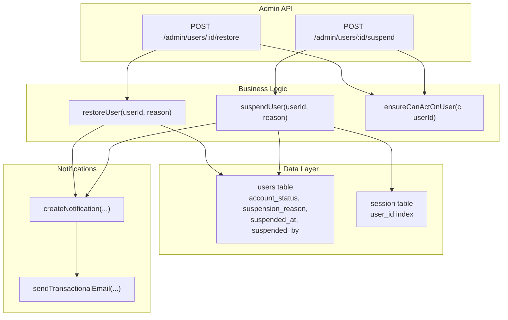
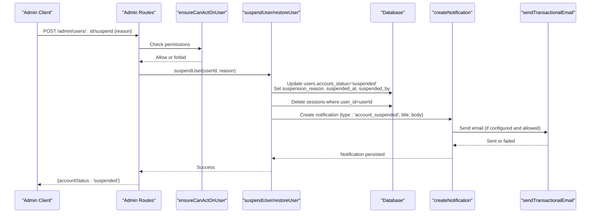
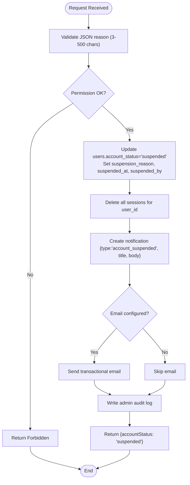
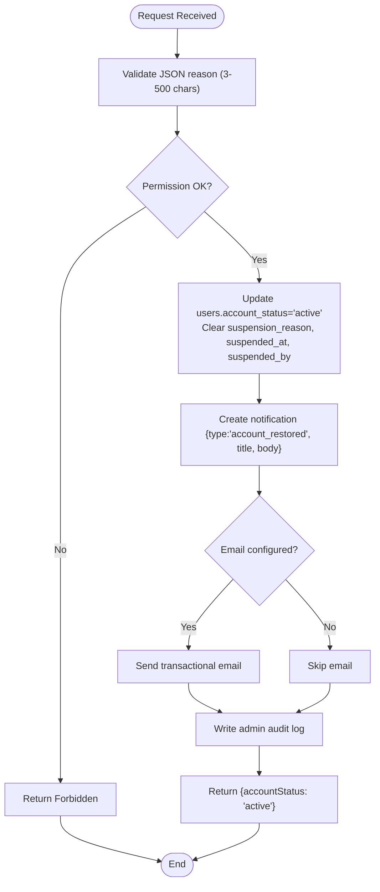
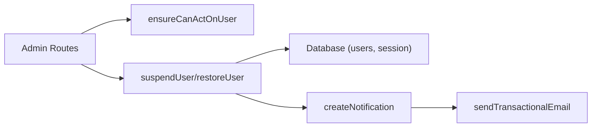

# User Suspension and Restoration

<cite>
**Referenced Files in This Document**
- [admin.ts](file://src/worker/routes/admin.ts)
- [notifications.ts](file://src/worker/lib/notifications.ts)
- [email.ts](file://src/worker/lib/email.ts)
- [schema.ts](file://src/worker/db/schema.ts)
- [admin.ts](file://src/worker/middleware/admin.ts)
</cite>

## Table of Contents
1. [Introduction](#introduction)
2. [Project Structure](#project-structure)
3. [Core Components](#core-components)
4. [Architecture Overview](#architecture-overview)
5. [Detailed Component Analysis](#detailed-component-analysis)
6. [Dependency Analysis](#dependency-analysis)
7. [Performance Considerations](#performance-considerations)
8. [Troubleshooting Guide](#troubleshooting-guide)
9. [Conclusion](#conclusion)

## Introduction
This document explains the moderation system’s user suspension and restoration workflows, focusing on:
- POST /admin/users/:id/suspend with a required reason field (3–500 characters)
- POST /admin/users/:id/restore with similar validation
- The suspendUser function that updates account status to 'suspended', records the reason and timestamp, deletes all active sessions, and sends an automated notification
- The restoreUser function that reactivates accounts by clearing suspension fields and sending a restoration notification
- Permission checks via ensureCanActOnUser to prevent moderators from acting on administrators while allowing owners full access
- Examples of proper reason documentation for compliance and audit purposes
- The notification system that automatically alerts users about account status changes with appropriate titles and body content

## Project Structure
The relevant implementation is primarily located under the worker routes and libraries:
- Admin API endpoints are defined in the admin routes file
- Notification creation and email delivery are handled in the notifications library
- Email transport is implemented in the email library
- Database schema defines user fields for suspension state and session table structure
- Middleware enforces admin and owner roles

**Diagram sources**
- [admin.ts:334-352](file://src/worker/routes/admin.ts#L334-L352)
- [admin.ts:514-529](file://src/worker/routes/admin.ts#L514-L529)
- [schema.ts:5-32](file://src/worker/db/schema.ts#L5-L32)
- [schema.ts:108-124](file://src/worker/db/schema.ts#L108-L124)
- [notifications.ts:153-234](file://src/worker/lib/notifications.ts#L153-L234)
- [email.ts:27-43](file://src/worker/lib/email.ts#L27-L43)

**Section sources**
- [admin.ts:334-352](file://src/worker/routes/admin.ts#L334-L352)
- [admin.ts:514-529](file://src/worker/routes/admin.ts#L514-L529)
- [schema.ts:5-32](file://src/worker/db/schema.ts#L5-L32)
- [schema.ts:108-124](file://src/worker/db/schema.ts#L108-L124)
- [notifications.ts:153-234](file://src/worker/lib/notifications.ts#L153-L234)
- [email.ts:27-43](file://src/worker/lib/email.ts#L27-L43)

## Core Components
- Admin endpoints:
  - POST /admin/users/:id/suspend validates JSON input with a reason field constrained to 3–500 characters and calls suspendUser
  - POST /admin/users/:id/restore validates JSON input similarly and calls restoreUser
- Permission guard:
  - ensureCanActOnUser prevents moderators from acting on administrators; owners bypass this restriction
- Business functions:
  - suspendUser sets account_status to 'suspended', records suspension_reason and suspended_at, records suspended_by, deletes all sessions for the user, and creates a notification
  - restoreUser sets account_status to 'active', clears suspension_reason, suspended_at, and suspended_by, and creates a restoration notification
- Notifications:
  - createNotification persists a notification record and optionally sends an email if configured and allowed by preferences or forceEmail flag
- Email:
  - sendTransactionalEmail uses Cloudflare Email binding to deliver messages

**Section sources**
- [admin.ts:334-352](file://src/worker/routes/admin.ts#L334-L352)
- [admin.ts:514-529](file://src/worker/routes/admin.ts#L514-L529)
- [notifications.ts:153-234](file://src/worker/lib/notifications.ts#L153-L234)
- [email.ts:27-43](file://src/worker/lib/email.ts#L27-L43)
- [schema.ts:5-32](file://src/worker/db/schema.ts#L5-L32)
- [schema.ts:108-124](file://src/worker/db/schema.ts#L108-L124)

## Architecture Overview
The workflow begins at the admin endpoint, proceeds through permission checks, executes business logic to update user state and sessions, logs actions, and triggers notifications.

**Diagram sources**
- [admin.ts:334-342](file://src/worker/routes/admin.ts#L334-L342)
- [admin.ts:514-521](file://src/worker/routes/admin.ts#L514-L521)
- [notifications.ts:153-234](file://src/worker/lib/notifications.ts#L153-L234)
- [email.ts:27-43](file://src/worker/lib/email.ts#L27-L43)

## Detailed Component Analysis

### Suspend Endpoint: POST /admin/users/:id/suspend
- Validates request JSON using a schema requiring a reason field between 3 and 500 characters
- Calls ensureCanActOnUser to enforce role-based restrictions
- Invokes suspendUser with the target user ID and reason
- Records an admin audit log entry for accountability
- Returns updated account status

Key behaviors:
- Reason validation ensures consistent, auditable documentation
- Permission check prevents moderator abuse against administrators
- Audit logging supports compliance and review processes

**Section sources**
- [admin.ts:334-342](file://src/worker/routes/admin.ts#L334-L342)
- [admin.ts:79-83](file://src/worker/routes/admin.ts#L79-L83)

### Restore Endpoint: POST /admin/users/:id/restore
- Validates request JSON similarly to suspend
- Calls ensureCanActOnUser for permission enforcement
- Invokes restoreUser to reactivate the account
- Records an admin audit log entry
- Returns updated account status

Key behaviors:
- Ensures only authorized actors can restore accounts
- Maintains audit trail for restoration actions

**Section sources**
- [admin.ts:344-352](file://src/worker/routes/admin.ts#L344-L352)
- [admin.ts:79-83](file://src/worker/routes/admin.ts#L79-L83)

### Permission Guard: ensureCanActOnUser
- Allows owners to act on any user without restriction
- Prevents moderators from acting on users who have administrator roles
- Returns a forbidden response when unauthorized

Operational impact:
- Enforces least privilege for moderators
- Preserves platform governance by protecting administrators

**Section sources**
- [admin.ts:79-83](file://src/worker/routes/admin.ts#L79-L83)
- [admin.ts:5-13](file://src/worker/middleware/admin.ts#L5-L13)

### Suspend Function: suspendUser
Responsibilities:
- Updates users.account_status to 'suspended'
- Sets suspension_reason and suspended_at to capture context and time
- Records suspended_by to identify the actor
- Deletes all active sessions for the targeted user to immediately invalidate access
- Creates a notification with type 'account_suspended', title indicating suspension, and body containing the reason
- Forces email delivery when configured

Data model interactions:
- Users table fields: account_status, suspension_reason, suspended_at, suspended_by
- Sessions table deletion by user_id index

Notification details:
- Dedupe key ensures idempotency
- Title and body provide clear communication to the affected user

**Section sources**
- [admin.ts:514-521](file://src/worker/routes/admin.ts#L514-L521)
- [schema.ts:5-32](file://src/worker/db/schema.ts#L5-L32)
- [schema.ts:108-124](file://src/worker/db/schema.ts#L108-L124)
- [notifications.ts:153-234](file://src/worker/lib/notifications.ts#L153-L234)

### Restore Function: restoreUser
Responsibilities:
- Updates users.account_status to 'active'
- Clears suspension_reason, suspended_at, and suspended_by
- Creates a notification with type 'account_restored', title indicating restoration, and body containing the reason
- Forces email delivery when configured

Data model interactions:
- Users table fields cleared to reflect restored state

Notification details:
- Dedupe key ensures idempotency
- Title and body inform the user of successful restoration

**Section sources**
- [admin.ts:523-529](file://src/worker/routes/admin.ts#L523-L529)
- [schema.ts:5-32](file://src/worker/db/schema.ts#L5-L32)
- [notifications.ts:153-234](file://src/worker/lib/notifications.ts#L153-L234)

### Notification System Integration
- createNotification persists a notification record and conditionally sends an email
- Email sending depends on configuration and user preferences; forceEmail overrides preferences for critical account events
- Email text includes a link to the application origin when available

Operational notes:
- Dedupe keys prevent duplicate notifications for the same event
- Error handling captures email failures without blocking core operations

**Section sources**
- [notifications.ts:153-234](file://src/worker/lib/notifications.ts#L153-L234)
- [email.ts:27-43](file://src/worker/lib/email.ts#L27-L43)

### Data Model: Users and Sessions
Users table fields relevant to suspension:
- account_status: enum ['active', 'suspended']
- suspension_reason: text capturing the reason
- suspended_at: timestamp of suspension
- suspended_by: identifier of the actor performing suspension

Sessions table:
- Indexed by user_id for efficient deletion during suspension

**Section sources**
- [schema.ts:5-32](file://src/worker/db/schema.ts#L5-L32)
- [schema.ts:108-124](file://src/worker/db/schema.ts#L108-L124)

### Flowchart: Suspend Workflow

**Diagram sources**
- [admin.ts:334-342](file://src/worker/routes/admin.ts#L334-L342)
- [admin.ts:514-521](file://src/worker/routes/admin.ts#L514-L521)
- [notifications.ts:153-234](file://src/worker/lib/notifications.ts#L153-L234)
- [email.ts:27-43](file://src/worker/lib/email.ts#L27-L43)

### Flowchart: Restore Workflow

**Diagram sources**
- [admin.ts:344-352](file://src/worker/routes/admin.ts#L344-L352)
- [admin.ts:523-529](file://src/worker/routes/admin.ts#L523-L529)
- [notifications.ts:153-234](file://src/worker/lib/notifications.ts#L153-L234)
- [email.ts:27-43](file://src/worker/lib/email.ts#L27-L43)

## Dependency Analysis
- Admin routes depend on:
  - Validation schemas for reason constraints
  - Permission middleware and ensureCanActOnUser
  - Database client for queries and updates
  - Notification library for creating notifications and sending emails
- Notification library depends on:
  - Email transport for transactional emails
  - User preferences for email delivery decisions
- Schema definitions define relationships and indexes used by both suspend and restore flows

**Diagram sources**
- [admin.ts:334-352](file://src/worker/routes/admin.ts#L334-L352)
- [admin.ts:514-529](file://src/worker/routes/admin.ts#L514-L529)
- [notifications.ts:153-234](file://src/worker/lib/notifications.ts#L153-L234)
- [email.ts:27-43](file://src/worker/lib/email.ts#L27-L43)
- [schema.ts:5-32](file://src/worker/db/schema.ts#L5-L32)
- [schema.ts:108-124](file://src/worker/db/schema.ts#L108-L124)

**Section sources**
- [admin.ts:334-352](file://src/worker/routes/admin.ts#L334-L352)
- [admin.ts:514-529](file://src/worker/routes/admin.ts#L514-L529)
- [notifications.ts:153-234](file://src/worker/lib/notifications.ts#L153-L234)
- [email.ts:27-43](file://src/worker/lib/email.ts#L27-L43)
- [schema.ts:5-32](file://src/worker/db/schema.ts#L5-L32)
- [schema.ts:108-124](file://src/worker/db/schema.ts#L108-L124)

## Performance Considerations
- Session deletion uses an indexed query on user_id for efficient removal of all sessions upon suspension
- Notification creation is idempotent via dedupe keys, preventing redundant work
- Email sending is optional and non-blocking; failures are recorded without halting core operations
- Batch operations are not used in suspend/restore paths; each operation performs single updates and deletions

[No sources needed since this section provides general guidance]

## Troubleshooting Guide
Common issues and resolutions:
- Invalid reason length: Ensure the reason field is between 3 and 500 characters
- Unauthorized action: Verify the actor’s role; moderators cannot act on administrators
- Email not sent: Confirm email binding is configured and user preferences allow account notifications; forceEmail should override preferences for these events
- Audit log missing: Ensure admin audit logging is enabled and the actor has sufficient privileges

**Section sources**
- [admin.ts:334-352](file://src/worker/routes/admin.ts#L334-L352)
- [admin.ts:79-83](file://src/worker/routes/admin.ts#L79-L83)
- [notifications.ts:153-234](file://src/worker/lib/notifications.ts#L153-L234)
- [email.ts:27-43](file://src/worker/lib/email.ts#L27-L43)

## Conclusion
The moderation system implements robust user suspension and restoration workflows with strict validation, permission enforcement, comprehensive auditing, and automated notifications. Suspensions immediately revoke access by deleting sessions and clearly communicate reasons to users. Restorations revert state cleanly and notify users accordingly. These mechanisms support compliance, transparency, and operational integrity.

[No sources needed since this section summarizes without analyzing specific files]