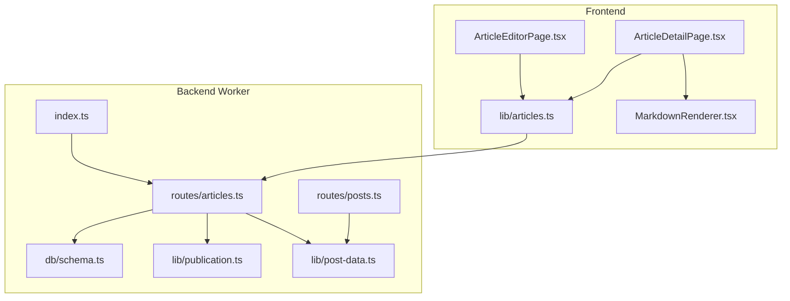
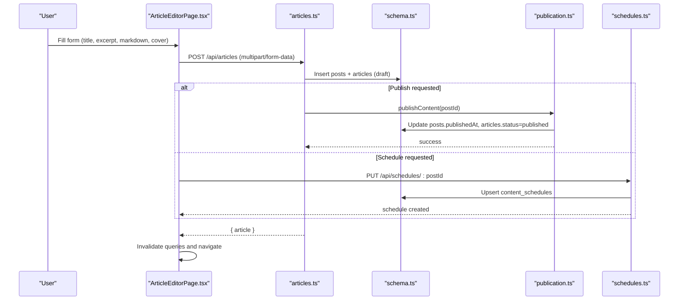
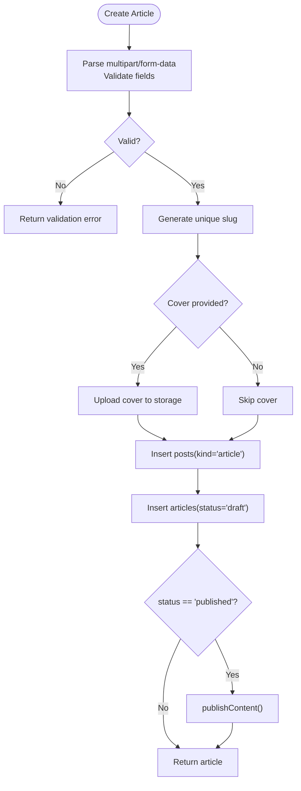
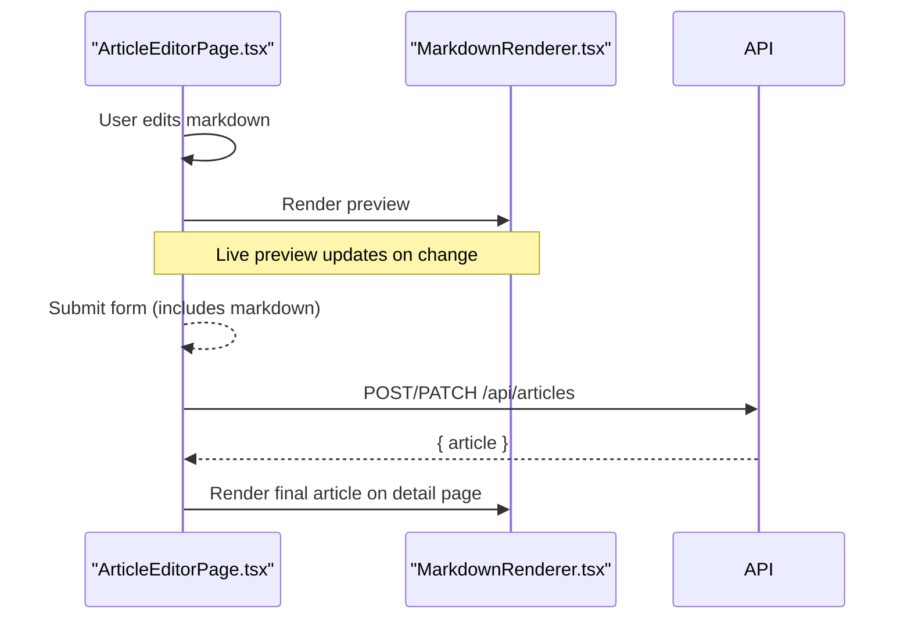
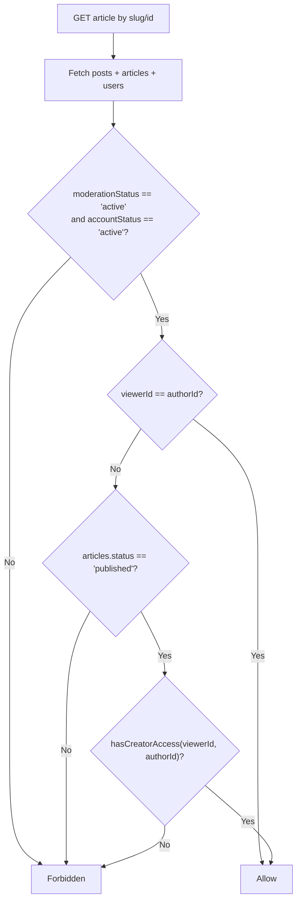
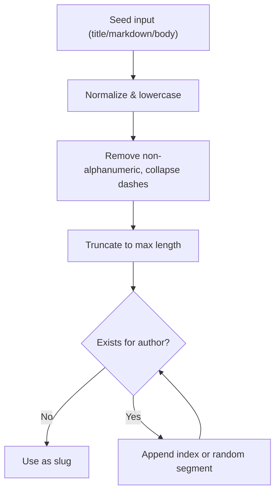
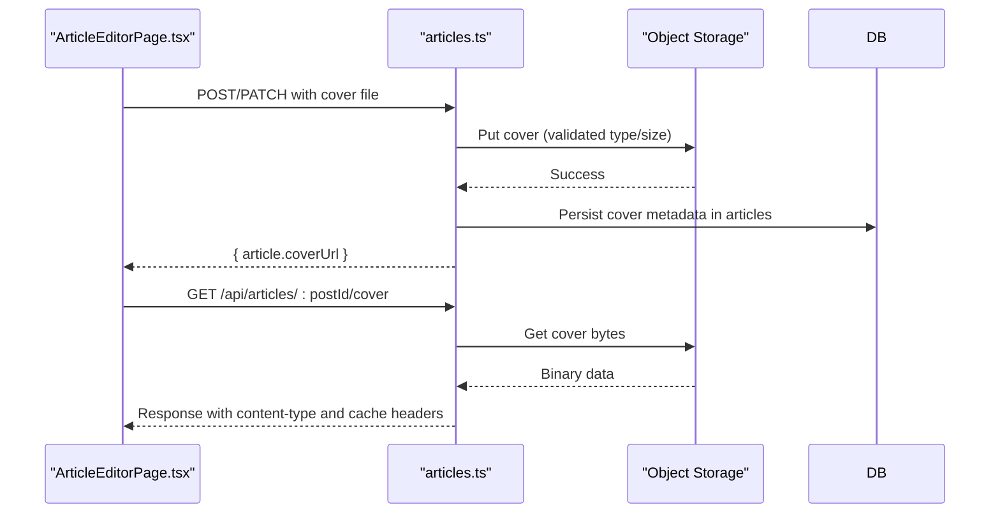
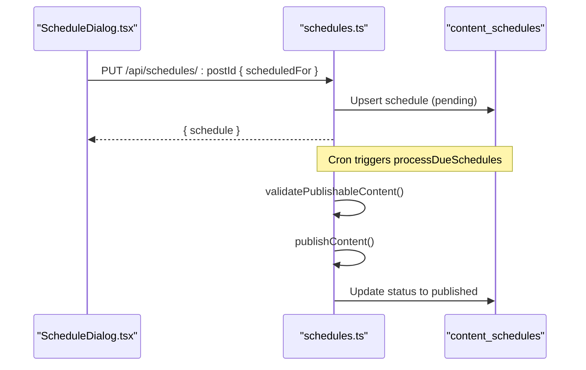
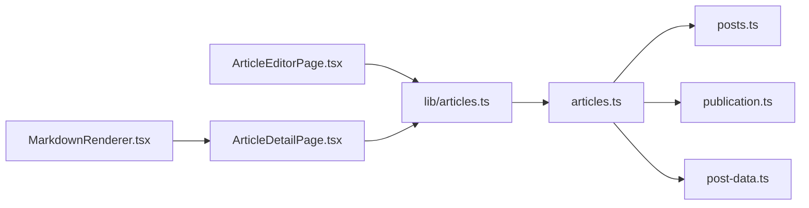

# Articles System

<cite>
**Referenced Files in This Document**
- [0005_articles.sql](file://drizzle/0005_articles.sql)
- [schema.ts](file://src/worker/db/schema.ts)
- [articles.ts](file://src/worker/routes/articles.ts)
- [posts.ts](file://src/worker/routes/posts.ts)
- [publication.ts](file://src/worker/lib/publication.ts)
- [post-data.ts](file://src/worker/lib/post-data.ts)
- [schedules.ts](file://src/worker/routes/schedules.ts)
- [index.ts](file://src/worker/index.ts)
- [articles.ts](file://src/react-app/lib/articles.ts)
- [ArticleEditorPage.tsx](file://src/react-app/pages/ArticleEditorPage.tsx)
- [ArticleDetailPage.tsx](file://src/react-app/pages/ArticleDetailPage.tsx)
- [MarkdownRenderer.tsx](file://src/react-app/components/MarkdownRenderer.tsx)
- [schemas.ts](file://src/react-app/lib/schemas.ts)
- [ScheduleDialog.tsx](file://src/react-app/components/ScheduleDialog.tsx)
- [studio_.articles.new.tsx](file://src/react-app/routes/_authenticated/studio_.articles.new.tsx)
- [studio_.articles.$postId.edit.tsx](file://src/react-app/routes/_authenticated/studio_.articles.$postId.edit.tsx)
</cite>

## Table of Contents
1. [Introduction](#introduction)
2. [Project Structure](#project-structure)
3. [Core Components](#core-components)
4. [Architecture Overview](#architecture-overview)
5. [Detailed Component Analysis](#detailed-component-analysis)
6. [Dependency Analysis](#dependency-analysis)
7. [Performance Considerations](#performance-considerations)
8. [Troubleshooting Guide](#troubleshooting-guide)
9. [Conclusion](#conclusion)
10. [Appendices](#appendices)

## Introduction
This document explains Zenith’s articles system for long-form written content with Markdown support. It covers the end-to-end workflow from authoring in the rich text editor to publishing, scheduling, and rendering. It also documents the database schema, API endpoints, image handling, preview behavior, and integration points such as moderation and membership-based access control.

## Project Structure
The articles feature spans both the backend worker (Hono routes, DB schema, publication logic) and the React frontend (editor, detail view, query hooks). Key areas:
- Backend routes under src/worker/routes handle CRUD, cover upload, and read endpoints.
- Database schema defines posts and articles tables and indexes.
- Publication and scheduling orchestrate status transitions and notifications.
- Frontend pages provide a Markdown editor with live preview and schedule dialog.



**Diagram sources**
- [index.ts:24-45](file://src/worker/index.ts#L24-L45)
- [articles.ts:1-40](file://src/worker/routes/articles.ts#L1-L40)
- [posts.ts:1-60](file://src/worker/routes/posts.ts#L1-L60)
- [publication.ts:1-40](file://src/worker/lib/publication.ts#L1-L40)
- [post-data.ts:1-40](file://src/worker/lib/post-data.ts#L1-L40)
- [schema.ts:168-231](file://src/worker/db/schema.ts#L168-L231)
- [ArticleEditorPage.tsx:1-40](file://src/react-app/pages/ArticleEditorPage.tsx#L1-L40)
- [ArticleDetailPage.tsx:1-30](file://src/react-app/pages/ArticleDetailPage.tsx#L1-L30)
- [MarkdownRenderer.tsx:1-20](file://src/react-app/components/MarkdownRenderer.tsx#L1-L20)
- [articles.ts:1-30](file://src/react-app/lib/articles.ts#L1-L30)

**Section sources**
- [index.ts:24-45](file://src/worker/index.ts#L24-L45)
- [schema.ts:168-231](file://src/worker/db/schema.ts#L168-L231)
- [articles.ts:1-40](file://src/worker/routes/articles.ts#L1-L40)
- [ArticleEditorPage.tsx:1-40](file://src/react-app/pages/ArticleEditorPage.tsx#L1-L40)
- [ArticleDetailPage.tsx:1-30](file://src/react-app/pages/ArticleDetailPage.tsx#L1-L30)
- [MarkdownRenderer.tsx:1-20](file://src/react-app/components/MarkdownRenderer.tsx#L1-L20)
- [articles.ts:1-30](file://src/react-app/lib/articles.ts#L1-L30)

## Core Components
- Articles API routes: Create, update, publish, read by ID or slug, and serve cover images.
- Posts base table: Shared identity, slugs, moderation, and publishedAt across content kinds.
- Articles table: Stores title, excerpt, markdown, status, cover metadata, timestamps.
- Publication engine: Validates and publishes content, updates statuses, and notifies subscribers.
- Scheduling subsystem: Creates and manages scheduled publications.
- Frontend editor: Rich Markdown editor with live preview, cover upload, and schedule dialog.
- Detail page: Renders article Markdown, shows cover, likes, saves, and replies.

**Section sources**
- [articles.ts:215-331](file://src/worker/routes/articles.ts#L215-L331)
- [schema.ts:168-231](file://src/worker/db/schema.ts#L168-L231)
- [publication.ts:197-273](file://src/worker/lib/publication.ts#L197-L273)
- [schedules.ts:170-224](file://src/worker/routes/schedules.ts#L170-L224)
- [ArticleEditorPage.tsx:79-108](file://src/react-app/pages/ArticleEditorPage.tsx#L79-L108)
- [ArticleDetailPage.tsx:20-50](file://src/react-app/pages/ArticleDetailPage.tsx#L20-L50)

## Architecture Overview
The articles system integrates frontend editing, backend validation, storage, and publishing workflows.



**Diagram sources**
- [ArticleEditorPage.tsx:79-108](file://src/react-app/pages/ArticleEditorPage.tsx#L79-L108)
- [articles.ts:215-260](file://src/worker/routes/articles.ts#L215-L260)
- [publication.ts:197-273](file://src/worker/lib/publication.ts#L197-L273)
- [schedules.ts:170-224](file://src/worker/routes/schedules.ts#L170-L224)
- [schema.ts:168-231](file://src/worker/db/schema.ts#L168-L231)

## Detailed Component Analysis

### Database Schema: Posts and Articles
- posts: Central entity with id, authorId, kind, slug, body, moderationStatus, publishedAt, timestamps.
- articles: Extends posts for long-form content with title, excerpt, markdown, status, cover metadata, publishedAt, timestamps.
- Indexes optimize queries by kind, status, publishedAt, and author relationships.

```mermaid
erDiagram
USERS ||--o{ POSTS : "author"
POSTS ||--o| ARTICLES : "extends"
POSTS {
string id PK
string author_id FK
enum kind
string slug
string body
enum moderation_status
timestamp published_at
timestamp created_at
}
ARTICLES {
string post_id PK FK
string title
string excerpt
string markdown
enum status
string cover_r2_key
string cover_file_name
string cover_content_type
int cover_size_bytes
timestamp published_at
timestamp created_at
timestamp updated_at
}
```

**Diagram sources**
- [schema.ts:168-231](file://src/worker/db/schema.ts#L168-L231)
- [0005_articles.sql:1-22](file://drizzle/0005_articles.sql#L1-L22)

**Section sources**
- [schema.ts:168-231](file://src/worker/db/schema.ts#L168-L231)
- [0005_articles.sql:1-22](file://drizzle/0005_articles.sql#L1-L22)

### Article Creation Workflow
- Frontend collects title, excerpt, markdown, optional cover, and status via a form.
- Backend validates multipart/form-data, enforces length limits, and checks required fields based on status.
- A new posts row is created with kind=article and a unique slug; an articles row is inserted with draft status.
- If status=published, the publication engine is invoked to finalize publication.



**Diagram sources**
- [articles.ts:86-131](file://src/worker/routes/articles.ts#L86-L131)
- [articles.ts:215-260](file://src/worker/routes/articles.ts#L215-L260)
- [publication.ts:197-273](file://src/worker/lib/publication.ts#L197-L273)

**Section sources**
- [articles.ts:86-131](file://src/worker/routes/articles.ts#L86-L131)
- [articles.ts:215-260](file://src/worker/routes/articles.ts#L215-L260)

### Markdown Rendering Pipeline
- Editor uses a Markdown editor component with live preview.
- Detail page renders Markdown using a sanitized renderer with GFM and styled components.
- Excerpt generation strips code blocks and Markdown syntax for feed previews.



**Diagram sources**
- [ArticleEditorPage.tsx:243-270](file://src/react-app/pages/ArticleEditorPage.tsx#L243-L270)
- [MarkdownRenderer.tsx:11-55](file://src/react-app/components/MarkdownRenderer.tsx#L11-L55)
- [articles.ts:66-73](file://src/worker/routes/articles.ts#L66-L73)

**Section sources**
- [ArticleEditorPage.tsx:243-270](file://src/react-app/pages/ArticleEditorPage.tsx#L243-L270)
- [MarkdownRenderer.tsx:11-55](file://src/react-app/components/MarkdownRenderer.tsx#L11-L55)
- [articles.ts:66-73](file://src/worker/routes/articles.ts#L66-L73)

### Draft/Published States and Access Control
- Articles have status draft/published; posts track publishedAt and moderationStatus.
- Read access requires active moderation and either viewer is author or has creator access (membership).
- Published-only reads enforce user membership unless they are the author.



**Diagram sources**
- [articles.ts:202-207](file://src/worker/routes/articles.ts#L202-L207)
- [post-data.ts:84-98](file://src/worker/lib/post-data.ts#L84-L98)

**Section sources**
- [articles.ts:202-207](file://src/worker/routes/articles.ts#L202-L207)
- [post-data.ts:84-98](file://src/worker/lib/post-data.ts#L84-L98)

### SEO-Friendly Slug Generation
- Slugs are generated from a seed (title/markdown/body), normalized and sanitized.
- Uniqueness enforced per author; suffixes or random segments used to avoid collisions.



**Diagram sources**
- [posts.ts:92-119](file://src/worker/routes/posts.ts#L92-L119)

**Section sources**
- [posts.ts:92-119](file://src/worker/routes/posts.ts#L92-L119)

### Image Embedding and Cover Handling
- Cover images are uploaded to object storage with validated type and size.
- Cover metadata stored in articles; served via a dedicated endpoint with appropriate headers.
- Frontend supports selecting/removing cover and previewing before upload.



**Diagram sources**
- [articles.ts:133-144](file://src/worker/routes/articles.ts#L133-L144)
- [articles.ts:398-415](file://src/worker/routes/articles.ts#L398-L415)
- [post-data.ts:104-106](file://src/worker/lib/post-data.ts#L104-L106)

**Section sources**
- [articles.ts:133-144](file://src/worker/routes/articles.ts#L133-L144)
- [articles.ts:398-415](file://src/worker/routes/articles.ts#L398-L415)
- [post-data.ts:104-106](file://src/worker/lib/post-data.ts#L104-L106)

### Content Preview Functionality
- The editor includes a live preview panel that renders Markdown inline.
- On mobile, preview is available via tabs.
- The detail page renders the final Markdown with styling and links.

**Section sources**
- [ArticleEditorPage.tsx:273-291](file://src/react-app/pages/ArticleEditorPage.tsx#L273-L291)
- [ArticleDetailPage.tsx:102-104](file://src/react-app/pages/ArticleDetailPage.tsx#L102-L104)
- [MarkdownRenderer.tsx:11-55](file://src/react-app/components/MarkdownRenderer.tsx#L11-L55)

### Managing Publication Schedules
- Creators can schedule articles for future publication via a dialog.
- Schedules are persisted in content_schedules with retry and failure tracking.
- Scheduled jobs process due items and call publishContent when ready.



**Diagram sources**
- [ScheduleDialog.tsx:62-77](file://src/react-app/components/ScheduleDialog.tsx#L62-L77)
- [schedules.ts:170-224](file://src/worker/routes/schedules.ts#L170-L224)
- [index.ts:64-70](file://src/worker/index.ts#L64-L70)

**Section sources**
- [ScheduleDialog.tsx:62-77](file://src/react-app/components/ScheduleDialog.tsx#L62-L77)
- [schedules.ts:170-224](file://src/worker/routes/schedules.ts#L170-L224)
- [index.ts:64-70](file://src/worker/index.ts#L64-L70)

### Search Indexing and Metadata
- The current implementation does not include a dedicated search index for articles.
- For discoverability, rely on slugs, titles, excerpts, and profile discovery categories.
- Future enhancements could add full-text indexing or external search services.

[No sources needed since this section provides general guidance]

### Tags and Categories
- Articles do not store tags/categories directly in the schema.
- Creator-level categories are managed via discovery-related tables and APIs.
- Use excerpts and titles to improve readability and SEO.

**Section sources**
- [schema.ts:210-231](file://src/worker/db/schema.ts#L210-L231)

## Dependency Analysis
- Articles routes depend on posts utilities for slug generation and extras building.
- Publication logic centralizes validation and state transitions across content kinds.
- Post-data utilities provide media URL helpers and access checks.
- Frontend relies on react-query hooks for caching and invalidation.



**Diagram sources**
- [articles.ts:1-30](file://src/worker/routes/articles.ts#L1-L30)
- [posts.ts:1-60](file://src/worker/routes/posts.ts#L1-L60)
- [publication.ts:1-40](file://src/worker/lib/publication.ts#L1-L40)
- [post-data.ts:1-40](file://src/worker/lib/post-data.ts#L1-L40)
- [articles.ts:1-30](file://src/react-app/lib/articles.ts#L1-L30)
- [ArticleEditorPage.tsx:1-40](file://src/react-app/pages/ArticleEditorPage.tsx#L1-L40)
- [ArticleDetailPage.tsx:1-30](file://src/react-app/pages/ArticleDetailPage.tsx#L1-L30)
- [MarkdownRenderer.tsx:1-20](file://src/react-app/components/MarkdownRenderer.tsx#L1-L20)

**Section sources**
- [articles.ts:1-30](file://src/worker/routes/articles.ts#L1-L30)
- [posts.ts:1-60](file://src/worker/routes/posts.ts#L1-L60)
- [publication.ts:1-40](file://src/worker/lib/publication.ts#L1-L40)
- [post-data.ts:1-40](file://src/worker/lib/post-data.ts#L1-L40)
- [articles.ts:1-30](file://src/react-app/lib/articles.ts#L1-L30)
- [ArticleEditorPage.tsx:1-40](file://src/react-app/pages/ArticleEditorPage.tsx#L1-L40)
- [ArticleDetailPage.tsx:1-30](file://src/react-app/pages/ArticleDetailPage.tsx#L1-L30)
- [MarkdownRenderer.tsx:1-20](file://src/react-app/components/MarkdownRenderer.tsx#L1-L20)

## Performance Considerations
- Use batched DB operations during publication to minimize round-trips.
- Cache cover images with short-lived cache-control headers for performance.
- Limit markdown length and image sizes to reduce payload and processing time.
- Build post extras in parallel to reduce latency when loading lists.

[No sources needed since this section provides general guidance]

## Troubleshooting Guide
- Validation errors: Ensure title/excerpt/markdown lengths and status requirements are met.
- Cover upload failures: Verify MIME types and size limits; check storage permissions.
- Publishing failures: Check account status, moderation status, and required fields (e.g., cover for articles).
- Scheduling conflicts: Avoid editing while a schedule is processing; use retry for failed schedules.

**Section sources**
- [articles.ts:106-131](file://src/worker/routes/articles.ts#L106-L131)
- [publication.ts:113-141](file://src/worker/lib/publication.ts#L113-L141)
- [schedules.ts:177-189](file://src/worker/routes/schedules.ts#L177-L189)

## Conclusion
Zenith’s articles system provides a robust pipeline for creating, managing, and publishing long-form content with Markdown. It integrates secure storage, strict validation, membership-based access, and flexible scheduling. The design balances simplicity with extensibility, enabling future enhancements like search indexing and richer metadata.

[No sources needed since this section summarizes without analyzing specific files]

## Appendices

### API Endpoints Summary
- POST /api/articles: Create article (multipart/form-data). Returns article summary.
- PATCH /api/articles/:postId: Update article (multipart/form-data). Returns article summary.
- POST /api/articles/:postId/publish: Publish article. Returns article summary.
- GET /api/articles/:postId: Read article by ID (requires auth and access). Returns article + replies.
- GET /api/articles/by-slug/:username/:slug: Read article by slug (requires auth and access). Returns article + replies.
- GET /api/articles/:postId/cover: Serve cover image (requires auth and access). Returns binary.

**Section sources**
- [articles.ts:215-331](file://src/worker/routes/articles.ts#L215-L331)
- [articles.ts:333-396](file://src/worker/routes/articles.ts#L333-L396)
- [articles.ts:398-415](file://src/worker/routes/articles.ts#L398-L415)

### Frontend Hooks and Types
- createArticle(values): POST to /api/articles.
- updateArticle(postId, values): PATCH to /api/articles/:postId.
- publishArticle(postId): POST to /api/articles/:postId/publish.
- articleDetailQueryOptions(username, slug): Query detail by slug.
- articleByIdQueryOptions(postId): Query detail by ID.

**Section sources**
- [articles.ts:46-71](file://src/react-app/lib/articles.ts#L46-L71)

### Editor and Preview
- ArticleEditorPage: Form with title, excerpt, markdown, cover, status; Save draft or Publish; Schedule dialog.
- MarkdownRenderer: Sanitized rendering with GFM and styled elements.

**Section sources**
- [ArticleEditorPage.tsx:79-108](file://src/react-app/pages/ArticleEditorPage.tsx#L79-L108)
- [MarkdownRenderer.tsx:11-55](file://src/react-app/components/MarkdownRenderer.tsx#L11-L55)

### Routes and Guards
- New article route guards creator role.
- Edit article route passes postId to editor.

**Section sources**
- [studio_.articles.new.tsx:4-11](file://src/react-app/routes/_authenticated/studio_.articles.new.tsx#L4-L11)
- [studio_.articles.$postId.edit.tsx:4-16](file://src/react-app/routes/_authenticated/studio_.articles.$postId.edit.tsx#L4-L16)