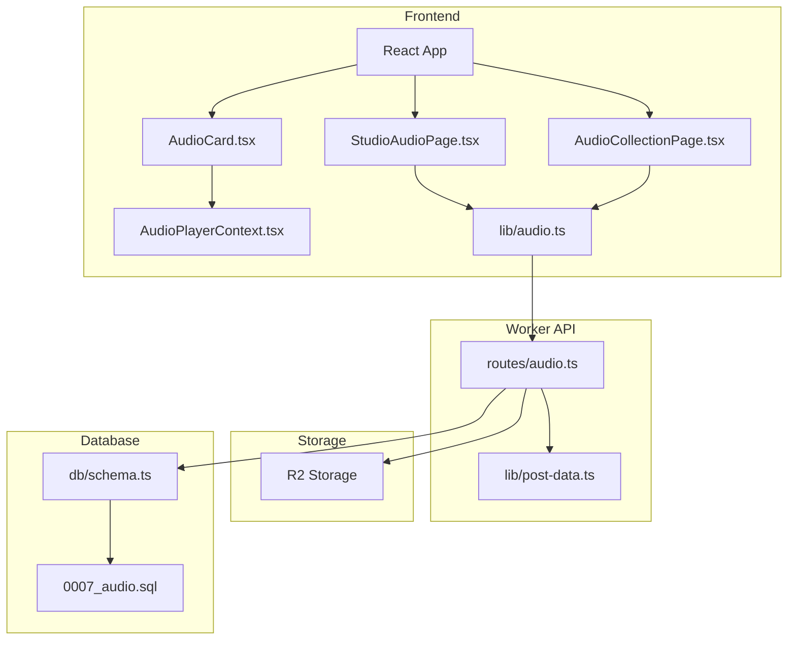
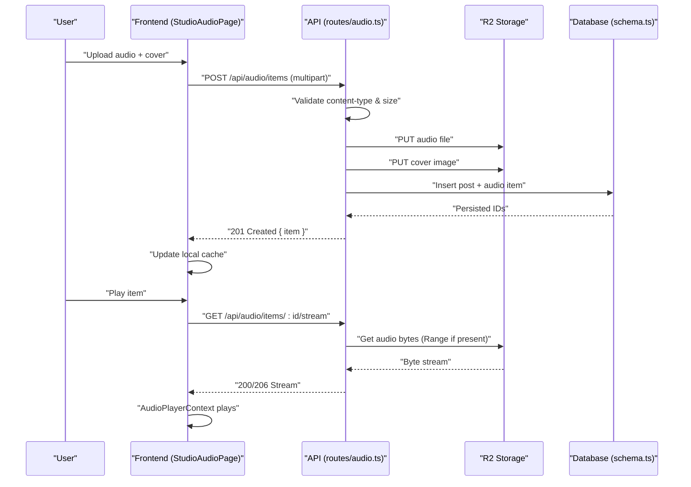
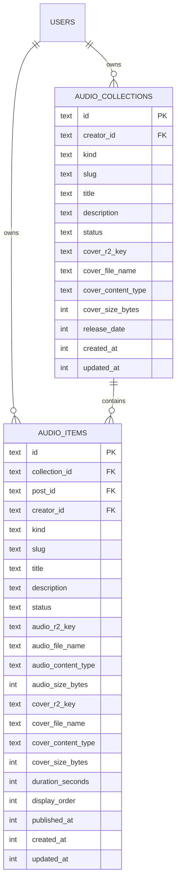
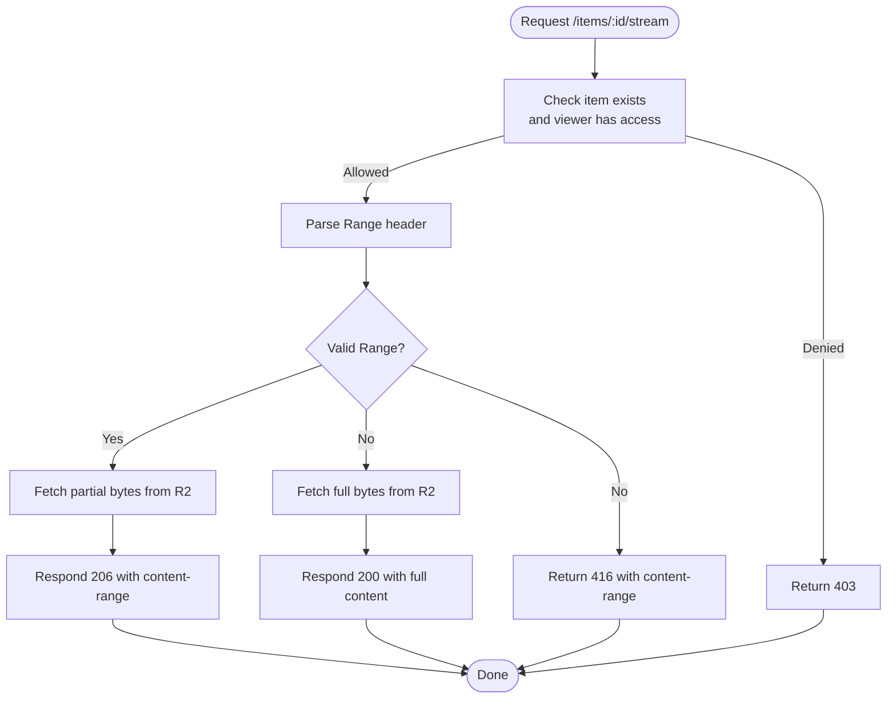
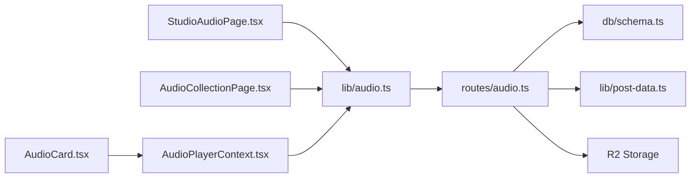

# Audio Collections System

<cite>
**Referenced Files in This Document**
- [0007_audio.sql](file://drizzle/0007_audio.sql)
- [schema.ts](file://src/worker/db/schema.ts)
- [audio.ts](file://src/worker/routes/audio.ts)
- [post-data.ts](file://src/worker/lib/post-data.ts)
- [AudioPlayerContext.tsx](file://src/react-app/context/AudioPlayerContext.tsx)
- [audio.ts](file://src/react-app/lib/audio.ts)
- [AudioCollectionPage.tsx](file://src/react-app/pages/AudioCollectionPage.tsx)
- [StudioAudioPage.tsx](file://src/react-app/pages/StudioAudioPage.tsx)
- [AudioCard.tsx](file://src/react-app/components/AudioCard.tsx)
</cite>

## Table of Contents
1. [Introduction](#introduction)
2. [Project Structure](#project-structure)
3. [Core Components](#core-components)
4. [Architecture Overview](#architecture-overview)
5. [Detailed Component Analysis](#detailed-component-analysis)
6. [Dependency Analysis](#dependency-analysis)
7. [Performance Considerations](#performance-considerations)
8. [Troubleshooting Guide](#troubleshooting-guide)
9. [Conclusion](#conclusion)
10. [Appendices](#appendices)

## Introduction
This document explains Zenith’s audio collections system, which supports podcast-style episodes and music albums with playlist functionality. It covers:
- Uploading audio to R2 storage and managing metadata
- Creating and organizing collections (albums/podcasts) and items (tracks/episodes)
- Streaming endpoints with HTTP Range support for efficient playback
- Database schema details for audio_items including status tracking, ordering, and duration
- API endpoints for uploads, management, streaming, and playback state synchronization
- Integration with the global audio player context for seamless cross-page playback

## Project Structure
The audio feature spans three main layers:
- Worker API routes handling authentication, validation, storage, and database operations
- Database schema definitions and migrations for collections and items
- React frontend components and context for studio management and playback



**Diagram sources**
- [audio.ts:1-120](file://src/worker/routes/audio.ts#L1-L120)
- [post-data.ts:100-142](file://src/worker/lib/post-data.ts#L100-L142)
- [schema.ts:233-291](file://src/worker/db/schema.ts#L233-L291)
- [0007_audio.sql:1-58](file://drizzle/0007_audio.sql#L1-L58)
- [AudioPlayerContext.tsx:135-243](file://src/react-app/context/AudioPlayerContext.tsx#L135-L243)
- [audio.ts:84-147](file://src/react-app/lib/audio.ts#L84-L147)
- [AudioCollectionPage.tsx:1-111](file://src/react-app/pages/AudioCollectionPage.tsx#L1-L111)
- [StudioAudioPage.tsx:85-189](file://src/react-app/pages/StudioAudioPage.tsx#L85-L189)
- [AudioCard.tsx:1-167](file://src/react-app/components/AudioCard.tsx#L1-L167)

**Section sources**
- [audio.ts:1-120](file://src/worker/routes/audio.ts#L1-L120)
- [schema.ts:233-291](file://src/worker/db/schema.ts#L233-L291)
- [0007_audio.sql:1-58](file://drizzle/0007_audio.sql#L1-L58)
- [AudioPlayerContext.tsx:135-243](file://src/react-app/context/AudioPlayerContext.tsx#L135-L243)
- [audio.ts:84-147](file://src/react-app/lib/audio.ts#L84-L147)
- [AudioCollectionPage.tsx:1-111](file://src/react-app/pages/AudioCollectionPage.tsx#L1-L111)
- [StudioAudioPage.tsx:85-189](file://src/react-app/pages/StudioAudioPage.tsx#L85-L189)
- [AudioCard.tsx:1-167](file://src/react-app/components/AudioCard.tsx#L1-L167)

## Core Components
- Worker routes: handle multipart form parsing, file validation, R2 uploads, DB writes, and streaming responses with Range support
- Database schema: defines audio_collections and audio_items tables with status, ordering, timestamps, and media references
- Frontend library: provides typed query/mutation helpers and URL builders for audio resources
- Global player context: manages queue, playback state, seek/volume, and theme derived from cover art

Key responsibilities:
- Uploads: validate content types and sizes; store files in R2; persist metadata
- Management: create/update/delete collections and items; reorder items within a collection
- Streaming: serve audio with HTTP Range for seeking and partial downloads
- Playback UI: integrate with the global player to play across pages and maintain state

**Section sources**
- [audio.ts:159-249](file://src/worker/routes/audio.ts#L159-L249)
- [schema.ts:233-291](file://src/worker/db/schema.ts#L233-L291)
- [audio.ts:84-147](file://src/react-app/lib/audio.ts#L84-L147)
- [AudioPlayerContext.tsx:135-243](file://src/react-app/context/AudioPlayerContext.tsx#L135-L243)

## Architecture Overview
The system follows a clear separation between client, server, storage, and persistence:
- Client sends multipart/form-data for uploads and JSON for metadata updates
- Server validates inputs, persists metadata, and stores binary assets in R2
- Streaming endpoint serves audio with proper headers and range support
- Frontend uses React Query for data fetching and a global context for playback



**Diagram sources**
- [audio.ts:591-656](file://src/worker/routes/audio.ts#L591-L656)
- [audio.ts:895-929](file://src/worker/routes/audio.ts#L895-L929)
- [schema.ts:259-291](file://src/worker/db/schema.ts#L259-L291)
- [post-data.ts:108-118](file://src/worker/lib/post-data.ts#L108-L118)

**Section sources**
- [audio.ts:591-656](file://src/worker/routes/audio.ts#L591-L656)
- [audio.ts:895-929](file://src/worker/routes/audio.ts#L895-L929)
- [post-data.ts:108-118](file://src/worker/lib/post-data.ts#L108-L118)

## Detailed Component Analysis

### Database Schema: audio_collections and audio_items
- audio_collections: creator-scoped, kind (album/podcast), slug, title, description, status, cover metadata, release date, timestamps
- audio_items: belongs to a collection, linked to a post, creator-scoped, kind (music/podcast_episode), slug, title, description, status, audio metadata, cover metadata, durationSeconds, displayOrder, publishedAt, timestamps
- Indexes optimize queries by creator+status+publishedAt and collection+displayOrder



**Diagram sources**
- [0007_audio.sql:1-58](file://drizzle/0007_audio.sql#L1-L58)
- [schema.ts:233-291](file://src/worker/db/schema.ts#L233-L291)

**Section sources**
- [0007_audio.sql:1-58](file://drizzle/0007_audio.sql#L1-L58)
- [schema.ts:233-291](file://src/worker/db/schema.ts#L233-L291)

### API Endpoints: Audio Uploads and Management
- POST /api/audio/collections: Create album or podcast collection with optional cover
- PATCH /api/audio/collections/:collectionId: Update collection metadata and cover
- DELETE /api/audio/collections/:collectionId: Delete empty collection and its cover
- POST /api/audio/items: Add track/episode with audio and optional cover; creates associated post
- PATCH /api/audio/items/:itemId: Update item metadata, audio, cover; preserves published timestamp when remains published
- DELETE /api/audio/items/:itemId: Delete item, associated post, and media files
- PUT /api/audio/collections/:collectionId/order: Reorder items by sending full ordered list of ids

Validation and behavior:
- Multipart form-data required for uploads
- Allowed audio types: MP3, M4A, WAV, OGG, WebM; max size 90 MB
- Allowed cover types: JPEG, PNG, WebP; max size 5 MB
- Published items require audio and cover (or collection cover fallback)
- Reordering requires all existing item ids exactly once

**Section sources**
- [audio.ts:172-249](file://src/worker/routes/audio.ts#L172-L249)
- [audio.ts:511-589](file://src/worker/routes/audio.ts#L511-L589)
- [audio.ts:591-735](file://src/worker/routes/audio.ts#L591-L735)
- [audio.ts:737-768](file://src/worker/routes/audio.ts#L737-L768)

### Streaming Endpoint: HTTP Range Support
- GET /api/audio/items/:itemId/stream: Streams audio with Range header support
- Returns 206 Partial Content with correct content-range and length when Range is valid
- Enforces access control via canReadItem and returns 403 if unauthorized
- Sets appropriate content-type, accept-ranges, cache-control, and content-disposition



**Diagram sources**
- [audio.ts:871-929](file://src/worker/routes/audio.ts#L871-L929)

**Section sources**
- [audio.ts:871-929](file://src/worker/routes/audio.ts#L871-L929)

### Playlist Creation and Organization
- Collections represent playlists (podcast) or albums (music)
- Items are ordered using displayOrder; reordering is enforced by requiring the complete set of item ids
- The studio UI allows drag-and-drop reordering and persists changes via the order endpoint

**Section sources**
- [audio.ts:737-768](file://src/worker/routes/audio.ts#L737-L768)
- [StudioAudioPage.tsx:319-399](file://src/react-app/pages/StudioAudioPage.tsx#L319-L399)

### Integrated Audio Player Context
- Global context maintains current item, queue, playback state, volume, and derived theme
- Uses HTMLAudioElement to manage src, preload, time updates, and ended events
- Provides playItem, toggle, close, seek, and move controls
- Derives theme colors from cover art luminance for consistent UI appearance

```mermaid
classDiagram
class AudioPlayerContextValue {
+currentItem : AudioItemSummary | null
+isPlaying : boolean
+queue : AudioItemSummary[]
+playItem(item, queue?)
+toggle()
+close()
}
class AudioPlayerProvider {
-audioRef : HTMLAudioElement
-queue : AudioItemSummary[]
-index : number
-isPlaying : boolean
-playback : { itemId, currentTime, duration }
-volume : number
-coverTheme : PlayerTheme
+playItem(item, nextQueue?)
+toggle()
+close()
+seek(value)
+setVolume(value)
+move(direction)
}
AudioPlayerProvider --> AudioPlayerContextValue : "provides"
```

**Diagram sources**
- [AudioPlayerContext.tsx:135-243](file://src/react-app/context/AudioPlayerContext.tsx#L135-L243)

**Section sources**
- [AudioPlayerContext.tsx:135-243](file://src/react-app/context/AudioPlayerContext.tsx#L135-L243)

### Metadata Management and Thumbnails
- Cover images stored per collection and per item; item cover falls back to collection cover
- Thumbnail URLs generated via helper functions that map to dedicated endpoints
- DurationSeconds stored on items; UI formats duration for display

**Section sources**
- [post-data.ts:108-118](file://src/worker/lib/post-data.ts#L108-L118)
- [audio.ts:831-869](file://src/worker/routes/audio.ts#L831-L869)
- [audio.ts:149-155](file://src/react-app/lib/audio.ts#L149-L155)

### API Endpoints Summary
- Collections:
  - GET /api/audio/collections/mine?kind=album|podcast
  - POST /api/audio/collections
  - PATCH /api/audio/collections/:collectionId
  - DELETE /api/audio/collections/:collectionId
  - GET /api/audio/collections/by-slug/:username/:slug
  - GET /api/audio/collections/:collectionId/cover
- Items:
  - POST /api/audio/items
  - PATCH /api/audio/items/:itemId
  - DELETE /api/audio/items/:itemId
  - GET /api/audio/items/by-slug/:username/:slug
  - GET /api/audio/items/:itemId/cover
  - GET /api/audio/items/:itemId/stream
- Ordering:
  - PUT /api/audio/collections/:collectionId/order

**Section sources**
- [audio.ts:480-509](file://src/worker/routes/audio.ts#L480-L509)
- [audio.ts:511-589](file://src/worker/routes/audio.ts#L511-L589)
- [audio.ts:591-735](file://src/worker/routes/audio.ts#L591-L735)
- [audio.ts:737-768](file://src/worker/routes/audio.ts#L737-L768)
- [audio.ts:770-806](file://src/worker/routes/audio.ts#L770-L806)
- [audio.ts:808-829](file://src/worker/routes/audio.ts#L808-L829)
- [audio.ts:831-869](file://src/worker/routes/audio.ts#L831-L869)
- [audio.ts:895-929](file://src/worker/routes/audio.ts#L895-L929)

## Dependency Analysis
- Worker routes depend on Drizzle ORM schema and R2 storage environment binding
- Frontend lib/audio.ts depends on api helpers and defines typed query keys
- AudioPlayerContext depends on AudioItemSummary type and formatAudioDuration utility
- StudioAudioPage orchestrates collection/item lifecycle and reordering



**Diagram sources**
- [StudioAudioPage.tsx:85-189](file://src/react-app/pages/StudioAudioPage.tsx#L85-L189)
- [audio.ts:84-147](file://src/react-app/lib/audio.ts#L84-L147)
- [audio.ts:1-120](file://src/worker/routes/audio.ts#L1-L120)
- [schema.ts:233-291](file://src/worker/db/schema.ts#L233-L291)
- [post-data.ts:100-142](file://src/worker/lib/post-data.ts#L100-L142)
- [AudioCollectionPage.tsx:1-111](file://src/react-app/pages/AudioCollectionPage.tsx#L1-L111)
- [AudioCard.tsx:1-167](file://src/react-app/components/AudioCard.tsx#L1-L167)
- [AudioPlayerContext.tsx:135-243](file://src/react-app/context/AudioPlayerContext.tsx#L135-L243)

**Section sources**
- [StudioAudioPage.tsx:85-189](file://src/react-app/pages/StudioAudioPage.tsx#L85-L189)
- [audio.ts:84-147](file://src/react-app/lib/audio.ts#L84-L147)
- [audio.ts:1-120](file://src/worker/routes/audio.ts#L1-L120)
- [schema.ts:233-291](file://src/worker/db/schema.ts#L233-L291)
- [post-data.ts:100-142](file://src/worker/lib/post-data.ts#L100-L142)
- [AudioCollectionPage.tsx:1-111](file://src/react-app/pages/AudioCollectionPage.tsx#L1-L111)
- [AudioCard.tsx:1-167](file://src/react-app/components/AudioCard.tsx#L1-L167)
- [AudioPlayerContext.tsx:135-243](file://src/react-app/context/AudioPlayerContext.tsx#L135-L243)

## Performance Considerations
- Use HTTP Range requests to avoid downloading entire audio files; browser handles seeking efficiently
- Cache covers with short-lived private cache headers to reduce repeated fetches
- Batch post extras (likes, replies, saved state) to minimize round trips
- Avoid moving items between collections in this slice to prevent unnecessary complexity
- Validate and reject oversized payloads early to save bandwidth and processing

[No sources needed since this section provides general guidance]

## Troubleshooting Guide
Common issues and resolutions:
- Unsupported media type: Ensure audio and cover files match allowed types
- Payload too large: Respect maximum sizes (90 MB audio, 5 MB cover)
- Validation failed: Titles, descriptions, statuses must meet constraints; published items require audio and cover
- Schedule processing conflict: Cannot edit/delete while publishing is in progress
- Access denied: Viewer must be creator or have membership access; collection/item must be published

**Section sources**
- [audio.ts:172-249](file://src/worker/routes/audio.ts#L172-L249)
- [audio.ts:658-717](file://src/worker/routes/audio.ts#L658-L717)
- [audio.ts:719-735](file://src/worker/routes/audio.ts#L719-L735)
- [audio.ts:737-768](file://src/worker/routes/audio.ts#L737-L768)

## Conclusion
Zenith’s audio collections system provides a robust foundation for podcast-style content and music albums. It integrates secure uploads to R2, comprehensive metadata management, efficient streaming with Range support, and a global audio player context for seamless playback across the application. The schema and endpoints are designed for scalability and clarity, enabling creators to organize and deliver high-quality audio experiences.

[No sources needed since this section summarizes without analyzing specific files]

## Appendices

### Example Workflows

- Uploading an audio episode:
  - Prepare multipart form with collectionId, title, description, status, durationSeconds, audio, and optional cover
  - POST to /api/audio/items; server validates, uploads to R2, inserts post and audio item, and returns serialized item
  - Reference: [audio.ts:591-656](file://src/worker/routes/audio.ts#L591-L656)

- Creating a themed playlist:
  - Create a new collection (album or podcast) with cover via POST /api/audio/collections
  - Add episodes/tracks and reorder them using PUT /api/audio/collections/:collectionId/order
  - Reference: [audio.ts:511-589](file://src/worker/routes/audio.ts#L511-L589), [audio.ts:737-768](file://src/worker/routes/audio.ts#L737-L768)

- Implementing audio transcoding workflows:
  - Current implementation stores original audio files directly; transcoding can be added by intercepting uploads, generating variants, and updating audioR2Key and audioContentType accordingly
  - Integrate a background job to produce optimized formats and update metadata before marking items as published
  - Reference: [audio.ts:264-275](file://src/worker/routes/audio.ts#L264-L275), [schema.ts:269-276](file://src/worker/db/schema.ts#L269-L276)

- Managing audio thumbnails:
  - Upload cover images per item or rely on collection cover fallback
  - Retrieve via /api/audio/items/:itemId/cover or /api/audio/collections/:collectionId/cover
  - Reference: [audio.ts:831-869](file://src/worker/routes/audio.ts#L831-L869), [post-data.ts:108-118](file://src/worker/lib/post-data.ts#L108-L118)

- Integrating with the global audio player context:
  - Call playItem(item, queue) from any component to start playback
  - Use useAudioPlayer hook to access currentItem, isPlaying, and controls
  - Reference: [AudioPlayerContext.tsx:135-243](file://src/react-app/context/AudioPlayerContext.tsx#L135-L243), [AudioCard.tsx:79-95](file://src/react-app/components/AudioCard.tsx#L79-L95)

**Section sources**
- [audio.ts:591-656](file://src/worker/routes/audio.ts#L591-L656)
- [audio.ts:511-589](file://src/worker/routes/audio.ts#L511-L589)
- [audio.ts:737-768](file://src/worker/routes/audio.ts#L737-L768)
- [audio.ts:264-275](file://src/worker/routes/audio.ts#L264-L275)
- [schema.ts:269-276](file://src/worker/db/schema.ts#L269-L276)
- [audio.ts:831-869](file://src/worker/routes/audio.ts#L831-L869)
- [post-data.ts:108-118](file://src/worker/lib/post-data.ts#L108-L118)
- [AudioPlayerContext.tsx:135-243](file://src/react-app/context/AudioPlayerContext.tsx#L135-L243)
- [AudioCard.tsx:79-95](file://src/react-app/components/AudioCard.tsx#L79-L95)