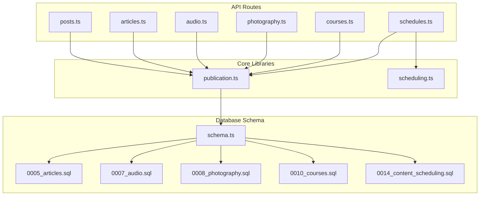
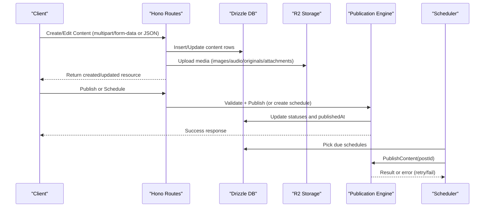

# Content Management System

<cite>
**Referenced Files in This Document**
- [posts.ts](file://src/worker/routes/posts.ts)
- [articles.ts](file://src/worker/routes/articles.ts)
- [audio.ts](file://src/worker/routes/audio.ts)
- [photography.ts](file://src/worker/routes/photography.ts)
- [courses.ts](file://src/worker/routes/courses.ts)
- [schedules.ts](file://src/worker/routes/schedules.ts)
- [publication.ts](file://src/worker/lib/publication.ts)
- [scheduling.ts](file://src/worker/lib/scheduling.ts)
- [schema.ts](file://src/worker/db/schema.ts)
- [0005_articles.sql](file://drizzle/0005_articles.sql)
- [0007_audio.sql](file://drizzle/0007_audio.sql)
- [0008_photography.sql](file://drizzle/0008_photography.sql)
- [0010_courses.sql](file://drizzle/0010_courses.sql)
- [0014_content_scheduling.sql](file://drizzle/0014_content_scheduling.sql)
</cite>

## Table of Contents
1. Introduction
2. Project Structure
3. Core Components
4. Architecture Overview
5. Detailed Component Analysis
6. Dependency Analysis
7. Performance Considerations
8. Troubleshooting Guide
9. Conclusion

## Introduction
This document describes Zenith’s multi-format content management system. It covers posts, articles, audio collections, photography albums, and courses. It explains the creation workflow, publishing pipeline, scheduling system, moderation features, database schema, validation rules, media handling via R2 storage, content relationships, API endpoints for CRUD operations, discovery and search patterns, versioning aspects, permissions, draft/published states, and cross-content linking. Examples illustrate creating, editing, scheduling, and managing each content type with their specific metadata and media requirements.

## Project Structure
The backend is a Hono-based worker exposing REST APIs under /api routes. Each content type has its own route module. The database schema is defined using Drizzle ORM and migrations. A shared publication engine coordinates state transitions and notifications. A scheduler processes due schedules reliably.



**Diagram sources**
- [posts.ts](file://src/worker/routes/posts.ts)
- [articles.ts](file://src/worker/routes/articles.ts)
- [audio.ts](file://src/worker/routes/audio.ts)
- [photography.ts](file://src/worker/routes/photography.ts)
- [courses.ts](file://src/worker/routes/courses.ts)
- [schedules.ts](file://src/worker/routes/schedules.ts)
- [publication.ts](file://src/worker/lib/publication.ts)
- [scheduling.ts](file://src/worker/lib/scheduling.ts)
- [schema.ts](file://src/worker/db/schema.ts)
- [0005_articles.sql](file://drizzle/0005_articles.sql)
- [0007_audio.sql](file://drizzle/0007_audio.sql)
- [0008_photography.sql](file://drizzle/0008_photography.sql)
- [0010_courses.sql](file://drizzle/0010_courses.sql)
- [0014_content_scheduling.sql](file://drizzle/0014_content_scheduling.sql)

**Section sources**
- [schema.ts](file://src/worker/db/schema.ts)
- [0005_articles.sql](file://drizzle/0005_articles.sql)
- [0007_audio.sql](file://drizzle/0007_audio.sql)
- [0008_photography.sql](file://drizzle/0008_photography.sql)
- [0010_courses.sql](file://drizzle/0010_courses.sql)
- [0014_content_scheduling.sql](file://drizzle/0014_content_scheduling.sql)

## Core Components
- Posts: Base entity for all content types; includes kind, slug, body, moderation fields, and publishedAt.
- Articles: Title, excerpt, markdown, cover image, status, timestamps.
- Audio Collections and Items: Album/podcast collection with items (music/podcast episodes), audio files, covers, duration, order.
- Photography Albums and Photos: Albums with photos (preview/original), download toggles, shoot date, cover photo.
- Courses: Modules and lessons, attachments (video/audio/file), progress tracking, structured content.
- Scheduling: Per-post schedule records with retry logic and failure handling.
- Publication Engine: Validates publishability per content kind, updates statuses, sets publishedAt, and notifies subscribers.

Key responsibilities:
- Validation and sanitization at route layer.
- Media upload to R2 with typed constraints.
- Consistent draft/published state transitions.
- Cross-content linking through post_id foreign keys.
- Moderation checks and creator access control.

**Section sources**
- [schema.ts](file://src/worker/db/schema.ts)
- [publication.ts](file://src/worker/lib/publication.ts)
- [scheduling.ts](file://src/worker/lib/scheduling.ts)

## Architecture Overview
The system uses a layered architecture:
- API Layer: Hono routes handle requests, validate inputs, enforce roles, and orchestrate business logic.
- Domain Logic: Route handlers coordinate DB operations and media uploads.
- Publication Engine: Centralized validation and state transitions for publishing across content kinds.
- Scheduler: Background processing of due schedules with retries and failure notifications.
- Storage: R2 object storage for images, audio, originals, and course attachments.



**Diagram sources**
- [posts.ts](file://src/worker/routes/posts.ts)
- [articles.ts](file://src/worker/routes/articles.ts)
- [audio.ts](file://src/worker/routes/audio.ts)
- [photography.ts](file://src/worker/routes/photography.ts)
- [courses.ts](file://src/worker/routes/courses.ts)
- [schedules.ts](file://src/worker/routes/schedules.ts)
- [publication.ts](file://src/worker/lib/publication.ts)
- [scheduling.ts](file://src/worker/lib/scheduling.ts)

## Detailed Component Analysis

### Posts
Posts are the foundational entities for all content kinds. They store author, kind, slug, body, moderation fields, and publishedAt.

- Creation: POST /api/posts supports multipart/form-data (body, images, poll, optional scheduledFor) and JSON. Creates post row, attachments, polls, and optionally a schedule.
- Editing: PATCH /api/posts/:postId updates draft posts only; validates body length, images, polls, and removes attachments if requested.
- Deletion: DELETE /api/posts/:postId removes post and associated attachments from R2.
- Discovery: GET /api/posts/by-slug/:username/:slug returns public post with replies and extras.
- Replies and likes: Endpoints manage threaded replies, likes, and notifications.

Validation rules:
- Body length limits and required content when no images/polls.
- Image type and size constraints.
- Poll options count and length constraints.
- Schedule must be at least one minute in future.

Media handling:
- Images uploaded to R2 under posts/{postId}/{id}.ext with proper content-type metadata.

Permissions:
- Creator-only write access; read access enforced by moderation and account status.

Example flows:
- Create a short post with images and poll, then publish immediately or schedule.
- Edit a draft post, remove some images, update poll, save changes.

**Section sources**
- [posts.ts](file://src/worker/routes/posts.ts)
- [schema.ts](file://src/worker/db/schema.ts)

### Articles
Articles extend posts with title, excerpt, markdown, and cover image.

- Creation: POST /api/articles requires multipart/form-data with title, excerpt, markdown, status, and optional cover. Draft or published status supported; published requires cover.
- Editing: PATCH /api/articles/:postId updates fields; preserves publishedAt if remains published; revalidates cover requirement on publish.
- Publishing: POST /api/articles/:postId/publish triggers publication flow.
- Reading: GET /api/articles/by-slug/:username/:slug and GET /api/articles/:postId return article details and replies.
- Cover retrieval: GET /api/articles/:postId/cover serves the cover image with appropriate headers.

Validation rules:
- Title/excerpt/markdown length limits.
- Published status requires title and markdown; cover required for published.
- Moderation and membership visibility checks.

Media handling:
- Cover uploaded to R2 under articles/{postId}/cover-{uuid}.ext.

Example flows:
- Create an article draft, add cover, publish directly or schedule later.
- Update markdown and excerpt while keeping published state intact.

**Section sources**
- [articles.ts](file://src/worker/routes/articles.ts)
- [schema.ts](file://src/worker/db/schema.ts)
- [0005_articles.sql](file://drizzle/0005_articles.sql)

### Audio Collections and Items
Audio supports two kinds: album (music) and podcast (episodes). Collections hold metadata and cover; items hold audio files, covers, duration, and ordering.

- Collections:
  - Create: POST /api/audio/collections with kind, title, description, status, releaseDate, cover.
  - Update: PATCH /api/audio/collections/:collectionId; cannot change kind after creation.
  - Delete: DELETE /api/audio/collections/:collectionId; must be empty.
  - List: GET /api/audio/collections/mine filters by kind.
- Items:
  - Create: POST /api/audio/items with collectionId, title, description, status, audio, cover, durationSeconds.
  - Update: PATCH /api/audio/items/:itemId; preserves publishedAt if remains published; enforces cover fallback to collection cover.
  - Delete: DELETE /api/audio/items/:itemId; cleans up audio and cover from R2.
  - Order: PUT /api/audio/collections/:collectionId/order to reorder items.
  - Read: GET /api/audio/collections/by-slug/:username/:slug lists items with access checks.

Validation rules:
- Kind must be album or podcast; status must be draft or published.
- Titles/descriptions length limits.
- Audio file type and size constraints; cover image type and size constraints.
- Published items require audio and either item cover or collection cover.

Media handling:
- Collection cover: audio/collections/{collectionId}/cover-{uuid}.ext.
- Item audio: audio/items/{itemId}/source-{uuid}.ext.
- Item cover: audio/items/{itemId}/cover-{uuid}.ext.

Example flows:
- Create an album draft, add multiple tracks with covers, set order, publish album and items.
- Update track metadata and cover, keep published state, or unpublish and reschedule.

**Section sources**
- [audio.ts](file://src/worker/routes/audio.ts)
- [schema.ts](file://src/worker/db/schema.ts)
- [0007_audio.sql](file://drizzle/0007_audio.sql)

### Photography Albums and Photos
Photography organizes photos into albums with preview and original files, optional downloads, and cover selection.

- Albums:
  - Create: POST /api/photography/albums; must be created as draft first.
  - Update: PATCH /api/photography/albums/:albumId; validates published state requires at least one published photo and a published cover.
  - Delete: DELETE /api/photography/albums/:albumId; must be empty.
  - List: GET /api/photography/albums/mine returns albums with photos.
- Photos:
  - Create: POST /api/photography/albums/:albumId/photos accepts multiple previews and matching originals; metadata array controls per-photo settings.
  - Update: PATCH /api/photography/photos/:photoId updates metadata and optional new preview/original.
  - Delete: DELETE /api/photography/photos/:photoId; cleans up preview/original from R2; resets album cover if deleted.
  - Order: PUT /api/photography/albums/:albumId/order to reorder photos.
  - Read: GET /api/photography/albums/by-slug/:username/:slug returns album and photos; GET /api/photography/photos/:photoId/preview serves preview.

Validation rules:
- Titles/descriptions length limits; status must be draft or published.
- Preview types and sizes; original types/extensions and sizes.
- Published albums need at least one published photo and a published cover.

Media handling:
- Preview: photography/albums/{albumId}/photos/{photoId}/preview-{uuid}.ext.
- Original: photography/albums/{albumId}/photos/{photoId}/original-{uuid}.ext.

Example flows:
- Create album draft, upload batch of previews and originals, set captions and alt text, choose cover, publish album.
- Update individual photo metadata and toggle original download permission.

**Section sources**
- [photography.ts](file://src/worker/routes/photography.ts)
- [schema.ts](file://src/worker/db/schema.ts)
- [0008_photography.sql](file://drizzle/0008_photography.sql)

### Courses
Courses consist of modules and lessons, with rich attachments and progress tracking.

- Course lifecycle:
  - Create: POST /api/courses with title and optional description; returns draft course.
  - Update: PATCH /api/courses/:courseId; can set status to published or draft; unpublish endpoint available.
  - Delete: DELETE /api/courses/:courseId; cleans up attachments.
  - Read: GET /api/courses/by-slug/:username/:slug and GET /api/courses/:courseId return structure and replies.
- Modules and Lessons:
  - Create module: POST /api/courses/:courseId/modules.
  - Update module: PATCH /api/courses/modules/:moduleId.
  - Order modules: PUT /api/courses/:courseId/modules/order.
  - Create lesson: POST /api/courses/modules/:moduleId/lessons; must start as draft.
  - Update lesson: PATCH /api/courses/lessons/:lessonId; publish requires title and either markdown or a ready attachment.
  - Order lessons: PUT /api/courses/modules/:moduleId/lessons/order.
  - Delete lesson/module: cleanup attachments and cascade deletes.
- Attachments:
  - Start upload: POST /api/courses/uploads/start returns uploadId and partSize.
  - Upload parts: PUT /api/courses/uploads/:attachmentId/parts/:partNumber streams parts.
  - Complete upload: POST /api/courses/uploads/:attachmentId/complete finalizes and marks ready.
  - Download: GET /api/courses/attachments/:attachmentId supports range requests and content disposition.
- Progress:
  - PUT /api/courses/lessons/:lessonId/progress toggles completion and returns counts.

Validation rules:
- Title/description/summary lengths; markdown length limit.
- Attachment kinds and size limits (video/audio/file).
- Lesson publish requires title and content (markdown or attachment).
- Course publish requires at least one module and one published lesson.

Media handling:
- Attachments stored under courses/{creatorId}/{courseId}/{lessonId}/{uuid}-{cleanFileName} with appropriate content-disposition.

Example flows:
- Create course, add modules and lessons, upload video/audio/file attachments, mark lessons published, publish course.
- Update lesson markdown, replace attachment, unpublish course, reschedule.

**Section sources**
- [courses.ts](file://src/worker/routes/courses.ts)
- [schema.ts](file://src/worker/db/schema.ts)
- [0010_courses.sql](file://drizzle/0010_courses.sql)

### Scheduling System
Scheduling enables deferred publication with robust retry and failure handling.

- Schedule list: GET /api/schedules?page&pageSize&status&type returns paginated schedules filtered by status (upcoming/failed/history) and type.
- Get schedule: GET /api/schedules/:postId returns schedule details.
- Set schedule: PUT /api/schedules/:postId with scheduledFor; validates publishability and prevents scheduling already-published content.
- Cancel schedule: DELETE /api/schedules/:postId; prevents canceling processing or published schedules.
- Retry failed: POST /api/schedules/:postId/retry; re-validates and resets attempt counters.
- Immediate publish: POST /api/schedules/:postId/publish; publishes now.

Background processing:
- processDueSchedules picks pending schedules due now, claims them, attempts publish, retries with exponential backoff, and fails after max attempts with notifications.

State transitions:
- pending -> processing -> published or failed; canceled allowed from pending/processing before processing starts.

**Section sources**
- [schedules.ts](file://src/worker/routes/schedules.ts)
- [scheduling.ts](file://src/worker/lib/scheduling.ts)
- [0014_content_scheduling.sql](file://drizzle/0014_content_scheduling.sql)

### Publication Engine
Centralized logic for validating and publishing content across kinds.

- getPublicationRecord: Joins posts with relevant tables to assemble a unified record.
- validatePublishableContent: Enforces kind-specific rules (e.g., cover presence, parent published, minimum content).
- publishContent: Updates statuses and publishedAt atomically, then notifies subscribers.

Error handling:
- PublicationError carries code and message; deterministic errors fail immediately; transient errors retry up to MAX_ATTEMPTS.

**Section sources**
- [publication.ts](file://src/worker/lib/publication.ts)

## Dependency Analysis
Relationships between components and data models:

```mermaid
classDiagram
class Posts {
+string id
+string authorId
+enum kind
+string slug
+string body
+enum moderationStatus
+timestamp publishedAt
}
class Articles {
+string postId PK
+string title
+string excerpt
+string markdown
+enum status
+string coverR2Key
+timestamp publishedAt
}
class AudioCollections {
+string id
+string creatorId
+enum kind
+string slug
+string title
+string description
+enum status
+string coverR2Key
+timestamp releaseDate
}
class AudioItems {
+string id
+string collectionId FK
+string postId PK
+string creatorId
+enum kind
+string slug
+string title
+string description
+enum status
+string audioR2Key
+string coverR2Key
+int durationSeconds
+int displayOrder
+timestamp publishedAt
}
class PhotographyAlbums {
+string id
+string postId PK
+string creatorId
+string slug
+string title
+string description
+enum status
+bool downloadsEnabled
+timestamp shootDate
+string coverPhotoId
+timestamp publishedAt
}
class PhotographyPhotos {
+string id
+string albumId FK
+string creatorId
+string title
+string caption
+string altText
+enum status
+string previewR2Key
+string originalR2Key
+bool originalDownloadEnabled
+int width
+int height
+int displayOrder
}
class Courses {
+string id
+string postId PK
+string creatorId
+string slug
+string title
+string description
+enum status
+timestamp publishedAt
}
class CourseModules {
+string id
+string courseId FK
+string title
+string description
+int displayOrder
}
class CourseLessons {
+string id
+string courseId FK
+string moduleId FK
+string title
+string summary
+string markdown
+enum status
+int displayOrder
+timestamp publishedAt
}
class CourseAttachments {
+string id
+string courseId FK
+string lessonId FK
+string uploaderId
+enum kind
+enum status
+string r2Key
+string fileName
+string contentType
+int sizeBytes
+int displayOrder
}
class ContentSchedules {
+string postId PK
+string creatorId
+enum status
+timestamp scheduledFor
+timestamp nextAttemptAt
+int attemptCount
+int revision
+timestamp publishedAt
}
Posts <|-- Articles : "post_id"
Posts <|-- AudioItems : "post_id"
Posts <|-- PhotographyAlbums : "post_id"
Posts <|-- Courses : "post_id"
AudioCollections ||--o{ AudioItems : "collection_id"
PhotographyAlbums ||--o{ PhotographyPhotos : "album_id"
Courses ||--o{ CourseModules : "course_id"
CourseModules ||--o{ CourseLessons : "module_id"
Courses ||--o{ CourseAttachments : "course_id"
CourseLessons ||--o{ CourseAttachments : "lesson_id"
ContentSchedules --> Posts : "post_id"
```

**Diagram sources**
- [schema.ts](file://src/worker/db/schema.ts)
- [0005_articles.sql](file://drizzle/0005_articles.sql)
- [0007_audio.sql](file://drizzle/0007_audio.sql)
- [0008_photography.sql](file://drizzle/0008_photography.sql)
- [0010_courses.sql](file://drizzle/0010_courses.sql)
- [0014_content_scheduling.sql](file://drizzle/0014_content_scheduling.sql)

**Section sources**
- [schema.ts](file://src/worker/db/schema.ts)

## Performance Considerations
- Batched DB operations: Use db.batch for related updates during publish to minimize round trips.
- Efficient queries: Leverage indexes on kind, status, publishedAt, creatorId, and display_order for fast listing and ordering.
- Media streaming: Support Range requests for large attachments to enable progressive playback and resume.
- Concurrency safety: Claim-and-update pattern in scheduling prevents duplicate processing; stale processing recovery resets stuck jobs.
- Caching headers: Private cache-control for media responses reduces bandwidth and improves performance.

[No sources needed since this section provides general guidance]

## Troubleshooting Guide
Common issues and resolutions:
- Validation failures: Ensure required fields meet length/type constraints; check media type and size limits.
- Schedule too soon: Scheduled time must be at least one minute in the future.
- Processing conflicts: If a schedule is processing, edits that affect publication are blocked until completion.
- Failed schedules: Check lastErrorCode and lastErrorMessage; retry after fixing validation or infrastructure issues.
- Moderation blocks: Content must be active; suspended accounts prevent publishing.

Relevant endpoints and behaviors:
- POST/PUT/PATCH return detailed validation errors with issues.
- Schedules API exposes failure details and retry actions.
- Publication engine throws PublicationError with codes like account_suspended, content_moderated, validation_failed, parent_unpublished.

**Section sources**
- [posts.ts](file://src/worker/routes/posts.ts)
- [articles.ts](file://src/worker/routes/articles.ts)
- [audio.ts](file://src/worker/routes/audio.ts)
- [photography.ts](file://src/worker/routes/photography.ts)
- [courses.ts](file://src/worker/routes/courses.ts)
- [schedules.ts](file://src/worker/routes/schedules.ts)
- [publication.ts](file://src/worker/lib/publication.ts)

## Conclusion
Zenith’s CMS provides a robust, multi-format content platform with consistent workflows across posts, articles, audio, photography, and courses. The design emphasizes clear validation, secure media handling via R2, reliable scheduling with retries, and centralized publication logic. Permissions and moderation ensure safe content delivery, while structured schemas and indexes support efficient discovery and management. By following the documented APIs and workflows, creators can confidently produce, organize, and publish diverse content types at scale.