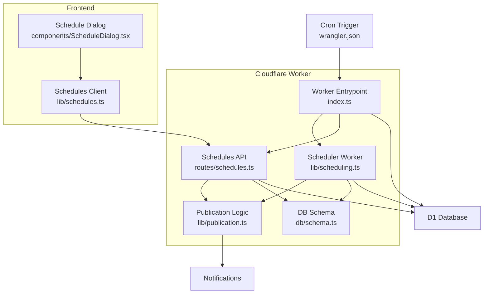
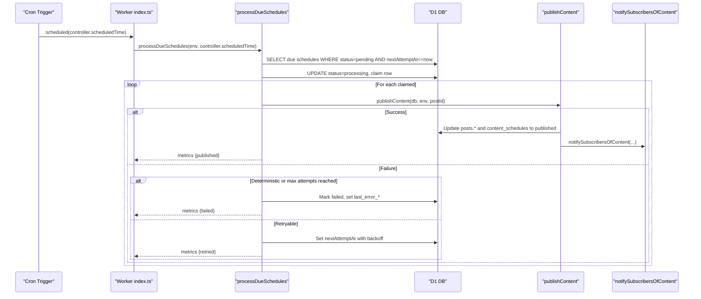
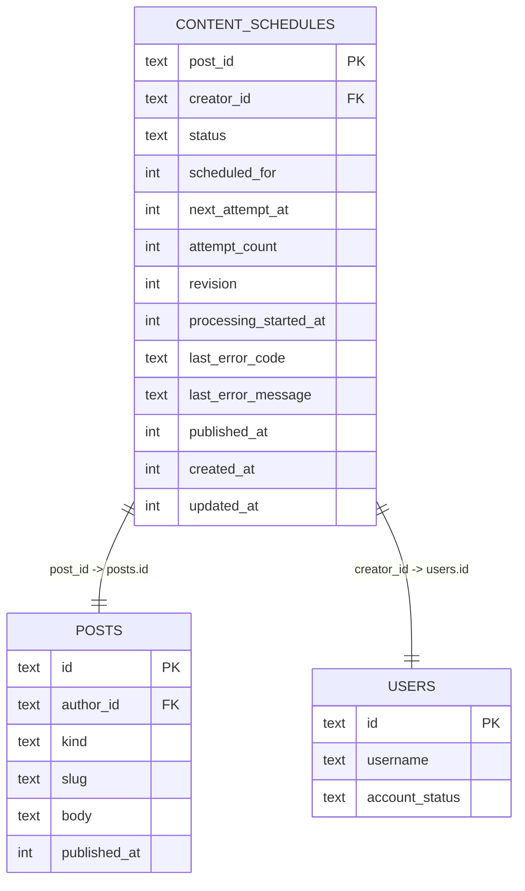
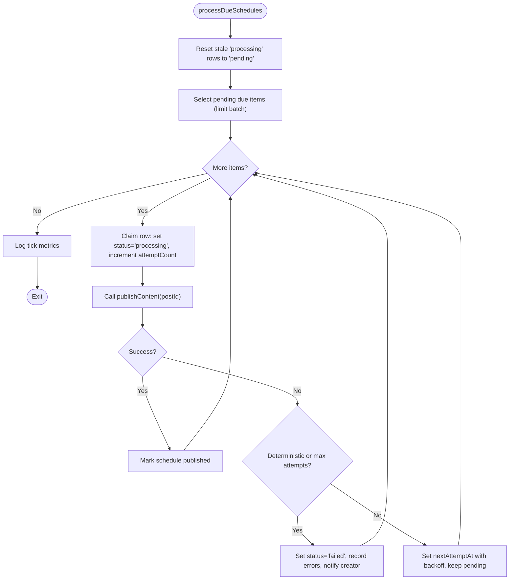
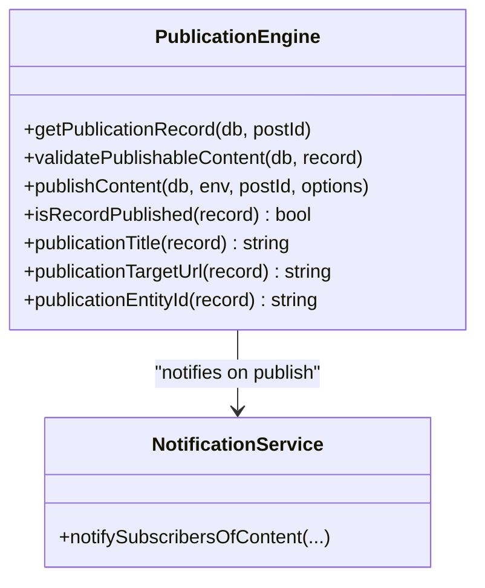
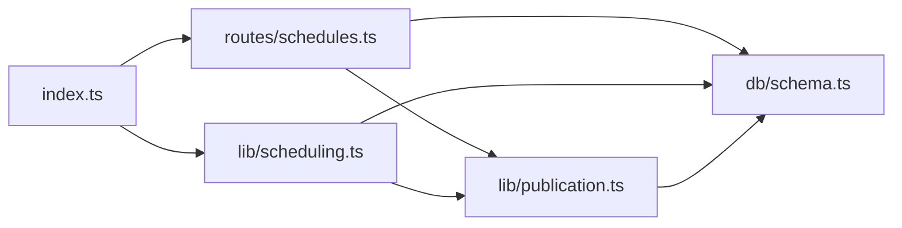

# Content Scheduling System

<cite>
**Referenced Files in This Document**
- [wrangler.json](file://wrangler.json)
- [0014_content_scheduling.sql](file://drizzle/0014_content_scheduling.sql)
- [schema.ts](file://src/worker/db/schema.ts)
- [index.ts](file://src/worker/index.ts)
- [schedules.ts](file://src/worker/routes/schedules.ts)
- [scheduling.ts](file://src/worker/lib/scheduling.ts)
- [publication.ts](file://src/worker/lib/publication.ts)
- [schedules.ts (frontend)](file://src/react-app/lib/schedules.ts)
- [ScheduleDialog.tsx](file://src/react-app/components/ScheduleDialog.tsx)
- [admin.ts](file://src/worker/routes/admin.ts)
</cite>

## Table of Contents
1. [Introduction](#introduction)
2. [Project Structure](#project-structure)
3. [Core Components](#core-components)
4. [Architecture Overview](#architecture-overview)
5. [Detailed Component Analysis](#detailed-component-analysis)
6. [Dependency Analysis](#dependency-analysis)
7. [Performance Considerations](#performance-considerations)
8. [Troubleshooting Guide](#troubleshooting-guide)
9. [Conclusion](#conclusion)
10. [Appendices](#appendices)

## Introduction
This document explains Zenith’s content scheduling system that enables automated publication of posts, articles, audio, photography albums, and courses at specified times. It covers the scheduling queue architecture, background job processing via Cloudflare Workers scheduled triggers, retry mechanisms, failure handling, database schema for content schedules, integration with all content types, time zone support, conflict management, and monitoring.

## Project Structure
The scheduling system spans the worker runtime, API routes, background processing logic, and the React frontend:
- Worker entrypoint wires API routes and a scheduled trigger to process due schedules.
- The schedules API exposes endpoints to create, list, cancel, retry, and publish scheduled content.
- The scheduler picks up due items, claims them atomically, attempts publication, and applies retries or failures.
- Frontend provides a dialog to schedule content and a page to manage scheduled jobs.

**Diagram sources**
- [index.ts:1-71](file://src/worker/index.ts#L1-L71)
- [schedules.ts:1-295](file://src/worker/routes/schedules.ts#L1-L295)
- [scheduling.ts:1-127](file://src/worker/lib/scheduling.ts#L1-L127)
- [publication.ts:1-273](file://src/worker/lib/publication.ts#L1-L273)
- [schema.ts:190-208](file://src/worker/db/schema.ts#L190-L208)
- [wrangler.json:66-83](file://wrangler.json#L66-L83)

**Section sources**
- [index.ts:1-71](file://src/worker/index.ts#L1-L71)
- [wrangler.json:66-83](file://wrangler.json#L66-L83)

## Core Components
- Scheduling Queue: content_schedules table stores pending, processing, published, failed, and canceled states with timestamps, attempt counts, and error details.
- Background Job Processor: processDueSchedules runs on cron, claims due items, publishes content, and handles retries/failures.
- Publication Engine: validates and publishes each content type, updates statuses, and notifies subscribers.
- API Layer: CRUD operations for scheduling, cancellation, retry, and immediate publish.
- Frontend UI: Schedule dialog and schedule management utilities.

**Section sources**
- [schema.ts:190-208](file://src/worker/db/schema.ts#L190-L208)
- [scheduling.ts:1-127](file://src/worker/lib/scheduling.ts#L1-L127)
- [publication.ts:1-273](file://src/worker/lib/publication.ts#L1-L273)
- [schedules.ts:1-295](file://src/worker/routes/schedules.ts#L1-L295)
- [schedules.ts (frontend):1-73](file://src/react-app/lib/schedules.ts#L1-L73)
- [ScheduleDialog.tsx:1-108](file://src/react-app/components/ScheduleDialog.tsx#L1-L108)

## Architecture Overview
The system uses Cloudflare Workers with a cron trigger to execute a background job every minute. The job queries due schedules, claims them atomically, and calls the publication engine. On success, it marks as published; on failure, it retries with backoff or fails after max attempts.

**Diagram sources**
- [index.ts:62-71](file://src/worker/index.ts#L62-L71)
- [scheduling.ts:42-127](file://src/worker/lib/scheduling.ts#L42-L127)
- [publication.ts:197-273](file://src/worker/lib/publication.ts#L197-L273)

## Detailed Component Analysis

### Database Schema: content_schedules
The content_schedules table tracks scheduling state and metadata:
- Primary key: post_id (references posts.id, cascade delete)
- creator_id references users.id (cascade delete)
- status: pending | processing | published | failed | canceled
- scheduled_for: target publish timestamp
- next_attempt_at: when to retry if failed
- attempt_count: number of attempts
- revision: incremented on reschedule/retry
- processing_started_at: when processing began
- last_error_code / last_error_message: last failure details
- published_at: actual publish time
- created_at / updated_at: timestamps

Indexes optimize due queries and per-creator filtering.

**Diagram sources**
- [schema.ts:190-208](file://src/worker/db/schema.ts#L190-L208)
- [0014_content_scheduling.sql:26-47](file://drizzle/0014_content_scheduling.sql#L26-L47)

**Section sources**
- [schema.ts:190-208](file://src/worker/db/schema.ts#L190-L208)
- [0014_content_scheduling.sql:26-47](file://drizzle/0014_content_scheduling.sql#L26-L47)

### Scheduled Job Worker: processDueSchedules
Key behaviors:
- Stale recovery: resets stuck “processing” rows older than a threshold to “pending”.
- Due selection: selects pending items where nextAttemptAt <= now, ordered by earliest attempt, limited to a batch size.
- Atomic claim: updates status to processing, increments attemptCount, sets processingStartedAt, returns claimed item.
- Publish attempt: calls publishContent; on success, marks published; on failure, applies deterministic vs retryable logic.
- Retry policy: first retry after 1 minute, subsequent retries after 5 minutes; caps at MAX_ATTEMPTS.
- Failure path: marks failed, records error code/message, and sends a notification to the creator.

**Diagram sources**
- [scheduling.ts:16-127](file://src/worker/lib/scheduling.ts#L16-L127)

**Section sources**
- [scheduling.ts:1-127](file://src/worker/lib/scheduling.ts#L1-L127)

### Publication Engine: publishContent
Handles validation and publishing across content types:
- Validates account status and moderation status.
- Type-specific validations:
  - Post: requires text, attachments, or poll with at least two options.
  - Article: requires title, markdown, and cover image.
  - Audio: requires audio file and cover (item or collection), parent album/podcast must be published.
  - Photography: requires album with at least one published photo and a published cover photo.
  - Course: requires at least one module and at least one published lesson.
- Updates posts.published_at and respective entity status to published.
- Notifies subscribers of new content.
- Returns whether already published or newly published.

**Diagram sources**
- [publication.ts:1-273](file://src/worker/lib/publication.ts#L1-L273)

**Section sources**
- [publication.ts:1-273](file://src/worker/lib/publication.ts#L1-L273)

### Schedules API: REST Endpoints
Endpoints under /api/schedules (creator-only):
- GET /api/schedules?status=&type=&page=&pageSize= — list schedules with filters and pagination.
- GET /api/schedules/:postId — get schedule detail.
- PUT /api/schedules/:postId — schedule or reschedule content (minimum 1 minute in future).
- DELETE /api/schedules/:postId — cancel a schedule (not allowed if processing or published).
- POST /api/schedules/:postId/retry — retry a failed schedule after validation.
- POST /api/schedules/:postId/publish — immediately publish content (if not processing).

Conflict handling:
- Prevents scheduling already published content.
- Prevents concurrent processing by checking status.
- Validates content before scheduling/retrying.

**Section sources**
- [schedules.ts:1-295](file://src/worker/routes/schedules.ts#L1-L295)

### Frontend Integration
- ScheduleDialog collects local datetime input, converts to UTC ISO string, and calls saveSchedule.
- schedules.ts client defines types and functions for listing, saving, canceling, retrying, and publishing.
- Timezone display shows user’s timezone; minimum scheduling enforced client-side.

**Section sources**
- [ScheduleDialog.tsx:1-108](file://src/react-app/components/ScheduleDialog.tsx#L1-L108)
- [schedules.ts (frontend):1-73](file://src/react-app/lib/schedules.ts#L1-L73)

### Cron Trigger and Worker Wiring
- Wrangler config defines a cron schedule "* * * * *" for production environment.
- Worker exports a default handler with fetch and scheduled methods; scheduled invokes processDueSchedules and other maintenance tasks.

**Section sources**
- [wrangler.json:66-83](file://wrangler.json#L66-L83)
- [index.ts:62-71](file://src/worker/index.ts#L62-L71)

## Dependency Analysis
- Worker Entrypoint depends on routes and lib modules.
- Schedules API depends on DB schema, publication engine, and auth middleware.
- Scheduler depends on DB schema and publication engine.
- Publication engine depends on DB schema and notifications.

**Diagram sources**
- [index.ts:1-71](file://src/worker/index.ts#L1-L71)
- [schedules.ts:1-295](file://src/worker/routes/schedules.ts#L1-L295)
- [scheduling.ts:1-127](file://src/worker/lib/scheduling.ts#L1-L127)
- [publication.ts:1-273](file://src/worker/lib/publication.ts#L1-L273)
- [schema.ts:190-208](file://src/worker/db/schema.ts#L190-L208)

**Section sources**
- [index.ts:1-71](file://src/worker/index.ts#L1-L71)
- [schedules.ts:1-295](file://src/worker/routes/schedules.ts#L1-L295)
- [scheduling.ts:1-127](file://src/worker/lib/scheduling.ts#L1-L127)
- [publication.ts:1-273](file://src/worker/lib/publication.ts#L1-L273)
- [schema.ts:190-208](file://src/worker/db/schema.ts#L190-L208)

## Performance Considerations
- Batch size: due scheduling processes up to a fixed batch per tick to limit load.
- Backoff: exponential-like delay between retries reduces contention and transient failures.
- Stale recovery: prevents deadlocks from crashed workers by resetting stuck processing rows.
- Indexes: optimized queries for due selection and per-creator filtering.
- Observability: invocation logs and traces enabled in wrangler configuration.

[No sources needed since this section provides general guidance]

## Troubleshooting Guide
Common issues and resolutions:
- Schedule too soon: ensure scheduled time is at least one minute in the future.
- Already published: cannot schedule or publish already published content.
- Processing conflict: cannot modify while status is processing; wait or retry later.
- Validation failures: ensure required fields per content type are present.
- Failed schedules: check last_error_code and last_error_message; use retry endpoint after fixing issues.
- Monitoring: admin health endpoint includes counts of failed schedules and overdue pending schedules.

**Section sources**
- [schedules.ts:170-295](file://src/worker/routes/schedules.ts#L170-L295)
- [admin.ts:103-135](file://src/worker/routes/admin.ts#L103-L135)

## Conclusion
Zenith’s scheduling system provides robust, reliable automation for publishing diverse content types. With atomic claiming, indexed due queries, configurable retries, and comprehensive validation, it ensures timely publication while maintaining data integrity and observability. The API and frontend enable creators to schedule, manage, and monitor their content effectively.

[No sources needed since this section summarizes without analyzing specific files]

## Appendices

### Examples and Usage Patterns
- Schedule content for future publication:
  - Use PUT /api/schedules/:postId with a valid ISO datetime at least one minute ahead.
  - Frontend: open ScheduleDialog, select local datetime, submit; client converts to UTC and calls saveSchedule.
- Manage scheduled jobs:
  - List upcoming, failed, and history via GET /api/schedules with filters.
  - Cancel with DELETE /api/schedules/:postId unless processing or published.
  - Retry failed entries with POST /api/schedules/:postId/retry after resolving validation issues.
- Handle conflicts:
  - Avoid scheduling already published content.
  - Respect processing status; do not mutate during active processing.
- Time zone support:
  - Frontend displays user timezone and converts local input to UTC ISO strings.
  - Backend stores timestamps as integers; scheduling uses consistent UTC comparisons.
- Monitor performance and reliability:
  - Check admin health endpoint for failed and overdue schedules.
  - Review worker logs and traces configured in wrangler.json.

**Section sources**
- [schedules.ts (frontend):1-73](file://src/react-app/lib/schedules.ts#L1-L73)
- [ScheduleDialog.tsx:1-108](file://src/react-app/components/ScheduleDialog.tsx#L1-L108)
- [schedules.ts:128-295](file://src/worker/routes/schedules.ts#L128-L295)
- [admin.ts:103-135](file://src/worker/routes/admin.ts#L103-L135)
- [wrangler.json:13-24](file://wrangler.json#L13-L24)