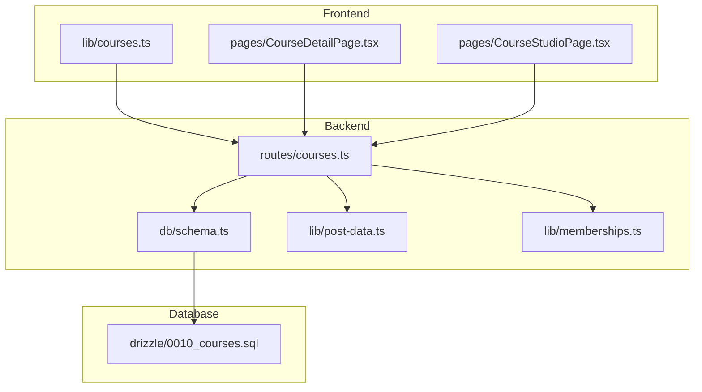
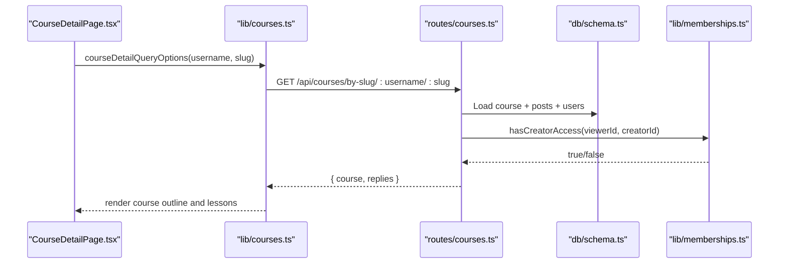
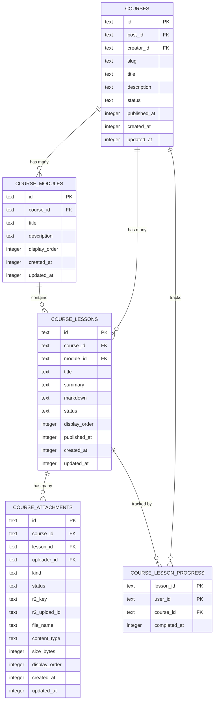
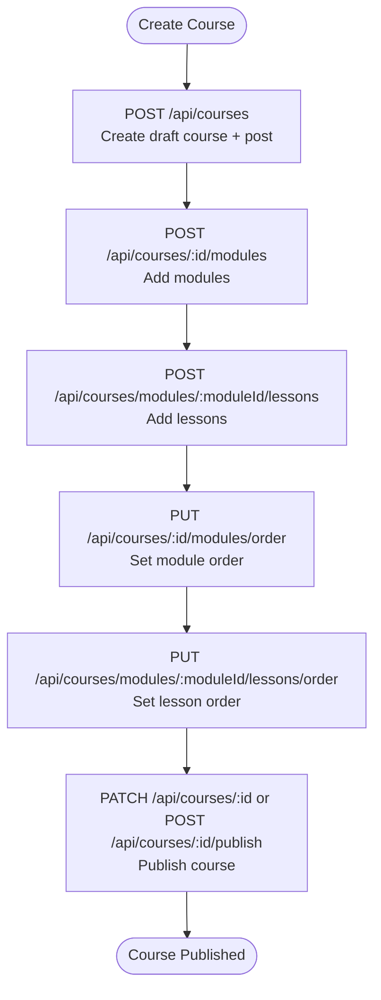
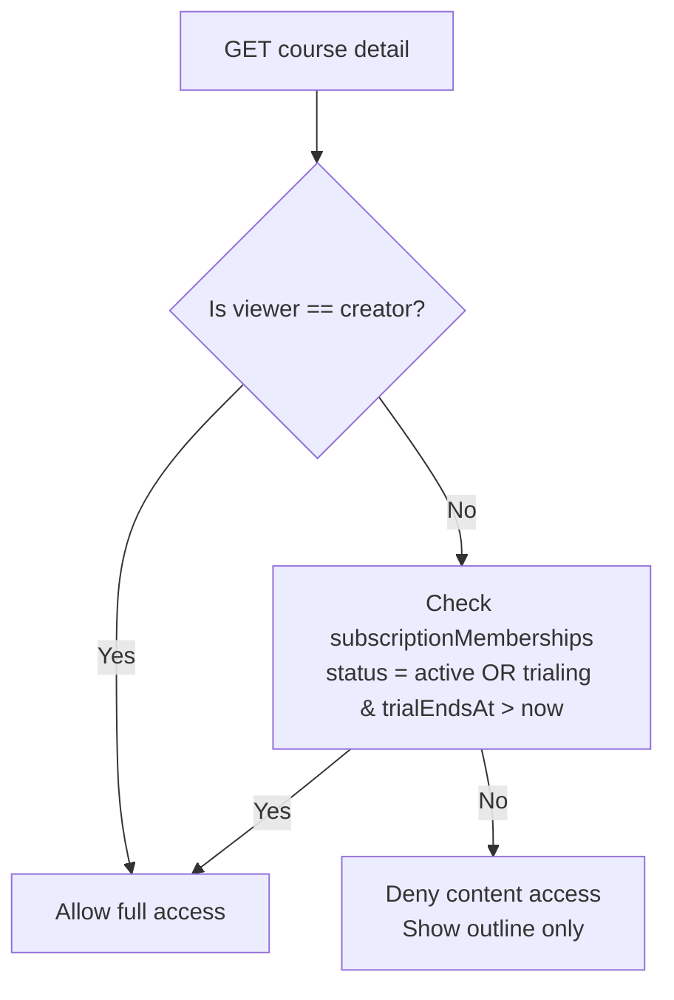
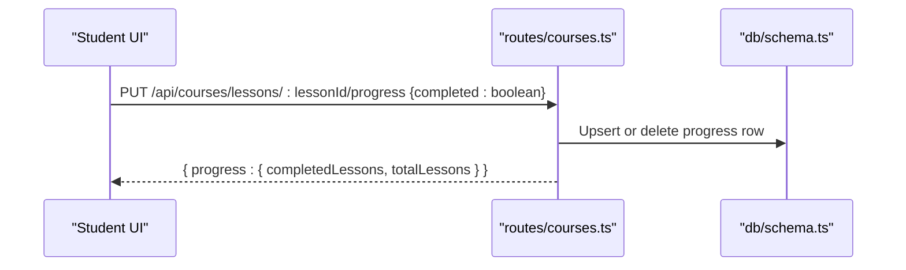
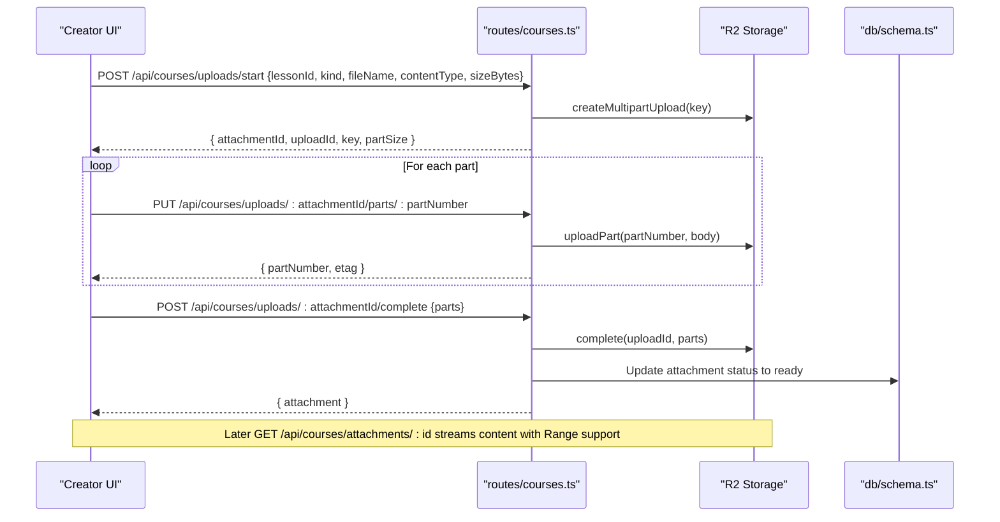
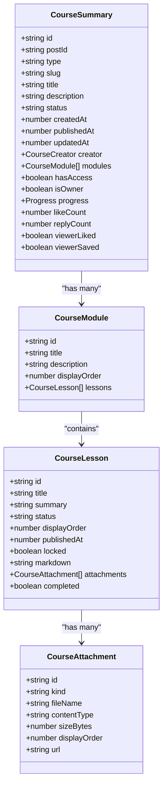
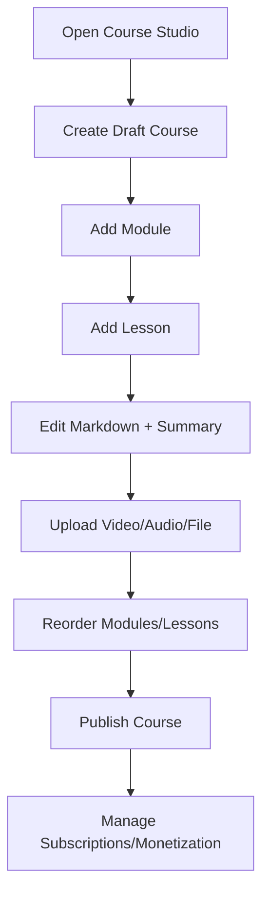
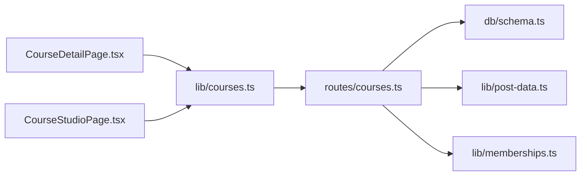

# Courses System

<cite>
**Referenced Files in This Document**
- [0010_courses.sql](file://drizzle/0010_courses.sql)
- [schema.ts](file://src/worker/db/schema.ts)
- [courses.ts](file://src/worker/routes/courses.ts)
- [courses.ts (frontend lib)](file://src/react-app/lib/courses.ts)
- [CourseDetailPage.tsx](file://src/react-app/pages/CourseDetailPage.tsx)
- [CourseStudioPage.tsx](file://src/react-app/pages/CourseStudioPage.tsx)
- [post-data.ts](file://src/worker/lib/post-data.ts)
- [memberships.ts](file://src/worker/lib/memberships.ts)
</cite>

## Table of Contents
1. [Introduction](#introduction)
2. [Project Structure](#project-structure)
3. [Core Components](#core-components)
4. [Architecture Overview](#architecture-overview)
5. [Detailed Component Analysis](#detailed-component-analysis)
6. [Dependency Analysis](#dependency-analysis)
7. [Performance Considerations](#performance-considerations)
8. [Troubleshooting Guide](#troubleshooting-guide)
9. [Conclusion](#conclusion)
10. [Appendices](#appendices)

## Introduction
This document explains Zenith’s courses system: how structured educational content is modeled, created, and consumed; how lesson sequencing and curriculum organization work; how student enrollment and access are managed via creator subscriptions; and how progress tracking is implemented. It also covers the database schema for courses, modules, lessons, attachments, and progress, along with API endpoints for course CRUD, lesson management, enrollment gating, progress updates, and attachment handling. Monetization integration is covered through membership plans and subscription entitlements that gate access to course content.

## Project Structure
The courses feature spans backend routes, data models, and frontend pages/libraries:
- Backend routes define all course-related APIs, including creation, publishing, module/lesson management, attachment uploads, and progress tracking.
- Database schema defines tables for courses, modules, lessons, attachments, and progress.
- Frontend libraries provide typed client functions and React Query hooks for courses.
- Pages implement the Course Studio (creator editing) and Course Detail (subscriber consumption).

**Diagram sources**
- [courses.ts:1-120](file://src/worker/routes/courses.ts#L1-L120)
- [schema.ts:350-446](file://src/worker/db/schema.ts#L350-L446)
- [post-data.ts:84-98](file://src/worker/lib/post-data.ts#L84-L98)
- [memberships.ts:14-31](file://src/worker/lib/memberships.ts#L14-L31)
- [0010_courses.sql:1-93](file://drizzle/0010_courses.sql#L1-L93)

**Section sources**
- [courses.ts:1-120](file://src/worker/routes/courses.ts#L1-L120)
- [schema.ts:350-446](file://src/worker/db/schema.ts#L350-L446)
- [courses.ts (frontend lib):1-120](file://src/react-app/lib/courses.ts#L1-L120)
- [CourseDetailPage.tsx:1-99](file://src/react-app/pages/CourseDetailPage.tsx#L1-L99)
- [CourseStudioPage.tsx:1-120](file://src/react-app/pages/CourseStudioPage.tsx#L1-L120)

## Core Components
- Course entity: Represents a structured learning product linked to a post, owned by a creator, with status and timestamps.
- Modules: Ordered sections within a course.
- Lessons: Content items within modules, each with markdown content, summary, status, and order.
- Attachments: Media or files attached to lessons (video, audio, file), uploaded via multipart upload.
- Progress: Per-user completion state per lesson within a course.
- Access control: Gated by creator subscription membership (active or trial).

Key responsibilities:
- Course lifecycle: create draft, update metadata, publish/unpublish, delete.
- Curriculum authoring: add/edit/reorder modules and lessons; set lesson status; attach media.
- Enrollment gating: only subscribers (or owner) can view lesson content and track progress.
- Progress tracking: mark lessons complete/incomplete; compute counts.

**Section sources**
- [schema.ts:350-446](file://src/worker/db/schema.ts#L350-L446)
- [courses.ts:365-476](file://src/worker/routes/courses.ts#L365-L476)
- [post-data.ts:84-98](file://src/worker/lib/post-data.ts#L84-L98)
- [memberships.ts:14-31](file://src/worker/lib/memberships.ts#L14-L31)

## Architecture Overview
The system follows a layered architecture:
- Frontend pages call typed client functions from the courses library.
- Backend Hono routes handle validation, authorization, business logic, and persistence.
- Data layer uses Drizzle ORM against SQLite schema defined in migrations.
- Access control integrates with membership subsystem to enforce subscription-based gating.

**Diagram sources**
- [CourseDetailPage.tsx:19-40](file://src/react-app/pages/CourseDetailPage.tsx#L19-L40)
- [courses.ts (frontend lib):96-108](file://src/react-app/lib/courses.ts#L96-L108)
- [courses.ts:398-415](file://src/worker/routes/courses.ts#L398-L415)
- [post-data.ts:84-98](file://src/worker/lib/post-data.ts#L84-L98)

## Detailed Component Analysis

### Database Schema for Courses
The schema defines the core entities and relationships:
- courses: id, post_id, creator_id, slug, title, description, status, published_at, timestamps.
- course_modules: id, course_id, title, description, display_order, timestamps.
- course_lessons: id, course_id, module_id, title, summary, markdown, status, display_order, published_at, timestamps.
- course_attachments: id, course_id, lesson_id, uploader_id, kind, status, r2_key, r2_upload_id, file_name, content_type, size_bytes, display_order, timestamps.
- course_lesson_progress: composite primary key on lesson_id + user_id, plus course_id, completed_at.

Indexes optimize queries for ordering, filtering by status/published dates, and progress lookups.

**Diagram sources**
- [0010_courses.sql:1-93](file://drizzle/0010_courses.sql#L1-L93)
- [schema.ts:350-446](file://src/worker/db/schema.ts#L350-L446)

**Section sources**
- [0010_courses.sql:1-93](file://drizzle/0010_courses.sql#L1-L93)
- [schema.ts:350-446](file://src/worker/db/schema.ts#L350-L446)

### Course Creation Workflow and Lesson Sequencing
- Creator creates a course draft via POST /api/courses. A corresponding post is created and linked.
- Creator adds modules via POST /api/courses/:courseId/modules.
- Creator adds lessons under modules via POST /api/courses/modules/:moduleId/lessons.
- Creator reorders modules and lessons using PUT endpoints with itemIds arrays.
- Lessons can be saved as drafts and later published when they have required content.

**Diagram sources**
- [courses.ts:376-450](file://src/worker/routes/courses.ts#L376-L450)
- [courses.ts:478-518](file://src/worker/routes/courses.ts#L478-L518)
- [courses.ts:538-603](file://src/worker/routes/courses.ts#L538-L603)

**Section sources**
- [courses.ts:376-450](file://src/worker/routes/courses.ts#L376-L450)
- [courses.ts:478-518](file://src/worker/routes/courses.ts#L478-L518)
- [courses.ts:538-603](file://src/worker/routes/courses.ts#L538-L603)

### Enrollment Management and Access Control
- Access to course content and progress tracking requires either ownership or an active subscription to the creator.
- The hasCreatorAccess function checks subscriptionMemberships with entitlement conditions (active or trialing with future expiry).
- Non-subscribers see the course outline but locked lessons and cannot track progress.

**Diagram sources**
- [post-data.ts:84-98](file://src/worker/lib/post-data.ts#L84-L98)
- [memberships.ts:14-31](file://src/worker/lib/memberships.ts#L14-L31)

**Section sources**
- [post-data.ts:84-98](file://src/worker/lib/post-data.ts#L84-L98)
- [memberships.ts:14-31](file://src/worker/lib/memberships.ts#L14-L31)

### Progress Tracking and Completion
- Students mark lessons complete/incomplete via PUT /api/courses/lessons/:lessonId/progress.
- Progress is stored per lesson and user, with completedAt timestamp.
- Course payload includes progress counts for accessible viewers.

**Diagram sources**
- [courses.ts:745-765](file://src/worker/routes/courses.ts#L745-L765)
- [schema.ts:436-446](file://src/worker/db/schema.ts#L436-L446)

**Section sources**
- [courses.ts:745-765](file://src/worker/routes/courses.ts#L745-L765)
- [schema.ts:436-446](file://src/worker/db/schema.ts#L436-L446)

### Attachment Upload and Delivery
- Multipart upload flow: start, upload parts, complete.
- Validation enforces kind/content-type and size limits.
- Delivery supports HTTP Range requests for streaming video/audio.

**Diagram sources**
- [courses.ts:618-696](file://src/worker/routes/courses.ts#L618-L696)
- [courses.ts:709-743](file://src/worker/routes/courses.ts#L709-L743)

**Section sources**
- [courses.ts:618-696](file://src/worker/routes/courses.ts#L618-L696)
- [courses.ts:709-743](file://src/worker/routes/courses.ts#L709-L743)

### Course Detail and Consumption UI
- CourseDetailPage fetches course by username/slug, displays outline, locks non-accessible lessons, shows progress bar, and allows marking lessons complete.
- Integrates with like/save and discussion features tied to the underlying post.

**Diagram sources**
- [courses.ts (frontend lib):9-70](file://src/react-app/lib/courses.ts#L9-L70)
- [CourseDetailPage.tsx:19-99](file://src/react-app/pages/CourseDetailPage.tsx#L19-L99)

**Section sources**
- [courses.ts (frontend lib):9-70](file://src/react-app/lib/courses.ts#L9-L70)
- [CourseDetailPage.tsx:19-99](file://src/react-app/pages/CourseDetailPage.tsx#L19-L99)

### Course Studio Editor
- CourseStudioPage provides a rich editor for creating courses, adding modules/lessons, reordering, saving drafts, publishing, and uploading attachments with progress feedback.
- Includes a publishing checklist and scheduling dialog integration.

**Diagram sources**
- [CourseStudioPage.tsx:159-275](file://src/react-app/pages/CourseStudioPage.tsx#L159-L275)
- [courses.ts (frontend lib):118-176](file://src/react-app/lib/courses.ts#L118-L176)

**Section sources**
- [CourseStudioPage.tsx:159-275](file://src/react-app/pages/CourseStudioPage.tsx#L159-L275)
- [courses.ts (frontend lib):118-176](file://src/react-app/lib/courses.ts#L118-L176)

## Dependency Analysis
- Backend routes depend on:
  - Drizzle ORM schema definitions for queries and mutations.
  - Membership utilities for access control.
  - Post utilities for building extras (likes, replies, saves).
- Frontend depends on:
  - Typed client functions and query keys for caching.
  - React Query for data fetching and mutation.
  - UI components for rendering course details and studio editor.

**Diagram sources**
- [courses.ts:1-31](file://src/worker/routes/courses.ts#L1-L31)
- [schema.ts:350-446](file://src/worker/db/schema.ts#L350-L446)
- [post-data.ts:1-20](file://src/worker/lib/post-data.ts#L1-L20)
- [memberships.ts:1-10](file://src/worker/lib/memberships.ts#L1-L10)
- [courses.ts (frontend lib):1-20](file://src/react-app/lib/courses.ts#L1-L20)

**Section sources**
- [courses.ts:1-31](file://src/worker/routes/courses.ts#L1-L31)
- [schema.ts:350-446](file://src/worker/db/schema.ts#L350-L446)
- [post-data.ts:1-20](file://src/worker/lib/post-data.ts#L1-L20)
- [memberships.ts:1-10](file://src/worker/lib/memberships.ts#L1-L10)
- [courses.ts (frontend lib):1-20](file://src/react-app/lib/courses.ts#L1-L20)

## Performance Considerations
- Use indexes on course_modules.display_order, course_lessons.module_id/display_order, and course_attachments.lesson_id/display_order for efficient ordering.
- Batch updates when reordering modules/lessons to minimize round trips.
- Stream large media via Range requests to reduce bandwidth and improve playback performance.
- Cache course payloads and replies using React Query keys to avoid redundant network calls.
- Validate input sizes and types early to prevent unnecessary processing.

[No sources needed since this section provides general guidance]

## Troubleshooting Guide
Common issues and resolutions:
- Schedule processing conflict: PATCH/DELETE operations return 409 if content scheduling is processing. Wait until processing completes before editing.
- Validation failures: Ensure lesson titles, summaries, markdown lengths, and attachment kinds/types match constraints.
- Access denied: Verify subscriber has an active or valid trial membership to the creator.
- Upload failures: Confirm part numbers are within range, content-types match expected prefixes, and final size matches declared size.

**Section sources**
- [courses.ts:417-464](file://src/worker/routes/courses.ts#L417-L464)
- [courses.ts:565-616](file://src/worker/routes/courses.ts#L565-L616)
- [courses.ts:618-696](file://src/worker/routes/courses.ts#L618-L696)

## Conclusion
Zenith’s courses system provides a robust foundation for structured educational content with clear separation between course metadata, curriculum structure, media assets, and learner progress. Access control is tightly integrated with the membership system, ensuring only entitled users can consume content and track progress. The API surface supports comprehensive CRUD operations, ordering, and multipart uploads, while the frontend offers intuitive tools for creators and learners alike.

[No sources needed since this section summarizes without analyzing specific files]

## Appendices

### API Endpoints Summary
- Course CRUD:
  - POST /api/courses — Create course draft
  - GET /api/courses/:courseId — Get course by ID
  - GET /api/courses/by-slug/:username/:slug — Get course by creator slug
  - PATCH /api/courses/:courseId — Update course metadata/status
  - POST /api/courses/:courseId/publish — Publish course
  - POST /api/courses/:courseId/unpublish — Move to draft
  - DELETE /api/courses/:courseId — Delete course
- Module management:
  - POST /api/courses/:courseId/modules — Create module
  - PATCH /api/courses/modules/:moduleId — Update module
  - PUT /api/courses/:courseId/modules/order — Reorder modules
  - DELETE /api/courses/modules/:moduleId — Delete module
- Lesson management:
  - POST /api/courses/modules/:moduleId/lessons — Create lesson
  - PATCH /api/courses/lessons/:lessonId — Update lesson
  - PUT /api/courses/modules/:moduleId/lessons/order — Reorder lessons
  - DELETE /api/courses/lessons/:lessonId — Delete lesson
- Attachments:
  - POST /api/courses/uploads/start — Start multipart upload
  - PUT /api/courses/uploads/:attachmentId/parts/:partNumber — Upload part
  - POST /api/courses/uploads/:attachmentId/complete — Complete upload
  - GET /api/courses/attachments/:attachmentId — Stream attachment
  - DELETE /api/courses/attachments/:attachmentId — Delete attachment
- Progress:
  - PUT /api/courses/lessons/:lessonId/progress — Mark lesson complete/incomplete

**Section sources**
- [courses.ts:365-765](file://src/worker/routes/courses.ts#L365-L765)

### Example Workflows
- Creating a multi-lesson course:
  - Create course draft → Add modules → Add lessons → Reorder → Publish.
- Setting up enrollment restrictions:
  - Configure membership plan mode (free_permanent, free_trial, paid) and prices; ensure hasCreatorAccess returns true for subscribers.
- Implementing quiz functionality:
  - Store quiz questions and answers in lesson markdown; use attachments for downloadable quizzes; track completion via progress endpoint.
- Tracking student progress:
  - Call progress endpoint on lesson completion; display progress counts in course detail.
- Managing course access levels:
  - Enforce access via hasCreatorAccess; show locked lessons to non-subscribers.
- Integrating monetization:
  - Use membership plans and Stripe integration; subscription status drives access entitlement.

[No sources needed since this section provides general guidance]