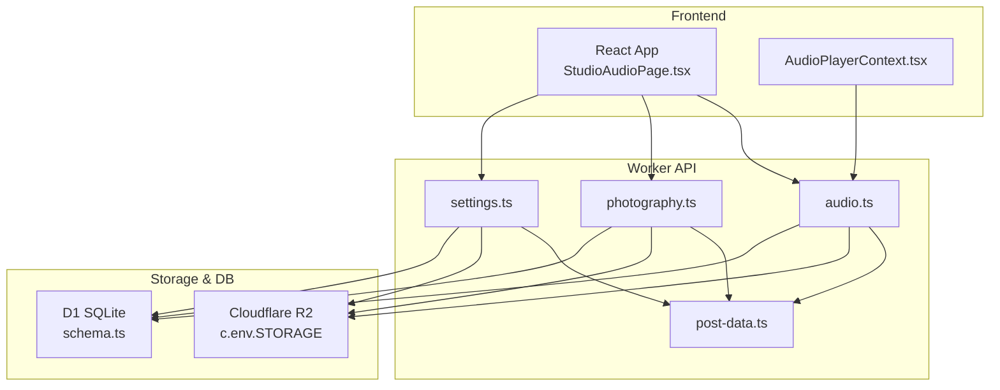
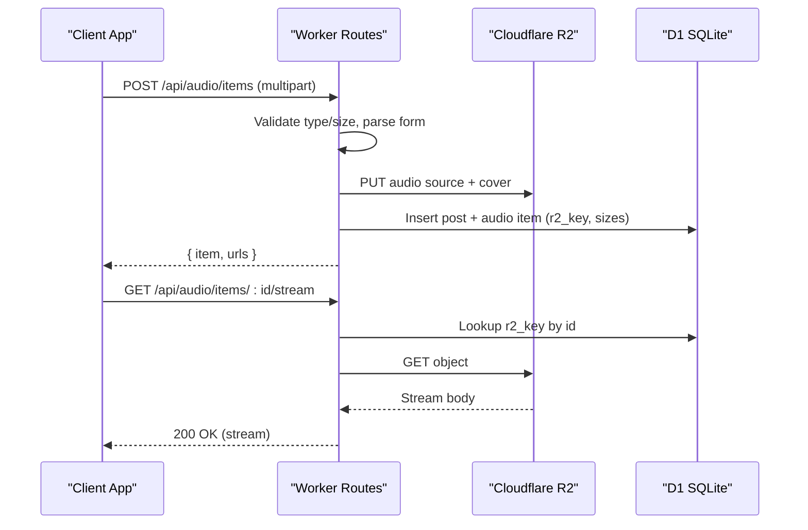
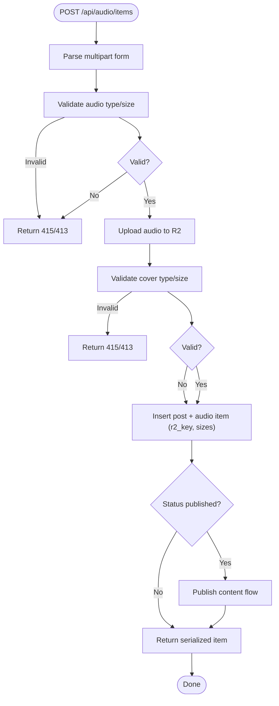
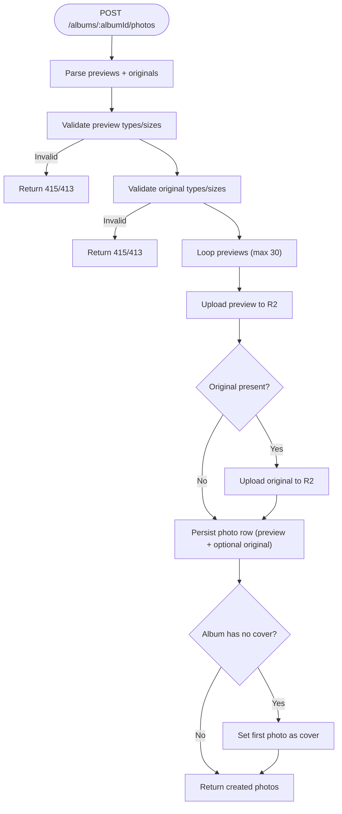
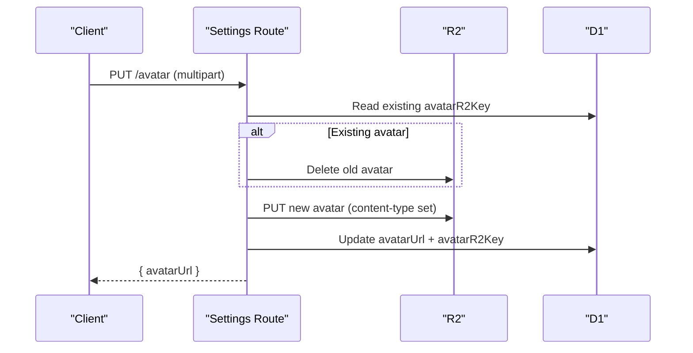
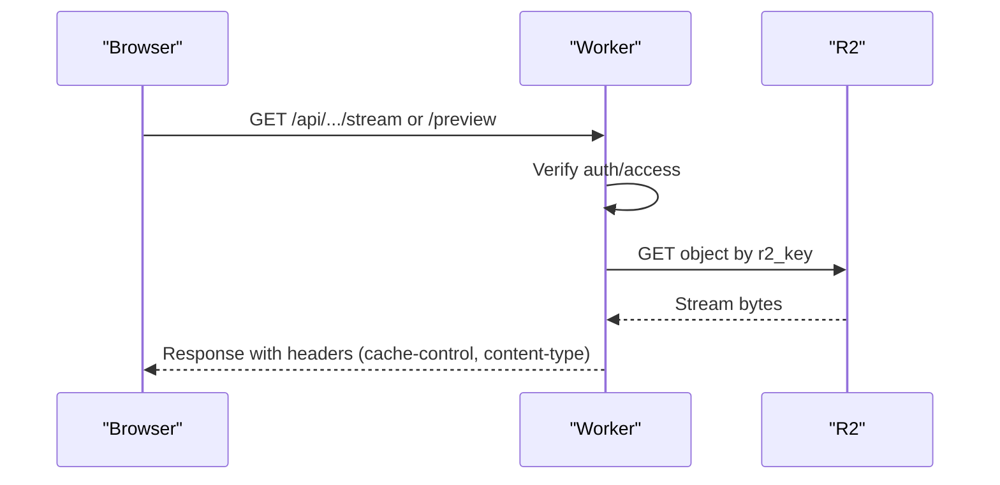
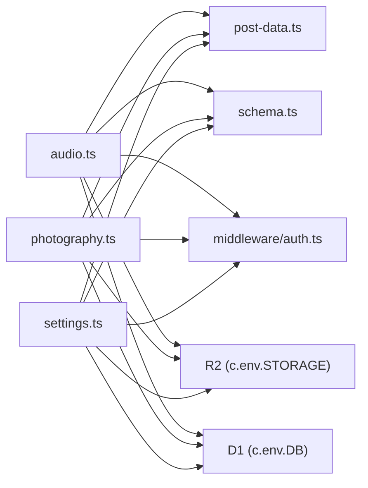

# Media Handling and Storage

<cite>
**Referenced Files in This Document**
- [audio.ts](file://src/worker/routes/audio.ts)
- [photography.ts](file://src/worker/routes/photography.ts)
- [settings.ts](file://src/worker/routes/settings.ts)
- [post-data.ts](file://src/worker/lib/post-data.ts)
- [schema.ts](file://src/worker/db/schema.ts)
- [AudioPlayerContext.tsx](file://src/react-app/context/AudioPlayerContext.tsx)
- [StudioAudioPage.tsx](file://src/react-app/pages/StudioAudioPage.tsx)
- [auth.integration.test.ts](file://src/worker/routes/auth.integration.test.ts)
- [wrangler.json](file://wrangler.json)
</cite>

## Table of Contents
1. [Introduction](#introduction)
2. [Project Structure](#project-structure)
3. [Core Components](#core-components)
4. [Architecture Overview](#architecture-overview)
5. [Detailed Component Analysis](#detailed-component-analysis)
6. [Dependency Analysis](#dependency-analysis)
7. [Performance Considerations](#performance-considerations)
8. [Troubleshooting Guide](#troubleshooting-guide)
9. [Conclusion](#conclusion)
10. [Appendices](#appendices)

## Introduction
This document explains Zenith’s media handling and storage system built on Cloudflare R2. It covers file upload workflows, image validation and optimization, audio processing pipelines, thumbnail generation, CDN integration via Cloudflare, storage key naming conventions, metadata management, access control policies, cleanup procedures, supported formats, size limits, security considerations, and performance optimizations. It also provides practical examples for uploading images with validation, processing audio files, generating responsive thumbnails, implementing signed URLs for secure access, and managing storage lifecycle policies for cost optimization.

## Project Structure
The media system spans worker routes (APIs), shared libraries (types, constants, URL builders), database schemas, and frontend components that drive uploads and playback.

**Diagram sources**
- [audio.ts:1-120](file://src/worker/routes/audio.ts#L1-L120)
- [photography.ts:1-120](file://src/worker/routes/photography.ts#L1-L120)
- [settings.ts:1-135](file://src/worker/routes/settings.ts#L1-L135)
- [post-data.ts:1-150](file://src/worker/lib/post-data.ts#L1-L150)
- [schema.ts:233-291](file://src/worker/db/schema.ts#L233-L291)

**Section sources**
- [audio.ts:1-120](file://src/worker/routes/audio.ts#L1-L120)
- [photography.ts:1-120](file://src/worker/routes/photography.ts#L1-L120)
- [settings.ts:1-135](file://src/worker/routes/settings.ts#L1-L135)
- [post-data.ts:1-150](file://src/worker/lib/post-data.ts#L1-L150)
- [schema.ts:233-291](file://src/worker/db/schema.ts#L233-L291)

## Core Components
- Worker routes implement APIs for audio collections/items, photography albums/photos, and user avatars. They validate inputs, enforce size/type limits, upload to R2, persist metadata in D1, and return structured JSON responses.
- Shared library post-data.ts centralizes allowed MIME types, size limits, extension helpers, and URL builders for streaming and cover images.
- Database schema defines tables for audio collections/items, photography photos, post/reply attachments, and course attachments, including R2 keys and sizes.
- Frontend components build multipart forms and consume stream URLs for playback.

Key responsibilities:
- Validation: strict type and size checks before upload.
- Upload: direct buffer writes to R2 with correct content-type metadata.
- Metadata: store R2 keys, filenames, content types, sizes, and display order in D1.
- Access control: authorization middleware and creator/member checks.
- Cleanup: delete old or deleted objects from R2 when replaced or removed.

**Section sources**
- [audio.ts:137-288](file://src/worker/routes/audio.ts#L137-L288)
- [photography.ts:145-235](file://src/worker/routes/photography.ts#L145-L235)
- [settings.ts:90-133](file://src/worker/routes/settings.ts#L90-L133)
- [post-data.ts:18-42](file://src/worker/lib/post-data.ts#L18-L42)
- [schema.ts:233-291](file://src/worker/db/schema.ts#L233-L291)

## Architecture Overview
The system uses a serverless worker architecture with Hono routes. Clients send multipart/form-data to create/update media; the worker validates, uploads to R2, updates D1, and returns normalized responses. Playback uses stream endpoints that proxy from R2 with appropriate headers.

**Diagram sources**
- [audio.ts:591-656](file://src/worker/routes/audio.ts#L591-L656)
- [audio.ts:116-118](file://src/worker/lib/post-data.ts#L116-L118)
- [schema.ts:259-291](file://src/worker/db/schema.ts#L259-L291)

## Detailed Component Analysis

### Audio Upload and Streaming Pipeline
- Input parsing and validation:
  - Enforces multipart/form-data.
  - Validates audio MIME types and size limit (90 MB).
  - Validates optional cover image types and size limit (5 MB).
- Upload:
  - Generates deterministic R2 keys with UUIDs and extensions derived from content type.
  - Stores original audio and optional cover images.
- Persistence:
  - Creates a post record and an audio item with r2_key, filename, content type, size, duration, and ordering.
- Streaming:
  - Provides a stream endpoint returning the audio object directly from R2 with proper headers.

**Diagram sources**
- [audio.ts:159-249](file://src/worker/routes/audio.ts#L159-L249)
- [audio.ts:264-288](file://src/worker/routes/audio.ts#L264-L288)
- [audio.ts:591-656](file://src/worker/routes/audio.ts#L591-L656)

**Section sources**
- [audio.ts:137-288](file://src/worker/routes/audio.ts#L137-L288)
- [audio.ts:591-656](file://src/worker/routes/audio.ts#L591-L656)
- [post-data.ts:18-42](file://src/worker/lib/post-data.ts#L18-L42)
- [schema.ts:259-291](file://src/worker/db/schema.ts#L259-L291)

### Photography Upload, Validation, and Thumbnails
- Input parsing and validation:
  - Requires at least one preview photo; allows up to 30 per batch.
  - Originals must match previews by position if provided.
  - Preview types limited to JPEG/PNG/WebP with 10 MB limit.
  - Originals support broader types/extensions (including RAW) with 90 MB limit.
- Upload:
  - Writes preview and optional original to R2 under album/photo-scoped keys.
- Metadata:
  - Stores preview/original R2 keys, filenames, content types, sizes, and optional dimensions.
- Thumbnails:
  - Preview images serve as thumbnails; original download is gated by flags and content type.
- Access control:
  - Album and photo visibility enforced via post membership and creator access.

**Diagram sources**
- [photography.ts:170-208](file://src/worker/routes/photography.ts#L170-L208)
- [photography.ts:210-235](file://src/worker/routes/photography.ts#L210-L235)
- [photography.ts:580-653](file://src/worker/routes/photography.ts#L580-L653)

**Section sources**
- [photography.ts:145-235](file://src/worker/routes/photography.ts#L145-L235)
- [photography.ts:580-653](file://src/worker/routes/photography.ts#L580-L653)
- [post-data.ts:18-42](file://src/worker/lib/post-data.ts#L18-L42)
- [schema.ts:318-348](file://src/worker/db/schema.ts#L318-L348)

### Avatar Upload and Replacement
- Size limit: 5 MB.
- Extension mapping based on content type.
- Old avatar deletion before new upload.
- Persists avatarUrl and avatarR2Key in user profile.

**Diagram sources**
- [settings.ts:90-133](file://src/worker/routes/settings.ts#L90-L133)

**Section sources**
- [settings.ts:90-133](file://src/worker/routes/settings.ts#L90-L133)

### Data Models and Metadata Management
- Audio:
  - Collections: kind (album/podcast), slug, title, description, status, cover R2 key and metadata, release date.
  - Items: collection link, post link, kind (music/podcast_episode), slug, title, description, status, audio R2 key and metadata, cover R2 key and metadata, durationSeconds, displayOrder, publishedAt.
- Photography:
  - Photos: album link, creator, title/caption/altText, status, preview/original R2 keys and metadata, originalDownloadEnabled flag, width/height, displayOrder.
- Attachments:
  - Post and reply attachments include r2_key, fileName, contentType, sizeBytes, displayOrder.
- Course attachments:
  - Include kind (video/audio/file), status (pending/ready), r2_key, r2_upload_id, fileName, contentType, sizeBytes, displayOrder.

**Section sources**
- [schema.ts:233-291](file://src/worker/db/schema.ts#L233-L291)
- [schema.ts:318-348](file://src/worker/db/schema.ts#L318-L348)
- [schema.ts:411-463](file://src/worker/db/schema.ts#L411-L463)

### CDN Integration and Access Control
- All media URLs are proxied through worker endpoints, enabling:
  - Authorization checks before serving.
  - Proper cache-control headers (e.g., private caching for previews).
  - Content-Type and Content-Disposition headers for inline display or downloads.
- Signed URLs:
  - Not implemented in current code; recommended approach is to generate short-lived signed URLs via R2 Object Signer and expose them through a dedicated endpoint.

**Diagram sources**
- [photography.ts:790-807](file://src/worker/routes/photography.ts#L790-L807)
- [post-data.ts:108-126](file://src/worker/lib/post-data.ts#L108-L126)

**Section sources**
- [photography.ts:790-807](file://src/worker/routes/photography.ts#L790-L807)
- [post-data.ts:108-126](file://src/worker/lib/post-data.ts#L108-L126)

### Frontend Usage Examples
- Uploading audio:
  - Build FormData with fields like kind, title, description, status, durationSeconds, audio, cover.
  - Submit to create/update endpoints; handle success/error toasts.
- Playing audio:
  - Use streamUrl returned by the API; HTML <audio> element streams directly.
- Uploading photography:
  - Prepare multiple previews and optional originals; attach metadata JSON array per photo.

**Section sources**
- [StudioAudioPage.tsx:606-618](file://src/react-app/pages/StudioAudioPage.tsx#L606-L618)
- [AudioPlayerContext.tsx:244-276](file://src/react-app/context/AudioPlayerContext.tsx#L244-L276)

## Dependency Analysis
- Worker routes depend on:
  - post-data.ts for constants (MIME types, size limits), extension helpers, and URL builders.
  - db/schema.ts for table definitions and indexes.
  - middleware/auth.ts for authentication and role enforcement.
  - lib/http.ts for standardized error responses.
- R2 is accessed via c.env.STORAGE; D1 via c.env.DB.

**Diagram sources**
- [audio.ts:1-31](file://src/worker/routes/audio.ts#L1-L31)
- [photography.ts:1-31](file://src/worker/routes/photography.ts#L1-L31)
- [settings.ts:1-31](file://src/worker/routes/settings.ts#L1-L31)
- [post-data.ts:1-42](file://src/worker/lib/post-data.ts#L1-L42)
- [schema.ts:233-291](file://src/worker/db/schema.ts#L233-L291)

**Section sources**
- [audio.ts:1-31](file://src/worker/routes/audio.ts#L1-L31)
- [photography.ts:1-31](file://src/worker/routes/photography.ts#L1-L31)
- [settings.ts:1-31](file://src/worker/routes/settings.ts#L1-L31)
- [post-data.ts:1-42](file://src/worker/lib/post-data.ts#L1-L42)
- [schema.ts:233-291](file://src/worker/db/schema.ts#L233-L291)

## Performance Considerations
- Streaming playback:
  - Direct R2 streaming avoids server-side buffering; ensure proper cache-control headers for previews.
- Batching:
  - Photography supports up to 30 previews per upload; keep payloads within limits to avoid timeouts.
- Caching:
  - Use private cache-control for authenticated previews; consider public caching for non-sensitive assets behind signed URLs.
- Indexing:
  - D1 indexes on displayOrder and creator/status improve listing and ordering performance.
- Lifecycle:
  - Implement R2 lifecycle rules to archive or delete stale objects (e.g., temporary uploads, old avatars).

[No sources needed since this section provides general guidance]

## Troubleshooting Guide
Common issues and resolutions:
- Unsupported media type:
  - Ensure content-type matches allowed lists (IMAGE_TYPES, AUDIO_TYPES, PHOTOGRAPHY_*).
- Payload too large:
  - Respect MAX_*_SIZE limits; compress images or reduce audio bitrate.
- Missing required fields:
  - For publishing audio, provide audio and cover (or collection cover); for photography, ensure at least one preview and valid cover selection for published albums.
- Access denied:
  - Verify user roles and creator membership; check moderation status and scheduled processing locks.
- Orphaned R2 objects:
  - On update/delete, ensure old R2 keys are deleted; verify cleanup paths in PATCH/DELETE handlers.

**Section sources**
- [audio.ts:137-157](file://src/worker/routes/audio.ts#L137-L157)
- [photography.ts:145-168](file://src/worker/routes/photography.ts#L145-L168)
- [settings.ts:90-133](file://src/worker/routes/settings.ts#L90-L133)
- [auth.integration.test.ts:334-358](file://src/worker/routes/auth.integration.test.ts#L334-L358)

## Conclusion
Zenith’s media system integrates tightly with Cloudflare R2 and D1, providing robust validation, secure access control, and efficient streaming. By following the documented workflows, naming conventions, and lifecycle policies, teams can maintain high performance, cost efficiency, and security across image and audio media.

[No sources needed since this section summarizes without analyzing specific files]

## Appendices

### Supported Formats and Limits
- Images:
  - Types: JPEG, PNG, WebP (previews); TIFF and RAW variants supported for originals.
  - Sizes: Previews ≤ 10 MB; originals ≤ 90 MB; covers ≤ 5 MB.
- Audio:
  - Types: MP3, M4A, WAV, OGG, WebM.
  - Size: ≤ 90 MB.
- Avatars:
  - Types: JPEG, PNG, WebP.
  - Size: ≤ 5 MB.

**Section sources**
- [post-data.ts:18-42](file://src/worker/lib/post-data.ts#L18-L42)
- [audio.ts:148-157](file://src/worker/routes/audio.ts#L148-L157)
- [photography.ts:145-168](file://src/worker/routes/photography.ts#L145-L168)
- [settings.ts:90-133](file://src/worker/routes/settings.ts#L90-L133)

### Storage Key Naming Conventions
- Avatars: avatars/{userId}.{ext}
- Audio collections: audio/collections/{collectionId}/cover-{uuid}.{ext}
- Audio items: audio/items/{itemId}/source-{uuid}.{ext}, audio/items/{itemId}/cover-{uuid}.{ext}
- Photography: photography/albums/{albumId}/photos/{photoId}/preview-{uuid}.{ext}, .../original-{uuid}.{ext}

**Section sources**
- [settings.ts:117-123](file://src/worker/routes/settings.ts#L117-L123)
- [audio.ts:251-288](file://src/worker/routes/audio.ts#L251-L288)
- [photography.ts:210-235](file://src/worker/routes/photography.ts#L210-L235)

### Access Control Policies
- Authentication:
  - Middleware enforces session-based auth for protected routes.
- Authorization:
  - Creator-only endpoints require role 'creator'.
  - Member access validated via subscription memberships and post visibility.
- Moderation:
  - Editing/deleting blocked while content is moderated or being published.

**Section sources**
- [audio.ts:480-509](file://src/worker/routes/audio.ts#L480-L509)
- [photography.ts:393-407](file://src/worker/routes/photography.ts#L393-L407)
- [post-data.ts:84-98](file://src/worker/lib/post-data.ts#L84-L98)

### Cleanup Procedures
- Replace avatars:
  - Delete previous avatar R2 key before uploading new one.
- Update photos:
  - Delete old preview/original R2 keys when replaced.
- Delete items:
  - Remove associated audio and cover R2 keys when deleting audio items.
- Delete albums:
  - Prevent deletion if not empty; cascade deletes handled by DB constraints.

**Section sources**
- [settings.ts:98-107](file://src/worker/routes/settings.ts#L98-L107)
- [photography.ts:698-706](file://src/worker/routes/photography.ts#L698-L706)
- [audio.ts:719-735](file://src/worker/routes/audio.ts#L719-L735)

### CDN Configuration Notes
- Wrangler environment binds STORAGE (R2) and DB (D1) for runtime access.
- Responses include cache-control headers suitable for private previews; configure Cloudflare Cache Rules as needed for public assets.

**Section sources**
- [wrangler.json:1-200](file://wrangler.json#L1-L200)

### Example Workflows

#### Upload Image with Validation
- Steps:
  - Build FormData with previews and optional originals.
  - Validate types and sizes server-side.
  - Upload to R2 and persist metadata.
  - Return preview/original URLs.

**Section sources**
- [photography.ts:580-653](file://src/worker/routes/photography.ts#L580-L653)

#### Process Audio Files
- Steps:
  - Submit multipart with audio and optional cover.
  - Validate and upload to R2.
  - Persist post and audio item with durations and ordering.
  - Optionally publish content.

**Section sources**
- [audio.ts:591-656](file://src/worker/routes/audio.ts#L591-L656)

#### Generate Responsive Thumbnails
- Strategy:
  - Store optimized previews as thumbnails.
  - Serve originals only when allowed and renderable.
  - Use client-side responsive techniques (sizes/srcset) with preview URLs.

**Section sources**
- [photography.ts:298-326](file://src/worker/routes/photography.ts#L298-L326)

#### Implement Signed URLs for Secure Access
- Recommendation:
  - Create a signed URL endpoint using R2 Object Signer.
  - Validate request context and scope permissions.
  - Return short-lived signed URLs to clients.

[No sources needed since this section provides general guidance]

#### Manage Storage Lifecycle Policies
- Recommendations:
  - Define lifecycle rules to transition or delete temporary uploads after TTL.
  - Archive infrequently accessed originals to lower-cost tiers.
  - Monitor usage and adjust policies for cost optimization.

[No sources needed since this section provides general guidance]