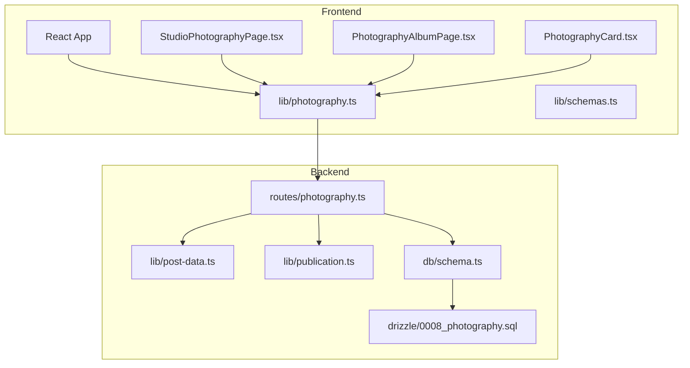
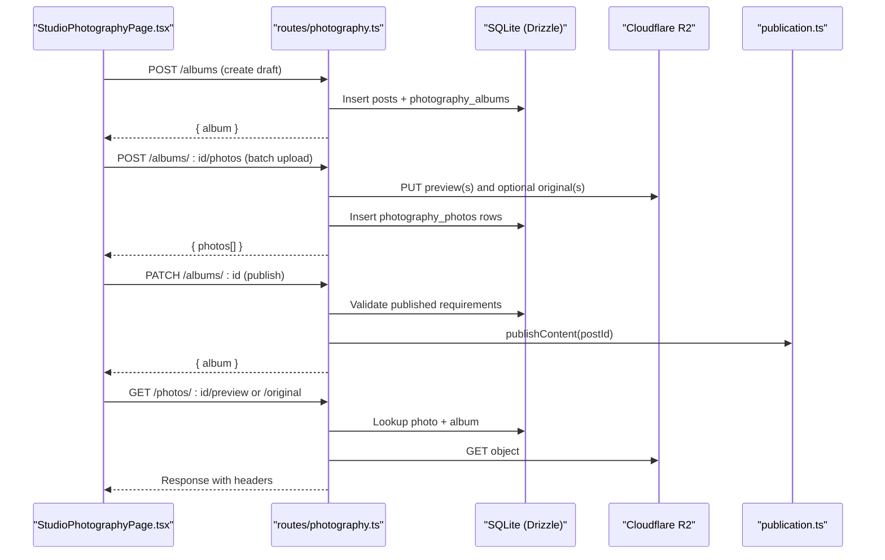
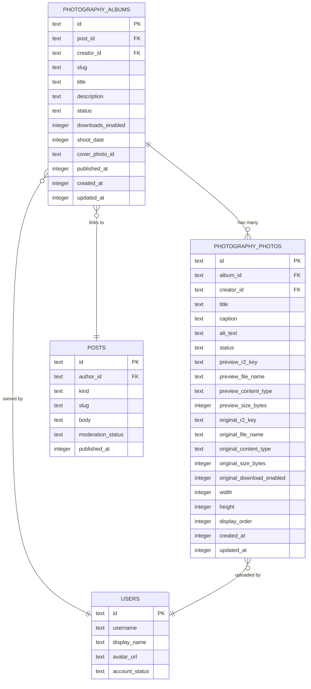
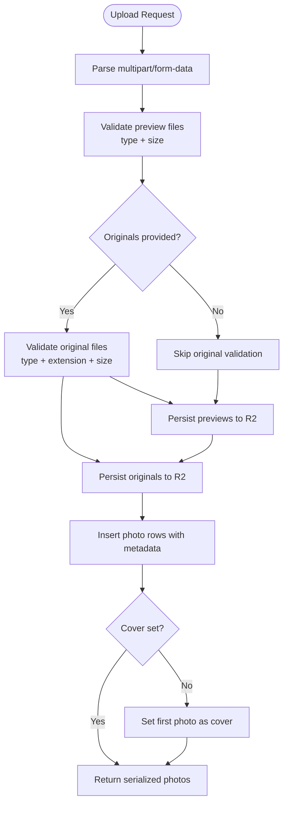
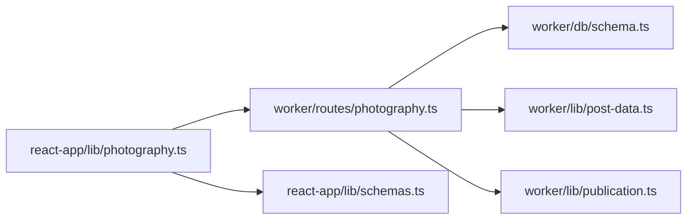

# Photography Albums System

<cite>
**Referenced Files in This Document**
- [photography.ts](file://src/worker/routes/photography.ts)
- [schema.ts](file://src/worker/db/schema.ts)
- [0008_photography.sql](file://drizzle/0008_photography.sql)
- [post-data.ts](file://src/worker/lib/post-data.ts)
- [publication.ts](file://src/worker/lib/publication.ts)
- [photography.ts](file://src/react-app/lib/photography.ts)
- [schemas.ts](file://src/react-app/lib/schemas.ts)
- [PhotographyAlbumPage.tsx](file://src/react-app/pages/PhotographyAlbumPage.tsx)
- [StudioPhotographyPage.tsx](file://src/react-app/pages/StudioPhotographyPage.tsx)
- [PhotographyCard.tsx](file://src/react-app/components/PhotographyCard.tsx)
</cite>

## Table of Contents
1. [Introduction](#introduction)
2. [Project Structure](#project-structure)
3. [Core Components](#core-components)
4. [Architecture Overview](#architecture-overview)
5. [Detailed Component Analysis](#detailed-component-analysis)
6. [Dependency Analysis](#dependency-analysis)
7. [Performance Considerations](#performance-considerations)
8. [Troubleshooting Guide](#troubleshooting-guide)
9. [Conclusion](#conclusion)
10. [Appendices](#appendices)

## Introduction
This document explains Zenith’s photography albums system, which enables creators to build curated photo collections with album organization, batch upload workflows, metadata management, and responsive gallery interfaces. It covers the database schema for photography_albums and related tables, status management (draft/published), album ordering, and photo count tracking. It also documents API endpoints for album CRUD, batch photo uploads, image metadata extraction, and optimized image serving via Cloudflare R2. Finally, it provides practical examples for creating albums, uploading multiple photos with descriptions, implementing responsive galleries, managing permissions, and integrating with Cloudflare R2 for efficient delivery and CDN caching.

## Project Structure
The photography feature spans backend routes, data models, utilities, and frontend pages:
- Backend routes define REST endpoints for albums and photos, handle file validation, storage to R2, and access control.
- Database schema defines tables for albums and photos with indexes and constraints.
- Utilities provide URL builders, type constants, and helper functions.
- Frontend libraries expose typed query/mutation helpers and Zod schemas.
- Pages implement the creator studio and public gallery views.

**Diagram sources**
- [photography.ts:1-30](file://src/worker/routes/photography.ts#L1-L30)
- [schema.ts:293-348](file://src/worker/db/schema.ts#L293-L348)
- [0008_photography.sql:1-54](file://drizzle/0008_photography.sql#L1-L54)
- [post-data.ts:1-42](file://src/worker/lib/post-data.ts#L1-L42)
- [publication.ts:1-32](file://src/worker/lib/publication.ts#L1-L32)
- [photography.ts:1-130](file://src/react-app/lib/photography.ts#L1-L130)
- [schemas.ts:268-306](file://src/react-app/lib/schemas.ts#L268-L306)
- [StudioPhotographyPage.tsx:1-120](file://src/react-app/pages/StudioPhotographyPage.tsx#L1-L120)
- [PhotographyAlbumPage.tsx:1-60](file://src/react-app/pages/PhotographyAlbumPage.tsx#L1-L60)
- [PhotographyCard.tsx:1-60](file://src/react-app/components/PhotographyCard.tsx#L1-L60)

**Section sources**
- [photography.ts:1-30](file://src/worker/routes/photography.ts#L1-L30)
- [schema.ts:293-348](file://src/worker/db/schema.ts#L293-L348)
- [0008_photography.sql:1-54](file://drizzle/0008_photography.sql#L1-L54)
- [post-data.ts:1-42](file://src/worker/lib/post-data.ts#L1-L42)
- [publication.ts:1-32](file://src/worker/lib/publication.ts#L1-L32)
- [photography.ts:1-130](file://src/react-app/lib/photography.ts#L1-L130)
- [schemas.ts:268-306](file://src/react-app/lib/schemas.ts#L268-L306)
- [StudioPhotographyPage.tsx:1-120](file://src/react-app/pages/StudioPhotographyPage.tsx#L1-L120)
- [PhotographyAlbumPage.tsx:1-60](file://src/react-app/pages/PhotographyAlbumPage.tsx#L1-L60)
- [PhotographyCard.tsx:1-60](file://src/react-app/components/PhotographyCard.tsx#L1-L60)

## Core Components
- Album lifecycle: creation as draft, adding photos, setting cover, publishing with validation.
- Photo upload: batch preview and optional original files, metadata per item, ordering.
- Access control: member visibility, creator ownership, subscription-based access, moderation checks.
- Storage: previews and originals stored in Cloudflare R2; URLs generated for safe serving.
- Ordering: displayOrder maintained for consistent gallery presentation.
- Metadata: title, caption, alt text, content types, sizes, and download flags.

Key responsibilities:
- Backend routes enforce validation, orchestrate uploads, manage DB state, and serve media.
- Frontend forms validate inputs and coordinate multi-file uploads and reordering.
- Schema ensures referential integrity and performance through indexes.

**Section sources**
- [photography.ts:463-500](file://src/worker/routes/photography.ts#L463-L500)
- [photography.ts:580-653](file://src/worker/routes/photography.ts#L580-L653)
- [photography.ts:734-764](file://src/worker/routes/photography.ts#L734-L764)
- [schema.ts:293-348](file://src/worker/db/schema.ts#L293-L348)
- [schemas.ts:268-306](file://src/react-app/lib/schemas.ts#L268-L306)

## Architecture Overview
The system uses a Hono-based worker route layer backed by Drizzle ORM and SQLite, with Cloudflare R2 for object storage. The frontend is a React app using TanStack Query for data fetching and mutations.

**Diagram sources**
- [StudioPhotographyPage.tsx:366-502](file://src/react-app/pages/StudioPhotographyPage.tsx#L366-L502)
- [photography.ts:463-500](file://src/worker/routes/photography.ts#L463-L500)
- [photography.ts:580-653](file://src/worker/routes/photography.ts#L580-L653)
- [photography.ts:502-555](file://src/worker/routes/photography.ts#L502-L555)
- [publication.ts:1-32](file://src/worker/lib/publication.ts#L1-L32)
- [photography.ts:790-829](file://src/worker/routes/photography.ts#L790-L829)

## Detailed Component Analysis

### Database Schema: photography_albums and photography_photos
- photography_albums stores album metadata, status, downloads flag, shoot date, cover reference, timestamps, and links to posts and users.
- photography_photos stores per-photo metadata, R2 keys for preview/original, content types, sizes, dimensions, order, and timestamps.
- Indexes optimize queries by creator/status/publishedAt, album/displayOrder, and creator/status/createdAt.

**Diagram sources**
- [schema.ts:293-348](file://src/worker/db/schema.ts#L293-L348)
- [0008_photography.sql:1-54](file://drizzle/0008_photography.sql#L1-L54)

**Section sources**
- [schema.ts:293-348](file://src/worker/db/schema.ts#L293-L348)
- [0008_photography.sql:1-54](file://drizzle/0008_photography.sql#L1-L54)

### API Endpoints and Workflows
- Create album (POST /api/photography/albums): Creates a post and album in draft; returns serialized album.
- Update album (PATCH /api/photography/albums/:albumId): Updates metadata, status, downloads flag, cover; publishes if transitioning to published after validation.
- Delete album (DELETE /api/photography/albums/:albumId): Deletes only when empty; cascades post deletion.
- Upload photos (POST /api/photography/albums/:albumId/photos): Batch upload of previews and optional originals; sets first photo as cover if none set; returns serialized photos.
- Update photo (PATCH /api/photography/photos/:photoId): Replace preview/original, update metadata and status; deletes old R2 objects on replacement.
- Delete photo (DELETE /api/photography/photos/:photoId): Removes photo and associated R2 objects; resets album cover and status if needed.
- Reorder photos (PUT /api/photography/albums/:albumId/order): Validates permutation and updates displayOrder.
- List mine (GET /api/photography/albums/mine): Returns creator’s albums with photos.
- View by slug (GET /api/photography/albums/by-slug/:username/:slug): Returns album detail, photos, and replies with access checks.
- Serve preview (GET /api/photography/photos/:photoId/preview): Streams preview from R2 with inline disposition and short cache.
- Serve original (GET /api/photography/photos/:photoId/original): Streams original with attachment disposition and stricter access checks.

**Diagram sources**
- [photography.ts:580-653](file://src/worker/routes/photography.ts#L580-L653)
- [post-data.ts:18-42](file://src/worker/lib/post-data.ts#L18-L42)

**Section sources**
- [photography.ts:463-500](file://src/worker/routes/photography.ts#L463-L500)
- [photography.ts:502-555](file://src/worker/routes/photography.ts#L502-L555)
- [photography.ts:557-578](file://src/worker/routes/photography.ts#L557-L578)
- [photography.ts:580-653](file://src/worker/routes/photography.ts#L580-L653)
- [photography.ts:655-706](file://src/worker/routes/photography.ts#L655-L706)
- [photography.ts:708-732](file://src/worker/routes/photography.ts#L708-L732)
- [photography.ts:734-764](file://src/worker/routes/photography.ts#L734-L764)
- [photography.ts:437-461](file://src/worker/routes/photography.ts#L437-L461)
- [photography.ts:766-788](file://src/worker/routes/photography.ts#L766-L788)
- [photography.ts:790-829](file://src/worker/routes/photography.ts#L790-L829)

### Image Optimization and Thumbnail Generation
- Previews are web-friendly images (JPEG/PNG/WebP) limited to 10 MB.
- Originals support broader formats including RAW variants up to 90 MB.
- Preview URLs use inline disposition and short cache for fast browsing.
- Original URLs use attachment disposition and strict permission checks before streaming.
- Display logic prefers original when renderable and allowed; otherwise falls back to preview.

**Section sources**
- [post-data.ts:18-42](file://src/worker/lib/post-data.ts#L18-L42)
- [photography.ts:790-829](file://src/worker/routes/photography.ts#L790-L829)
- [photography.ts:298-326](file://src/worker/routes/photography.ts#L298-L326)

### Gallery Display Interfaces
- Creator studio page supports album list, drag-and-drop reordering, edit dialogs, and batch upload with shared metadata.
- Public album page shows mosaic grid, keyboard navigation, swipe gestures, and a modal viewer with download option when enabled.
- Cards integrate like/save actions and link to album details.

**Section sources**
- [StudioPhotographyPage.tsx:1-120](file://src/react-app/pages/StudioPhotographyPage.tsx#L1-L120)
- [StudioPhotographyPage.tsx:264-316](file://src/react-app/pages/StudioPhotographyPage.tsx#L264-L316)
- [StudioPhotographyPage.tsx:504-618](file://src/react-app/pages/StudioPhotographyPage.tsx#L504-L618)
- [PhotographyAlbumPage.tsx:1-120](file://src/react-app/pages/PhotographyAlbumPage.tsx#L1-L120)
- [PhotographyAlbumPage.tsx:192-284](file://src/react-app/pages/PhotographyAlbumPage.tsx#L192-L284)
- [PhotographyCard.tsx:1-163](file://src/react-app/components/PhotographyCard.tsx#L1-L163)

### Permissions and Moderation
- Access checks ensure viewers can read albums/photos based on membership visibility, creator identity, and subscription entitlements.
- Moderated content restricts editing/deleting until restored.
- Publishing requires at least one published photo and a valid cover.

**Section sources**
- [photography.ts:393-407](file://src/worker/routes/photography.ts#L393-L407)
- [photography.ts:409-425](file://src/worker/routes/photography.ts#L409-L425)
- [photography.ts:766-788](file://src/worker/routes/photography.ts#L766-L788)

### Cloudflare R2 Integration
- All previews and originals are stored under structured keys within R2 buckets.
- Uploads set appropriate HTTP metadata (content-type).
- Serving endpoints stream objects directly from R2 with correct headers and cache directives.

**Section sources**
- [photography.ts:210-235](file://src/worker/routes/photography.ts#L210-L235)
- [photography.ts:790-829](file://src/worker/routes/photography.ts#L790-L829)

## Dependency Analysis
- Frontend lib/photography.ts exposes typed query options and mutation helpers that call backend endpoints.
- Backend routes depend on Drizzle schema definitions and utility functions for URL generation and constants.
- Publication subsystem integrates with scheduling and notifications during publish transitions.

**Diagram sources**
- [photography.ts:1-130](file://src/react-app/lib/photography.ts#L1-L130)
- [photography.ts:1-30](file://src/worker/routes/photography.ts#L1-L30)
- [schema.ts:293-348](file://src/worker/db/schema.ts#L293-L348)
- [post-data.ts:1-42](file://src/worker/lib/post-data.ts#L1-L42)
- [publication.ts:1-32](file://src/worker/lib/publication.ts#L1-L32)

**Section sources**
- [photography.ts:1-130](file://src/react-app/lib/photography.ts#L1-L130)
- [photography.ts:1-30](file://src/worker/routes/photography.ts#L1-L30)
- [schema.ts:293-348](file://src/worker/db/schema.ts#L293-L348)
- [post-data.ts:1-42](file://src/worker/lib/post-data.ts#L1-L42)
- [publication.ts:1-32](file://src/worker/lib/publication.ts#L1-L32)

## Performance Considerations
- Batch uploads minimize round-trips; server enforces maximum counts and sizes.
- Display ordering via displayOrder avoids expensive sorting on retrieval.
- Short cache-control on preview/original responses balances freshness and bandwidth.
- Indexes on creator/status/publishedAt and album/displayOrder improve query performance.
- Prefer preview URLs for thumbnails; reserve original streaming for explicit downloads or renderable cases.

[No sources needed since this section provides general guidance]

## Troubleshooting Guide
Common issues and resolutions:
- Unsupported media type: Ensure previews are JPEG/PNG/WebP; originals accept additional RAW formats.
- Payload too large: Respect preview limit (10 MB) and original limit (90 MB).
- Validation failed: Titles/descriptions must meet length limits; status must be draft or published; published albums require a cover and at least one published photo.
- Schedule processing: Edit/delete operations blocked while content is being published; retry later.
- Permission denied: Verify membership visibility, creator ownership, and download flags.

**Section sources**
- [photography.ts:145-168](file://src/worker/routes/photography.ts#L145-L168)
- [photography.ts:170-197](file://src/worker/routes/photography.ts#L170-L197)
- [photography.ts:409-425](file://src/worker/routes/photography.ts#L409-L425)
- [photography.ts:427-435](file://src/worker/routes/photography.ts#L427-L435)
- [photography.ts:393-407](file://src/worker/routes/photography.ts#L393-L407)

## Conclusion
Zenith’s photography albums system provides a robust, scalable solution for curated photo collections. It combines secure uploads, flexible metadata, strict access controls, and efficient serving via Cloudflare R2. The frontend offers intuitive tools for creators and engaging galleries for viewers. With clear APIs and well-indexed schemas, the system supports high-performance operations and smooth user experiences across devices.

[No sources needed since this section summarizes without analyzing specific files]

## Appendices

### Examples and Usage Patterns
- Creating a photography album:
  - Use the create endpoint with title, description, status=draft, and optional settings.
  - After creation, add photos and set a cover before publishing.
- Uploading multiple photos with descriptions:
  - Send multiple preview files and optional originals; include per-item metadata (title, caption, altText, status, download flag).
  - Server assigns displayOrder automatically; you can reorder afterward.
- Implementing responsive image galleries:
  - Use previewUrl for thumbnails; displayUrl may point to original when allowed and renderable.
  - Provide keyboard and swipe navigation in the viewer.
- Managing photo permissions:
  - Control downloads at album level (downloadsEnabled) and per photo (originalDownloadEnabled).
  - Enforce membership visibility and moderation checks on all reads/writes.
- Integrating with Cloudflare R2:
  - Store previews and originals under structured keys.
  - Serve via dedicated endpoints with appropriate headers and cache policies.

[No sources needed since this section provides general guidance]