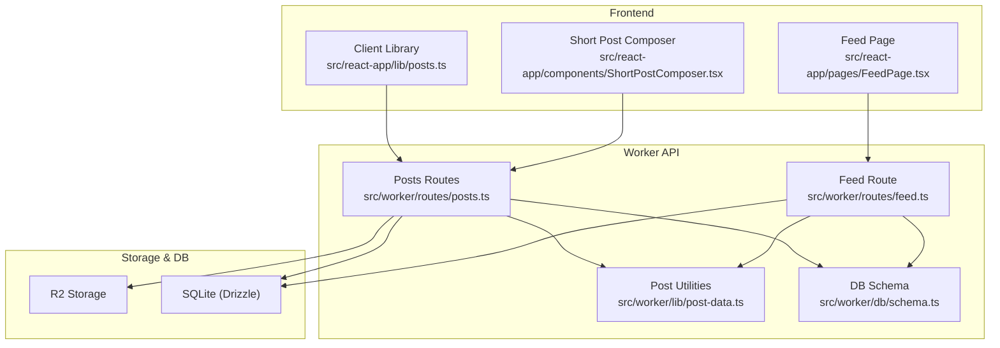
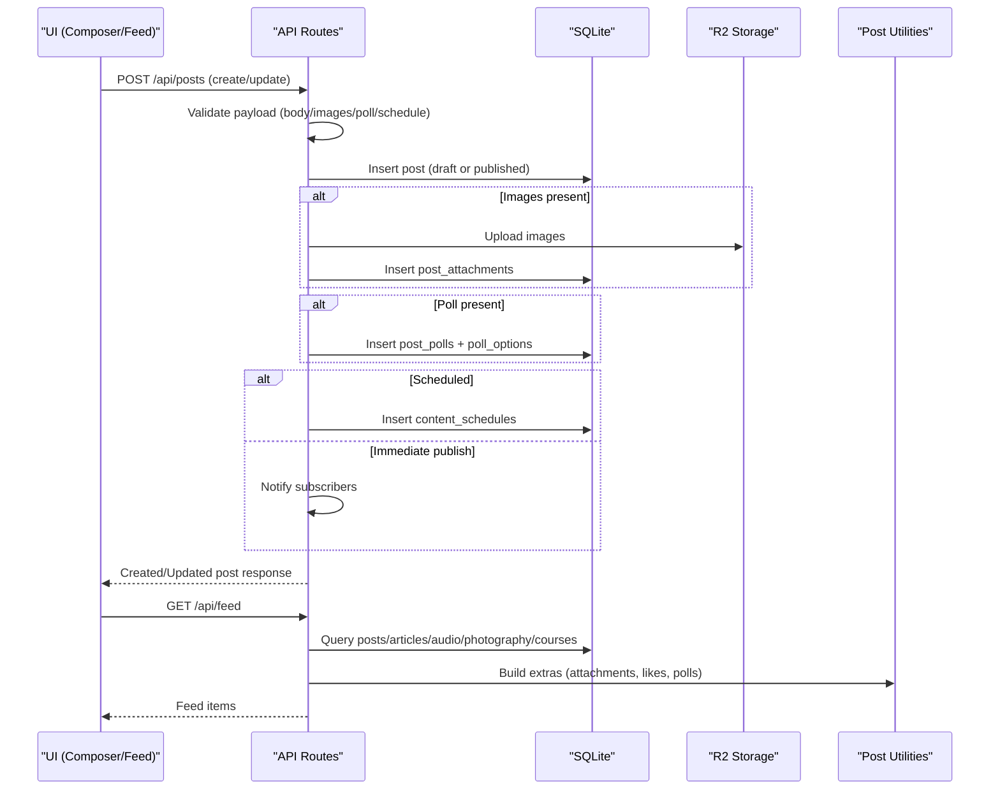
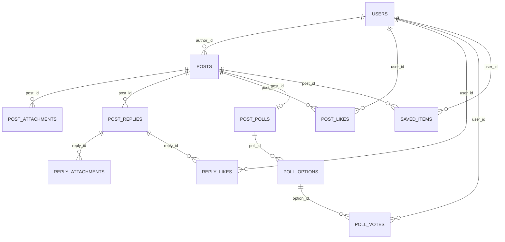
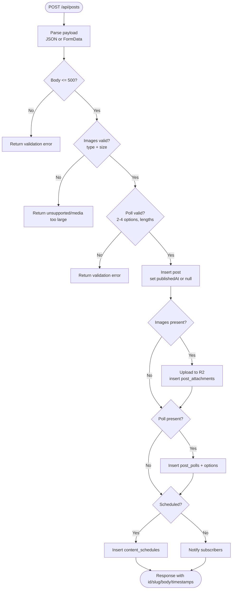
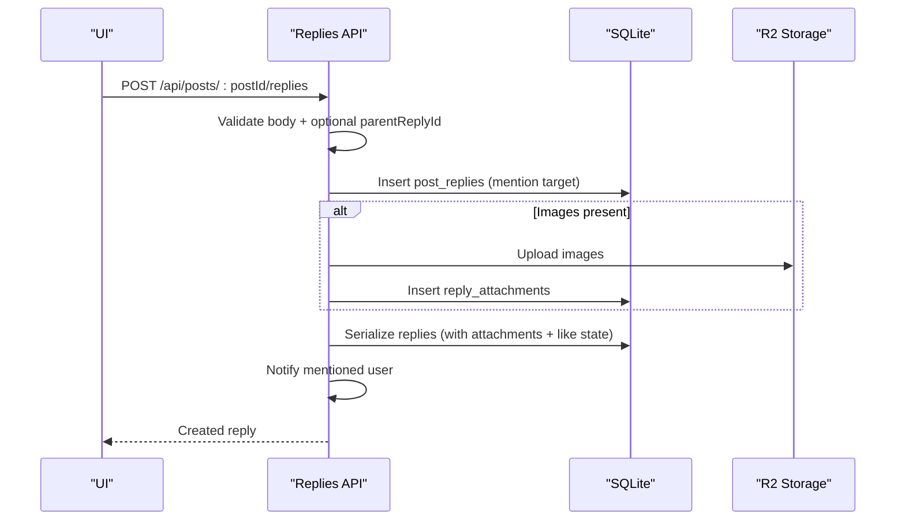
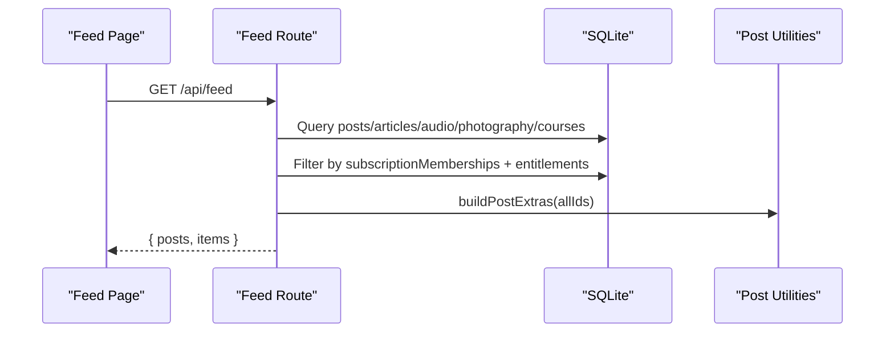
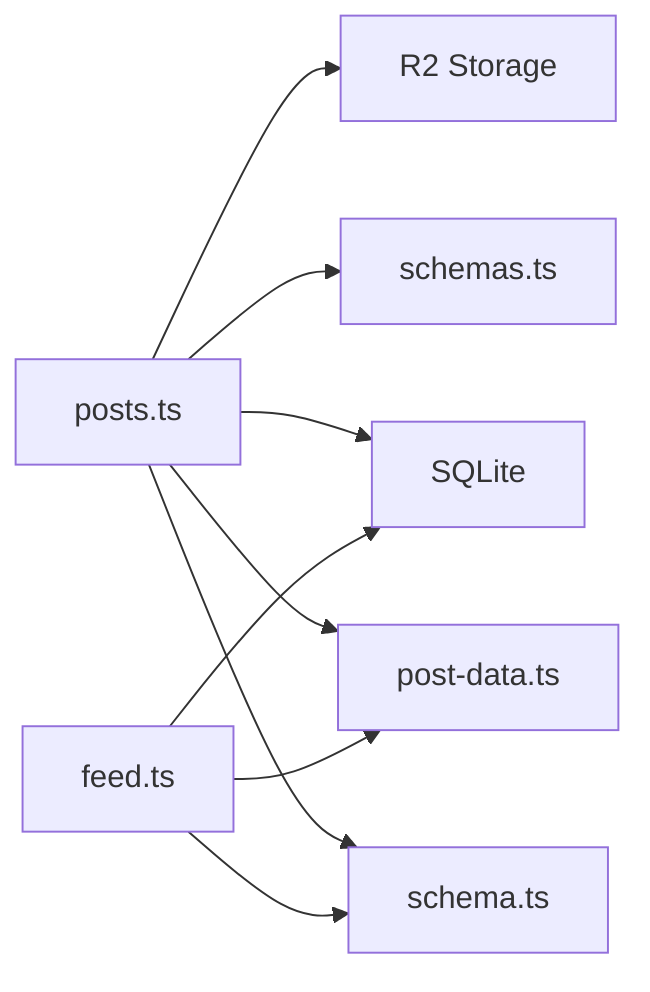

# Posts System

<cite>
**Referenced Files in This Document**
- [posts.ts](file://src/worker/routes/posts.ts)
- [feed.ts](file://src/worker/routes/feed.ts)
- [schema.ts](file://src/worker/db/schema.ts)
- [post-data.ts](file://src/worker/lib/post-data.ts)
- [schemas.ts](file://src/worker/lib/schemas.ts)
- [0004_feed_interactions.sql](file://drizzle/0004_feed_interactions.sql)
- [0012_threaded_discussions.sql](file://drizzle/0012_threaded_discussions.sql)
- [0013_saved_library.sql](file://drizzle/0013_saved_library.sql)
- [posts.ts (client)](file://src/react-app/lib/posts.ts)
- [ShortPostComposer.tsx](file://src/react-app/components/ShortPostComposer.tsx)
- [FeedPage.tsx](file://src/react-app/pages/FeedPage.tsx)
</cite>

## Table of Contents
1. Introduction
2. Project Structure
3. Core Components
4. Architecture Overview
5. Detailed Component Analysis
6. Dependency Analysis
7. Performance Considerations
8. Troubleshooting Guide
9. Conclusion

## Introduction
This document provides comprehensive documentation for Zenith’s posts system, the core social content type. It covers the complete post lifecycle from creation to publication, including draft management, image uploads with R2 storage integration, poll creation and voting, reply threading, likes, saves, scheduling, moderation workflow, and content discovery through the feed system. It also documents the database schema for posts, post_attachments, post_polls, post_likes, and post_replies tables, along with API endpoints and validation rules.

## Project Structure
The posts system spans server-side routes, data access layer, shared utilities, frontend client libraries, and React components:
- Server routes implement CRUD, media handling, replies, likes, polls, and scheduling.
- Data models are defined via Drizzle ORM and migrations.
- Shared utilities build rich post metadata and handle media URLs.
- Frontend client functions call APIs and manage state.
- UI components provide composer, feed, and detail views.

**Diagram sources**
- [posts.ts](file://src/worker/routes/posts.ts)
- [feed.ts](file://src/worker/routes/feed.ts)
- [post-data.ts](file://src/worker/lib/post-data.ts)
- [schema.ts](file://src/worker/db/schema.ts)

**Section sources**
- [posts.ts](file://src/worker/routes/posts.ts)
- [feed.ts](file://src/worker/routes/feed.ts)
- [schema.ts](file://src/worker/db/schema.ts)
- [post-data.ts](file://src/worker/lib/post-data.ts)

## Core Components
- Post creation and updates support both JSON and multipart/form-data payloads, enabling text, images, and polls.
- Draft management allows editing unpublished posts and deleting drafts.
- Image upload integrates with R2 storage and persists attachment metadata.
- Polls allow creating questions with options and recording votes.
- Reply threading supports nested discussions with mentions and attachments.
- Likes and saves track user interactions.
- Scheduling enables future publication via a scheduler table.
- Feed aggregates posts and related content types for subscribers.

Key responsibilities:
- Validation: body length limits, image constraints, poll option counts and lengths.
- Authorization: creator-only edits, subscriber access checks for private content.
- Notifications: on publish, like, and reply events.
- Serialization: building rich post objects with attachments, likes, replies, and polls.

**Section sources**
- [posts.ts](file://src/worker/routes/posts.ts)
- [post-data.ts](file://src/worker/lib/post-data.ts)
- [schemas.ts](file://src/worker/lib/schemas.ts)

## Architecture Overview
The posts system follows a layered architecture:
- Client library and UI components interact with REST endpoints.
- Worker routes enforce authentication, authorization, and validation.
- Data access uses Drizzle ORM against SQLite.
- Media is stored in R2 and served via a secure endpoint that enforces access controls.

**Diagram sources**
- [posts.ts](file://src/worker/routes/posts.ts)
- [feed.ts](file://src/worker/routes/feed.ts)
- [post-data.ts](file://src/worker/lib/post-data.ts)

## Detailed Component Analysis

### Database Schema
Core tables and relationships:
- posts: stores kind, slug, body, moderation status, timestamps, author reference.
- post_attachments: stores per-post media metadata and R2 keys.
- post_replies: threaded replies with parent references, mentions, moderation fields.
- reply_attachments: per-reply media metadata and R2 keys.
- post_likes: many-to-many between users and posts.
- reply_likes: many-to-many between users and replies.
- post_polls: one poll per post with question and optional close time.
- poll_options: ordered options for each poll.
- poll_votes: records user votes per poll with upsert behavior.
- saved_items: tracks user saves for posts.

**Diagram sources**
- [schema.ts](file://src/worker/db/schema.ts)
- [0004_feed_interactions.sql](file://drizzle/0004_feed_interactions.sql)
- [0012_threaded_discussions.sql](file://drizzle/0012_threaded_discussions.sql)
- [0013_saved_library.sql](file://drizzle/0013_saved_library.sql)

**Section sources**
- [schema.ts](file://src/worker/db/schema.ts)
- [0004_feed_interactions.sql](file://drizzle/0004_feed_interactions.sql)
- [0012_threaded_discussions.sql](file://drizzle/0012_threaded_discussions.sql)
- [0013_saved_library.sql](file://drizzle/0013_saved_library.sql)

### API Endpoints and Workflows

#### Create Post
- Endpoint: POST /api/posts
- Supports JSON and multipart/form-data.
- Validates body length (max 500), images (type and size), poll options (2–4, max 80 chars each).
- Creates post; if no schedule provided, publishes immediately; otherwise inserts schedule.
- Uploads images to R2 and persists attachments.
- Inserts poll and options when provided.
- Notifies subscribers upon immediate publish.

**Diagram sources**
- [posts.ts](file://src/worker/routes/posts.ts)
- [post-data.ts](file://src/worker/lib/post-data.ts)
- [schemas.ts](file://src/worker/lib/schemas.ts)

**Section sources**
- [posts.ts](file://src/worker/routes/posts.ts)
- [schemas.ts](file://src/worker/lib/schemas.ts)

#### Update Draft Post
- Endpoint: PATCH /api/posts/:postId
- Only allowed for unpublished posts owned by the creator.
- Supports removing existing attachments and adding new ones.
- Replaces poll entirely when provided.
- Prevents edits while processing scheduled publish.

**Section sources**
- [posts.ts](file://src/worker/routes/posts.ts)

#### Delete Draft Post
- Endpoint: DELETE /api/posts/:postId
- Deletes post and associated attachments from R2.

**Section sources**
- [posts.ts](file://src/worker/routes/posts.ts)

#### Get Post by Slug
- Endpoint: GET /api/posts/by-slug/:username/:slug
- Returns post details and replies for authorized viewers.

**Section sources**
- [posts.ts](file://src/worker/routes/posts.ts)

#### Replies
- List replies: GET /api/posts/:postId/replies
- Create reply: POST /api/posts/:postId/replies
  - Supports JSON and multipart/form-data.
  - Body length 1–2000 characters.
  - Optional parentReplyId for threading.
  - Mentions target (post author or parent reply author).
  - Attachments uploaded to R2 and persisted.
  - Notifies mentioned user.
- Edit reply: PATCH /api/replies/:replyId
- Delete reply: DELETE /api/replies/:replyId
  - Soft delete by clearing body and setting deletedAt.
  - Removes attachments and likes.

**Diagram sources**
- [posts.ts](file://src/worker/routes/posts.ts)

**Section sources**
- [posts.ts](file://src/worker/routes/posts.ts)

#### Likes
- Like post: POST /api/posts/:postId/like
- Unlike post: DELETE /api/posts/:postId/like
- Like reply: POST /api/replies/:replyId/like
- Unlike reply: DELETE /api/replies/:replyId/like
- Idempotent operations using upserts or deletes.

**Section sources**
- [posts.ts](file://src/worker/routes/posts.ts)

#### Polls
- Vote: POST /api/polls/:pollId/vote
  - Validates poll existence and access.
  - Upserts vote (one vote per user per poll).
  - Returns updated poll with vote counts and viewer selection.

**Section sources**
- [posts.ts](file://src/worker/routes/posts.ts)

#### Media Serving
- Endpoint: GET /api/media/:attachmentId
- Serves post or reply attachments after verifying ownership and access.
- Sets appropriate headers and cache control.

**Section sources**
- [posts.ts](file://src/worker/routes/posts.ts)

### Scheduling and Moderation
- Scheduling: When a post includes a future publication time, a record is inserted into content_schedules. The worker will process it later to set publishedAt and notify subscribers.
- Moderation: Posts and replies have moderationStatus fields. Access checks ensure only active content from active accounts is visible. Moderated content cannot be edited until restored.

**Section sources**
- [posts.ts](file://src/worker/routes/posts.ts)
- [schema.ts](file://src/worker/db/schema.ts)

### Content Discovery via Feed
- Endpoint: GET /api/feed
- Aggregates posts, articles, audio, photography, and courses for subscribed creators.
- Applies membership entitlement conditions and filters by moderation and account status.
- Builds post extras (attachments, likes, polls) and returns unified items sorted by published date.

**Diagram sources**
- [feed.ts](file://src/worker/routes/feed.ts)
- [post-data.ts](file://src/worker/lib/post-data.ts)

**Section sources**
- [feed.ts](file://src/worker/routes/feed.ts)
- [post-data.ts](file://src/worker/lib/post-data.ts)

### Frontend Integration
- Client library exposes functions for feed, post detail, create/update/delete drafts, replies, likes, and polls.
- ShortPostComposer handles form state, image previews, poll configuration, and scheduling UI.
- FeedPage consumes the feed API and renders mixed content types.

**Section sources**
- [posts.ts (client)](file://src/react-app/lib/posts.ts)
- [ShortPostComposer.tsx](file://src/react-app/components/ShortPostComposer.tsx)
- [FeedPage.tsx](file://src/react-app/pages/FeedPage.tsx)

## Dependency Analysis
- postsRoutes depends on schema definitions, validators, and utilities for building post metadata.
- feedRoute depends on schema and post utilities to aggregate and enrich content.
- Both rely on auth middleware and role checks.
- Media serving depends on R2 storage and DB lookups for access control.

**Diagram sources**
- [posts.ts](file://src/worker/routes/posts.ts)
- [feed.ts](file://src/worker/routes/feed.ts)
- [schema.ts](file://src/worker/db/schema.ts)
- [post-data.ts](file://src/worker/lib/post-data.ts)

**Section sources**
- [posts.ts](file://src/worker/routes/posts.ts)
- [feed.ts](file://src/worker/routes/feed.ts)
- [schema.ts](file://src/worker/db/schema.ts)
- [post-data.ts](file://src/worker/lib/post-data.ts)

## Performance Considerations
- Batch operations: Use DB batch for deletions and updates where possible to reduce round trips.
- Parallel queries: Aggregate attachments, likes, polls, and reply states in parallel to minimize latency.
- Indexing: Ensure indexes on frequently queried columns (e.g., post_id, display_order, moderation_status, created_at).
- Caching: Set short cache-control headers for media to balance freshness and performance.
- Pagination: Limit feed results to avoid large payloads.

[No sources needed since this section provides general guidance]

## Troubleshooting Guide
Common issues and resolutions:
- Validation errors: Check body length (<=500), image types (JPEG/PNG/WebP), image size (<=5 MB), poll options (2–4, <=80 chars each).
- Scheduling too soon: Ensure scheduled time is at least one minute in the future.
- Access denied: Verify post is published, moderation status is active, and user has creator access or is the author.
- Media not found: Confirm attachment exists and post is accessible; check R2 key validity.
- Reply deletion cleanup: If attachment cleanup fails, logs indicate failure; reattempt deletion or verify permissions.

**Section sources**
- [posts.ts](file://src/worker/routes/posts.ts)
- [schemas.ts](file://src/worker/lib/schemas.ts)

## Conclusion
Zenith’s posts system provides a robust foundation for social content with comprehensive features: rich media uploads, interactive polls, threaded replies, likes and saves, scheduling, and moderated visibility. The architecture leverages clear separation of concerns, strong validation, and efficient data access patterns. The feed system unifies multiple content types for subscribers, ensuring a cohesive user experience.

[No sources needed since this section summarizes without analyzing specific files]