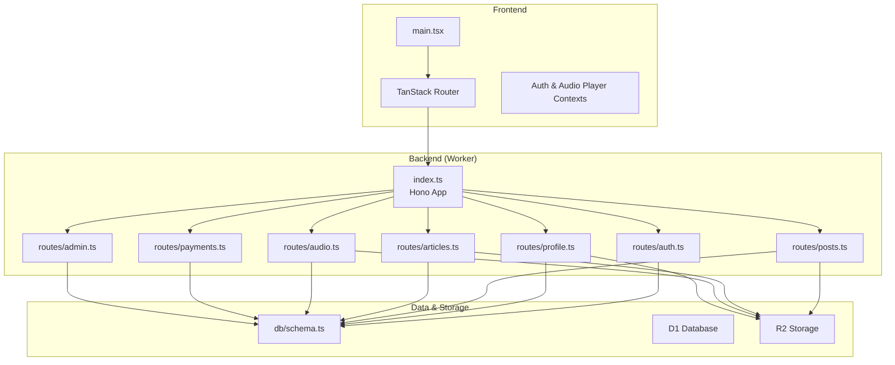
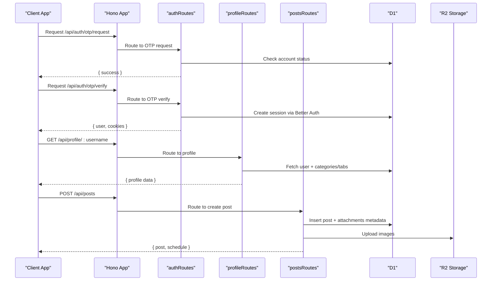
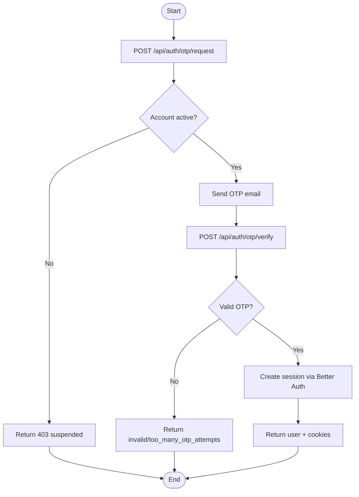
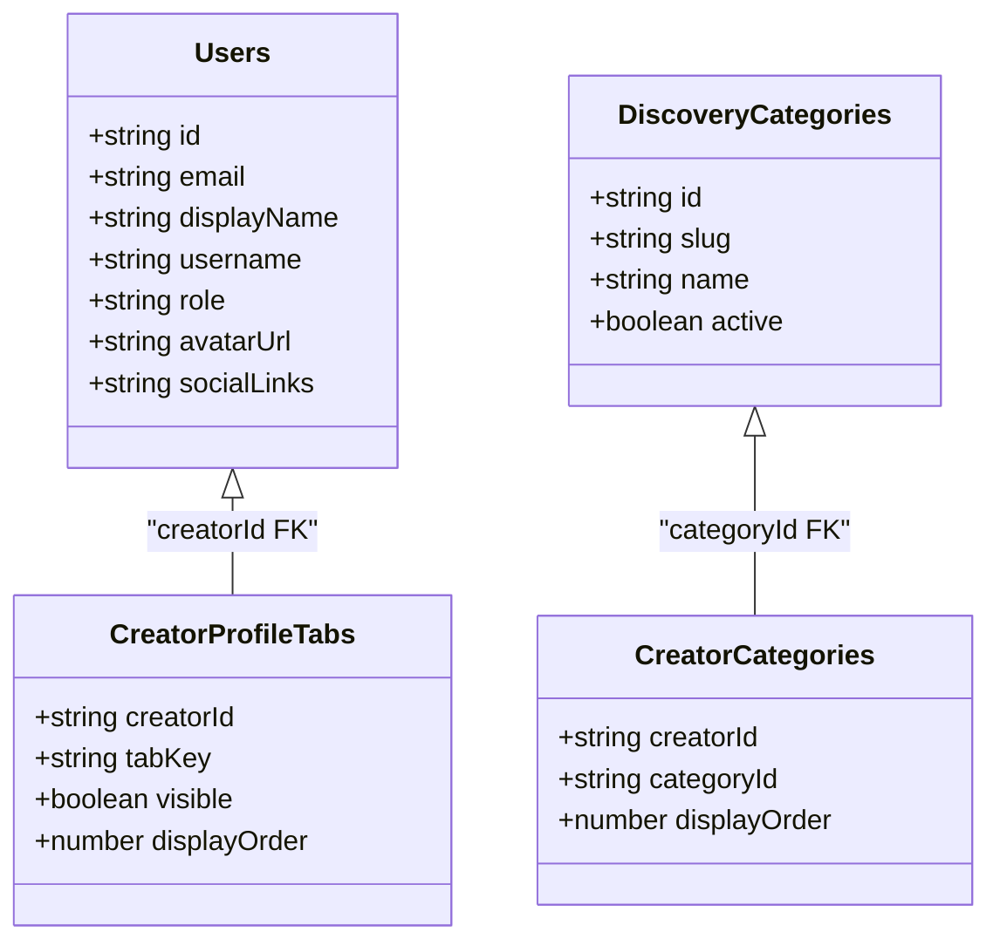
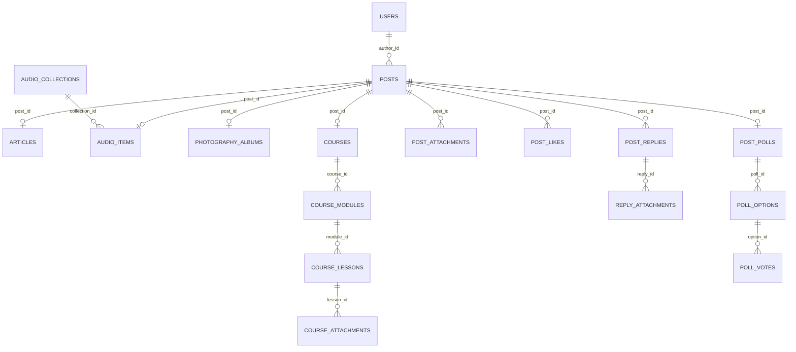
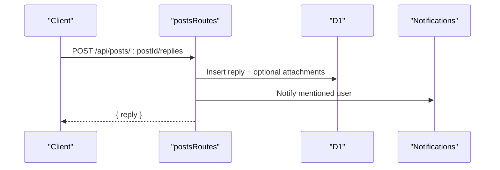
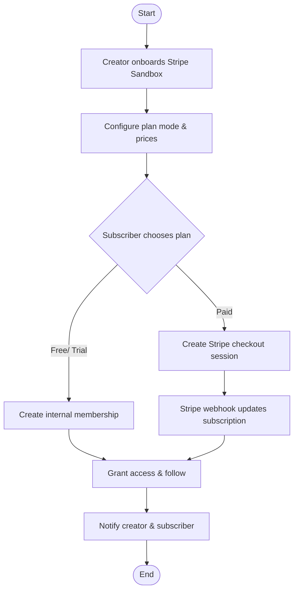
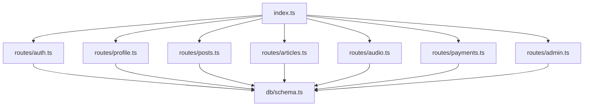

# Core Features

<cite>
**Referenced Files in This Document**
- [package.json](file://package.json)
- [src/worker/index.ts](file://src/worker/index.ts)
- [src/react-app/main.tsx](file://src/react-app/main.tsx)
- [drizzle.config.ts](file://drizzle.config.ts)
- [src/worker/db/schema.ts](file://src/worker/db/schema.ts)
- [src/worker/routes/auth.ts](file://src/worker/routes/auth.ts)
- [src/worker/routes/profile.ts](file://src/worker/routes/profile.ts)
- [src/worker/routes/posts.ts](file://src/worker/routes/posts.ts)
- [src/worker/routes/articles.ts](file://src/worker/routes/articles.ts)
- [src/worker/routes/audio.ts](file://src/worker/routes/audio.ts)
- [src/worker/routes/payments.ts](file://src/worker/routes/payments.ts)
- [src/worker/routes/admin.ts](file://src/worker/routes/admin.ts)
</cite>

## Table of Contents
1. Introduction
2. Project Structure
3. Core Components
4. Architecture Overview
5. Detailed Component Analysis
6. Dependency Analysis
7. Performance Considerations
8. Troubleshooting Guide
9. Conclusion

## Introduction
Zenith is a full-stack creator network application built on Cloudflare Workers with Hono, Drizzle ORM, and React. It provides user management with email-based authentication, a multi-format content management system (posts, articles, audio collections, photography albums, courses), social features (following, likes, replies, polls), monetization via Stripe integration, and comprehensive administration capabilities. The system integrates tightly across API routes, background scheduling, storage (R2), and database (D1) to deliver a cohesive creator experience.

## Project Structure
The project is organized into:
- Frontend (React app): UI components, pages, routing, context providers, and TanStack Query client.
- Backend (Cloudflare Worker): Hono app with modular route handlers for each feature area, middleware for auth and admin, shared libraries for payments, notifications, moderation, and scheduling.
- Database schema and migrations: Drizzle schema and migration files defining all entities and relationships.
- Configuration: Wrangler configuration, Drizzle config, and environment setup.



**Diagram sources**
- [src/react-app/main.tsx:1-38](file://src/react-app/main.tsx#L1-L38)
- [src/worker/index.ts:1-71](file://src/worker/index.ts#L1-L71)
- [src/worker/db/schema.ts:1-978](file://src/worker/db/schema.ts#L1-L978)

**Section sources**
- [package.json:1-98](file://package.json#L1-L98)
- [src/react-app/main.tsx:1-38](file://src/react-app/main.tsx#L1-L38)
- [src/worker/index.ts:1-71](file://src/worker/index.ts#L1-L71)
- [drizzle.config.ts:1-14](file://drizzle.config.ts#L1-L14)

## Core Components
- Authentication: Email OTP sign-in flow with session handling and profile retrieval.
- Profiles: Public profile endpoints, avatar serving, and creator-specific tabs and categories.
- Content Management: Posts (short-form with images and polls), Articles (markdown with cover), Audio Collections (albums/podcasts with items), Photography Albums (photos with previews/originals), Courses (modules, lessons, attachments).
- Social: Following, likes, threaded replies, saved library, polls/votes.
- Monetization: Creator Stripe sandbox onboarding, plan configuration, subscription checkout, membership entitlement checks.
- Administration: User management, moderation cases, discovery categories, featured creators, audit logs, health overview.

**Section sources**
- [src/worker/routes/auth.ts:1-259](file://src/worker/routes/auth.ts#L1-L259)
- [src/worker/routes/profile.ts:1-329](file://src/worker/routes/profile.ts#L1-L329)
- [src/worker/routes/posts.ts:1-800](file://src/worker/routes/posts.ts#L1-L800)
- [src/worker/routes/articles.ts:1-456](file://src/worker/routes/articles.ts#L1-L456)
- [src/worker/routes/audio.ts:1-800](file://src/worker/routes/audio.ts#L1-L800)
- [src/worker/routes/payments.ts:1-800](file://src/worker/routes/payments.ts#L1-L800)
- [src/worker/routes/admin.ts:1-530](file://src/worker/routes/admin.ts#L1-L530)
- [src/worker/db/schema.ts:1-978](file://src/worker/db/schema.ts#L1-L978)

## Architecture Overview
The backend is a Hono application that mounts feature-specific routers under /api/* paths. Middleware enforces authentication and role-based access. Data persistence uses Drizzle ORM against D1, while media assets are stored in R2. Background scheduled tasks handle content publishing and membership maintenance.



**Diagram sources**
- [src/worker/index.ts:1-71](file://src/worker/index.ts#L1-L71)
- [src/worker/routes/auth.ts:1-259](file://src/worker/routes/auth.ts#L1-L259)
- [src/worker/routes/profile.ts:1-329](file://src/worker/routes/profile.ts#L1-L329)
- [src/worker/routes/posts.ts:1-800](file://src/worker/routes/posts.ts#L1-L800)

## Detailed Component Analysis

### User Management and Authentication
- Email OTP sign-in: Requests an OTP, verifies it, and creates a session using Better Auth. Password login/register endpoints are disabled.
- Session and profile: /me returns current user details including admin role; logout clears session.
- Security: Suspended accounts are blocked from OTP flows; rate limiting and error codes are enforced.



**Diagram sources**
- [src/worker/routes/auth.ts:135-212](file://src/worker/routes/auth.ts#L135-L212)

**Section sources**
- [src/worker/routes/auth.ts:1-259](file://src/worker/routes/auth.ts#L1-L259)

### Profiles and Avatars
- Public profile by username includes role, tagline, avatar URL, social links, and categories for creators.
- Avatar endpoint serves images directly from R2 when available.
- Subscription endpoints list subscriptions/subscribers with membership entitlement conditions.



**Diagram sources**
- [src/worker/db/schema.ts:5-32](file://src/worker/db/schema.ts#L5-L32)
- [src/worker/db/schema.ts:46-61](file://src/worker/db/schema.ts#L46-L61)
- [src/worker/db/schema.ts:64-86](file://src/worker/db/schema.ts#L64-L86)

**Section sources**
- [src/worker/routes/profile.ts:1-329](file://src/worker/routes/profile.ts#L1-L329)
- [src/worker/db/schema.ts:5-32](file://src/worker/db/schema.ts#L5-L32)

### Content Management System
- Posts: Short-form posts with image attachments and polls; supports scheduling and moderation; threaded replies with like state.
- Articles: Markdown-based long-form content with cover images; draft/published states; member visibility checks.
- Audio Collections: Albums or podcasts with items (music or podcast episodes); streaming URLs; ordering; cover images.
- Photography Albums: Albums with photos (preview/original), download toggles, and order.
- Courses: Modules and lessons with markdown content and attachments; progress tracking.



**Diagram sources**
- [src/worker/db/schema.ts:168-188](file://src/worker/db/schema.ts#L168-L188)
- [src/worker/db/schema.ts:211-231](file://src/worker/db/schema.ts#L211-L231)
- [src/worker/db/schema.ts:234-291](file://src/worker/db/schema.ts#L234-L291)
- [src/worker/db/schema.ts:294-348](file://src/worker/db/schema.ts#L294-L348)
- [src/worker/db/schema.ts:351-446](file://src/worker/db/schema.ts#L351-L446)
- [src/worker/db/schema.ts:449-507](file://src/worker/db/schema.ts#L449-L507)
- [src/worker/db/schema.ts:509-529](file://src/worker/db/schema.ts#L509-L529)
- [src/worker/db/schema.ts:542-580](file://src/worker/db/schema.ts#L542-L580)

**Section sources**
- [src/worker/routes/posts.ts:1-800](file://src/worker/routes/posts.ts#L1-L800)
- [src/worker/routes/articles.ts:1-456](file://src/worker/routes/articles.ts#L1-L456)
- [src/worker/routes/audio.ts:1-800](file://src/worker/routes/audio.ts#L1-L800)
- [src/worker/db/schema.ts:168-446](file://src/worker/db/schema.ts#L168-L446)

### Social Features
- Following: Follow/unfollow relationships tracked in follows table.
- Likes: Post and reply likes with viewer state.
- Replies: Threaded replies with mentions, moderation, and attachment support.
- Polls: Poll creation, options, voting, and closure.
- Saved Library: Save/unsave posts per user.



**Diagram sources**
- [src/worker/routes/posts.ts:695-775](file://src/worker/routes/posts.ts#L695-L775)

**Section sources**
- [src/worker/db/schema.ts:466-580](file://src/worker/db/schema.ts#L466-L580)
- [src/worker/routes/posts.ts:695-775](file://src/worker/routes/posts.ts#L695-L775)

### Monetization System with Stripe Integration
- Creator payment account onboarding: Connect Stripe Sandbox, retrieve dashboard link.
- Plan configuration: Enable free permanent/trial or paid modes; manage prices monthly/yearly.
- Subscriptions: Subscribe to creators via internal (free/trial) or Stripe checkout; membership entitlement checks.
- Webhooks: Process Stripe events to update subscription statuses and notify users.



**Diagram sources**
- [src/worker/routes/payments.ts:260-333](file://src/worker/routes/payments.ts#L260-L333)
- [src/worker/routes/payments.ts:337-536](file://src/worker/routes/payments.ts#L337-L536)
- [src/worker/routes/payments.ts:540-800](file://src/worker/routes/payments.ts#L540-L800)

**Section sources**
- [src/worker/routes/payments.ts:1-800](file://src/worker/routes/payments.ts#L1-L800)
- [src/worker/db/schema.ts:669-800](file://src/worker/db/schema.ts#L669-L800)

### Administration Capabilities
- Overview and health: Aggregated metrics for users, content, reports, schedules, webhooks, and Stripe sandbox configuration.
- Creator applications: Approve/reject applications, view documents, audit actions.
- Moderation: Assign and resolve cases, hide/restore content, suspend/restore users.
- Discovery: Manage categories, order, and featured creators.
- Audit log: Track administrative actions with reasons and metadata.

```mermaid
classDiagram
class AdminMemberships {
+string userId
+string role
+string grantedBy
}
class ModerationCases {
+string id
+string targetType
+string targetId
+string status
+string assignedAdminId
}
class ContentReports {
+string id
+string caseId
+string reporterId
+string reason
}
class AdminAuditLogs {
+string id
+string actorId
+string action
+string targetType
+string targetId
+string reason
}
ModerationCases ||--o{ ContentReports : case_id
AdminAuditLogs --> Users : actor_id
```

**Diagram sources**
- [src/worker/db/schema.ts:35-43](file://src/worker/db/schema.ts#L35-L43)
- [src/worker/db/schema.ts:626-667](file://src/worker/db/schema.ts#L626-L667)

**Section sources**
- [src/worker/routes/admin.ts:1-530](file://src/worker/routes/admin.ts#L1-L530)
- [src/worker/db/schema.ts:35-43](file://src/worker/db/schema.ts#L35-L43)
- [src/worker/db/schema.ts:626-667](file://src/worker/db/schema.ts#L626-L667)

## Dependency Analysis
- Hono app mounts feature routers under /api/* paths.
- Middleware enforces authentication and role checks.
- Shared libraries provide utilities for payments, notifications, moderation, scheduling, and schemas.
- Database schema defines relationships across users, content, social interactions, memberships, and admin structures.



**Diagram sources**
- [src/worker/index.ts:1-71](file://src/worker/index.ts#L1-L71)
- [src/worker/db/schema.ts:1-978](file://src/worker/db/schema.ts#L1-L978)

**Section sources**
- [src/worker/index.ts:1-71](file://src/worker/index.ts#L1-L71)
- [src/worker/db/schema.ts:1-978](file://src/worker/db/schema.ts#L1-L978)

## Performance Considerations
- Use batch operations for multiple writes (e.g., creating posts with attachments and polls).
- Leverage indexes defined in schema for frequent queries (e.g., moderation status, creator published content).
- Avoid unnecessary joins; fetch extras in parallel where possible.
- Stream large media via R2 and avoid loading entire files into memory.
- Schedule background tasks for heavy processing (publishing, membership maintenance).

[No sources needed since this section provides general guidance]

## Troubleshooting Guide
- Authentication failures: Check OTP validity, account suspension status, and session cookies.
- Media upload errors: Validate file types and sizes; ensure R2 permissions and keys.
- Payment issues: Verify Stripe sandbox configuration, connected account status, and webhook processing.
- Moderation blocks: Ensure content is not hidden or author account suspended before editing/publishing.
- Scheduling conflicts: Prevent edits during processing; check nextAttemptAt and attemptCount.

**Section sources**
- [src/worker/routes/auth.ts:135-212](file://src/worker/routes/auth.ts#L135-L212)
- [src/worker/routes/posts.ts:419-542](file://src/worker/routes/posts.ts#L419-L542)
- [src/worker/routes/articles.ts:215-331](file://src/worker/routes/articles.ts#L215-L331)
- [src/worker/routes/audio.ts:511-735](file://src/worker/routes/audio.ts#L511-L735)
- [src/worker/routes/payments.ts:260-333](file://src/worker/routes/payments.ts#L260-L333)

## Conclusion
Zenith’s core features are implemented through a modular, secure, and scalable architecture. Each feature area integrates seamlessly with authentication, profiles, content models, social interactions, monetization, and administration. The use of Drizzle ORM, D1, and R2 ensures efficient data and media handling, while Hono middleware and background tasks maintain robustness and performance.

[No sources needed since this section summarizes without analyzing specific files]