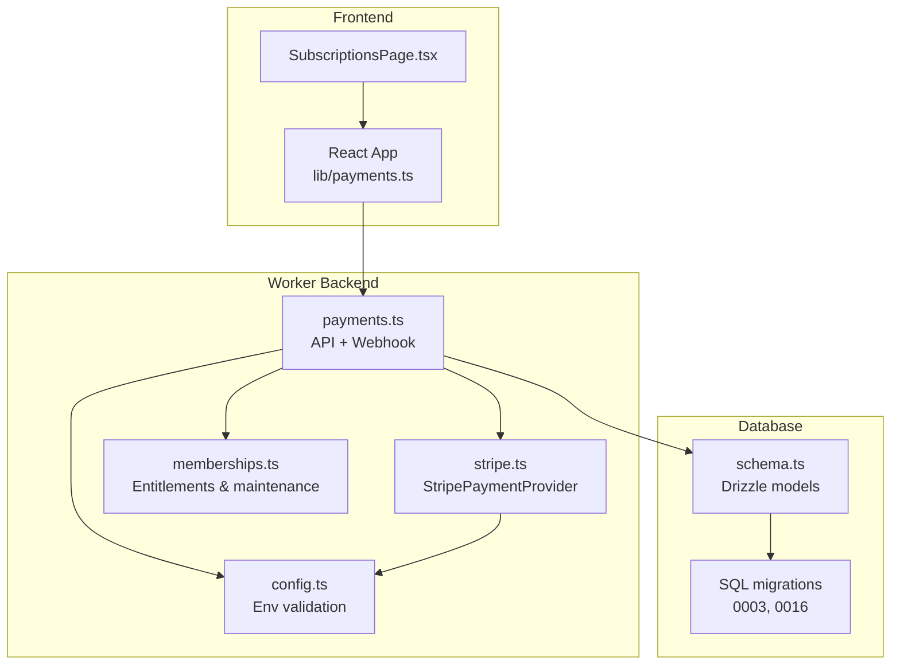
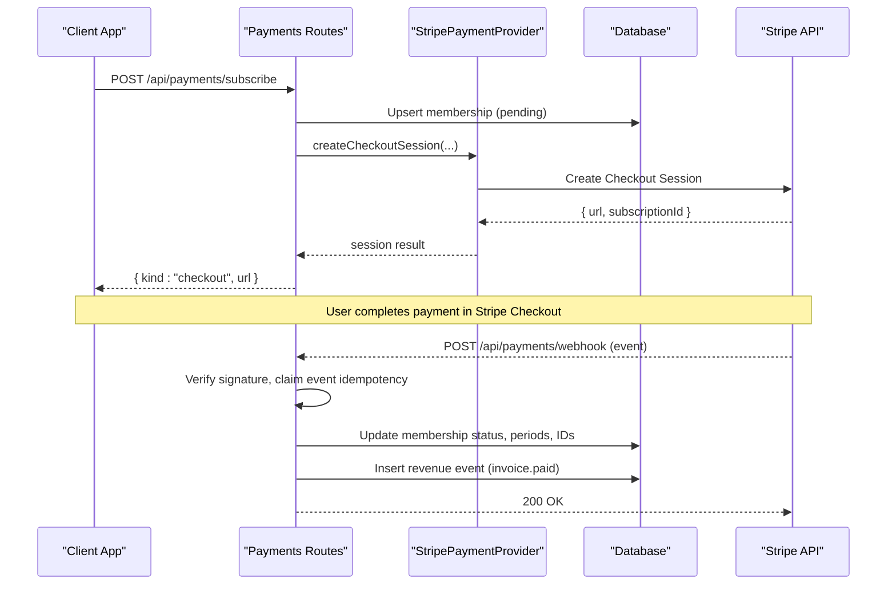
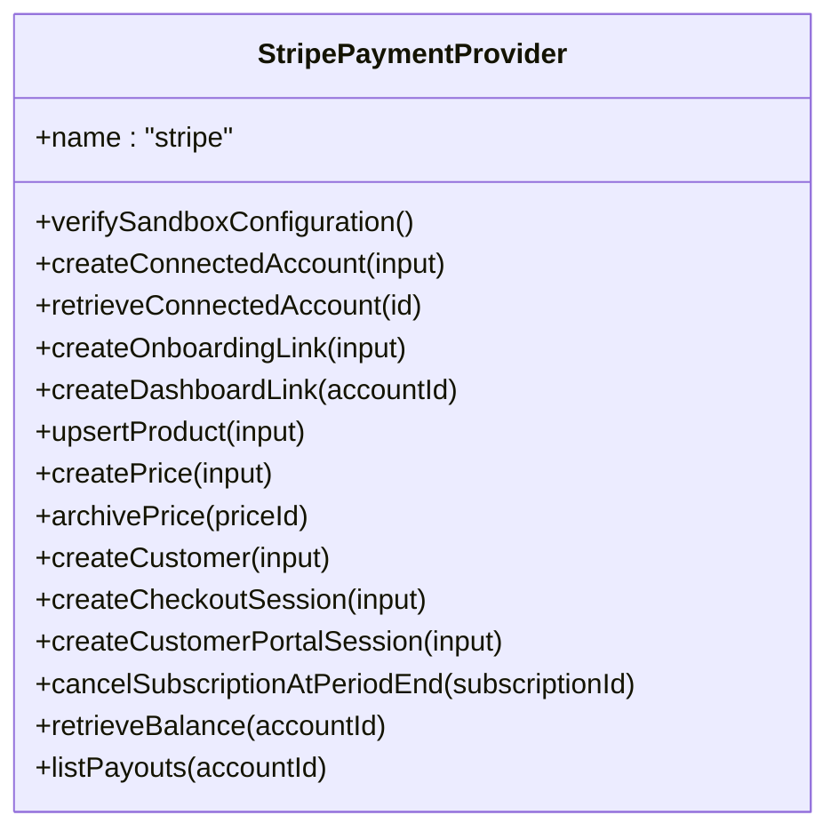
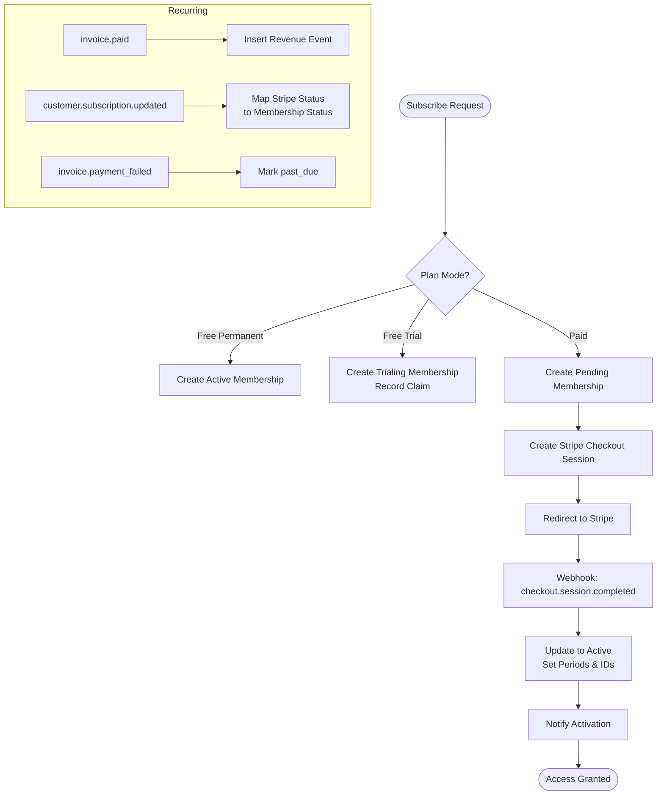
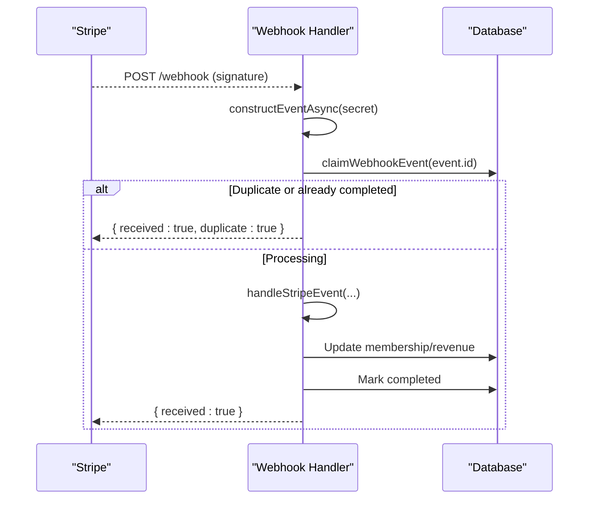
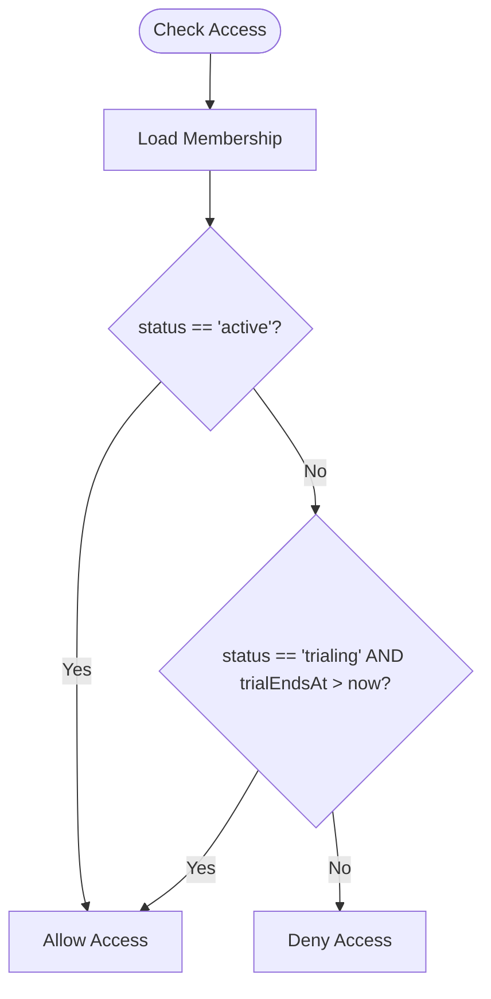
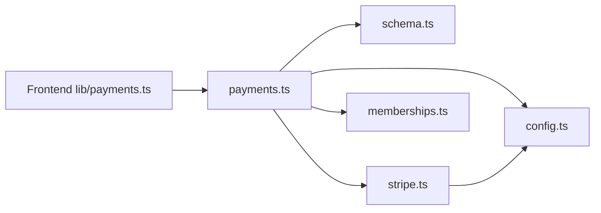

# Monetization System

<cite>
**Referenced Files in This Document**
- [payments.ts](file://src/worker/routes/payments.ts)
- [stripe.ts](file://src/worker/lib/payments/stripe.ts)
- [config.ts](file://src/worker/lib/payments/config.ts)
- [types.ts](file://src/worker/lib/payments/types.ts)
- [memberships.ts](file://src/worker/lib/memberships.ts)
- [schema.ts](file://src/worker/db/schema.ts)
- [0003_creator_subscriptions.sql](file://drizzle/0003_creator_subscriptions.sql)
- [0016_stripe_membership_modes.sql](file://drizzle/0016_stripe_membership_modes.sql)
- [payments.ts (frontend)](file://src/react-app/lib/payments.ts)
- [SubscriptionsPage.tsx](file://src/react-app/pages/SubscriptionsPage.tsx)
</cite>

## Table of Contents
1. [Introduction](#introduction)
2. [Project Structure](#project-structure)
3. [Core Components](#core-components)
4. [Architecture Overview](#architecture-overview)
5. [Detailed Component Analysis](#detailed-component-analysis)
6. [Dependency Analysis](#dependency-analysis)
7. [Performance Considerations](#performance-considerations)
8. [Troubleshooting Guide](#troubleshooting-guide)
9. [Conclusion](#conclusion)
10. [Appendices](#appendices)

## Introduction
This document explains Zenith’s monetization and subscription system, focusing on Stripe integration for payment processing, subscription lifecycle management across membership tiers, revenue tracking and analytics, creator payout handling, and membership mode configuration. It covers API endpoints, webhook handling, access control based on subscription status, database schema, security considerations, and practical examples for setting up plans, processing payments, and managing creator earnings.

## Project Structure
The monetization system spans backend worker routes, a Stripe provider abstraction, shared types, membership utilities, and the database schema. The frontend exposes UI flows to configure plans and manage subscriptions.

**Diagram sources**
- [payments.ts](file://src/worker/routes/payments.ts)
- [stripe.ts](file://src/worker/lib/payments/stripe.ts)
- [config.ts](file://src/worker/lib/payments/config.ts)
- [memberships.ts](file://src/worker/lib/memberships.ts)
- [schema.ts](file://src/worker/db/schema.ts)
- [0003_creator_subscriptions.sql](file://drizzle/0003_creator_subscriptions.sql)
- [0016_stripe_membership_modes.sql](file://drizzle/0016_stripe_membership_modes.sql)
- [payments.ts (frontend)](file://src/react-app/lib/payments.ts)
- [SubscriptionsPage.tsx](file://src/react-app/pages/SubscriptionsPage.tsx)

**Section sources**
- [payments.ts](file://src/worker/routes/payments.ts)
- [stripe.ts](file://src/worker/lib/payments/stripe.ts)
- [config.ts](file://src/worker/lib/payments/config.ts)
- [memberships.ts](file://src/worker/lib/memberships.ts)
- [schema.ts](file://src/worker/db/schema.ts)
- [0003_creator_subscriptions.sql](file://drizzle/0003_creator_subscriptions.sql)
- [0016_stripe_membership_modes.sql](file://drizzle/0016_stripe_membership_modes.sql)
- [payments.ts (frontend)](file://src/react-app/lib/payments.ts)
- [SubscriptionsPage.tsx](file://src/react-app/pages/SubscriptionsPage.tsx)

## Core Components
- Stripe Payment Provider: Encapsulates all Stripe operations including account creation, product/price management, checkout sessions, portal sessions, balance retrieval, payouts listing, and subscription cancellation at period end.
- Payments Routes: Expose REST endpoints for creator onboarding, plan management, subscription options, subscribe, billing portal, cancel free memberships, analytics, and Stripe webhooks.
- Membership Utilities: Provide entitlement checks, trial expiration, and background job processing for plan transitions.
- Database Schema: Defines tables for creator accounts, plans, prices, customers, memberships, revenue events, webhook events, and transition jobs.

Key responsibilities:
- Validate environment and enforce sandbox-only usage.
- Orchestrate Stripe Checkout for paid subscriptions.
- Persist membership state and reconcile via webhooks.
- Track revenue and compute analytics.
- Manage creator payout readiness and display balances/payouts.

**Section sources**
- [stripe.ts](file://src/worker/lib/payments/stripe.ts)
- [payments.ts](file://src/worker/routes/payments.ts)
- [memberships.ts](file://src/worker/lib/memberships.ts)
- [schema.ts](file://src/worker/db/schema.ts)

## Architecture Overview
The system uses a layered architecture with clear separation between API routes, provider abstraction, and persistence.

**Diagram sources**
- [payments.ts](file://src/worker/routes/payments.ts)
- [stripe.ts](file://src/worker/lib/payments/stripe.ts)

## Detailed Component Analysis

### Stripe Integration
- Configuration enforcement ensures only sandbox keys are accepted and validates expected account ID and webhook secret.
- Account lifecycle:
  - Create Express connected account for creators.
  - Generate onboarding links and dashboard login links.
- Product and price management:
  - Upsert products per plan revision.
  - Create monthly/yearly prices with metadata linking back to plan and interval.
  - Archive outdated prices when plan changes.
- Checkout flow:
  - Create customer if missing.
  - Build subscription checkout session with platform fee percent and transfer destination.
- Billing portal:
  - Create portal session for subscribers to manage payment methods and cancel subscriptions.
- Balance and payouts:
  - Retrieve connected balance and list recent payouts.
- Subscription cancellation:
  - Schedule cancellation at period end via provider call.

**Diagram sources**
- [stripe.ts](file://src/worker/lib/payments/stripe.ts)

**Section sources**
- [config.ts](file://src/worker/lib/payments/config.ts)
- [stripe.ts](file://src/worker/lib/payments/stripe.ts)

### Payments API Endpoints
- Creator payment account:
  - GET /api/payments/creator/account
  - POST /api/payments/creator/onboarding
  - POST /api/payments/creator/dashboard-link
- Plan management:
  - GET /api/payments/creator/plan
  - PUT /api/payments/creator/plan
- Subscription actions:
  - GET /api/payments/profile/:username/options
  - POST /api/payments/subscribe
  - POST /api/payments/portal
  - DELETE /api/payments/memberships/:creatorId
- Analytics:
  - GET /api/payments/creator/analytics
- Webhook:
  - POST /api/payments/webhook

Behavior highlights:
- Mode gating: Paid mode requires fully onboarded creator account; otherwise returns setup-required error.
- Free modes: Instant membership activation or trialing with one-time claim.
- Paid mode: Creates pending membership, redirects to Stripe Checkout, updates via webhook.
- Portal: Redirects to Stripe Billing Portal for paid members to manage subscriptions.
- Cancellation: Free/trial memberships can be canceled directly; paid must use portal.

**Section sources**
- [payments.ts](file://src/worker/routes/payments.ts)

### Subscription Lifecycle
- Signup:
  - Free permanent: Immediate active membership.
  - Free trial: Trialing with trial end timestamp; one-time claim enforced.
  - Paid: Pending membership created; redirect to Stripe Checkout.
- Payment completion:
  - Webhook updates membership to active, sets provider IDs and periods, follows creator, sends notifications.
- Recurring billing:
  - Invoice.paid events record revenue events with gross/net amounts and platform fees.
- Status changes:
  - Subscription.updated maps to membership status transitions; notifies on non-trivial changes.
- Failure handling:
  - invoice.payment_failed marks membership past_due and notifies.
- Cancellation:
  - At period end via transition job; updates cancelAt timestamps.

**Diagram sources**
- [payments.ts](file://src/worker/routes/payments.ts)
- [memberships.ts](file://src/worker/lib/memberships.ts)

**Section sources**
- [payments.ts](file://src/worker/routes/payments.ts)
- [memberships.ts](file://src/worker/lib/memberships.ts)

### Webhook Handling
- Signature verification using Stripe SDK with configured webhook secret.
- Idempotency via unique event ID and claim mechanism; supports reprocessing stale claims.
- Event routing:
  - Checkout completed/expired: update membership status and follow relationships.
  - Subscription created/updated/deleted: map statuses, set periods, schedule cancellations.
  - Invoice paid/failed: record revenue or mark past_due.
- Error handling:
  - Failed processing recorded with lastError and attempts; retries supported by claim logic.

**Diagram sources**
- [payments.ts](file://src/worker/routes/payments.ts)
- [stripe.ts](file://src/worker/lib/payments/stripe.ts)

**Section sources**
- [payments.ts](file://src/worker/routes/payments.ts)

### Access Control Based on Subscription Status
- Entitlement check:
  - Active memberships grant access.
  - Trialing memberships grant access until trialEndsAt expires.
- SQL helpers provide efficient filtering for queries that require active or valid trial access.
- Background process expires due trials and transitions scheduled cancellations.

**Diagram sources**
- [memberships.ts](file://src/worker/lib/memberships.ts)

**Section sources**
- [memberships.ts](file://src/worker/lib/memberships.ts)

### Revenue Tracking and Analytics
- Revenue events capture gross amount, platform fee, net amount, currency, and occurrence time.
- Creator analytics endpoint aggregates:
  - Connected account status and sandbox flag.
  - Balance and recent payouts from Stripe.
  - Metrics: MRR (monthly recurring revenue), total gross/net, subscriber counts by type.
  - 30-day revenue chart bucketed by UTC date.
  - Subscriber list with paying status derived from entitlement.

**Section sources**
- [payments.ts](file://src/worker/routes/payments.ts)

### Payout Processing for Creators
- Creator payout readiness is determined by connected account snapshot:
  - transfersEnabled, payoutsEnabled, detailsSubmitted.
- Sandbox-only payouts are simulated; live mode is rejected.
- Analytics endpoint retrieves balance and lists recent payouts for display.

**Section sources**
- [stripe.ts](file://src/worker/lib/payments/stripe.ts)
- [payments.ts](file://src/worker/routes/payments.ts)

### Membership Mode Configurations
- Modes: disabled, free_permanent, free_trial, paid.
- Only one mode accepts new members at a time.
- Paid mode requires full Stripe Express onboarding; otherwise blocked.
- Free trial allows configuring trial length; one-time claim per subscriber per creator.
- Frontend enforces mode-specific fields and confirmation before changing active mode.

**Section sources**
- [payments.ts](file://src/worker/routes/payments.ts)
- [SubscriptionsPage.tsx](file://src/react-app/pages/SubscriptionsPage.tsx)

## Dependency Analysis
- Payments routes depend on:
  - Drizzle ORM schema for data access.
  - Stripe provider for external integrations.
  - Membership utilities for entitlement and maintenance.
  - Notification utilities for user alerts.
- Stripe provider depends on environment configuration and Stripe SDK.
- Frontend depends on API client functions and React Query hooks.

**Diagram sources**
- [payments.ts (frontend)](file://src/react-app/lib/payments.ts)
- [payments.ts](file://src/worker/routes/payments.ts)
- [schema.ts](file://src/worker/db/schema.ts)
- [stripe.ts](file://src/worker/lib/payments/stripe.ts)
- [config.ts](file://src/worker/lib/payments/config.ts)
- [memberships.ts](file://src/worker/lib/memberships.ts)

**Section sources**
- [payments.ts](file://src/worker/routes/payments.ts)
- [stripe.ts](file://src/worker/lib/payments/stripe.ts)
- [config.ts](file://src/worker/lib/payments/config.ts)
- [memberships.ts](file://src/worker/lib/memberships.ts)
- [schema.ts](file://src/worker/db/schema.ts)
- [payments.ts (frontend)](file://src/react-app/lib/payments.ts)

## Performance Considerations
- Idempotent webhook processing prevents duplicate updates.
- Batch database operations reduce round trips during plan updates.
- Efficient indexing on frequently queried columns (provider ids, membership ids, occurred_at).
- Reconciliation uses providerEventCreatedAt to avoid race conditions.
- Background maintenance batches expired trials and transition jobs to minimize load spikes.

[No sources needed since this section provides general guidance]

## Troubleshooting Guide
Common issues and resolutions:
- Missing Stripe signature: Ensure webhook endpoint receives stripe-signature header.
- Live events rejected: Only sandbox events are accepted; verify STRIPE_MODE and keys.
- Incomplete creator onboarding: Complete Stripe Express onboarding to enable paid mode.
- Stale checkout sessions: Admin dashboard surfaces stale checkouts; investigate and retry.
- Failed webhook processing: Check lastError and attempts; ensure idempotency and retry logic.

**Section sources**
- [payments.ts](file://src/worker/routes/payments.ts)
- [admin.ts](file://src/worker/routes/admin.ts)

## Conclusion
Zenith’s monetization system integrates Stripe sandbox for secure test-mode payments, manages subscription lifecycles across multiple membership modes, tracks revenue accurately, and supports creator payout visibility. Robust webhook handling, idempotency, and background maintenance ensure reliability. The modular design separates concerns across routes, provider abstraction, and utilities, enabling maintainability and extensibility.

[No sources needed since this section summarizes without analyzing specific files]

## Appendices

### API Endpoints Summary
- Creator account:
  - GET /api/payments/creator/account
  - POST /api/payments/creator/onboarding
  - POST /api/payments/creator/dashboard-link
- Plan:
  - GET /api/payments/creator/plan
  - PUT /api/payments/creator/plan
- Subscription:
  - GET /api/payments/profile/:username/options
  - POST /api/payments/subscribe
  - POST /api/payments/portal
  - DELETE /api/payments/memberships/:creatorId
- Analytics:
  - GET /api/payments/creator/analytics
- Webhook:
  - POST /api/payments/webhook

**Section sources**
- [payments.ts](file://src/worker/routes/payments.ts)

### Database Schema Overview
Key tables:
- creator_payment_accounts: Creator Stripe Express account status and requirements.
- membership_plans: Plan metadata, mode, provider product id, revision.
- membership_plan_prices: Active prices per interval linked to provider price ids.
- payment_customers: Mapping users to Stripe customer ids.
- subscription_memberships: Membership state, provider references, periods, trial info.
- membership_trial_claims: One-time trial claims per creator-subscriber pair.
- membership_plan_transitions: Background jobs for scheduled cancellations.
- revenue_events: Recorded revenue with gross/net and platform fees.
- payment_webhook_events: Idempotency and processing status for webhooks.

**Section sources**
- [schema.ts](file://src/worker/db/schema.ts)
- [0003_creator_subscriptions.sql](file://drizzle/0003_creator_subscriptions.sql)
- [0016_stripe_membership_modes.sql](file://drizzle/0016_stripe_membership_modes.sql)

### Security and Compliance Notes
- Sandbox-only enforcement: Live Stripe keys are rejected; STRIPE_MODE must be test.
- Webhook signature verification using Stripe SDK and configured secret.
- PCI compliance: No raw card data touches the application; Stripe handles payment instruments.
- Fraud prevention: Idempotent webhooks, one-time trial claims, and status reconciliation reduce risks.
- Platform fees: Applied via application_fee_percent in checkout sessions.

**Section sources**
- [config.ts](file://src/worker/lib/payments/config.ts)
- [stripe.ts](file://src/worker/lib/payments/stripe.ts)
- [payments.ts](file://src/worker/routes/payments.ts)

### Examples
- Setting up subscription plans:
  - Use PUT /api/payments/creator/plan to configure mode and prices; ensure creator onboarding is complete for paid mode.
- Processing payments:
  - Call POST /api/payments/subscribe with creatorId and interval; redirect to returned checkout URL.
- Managing creator earnings:
  - Use GET /api/payments/creator/analytics to view balance, payouts, metrics, and subscriber list.

**Section sources**
- [payments.ts](file://src/worker/routes/payments.ts)
- [payments.ts (frontend)](file://src/react-app/lib/payments.ts)