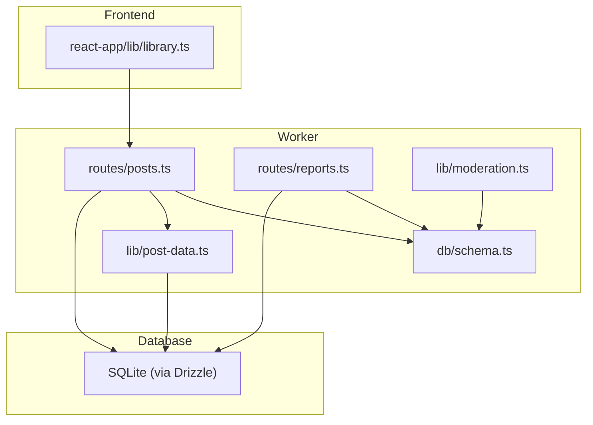
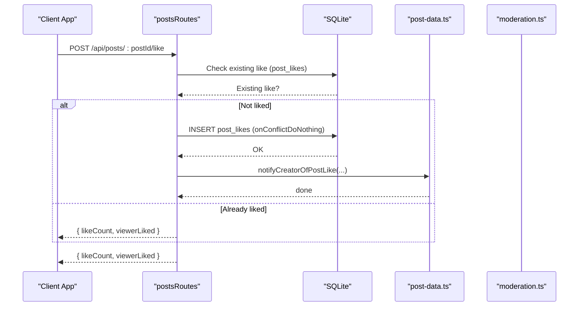
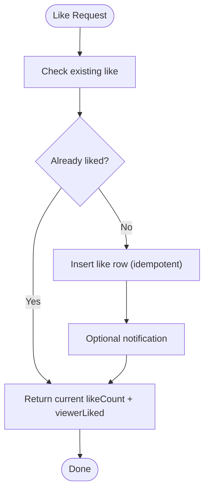
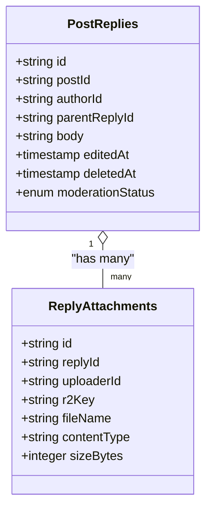
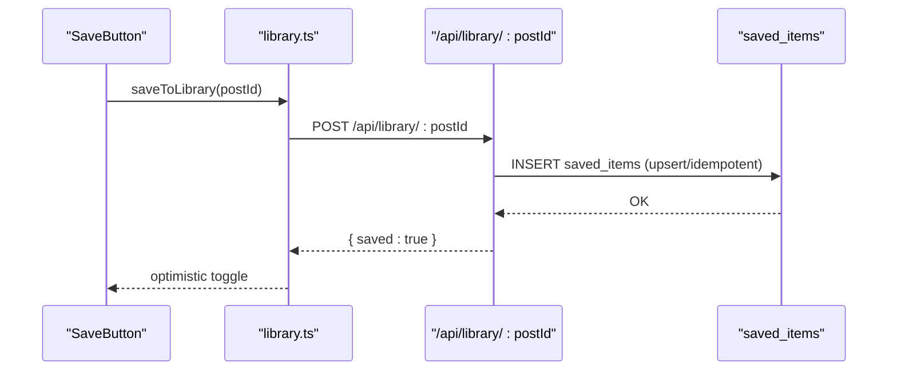
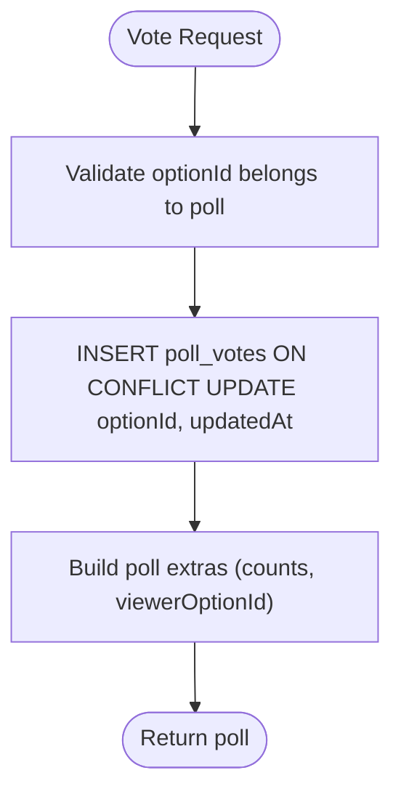
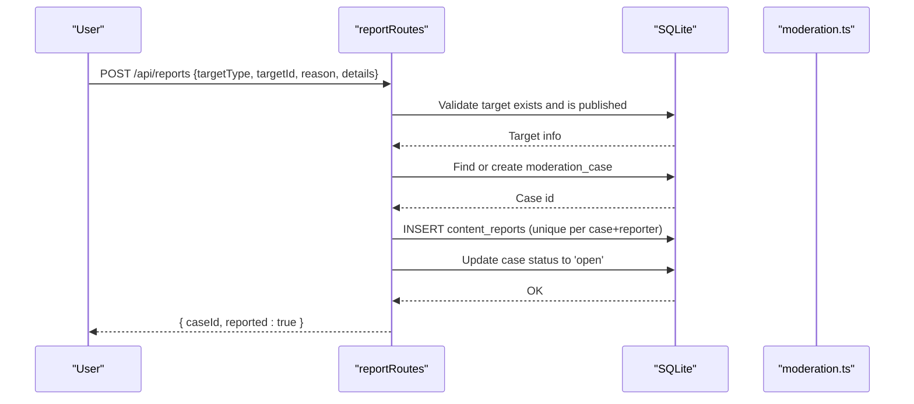
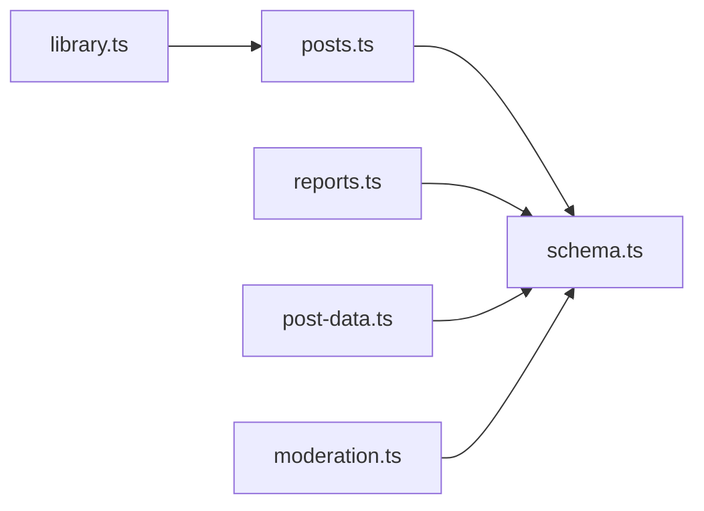

# Content Interactions

<cite>
**Referenced Files in This Document**
- [schema.ts](file://src/worker/db/schema.ts)
- [posts.ts](file://src/worker/routes/posts.ts)
- [reports.ts](file://src/worker/routes/reports.ts)
- [moderation.ts](file://src/worker/lib/moderation.ts)
- [post-data.ts](file://src/worker/lib/post-data.ts)
- [library.ts](file://src/react-app/lib/library.ts)
- [0004_feed_interactions.sql](file://drizzle/0004_feed_interactions.sql)
</cite>

## Table of Contents
1. [Introduction](#introduction)
2. [Project Structure](#project-structure)
3. [Core Components](#core-components)
4. [Architecture Overview](#architecture-overview)
5. [Detailed Component Analysis](#detailed-component-analysis)
6. [Dependency Analysis](#dependency-analysis)
7. [Performance Considerations](#performance-considerations)
8. [Troubleshooting Guide](#troubleshooting-guide)
9. [Conclusion](#conclusion)
10. [Appendices](#appendices)

## Introduction
This document explains Zenith’s content interaction system across posts, articles, audio, photography, and courses. It covers how users like, reply to, save, and share content; the database schema for interactions; transactional handling for atomic operations; real-time count updates; reporting and moderation workflows; API endpoints; error handling for concurrency; spam prevention strategies; relationships with feed ranking and analytics; and bulk operations for content management.

## Project Structure
The interaction system spans:
- Database schema definitions (Drizzle ORM)
- Worker routes implementing APIs for likes, replies, saves, polls, media access, and reports
- Library client utilities for saving/removing items
- Moderation helpers and SQL migrations

**Diagram sources**
- [posts.ts](file://src/worker/routes/posts.ts)
- [reports.ts](file://src/worker/routes/reports.ts)
- [post-data.ts](file://src/worker/lib/post-data.ts)
- [moderation.ts](file://src/worker/lib/moderation.ts)
- [schema.ts](file://src/worker/db/schema.ts)
- [library.ts](file://src/react-app/lib/library.ts)

**Section sources**
- [schema.ts](file://src/worker/db/schema.ts)
- [posts.ts](file://src/worker/routes/posts.ts)
- [reports.ts](file://src/worker/routes/reports.ts)
- [post-data.ts](file://src/worker/lib/post-data.ts)
- [library.ts](file://src/react-app/lib/library.ts)
- [0004_feed_interactions.sql](file://drizzle/0004_feed_interactions.sql)

## Core Components
- Like system: per-post and per-reply like tables with composite primary keys ensuring idempotency.
- Reply system: threaded replies with soft delete and edit timestamps.
- Save system: saved_items linking user to post with timestamp.
- Polls and votes: poll options and per-user vote tracking with upsert behavior.
- Reports and moderation: moderation cases and content reports with status transitions.
- Media access: secure endpoint to serve attachments with authorization checks.

Key behaviors:
- Idempotent interactions via unique constraints and onConflictDoNothing.
- Real-time counts returned from like endpoints.
- Atomic batch writes for report creation and case updates.
- Soft deletes for replies to preserve thread integrity.

**Section sources**
- [schema.ts:509-539](file://src/worker/db/schema.ts#L509-L539)
- [schema.ts:466-507](file://src/worker/db/schema.ts#L466-L507)
- [schema.ts:532-539](file://src/worker/db/schema.ts#L532-L539)
- [schema.ts:542-580](file://src/worker/db/schema.ts#L542-L580)
- [schema.ts:626-653](file://src/worker/db/schema.ts#L626-L653)
- [posts.ts:779-815](file://src/worker/routes/posts.ts#L779-L815)
- [posts.ts:891-917](file://src/worker/routes/posts.ts#L891-L917)
- [posts.ts:921-965](file://src/worker/routes/posts.ts#L921-L965)
- [reports.ts:19-80](file://src/worker/routes/reports.ts#L19-L80)

## Architecture Overview
The interaction flow is request-driven through Hono routes, backed by Drizzle ORM queries against SQLite. Likes and saves are idempotent; replies support threading and soft deletion; reports create or update moderation cases atomically.

**Diagram sources**
- [posts.ts:779-815](file://src/worker/routes/posts.ts#L779-L815)
- [schema.ts:509-518](file://src/worker/db/schema.ts#L509-L518)

## Detailed Component Analysis

### Like System (Posts and Replies)
- Data model:
  - post_likes(post_id, user_id) with composite PK ensures one like per user per post.
  - reply_likes(reply_id, user_id) similarly constrained.
- Endpoints:
  - POST/DELETE /api/posts/:postId/like toggles like state and returns current count and viewerLiked flag.
  - POST/DELETE /api/replies/:replyId/like toggles reply like state and returns current count and viewerLiked flag.
- Concurrency:
  - Uses onConflictDoNothing to handle concurrent like attempts safely.
- Real-time counts:
  - Each response includes likeCount computed via COUNT(*) and viewerLiked via a targeted lookup.

**Diagram sources**
- [posts.ts:779-815](file://src/worker/routes/posts.ts#L779-L815)
- [posts.ts:891-917](file://src/worker/routes/posts.ts#L891-L917)
- [schema.ts:509-529](file://src/worker/db/schema.ts#L509-L529)

**Section sources**
- [schema.ts:509-529](file://src/worker/db/schema.ts#L509-L529)
- [posts.ts:779-815](file://src/worker/routes/posts.ts#L779-L815)
- [posts.ts:891-917](file://src/worker/routes/posts.ts#L891-L917)

### Reply System (Threaded Discussions)
- Data model:
  - post_replies(id, post_id, author_id, parent_reply_id, body, edited_at, deleted_at, moderation fields).
  - reply_attachments for images/media per reply.
- Behavior:
  - Create nested replies via parentReplyId.
  - Edit sets editedAt and updatedAt; soft delete sets deletedAt and clears body.
  - Deleting a reply also removes its attachments and associated likes atomically using batch statements.
- Serialization:
  - Replies are serialized with author info, mentions, attachments, like counts, and viewerLike state.

**Diagram sources**
- [schema.ts:466-507](file://src/worker/db/schema.ts#L466-L507)

**Section sources**
- [schema.ts:466-507](file://src/worker/db/schema.ts#L466-L507)
- [posts.ts:695-775](file://src/worker/routes/posts.ts#L695-L775)
- [posts.ts:819-887](file://src/worker/routes/posts.ts#L819-L887)

### Save System (Library)
- Data model:
  - saved_items(user_id, post_id, saved_at) with composite PK ensures one save per user per post.
- Frontend integration:
  - library.ts exposes saveToLibrary and removeFromLibrary calling /api/library/{postId}.
- Backend behavior:
  - Save adds a row; remove deletes it. Responses indicate saved state.

**Diagram sources**
- [library.ts:63-69](file://src/react-app/lib/library.ts#L63-L69)
- [schema.ts:532-539](file://src/worker/db/schema.ts#L532-L539)

**Section sources**
- [schema.ts:532-539](file://src/worker/db/schema.ts#L532-L539)
- [library.ts:63-69](file://src/react-app/lib/library.ts#L63-L69)

### Polls and Votes
- Data model:
  - post_polls, poll_options, poll_votes with per-user uniqueness and upsert behavior to allow changing votes.
- Endpoint:
  - POST /api/polls/:pollId/vote upserts vote and returns updated poll data including viewerOptionId and totals.

**Diagram sources**
- [schema.ts:542-580](file://src/worker/db/schema.ts#L542-L580)
- [posts.ts:921-965](file://src/worker/routes/posts.ts#L921-L965)

**Section sources**
- [schema.ts:542-580](file://src/worker/db/schema.ts#L542-L580)
- [posts.ts:921-965](file://src/worker/routes/posts.ts#L921-L965)

### Reporting and Moderation Workflow
- Data model:
  - moderation_cases(target_type, target_id, status, assigned_admin_id, resolution fields).
  - content_reports(case_id, reporter_id, reason, details).
- Endpoint:
  - POST /api/reports validates target existence and ownership, creates or reuses a moderation case, records a report, and sets case status to open.
- Moderation helpers:
  - getPostModerationState and isPostMemberVisible check moderation and account statuses.

**Diagram sources**
- [reports.ts:19-80](file://src/worker/routes/reports.ts#L19-L80)
- [schema.ts:626-653](file://src/worker/db/schema.ts#L626-L653)
- [moderation.ts:5-16](file://src/worker/lib/moderation.ts#L5-L16)

**Section sources**
- [reports.ts:19-80](file://src/worker/routes/reports.ts#L19-L80)
- [schema.ts:626-653](file://src/worker/db/schema.ts#L626-L653)
- [moderation.ts:5-16](file://src/worker/lib/moderation.ts#L5-L16)

### Media Access and Authorization
- Endpoint:
  - GET /api/media/:attachmentId serves post or reply attachments after verifying post moderation, author account status, publication, and creator access.
- Security:
  - Enforces moderation and visibility rules before streaming storage content.

**Section sources**
- [posts.ts:969-1027](file://src/worker/routes/posts.ts#L969-L1027)
- [schema.ts:449-463](file://src/worker/db/schema.ts#L449-L463)
- [schema.ts:493-507](file://src/worker/db/schema.ts#L493-L507)

## Dependency Analysis
- Routes depend on schema definitions for table structures and indexes.
- post-data.ts aggregates like counts, reply counts, viewer states, and poll data for efficient serialization.
- Moderation helpers encapsulate visibility logic used across endpoints.
- Frontend library.ts abstracts save/remove calls to backend library endpoints.

**Diagram sources**
- [posts.ts](file://src/worker/routes/posts.ts)
- [reports.ts](file://src/worker/routes/reports.ts)
- [post-data.ts](file://src/worker/lib/post-data.ts)
- [moderation.ts](file://src/worker/lib/moderation.ts)
- [schema.ts](file://src/worker/db/schema.ts)
- [library.ts](file://src/react-app/lib/library.ts)

**Section sources**
- [posts.ts](file://src/worker/routes/posts.ts)
- [reports.ts](file://src/worker/routes/reports.ts)
- [post-data.ts](file://src/worker/lib/post-data.ts)
- [moderation.ts](file://src/worker/lib/moderation.ts)
- [schema.ts](file://src/worker/db/schema.ts)
- [library.ts](file://src/react-app/lib/library.ts)

## Performance Considerations
- Idempotency via composite primary keys avoids duplicate rows and reduces contention.
- Batch operations for deletions and report creation minimize round-trips and ensure consistency.
- Aggregated queries in post-data.ts reduce N+1 issues when serializing lists.
- Indexes on foreign keys and frequently filtered columns (e.g., user_id, post_id, moderation_status) improve query performance.
- Use of onConflictDoNothing prevents expensive conflict resolution paths.

[No sources needed since this section provides general guidance]

## Troubleshooting Guide
Common errors and resolutions:
- 404 Not Found:
  - Target not found or not accessible due to moderation/account status or unpublished content.
  - Verify target existence and visibility rules in getAccessiblePostById and related checks.
- 403 Forbidden:
  - Insufficient permissions (e.g., editing another user’s reply, accessing private content).
  - Ensure correct role and ownership checks.
- 409 Conflict:
  - Duplicate actions such as reporting already-reported content or liking an already-liked item.
  - Idempotent endpoints should return success without side effects.
- 422 Validation Failed:
  - Input validation errors (e.g., invalid JSON, too long text, unsupported media types).
  - Review schema validations and payload formats.
- 413 Payload Too Large:
  - Image upload exceeds maximum size limits.
  - Reduce file size or adjust client-side constraints.
- 415 Unsupported Media Type:
  - Non-image files uploaded where images are expected.
  - Ensure correct content-type and allowed MIME types.

Operational tips:
- For reply deletion, verify batch cleanup of attachments and likes succeeded; log failures if any.
- When reporting, confirm that moderation case creation did not fail due to conflicts.

**Section sources**
- [posts.ts:819-887](file://src/worker/routes/posts.ts#L819-L887)
- [reports.ts:19-80](file://src/worker/routes/reports.ts#L19-L80)
- [posts.ts:779-815](file://src/worker/routes/posts.ts#L779-L815)

## Conclusion
Zenith’s interaction system leverages robust schema design, idempotent operations, and clear authorization flows to deliver reliable likes, replies, saves, and reports. The architecture supports real-time feedback through immediate responses and maintains consistency via atomic batch operations. Moderation integrates seamlessly with visibility controls, ensuring safe and compliant content exposure.

[No sources needed since this section summarizes without analyzing specific files]

## Appendices

### Interaction API Endpoints Summary
- Like/Unlike Posts:
  - POST /api/posts/:postId/like
  - DELETE /api/posts/:postId/like
- Like/Unlike Replies:
  - POST /api/replies/:replyId/like
  - DELETE /api/replies/:replyId/like
- Save/Remove from Library:
  - POST /api/library/:postId
  - DELETE /api/library/:postId
- Vote in Polls:
  - POST /api/polls/:pollId/vote
- Report Content:
  - POST /api/reports
- Access Media:
  - GET /api/media/:attachmentId

**Section sources**
- [posts.ts:779-815](file://src/worker/routes/posts.ts#L779-L815)
- [posts.ts:891-917](file://src/worker/routes/posts.ts#L891-L917)
- [posts.ts:921-965](file://src/worker/routes/posts.ts#L921-L965)
- [reports.ts:19-80](file://src/worker/routes/reports.ts#L19-L80)
- [library.ts:63-69](file://src/react-app/lib/library.ts#L63-L69)
- [posts.ts:969-1027](file://src/worker/routes/posts.ts#L969-L1027)

### Database Schema Highlights
- Like tables:
  - post_likes(post_id, user_id)
  - reply_likes(reply_id, user_id)
- Saved items:
  - saved_items(user_id, post_id, saved_at)
- Replies and attachments:
  - post_replies(...), reply_attachments(...)
- Polls and votes:
  - post_polls, poll_options, poll_votes
- Moderation:
  - moderation_cases(...), content_reports(...)

**Section sources**
- [schema.ts:509-539](file://src/worker/db/schema.ts#L509-L539)
- [schema.ts:466-507](file://src/worker/db/schema.ts#L466-L507)
- [schema.ts:542-580](file://src/worker/db/schema.ts#L542-L580)
- [schema.ts:626-653](file://src/worker/db/schema.ts#L626-L653)
- [0004_feed_interactions.sql:64-84](file://drizzle/0004_feed_interactions.sql#L64-L84)

### Transaction Handling and Atomicity
- Use db.batch for multi-statement operations (e.g., reply deletion with attachment and like cleanup).
- Use onConflictDoNothing for idempotent inserts (likes, reports).
- Upserts for poll votes to allow changing votes without duplicates.

**Section sources**
- [posts.ts:875-886](file://src/worker/routes/posts.ts#L875-L886)
- [posts.ts:779-815](file://src/worker/routes/posts.ts#L779-L815)
- [posts.ts:921-965](file://src/worker/routes/posts.ts#L921-L965)
- [reports.ts:62-77](file://src/worker/routes/reports.ts#L62-L77)

### Spam and Abuse Prevention Strategies
- Rate limiting at the application layer (recommend adding middleware).
- Input validation and length limits for bodies and comments.
- Unique constraints prevent duplicate interactions.
- Moderation workflow flags suspicious content for review.
- Account status checks restrict interactions from suspended accounts.

**Section sources**
- [posts.ts:719-733](file://src/worker/routes/posts.ts#L719-L733)
- [schema.ts:10-14](file://src/worker/db/schema.ts#L10-L14)
- [reports.ts:10-15](file://src/worker/routes/reports.ts#L10-L15)

### Relationship to Feed Ranking and Analytics
- Engagement metrics (likes, replies, saves) can be aggregated to influence feed ranking algorithms.
- Analytics tracking can leverage these interaction tables to compute per-content engagement scores.
- Viewer-specific states (viewerLiked, viewerSaved) enable personalized feeds and recommendations.

[No sources needed since this section provides general guidance]

### Bulk Operations for Content Management
- Delete multiple attachments and related data using batch statements.
- Clear likes and attachments when deleting replies to maintain referential integrity.
- Consider batching notifications and cache invalidations for large-scale updates.

**Section sources**
- [posts.ts:875-886](file://src/worker/routes/posts.ts#L875-L886)