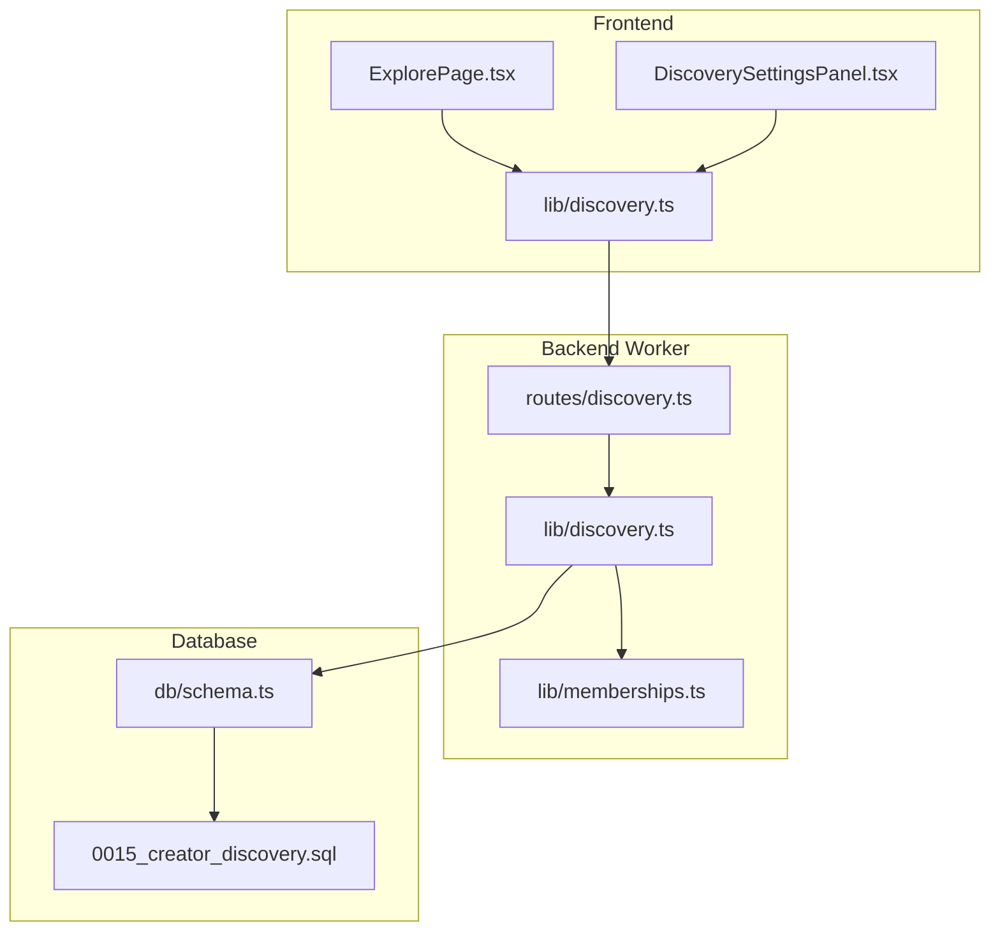
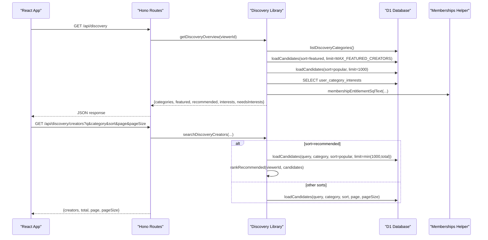
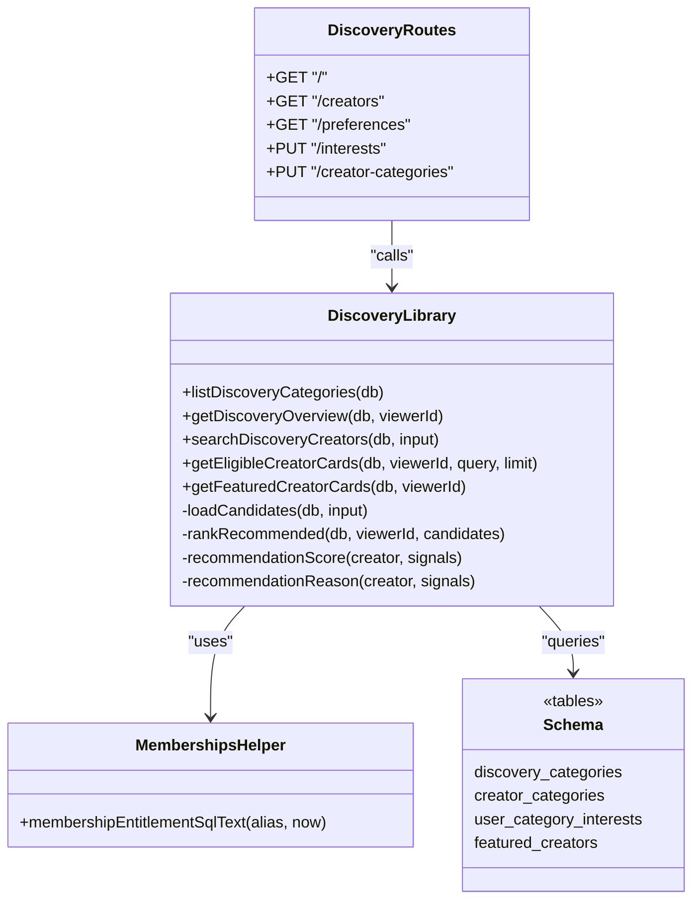
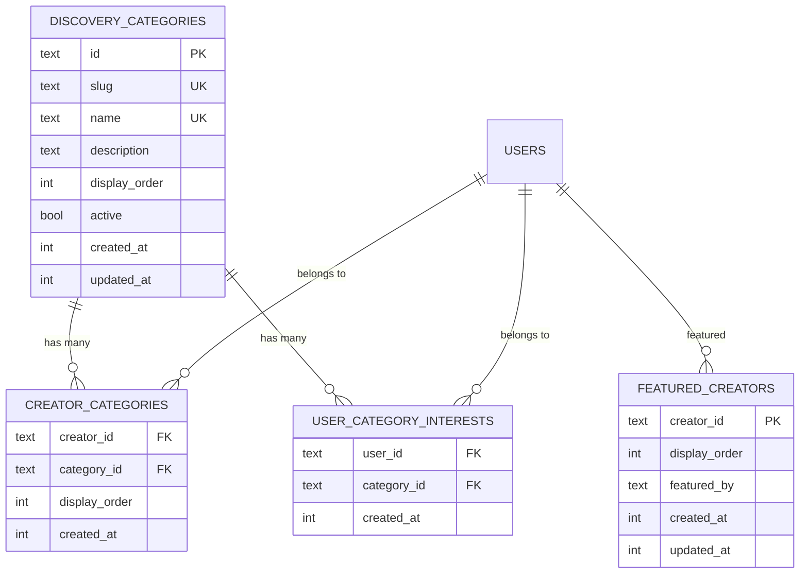
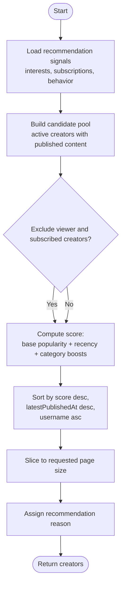

# Discovery Algorithms

<cite>
**Referenced Files in This Document**
- [discovery.ts](file://src/worker/lib/discovery.ts)
- [routes/discovery.ts](file://src/worker/routes/discovery.ts)
- [lib/discovery.ts](file://src/react-app/lib/discovery.ts)
- [ExplorePage.tsx](file://src/react-app/pages/ExplorePage.tsx)
- [DiscoverySettingsPanel.tsx](file://src/react-app/components/DiscoverySettingsPanel.tsx)
- [0015_creator_discovery.sql](file://drizzle/0015_creator_discovery.sql)
- [schema.ts](file://src/worker/db/schema.ts)
- [memberships.ts](file://src/worker/lib/memberships.ts)
- [discovery.test.ts](file://src/worker/routes/discovery.test.ts)
</cite>

## Table of Contents
1. [Introduction](#introduction)
2. [Project Structure](#project-structure)
3. [Core Components](#core-components)
4. [Architecture Overview](#architecture-overview)
5. [Detailed Component Analysis](#detailed-component-analysis)
6. [Dependency Analysis](#dependency-analysis)
7. [Performance Considerations](#performance-considerations)
8. [Troubleshooting Guide](#troubleshooting-guide)
9. [Conclusion](#conclusion)
10. [Appendices](#appendices)

## Introduction
This document explains Zenith’s content discovery and recommendation system for creators. It covers:
- The categorization model for creators and categories
- The discovery scoring algorithm that blends creator popularity, recency, user interests, subscriptions, and behavior signals
- Settings management for user interests and creator categories
- API endpoints for querying discovered creators
- Database models used to track discovery interactions and preferences
- Algorithm parameters and tuning knobs
- Query patterns, ranking logic, cold-start strategies, performance considerations, and caching approaches

## Project Structure
The discovery feature spans backend logic (Worker), API routes, frontend libraries and pages, and database schema migrations.

**Diagram sources**
- [ExplorePage.tsx](file://src/react-app/pages/ExplorePage.tsx)
- [DiscoverySettingsPanel.tsx](file://src/react-app/components/DiscoverySettingsPanel.tsx)
- [lib/discovery.ts](file://src/react-app/lib/discovery.ts)
- [routes/discovery.ts](file://src/worker/routes/discovery.ts)
- [lib/discovery.ts](file://src/worker/lib/discovery.ts)
- [memberships.ts](file://src/worker/lib/memberships.ts)
- [schema.ts](file://src/worker/db/schema.ts)
- [0015_creator_discovery.sql](file://drizzle/0015_creator_discovery.sql)

**Section sources**
- [routes/discovery.ts](file://src/worker/routes/discovery.ts)
- [lib/discovery.ts](file://src/worker/lib/discovery.ts)
- [lib/discovery.ts](file://src/react-app/lib/discovery.ts)
- [ExplorePage.tsx](file://src/react-app/pages/ExplorePage.tsx)
- [DiscoverySettingsPanel.tsx](file://src/react-app/components/DiscoverySettingsPanel.tsx)
- [schema.ts](file://src/worker/db/schema.ts)
- [0015_creator_discovery.sql](file://drizzle/0015_creator_discovery.sql)

## Core Components
- Category taxonomy: A global set of active discovery categories with display order and counts.
- Creator profile enrichment: Each creator has up to three public categories; the system computes activity metrics like subscriber count and recent publication volume.
- User preferences: Users select up to five interests; these influence recommendations alongside subscription and behavior signals.
- Ranking engine: Combines popularity, recency, and interest-based boosts to produce a personalized “recommended” list.
- API surface: Endpoints for overview, search, preferences, and preference updates.

Key constants and types are defined in the backend library, including maximum limits for categories and interests.

**Section sources**
- [lib/discovery.ts](file://src/worker/lib/discovery.ts)
- [routes/discovery.ts](file://src/worker/routes/discovery.ts)
- [lib/discovery.ts](file://src/react-app/lib/discovery.ts)

## Architecture Overview
The discovery flow is request-driven from the React app through Hono routes into the backend library, which queries the database and returns structured results.

**Diagram sources**
- [routes/discovery.ts](file://src/worker/routes/discovery.ts)
- [lib/discovery.ts](file://src/worker/lib/discovery.ts)
- [memberships.ts](file://src/worker/lib/memberships.ts)

## Detailed Component Analysis

### Categorization System
- Global categories: Defined by a migration and managed via admin endpoints. Categories have id, slug, name, description, display_order, and active flag.
- Creator categories: Creators can select up to three categories to show publicly on their profiles and discovery cards.
- User interests: Users can select up to five categories to shape recommendations.

Data structures include:
- DiscoveryCategorySummary with id, slug, name, description, displayOrder, creatorCount
- CreatorDiscoveryCard with id, displayName, username, tagline, avatarUrl, categories, publishedContentCount, contentTypes, featured, viewerSubscribed, recommendationReason

**Section sources**
- [0015_creator_discovery.sql](file://drizzle/0015_creator_discovery.sql)
- [schema.ts](file://src/worker/db/schema.ts)
- [lib/discovery.ts](file://src/worker/lib/discovery.ts)

### Discovery Scoring Algorithm
The recommendation score combines multiple signals:
- Base popularity: activeSubscriberCount capped at 25 contributes linearly
- Recency/activity: recentPublicationCount capped at 10 multiplied by 2
- Interest match: +100 per matching category if it matches user’s explicit interests
- Subscription proximity: +40 per matching category if the user subscribes to creators in that category
- Behavior proximity: +20 per matching category if the user liked or saved posts by creators in that category

Tiebreakers:
- Latest published timestamp descending
- Username lexicographic ordering

Exclusions:
- The viewer’s own creator profile is excluded
- Already-subscribed creators are excluded from recommendations

Recommendation reasons are generated based on the strongest signal:
- Matches your <category> interest
- Similar to creators you follow
- Based on content you enjoyed
- Popular on Zenith
- Recently active on Zenith

Algorithm parameters:
- MAX_CREATOR_CATEGORIES = 3
- MAX_USER_INTERESTS = 5
- MAX_FEATURED_CREATORS = 12

These caps ensure bounded memory and consistent UX.

**Section sources**
- [lib/discovery.ts](file://src/worker/lib/discovery.ts)

### Discovery Settings Management
Endpoints:
- GET /api/discovery/preferences: Returns available categories, current user interests, and creator categories (if applicable).
- PUT /api/discovery/interests: Updates user interests with validation (unique, max 5, must be active).
- PUT /api/discovery/creator-categories: Updates creator categories (max 3, must be active, creator-only).

Validation and persistence:
- Active category validation ensures only valid categories are stored.
- Replaces all selections atomically using batched statements.

Frontend:
- DiscoverySettingsPanel provides UI for selecting interests and creator categories, with optimistic query invalidation and toast feedback.

**Section sources**
- [routes/discovery.ts](file://src/worker/routes/discovery.ts)
- [DiscoverySettingsPanel.tsx](file://src/react-app/components/DiscoverySettingsPanel.tsx)

### Category-Based Filtering
Search supports filtering by category slug. Queries also support text search across username, display name, tagline, and category names. Sorting modes:
- relevance: prioritizes exact and prefix matches, then popularity and recency
- popular: orders by active subscribers, recent publications, latest publish time
- recent: orders by latest published timestamp
- recommended: personalizes using the scoring algorithm described above

Pagination is supported via page and pageSize parameters.

**Section sources**
- [routes/discovery.ts](file://src/worker/routes/discovery.ts)
- [lib/discovery.ts](file://src/worker/lib/discovery.ts)

### Personalized Recommendation Engine
The engine builds recommendation signals from:
- Explicit interests (user_category_interests)
- Subscriptions (subscription_memberships joined to creator_categories)
- Behavior (post_likes and saved_items joined to author categories)

It filters out already-subscribed creators and the viewer themselves, then ranks the candidate pool using the scoring function.

**Section sources**
- [lib/discovery.ts](file://src/worker/lib/discovery.ts)

### Database Models for Discovery Interactions
Core tables:
- discovery_categories: Global taxonomy with active flags and ordering
- creator_categories: Maps creators to categories with display order
- user_category_interests: Maps users to categories they selected as interests
- featured_creators: Curated list of featured creators with ordering

Indexes optimize lookups by category, creator, and ordering fields. Membership entitlement checks use helper functions to filter active/trialing subscriptions.

**Section sources**
- [0015_creator_discovery.sql](file://drizzle/0015_creator_discovery.sql)
- [schema.ts](file://src/worker/db/schema.ts)
- [memberships.ts](file://src/worker/lib/memberships.ts)

### API Endpoints for Discovered Content
- GET /api/discovery: Returns overview with categories, featured creators, recommended creators, user interests, and whether interests are needed.
- GET /api/discovery/creators: Search and browse creators with query, category, sort, pagination.
- GET /api/discovery/preferences: Fetches categories and current selections.
- PUT /api/discovery/interests: Update user interests.
- PUT /api/discovery/creator-categories: Update creator categories.

All endpoints require authentication except where otherwise specified.

**Section sources**
- [routes/discovery.ts](file://src/worker/routes/discovery.ts)

### Examples of Discovery Query Patterns
- Browse by category: GET /api/discovery/creators?category=photography&sort=recommended&page=1&pageSize=20
- Search by keyword: GET /api/discovery/creators?q=art%20design&sort=relevance&page=1&pageSize=20
- Personalized recommendations: GET /api/discovery/creators?sort=recommended&page=1&pageSize=20
- Recent activity: GET /api/discovery/creators?sort=recent&page=1&pageSize=20

Response includes creators array, total count, page, and pageSize.

**Section sources**
- [lib/discovery.ts](file://src/react-app/lib/discovery.ts)
- [routes/discovery.ts](file://src/worker/routes/discovery.ts)

### Result Ranking Logic
- For non-recommended sorts, SQL ORDER BY applies popularity, recency, and username tiebreakers.
- For recommended sort, the backend loads a candidate pool (up to 1000), computes scores per creator, and sorts by score, latestPublishedAt, and username.

**Section sources**
- [lib/discovery.ts](file://src/worker/lib/discovery.ts)

### Cold-Start Strategies for New Users
- If no interests are set, the system prompts users to choose topics to enable personalized recommendations.
- Without interests, recommendations fall back to popularity and recency signals.
- Behavior signals (likes/saves) provide implicit interest signals even when explicit interests are absent.

**Section sources**
- [lib/discovery.ts](file://src/worker/lib/discovery.ts)
- [ExplorePage.tsx](file://src/react-app/pages/ExplorePage.tsx)

## Dependency Analysis
The discovery module depends on:
- Membership entitlement helpers to filter active subscriptions
- Database schema definitions for categories, interests, and featured creators
- Frontend query keys and mutation utilities for cache invalidation

**Diagram sources**
- [routes/discovery.ts](file://src/worker/routes/discovery.ts)
- [lib/discovery.ts](file://src/worker/lib/discovery.ts)
- [memberships.ts](file://src/worker/lib/memberships.ts)
- [schema.ts](file://src/worker/db/schema.ts)

**Section sources**
- [routes/discovery.ts](file://src/worker/routes/discovery.ts)
- [lib/discovery.ts](file://src/worker/lib/discovery.ts)
- [memberships.ts](file://src/worker/lib/memberships.ts)
- [schema.ts](file://src/worker/db/schema.ts)

## Performance Considerations
- Candidate pool size: The recommended path loads up to 1000 candidates before ranking to balance accuracy and latency.
- Pagination: Page and pageSize parameters prevent large payloads.
- Index usage: Category and ordering indexes accelerate queries.
- Membership checks: Entitlement conditions are embedded in SQL to avoid extra round-trips.
- Frontend caching: React Query uses staleTime to reduce repeated requests.

Optimization opportunities:
- Precompute popularity metrics periodically and store them in a materialized view or summary table.
- Cache category lists and featured creators for short TTLs.
- Use Redis or KV for hot paths like overview and top categories.

[No sources needed since this section provides general guidance]

## Troubleshooting Guide
Common issues and resolutions:
- Authentication errors: Ensure the request includes a valid session cookie.
- Validation failures: Category IDs must be unique, active, and within limits (5 for interests, 3 for creator categories).
- Empty results: Check that creators have active posts and are not hidden; verify category slugs and active flags.
- Unexpected exclusions: Subscribed creators are excluded from recommendations; verify subscription state.

Relevant tests demonstrate expected behaviors:
- Only eligible creators appear
- Recommendations respect interests and exclude subscriptions
- Admin operations are restricted and audited

**Section sources**
- [discovery.test.ts](file://src/worker/routes/discovery.test.ts)

## Conclusion
Zenith’s discovery system combines a robust category taxonomy with a transparent scoring algorithm that balances popularity, recency, and user-centric signals. The API exposes flexible search and browsing capabilities while maintaining strong data integrity and performance characteristics. With clear settings management and well-defined database models, the system scales to support personalized recommendations and efficient real-time queries.

[No sources needed since this section summarizes without analyzing specific files]

## Appendices

### Data Model Diagram

**Diagram sources**
- [0015_creator_discovery.sql](file://drizzle/0015_creator_discovery.sql)
- [schema.ts](file://src/worker/db/schema.ts)

### Algorithm Flowchart

**Diagram sources**
- [lib/discovery.ts](file://src/worker/lib/discovery.ts)