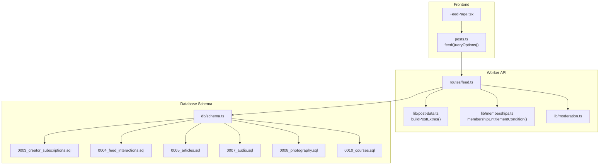
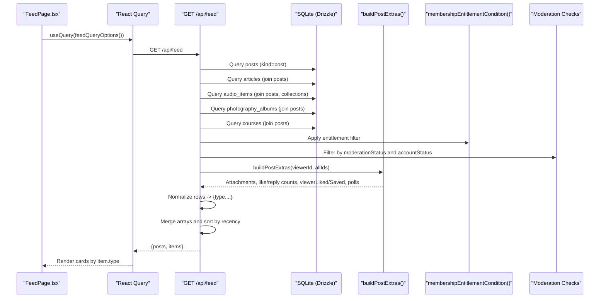
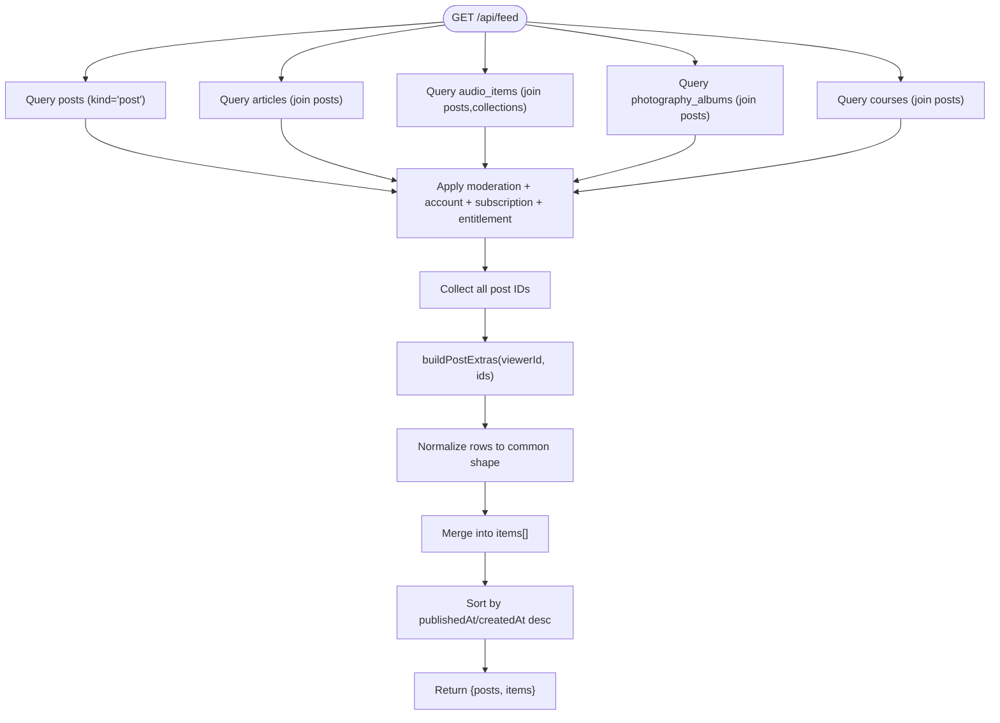
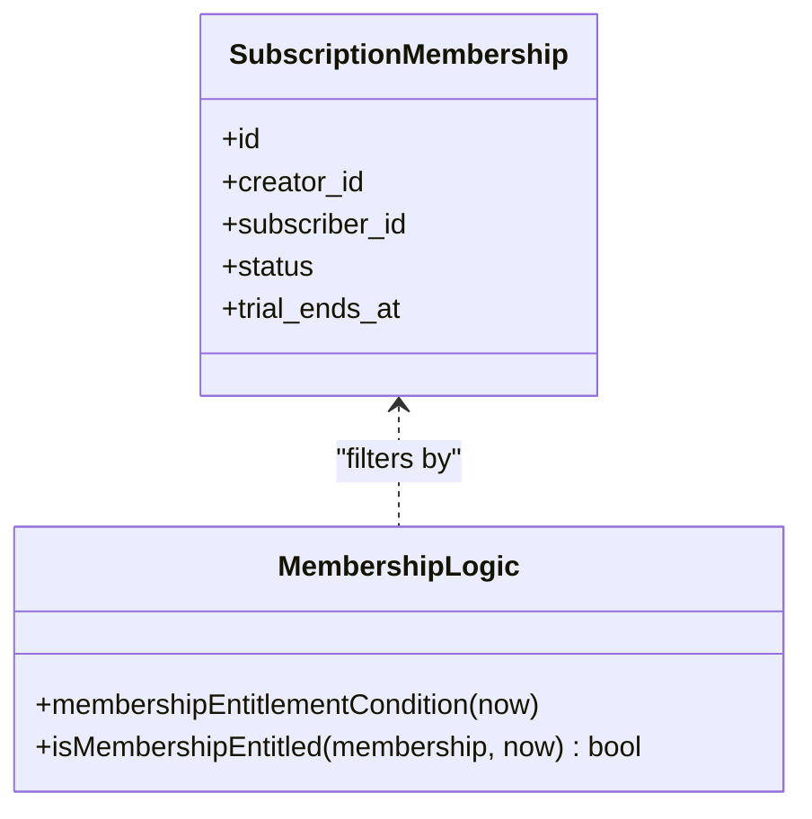
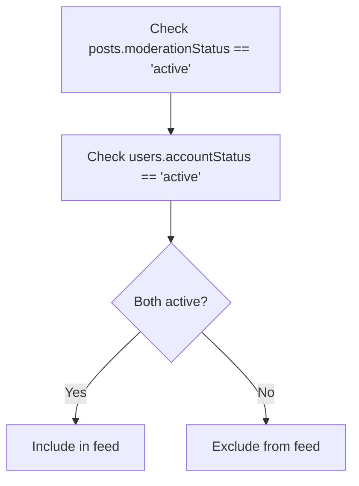
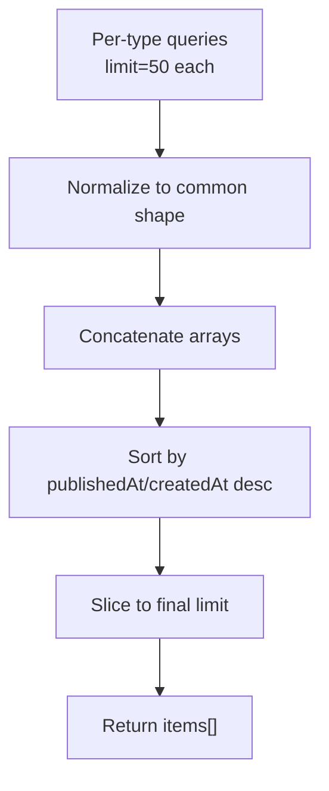
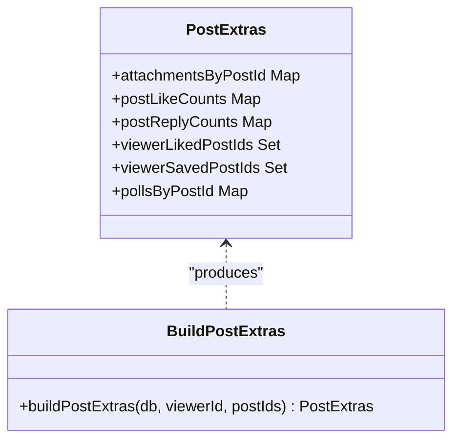
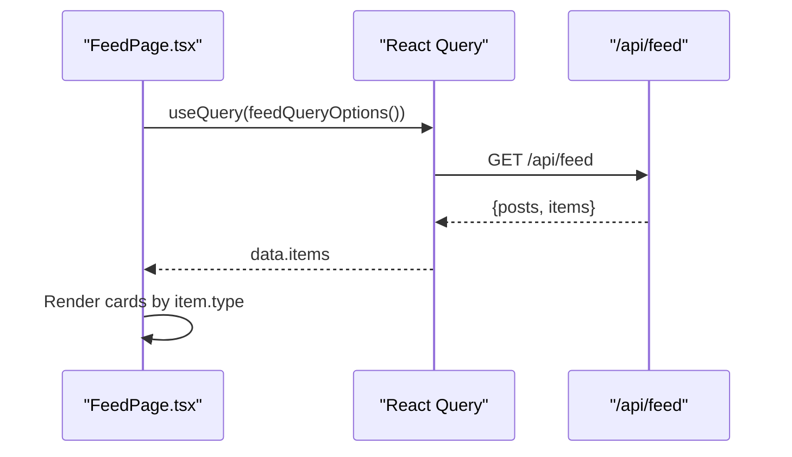
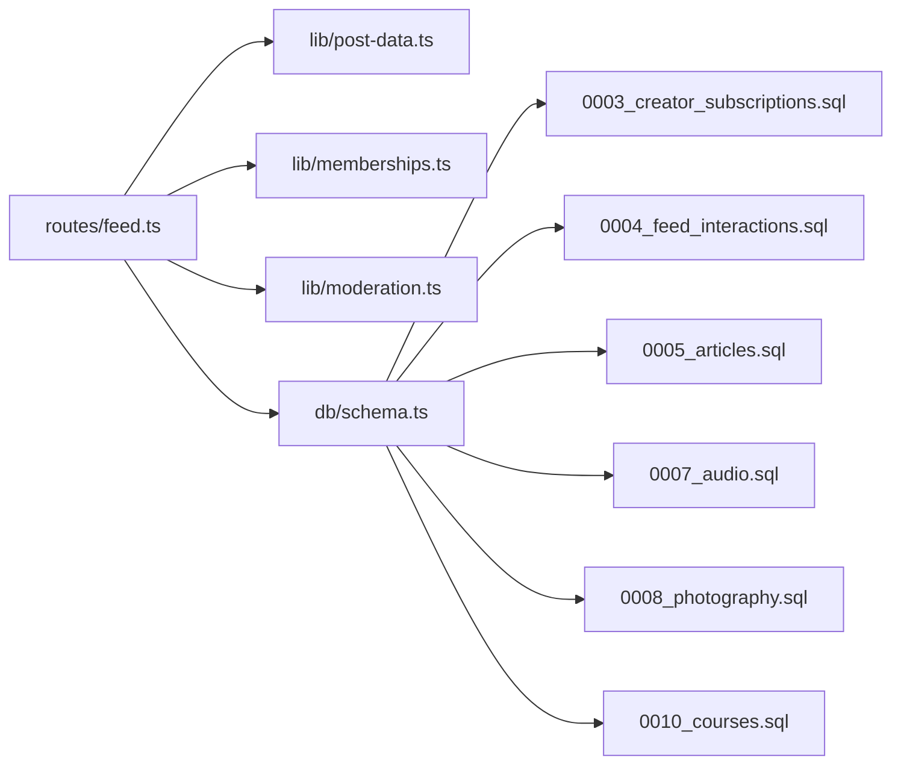

# Feed System

<cite>
**Referenced Files in This Document**
- [feed.ts](file://src/worker/routes/feed.ts)
- [posts.ts](file://src/react-app/lib/posts.ts)
- [FeedPage.tsx](file://src/react-app/pages/FeedPage.tsx)
- [post-data.ts](file://src/worker/lib/post-data.ts)
- [memberships.ts](file://src/worker/lib/memberships.ts)
- [moderation.ts](file://src/worker/lib/moderation.ts)
- [schema.ts](file://src/worker/db/schema.ts)
- [0003_creator_subscriptions.sql](file://drizzle/0003_creator_subscriptions.sql)
- [0004_feed_interactions.sql](file://drizzle/0004_feed_interactions.sql)
- [0005_articles.sql](file://drizzle/0005_articles.sql)
- [0007_audio.sql](file://drizzle/0007_audio.sql)
- [0008_photography.sql](file://drizzle/0008_photography.sql)
- [0010_courses.sql](file://drizzle/0010_courses.sql)
</cite>

## Table of Contents
1. [Introduction](#introduction)
2. [Project Structure](#project-structure)
3. [Core Components](#core-components)
4. [Architecture Overview](#architecture-overview)
5. [Detailed Component Analysis](#detailed-component-analysis)
6. [Dependency Analysis](#dependency-analysis)
7. [Performance Considerations](#performance-considerations)
8. [Troubleshooting Guide](#troubleshooting-guide)
9. [Conclusion](#conclusion)
10. [Appendices](#appendices)

## Introduction
This document explains Zenith’s feed system that aggregates multiple content types into a unified timeline for subscribers. It covers how posts, articles, audio collections/items, photography albums, and courses are fetched, filtered by subscriptions and entitlements, validated for moderation, enriched with engagement metrics, sorted by recency, and returned to the frontend as a single items array. It also documents database queries, sorting logic, enrichment, pagination considerations, caching strategies, and real-time update approaches.

## Project Structure
The feed spans worker routes (server), data utilities, membership logic, moderation helpers, Drizzle schema, and frontend pages and query hooks.

**Diagram sources**
- [FeedPage.tsx:1-60](file://src/react-app/pages/FeedPage.tsx#L1-L60)
- [posts.ts:96-101](file://src/react-app/lib/posts.ts#L96-L101)
- [feed.ts:13-395](file://src/worker/routes/feed.ts#L13-L395)
- [post-data.ts:144-292](file://src/worker/lib/post-data.ts#L144-L292)
- [memberships.ts:23-31](file://src/worker/lib/memberships.ts#L23-L31)
- [moderation.ts:5-16](file://src/worker/lib/moderation.ts#L5-L16)
- [schema.ts:168-188](file://src/worker/db/schema.ts#L168-L188)
- [0003_creator_subscriptions.sql:72-105](file://drizzle/0003_creator_subscriptions.sql#L72-L105)
- [0004_feed_interactions.sql:64-84](file://drizzle/0004_feed_interactions.sql#L64-L84)
- [0005_articles.sql:5-22](file://drizzle/0005_articles.sql#L5-L22)
- [0007_audio.sql:23-58](file://drizzle/0007_audio.sql#L23-L58)
- [0008_photography.sql:1-54](file://drizzle/0008_photography.sql#L1-L54)
- [0010_courses.sql:1-21](file://drizzle/0010_courses.sql#L1-L21)

**Section sources**
- [FeedPage.tsx:1-60](file://src/react-app/pages/FeedPage.tsx#L1-L60)
- [posts.ts:96-101](file://src/react-app/lib/posts.ts#L96-L101)
- [feed.ts:13-395](file://src/worker/routes/feed.ts#L13-L395)

## Core Components
- Feed API endpoint: Aggregates content from multiple tables, applies subscription and entitlement filters, validates moderation, enriches with engagement data, sorts by recency, and returns a unified items list.
- Post extras enrichment: Computes likes, replies, viewer-specific states (liked/saved), attachments, and polls per post.
- Membership entitlement: Ensures only active or valid trial memberships grant access.
- Moderation checks: Enforces active moderation status and active author accounts.
- Frontend feed page: Fetches via React Query and renders type-specific cards.

**Section sources**
- [feed.ts:13-395](file://src/worker/routes/feed.ts#L13-L395)
- [post-data.ts:144-292](file://src/worker/lib/post-data.ts#L144-L292)
- [memberships.ts:23-31](file://src/worker/lib/memberships.ts#L23-L31)
- [moderation.ts:5-16](file://src/worker/lib/moderation.ts#L5-L16)
- [FeedPage.tsx:10-59](file://src/react-app/pages/FeedPage.tsx#L10-L59)

## Architecture Overview
The feed is a server-side aggregation pipeline:
- Authentication middleware ensures a user context.
- Multiple queries fetch eligible content across tables, each joined with users and subscription_memberships to enforce subscriber-only visibility and entitlement.
- A single enrichment step gathers engagement metrics and viewer state for all collected IDs.
- Results are normalized into a common shape and merged into one array, then sorted by publishedAt or createdAt descending.
- The response includes both typed posts and a flattened items array for the UI.

**Diagram sources**
- [feed.ts:13-395](file://src/worker/routes/feed.ts#L13-L395)
- [post-data.ts:144-292](file://src/worker/lib/post-data.ts#L144-L292)
- [memberships.ts:23-31](file://src/worker/lib/memberships.ts#L23-L31)
- [moderation.ts:5-16](file://src/worker/lib/moderation.ts#L5-L16)
- [posts.ts:96-101](file://src/react-app/lib/posts.ts#L96-L101)
- [FeedPage.tsx:10-59](file://src/react-app/pages/FeedPage.tsx#L10-L59)

## Detailed Component Analysis

### Feed API Endpoint (GET /api/feed)
Responsibilities:
- Fetch eligible content from five sources: posts, articles, audio_items, photography_albums, courses.
- For each source, join posts, users, and subscription_memberships to enforce:
  - Published timestamps
  - Active moderation status on posts
  - Active author account status
  - Subscriber relationship and entitlement
- Enrich results with post extras (likes, replies, viewer states, attachments, polls).
- Normalize each row into a common object with a type discriminator.
- Merge all normalized rows into a single items array and sort by recency.
- Return both typed posts and the unified items array.

Key behaviors:
- Each content type has its own query with appropriate where clauses and ordering.
- Photography photos are loaded separately and attached to albums.
- Empty result path returns a friendly message.

**Diagram sources**
- [feed.ts:13-395](file://src/worker/routes/feed.ts#L13-L395)

**Section sources**
- [feed.ts:13-395](file://src/worker/routes/feed.ts#L13-L395)

### Subscription-Based Filtering and Entitlement
- Subscribers are identified via subscription_memberships(subscriberId, creatorId).
- Entitlement condition allows active subscriptions or trials not yet expired.
- All content queries include this condition to ensure only entitled creators’ content appears.

**Diagram sources**
- [0003_creator_subscriptions.sql:72-105](file://drizzle/0003_creator_subscriptions.sql#L72-L105)
- [memberships.ts:23-31](file://src/worker/lib/memberships.ts#L23-L31)

**Section sources**
- [memberships.ts:23-31](file://src/worker/lib/memberships.ts#L23-L31)
- [0003_creator_subscriptions.sql:72-105](file://drizzle/0003_creator_subscriptions.sql#L72-L105)

### Content Moderation Validation
- Posts must have moderationStatus 'active'.
- Author account must be 'active'.
- Replies counted in enrichment exclude deleted or non-active moderation entries.

**Diagram sources**
- [feed.ts:31-38](file://src/worker/routes/feed.ts#L31-L38)
- [moderation.ts:5-16](file://src/worker/lib/moderation.ts#L5-L16)

**Section sources**
- [moderation.ts:5-16](file://src/worker/lib/moderation.ts#L5-L16)
- [feed.ts:31-38](file://src/worker/routes/feed.ts#L31-L38)

### Database Queries and Sorting Algorithm
- Each content type is queried independently with joins and filters, ordered by published timestamp descending, limited to a fixed size per type.
- After normalization, all items are merged and sorted globally by publishedAt or createdAt descending, then sliced to a final limit.

**Diagram sources**
- [feed.ts:43-187](file://src/worker/routes/feed.ts#L43-L187)
- [feed.ts:385-392](file://src/worker/routes/feed.ts#L385-L392)

**Section sources**
- [feed.ts:43-187](file://src/worker/routes/feed.ts#L43-L187)
- [feed.ts:385-392](file://src/worker/routes/feed.ts#L385-L392)

### Enrichment Process (Engagement Metrics and Viewer-Specific Data)
- Aggregates attachments, like counts, reply counts, viewer liked/saved flags, and poll details for all collected post IDs.
- Uses parallel queries for performance and builds maps for efficient lookup.
- Polls include options, vote counts, and viewer’s selected option if any.

**Diagram sources**
- [post-data.ts:144-292](file://src/worker/lib/post-data.ts#L144-L292)

**Section sources**
- [post-data.ts:144-292](file://src/worker/lib/post-data.ts#L144-L292)

### Frontend Integration and Rendering
- FeedPage uses React Query to fetch /api/feed.
- Items are rendered using type-specific components: PostCard, ArticleCard, AudioCard, PhotographyCard, CourseCard.
- If no items exist, a message prompts subscribing to creators.

**Diagram sources**
- [FeedPage.tsx:10-59](file://src/react-app/pages/FeedPage.tsx#L10-L59)
- [posts.ts:96-101](file://src/react-app/lib/posts.ts#L96-L101)

**Section sources**
- [FeedPage.tsx:10-59](file://src/react-app/pages/FeedPage.tsx#L10-L59)
- [posts.ts:96-101](file://src/react-app/lib/posts.ts#L96-L101)

## Dependency Analysis
- The feed route depends on:
  - Drizzle ORM for querying multiple tables with joins.
  - Membership entitlement helper for filtering by subscription status/trial.
  - Post-data utilities for URL generation and enrichment.
  - Moderation helpers indirectly through conditions applied in queries.
- Schema dependencies include core tables for posts, articles, audio, photography, courses, and interactions (likes, replies, polls).

**Diagram sources**
- [feed.ts:1-8](file://src/worker/routes/feed.ts#L1-L8)
- [post-data.ts:1-16](file://src/worker/lib/post-data.ts#L1-L16)
- [memberships.ts:1-8](file://src/worker/lib/memberships.ts#L1-L8)
- [moderation.ts:1-4](file://src/worker/lib/moderation.ts#L1-L4)
- [schema.ts:168-188](file://src/worker/db/schema.ts#L168-L188)
- [0003_creator_subscriptions.sql:72-105](file://drizzle/0003_creator_subscriptions.sql#L72-L105)
- [0004_feed_interactions.sql:64-84](file://drizzle/0004_feed_interactions.sql#L64-L84)
- [0005_articles.sql:5-22](file://drizzle/0005_articles.sql#L5-L22)
- [0007_audio.sql:23-58](file://drizzle/0007_audio.sql#L23-L58)
- [0008_photography.sql:1-54](file://drizzle/0008_photography.sql#L1-L54)
- [0010_courses.sql:1-21](file://drizzle/0010_courses.sql#L1-L21)

**Section sources**
- [feed.ts:1-8](file://src/worker/routes/feed.ts#L1-L8)
- [post-data.ts:1-16](file://src/worker/lib/post-data.ts#L1-L16)
- [memberships.ts:1-8](file://src/worker/lib/memberships.ts#L1-L8)
- [moderation.ts:1-4](file://src/worker/lib/moderation.ts#L1-L4)
- [schema.ts:168-188](file://src/worker/db/schema.ts#L168-L188)

## Performance Considerations
- Parallel enrichment: buildPostExtras performs multiple independent queries concurrently to minimize latency.
- Indexed fields: Ensure indexes on publishedAt, kind, status, and foreign keys used in joins and filters.
- Limiting per-type queries reduces memory and CPU usage; merging and sorting occurs in-memory on a bounded set.
- Avoid N+1 queries by batching ID lookups and grouping results into Maps.
- Consider cursor-based pagination for large datasets to avoid offset scans.
- Cache at CDN or edge layer for public endpoints if applicable; for authenticated feeds, cache per-user with short TTLs.

[No sources needed since this section provides general guidance]

## Troubleshooting Guide
Common issues and resolutions:
- Empty feed: Verify user has active subscriptions to creators; check subscription_memberships and entitlement status.
- Missing content: Confirm posts.moderationStatus is 'active' and users.accountStatus is 'active'.
- Likes/replies not showing: Ensure post_likes and post_replies tables contain records and moderation filters allow counting.
- Polls missing: Validate post_polls and related options/votes exist for the post IDs.
- Pagination gaps: Implement cursor-based pagination using last seen publishedAt/id pairs instead of offsets.

**Section sources**
- [feed.ts:214-216](file://src/worker/routes/feed.ts#L214-L216)
- [post-data.ts:175-186](file://src/worker/lib/post-data.ts#L175-L186)
- [0004_feed_interactions.sql:64-84](file://drizzle/0004_feed_interactions.sql#L64-L84)

## Conclusion
Zenith’s feed system unifies diverse content types into a single timeline by leveraging subscription-based filtering, robust moderation checks, and comprehensive enrichment. The design balances correctness and performance through parallel queries, indexed schemas, and in-memory merging/sorting. Future enhancements should focus on scalable pagination, caching strategies, and real-time updates to keep the feed fresh and responsive.

[No sources needed since this section summarizes without analyzing specific files]

## Appendices

### Example Feed API Responses
- Success with items: Returns an objects array containing posts, articles, audio, photography, and course items, plus a typed posts array.
- Empty state: Returns a message indicating no subscribed creators.

Response shapes:
- posts: Array of FeedPost objects with author, attachments, likeCount, replyCount, viewerLiked, viewerSaved, poll.
- items: Unified array of mixed content types with type discriminator and metadata.
- message: Optional string when no content is available.

**Section sources**
- [feed.ts:214-216](file://src/worker/routes/feed.ts#L214-L216)
- [feed.ts:385-394](file://src/worker/routes/feed.ts#L385-L394)
- [posts.ts:82-86](file://src/react-app/lib/posts.ts#L82-L86)

### Pagination Implementation Strategy
- Current implementation uses fixed limits per type and a global slice.
- Recommended approach: Use cursor-based pagination with last publishedAt and id to fetch next page efficiently.
- Maintain stable ordering by combining publishedAt and id to avoid ties.

**Section sources**
- [feed.ts:385-392](file://src/worker/routes/feed.ts#L385-L392)

### Caching Strategies
- Client-side caching via React Query with appropriate staleTime and gcTime.
- Server-side caching for read-heavy scenarios using Redis or in-process caches keyed by user id and time window.
- Edge caching for static assets referenced by URLs generated in post-data utilities.

**Section sources**
- [posts.ts:96-101](file://src/react-app/lib/posts.ts#L96-L101)
- [post-data.ts:104-126](file://src/worker/lib/post-data.ts#L104-L126)

### Real-Time Feed Updates
- Use WebSocket or Server-Sent Events to push new posts/articles/audio/photography/courses to clients.
- Invalidate React Query cache on mutations (like, save, publish) to reflect changes immediately.
- Debounce rapid updates to avoid excessive re-renders.

[No sources needed since this section provides general guidance]