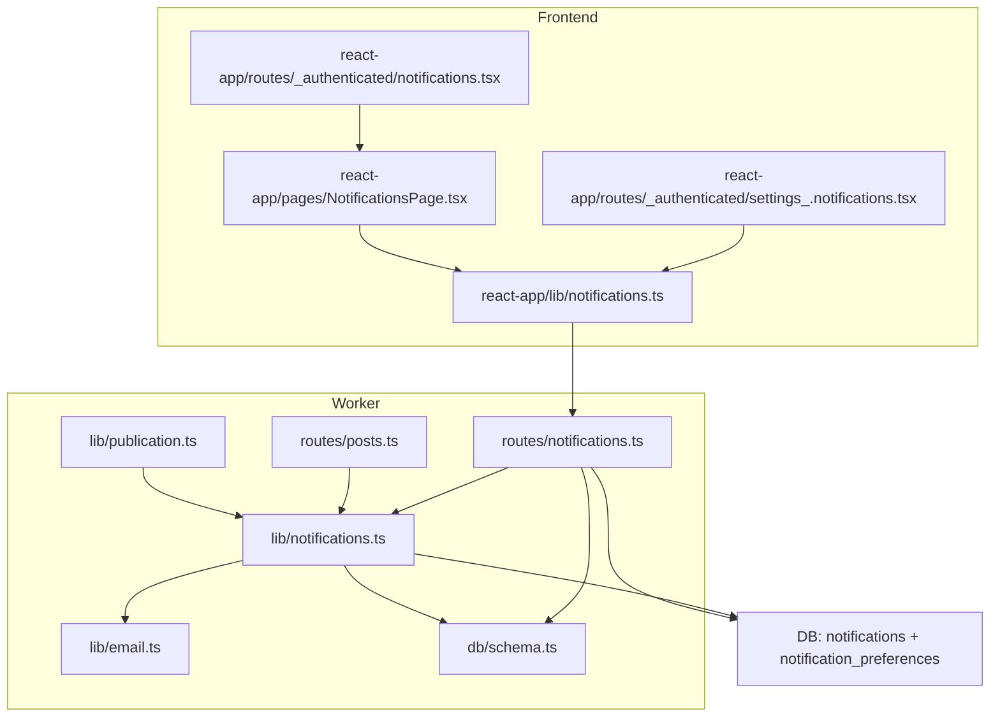
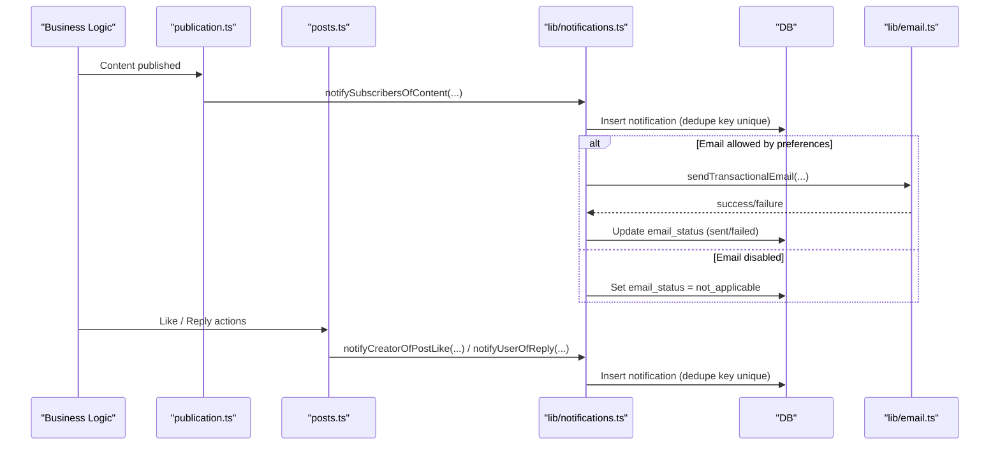
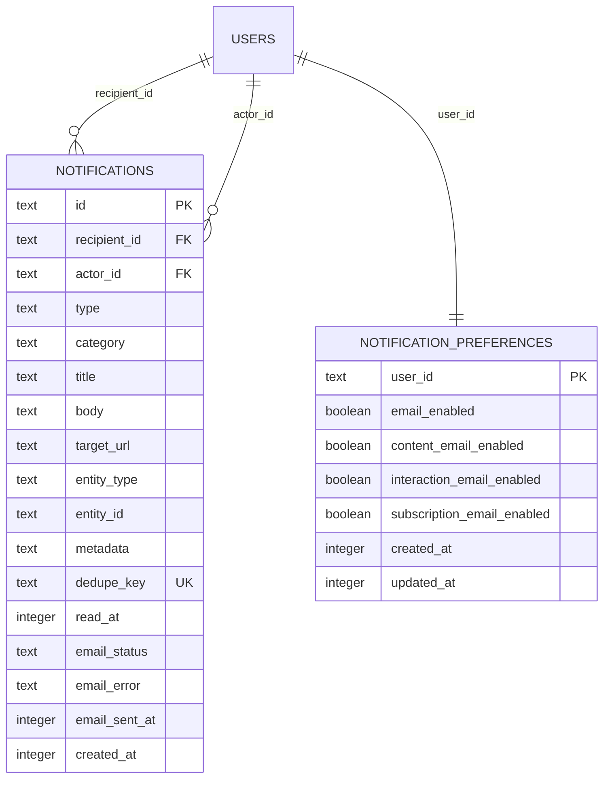
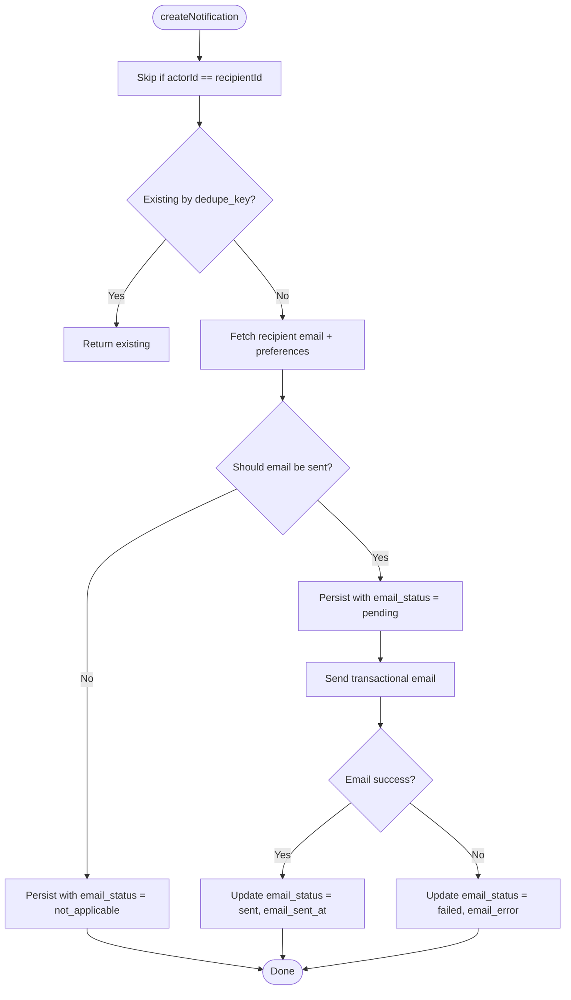
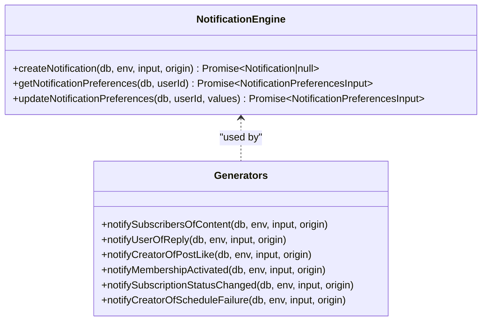
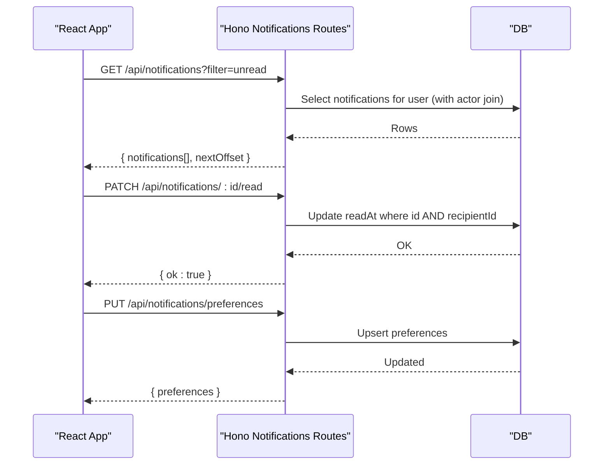
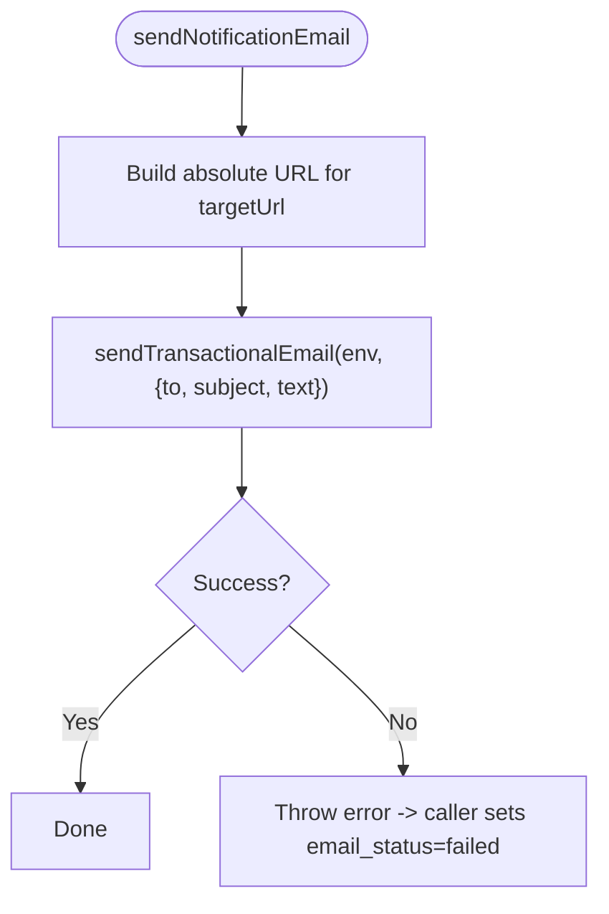
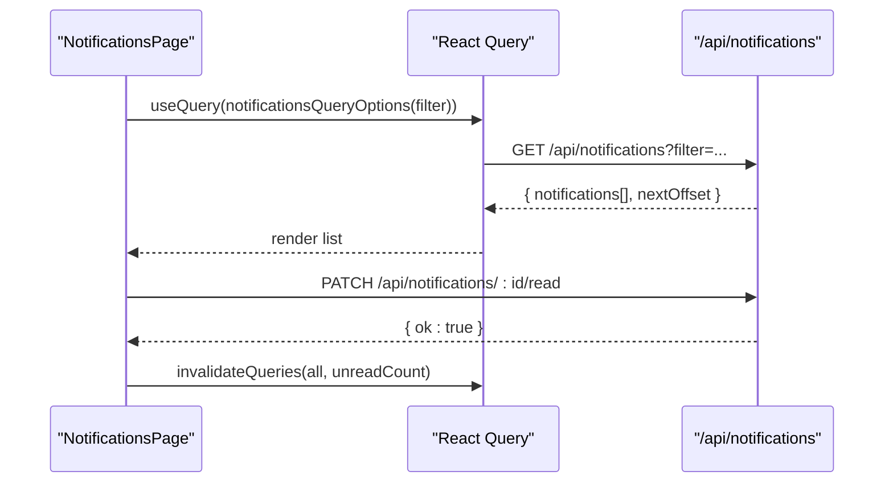
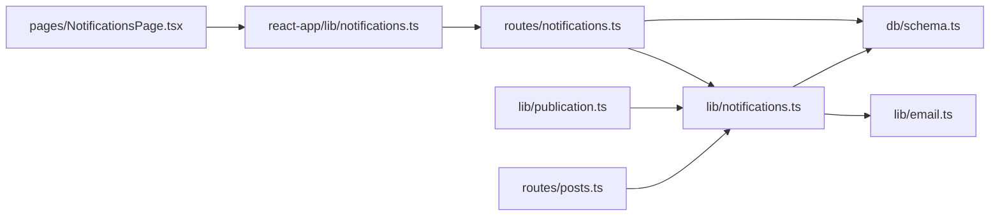

# Notification System

<cite>
**Referenced Files in This Document**
- [0009_notifications.sql](file://drizzle/0009_notifications.sql)
- [schema.ts](file://src/worker/db/schema.ts)
- [notifications.ts (lib)](file://src/worker/lib/notifications.ts)
- [notifications.ts (routes)](file://src/worker/routes/notifications.ts)
- [email.ts](file://src/worker/lib/email.ts)
- [publication.ts](file://src/worker/lib/publication.ts)
- [posts.ts](file://src/worker/routes/posts.ts)
- [notifications.ts (react-app lib)](file://src/react-app/lib/notifications.ts)
- [NotificationsPage.tsx](file://src/react-app/pages/NotificationsPage.tsx)
- [notifications route (authenticated)](file://src/react-app/routes/_authenticated/notifications.tsx)
- [settings notifications route](file://src/react-app/routes/_authenticated/settings_.notifications.tsx)
</cite>

## Table of Contents
1. [Introduction](#introduction)
2. [Project Structure](#project-structure)
3. [Core Components](#core-components)
4. [Architecture Overview](#architecture-overview)
5. [Detailed Component Analysis](#detailed-component-analysis)
6. [Dependency Analysis](#dependency-analysis)
7. [Performance Considerations](#performance-considerations)
8. [Troubleshooting Guide](#troubleshooting-guide)
9. [Conclusion](#conclusion)
10. [Appendices](#appendices)

## Introduction
This document explains Zenith’s notification system end-to-end: how notifications are created, persisted, delivered via email, and consumed by the frontend. It covers supported notification types, the event-driven generation flow, database schema, user preferences, API endpoints for listing and managing notifications, and integration with email delivery. It also includes guidance on real-time updates, batching, rate limiting, persistence, cleanup policies, and troubleshooting.

## Project Structure
The notification system spans worker-side logic (creation, persistence, email), routes (APIs), and the React app (UI and client queries). Key areas:
- Database schema and migrations define the notifications and preferences tables.
- Worker library functions generate notifications from events (content publishing, replies, likes, subscriptions).
- Routes expose REST APIs to list notifications, mark read, and manage preferences.
- Email utilities send transactional emails when allowed by preferences.
- Frontend uses React Query to fetch and update notifications and preferences.

**Diagram sources**
- [notifications.ts (routes):1-188](file://src/worker/routes/notifications.ts#L1-L188)
- [notifications.ts (lib):1-461](file://src/worker/lib/notifications.ts#L1-L461)
- [email.ts:1-56](file://src/worker/lib/email.ts#L1-L56)
- [schema.ts:870-978](file://src/worker/db/schema.ts#L870-L978)
- [publication.ts:258-272](file://src/worker/lib/publication.ts#L258-L272)
- [posts.ts:1-200](file://src/worker/routes/posts.ts#L1-L200)
- [notifications.ts (react-app lib):1-79](file://src/react-app/lib/notifications.ts#L1-L79)
- [NotificationsPage.tsx:1-164](file://src/react-app/pages/NotificationsPage.tsx#L1-L164)
- [notifications route (authenticated):1-7](file://src/react-app/routes/_authenticated/notifications.tsx#L1-L7)
- [settings notifications route:1-7](file://src/react-app/routes/_authenticated/settings_.notifications.tsx#L1-L7)

**Section sources**
- [schema.ts:870-978](file://src/worker/db/schema.ts#L870-L978)
- [notifications.ts (lib):1-461](file://src/worker/lib/notifications.ts#L1-L461)
- [notifications.ts (routes):1-188](file://src/worker/routes/notifications.ts#L1-L188)
- [email.ts:1-56](file://src/worker/lib/email.ts#L1-L56)
- [publication.ts:258-272](file://src/worker/lib/publication.ts#L258-L272)
- [posts.ts:1-200](file://src/worker/routes/posts.ts#L1-L200)
- [notifications.ts (react-app lib):1-79](file://src/react-app/lib/notifications.ts#L1-L79)
- [NotificationsPage.tsx:1-164](file://src/react-app/pages/NotificationsPage.tsx#L1-L164)

## Core Components
- Notification creation engine: centralizes deduplication, preference checks, persistence, and optional email dispatch.
- Event-driven generators: create notifications for content publication, replies, likes, subscription lifecycle, and scheduling failures.
- Preferences system: per-user toggles controlling whether emails are sent for categories.
- API layer: lists notifications, counts unread, marks read, and manages preferences.
- Email delivery: constructs and sends transactional emails using Cloudflare Email binding.

**Section sources**
- [notifications.ts (lib):1-461](file://src/worker/lib/notifications.ts#L1-L461)
- [notifications.ts (routes):1-188](file://src/worker/routes/notifications.ts#L1-L188)
- [email.ts:1-56](file://src/worker/lib/email.ts#L1-L56)

## Architecture Overview
The system is event-driven: business actions trigger notification generators that persist records and optionally send emails. The frontend polls or pulls data via REST APIs; real-time push is not implemented in this codebase.

**Diagram sources**
- [publication.ts:258-272](file://src/worker/lib/publication.ts#L258-L272)
- [posts.ts:1-200](file://src/worker/routes/posts.ts#L1-L200)
- [notifications.ts (lib):153-234](file://src/worker/lib/notifications.ts#L153-L234)
- [email.ts:27-43](file://src/worker/lib/email.ts#L27-L43)

## Detailed Component Analysis

### Database Schema
Two primary tables:
- notifications: stores each notification with type, category, actor/recipient, target URL, entity context, metadata, deduplication key, read state, and email delivery status.
- notification_preferences: per-user toggles for email categories.

Indexes optimize common queries: recipient-based reads, time ordering, and actor lookups. Unique index on dedupe_key ensures idempotency.

**Diagram sources**
- [schema.ts:870-978](file://src/worker/db/schema.ts#L870-L978)
- [0009_notifications.sql:1-41](file://drizzle/0009_notifications.sql#L1-L41)

**Section sources**
- [schema.ts:870-978](file://src/worker/db/schema.ts#L870-L978)
- [0009_notifications.sql:1-41](file://drizzle/0009_notifications.sql#L1-L41)

### Notification Creation Engine
Key behaviors:
- Idempotent creation via dedupe_key uniqueness.
- Skips self-notifications (actorId == recipientId).
- Reads recipient email and preferences; decides if email should be sent based on category and settings.
- Persists notification row; updates email_status to pending/sent/failed/not_applicable.
- Wraps side effects in safeCreateNotification to avoid failing core flows.

**Diagram sources**
- [notifications.ts (lib):153-234](file://src/worker/lib/notifications.ts#L153-L234)

**Section sources**
- [notifications.ts (lib):153-234](file://src/worker/lib/notifications.ts#L153-L234)

### Event-Driven Generators
- Content publication: notifies all eligible subscribers of a creator’s new content.
- Replies: notifies original author or thread participants.
- Likes: notifies creators when their content is liked.
- Subscriptions: notifies both creator and subscriber on activation and status changes.
- Scheduling failures: notifies creators when scheduled posts fail.

**Diagram sources**
- [notifications.ts (lib):257-461](file://src/worker/lib/notifications.ts#L257-L461)

**Section sources**
- [notifications.ts (lib):257-461](file://src/worker/lib/notifications.ts#L257-L461)

### API Endpoints
Authenticated endpoints under /api/notifications:
- GET /api/notifications?filter=all|unread&limit=...&offset=...
  - Lists notifications for current user with pagination and actor details.
- GET /api/notifications/unread-count
  - Returns count of unread notifications.
- GET /api/notifications/preferences
  - Returns current email preferences.
- PUT /api/notifications/preferences
  - Updates preferences; validates payload.
- PATCH /api/notifications/:notificationId/read
  - Marks a specific notification as read (only for owner).
- POST /api/notifications/read-all
  - Marks all unread notifications as read for current user.

**Diagram sources**
- [notifications.ts (routes):74-187](file://src/worker/routes/notifications.ts#L74-L187)

**Section sources**
- [notifications.ts (routes):74-187](file://src/worker/routes/notifications.ts#L74-L187)

### Email Delivery Integration
- Uses Cloudflare Email binding via sendTransactionalEmail.
- Builds absolute URLs for email links using NOTIFICATION_EMAIL_BASE_URL or request origin.
- Respects per-category email preferences; account category always allowed.
- Tracks email_status and error messages for observability.

**Diagram sources**
- [email.ts:10-43](file://src/worker/lib/email.ts#L10-L43)
- [notifications.ts (lib):103-116](file://src/worker/lib/notifications.ts#L103-L116)

**Section sources**
- [email.ts:1-56](file://src/worker/lib/email.ts#L1-L56)
- [notifications.ts (lib):103-116](file://src/worker/lib/notifications.ts#L103-L116)

### Frontend Consumption
- React Query options define keys and fetchers for notifications list, unread count, and preferences.
- NotificationsPage renders tabs (unread/all), lists items, and provides “Mark read” and “Mark all read”.
- Settings page integrates preferences management.

**Diagram sources**
- [notifications.ts (react-app lib):42-78](file://src/react-app/lib/notifications.ts#L42-L78)
- [NotificationsPage.tsx:1-164](file://src/react-app/pages/NotificationsPage.tsx#L1-L164)

**Section sources**
- [notifications.ts (react-app lib):1-79](file://src/react-app/lib/notifications.ts#L1-L79)
- [NotificationsPage.tsx:1-164](file://src/react-app/pages/NotificationsPage.tsx#L1-L164)
- [notifications route (authenticated):1-7](file://src/react-app/routes/_authenticated/notifications.tsx#L1-L7)
- [settings notifications route:1-7](file://src/react-app/routes/_authenticated/settings_.notifications.tsx#L1-L7)

## Dependency Analysis
- Route handlers depend on Drizzle ORM schemas and auth middleware.
- Notification generators depend on membership entitlement conditions and user summaries.
- Email sending depends on environment bindings and base URL configuration.
- Frontend depends on API contracts defined by routes and shared types.

**Diagram sources**
- [posts.ts:1-200](file://src/worker/routes/posts.ts#L1-L200)
- [publication.ts:258-272](file://src/worker/lib/publication.ts#L258-L272)
- [notifications.ts (lib):1-461](file://src/worker/lib/notifications.ts#L1-L461)
- [schema.ts:870-978](file://src/worker/db/schema.ts#L870-L978)
- [email.ts:1-56](file://src/worker/lib/email.ts#L1-L56)
- [notifications.ts (routes):1-188](file://src/worker/routes/notifications.ts#L1-L188)
- [notifications.ts (react-app lib):1-79](file://src/react-app/lib/notifications.ts#L1-L79)
- [NotificationsPage.tsx:1-164](file://src/react-app/pages/NotificationsPage.tsx#L1-L164)

**Section sources**
- [posts.ts:1-200](file://src/worker/routes/posts.ts#L1-L200)
- [publication.ts:258-272](file://src/worker/lib/publication.ts#L258-L272)
- [notifications.ts (lib):1-461](file://src/worker/lib/notifications.ts#L1-L461)
- [schema.ts:870-978](file://src/worker/db/schema.ts#L870-L978)
- [email.ts:1-56](file://src/worker/lib/email.ts#L1-L56)
- [notifications.ts (routes):1-188](file://src/worker/routes/notifications.ts#L1-L188)
- [notifications.ts (react-app lib):1-79](file://src/react-app/lib/notifications.ts#L1-L79)
- [NotificationsPage.tsx:1-164](file://src/react-app/pages/NotificationsPage.tsx#L1-L164)

## Performance Considerations
- Deduplication: Unique index on dedupe_key prevents duplicates and reduces redundant work.
- Pagination: Limit capped at 50; offset-based pagination supports large histories.
- Indexes: Optimized indexes on recipient_id, read_at, created_at, and actor_id improve query performance.
- Preference checks: Cached defaults and single-row upsert minimize overhead.
- Email decoupling: Side-effect wrapping avoids blocking main flows; errors recorded without failing requests.

[No sources needed since this section provides general guidance]

## Troubleshooting Guide
Common issues and diagnostics:
- Duplicate notifications: Ensure dedupe_key is unique per intended event; verify unique constraint behavior.
- Missing emails: Confirm NOTIFICATION_EMAIL binding configured; check email_status and email_error fields; validate per-category preferences.
- Incorrect recipients: Verify actorId != recipientId rule and membership entitlement filters for content notifications.
- Read state not updating: Ensure PATCH endpoint called with correct notificationId and authenticated as recipient.

Operational tips:
- Inspect admin dashboard metrics for failed notification emails and stale schedules.
- Use integration tests to validate deduplication and preference enforcement.

**Section sources**
- [notifications.integration.test.ts:86-201](file://src/worker/routes/notifications.integration.test.ts#L86-L201)
- [admin.ts:113-156](file://src/worker/routes/admin.ts#L113-L156)

## Conclusion
Zenith’s notification system combines robust persistence, idempotent creation, granular user preferences, and reliable email delivery. The event-driven design cleanly separates triggers from side effects, while the API surface enables efficient client consumption. With proper indexing and deduplication, it scales well; future enhancements can add real-time delivery and advanced batching strategies.

[No sources needed since this section summarizes without analyzing specific files]

## Appendices

### Supported Notification Types and Categories
- Types include content_published, reply_created, post_liked, subscription_started, subscription_active, subscription_status_changed, payment_failed, creator_application_approved/rejected, content_hidden/restored, account_suspended/restored, content_schedule_failed.
- Categories: content, interaction, subscription, account.

**Section sources**
- [schema.ts:876-894](file://src/worker/db/schema.ts#L876-L894)
- [notifications.ts (lib):16-31](file://src/worker/lib/notifications.ts#L16-L31)

### Real-Time Updates Strategy
- Current implementation uses polling via React Query with short staleTime.
- For real-time, consider adding WebSocket channels keyed by user.id and broadcasting new notifications; integrate with existing auth middleware.

[No sources needed since this section provides general guidance]

### Batching and Rate Limiting Recommendations
- Batch notification creation for high-volume events (e.g., bulk content publish) using transactions and grouped dedupe keys.
- Implement rate limiting on email sending per recipient and global throttling to respect provider limits.
- Add retry queues for failed emails with exponential backoff.

[No sources needed since this section provides general guidance]

### Persistence and Cleanup Policies
- Retention: Archive or purge old notifications after a configurable period; leverage created_at timestamps.
- Soft deletes: Consider marking deleted notifications instead of hard deletes for auditability.
- Backups: Include notifications table in regular backups due to user-facing importance.

[No sources needed since this section provides general guidance]