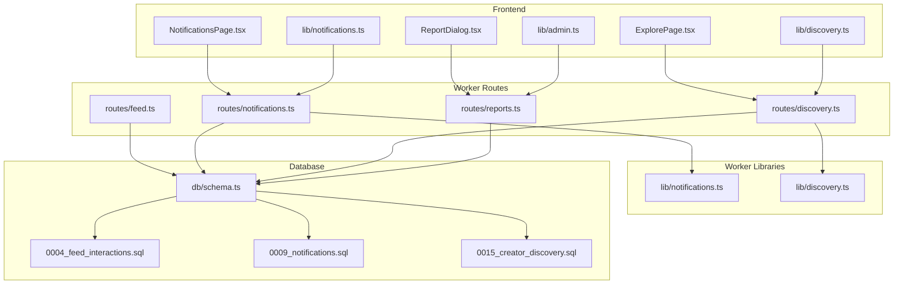
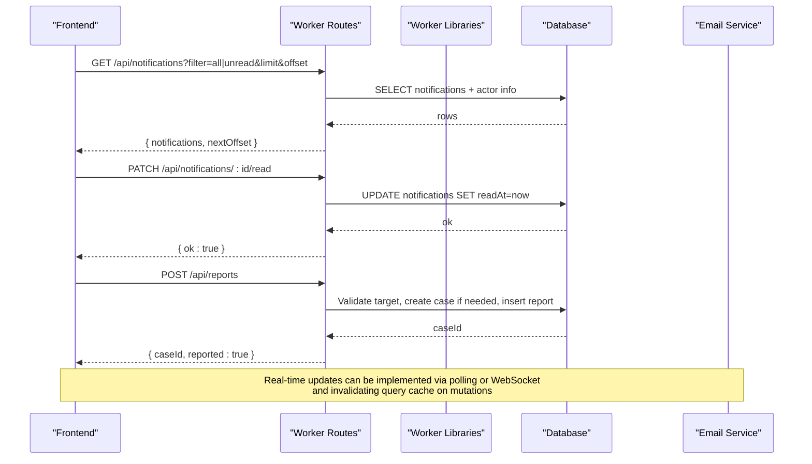
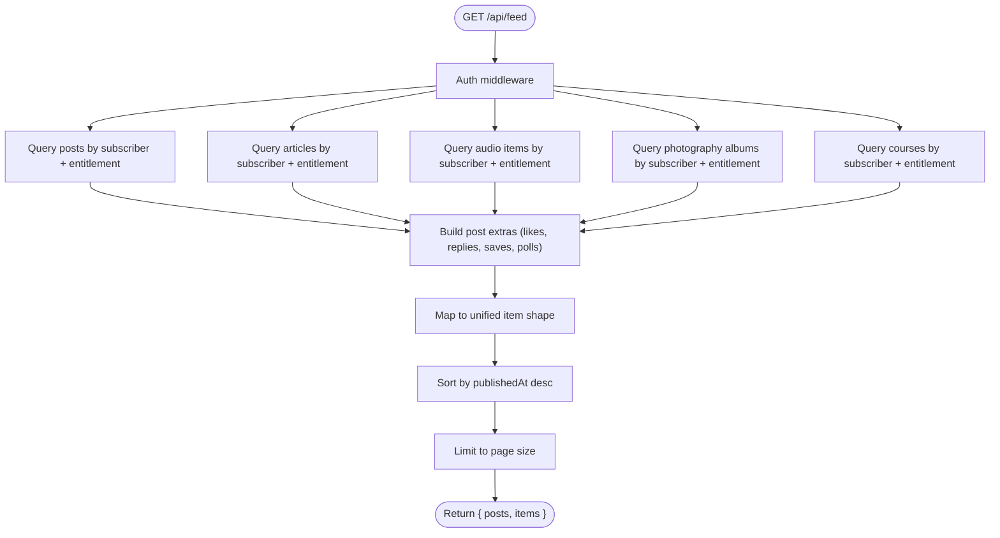
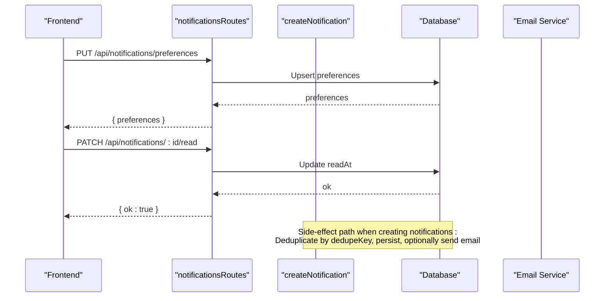
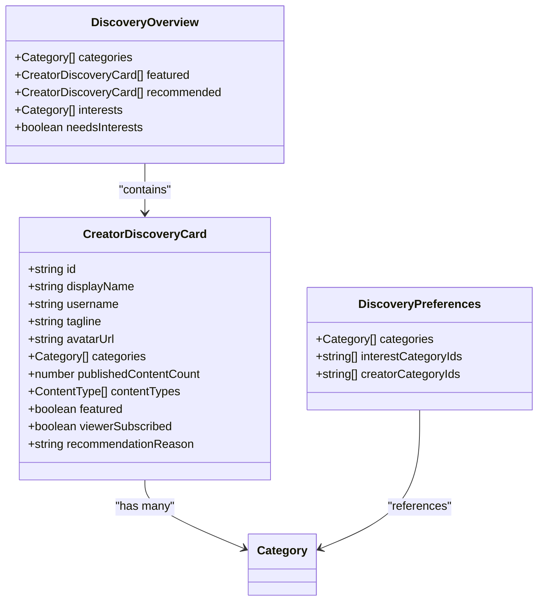
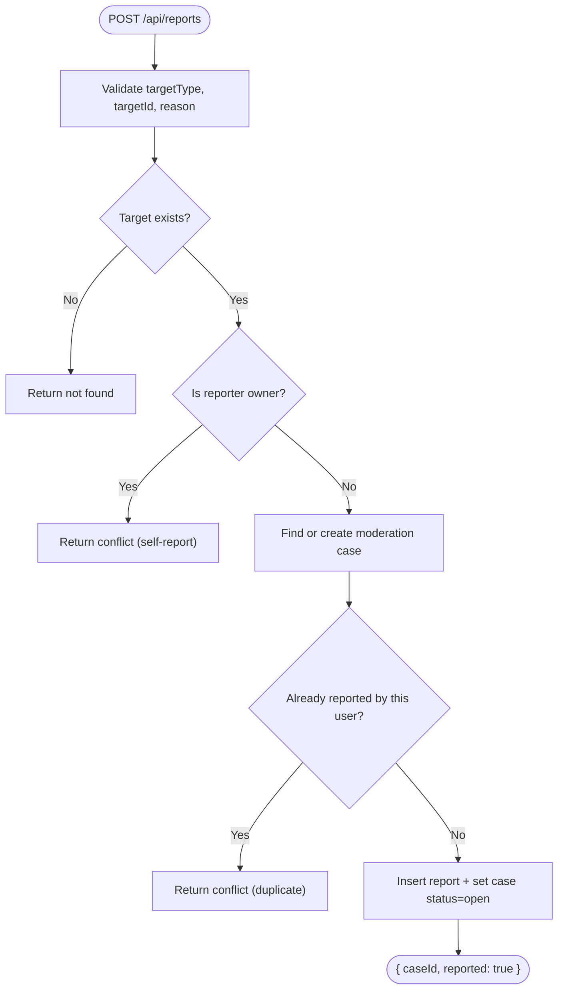
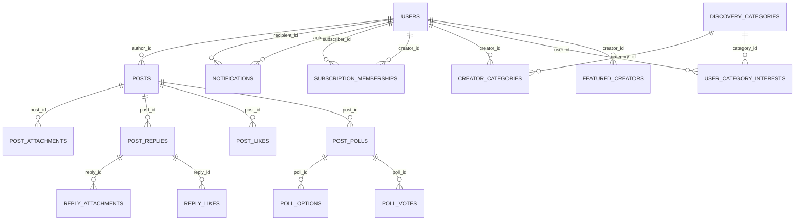
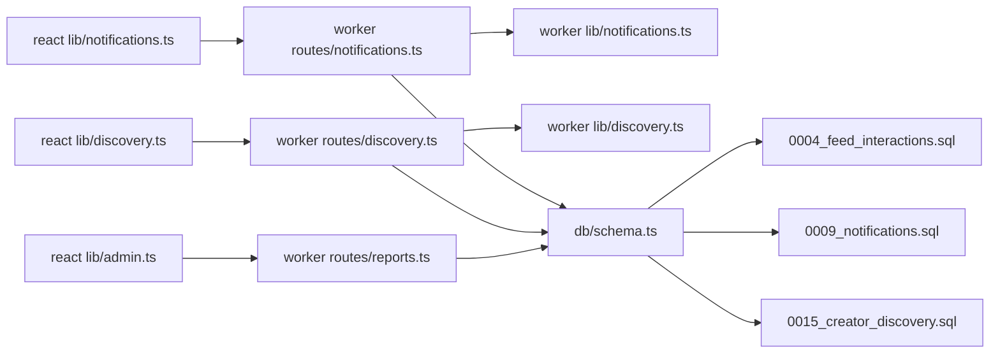

# Social Features

<cite>
**Referenced Files in This Document**
- [feed.ts](file://src/worker/routes/feed.ts)
- [notifications.ts](file://src/worker/routes/notifications.ts)
- [discovery.ts](file://src/worker/routes/discovery.ts)
- [reports.ts](file://src/worker/routes/reports.ts)
- [0004_feed_interactions.sql](file://drizzle/0004_feed_interactions.sql)
- [0009_notifications.sql](file://drizzle/0009_notifications.sql)
- [0015_creator_discovery.sql](file://drizzle/0015_creator_discovery.sql)
- [schema.ts](file://src/worker/db/schema.ts)
- [notifications.ts](file://src/worker/lib/notifications.ts)
- [discovery.ts](file://src/worker/lib/discovery.ts)
- [notifications.ts](file://src/react-app/lib/notifications.ts)
- [discovery.ts](file://src/react-app/lib/discovery.ts)
- [ReportDialog.tsx](file://src/react-app/components/ReportDialog.tsx)
- [NotificationsPage.tsx](file://src/react-app/pages/NotificationsPage.tsx)
- [ExplorePage.tsx](file://src/react-app/pages/ExplorePage.tsx)
- [admin.ts](file://src/react-app/lib/admin.ts)
</cite>

## Table of Contents
1. [Introduction](#introduction)
2. [Project Structure](#project-structure)
3. [Core Components](#core-components)
4. [Architecture Overview](#architecture-overview)
5. [Detailed Component Analysis](#detailed-component-analysis)
6. [Dependency Analysis](#dependency-analysis)
7. [Performance Considerations](#performance-considerations)
8. [Troubleshooting Guide](#troubleshooting-guide)
9. [Conclusion](#conclusion)
10. [Appendices](#appendices)

## Introduction
This document explains Zenith’s social networking features: how users interact with content (likes, replies, polls), how notifications are generated and delivered, how discovery and recommendations work, and how reporting/moderation is handled. It covers the feed generation algorithm, user relationship management via subscriptions, notification delivery channels, and content recommendation systems. It also documents API endpoints, data models, performance considerations, and frontend integration patterns for real-time updates.

## Project Structure
The social features span worker routes (APIs), backend libraries (business logic), database migrations/schema, and React frontend components/libraries. Key areas:
- Worker routes expose REST endpoints for feed, notifications, discovery, and reports.
- Backend libraries implement notification creation, email dispatch, and discovery ranking/search.
- Database schema defines tables for interactions, notifications, categories, and relationships.
- Frontend uses TanStack Query to fetch and mutate state, with UI components for notifications, discovery, and reporting.

**Diagram sources**
- [feed.ts:1-395](file://src/worker/routes/feed.ts#L1-L395)
- [notifications.ts:1-188](file://src/worker/routes/notifications.ts#L1-L188)
- [discovery.ts:1-120](file://src/worker/routes/discovery.ts#L1-L120)
- [reports.ts:1-81](file://src/worker/routes/reports.ts#L1-L81)
- [notifications.ts:1-461](file://src/worker/lib/notifications.ts#L1-L461)
- [discovery.ts:1-390](file://src/worker/lib/discovery.ts#L1-L390)
- [schema.ts:1-200](file://src/worker/db/schema.ts#L1-L200)
- [0004_feed_interactions.sql:1-123](file://drizzle/0004_feed_interactions.sql#L1-L123)
- [0009_notifications.sql:1-41](file://drizzle/0009_notifications.sql#L1-L41)
- [0015_creator_discovery.sql:1-70](file://drizzle/0015_creator_discovery.sql#L1-L70)

**Section sources**
- [feed.ts:1-395](file://src/worker/routes/feed.ts#L1-L395)
- [notifications.ts:1-188](file://src/worker/routes/notifications.ts#L1-L188)
- [discovery.ts:1-120](file://src/worker/routes/discovery.ts#L1-L120)
- [reports.ts:1-81](file://src/worker/routes/reports.ts#L1-L81)
- [notifications.ts:1-461](file://src/worker/lib/notifications.ts#L1-L461)
- [discovery.ts:1-390](file://src/worker/lib/discovery.ts#L1-L390)
- [schema.ts:1-200](file://src/worker/db/schema.ts#L1-L200)
- [0004_feed_interactions.sql:1-123](file://drizzle/0004_feed_interactions.sql#L1-L123)
- [0009_notifications.sql:1-41](file://drizzle/0009_notifications.sql#L1-L41)
- [0015_creator_discovery.sql:1-70](file://drizzle/0015_creator_discovery.sql#L1-L70)

## Core Components
- Feed Generation: Aggregates posts, articles, audio items, photography albums, and courses from creators the viewer subscribes to, applies membership entitlement checks, enriches with likes/replies/saves, and sorts by recency.
- Notifications: Persists notifications with deduplication, supports read/unread states, preferences, and optional email delivery based on category and user settings.
- Discovery & Recommendations: Provides overview (featured, recommended, categories), search with filters and sorting, and a scoring system using interests, subscriptions, and behavior signals.
- Reporting & Moderation: Accepts reports for posts, replies, or users; creates moderation cases; prevents self-reports and duplicates.

**Section sources**
- [feed.ts:1-395](file://src/worker/routes/feed.ts#L1-L395)
- [notifications.ts:1-188](file://src/worker/routes/notifications.ts#L1-L188)
- [discovery.ts:1-120](file://src/worker/routes/discovery.ts#L1-L120)
- [reports.ts:1-81](file://src/worker/routes/reports.ts#L1-L81)
- [notifications.ts:1-461](file://src/worker/lib/notifications.ts#L1-L461)
- [discovery.ts:1-390](file://src/worker/lib/discovery.ts#L1-L390)

## Architecture Overview
The system follows a clear separation:
- Frontend pages/components call typed API helpers that use TanStack Query for caching and mutations.
- Worker routes validate inputs, enforce auth, and delegate to library functions for business logic.
- Libraries perform DB queries, compute rankings, and orchestrate side effects like emails.
- Database schema enforces constraints and indexes for performance.

**Diagram sources**
- [notifications.ts:1-188](file://src/worker/routes/notifications.ts#L1-L188)
- [reports.ts:1-81](file://src/worker/routes/reports.ts#L1-L81)
- [notifications.ts:1-461](file://src/worker/lib/notifications.ts#L1-L461)

## Detailed Component Analysis

### Feed Generation Algorithm
- Queries multiple content types (posts, articles, audio, photography, courses) filtered by author subscription and membership entitlement.
- Enriches each item with like counts, reply counts, viewer liked/saved flags, and attachments/polls where applicable.
- Merges results and sorts by published timestamp, limiting to a fixed page size.

**Diagram sources**
- [feed.ts:1-395](file://src/worker/routes/feed.ts#L1-L395)

**Section sources**
- [feed.ts:1-395](file://src/worker/routes/feed.ts#L1-L395)

### Notification System
- Endpoints: list notifications (with filter and pagination), unread count, preferences get/update, mark single read, mark all read.
- Creation flow: dedupe key ensures idempotency; respects user preferences per category; optional email delivery with status tracking.
- Types include content_published, reply_created, post_liked, subscription events, schedule failures, etc.

**Diagram sources**
- [notifications.ts:1-188](file://src/worker/routes/notifications.ts#L1-L188)
- [notifications.ts:1-461](file://src/worker/lib/notifications.ts#L1-L461)

**Section sources**
- [notifications.ts:1-188](file://src/worker/routes/notifications.ts#L1-L188)
- [notifications.ts:1-461](file://src/worker/lib/notifications.ts#L1-L461)
- [0009_notifications.sql:1-41](file://drizzle/0009_notifications.sql#L1-L41)

### Content Discovery and Recommendations
- Overview returns categories, featured creators, and recommended creators tailored to viewer interests, subscriptions, and behavior.
- Search supports query text, category filter, and sorting (relevance, recommended, popular, recent).
- Recommendation scoring combines active subscribers, recent publications, and category signals weighted by interest/source.

**Diagram sources**
- [discovery.ts:1-99](file://src/react-app/lib/discovery.ts#L1-L99)
- [discovery.ts:1-390](file://src/worker/lib/discovery.ts#L1-L390)

**Section sources**
- [discovery.ts:1-120](file://src/worker/routes/discovery.ts#L1-L120)
- [discovery.ts:1-390](file://src/worker/lib/discovery.ts#L1-L390)
- [0015_creator_discovery.sql:1-70](file://drizzle/0015_creator_discovery.sql#L1-L70)

### Reporting and Moderation Tools
- Report submission validates target existence, prevents self-reporting, ensures uniqueness per reporter, and creates or reuses a moderation case.
- Returns a caseId for tracking; status transitions to open upon first report.

**Diagram sources**
- [reports.ts:1-81](file://src/worker/routes/reports.ts#L1-L81)

**Section sources**
- [reports.ts:1-81](file://src/worker/routes/reports.ts#L1-L81)

### Data Models for Social Relationships and Interactions
- Posts and related entities: posts, post_attachments, post_replies, reply_attachments, post_likes, reply_likes, post_polls, poll_options, poll_votes.
- Notifications: notifications, notification_preferences.
- Discovery: discovery_categories, creator_categories, user_category_interests, featured_creators.
- Users and subscriptions: users, subscription_memberships (used for feed filtering and entitlement checks).

**Diagram sources**
- [0004_feed_interactions.sql:1-123](file://drizzle/0004_feed_interactions.sql#L1-L123)
- [0009_notifications.sql:1-41](file://drizzle/0009_notifications.sql#L1-L41)
- [0015_creator_discovery.sql:1-70](file://drizzle/0015_creator_discovery.sql#L1-L70)
- [schema.ts:1-200](file://src/worker/db/schema.ts#L1-L200)

**Section sources**
- [0004_feed_interactions.sql:1-123](file://drizzle/0004_feed_interactions.sql#L1-L123)
- [0009_notifications.sql:1-41](file://drizzle/0009_notifications.sql#L1-L41)
- [0015_creator_discovery.sql:1-70](file://drizzle/0015_creator_discovery.sql#L1-L70)
- [schema.ts:1-200](file://src/worker/db/schema.ts#L1-L200)

## Dependency Analysis
- Feed route depends on schema tables for posts and related content, plus subscription_memberships for entitlement checks.
- Notifications route depends on notifications/notification_preferences tables and user table for actor details.
- Discovery route depends on discovery_categories, creator_categories, user_category_interests, and users; uses membership entitlement SQL for filtering.
- Reports route depends on posts, post_replies, users, moderation_cases, and content_reports.

**Diagram sources**
- [notifications.ts:1-79](file://src/react-app/lib/notifications.ts#L1-L79)
- [discovery.ts:1-99](file://src/react-app/lib/discovery.ts#L1-L99)
- [admin.ts:1-69](file://src/react-app/lib/admin.ts#L1-L69)
- [notifications.ts:1-188](file://src/worker/routes/notifications.ts#L1-L188)
- [discovery.ts:1-120](file://src/worker/routes/discovery.ts#L1-L120)
- [reports.ts:1-81](file://src/worker/routes/reports.ts#L1-L81)
- [notifications.ts:1-461](file://src/worker/lib/notifications.ts#L1-L461)
- [discovery.ts:1-390](file://src/worker/lib/discovery.ts#L1-L390)
- [schema.ts:1-200](file://src/worker/db/schema.ts#L1-L200)
- [0004_feed_interactions.sql:1-123](file://drizzle/0004_feed_interactions.sql#L1-L123)
- [0009_notifications.sql:1-41](file://drizzle/0009_notifications.sql#L1-L41)
- [0015_creator_discovery.sql:1-70](file://drizzle/0015_creator_discovery.sql#L1-L70)

**Section sources**
- [notifications.ts:1-79](file://src/react-app/lib/notifications.ts#L1-L79)
- [discovery.ts:1-99](file://src/react-app/lib/discovery.ts#L1-L99)
- [admin.ts:1-69](file://src/react-app/lib/admin.ts#L1-L69)
- [notifications.ts:1-188](file://src/worker/routes/notifications.ts#L1-L188)
- [discovery.ts:1-120](file://src/worker/routes/discovery.ts#L1-L120)
- [reports.ts:1-81](file://src/worker/routes/reports.ts#L1-L81)
- [notifications.ts:1-461](file://src/worker/lib/notifications.ts#L1-L461)
- [discovery.ts:1-390](file://src/worker/lib/discovery.ts#L1-L390)
- [schema.ts:1-200](file://src/worker/db/schema.ts#L1-L200)
- [0004_feed_interactions.sql:1-123](file://drizzle/0004_feed_interactions.sql#L1-L123)
- [0009_notifications.sql:1-41](file://drizzle/0009_notifications.sql#L1-L41)
- [0015_creator_discovery.sql:1-70](file://drizzle/0015_creator_discovery.sql#L1-L70)

## Performance Considerations
- Feed generation:
  - Uses targeted joins and WHERE clauses to limit to subscribed creators and active accounts.
  - Enrichment via a single buildPostExtras call aggregates likes/replies/saves across IDs to minimize round trips.
  - Sorting and slicing at the end ensure consistent pagination.
- Notifications:
  - Dedupe keys prevent duplicate entries and reduce write amplification.
  - Indexes on recipient_id, read_at, created_at optimize listing and unread counting.
  - Email sending is conditional and tracked with status fields to avoid repeated attempts.
- Discovery:
  - Raw SQL leverages indexes on active/display_order and category-user mappings.
  - Ranking pools are bounded (e.g., up to 1000 candidates) before scoring to control CPU usage.
  - Count queries separate total computation from result loading for efficient pagination.
- General:
  - Use of Unix timestamps and integer columns reduces storage overhead.
  - Batch operations and prepared statements improve throughput.

[No sources needed since this section provides general guidance]

## Troubleshooting Guide
- Notifications not appearing:
  - Verify dedupe_key uniqueness and that the actor is not the same as the recipient.
  - Check notification preferences per category; some categories may be disabled for email.
  - Inspect email_status and email_error fields for delivery issues.
- Feed empty:
  - Ensure the viewer has active subscriptions to creators who have published content.
  - Confirm membership entitlement conditions allow access to specific content types.
- Discovery results missing:
  - Validate that categories are active and correctly associated with creators.
  - For recommendations, ensure user interests, subscriptions, or behavior signals exist.
- Reports failing:
  - Confirm target exists and is not owned by the reporter.
  - Avoid duplicate reports from the same user for the same target.

**Section sources**
- [notifications.ts:1-461](file://src/worker/lib/notifications.ts#L1-L461)
- [notifications.ts:1-188](file://src/worker/routes/notifications.ts#L1-L188)
- [feed.ts:1-395](file://src/worker/routes/feed.ts#L1-L395)
- [discovery.ts:1-390](file://src/worker/lib/discovery.ts#L1-L390)
- [reports.ts:1-81](file://src/worker/routes/reports.ts#L1-L81)

## Conclusion
Zenith’s social features provide a robust foundation for content interaction, notifications, discovery, and moderation. The architecture balances performance through careful indexing, deduplication, and bounded computations while offering flexible APIs for frontend integration. Real-time updates can be layered on top using polling or WebSockets with cache invalidation strategies.

[No sources needed since this section summarizes without analyzing specific files]

## Appendices

### API Endpoints Summary
- Feed
  - GET /api/feed
- Notifications
  - GET /api/notifications?filter=all|unread&limit&offset
  - GET /api/notifications/unread-count
  - GET /api/notifications/preferences
  - PUT /api/notifications/preferences
  - PATCH /api/notifications/:notificationId/read
  - POST /api/notifications/read-all
- Discovery
  - GET /api/discovery
  - GET /api/discovery/creators?q=&category=&sort=recommendation|popular|recent|relevance&page=&pageSize=
  - GET /api/discovery/preferences
  - PUT /api/discovery/interests
  - PUT /api/discovery/creator-categories
- Reports
  - POST /api/reports

**Section sources**
- [feed.ts:1-395](file://src/worker/routes/feed.ts#L1-L395)
- [notifications.ts:1-188](file://src/worker/routes/notifications.ts#L1-L188)
- [discovery.ts:1-120](file://src/worker/routes/discovery.ts#L1-L120)
- [reports.ts:1-81](file://src/worker/routes/reports.ts#L1-L81)

### Frontend Integration Examples
- Notifications
  - Use queryOptions for list and unread count; invalidate caches on mutations; render rows with avatars and timestamps; support mark-read actions.
- Discovery
  - Fetch overview and preferences; render featured and recommended cards; handle search form and sort selection; update interests via mutation.
- Reporting
  - Open dialog, select reason, submit report; show success/error toasts; close dialog on success.

**Section sources**
- [NotificationsPage.tsx:1-164](file://src/react-app/pages/NotificationsPage.tsx#L1-L164)
- [notifications.ts:1-79](file://src/react-app/lib/notifications.ts#L1-L79)
- [ExplorePage.tsx:1-223](file://src/react-app/pages/ExplorePage.tsx#L1-L223)
- [discovery.ts:1-99](file://src/react-app/lib/discovery.ts#L1-L99)
- [ReportDialog.tsx:1-92](file://src/react-app/components/ReportDialog.tsx#L1-L92)
- [admin.ts:1-69](file://src/react-app/lib/admin.ts#L1-L69)