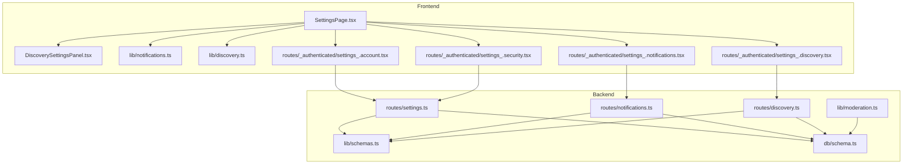
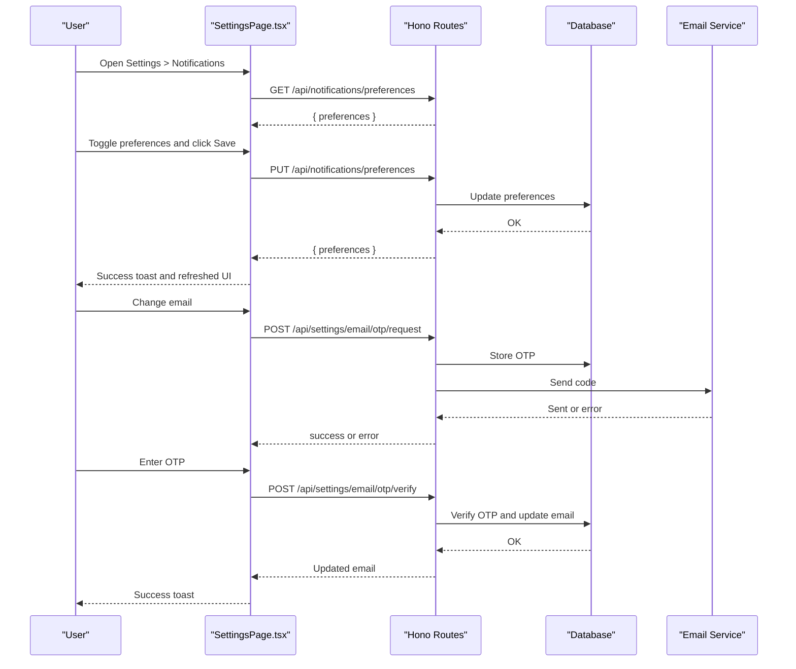
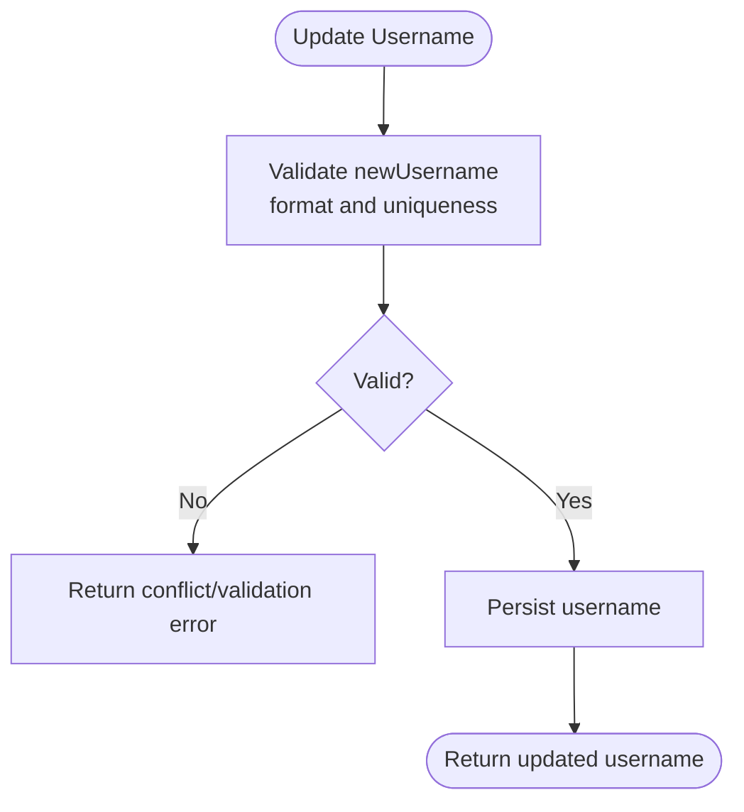
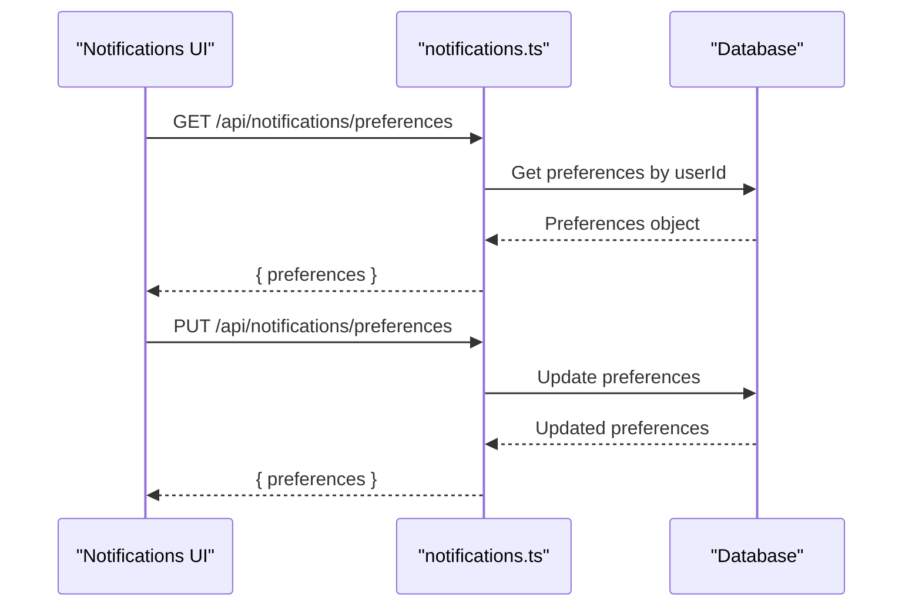
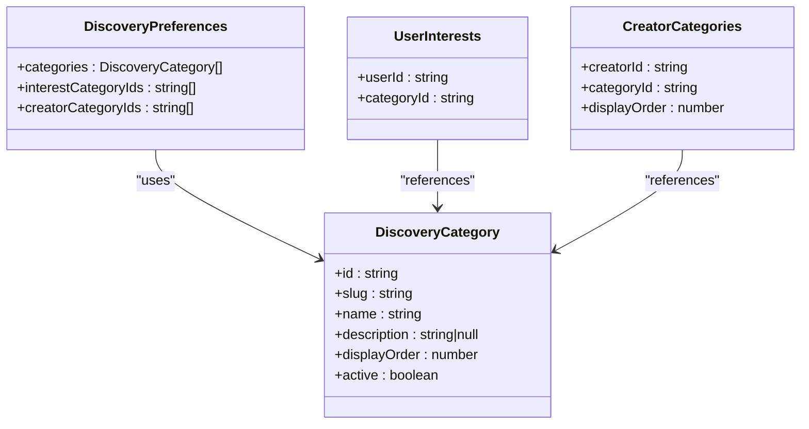
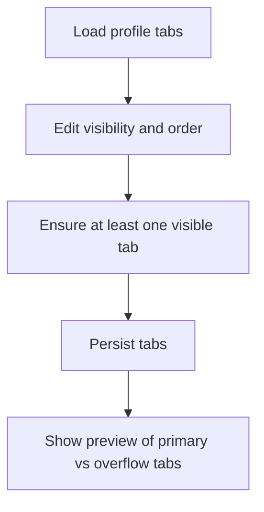
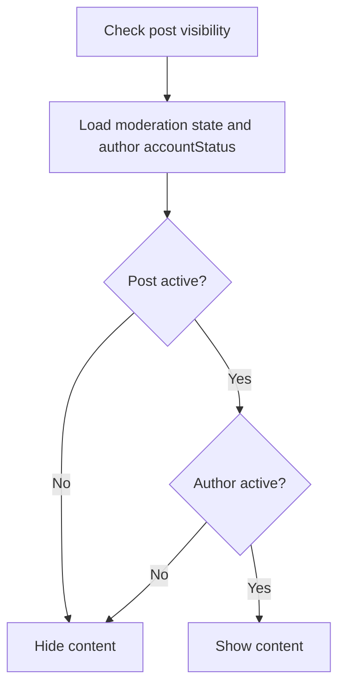
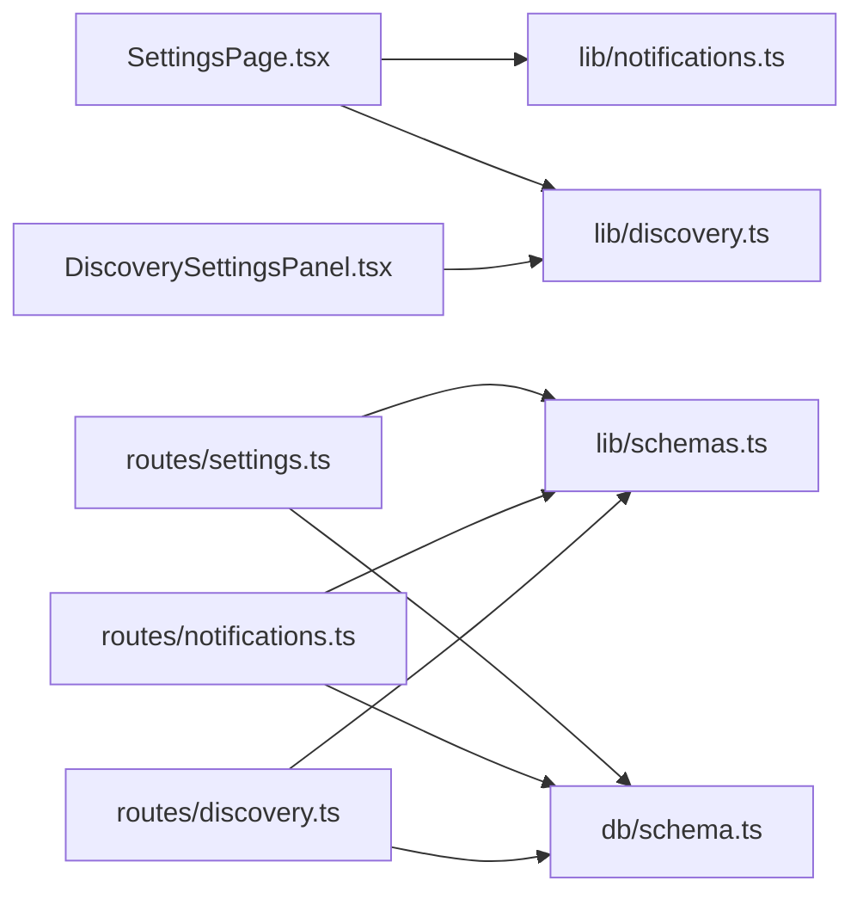

# Account Settings

<cite>
**Referenced Files in This Document**
- [settings.ts](file://src/worker/routes/settings.ts)
- [notifications.ts](file://src/worker/routes/notifications.ts)
- [discovery.ts](file://src/worker/routes/discovery.ts)
- [schema.ts](file://src/worker/db/schema.ts)
- [moderation.ts](file://src/worker/lib/moderation.ts)
- [schemas.ts](file://src/worker/lib/schemas.ts)
- [SettingsPage.tsx](file://src/react-app/pages/SettingsPage.tsx)
- [DiscoverySettingsPanel.tsx](file://src/react-app/components/DiscoverySettingsPanel.tsx)
- [notifications.ts](file://src/react-app/lib/notifications.ts)
- [discovery.ts](file://src/react-app/lib/discovery.ts)
- [settings_.account.tsx](file://src/react-app/routes/_authenticated/settings_.account.tsx)
- [settings_.security.tsx](file://src/react-app/routes/_authenticated/settings_.security.tsx)
- [settings_.notifications.tsx](file://src/react-app/routes/_authenticated/settings_.notifications.tsx)
- [settings_.discovery.tsx](file://src/react-app/routes/_authenticated/settings_.discovery.tsx)
</cite>

## Table of Contents
1. [Introduction](#introduction)
2. [Project Structure](#project-structure)
3. [Core Components](#core-components)
4. [Architecture Overview](#architecture-overview)
5. [Detailed Component Analysis](#detailed-component-analysis)
6. [Dependency Analysis](#dependency-analysis)
7. [Performance Considerations](#performance-considerations)
8. [Troubleshooting Guide](#troubleshooting-guide)
9. [Conclusion](#conclusion)
10. [Appendices](#appendices)

## Introduction
This document explains Zenith’s account settings system with a focus on:
- Security settings (passwordless sign-in via email OTP, username and profile updates)
- Notification preferences (email delivery toggles per category)
- Discovery settings (interest categories for recommendations and public creator categories)
- Privacy controls (profile visibility through tabs and discovery categories)
- Moderation integration (account status active/suspended and its effect on content visibility)
- Validation, update flows, permission checks, and API endpoints
- How settings influence user experience features like content discovery and notification delivery

## Project Structure
The account settings feature spans the React frontend and the worker backend:
- Frontend routes render dedicated sections under /settings/* and call APIs to read/update settings
- Backend Hono routes implement validation, persistence, and business logic
- Shared Zod schemas enforce input constraints across endpoints
- Database schema defines users, notifications, discovery categories, and related tables

**Diagram sources**
- [SettingsPage.tsx](file://src/react-app/pages/SettingsPage.tsx)
- [DiscoverySettingsPanel.tsx](file://src/react-app/components/DiscoverySettingsPanel.tsx)
- [notifications.ts](file://src/react-app/lib/notifications.ts)
- [discovery.ts](file://src/react-app/lib/discovery.ts)
- [settings_.account.tsx](file://src/react-app/routes/_authenticated/settings_.account.tsx)
- [settings_.security.tsx](file://src/react-app/routes/_authenticated/settings_.security.tsx)
- [settings_.notifications.tsx](file://src/react-app/routes/_authenticated/settings_.notifications.tsx)
- [settings_.discovery.tsx](file://src/react-app/routes/_authenticated/settings_.discovery.tsx)
- [settings.ts](file://src/worker/routes/settings.ts)
- [notifications.ts](file://src/worker/routes/notifications.ts)
- [discovery.ts](file://src/worker/routes/discovery.ts)
- [schemas.ts](file://src/worker/lib/schemas.ts)
- [schema.ts](file://src/worker/db/schema.ts)
- [moderation.ts](file://src/worker/lib/moderation.ts)

**Section sources**
- [SettingsPage.tsx](file://src/react-app/pages/SettingsPage.tsx)
- [settings_.account.tsx](file://src/react-app/routes/_authenticated/settings_.account.tsx)
- [settings_.security.tsx](file://src/react-app/routes/_authenticated/settings_.security.tsx)
- [settings_.notifications.tsx](file://src/react-app/routes/_authenticated/settings_.notifications.tsx)
- [settings_.discovery.tsx](file://src/react-app/routes/_authenticated/settings_.discovery.tsx)
- [settings.ts](file://src/worker/routes/settings.ts)
- [notifications.ts](file://src/worker/routes/notifications.ts)
- [discovery.ts](file://src/worker/routes/discovery.ts)
- [schemas.ts](file://src/worker/lib/schemas.ts)
- [schema.ts](file://src/worker/db/schema.ts)
- [moderation.ts](file://src/worker/lib/moderation.ts)

## Core Components
- Settings UI: A single page that renders sections for Profile, Profile Tabs, Discovery, Account, Notifications, and Security. It manages forms, mutations, and query invalidation.
- Notification Preferences UI: Fetches and saves per-category email toggles; integrates with backend preferences endpoint.
- Discovery Settings UI: Manages interest categories and, for creators, public creator categories; persists selections via dedicated endpoints.
- Backend Settings Routes: Handles avatar upload, username changes, profile updates, and secure email change flow using OTP.
- Backend Notifications Routes: Provides list, unread count, mark read, and preferences management.
- Backend Discovery Routes: Exposes overview, search, preferences, and category selection endpoints with role-based access control.
- Data Models and Validation: Centralized Zod schemas define strict input contracts for all settings endpoints.
- Moderation Integration: Account status fields are part of the user model and influence content visibility checks.

**Section sources**
- [SettingsPage.tsx](file://src/react-app/pages/SettingsPage.tsx)
- [DiscoverySettingsPanel.tsx](file://src/react-app/components/DiscoverySettingsPanel.tsx)
- [notifications.ts](file://src/react-app/lib/notifications.ts)
- [discovery.ts](file://src/react-app/lib/discovery.ts)
- [settings.ts](file://src/worker/routes/settings.ts)
- [notifications.ts](file://src/worker/routes/notifications.ts)
- [discovery.ts](file://src/worker/routes/discovery.ts)
- [schemas.ts](file://src/worker/lib/schemas.ts)
- [schema.ts](file://src/worker/db/schema.ts)
- [moderation.ts](file://src/worker/lib/moderation.ts)

## Architecture Overview
The settings system follows a clear separation between UI and server:
- The React app uses TanStack Query to fetch and cache data, and mutations to persist changes.
- The worker exposes REST endpoints protected by authentication middleware and role checks where required.
- Input validation is enforced via Zod schemas before database operations.
- Persistence uses Drizzle ORM against SQLite (D1), with explicit indexes for performance.

**Diagram sources**
- [SettingsPage.tsx](file://src/react-app/pages/SettingsPage.tsx)
- [notifications.ts](file://src/worker/routes/notifications.ts)
- [settings.ts](file://src/worker/routes/settings.ts)

## Detailed Component Analysis

### Security Settings
- Passwordless sign-in: Password update endpoint is disabled; users authenticate via short-lived email codes.
- Username updates: Validated against format rules and uniqueness constraints.
- Profile updates: Display name, tagline, and social links validated and persisted.
- Avatar upload: Validates content type and size, uploads to storage, updates DB reference, and returns URL.
- Secure email change: Two-step OTP flow ensures ownership verification before updating email.

**Diagram sources**
- [settings.ts](file://src/worker/routes/settings.ts)
- [schemas.ts](file://src/worker/lib/schemas.ts)

**Section sources**
- [settings.ts](file://src/worker/routes/settings.ts)
- [schemas.ts](file://src/worker/lib/schemas.ts)

### Notification Preferences
- Read preferences: Returns current email toggles per category.
- Update preferences: Persists toggles after validation.
- Mark read: Single or bulk marking of notifications as read.
- Unread count: Fast count query for UI badges.

**Diagram sources**
- [notifications.ts](file://src/worker/routes/notifications.ts)
- [notifications.ts](file://src/react-app/lib/notifications.ts)

**Section sources**
- [notifications.ts](file://src/worker/routes/notifications.ts)
- [notifications.ts](file://src/react-app/lib/notifications.ts)

### Discovery Settings
- Preferences: Lists available categories and user-selected interests; creators can set public categories.
- Interests update: Validates active categories and enforces maximum limits.
- Creator categories: Role-gated endpoint; validates active categories and order.

**Diagram sources**
- [discovery.ts](file://src/react-app/lib/discovery.ts)
- [schema.ts](file://src/worker/db/schema.ts)

**Section sources**
- [discovery.ts](file://src/worker/routes/discovery.ts)
- [discovery.ts](file://src/react-app/lib/discovery.ts)
- [DiscoverySettingsPanel.tsx](file://src/react-app/components/DiscoverySettingsPanel.tsx)
- [schema.ts](file://src/worker/db/schema.ts)

### Privacy Controls and Profile Tabs
- Profile tabs: Creators can reorder and toggle visibility of profile sections; at least one tab must remain visible.
- Public identity: Display name, tagline, and social links shape what visitors see.
- Discovery categories: For creators, selected categories appear publicly on profiles and discovery cards.

**Diagram sources**
- [settings.ts](file://src/worker/routes/settings.ts)
- [SettingsPage.tsx](file://src/react-app/pages/SettingsPage.tsx)

**Section sources**
- [settings.ts](file://src/worker/routes/settings.ts)
- [SettingsPage.tsx](file://src/react-app/pages/SettingsPage.tsx)

### Moderation System Integration
- Account status: Users have an accountStatus field (active/suspended). Suspended accounts affect content visibility.
- Post visibility check: Content is visible only if post moderation status is active and author accountStatus is active.

**Diagram sources**
- [moderation.ts](file://src/worker/lib/moderation.ts)
- [schema.ts](file://src/worker/db/schema.ts)

**Section sources**
- [moderation.ts](file://src/worker/lib/moderation.ts)
- [schema.ts](file://src/worker/db/schema.ts)

## Dependency Analysis
- Frontend dependencies:
  - SettingsPage depends on route modules for each section and shared libraries for notifications and discovery.
  - DiscoverySettingsPanel depends on discovery library functions and categories picker.
- Backend dependencies:
  - All routes depend on auth middleware and Zod schemas for validation.
  - Discovery routes enforce role checks for creator-only endpoints.
  - Notifications routes rely on preference helpers and DB queries.
- Data dependencies:
  - Users table includes accountStatus, role, and profile fields.
  - Discovery categories and user/creator category mappings drive recommendation and visibility logic.
  - Notifications table stores per-user items and email delivery status.

**Diagram sources**
- [SettingsPage.tsx](file://src/react-app/pages/SettingsPage.tsx)
- [DiscoverySettingsPanel.tsx](file://src/react-app/components/DiscoverySettingsPanel.tsx)
- [notifications.ts](file://src/react-app/lib/notifications.ts)
- [discovery.ts](file://src/react-app/lib/discovery.ts)
- [settings.ts](file://src/worker/routes/settings.ts)
- [notifications.ts](file://src/worker/routes/notifications.ts)
- [discovery.ts](file://src/worker/routes/discovery.ts)
- [schemas.ts](file://src/worker/lib/schemas.ts)
- [schema.ts](file://src/worker/db/schema.ts)

**Section sources**
- [SettingsPage.tsx](file://src/react-app/pages/SettingsPage.tsx)
- [DiscoverySettingsPanel.tsx](file://src/react-app/components/DiscoverySettingsPanel.tsx)
- [notifications.ts](file://src/react-app/lib/notifications.ts)
- [discovery.ts](file://src/react-app/lib/discovery.ts)
- [settings.ts](file://src/worker/routes/settings.ts)
- [notifications.ts](file://src/worker/routes/notifications.ts)
- [discovery.ts](file://src/worker/routes/discovery.ts)
- [schemas.ts](file://src/worker/lib/schemas.ts)
- [schema.ts](file://src/worker/db/schema.ts)

## Performance Considerations
- Use pagination and limits for notifications listing to avoid large payloads.
- Cache preferences and discovery data with appropriate stale times to reduce redundant requests.
- Leverage indexes defined in schema for frequent queries (e.g., account status, category ordering).
- Avoid unnecessary re-renders by invalidating only relevant query keys after mutations.

[No sources needed since this section provides general guidance]

## Troubleshooting Guide
- Email change OTP failures:
  - If OTP delivery fails, the endpoint returns a service unavailable response; ensure email routing is configured correctly.
  - Invalid or expired OTPs return specific error codes; prompt users to request a new code.
- Username conflicts:
  - Duplicate usernames result in conflict responses; suggest alternative names.
- Avatar upload errors:
  - Unsupported media types or oversized files trigger validation errors; guide users to adjust file type and size.
- Notification preferences save errors:
  - Ensure network connectivity and valid payload; check toast messages for detailed errors.
- Discovery category validation:
  - Only active categories can be selected; verify category IDs and limits.

**Section sources**
- [settings.ts](file://src/worker/routes/settings.ts)
- [notifications.ts](file://src/worker/routes/notifications.ts)
- [discovery.ts](file://src/worker/routes/discovery.ts)
- [schemas.ts](file://src/worker/lib/schemas.ts)

## Conclusion
Zenith’s account settings system provides a robust, secure, and user-friendly way to manage profile details, security, notifications, and discovery preferences. Strict validation, role-based permissions, and moderation-aware visibility ensure a safe and personalized experience. The modular architecture separates concerns clearly, enabling maintainable updates and scalable growth.

[No sources needed since this section summarizes without analyzing specific files]

## Appendices

### API Endpoints Summary
- Settings
  - GET /api/settings/profile-tabs
  - PUT /api/settings/profile-tabs
  - PUT /api/settings/avatar
  - PUT /api/settings/password (disabled)
  - POST /api/settings/email/otp/request
  - POST /api/settings/email/otp/verify
  - PUT /api/settings/email (redirect to OTP flow)
  - PUT /api/settings/username
  - PUT /api/settings/profile
- Notifications
  - GET /api/notifications?filter=all|unread&limit&offset
  - GET /api/notifications/unread-count
  - GET /api/notifications/preferences
  - PUT /api/notifications/preferences
  - PATCH /api/notifications/:notificationId/read
  - POST /api/notifications/read-all
- Discovery
  - GET /api/discovery
  - GET /api/discovery/creators?q&category&sort&page&pageSize
  - GET /api/discovery/preferences
  - PUT /api/discovery/interests
  - PUT /api/discovery/creator-categories

**Section sources**
- [settings.ts](file://src/worker/routes/settings.ts)
- [notifications.ts](file://src/worker/routes/notifications.ts)
- [discovery.ts](file://src/worker/routes/discovery.ts)

### Data Model Highlights
- Users
  - Fields include id, email, role, accountStatus, displayName, username, tagline, avatarUrl, socialLinks, timestamps.
- Notifications
  - Per-user items with metadata, actor info, email delivery status, and read tracking.
- Discovery
  - Categories with active flags and display order; user interests and creator categories mapped to categories.
- Profile Tabs
  - Creator-specific tab configuration with visibility and display order.

**Section sources**
- [schema.ts](file://src/worker/db/schema.ts)

### Common Settings Updates and Tasks
- Update profile: Submit display name, tagline, and social links; validate URLs and persist.
- Change username: Validate format and uniqueness; update and refresh cached user data.
- Upload avatar: Validate type and size; upload to storage; update DB and invalidate caches.
- Change email: Request OTP, send code, verify OTP, update email, and refresh session data.
- Adjust notification preferences: Toggle email-enabled and category-specific toggles; persist and refresh.
- Manage discovery interests: Select up to the allowed number of categories; persist and refresh discovery data.
- Configure creator categories: For creators, select up to three public categories; persist and refresh profile and discovery views.

**Section sources**
- [SettingsPage.tsx](file://src/react-app/pages/SettingsPage.tsx)
- [DiscoverySettingsPanel.tsx](file://src/react-app/components/DiscoverySettingsPanel.tsx)
- [notifications.ts](file://src/react-app/lib/notifications.ts)
- [discovery.ts](file://src/react-app/lib/discovery.ts)
- [settings.ts](file://src/worker/routes/settings.ts)
- [notifications.ts](file://src/worker/routes/notifications.ts)
- [discovery.ts](file://src/worker/routes/discovery.ts)