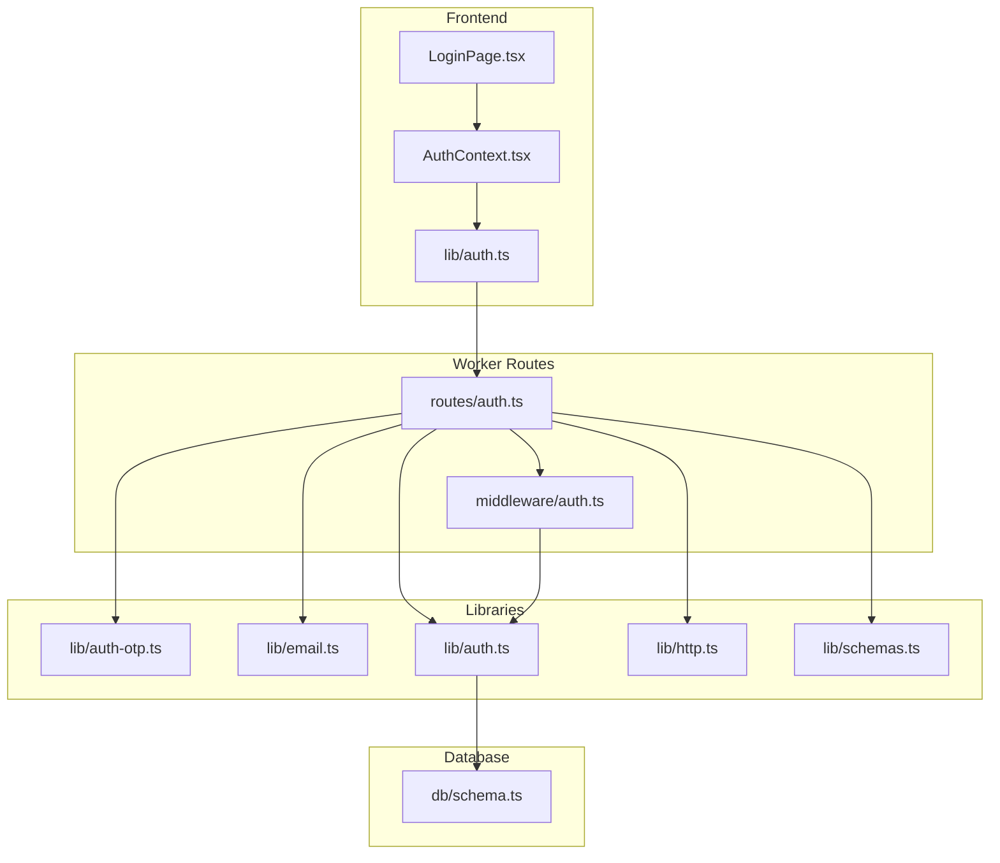
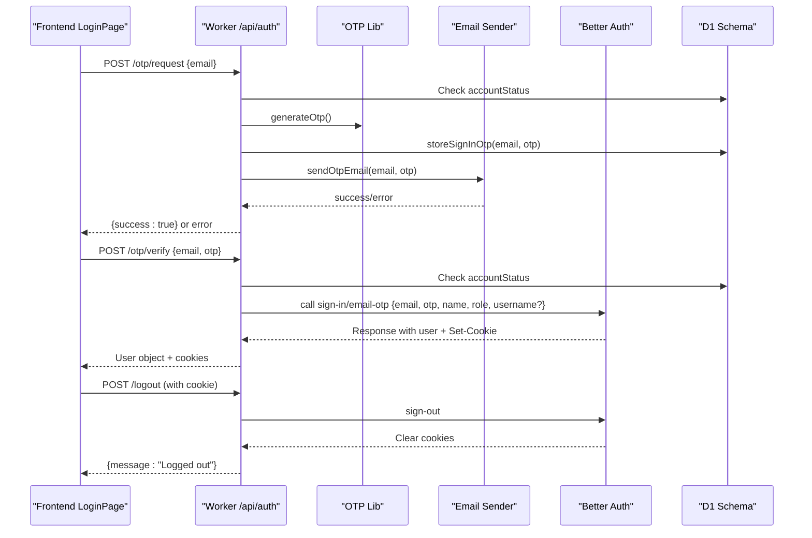
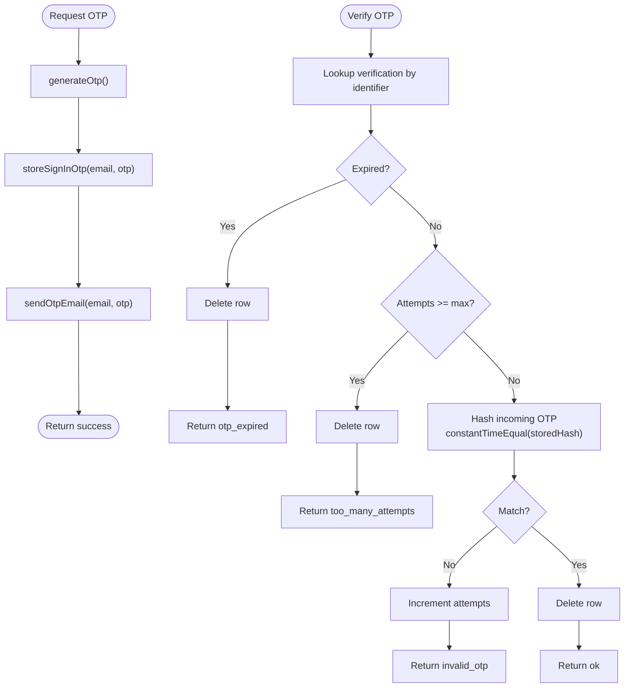
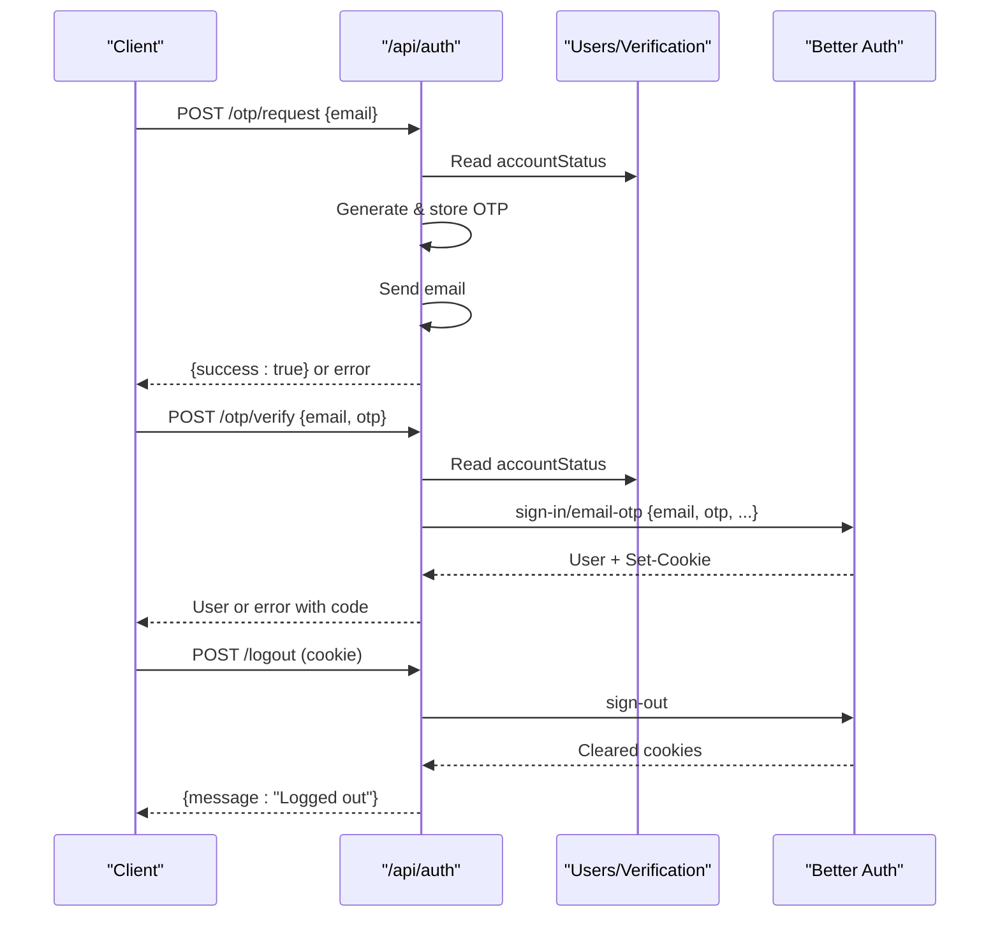
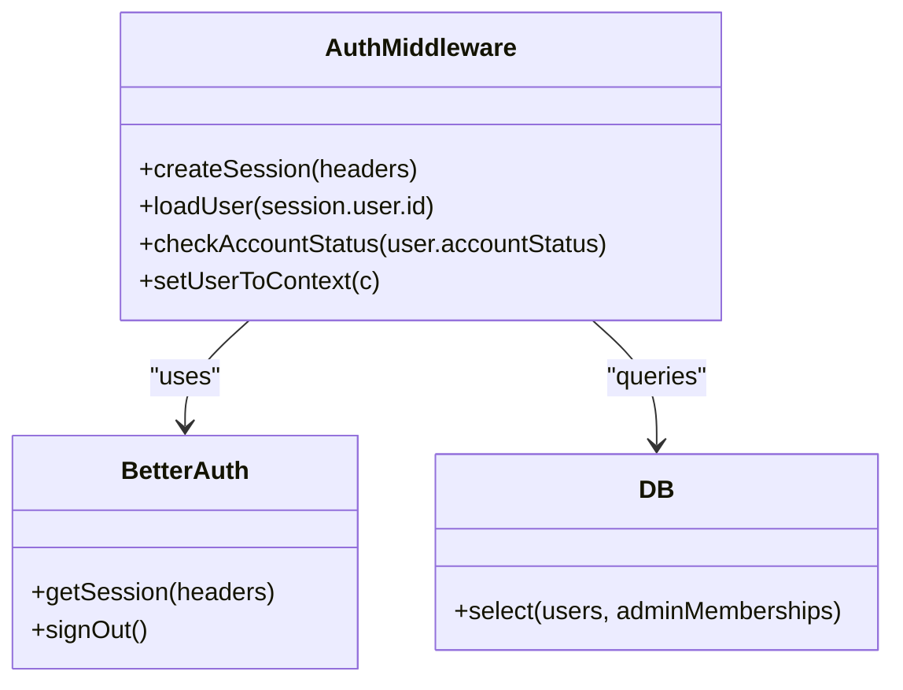
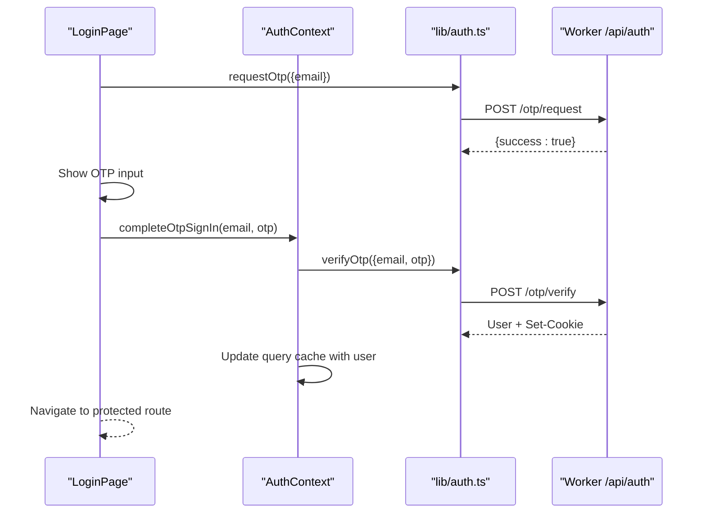
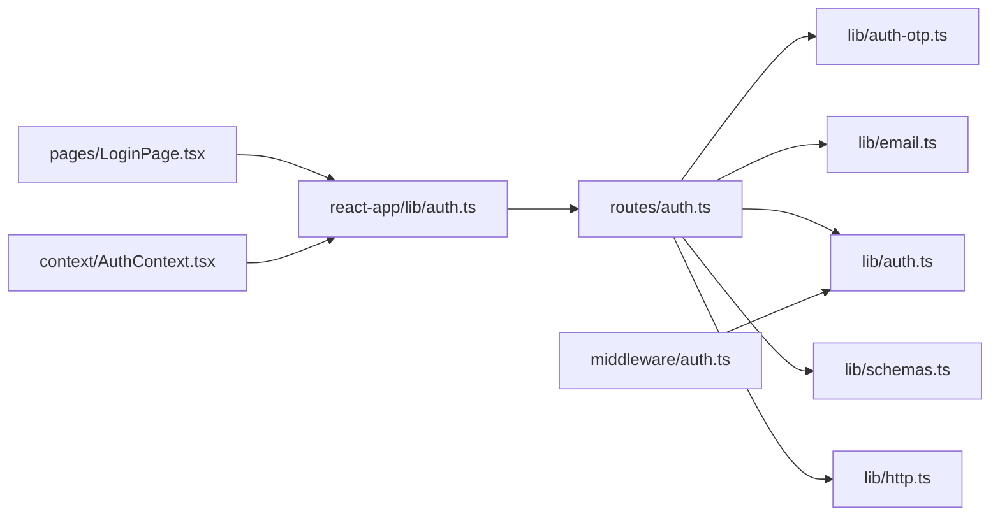

# Authentication System

<cite>
**Referenced Files in This Document**
- [auth.ts](file://src/worker/routes/auth.ts)
- [auth-otp.ts](file://src/worker/lib/auth-otp.ts)
- [auth.ts](file://src/worker/lib/auth.ts)
- [email.ts](file://src/worker/lib/email.ts)
- [schema.ts](file://src/worker/db/schema.ts)
- [schemas.ts](file://src/worker/lib/schemas.ts)
- [http.ts](file://src/worker/lib/http.ts)
- [auth.ts](file://src/worker/middleware/auth.ts)
- [auth.ts](file://src/react-app/lib/auth.ts)
- [LoginPage.tsx](file://src/react-app/pages/LoginPage.tsx)
- [AuthContext.tsx](file://src/react-app/context/AuthContext.tsx)
- [002-throttle-otp-requests.md](file://plans/002-throttle-otp-requests.md)
</cite>

## Table of Contents
1. Introduction
2. Project Structure
3. Core Components
4. Architecture Overview
5. Detailed Component Analysis
6. Dependency Analysis
7. Performance Considerations
8. Troubleshooting Guide
9. Conclusion
10. Appendices

## Introduction
This document explains Zenith’s email OTP-based authentication system. It covers the complete flow from OTP generation and email delivery to verification, session management, and Better Auth integration. It also documents custom endpoints (/otp/request, /otp/verify, /logout), automatic user registration on first login, security measures (OTP attempts, account suspension checks, secure cookies), middleware for protecting routes, and API specifications with request/response schemas and error codes.

## Project Structure
The authentication system spans backend Worker routes, libraries, middleware, database schema, and frontend React components:
- Backend routes define OTP endpoints and delegate to Better Auth for session handling.
- Libraries implement OTP generation/hashing, email delivery, and Better Auth configuration.
- Middleware validates sessions and enforces account status and roles.
- Database schema defines users, sessions, and verification tokens.
- Frontend provides UI flows for requesting OTPs, entering codes, and managing logout.

**Diagram sources**
- [auth.ts:1-259](file://src/worker/routes/auth.ts#L1-L259)
- [auth.ts:1-57](file://src/worker/middleware/auth.ts#L1-L57)
- [auth-otp.ts:1-124](file://src/worker/lib/auth-otp.ts#L1-L124)
- [email.ts:1-56](file://src/worker/lib/email.ts#L1-L56)
- [auth.ts:1-80](file://src/worker/lib/auth.ts#L1-L80)
- [schema.ts:107-165](file://src/worker/db/schema.ts#L107-L165)
- [schemas.ts:1-24](file://src/worker/lib/schemas.ts#L1-L24)
- [http.ts:1-80](file://src/worker/lib/http.ts#L1-L80)
- [LoginPage.tsx:1-158](file://src/react-app/pages/LoginPage.tsx#L1-L158)
- [AuthContext.tsx:1-90](file://src/react-app/context/AuthContext.tsx#L1-L90)
- [auth.ts:1-55](file://src/react-app/lib/auth.ts#L1-L55)

**Section sources**
- [auth.ts:1-259](file://src/worker/routes/auth.ts#L1-L259)
- [auth.ts:1-57](file://src/worker/middleware/auth.ts#L1-L57)
- [auth-otp.ts:1-124](file://src/worker/lib/auth-otp.ts#L1-L124)
- [email.ts:1-56](file://src/worker/lib/email.ts#L1-L56)
- [auth.ts:1-80](file://src/worker/lib/auth.ts#L1-L80)
- [schema.ts:107-165](file://src/worker/db/schema.ts#L107-L165)
- [schemas.ts:1-24](file://src/worker/lib/schemas.ts#L1-L24)
- [http.ts:1-80](file://src/worker/lib/http.ts#L1-L80)
- [LoginPage.tsx:1-158](file://src/react-app/pages/LoginPage.tsx#L1-L158)
- [AuthContext.tsx:1-90](file://src/react-app/context/AuthContext.tsx#L1-L90)
- [auth.ts:1-55](file://src/react-app/lib/auth.ts#L1-L55)

## Core Components
- OTP utilities: generate secure 6-digit codes, hash them safely, store and verify with attempt limits and expiration.
- Email delivery: send transactional emails via Cloudflare Email binding.
- Better Auth integration: configure email OTP plugin, map user fields, and manage sessions.
- Custom routes: expose /otp/request, /otp/verify, /logout; protect sensitive endpoints; handle auto-registration.
- Middleware: validate sessions, enforce account status and role requirements.
- Schemas: validate inputs for OTP requests and verifications.
- HTTP helpers: standardized error responses and validation hooks.

**Section sources**
- [auth-otp.ts:1-124](file://src/worker/lib/auth-otp.ts#L1-L124)
- [email.ts:1-56](file://src/worker/lib/email.ts#L1-L56)
- [auth.ts:1-80](file://src/worker/lib/auth.ts#L1-L80)
- [auth.ts:1-259](file://src/worker/routes/auth.ts#L1-L259)
- [auth.ts:1-57](file://src/worker/middleware/auth.ts#L1-L57)
- [schemas.ts:1-24](file://src/worker/lib/schemas.ts#L1-L24)
- [http.ts:1-80](file://src/worker/lib/http.ts#L1-L80)

## Architecture Overview
The OTP sign-in flow is orchestrated by the frontend calling backend endpoints that coordinate OTP storage, email delivery, Better Auth verification, and session cookie issuance.

**Diagram sources**
- [auth.ts:135-220](file://src/worker/routes/auth.ts#L135-L220)
- [auth-otp.ts:26-77](file://src/worker/lib/auth-otp.ts#L26-L77)
- [email.ts:45-56](file://src/worker/lib/email.ts#L45-L56)
- [auth.ts:9-38](file://src/worker/lib/auth.ts#L9-L38)
- [schema.ts:107-165](file://src/worker/db/schema.ts#L107-L165)

## Detailed Component Analysis

### OTP Generation, Storage, and Verification
- Generates a cryptographically secure 6-digit code.
- Hashes OTP using SHA-256 and stores it with an identifier and expiry.
- Tracks failed attempts and enforces maximum attempts before invalidating the OTP.
- Uses constant-time comparison to prevent timing attacks.

**Diagram sources**
- [auth-otp.ts:26-124](file://src/worker/lib/auth-otp.ts#L26-L124)

**Section sources**
- [auth-otp.ts:1-124](file://src/worker/lib/auth-otp.ts#L1-L124)

### Email Delivery
- Builds a plain-text email with the OTP and sends it via Cloudflare Email binding.
- Provides helper functions for base URL resolution and availability checks.

**Section sources**
- [email.ts:1-56](file://src/worker/lib/email.ts#L1-L56)

### Better Auth Integration
- Disables password auth and enables email OTP plugin with configured OTP length, expiry, and allowed attempts.
- Maps user fields to application schema (displayName, avatarUrl, etc.).
- Stores hashed OTPs and delegates session creation to Better Auth.

**Section sources**
- [auth.ts:1-80](file://src/worker/lib/auth.ts#L1-L80)

### Custom Authentication Endpoints
- POST /otp/request
  - Validates email, checks account status, generates and stores OTP, sends email.
  - Returns success or specific error if email delivery fails.
- POST /otp/verify
  - Validates email and OTP, checks account status, calls Better Auth sign-in/email-otp.
  - On success, returns user data and sets session cookies; on failure, returns typed error codes.
- POST /logout
  - Requires valid session, calls Better Auth sign-out, clears cookies, returns confirmation.

**Diagram sources**
- [auth.ts:135-220](file://src/worker/routes/auth.ts#L135-L220)
- [auth.ts:9-38](file://src/worker/lib/auth.ts#L9-L38)

**Section sources**
- [auth.ts:127-220](file://src/worker/routes/auth.ts#L127-L220)

### Automatic User Registration on First Login
- When verifying OTP for a new email, the system creates a subscriber account with a generated unique username and default role.
- Username generation avoids collisions and falls back to a random suffix if needed.

**Section sources**
- [auth.ts:82-94](file://src/worker/routes/auth.ts#L82-L94)
- [auth.ts:180-212](file://src/worker/routes/auth.ts#L180-L212)

### Session Management and Protected Routes
- Sessions are managed by Better Auth and validated via middleware.
- Middleware fetches session, loads user details including role and account status, and rejects unauthorized or suspended accounts.
- Role-based protection available via requireRole middleware.

**Diagram sources**
- [auth.ts:23-50](file://src/worker/middleware/auth.ts#L23-L50)
- [auth.ts:9-38](file://src/worker/lib/auth.ts#L9-L38)
- [schema.ts:107-165](file://src/worker/db/schema.ts#L107-L165)

**Section sources**
- [auth.ts:1-57](file://src/worker/middleware/auth.ts#L1-L57)

### Security Measures
- OTP rate limiting: planned via Cloudflare Worker rate limit bindings for normalized email fingerprint and client IP; currently not implemented in code but documented in plan.
- Account suspension checks: enforced at both OTP request and verification steps, and within middleware.
- Secure cookie handling: Better Auth manages session cookies; response headers are forwarded to ensure proper cookie propagation.

**Section sources**
- [auth.ts:135-164](file://src/worker/routes/auth.ts#L135-L164)
- [auth.ts:168-212](file://src/worker/routes/auth.ts#L168-L212)
- [auth.ts:23-50](file://src/worker/middleware/auth.ts#L23-L50)
- [002-throttle-otp-requests.md:1-164](file://plans/002-throttle-otp-requests.md#L1-L164)

### Frontend Authentication Workflow
- LoginPage orchestrates two-step flow: request OTP then enter code.
- AuthContext manages mutation for OTP verification, updates current user cache, and handles logout.
- lib/auth exposes typed functions for OTP request, verification, and logout.

**Diagram sources**
- [LoginPage.tsx:34-51](file://src/react-app/pages/LoginPage.tsx#L34-L51)
- [AuthContext.tsx:51-61](file://src/react-app/context/AuthContext.tsx#L51-L61)
- [auth.ts:36-46](file://src/react-app/lib/auth.ts#L36-L46)
- [auth.ts:135-212](file://src/worker/routes/auth.ts#L135-L212)

**Section sources**
- [LoginPage.tsx:1-158](file://src/react-app/pages/LoginPage.tsx#L1-L158)
- [AuthContext.tsx:1-90](file://src/react-app/context/AuthContext.tsx#L1-L90)
- [auth.ts:1-55](file://src/react-app/lib/auth.ts#L1-L55)

## Dependency Analysis
- Routes depend on OTP library, email sender, Better Auth, and schema validators.
- Middleware depends on Better Auth session retrieval and DB queries.
- Frontend depends on lib/auth functions which call Worker endpoints.

**Diagram sources**
- [auth.ts:1-20](file://src/worker/routes/auth.ts#L1-L20)
- [auth.ts:1-10](file://src/worker/middleware/auth.ts#L1-L10)
- [auth.ts:1-10](file://src/react-app/lib/auth.ts#L1-L10)
- [LoginPage.tsx:1-15](file://src/react-app/pages/LoginPage.tsx#L1-L15)
- [AuthContext.tsx:1-10](file://src/react-app/context/AuthContext.tsx#L1-L10)

**Section sources**
- [auth.ts:1-20](file://src/worker/routes/auth.ts#L1-L20)
- [auth.ts:1-10](file://src/worker/middleware/auth.ts#L1-L10)
- [auth.ts:1-10](file://src/react-app/lib/auth.ts#L1-L10)
- [LoginPage.tsx:1-15](file://src/react-app/pages/LoginPage.tsx#L1-L15)
- [AuthContext.tsx:1-10](file://src/react-app/context/AuthContext.tsx#L1-L10)

## Performance Considerations
- OTP hashing uses efficient SHA-256 and constant-time comparison to avoid timing leaks.
- Database operations are minimal and targeted (lookup by identifier, delete after use).
- Email sending is asynchronous and should be monitored for delivery failures; errors return appropriate status codes without persisting OTP state when delivery fails.
- Rate limiting is planned to reduce abuse; once implemented, it will prevent unnecessary DB writes and email sends under load.

[No sources needed since this section provides general guidance]

## Troubleshooting Guide
Common issues and resolutions:
- Invalid or expired OTP: Ensure OTP is entered within 5 minutes and matches the latest sent code.
- Too many incorrect attempts: Request a new OTP after exceeding allowed attempts.
- Account suspended: Requests and verifications are blocked; contact support.
- Email delivery unavailable: Use a verified recipient address; check environment configuration for email binding.
- Logout not clearing session: Ensure cookies are included in subsequent requests; confirm sign-out endpoint was called.

Error response shape:
- All errors follow a consistent JSON structure with code, message, and optional details.

**Section sources**
- [auth.ts:135-212](file://src/worker/routes/auth.ts#L135-L212)
- [http.ts:1-80](file://src/worker/lib/http.ts#L1-L80)

## Conclusion
Zenith’s OTP-based authentication leverages Better Auth for robust session management while providing a streamlined email-first sign-in experience. The system enforces strong security through hashed OTPs, attempt limits, and account status checks. Future enhancements include rate limiting to further mitigate abuse. The modular design separates concerns across routes, libraries, middleware, and frontend, enabling maintainability and clarity.

[No sources needed since this section summarizes without analyzing specific files]

## Appendices

### API Specifications

- POST /otp/request
  - Request body:
    - email: string (valid email)
  - Success response:
    - { success: true }
  - Error responses:
    - 403 account_suspended: Account is suspended.
    - 503 otp_email_unavailable: Email delivery failed.
    - 422 validation_failed: Invalid email format.

- POST /otp/verify
  - Request body:
    - email: string (valid email)
    - otp: string (6 digits)
  - Success response:
    - User object with id, email, role, displayName, username, and other profile fields.
    - Sets session cookies.
  - Error responses:
    - 400 invalid_otp: Code is invalid or expired.
    - 403 too_many_otp_attempts: Exceeded allowed attempts.
    - 403 account_suspended: Account is suspended.
    - 422 validation_failed: Invalid payload.

- POST /logout
  - Headers: Cookie (session)
  - Success response:
    - { message: "Logged out" }
  - Error responses:
    - 401 unauthorized: No active session.

- GET /me
  - Headers: Cookie (session)
  - Success response:
    - Full user profile including role, adminRole, and profile fields.
  - Error responses:
    - 401 unauthorized: No active session.
    - 404 not_found: User not found.

Notes:
- All error responses follow a standard JSON structure with error.code, error.message, and optional error.details.
- Cookies are set by Better Auth and propagated through jsonWithAuthCookies helper.

**Section sources**
- [auth.ts:135-220](file://src/worker/routes/auth.ts#L135-L220)
- [http.ts:1-80](file://src/worker/lib/http.ts#L1-L80)
- [auth.ts:9-38](file://src/worker/lib/auth.ts#L9-L38)

### Common Workflows

- Sign-up (first login):
  - Request OTP with email.
  - Enter OTP to verify; system creates subscriber account automatically.
  - Receive user object and session cookie.

- Login (existing user):
  - Request OTP with email.
  - Enter OTP to verify; receive user object and session cookie.

- Logout:
  - Call /logout with session cookie.
  - Session cleared; navigate away from protected routes.

- Handling authentication errors:
  - Display user-friendly messages based on error codes.
  - For invalid/expired OTP, prompt to resend code.
  - For suspended accounts, inform user to contact support.

**Section sources**
- [LoginPage.tsx:34-51](file://src/react-app/pages/LoginPage.tsx#L34-L51)
- [AuthContext.tsx:51-61](file://src/react-app/context/AuthContext.tsx#L51-L61)
- [auth.ts:36-46](file://src/react-app/lib/auth.ts#L36-L46)
- [auth.ts:135-212](file://src/worker/routes/auth.ts#L135-L212)