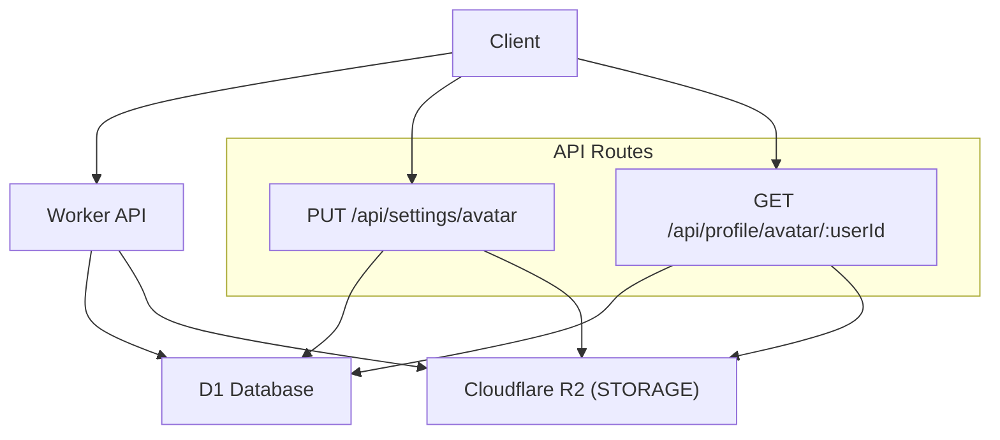
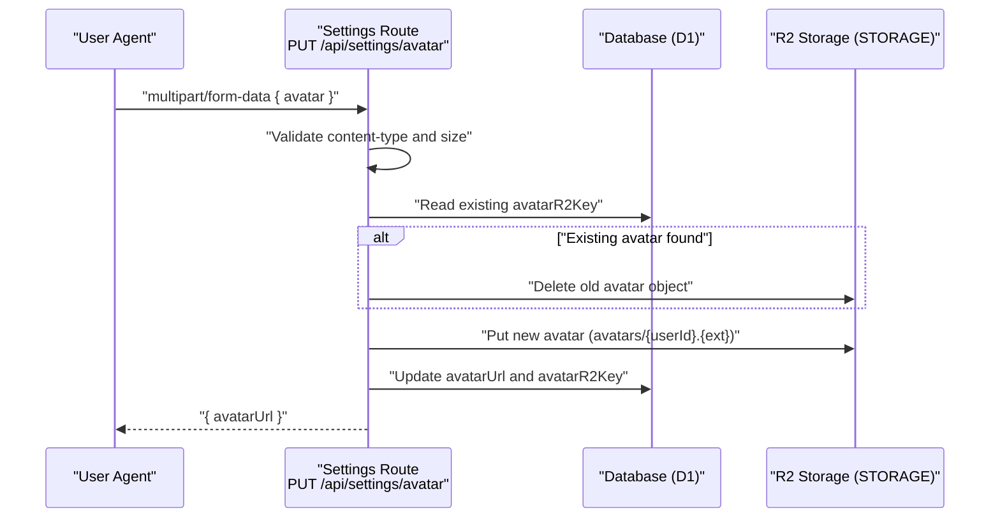
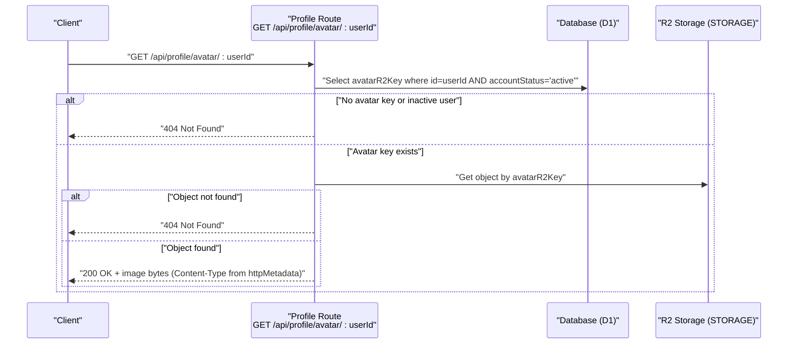
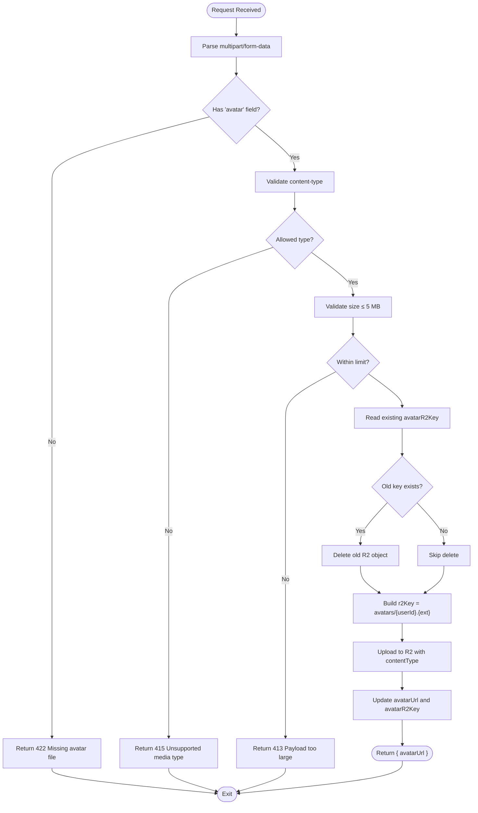
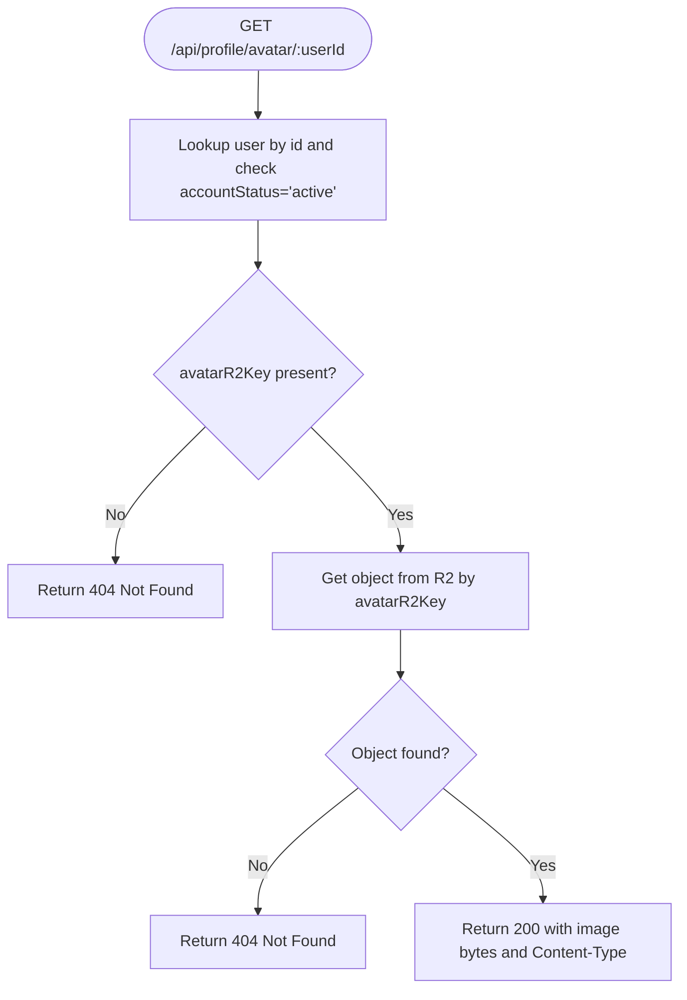
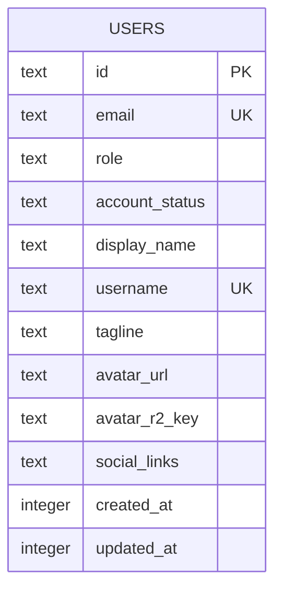
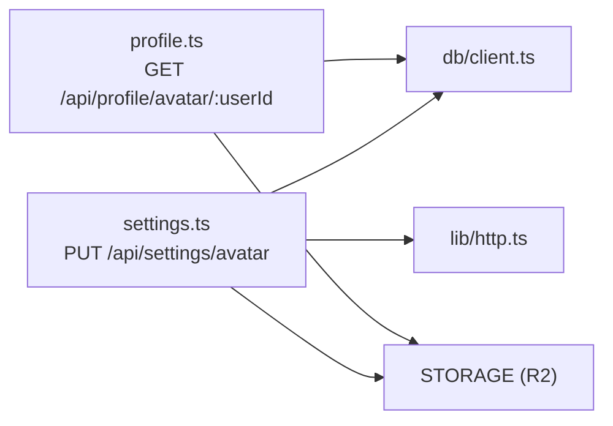

# Avatar Management

<cite>
**Referenced Files in This Document**
- [profile.ts](file://src/worker/routes/profile.ts)
- [settings.ts](file://src/worker/routes/settings.ts)
- [schema.ts](file://src/worker/db/schema.ts)
- [http.ts](file://src/worker/lib/http.ts)
- [wrangler.json](file://wrangler.json)
</cite>

## Table of Contents
1. [Introduction](#introduction)
2. [Project Structure](#project-structure)
3. [Core Components](#core-components)
4. [Architecture Overview](#architecture-overview)
5. [Detailed Component Analysis](#detailed-component-analysis)
6. [Dependency Analysis](#dependency-analysis)
7. [Performance Considerations](#performance-considerations)
8. [Troubleshooting Guide](#troubleshooting-guide)
9. [Conclusion](#conclusion)

## Introduction
This document explains Zenith’s avatar management system, covering how users upload avatars to Cloudflare R2, how the GET /avatar/:userId endpoint serves avatars through a CDN-friendly path, and how the database tracks avatar storage via the avatarR2Key field. It also documents file validation rules (supported formats and size limits), error handling for missing or failed uploads, and security considerations around file uploads.

## Project Structure
The avatar feature spans two primary routes:
- Upload: PUT /api/settings/avatar (authenticated)
- Retrieval: GET /api/profile/avatar/:userId (public)

Storage is handled by Cloudflare R2 via an environment binding named STORAGE. The user record stores both a public URL path and the R2 object key.

**Diagram sources**
- [profile.ts:18-39](file://src/worker/routes/profile.ts#L18-L39)
- [settings.ts:66-133](file://src/worker/routes/settings.ts#L66-L133)
- [wrangler.json:60-65](file://wrangler.json#L60-L65)

**Section sources**
- [profile.ts:18-39](file://src/worker/routes/profile.ts#L18-L39)
- [settings.ts:66-133](file://src/worker/routes/settings.ts#L66-L133)
- [wrangler.json:60-65](file://wrangler.json#L60-L65)

## Core Components
- Avatar upload endpoint (PUT /api/settings/avatar):
  - Requires authentication.
  - Accepts multipart/form-data with a single file field named avatar.
  - Validates content type and size.
  - Deletes previous avatar from R2 if present.
  - Stores new avatar under avatars/{userId}.{ext}.
  - Updates user.avatarUrl and user.avatarR2Key.
- Avatar retrieval endpoint (GET /api/profile/avatar/:userId):
  - Public endpoint.
  - Looks up user by id and ensures accountStatus is active.
  - Returns the raw image bytes with correct Content-Type from R2 metadata.
  - Returns 404 if no avatar exists or object is missing.

**Section sources**
- [settings.ts:66-133](file://src/worker/routes/settings.ts#L66-L133)
- [profile.ts:18-39](file://src/worker/routes/profile.ts#L18-L39)

## Architecture Overview
The avatar workflow integrates three layers:
- HTTP layer: Hono routes handle requests and responses.
- Data layer: Drizzle ORM queries D1 for user records and avatar keys.
- Storage layer: Cloudflare R2 provides object storage; the STORAGE binding is used to read/write objects.

**Diagram sources**
- [settings.ts:66-133](file://src/worker/routes/settings.ts#L66-L133)

**Diagram sources**
- [profile.ts:18-39](file://src/worker/routes/profile.ts#L18-L39)

## Detailed Component Analysis

### Avatar Upload (PUT /api/settings/avatar)
- Authentication: Protected by authMiddleware.
- Input parsing: Parses multipart/form-data; expects a field named avatar.
- Validation:
  - Allowed types: image/jpeg, image/png, image/webp.
  - Maximum size: 5 MB.
- Storage behavior:
  - Reads existing avatarR2Key and deletes the old R2 object if present.
  - Determines extension from content type.
  - Writes new object to avatars/{userId}.{ext} with proper contentType metadata.
- Database update:
  - Sets avatarUrl to /api/profile/avatar/{userId}.
  - Sets avatarR2Key to the new R2 object key.
- Response: JSON with avatarUrl.

**Diagram sources**
- [settings.ts:66-133](file://src/worker/routes/settings.ts#L66-L133)

**Section sources**
- [settings.ts:66-133](file://src/worker/routes/settings.ts#L66-L133)

### Avatar Retrieval (GET /api/profile/avatar/:userId)
- Purpose: Serve the avatar image directly from R2.
- Behavior:
  - Validates userId parameter.
  - Queries user by id and ensures accountStatus is active.
  - If no avatarR2Key or inactive user, returns 404.
  - Retrieves object from R2 using avatarR2Key.
  - If object not found, returns 404.
  - Returns image bytes with Content-Type from object.httpMetadata.

**Diagram sources**
- [profile.ts:18-39](file://src/worker/routes/profile.ts#L18-L39)

**Section sources**
- [profile.ts:18-39](file://src/worker/routes/profile.ts#L18-L39)

### Data Model: Users and avatarR2Key
- The users table includes:
  - avatarUrl: public-facing URL path for the avatar.
  - avatarR2Key: R2 object key pointing to the stored image.
- On upload, both fields are updated to reflect the new avatar state.

**Diagram sources**
- [schema.ts:5-32](file://src/worker/db/schema.ts#L5-L32)

**Section sources**
- [schema.ts:5-32](file://src/worker/db/schema.ts#L5-L32)

### Error Handling Utilities
- Standardized error responses are provided for common cases:
  - payloadTooLarge for oversized files.
  - unsupportedMediaType for invalid content types.
  - notFound for missing resources.
  - errorResponse for custom codes/messages.

**Section sources**
- [http.ts:1-80](file://src/worker/lib/http.ts#L1-L80)

### Configuration and Storage Binding
- Cloudflare R2 bucket is bound as STORAGE in wrangler.json.
- Both local and production environments define the binding and bucket names.

**Section sources**
- [wrangler.json:60-65](file://wrangler.json#L60-L65)
- [wrangler.json:107-112](file://wrangler.json#L107-L112)

## Dependency Analysis
- Settings route depends on:
  - Database client for reading/writing user records.
  - R2 STORAGE binding for object operations.
  - HTTP utilities for consistent error responses.
- Profile route depends on:
  - Database client for user lookup.
  - R2 STORAGE binding for object retrieval.

**Diagram sources**
- [settings.ts:66-133](file://src/worker/routes/settings.ts#L66-L133)
- [profile.ts:18-39](file://src/worker/routes/profile.ts#L18-L39)
- [http.ts:1-80](file://src/worker/lib/http.ts#L1-L80)

**Section sources**
- [settings.ts:66-133](file://src/worker/routes/settings.ts#L66-L133)
- [profile.ts:18-39](file://src/worker/routes/profile.ts#L18-L39)
- [http.ts:1-80](file://src/worker/lib/http.ts#L1-L80)

## Performance Considerations
- Minimal processing: No server-side image resizing or transformation is performed; images are stored as uploaded.
- Efficient reads: Retrieval reads directly from R2 with appropriate Content-Type metadata, avoiding extra conversions.
- Single write path: Upload writes once to R2 and updates one row in D1.
- Potential improvements:
  - Add server-side image optimization (e.g., WebP conversion, resizing) before upload to reduce bandwidth and storage costs.
  - Implement background cleanup jobs to ensure orphaned R2 objects are removed if DB updates fail.

[No sources needed since this section provides general guidance]

## Troubleshooting Guide
Common issues and resolutions:
- Missing avatar file:
  - Cause: Form does not include the 'avatar' field.
  - Symptom: 422 response with validation_failed code.
  - Fix: Ensure the form sends a file field named avatar.
- Unsupported media type:
  - Cause: File type is not image/jpeg, image/png, or image/webp.
  - Symptom: 415 response with unsupported_media_type code.
  - Fix: Convert or re-export the image to a supported format.
- Payload too large:
  - Cause: File exceeds 5 MB.
  - Symptom: 413 response with payload_too_large code.
  - Fix: Compress or resize the image before uploading.
- Not found on retrieval:
  - Cause: User has no avatarR2Key, user is not active, or R2 object missing.
  - Symptom: 404 response.
  - Fix: Verify user status, ensure upload succeeded, and confirm R2 object exists at the stored key.
- Storage failures:
  - Cause: R2 put/get/delete errors.
  - Symptom: Server errors or inconsistent state.
  - Fix: Retry logic on client side; monitor logs; verify R2 bucket permissions and availability.

**Section sources**
- [settings.ts:66-133](file://src/worker/routes/settings.ts#L66-L133)
- [profile.ts:18-39](file://src/worker/routes/profile.ts#L18-L39)
- [http.ts:1-80](file://src/worker/lib/http.ts#L1-L80)

## Conclusion
Zenith’s avatar system leverages Cloudflare R2 for durable, scalable storage and exposes a simple, secure upload flow alongside a fast, CDN-friendly retrieval endpoint. The design keeps server-side processing minimal while ensuring data consistency between the database and object storage. Proper validation and standardized error handling provide clear feedback to clients, and the architecture supports future enhancements such as image optimization and lifecycle policies.