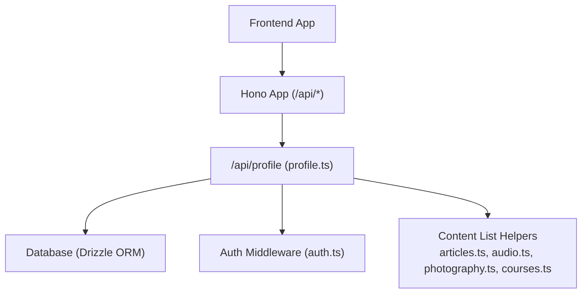
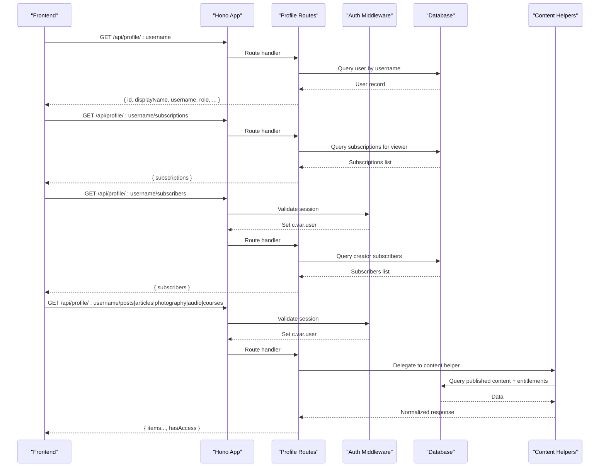
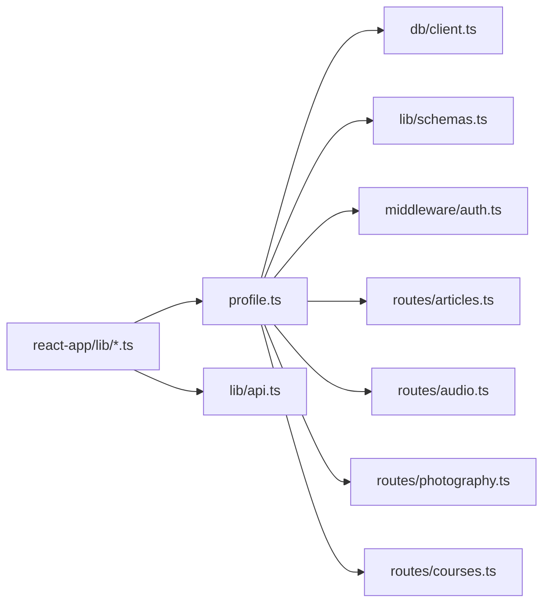

# Profile API Endpoints

<cite>
**Referenced Files in This Document**
- [index.ts](file://src/worker/index.ts)
- [profile.ts](file://src/worker/routes/profile.ts)
- [auth.ts](file://src/worker/middleware/auth.ts)
- [schemas.ts](file://src/worker/lib/schemas.ts)
- [api.ts](file://src/react-app/lib/api.ts)
- [ProfilePage.tsx](file://src/react-app/pages/ProfilePage.tsx)
- [u.$username.tsx](file://src/react-app/routes/_authenticated/u.$username.tsx)
- [articles.ts](file://src/react-app/lib/articles.ts)
- [audio.ts](file://src/react-app/lib/audio.ts)
- [photography.ts](file://src/react-app/lib/photography.ts)
- [courses.ts](file://src/react-app/lib/courses.ts)
- [posts.ts](file://src/react-app/lib/posts.ts)
</cite>

## Table of Contents
1. Introduction
2. Project Structure
3. Core Components
4. Architecture Overview
5. Detailed Component Analysis
6. Dependency Analysis
7. Performance Considerations
8. Troubleshooting Guide
9. Conclusion

## Introduction
This document provides comprehensive API documentation for Zenith’s profile management endpoints. It covers all profile-related routes including basic profile data, subscription information, creator subscribers, and content-specific endpoints such as posts, articles, photography, audio, and courses. For each endpoint, it specifies HTTP methods, URL patterns, authentication requirements, request/response schemas, error codes, example calls, and integration patterns for frontend consumption.

## Project Structure
The profile endpoints are implemented in the worker (serverless) layer and consumed by the React application via typed client helpers. The main app mounts the profile routes under /api/profile.

**Diagram sources**
- [index.ts:24-45](file://src/worker/index.ts#L24-L45)
- [profile.ts:17-18](file://src/worker/routes/profile.ts#L17-L18)
- [auth.ts:23-50](file://src/worker/middleware/auth.ts#L23-L50)

**Section sources**
- [index.ts:24-45](file://src/worker/index.ts#L24-L45)

## Core Components
- Profile routes module defines all GET endpoints under /api/profile/:username with optional subpaths.
- Authentication middleware enforces session-based access for protected endpoints.
- Parameter validation uses Zod schemas for username and userId parameters.
- Frontend consumes these endpoints through typed query options and apiGetRequired helpers.

Key responsibilities:
- Basic profile retrieval without authentication.
- Subscription lists and subscriber lists with appropriate access controls.
- Creator content listing gated by membership entitlement checks.

**Section sources**
- [profile.ts:41-82](file://src/worker/routes/profile.ts#L41-L82)
- [profile.ts:84-117](file://src/worker/routes/profile.ts#L84-L117)
- [profile.ts:119-155](file://src/worker/routes/profile.ts#L119-L155)
- [auth.ts:23-50](file://src/worker/middleware/auth.ts#L23-L50)
- [schemas.ts:108-114](file://src/worker/lib/schemas.ts#L108-L114)

## Architecture Overview
The profile API follows a layered architecture:
- Hono app mounts route modules under /api/profile.
- Each route validates parameters, enforces authentication where required, queries the database, and returns JSON responses.
- Content endpoints delegate to helper functions that encapsulate complex queries and access checks.

**Diagram sources**
- [index.ts:24-45](file://src/worker/index.ts#L24-L45)
- [profile.ts:41-82](file://src/worker/routes/profile.ts#L41-L82)
- [profile.ts:84-117](file://src/worker/routes/profile.ts#L84-L117)
- [profile.ts:119-155](file://src/worker/routes/profile.ts#L119-L155)
- [profile.ts:157-329](file://src/worker/routes/profile.ts#L157-L329)
- [auth.ts:23-50](file://src/worker/middleware/auth.ts#L23-L50)

## Detailed Component Analysis

### GET /api/profile/:username
- Method: GET
- URL pattern: /api/profile/:username
- Authentication: Not required
- Parameters:
  - username: string (validated)
- Response schema:
  - id: string
  - displayName: string
  - username: string
  - role: "subscriber" | "creator"
  - tagline: string | null
  - avatarUrl: string | null
  - socialLinks: string | null
  - categories: Array<{ id: string; slug: string; name: string }>
  - profileTabs: Array<{ key: string; visible: boolean }> | null
- Error codes:
  - 404 when user not found or inactive

Example call:
- GET /api/profile/johndoe

Integration notes:
- Used to render profile header, tabs, and category badges.
- Tabs configuration is returned for creators; default tabs apply for subscribers.

**Section sources**
- [profile.ts:41-82](file://src/worker/routes/profile.ts#L41-L82)
- [schemas.ts:108-114](file://src/worker/lib/schemas.ts#L108-L114)

### GET /api/profile/:username/subscriptions
- Method: GET
- URL pattern: /api/profile/:username/subscriptions
- Authentication: Not required
- Purpose: Returns the current viewer’s subscriptions to creators matching the given username context (used to display “Subscribed” tab).
- Response schema:
  - subscriptions: Array<{
    - displayName: string
    - username: string
    - avatarUrl: string | null
    - status: string
    - accessType: string
  }>
- Error codes:
  - 404 if the referenced user does not exist

Example call:
- GET /api/profile/johndoe/subscriptions

Integration notes:
- Frontend uses this to populate the “Subscribed” tab for non-creator profiles.

**Section sources**
- [profile.ts:84-117](file://src/worker/routes/profile.ts#L84-L117)

### GET /api/profile/:username/subscribers
- Method: GET
- URL pattern: /api/profile/:username/subscribers
- Authentication: Required (session-based)
- Purpose: Lists subscribers of a creator profile (creator-only view).
- Response schema:
  - subscribers: Array<{
    - displayName: string
    - username: string
    - avatarUrl: string | null
    - status: "active" | "trialing"
    - accessType: "free" | "trial" | "paid"
    - trialEndsAt: number | null
    - createdAt: number | null
  }>
- Error codes:
  - 404 if creator not found or not active
  - 401 if unauthorized
  - 403 if account suspended

Example call:
- GET /api/profile/johndoe/subscribers

Integration notes:
- Only shown when the profile is a creator and the “subscribers” tab is visible.

**Section sources**
- [profile.ts:119-155](file://src/worker/routes/profile.ts#L119-L155)
- [auth.ts:23-50](file://src/worker/middleware/auth.ts#L23-L50)

### GET /api/profile/:username/posts
- Method: GET
- URL pattern: /api/profile/:username/posts
- Authentication: Required (session-based)
- Purpose: Returns published posts by the creator, enriched with extras like attachments, like/reply counts, viewer interactions, and polls.
- Response schema:
  - posts: Array<{
    - id: string
    - slug: string
    - body: string
    - createdAt: number
    - publishedAt: number
    - author: { id, displayName, username, avatarUrl }
    - attachments: Array<{ id, url, fileName, contentType, sizeBytes }>
    - likeCount: number
    - replyCount: number
    - viewerLiked: boolean
    - viewerSaved: boolean
    - poll: { id, question, closesAt, totalVotes, options: [{ id, text, position, voteCount }] } | null
  }>
  - hasAccess: boolean
- Error codes:
  - 404 if creator not found or not active
  - 401 if unauthorized

Example call:
- GET /api/profile/johndoe/posts

Integration notes:
- If hasAccess is false, return an empty posts array; UI should prompt to subscribe.

**Section sources**
- [profile.ts:157-226](file://src/worker/routes/profile.ts#L157-L226)
- [posts.ts:30-49](file://src/react-app/lib/posts.ts#L30-L49)

### GET /api/profile/:username/articles
- Method: GET
- URL pattern: /api/profile/:username/articles
- Authentication: Required (session-based)
- Purpose: Returns published articles by the creator.
- Response schema:
  - articles: Array<{
    - id: string
    - postId: string
    - type: "article"
    - slug: string
    - title: string
    - excerpt: string
    - markdown: string
    - status: "draft" | "published"
    - coverUrl: string | null
    - createdAt: number | null
    - publishedAt: number | null
    - updatedAt: number | null
    - author: { id, displayName, username, avatarUrl }
    - likeCount: number
    - replyCount: number
    - viewerLiked: boolean
    - viewerSaved: boolean
  }>
  - hasAccess: boolean
- Error codes:
  - 404 if creator not found or not active
  - 401 if unauthorized

Example call:
- GET /api/profile/johndoe/articles

Integration notes:
- Use articleKeys.creator(username) for caching keys in React Query.

**Section sources**
- [profile.ts:228-252](file://src/worker/routes/profile.ts#L228-L252)
- [articles.ts:5-38](file://src/react-app/lib/articles.ts#L5-L38)

### GET /api/profile/:username/photography
- Method: GET
- URL pattern: /api/profile/:username/photography
- Authentication: Required (session-based)
- Purpose: Returns albums and photos for the creator.
- Response schema:
  - albums: Array<{
    - id: string
    - postId: string
    - type: "photography"
    - slug: string
    - title: string
    - description: string
    - status: "draft" | "published"
    - downloadsEnabled: boolean
    - shootDate: number | null
    - coverPhotoId: string | null
    - coverUrl: string | null
    - photoCount: number
    - photos: Array<{ id, albumId, title, caption, altText, status, previewUrl, displayUrl, originalUrl, originalContentType, originalFileName, originalSizeBytes, originalDownloadEnabled, width, height, displayOrder, createdAt, updatedAt }>
    - publishedAt: number | null
    - createdAt: number | null
    - updatedAt: number | null
    - author: { id, displayName, username, avatarUrl }
    - likeCount: number
    - replyCount: number
    - viewerLiked: boolean
    - viewerSaved: boolean
  }>
  - photos: Array<PhotographyPhotoSummary>
  - hasAccess: boolean
- Error codes:
  - 404 if creator not found or not active
  - 401 if unauthorized

Example call:
- GET /api/profile/johndoe/photography

Integration notes:
- Use photographyKeys.profile(username) for caching.

**Section sources**
- [profile.ts:254-280](file://src/worker/routes/profile.ts#L254-L280)
- [photography.ts:35-63](file://src/react-app/lib/photography.ts#L35-L63)

### GET /api/profile/:username/audio
- Method: GET
- URL pattern: /api/profile/:username/audio
- Authentication: Required (session-based)
- Purpose: Returns audio items, albums, episodes, and podcasts for the creator.
- Response schema:
  - items: Array<AudioItemSummary>
  - albums: Array<AudioCollectionSummary>
  - episodes: Array<AudioItemSummary>
  - podcasts: Array<AudioCollectionSummary>
  - hasAccess: boolean
- Error codes:
  - 404 if creator not found or not active
  - 401 if unauthorized

Example call:
- GET /api/profile/johndoe/audio

Integration notes:
- Use audioKeys.profile(username) for caching.

**Section sources**
- [profile.ts:282-308](file://src/worker/routes/profile.ts#L282-L308)
- [audio.ts:62-68](file://src/react-app/lib/audio.ts#L62-L68)

### GET /api/profile/:username/courses
- Method: GET
- URL pattern: /api/profile/:username/courses
- Authentication: Required (session-based)
- Purpose: Returns published courses for the creator.
- Response schema:
  - courses: Array<CourseSummary>
  - hasAccess: boolean
- Error codes:
  - 404 if creator not found or not active
  - 401 if unauthorized

Example call:
- GET /api/profile/johndoe/courses

Integration notes:
- Use courseKeys.creator(username) for caching.

**Section sources**
- [profile.ts:310-329](file://src/worker/routes/profile.ts#L310-L329)
- [courses.ts:77-80](file://src/react-app/lib/courses.ts#L77-L80)

### Avatar Endpoint (for completeness)
- GET /api/profile/avatar/:userId
- Purpose: Serves avatar image from storage for a given user ID.
- Authentication: Not required
- Response: Binary image stream with appropriate Content-Type
- Error codes:
  - 404 if avatar not found

Example call:
- GET /api/profile/avatar/abc123

**Section sources**
- [profile.ts:19-39](file://src/worker/routes/profile.ts#L19-L39)

## Dependency Analysis
- Profile routes depend on:
  - Database client for querying users, posts, and subscription memberships.
  - Auth middleware for protecting sensitive endpoints.
  - Content helper functions for articles, audio, photography, and courses.
- Frontend dependencies:
  - Typed query options and keys for efficient caching.
  - apiGetRequired for consistent error handling and response normalization.

**Diagram sources**
- [profile.ts:1-16](file://src/worker/routes/profile.ts#L1-L16)
- [index.ts:24-45](file://src/worker/index.ts#L24-L45)
- [api.ts:94-138](file://src/react-app/lib/api.ts#L94-L138)

**Section sources**
- [profile.ts:1-16](file://src/worker/routes/profile.ts#L1-L16)
- [api.ts:94-138](file://src/react-app/lib/api.ts#L94-L138)

## Performance Considerations
- Limit sizes:
  - Posts endpoint limits results to 50 entries.
  - Subscribers endpoint limits results to 100 entries.
- Caching:
  - Frontend uses React Query keys per endpoint to avoid redundant requests.
- Access checks:
  - Early exit with hasAccess flags reduces unnecessary data fetching on the client side.
- Enrichment:
  - Post extras (attachments, likes, replies, polls) are batched to minimize round trips.

[No sources needed since this section provides general guidance]

## Troubleshooting Guide
Common errors and resolutions:
- 404 Not Found:
  - Username does not exist or account is inactive.
  - Ensure the username is correct and the account is active.
- 401 Unauthorized:
  - Missing or invalid session for protected endpoints.
  - Verify credentials and ensure cookies are included in requests.
- 403 Forbidden:
  - Account suspended or insufficient permissions.
  - Check account status and role requirements.
- Network errors:
  - Inspect network tab and ensure CORS and headers are correctly configured.

Frontend error handling:
- ApiError class captures status, code, and details.
- Unauthorized events trigger re-authentication flows.

**Section sources**
- [auth.ts:23-50](file://src/worker/middleware/auth.ts#L23-L50)
- [api.ts:13-41](file://src/react-app/lib/api.ts#L13-L41)

## Conclusion
Zenith’s profile API provides a robust set of endpoints for retrieving profile data, subscription information, and creator content. Authentication is enforced where necessary, and responses are structured for easy consumption by the frontend. By following the documented schemas and integration patterns, developers can implement reliable and performant profile views.

[No sources needed since this section summarizes without analyzing specific files]