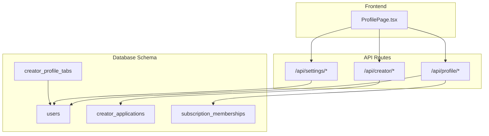
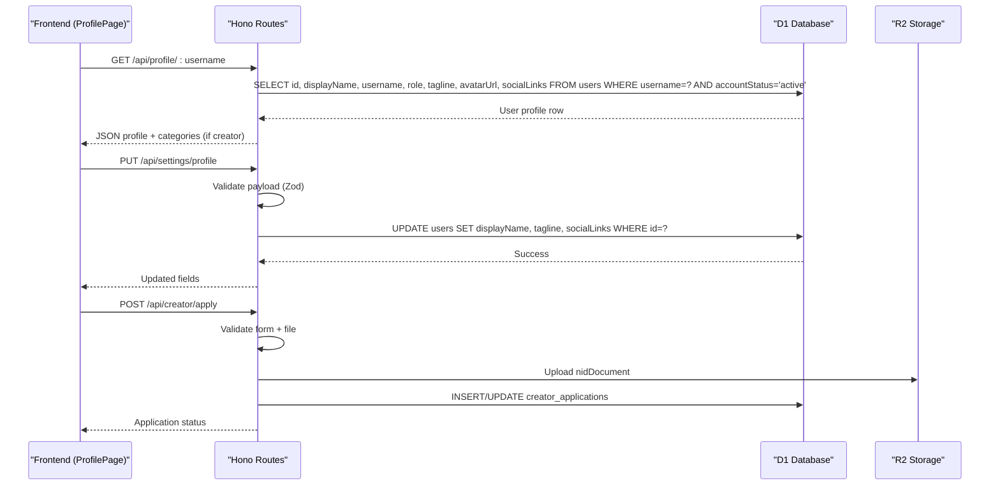
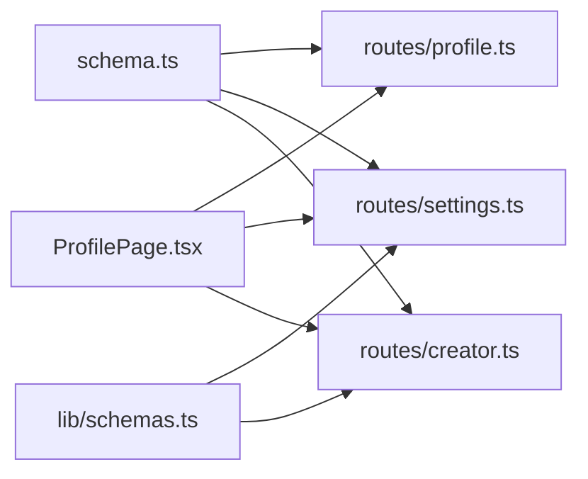

# Profile Data Model

<cite>
**Referenced Files in This Document**
- [schema.ts](file://src/worker/db/schema.ts)
- [0000_overrated_nitro.sql](file://drizzle/0000_overrated_nitro.sql)
- [0002_better_auth.sql](file://drizzle/0002_better_auth.sql)
- [profile.ts](file://src/worker/routes/profile.ts)
- [settings.ts](file://src/worker/routes/settings.ts)
- [creator.ts](file://src/worker/routes/creator.ts)
- [schemas.ts (worker)](file://src/worker/lib/schemas.ts)
- [AuthContext.tsx](file://src/react-app/context/AuthContext.tsx)
- [ProfilePage.tsx](file://src/react-app/pages/ProfilePage.tsx)
</cite>

## Table of Contents
1. Introduction
2. Project Structure
3. Core Components
4. Architecture Overview
5. Detailed Component Analysis
6. Dependency Analysis
7. Performance Considerations
8. Troubleshooting Guide
9. Conclusion

## Introduction
This document provides a comprehensive data model documentation for Zenith’s user profile system. It focuses on the users table schema, including displayName, username, tagline, avatarUrl, socialLinks, role, and accountStatus fields. It also documents field types, validation rules, constraints, default values, indexes, foreign key relationships, and data integrity constraints. Additionally, it explains how user profiles relate to creator applications, outlines role-based features and permissions, and includes examples of profile data structures, validation schemas, and common query patterns for profile operations.

## Project Structure
The profile data model is defined primarily in the Drizzle schema and enforced through API routes and Zod validation schemas:
- Database schema definitions are centralized in src/worker/db/schema.ts with migration SQL files under drizzle/.
- Profile read endpoints are implemented in src/worker/routes/profile.ts.
- Profile update endpoints are implemented in src/worker/routes/settings.ts.
- Creator application flows are implemented in src/worker/routes/creator.ts.
- Validation schemas for profile settings and creator applications are defined in src/worker/lib/schemas.ts.
- Frontend consumption of profile data occurs in src/react-app/pages/ProfilePage.tsx and related components.

**Diagram sources**
- [schema.ts:5-32](file://src/worker/db/schema.ts#L5-L32)
- [schema.ts:596-623](file://src/worker/db/schema.ts#L596-L623)
- [schema.ts:46-61](file://src/worker/db/schema.ts#L46-L61)
- [schema.ts:762-799](file://src/worker/db/schema.ts#L762-L799)
- [profile.ts:43-82](file://src/worker/routes/profile.ts#L43-L82)
- [settings.ts:309-326](file://src/worker/routes/settings.ts#L309-L326)
- [creator.ts:53-186](file://src/worker/routes/creator.ts#L53-L186)
- [ProfilePage.tsx:116-128](file://src/react-app/pages/ProfilePage.tsx#L116-L128)

**Section sources**
- [schema.ts:5-32](file://src/worker/db/schema.ts#L5-L32)
- [0000_overrated_nitro.sql:21-36](file://drizzle/0000_overrated_nitro.sql#L21-L36)
- [0002_better_auth.sql:1-24](file://drizzle/0002_better_auth.sql#L1-L24)
- [profile.ts:43-82](file://src/worker/routes/profile.ts#L43-L82)
- [settings.ts:309-326](file://src/worker/routes/settings.ts#L309-L326)
- [creator.ts:53-186](file://src/worker/routes/creator.ts#L53-L186)
- [ProfilePage.tsx:116-128](file://src/react-app/pages/ProfilePage.tsx#L116-L128)

## Core Components
- Users table: Stores core identity and profile attributes, including role and account status.
- Creator applications: Tracks creator onboarding requests and decisions.
- Creator profile tabs: Configurable visibility and ordering of content tabs per creator.
- Subscription memberships: Links subscribers to creators and governs access levels.

Key responsibilities:
- Enforce uniqueness and constraints on identifiers (email, username).
- Provide role-based feature gating (subscriber vs creator).
- Support account lifecycle states (active, suspended).
- Store optional profile metadata (tagline, avatar URL, social links).

**Section sources**
- [schema.ts:5-32](file://src/worker/db/schema.ts#L5-L32)
- [schema.ts:596-623](file://src/worker/db/schema.ts#L596-L623)
- [schema.ts:46-61](file://src/worker/db/schema.ts#L46-L61)
- [schema.ts:762-799](file://src/worker/db/schema.ts#L762-L799)

## Architecture Overview
The profile system integrates database schema, API routes, and frontend consumption:
- The users table defines the canonical profile record.
- Profile read endpoints return public profile data filtered by account status and role.
- Profile update endpoints enforce validation and persist changes to the users table.
- Creator applications flow updates the users table upon approval (role change).
- Subscription memberships gate access to creator-only content based on entitlement conditions.

**Diagram sources**
- [profile.ts:43-82](file://src/worker/routes/profile.ts#L43-L82)
- [settings.ts:309-326](file://src/worker/routes/settings.ts#L309-L326)
- [creator.ts:53-186](file://src/worker/routes/creator.ts#L53-L186)

## Detailed Component Analysis

### Users Table Schema
- Primary key: id (text, UUID generated at insert)
- email: text, not null, unique
- passwordHash: text, not null
- emailVerified: integer (boolean mode), not null, default false
- role: text enum ['subscriber', 'creator'], not null, default 'subscriber'
- accountStatus: text enum ['active', 'suspended'], not null, default 'active'
- suspensionReason: text, nullable
- suspendedAt: timestamp, nullable
- suspendedBy: text, nullable
- displayName: text, not null
- username: text, not null, unique
- tagline: text, nullable
- avatarUrl: text, nullable
- avatarR2Key: text, nullable
- socialLinks: text, nullable (JSON string)
- createdAt: timestamp, not null, default current epoch seconds
- updatedAt: timestamp_ms, not null, default current epoch milliseconds, auto-update on change

Indexes and constraints:
- Unique indexes on email and username
- Index on accountStatus for filtering active accounts
- Foreign keys from other tables reference users.id with cascade or set null behaviors

Validation rules:
- Role restricted to subscriber or creator
- Account status restricted to active or suspended
- Username must be unique; enforced via unique index
- Social links stored as JSON string; validated at API layer for URL format

Default values:
- role defaults to 'subscriber'
- accountStatus defaults to 'active'
- timestamps default to current time

Data integrity:
- Cascading deletes ensure referential integrity when users are removed
- Enum constraints prevent invalid role/status values

Example profile data structure:
- id: string
- displayName: string
- username: string
- role: 'subscriber' | 'creator'
- tagline: string | null
- avatarUrl: string | null
- socialLinks: string | null (JSON)
- accountStatus: 'active' | 'suspended'

Common query patterns:
- Fetch profile by username where accountStatus = 'active'
- Fetch avatar by userId where accountStatus = 'active'
- Filter creators by role = 'creator' and accountStatus = 'active'

**Section sources**
- [schema.ts:5-32](file://src/worker/db/schema.ts#L5-L32)
- [0000_overrated_nitro.sql:21-36](file://drizzle/0000_overrated_nitro.sql#L21-L36)
- [0002_better_auth.sql:1-24](file://drizzle/0002_better_auth.sql#L1-L24)
- [profile.ts:43-82](file://src/worker/routes/profile.ts#L43-L82)

### Relationship Between User Profiles and Creator Applications
- creator_applications stores application details linked to users via userId (unique constraint ensures one application per user)
- Fields include fullName, address, city, country, nidNumber, nidDocumentR2Key, socialLinks (JSON array), contentLinks (JSON array), status (pending/approved/rejected), reviewedBy, reviewedAt, decisionReason, adminNote, resubmittedAt, timestamps
- Upon approval, the user’s role is updated to 'creator'
- Validation enforces required fields and HTTPS URLs for social/content links
- File upload validates MIME type and size limits

Role-based features and permissions:
- Only users with role = 'creator' can access creator-specific endpoints and tabs
- Access control checks use hasCreatorAccess and membership entitlement conditions
- Suspended accounts are blocked from authenticated operations

Foreign key relationships:
- creator_applications.userId references users.id with cascade delete
- Other tables (posts, subscriptions, etc.) reference users.id for ownership and relationships

Data integrity constraints:
- Unique userId in creator_applications prevents duplicate applications
- Enum constraints on status and roles maintain consistency

Example application data structure:
- id: string
- userId: string
- fullName: string
- address: string
- city: string
- country: string
- nidNumber: string
- nidDocumentR2Key: string
- socialLinks: string[] (JSON)
- contentLinks: string[] (JSON)
- status: 'pending' | 'approved' | 'rejected'
- reviewedBy: string | null
- reviewedAt: timestamp | null
- decisionReason: string | null
- adminNote: string | null
- resubmittedAt: timestamp | null
- createdAt: timestamp
- updatedAt: timestamp

Common query patterns:
- Retrieve application by userId
- Update application status upon review
- Check existing application before allowing new submission

**Section sources**
- [schema.ts:596-623](file://src/worker/db/schema.ts#L596-L623)
- [creator.ts:53-186](file://src/worker/routes/creator.ts#L53-L186)
- [auth.integration.test.ts:65-88](file://src/worker/routes/auth.integration.test.ts#L65-L88)

### Profile Settings Validation Schemas
- profileSettingsSchema validates displayName (required, trimmed), tagline (optional, trimmed), and socialLinks object with optional twitter/github/website fields validated as HTTP(S) URLs
- profileTabsSettingsSchema ensures all nine tab keys are present, no duplicates, and at least one visible tab
- Username update schema enforces regex pattern for valid usernames

Validation rules:
- displayName cannot be empty after trimming
- socialLinks entries must be valid URLs with http or https protocol
- Tabs must include all predefined keys and have at least one visible

Common usage:
- PUT /api/settings/profile updates displayName, tagline, and socialLinks
- PUT /api/settings/tabs updates visibility and order of profile tabs
- PUT /api/settings/username updates username with strict validation

**Section sources**
- [schemas.ts (worker):126-175](file://src/worker/lib/schemas.ts#L126-L175)
- [settings.ts:309-326](file://src/worker/routes/settings.ts#L309-L326)

### Profile Read Endpoints
- GET /api/profile/:username returns public profile data for active users
- Filters by accountStatus = 'active' to hide suspended users
- Returns additional categories for creators and profile tabs configuration
- GET /api/profile/avatar/:userId serves avatar image if available and user is active

Response structure:
- id, displayName, username, role, tagline, avatarUrl, socialLinks
- categories (for creators)
- profileTabs (for creators)

Common query patterns:
- Select specific fields to minimize payload
- Join with creator_categories for discovery categories
- Use indexes on username and accountStatus for performance

**Section sources**
- [profile.ts:43-82](file://src/worker/routes/profile.ts#L43-L82)
- [profile.ts:22-39](file://src/worker/routes/profile.ts#L22-L39)

### Avatar Management
- PUT /api/settings/avatar handles multipart form upload
- Validates file type (JPEG, PNG, WebP) and size limits
- Stores file in R2 and updates avatarR2Key and avatarUrl in users table
- GET /api/profile/avatar/:userId retrieves avatar from R2 if available

Validation rules:
- File must be an image with allowed MIME types
- Size must be within limits
- Missing file results in validation error

Common query patterns:
- Update avatarR2Key and avatarUrl atomically
- Serve avatar with correct Content-Type from R2 metadata

**Section sources**
- [settings.ts:68-120](file://src/worker/routes/settings.ts#L68-L120)
- [profile.ts:22-39](file://src/worker/routes/profile.ts#L22-L39)

### Subscription Memberships and Access Control
- subscription_memberships links subscribers to creators with plan and provider details
- Access control uses membershipEntitlementCondition to determine visibility of creator content
- Profile endpoints check hasCreatorAccess to allow/disallow viewing creator-only content

Role-based features:
- Creators can manage subscriptions, view subscribers, and publish content
- Subscribers can subscribe to creators and view public content

Common query patterns:
- List subscriptions for a subscriber
- List subscribers for a creator
- Filter by membership status and access type

**Section sources**
- [schema.ts:762-799](file://src/worker/db/schema.ts#L762-L799)
- [profile.ts:86-155](file://src/worker/routes/profile.ts#L86-L155)

## Dependency Analysis
The profile system has clear dependencies between schema, routes, and validation:
- schema.ts defines the canonical data model
- routes/profile.ts reads and serves profile data
- routes/settings.ts updates profile data with validation
- routes/creator.ts manages creator applications
- lib/schemas.ts enforces input validation

**Diagram sources**
- [schema.ts:5-32](file://src/worker/db/schema.ts#L5-L32)
- [profile.ts:43-82](file://src/worker/routes/profile.ts#L43-L82)
- [settings.ts:309-326](file://src/worker/routes/settings.ts#L309-L326)
- [creator.ts:53-186](file://src/worker/routes/creator.ts#L53-L186)
- [schemas.ts (worker):126-175](file://src/worker/lib/schemas.ts#L126-L175)
- [ProfilePage.tsx:116-128](file://src/react-app/pages/ProfilePage.tsx#L116-L128)

**Section sources**
- [schema.ts:5-32](file://src/worker/db/schema.ts#L5-L32)
- [profile.ts:43-82](file://src/worker/routes/profile.ts#L43-L82)
- [settings.ts:309-326](file://src/worker/routes/settings.ts#L309-L326)
- [creator.ts:53-186](file://src/worker/routes/creator.ts#L53-L186)
- [schemas.ts (worker):126-175](file://src/worker/lib/schemas.ts#L126-L175)
- [ProfilePage.tsx:116-128](file://src/react-app/pages/ProfilePage.tsx#L116-L128)

## Performance Considerations
- Use selective field projection in queries to reduce payload size
- Leverage indexes on username, accountStatus, and foreign keys for efficient lookups
- Cache frequently accessed profile data at the CDN level when possible
- Avoid N+1 queries by batching related data fetches
- Validate inputs early to fail fast and reduce database load

[No sources needed since this section provides general guidance]

## Troubleshooting Guide
Common issues and resolutions:
- Invalid profile updates: Ensure displayName is non-empty and socialLinks contain valid HTTP(S) URLs
- Avatar upload failures: Verify file type and size limits; check R2 storage availability
- Creator application conflicts: Check for existing applications with non-rejected status
- Access denied errors: Confirm user role and account status; verify subscription entitlements

Debugging steps:
- Inspect request payloads against validation schemas
- Check database constraints and indexes
- Review middleware authentication and authorization logic
- Monitor error responses from API routes

**Section sources**
- [schemas.ts (worker):126-175](file://src/worker/lib/schemas.ts#L126-L175)
- [settings.ts:309-326](file://src/worker/routes/settings.ts#L309-L326)
- [creator.ts:53-186](file://src/worker/routes/creator.ts#L53-L186)
- [profile.ts:43-82](file://src/worker/routes/profile.ts#L43-L82)

## Conclusion
Zenith’s user profile system provides a robust foundation for managing user identities, roles, and profile data. The users table schema enforces data integrity through constraints and indexes, while API routes and validation schemas ensure consistent data handling. The relationship between user profiles and creator applications enables a structured onboarding process that transitions users into creators with appropriate permissions. Subscription memberships provide granular access control for creator content. By following the documented schemas, validation rules, and query patterns, developers can extend and maintain the profile system effectively.

[No sources needed since this section summarizes without analyzing specific files]