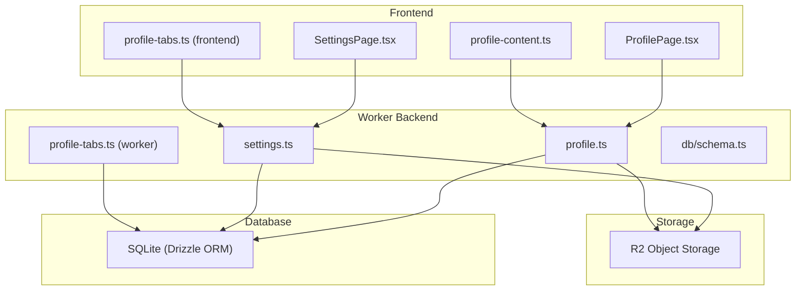
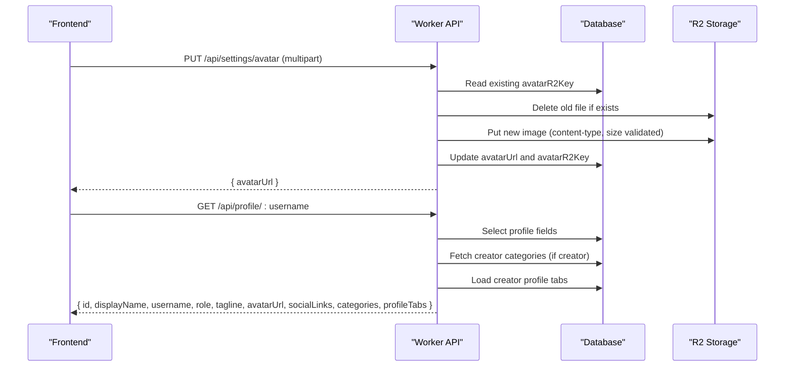
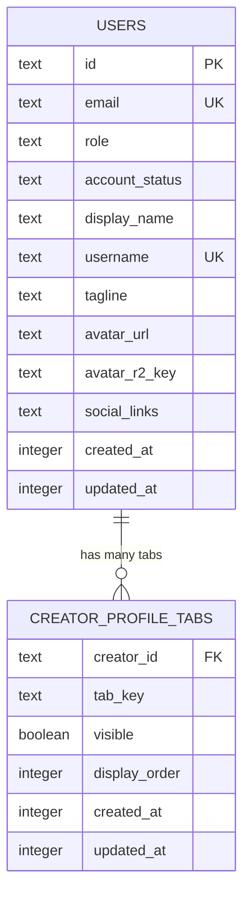
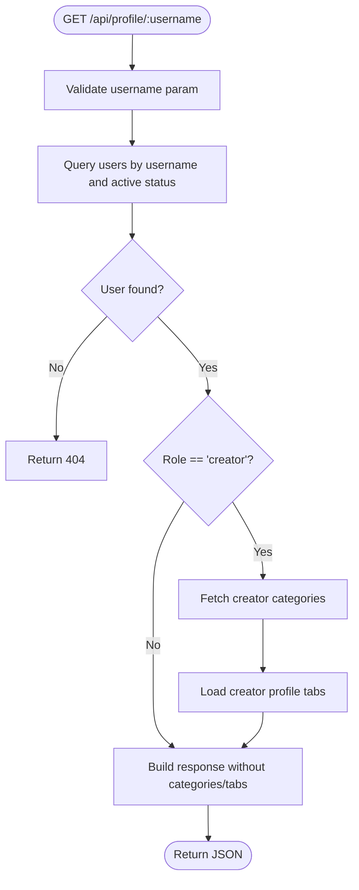
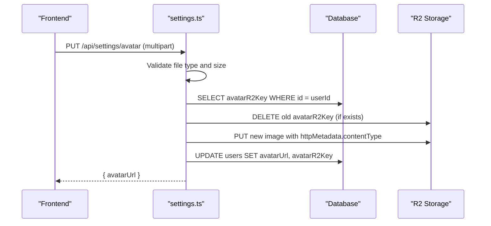
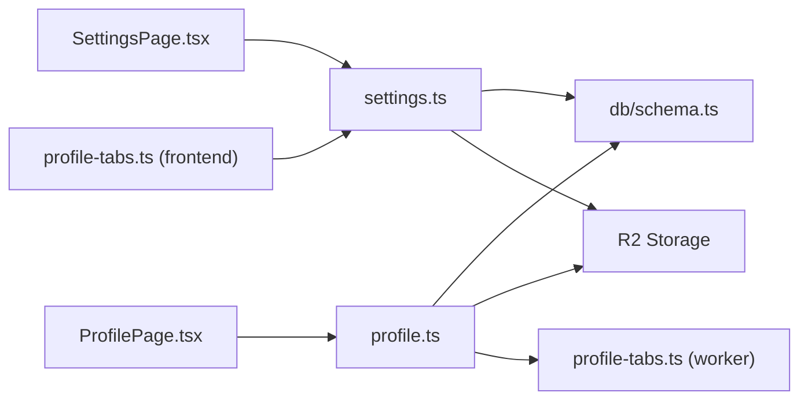

# Profile Management

<cite>
**Referenced Files in This Document**
- [profile.ts](file://src/worker/routes/profile.ts)
- [settings.ts](file://src/worker/routes/settings.ts)
- [schema.ts](file://src/worker/db/schema.ts)
- [0006_creator_profile_tabs.sql](file://drizzle/0006_creator_profile_tabs.sql)
- [profile-tabs.ts (worker)](file://src/worker/lib/profile-tabs.ts)
- [profile-content.ts](file://src/react-app/lib/profile-content.ts)
- [profile-tabs.ts (frontend)](file://src/react-app/lib/profile-tabs.ts)
- [ProfilePage.tsx](file://src/react-app/pages/ProfilePage.tsx)
- [SettingsPage.tsx](file://src/react-app/pages/SettingsPage.tsx)
- [schemas.ts (frontend)](file://src/react-app/lib/schemas.ts)
- [schemas.ts (worker)](file://src/worker/lib/schemas.ts)
</cite>

## Table of Contents
1. [Introduction](#introduction)
2. [Project Structure](#project-structure)
3. [Core Components](#core-components)
4. [Architecture Overview](#architecture-overview)
5. [Detailed Component Analysis](#detailed-component-analysis)
6. [Dependency Analysis](#dependency-analysis)
7. [Performance Considerations](#performance-considerations)
8. [Troubleshooting Guide](#troubleshooting-guide)
9. [Conclusion](#conclusion)
10. [Appendices](#appendices)

## Introduction
This document explains Zenith’s profile management system end-to-end: the data model, API endpoints, validation rules, avatar upload handling, social links management, and the creator profile content system with customizable tabs. It also covers visibility settings, role-based features, and provides examples for updating profiles, uploading avatars, and managing profile tabs.

## Project Structure
The profile system spans both the worker backend and the React frontend:
- Worker routes expose REST endpoints for reading public profiles, fetching content by tab, and updating profile settings and avatars.
- The database schema defines user profile fields and per-creator tab configuration.
- Frontend pages and utilities render profile views, manage tabs, and handle uploads and updates.

**Diagram sources**
- [profile.ts:1-329](file://src/worker/routes/profile.ts#L1-L329)
- [settings.ts:60-133](file://src/worker/routes/settings.ts#L60-L133)
- [profile-tabs.ts (worker):1-83](file://src/worker/lib/profile-tabs.ts#L1-L83)
- [schema.ts:1-62](file://src/worker/db/schema.ts#L1-L62)
- [ProfilePage.tsx:100-160](file://src/react-app/pages/ProfilePage.tsx#L100-L160)
- [SettingsPage.tsx:146-200](file://src/react-app/pages/SettingsPage.tsx#L146-L200)
- [profile-tabs.ts (frontend):1-57](file://src/react-app/lib/profile-tabs.ts#L1-L57)
- [profile-content.ts:1-40](file://src/react-app/lib/profile-content.ts#L1-L40)

**Section sources**
- [profile.ts:1-329](file://src/worker/routes/profile.ts#L1-L329)
- [settings.ts:60-133](file://src/worker/routes/settings.ts#L60-L133)
- [schema.ts:1-62](file://src/worker/db/schema.ts#L1-L62)
- [profile-tabs.ts (worker):1-83](file://src/worker/lib/profile-tabs.ts#L1-L83)
- [profile-tabs.ts (frontend):1-57](file://src/react-app/lib/profile-tabs.ts#L1-L57)
- [profile-content.ts:1-40](file://src/react-app/lib/profile-content.ts#L1-L40)
- [ProfilePage.tsx:100-160](file://src/react-app/pages/ProfilePage.tsx#L100-L160)
- [SettingsPage.tsx:146-200](file://src/react-app/pages/SettingsPage.tsx#L146-L200)

## Core Components
- User profile data model: displayName, username, tagline, avatarUrl, avatarR2Key, socialLinks, role, accountStatus.
- Creator profile tabs: per-creator visibility and ordering of predefined tab keys.
- Public profile reader: GET by username returns profile metadata and optional categories/tabs for creators.
- Avatar upload pipeline: multipart form upload to R2, update DB references, serve via a dedicated endpoint.
- Settings endpoints: PUT /profile, PUT /avatar, PUT /settings/profile-tabs.
- Frontend UI: ProfilePage renders tabs and content; SettingsPage manages edits and uploads.

**Section sources**
- [schema.ts:5-32](file://src/worker/db/schema.ts#L5-L32)
- [profile.ts:43-82](file://src/worker/routes/profile.ts#L43-L82)
- [settings.ts:66-133](file://src/worker/routes/settings.ts#L66-L133)
- [profile-tabs.ts (worker):1-83](file://src/worker/lib/profile-tabs.ts#L1-L83)
- [profile-tabs.ts (frontend):1-57](file://src/react-app/lib/profile-tabs.ts#L1-L57)
- [ProfilePage.tsx:100-160](file://src/react-app/pages/ProfilePage.tsx#L100-L160)
- [SettingsPage.tsx:146-200](file://src/react-app/pages/SettingsPage.tsx#L146-L200)

## Architecture Overview
The profile system follows a clear separation of concerns:
- Frontend components call typed APIs and react-query hooks.
- Worker routes validate inputs, enforce business rules, and persist changes.
- R2 stores binary assets; URLs are stored in the database for fast retrieval.
- Tabs are normalized server-side to ensure consistent ordering and defaults.

**Diagram sources**
- [settings.ts:66-133](file://src/worker/routes/settings.ts#L66-L133)
- [profile.ts:43-82](file://src/worker/routes/profile.ts#L43-L82)
- [profile-tabs.ts (worker):69-83](file://src/worker/lib/profile-tabs.ts#L69-L83)

## Detailed Component Analysis

### Data Model and Schema
- users table includes:
  - displayName, username (unique), tagline, avatarUrl, avatarR2Key, socialLinks (JSON string), role, accountStatus.
- creator_profile_tabs table:
  - creatorId, tabKey (enum), visible (boolean), displayOrder (integer), timestamps.
  - Primary key on (creatorId, tabKey); index on (creatorId, displayOrder).

**Diagram sources**
- [schema.ts:5-32](file://src/worker/db/schema.ts#L5-L32)
- [schema.ts:46-61](file://src/worker/db/schema.ts#L46-L61)
- [0006_creator_profile_tabs.sql:1-13](file://drizzle/0006_creator_profile_tabs.sql#L1-L13)

**Section sources**
- [schema.ts:5-32](file://src/worker/db/schema.ts#L5-L32)
- [schema.ts:46-61](file://src/worker/db/schema.ts#L46-L61)
- [0006_creator_profile_tabs.sql:1-13](file://drizzle/0006_creator_profile_tabs.sql#L1-L13)

### Profile Reading API
- GET /api/profile/:username
  - Returns profile fields and, for creators, categories and profileTabs.
  - Filters active accounts only.
  - For non-creators, profileTabs is null.

**Diagram sources**
- [profile.ts:43-82](file://src/worker/routes/profile.ts#L43-L82)
- [profile-tabs.ts (worker):69-83](file://src/worker/lib/profile-tabs.ts#L69-L83)

**Section sources**
- [profile.ts:43-82](file://src/worker/routes/profile.ts#L43-L82)

### Avatar Upload Handling
- PUT /api/settings/avatar
  - Accepts multipart/form-data with field "avatar".
  - Validates content type (JPEG, PNG, WebP) and size (≤ 5 MB).
  - Deletes previous avatar from R2 if present.
  - Stores new image under avatars/{userId}.{ext}.
  - Updates users.avatarUrl and users.avatarR2Key.
  - Returns new avatarUrl.

**Diagram sources**
- [settings.ts:66-133](file://src/worker/routes/settings.ts#L66-L133)

**Section sources**
- [settings.ts:66-133](file://src/worker/routes/settings.ts#L66-L133)

### Social Links Management
- PUT /api/settings/profile
  - Updates displayName, tagline, and socialLinks (JSON object with twitter/github/website).
  - Validates URL formats (http or https) and trims strings.
  - Persists socialLinks as JSON string in users.social_links.

Validation rules:
- displayName required, trimmed.
- tagline optional, trimmed.
- socialLinks fields optional; each must be a valid URL with http(s) protocol.

**Section sources**
- [settings.ts:307-326](file://src/worker/routes/settings.ts#L307-L326)
- [schemas.ts (worker):126-154](file://src/worker/lib/schemas.ts#L126-L154)
- [schemas.ts (frontend):20-43](file://src/react-app/lib/schemas.ts#L20-L43)

### Profile Tab Customization
- GET /api/settings/profile-tabs
  - Returns current tabs configuration for the authenticated user.
- PUT /api/settings/profile-tabs
  - Expects an array of exactly 9 tab entries with key and visible flags.
  - Upserts per-tab visibility and order; normalizes labels and final order.

Tab keys and defaults:
- Keys: all, posts, photography, audio, articles, courses, subscribers, subscribed, about.
- Default labels and ordering are applied; legacy rows without 'all' get canonical first/last placement.

Normalization logic:
- Merges persisted rows with defaults.
- Ensures 'all' appears first and 'about' last when legacy ordering is detected.
- Re-indexes order sequentially after normalization.

**Section sources**
- [profile-tabs.ts (worker):1-83](file://src/worker/lib/profile-tabs.ts#L1-L83)
- [settings.ts:44-64](file://src/worker/routes/settings.ts#L44-L64)
- [profile-tabs.ts (frontend):1-57](file://src/react-app/lib/profile-tabs.ts#L1-L57)
- [schemas.ts (worker):156-170](file://src/worker/lib/schemas.ts#L156-L170)

### Profile Content System and Tabs
- Creator profile tabs drive which content sections appear and their order.
- Frontend aggregates content across posts, articles, photography, audio, and courses into a unified "All" view.
- Visibility is controlled by per-creator tab settings; non-visible tabs are hidden from the UI.

Data normalization:
- normalizeCreatorAllItems merges multiple content types into a single list keyed by kind and id.
- shuffleCreatorAllItems randomizes the "All" feed per visit using a token to refresh ordering.

**Section sources**
- [profile-content.ts:1-40](file://src/react-app/lib/profile-content.ts#L1-L40)
- [ProfilePage.tsx:203-223](file://src/react-app/pages/ProfilePage.tsx#L203-L223)

### Role-Based Profile Features
- Non-creators see limited tabs (e.g., About, Subscribed).
- Creators can have additional tabs (Posts, Articles, Photography, Audio, Courses, Subscribers).
- Access checks gate member-only content; responses include hasAccess flags where applicable.

**Section sources**
- [profile.ts:63-82](file://src/worker/routes/profile.ts#L63-L82)
- [ProfilePage.tsx:532-538](file://src/react-app/pages/ProfilePage.tsx#L532-L538)

### API Endpoints Summary
- GET /api/profile/:username
  - Reads public profile, categories (for creators), and profileTabs (for creators).
- GET /api/profile/avatar/:userId
  - Serves avatar image by user ID; returns 404 if missing or inactive.
- PUT /api/settings/profile
  - Updates displayName, tagline, socialLinks.
- PUT /api/settings/avatar
  - Uploads avatar image to R2 and updates DB references.
- GET /api/settings/profile-tabs
  - Retrieves current tab configuration.
- PUT /api/settings/profile-tabs
  - Saves tab visibility and ordering.

Additional profile-related endpoints (read-only):
- GET /api/profile/:username/subscriptions
- GET /api/profile/:username/subscribers (authenticated)
- GET /api/profile/:username/posts/articles/photography/audio/courses (authenticated, access-gated)

**Section sources**
- [profile.ts:19-82](file://src/worker/routes/profile.ts#L19-L82)
- [settings.ts:44-64](file://src/worker/routes/settings.ts#L44-L64)
- [settings.ts:66-133](file://src/worker/routes/settings.ts#L66-L133)
- [settings.ts:307-326](file://src/worker/routes/settings.ts#L307-L326)

### Validation Rules
- Username format: lowercase alphanumeric with underscores/hyphens; length constraints enforced.
- Social link URLs: must parse and use http or https protocols.
- Avatar file: JPEG/PNG/WebP, ≤ 5 MB.
- Profile tabs payload: exactly 9 entries, unique keys, booleans for visibility.

**Section sources**
- [schemas.ts (frontend):45-64](file://src/react-app/lib/schemas.ts#L45-L64)
- [schemas.ts (worker):126-170](file://src/worker/lib/schemas.ts#L126-L170)

## Dependency Analysis
- Frontend depends on:
  - apiGetRequired/apiPutRequired for HTTP calls.
  - react-query hooks for caching and mutations.
  - zod schemas for client-side validation.
- Worker depends on:
  - Drizzle ORM for schema access.
  - Hono middleware for auth and validation.
  - R2 storage for avatar images.
  - Shared validators and schemas for input validation.

**Diagram sources**
- [ProfilePage.tsx:100-160](file://src/react-app/pages/ProfilePage.tsx#L100-L160)
- [SettingsPage.tsx:146-200](file://src/react-app/pages/SettingsPage.tsx#L146-L200)
- [profile.ts:1-329](file://src/worker/routes/profile.ts#L1-L329)
- [settings.ts:60-133](file://src/worker/routes/settings.ts#L60-L133)
- [profile-tabs.ts (worker):1-83](file://src/worker/lib/profile-tabs.ts#L1-L83)
- [schema.ts:1-62](file://src/worker/db/schema.ts#L1-L62)

**Section sources**
- [profile.ts:1-329](file://src/worker/routes/profile.ts#L1-L329)
- [settings.ts:60-133](file://src/worker/routes/settings.ts#L60-L133)
- [schema.ts:1-62](file://src/worker/db/schema.ts#L1-L62)
- [profile-tabs.ts (worker):1-83](file://src/worker/lib/profile-tabs.ts#L1-L83)

## Performance Considerations
- Avatar serving uses a dedicated endpoint that reads directly from R2 with appropriate content-type headers.
- Database queries filter by accountStatus to avoid inactive profiles.
- Profile tabs normalization ensures stable ordering and avoids unnecessary reordering on every read.
- Frontend caches profile and tabs via react-query to reduce network requests.

[No sources needed since this section provides general guidance]

## Troubleshooting Guide
Common issues and resolutions:
- Invalid avatar file type or size: Ensure JPEG/PNG/WebP and ≤ 5 MB.
- Missing avatar file: Confirm multipart form contains field "avatar".
- Social link validation errors: Use valid http(s) URLs.
- Profile tabs payload errors: Provide exactly 9 entries with unique keys and boolean visibility.
- Not found responses: Check username spelling and account status; verify avatar existence for avatar endpoint.

**Section sources**
- [settings.ts:66-133](file://src/worker/routes/settings.ts#L66-L133)
- [schemas.ts (worker):126-170](file://src/worker/lib/schemas.ts#L126-L170)
- [profile.ts:22-39](file://src/worker/routes/profile.ts#L22-L39)

## Conclusion
Zenith’s profile management system provides a robust, role-aware profile experience with flexible tab customization, secure avatar uploads, and strict validation. The separation between frontend and worker, combined with normalized tab logic and efficient storage handling, delivers a scalable and maintainable architecture.

[No sources needed since this section summarizes without analyzing specific files]

## Appendices

### Example Workflows

#### Updating Profile Fields
- Call PUT /api/settings/profile with displayName, tagline, and socialLinks.
- Frontend validates inputs using zod schemas before sending.
- Response confirms updated fields.

**Section sources**
- [settings.ts:307-326](file://src/worker/routes/settings.ts#L307-L326)
- [schemas.ts (frontend):20-43](file://src/react-app/lib/schemas.ts#L20-L43)

#### Uploading an Avatar
- Submit multipart form with "avatar" field to PUT /api/settings/avatar.
- Server validates type and size, deletes old avatar, uploads new one to R2, updates DB.
- Response includes new avatarUrl.

**Section sources**
- [settings.ts:66-133](file://src/worker/routes/settings.ts#L66-L133)
- [schemas.ts (frontend):55-64](file://src/react-app/lib/schemas.ts#L55-L64)

#### Managing Profile Tabs
- Retrieve current tabs via GET /api/settings/profile-tabs.
- Update visibility and order by PUT /api/settings/profile-tabs with 9 tab entries.
- Normalization ensures consistent labeling and ordering.

**Section sources**
- [profile-tabs.ts (frontend):42-52](file://src/react-app/lib/profile-tabs.ts#L42-L52)
- [settings.ts:44-64](file://src/worker/routes/settings.ts#L44-L64)
- [profile-tabs.ts (worker):39-67](file://src/worker/lib/profile-tabs.ts#L39-L67)