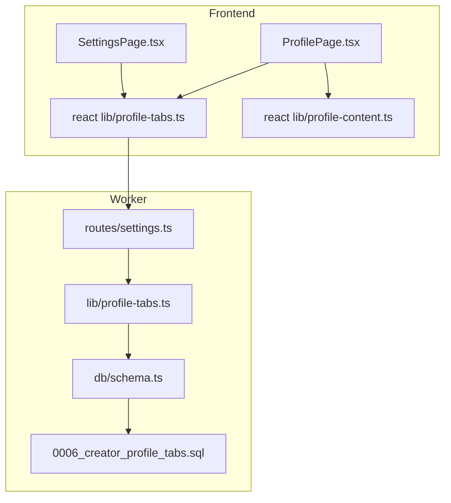
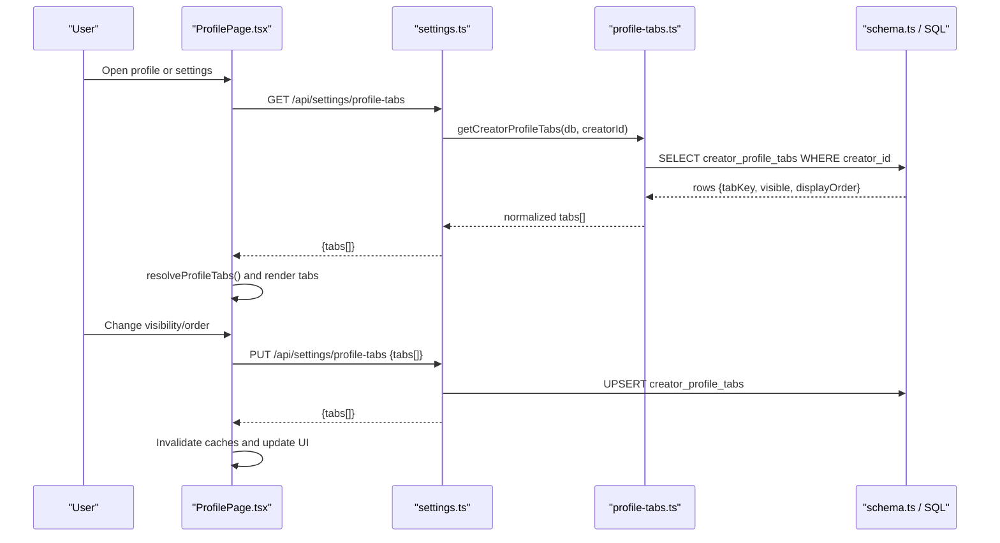
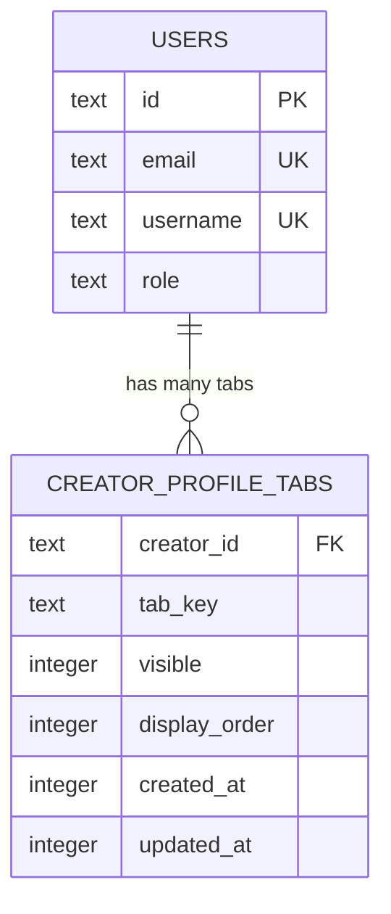
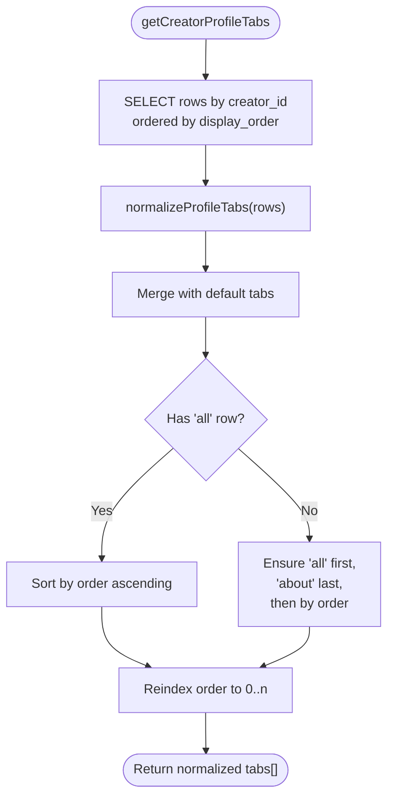
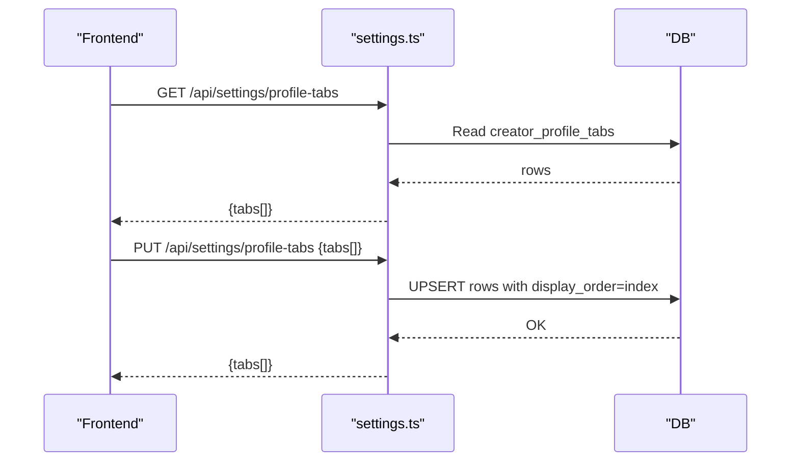
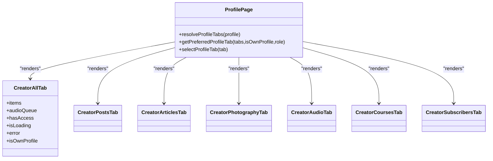
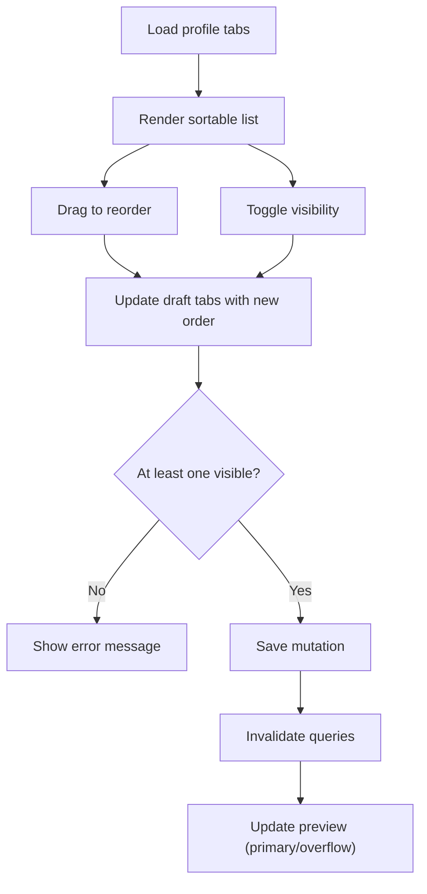
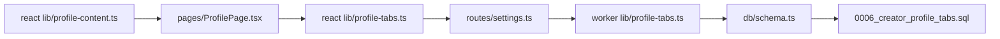

# Profile Tabs System

<cite>
**Referenced Files in This Document**
- [profile-tabs.ts](file://src/worker/lib/profile-tabs.ts)
- [settings.ts](file://src/worker/routes/settings.ts)
- [schema.ts](file://src/worker/db/schema.ts)
- [0006_creator_profile_tabs.sql](file://drizzle/0006_creator_profile_tabs.sql)
- [profile-tabs.ts](file://src/react-app/lib/profile-tabs.ts)
- [ProfilePage.tsx](file://src/react-app/pages/ProfilePage.tsx)
- [SettingsPage.tsx](file://src/react-app/pages/SettingsPage.tsx)
- [profile-content.ts](file://src/react-app/lib/profile-content.ts)
</cite>

## Table of Contents
1. [Introduction](#introduction)
2. [Project Structure](#project-structure)
3. [Core Components](#core-components)
4. [Architecture Overview](#architecture-overview)
5. [Detailed Component Analysis](#detailed-component-analysis)
6. [Dependency Analysis](#dependency-analysis)
7. [Performance Considerations](#performance-considerations)
8. [Troubleshooting Guide](#troubleshooting-guide)
9. [Conclusion](#conclusion)

## Introduction
This document explains Zenith’s profile tabs system that lets creators customize how their profile is organized. It covers the data model, supported tab types (posts, articles, audio, photography, courses, plus all, subscribers, subscribed, about), and dynamic configuration via a settings UI. It also details the backend function getCreatorProfileTabs, how content is retrieved and grouped by tab type on the frontend, tab switching logic, responsive behavior, and examples for customizing visibility and order based on roles and permissions.

## Project Structure
The profile tabs feature spans three layers:
- Backend API and persistence: Hono routes under worker routes, Drizzle schema, and SQL migration.
- Worker library: normalization and retrieval of creator profile tabs.
- Frontend React app: profile page rendering with tabs, settings page for drag-and-drop ordering and visibility toggles, and shared tab definitions.

**Diagram sources**
- [ProfilePage.tsx](file://src/react-app/pages/ProfilePage.tsx)
- [SettingsPage.tsx](file://src/react-app/pages/SettingsPage.tsx)
- [profile-tabs.ts](file://src/react-app/lib/profile-tabs.ts)
- [profile-content.ts](file://src/react-app/lib/profile-content.ts)
- [settings.ts](file://src/worker/routes/settings.ts)
- [profile-tabs.ts](file://src/worker/lib/profile-tabs.ts)
- [schema.ts](file://src/worker/db/schema.ts)
- [0006_creator_profile_tabs.sql](file://drizzle/0006_creator_profile_tabs.sql)

**Section sources**
- [profile-tabs.ts](file://src/worker/lib/profile-tabs.ts)
- [settings.ts](file://src/worker/routes/settings.ts)
- [schema.ts](file://src/worker/db/schema.ts)
- [0006_creator_profile_tabs.sql](file://drizzle/0006_creator_profile_tabs.sql)
- [profile-tabs.ts](file://src/react-app/lib/profile-tabs.ts)
- [ProfilePage.tsx](file://src/react-app/pages/ProfilePage.tsx)
- [SettingsPage.tsx](file://src/react-app/pages/SettingsPage.tsx)
- [profile-content.ts](file://src/react-app/lib/profile-content.ts)

## Core Components
- Tab definitions and types:
  - Shared constants define available keys and labels for tabs such as all, posts, photography, audio, articles, courses, subscribers, subscribed, about.
  - Types include ProfileTabKey and ProfileTabSetting with fields key, label, visible, order.
- Backend retrieval and normalization:
  - getCreatorProfileTabs fetches per-creator rows and normalizes them into a consistent list with default ordering and legacy fallbacks.
- Frontend usage:
  - ProfilePage resolves visible tabs based on role and user context, renders tabbed content, and conditionally loads queries per tab.
  - SettingsPage provides drag-and-drop reordering and visibility toggles, persists changes to the server, and previews primary vs overflow tabs.

**Section sources**
- [profile-tabs.ts](file://src/react-app/lib/profile-tabs.ts)
- [profile-tabs.ts](file://src/worker/lib/profile-tabs.ts)
- [ProfilePage.tsx](file://src/react-app/pages/ProfilePage.tsx)
- [SettingsPage.tsx](file://src/react-app/pages/SettingsPage.tsx)

## Architecture Overview
The system follows a clear separation of concerns:
- The frontend defines tab metadata and orchestrates UI interactions.
- The backend enforces creator-only access, validates inputs, and persists tab configuration.
- Data normalization ensures consistent ordering and handles legacy configurations.

**Diagram sources**
- [ProfilePage.tsx](file://src/react-app/pages/ProfilePage.tsx)
- [settings.ts](file://src/worker/routes/settings.ts)
- [profile-tabs.ts](file://src/worker/lib/profile-tabs.ts)
- [schema.ts](file://src/worker/db/schema.ts)
- [0006_creator_profile_tabs.sql](file://drizzle/0006_creator_profile_tabs.sql)

## Detailed Component Analysis

### Data Model and Migration
- Table creator_profile_tabs stores per-creator tab configuration with columns:
  - creator_id (FK to users)
  - tab_key (enum of allowed keys)
  - visible (boolean)
  - display_order (integer)
  - created_at, updated_at timestamps
- Primary key is composite (creator_id, tab_key). An index optimizes ordering queries.

**Diagram sources**
- [schema.ts](file://src/worker/db/schema.ts)
- [0006_creator_profile_tabs.sql](file://drizzle/0006_creator_profile_tabs.sql)

**Section sources**
- [schema.ts](file://src/worker/db/schema.ts)
- [0006_creator_profile_tabs.sql](file://drizzle/0006_creator_profile_tabs.sql)

### Backend Retrieval and Normalization
- getCreatorProfileTabs:
  - Queries rows for a given creator_id ordered by display_order.
  - normalizeProfileTabs merges defaults with stored values, applies legacy sorting rules (ensuring “all” first and “about” last when missing), and re-indexes order sequentially.
- Label mapping uses a predefined map from tab keys to labels.

**Diagram sources**
- [profile-tabs.ts](file://src/worker/lib/profile-tabs.ts)

**Section sources**
- [profile-tabs.ts](file://src/worker/lib/profile-tabs.ts)

### API Endpoints for Profile Tabs
- GET /api/settings/profile-tabs:
  - Requires authentication and creator role.
  - Returns { tabs: ProfileTabSetting[] }.
- PUT /api/settings/profile-tabs:
  - Accepts an array of { key, visible }.
  - Upserts each row with current index as display_order.
  - Returns updated { tabs: ProfileTabSetting[] }.

**Diagram sources**
- [settings.ts](file://src/worker/routes/settings.ts)
- [schema.ts](file://src/worker/db/schema.ts)

**Section sources**
- [settings.ts](file://src/worker/routes/settings.ts)

### Frontend Tab Definitions and Utilities
- Defines the same set of tab keys and labels as the backend, plus descriptions for UI hints.
- Provides defaultProfileTabs() to initialize state.
- Exposes query options and mutation helpers to fetch and update tabs.

**Section sources**
- [profile-tabs.ts](file://src/react-app/lib/profile-tabs.ts)

### Profile Page: Tab Resolution and Content Filtering
- Resolves visible tabs:
  - For non-creators, only shows about and subscribed.
  - For creators, uses profile.profileTabs if present; otherwise falls back to defaults.
- Determines preferred initial tab based on role and visibility.
- Conditionally enables queries per tab using creatorContentEnabled checks.
- Aggregates all content into a unified list for the “All” tab using normalizeCreatorAllItems and shuffles it for varied presentation.

**Diagram sources**
- [ProfilePage.tsx](file://src/react-app/pages/ProfilePage.tsx)
- [profile-content.ts](file://src/react-app/lib/profile-content.ts)

**Section sources**
- [ProfilePage.tsx](file://src/react-app/pages/ProfilePage.tsx)
- [profile-content.ts](file://src/react-app/lib/profile-content.ts)

### Settings Page: Drag-and-Drop Ordering and Visibility
- Loads tabs via profileTabsQueryOptions when the user is a creator.
- Uses dnd-kit for drag-and-drop reordering and keyboard accessibility.
- Toggles visibility per tab with validation ensuring at least one visible tab.
- Saves changes via updateProfileTabs and invalidates relevant caches (auth, profile, tabs).
- Shows a preview of primary tabs (first four visible) and overflow tabs (the rest).

**Diagram sources**
- [SettingsPage.tsx](file://src/react-app/pages/SettingsPage.tsx)
- [profile-tabs.ts](file://src/react-app/lib/profile-tabs.ts)

**Section sources**
- [SettingsPage.tsx](file://src/react-app/pages/SettingsPage.tsx)
- [profile-tabs.ts](file://src/react-app/lib/profile-tabs.ts)

### Role-Based Visibility and Permissions
- Only creators can manage profile tabs; non-creators see a restricted view.
- On profiles, non-creators are limited to about and subscribed tabs.
- Creator-only endpoints enforce requireRole('creator').

**Section sources**
- [settings.ts](file://src/worker/routes/settings.ts)
- [ProfilePage.tsx](file://src/react-app/pages/ProfilePage.tsx)
- [SettingsPage.tsx](file://src/react-app/pages/SettingsPage.tsx)

## Dependency Analysis
- Frontend depends on:
  - react lib/profile-tabs.ts for tab definitions and API helpers.
  - react lib/profile-content.ts for aggregating mixed content types.
  - UI components for tabs, dropdowns, and forms.
- Backend depends on:
  - drizzle schema for typed tables and constraints.
  - SQL migration for table structure and indexes.
  - middleware/auth for authentication and role checks.

**Diagram sources**
- [profile-tabs.ts](file://src/react-app/lib/profile-tabs.ts)
- [profile-content.ts](file://src/react-app/lib/profile-content.ts)
- [ProfilePage.tsx](file://src/react-app/pages/ProfilePage.tsx)
- [settings.ts](file://src/worker/routes/settings.ts)
- [profile-tabs.ts](file://src/worker/lib/profile-tabs.ts)
- [schema.ts](file://src/worker/db/schema.ts)
- [0006_creator_profile_tabs.sql](file://drizzle/0006_creator_profile_tabs.sql)

**Section sources**
- [profile-tabs.ts](file://src/react-app/lib/profile-tabs.ts)
- [profile-content.ts](file://src/react-app/lib/profile-content.ts)
- [ProfilePage.tsx](file://src/react-app/pages/ProfilePage.tsx)
- [settings.ts](file://src/worker/routes/settings.ts)
- [profile-tabs.ts](file://src/worker/lib/profile-tabs.ts)
- [schema.ts](file://src/worker/db/schema.ts)
- [0006_creator_profile_tabs.sql](file://drizzle/0006_creator_profile_tabs.sql)

## Performance Considerations
- Indexing:
  - The index on (creator_id, display_order) supports efficient ordering queries for profile tabs.
- Caching and invalidation:
  - React Query keys ensure tabs and profile data are cached and invalidated after updates.
- Conditional loading:
  - Content queries are enabled only when tabs are visible, reducing unnecessary network requests.
- All-tab aggregation:
  - normalizeCreatorAllItems creates a flat list; shuffle adds variety without extra cost.

[No sources needed since this section provides general guidance]

## Troubleshooting Guide
Common issues and resolutions:
- Tabs not appearing:
  - Ensure the user has creator role; non-creators cannot manage tabs.
  - Verify at least one tab is marked visible before saving.
- Incorrect ordering:
  - Check that display_order is persisted correctly during save mutations.
  - Legacy rows without “all” will be sorted with “all” first and “about” last by normalization.
- Access errors:
  - GET/PUT endpoints require authentication and creator role; confirm middleware is applied.
- Profile page shows wrong tab:
  - Preferred tab selection prioritizes “all” for creators, “subscribed” for own profile, then “about”.

**Section sources**
- [settings.ts](file://src/worker/routes/settings.ts)
- [profile-tabs.ts](file://src/worker/lib/profile-tabs.ts)
- [ProfilePage.tsx](file://src/react-app/pages/ProfilePage.tsx)
- [SettingsPage.tsx](file://src/react-app/pages/SettingsPage.tsx)

## Conclusion
Zenith’s profile tabs system provides a robust, role-aware mechanism for creators to organize their public profiles. The backend enforces secure, validated persistence with efficient indexing, while the frontend offers intuitive controls for ordering and visibility. Content filtering and conditional loading keep performance optimal, and normalization ensures consistent behavior across legacy and new configurations.

[No sources needed since this section summarizes without analyzing specific files]