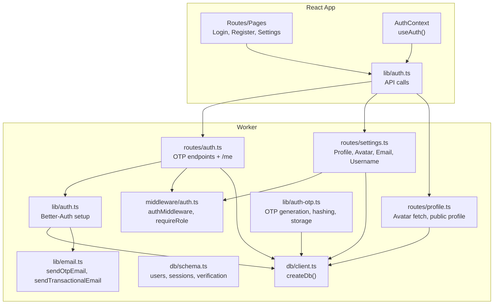
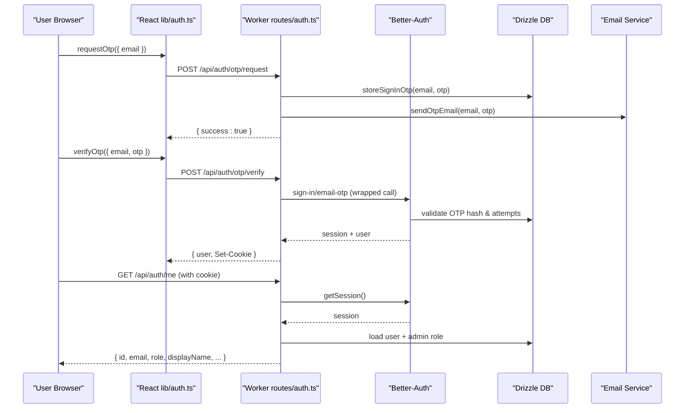
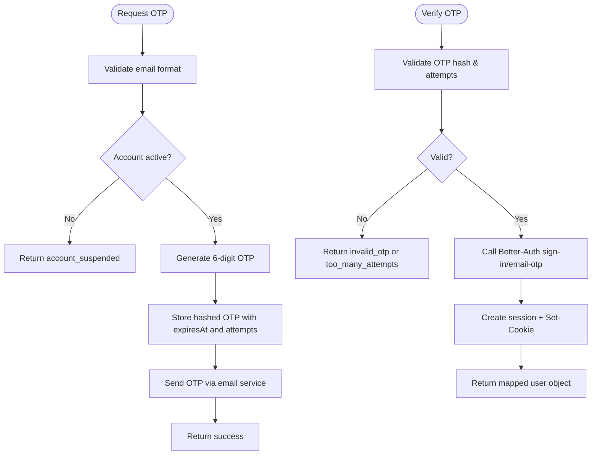
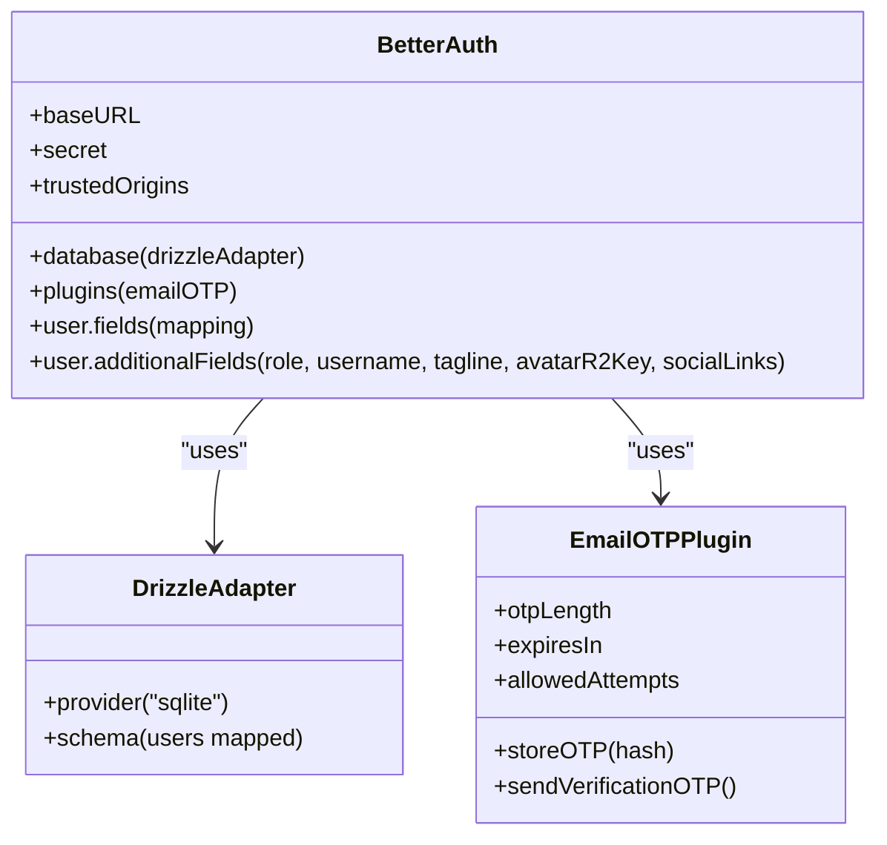
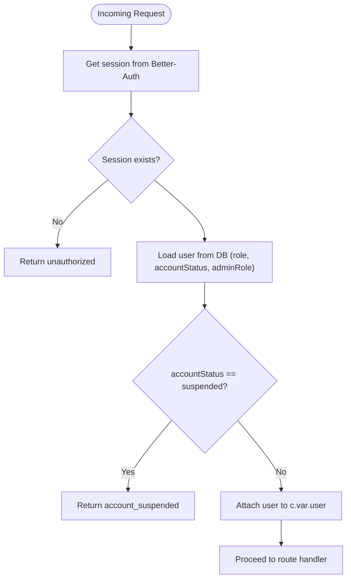
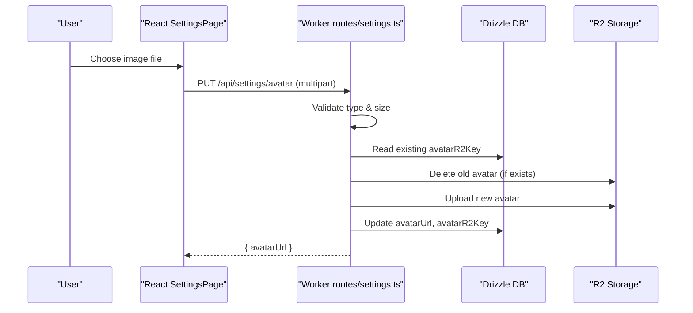
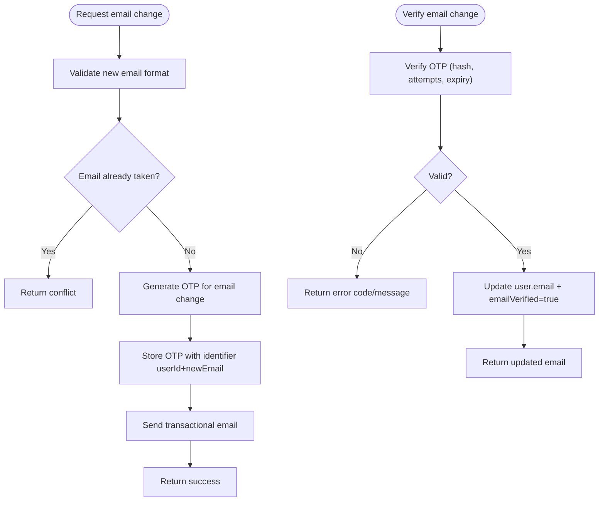
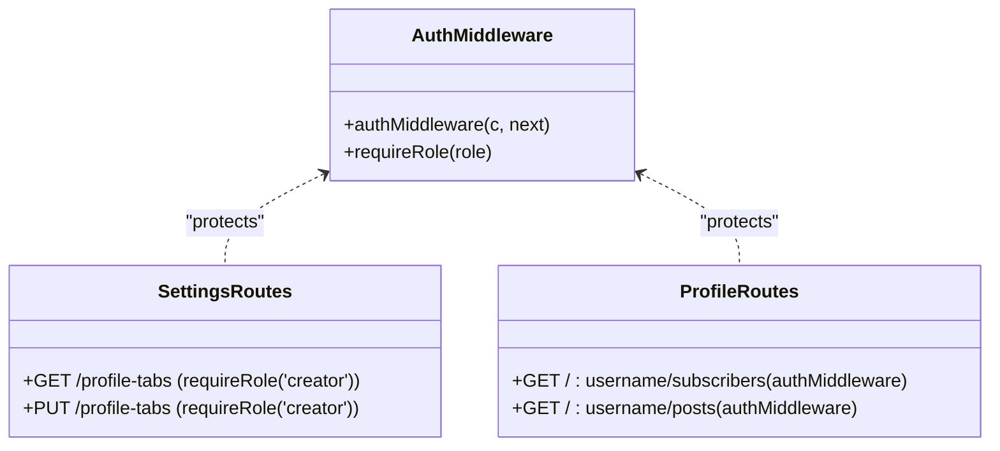
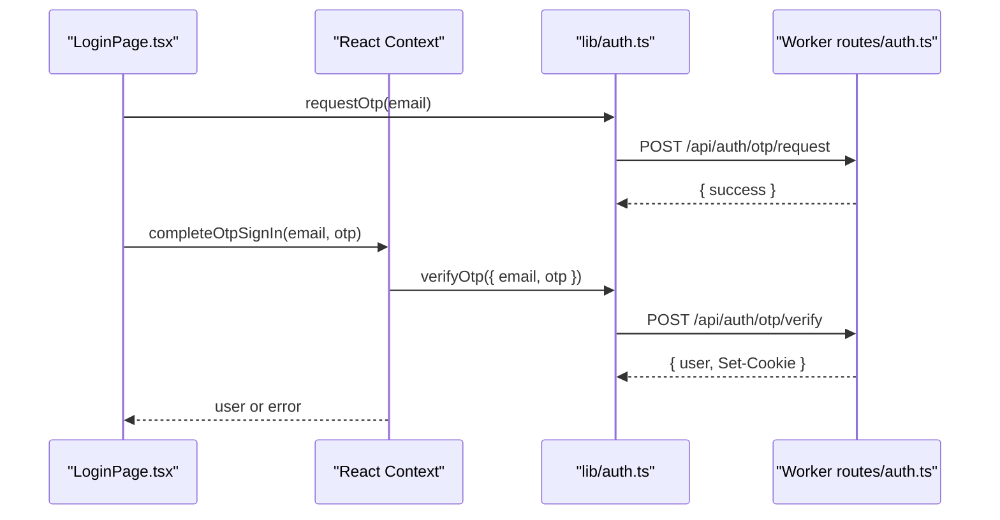
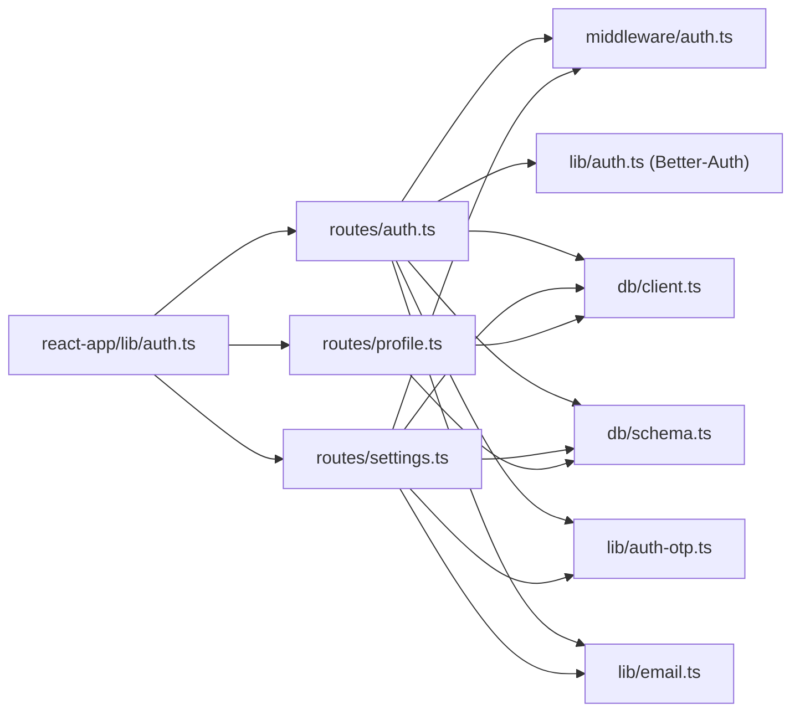

# User Management

<cite>
**Referenced Files in This Document**
- [auth.ts](file://src/worker/lib/auth.ts)
- [auth.ts](file://src/worker/routes/auth.ts)
- [auth.ts](file://src/worker/middleware/auth.ts)
- [auth-otp.ts](file://src/worker/lib/auth-otp.ts)
- [email.ts](file://src/worker/lib/email.ts)
- [schema.ts](file://src/worker/db/schema.ts)
- [client.ts](file://src/worker/db/client.ts)
- [settings.ts](file://src/worker/routes/settings.ts)
- [profile.ts](file://src/worker/routes/profile.ts)
- [auth.ts](file://src/react-app/lib/auth.ts)
- [AuthContext.tsx](file://src/react-app/context/AuthContext.tsx)
- [LoginPage.tsx](file://src/react-app/pages/LoginPage.tsx)
- [RegisterPage.tsx](file://src/react-app/pages/RegisterPage.tsx)
- [SettingsPage.tsx](file://src/react-app/pages/SettingsPage.tsx)
</cite>

## Table of Contents
1. [Introduction](#introduction)
2. [Project Structure](#project-structure)
3. [Core Components](#core-components)
4. [Architecture Overview](#architecture-overview)
5. [Detailed Component Analysis](#detailed-component-analysis)
6. [Dependency Analysis](#dependency-analysis)
7. [Performance Considerations](#performance-considerations)
8. [Troubleshooting Guide](#troubleshooting-guide)
9. [Conclusion](#conclusion)
10. [Appendices](#appendices)

## Introduction
This document explains Zenith’s user management system, focusing on the email OTP-based authentication flow, Better-Auth integration, session handling, middleware for authorization, and profile/account settings. It covers how users register and sign in without passwords, manage their profiles (including avatar uploads and social links), update account details with OTP verification, and how roles (subscriber vs creator) control access to features. Security measures such as OTP hashing, attempt limits, expiration, and account suspension checks are also detailed.

## Project Structure
The user management system spans both the worker (server-side) and React application (client-side):
- Worker: Hono routes for auth and settings, Better-Auth configuration, OTP utilities, email delivery, database schema, and middleware for authentication and role checks.
- React app: Auth context, API helpers, and UI pages for login, registration, and settings.

**Diagram sources**
- [auth.ts:1-259](file://src/worker/routes/auth.ts#L1-L259)
- [settings.ts:1-327](file://src/worker/routes/settings.ts#L1-L327)
- [profile.ts:1-329](file://src/worker/routes/profile.ts#L1-L329)
- [auth.ts:1-57](file://src/worker/middleware/auth.ts#L1-L57)
- [auth.ts:1-80](file://src/worker/lib/auth.ts#L1-L80)
- [auth-otp.ts:1-124](file://src/worker/lib/auth-otp.ts#L1-L124)
- [email.ts:1-56](file://src/worker/lib/email.ts#L1-L56)
- [schema.ts:1-166](file://src/worker/db/schema.ts#L1-L166)
- [client.ts:1-9](file://src/worker/db/client.ts#L1-L9)
- [auth.ts:1-55](file://src/react-app/lib/auth.ts#L1-L55)
- [AuthContext.tsx:1-90](file://src/react-app/context/AuthContext.tsx#L1-L90)

**Section sources**
- [auth.ts:1-259](file://src/worker/routes/auth.ts#L1-L259)
- [settings.ts:1-327](file://src/worker/routes/settings.ts#L1-L327)
- [profile.ts:1-329](file://src/worker/routes/profile.ts#L1-L329)
- [auth.ts:1-57](file://src/worker/middleware/auth.ts#L1-L57)
- [auth.ts:1-80](file://src/worker/lib/auth.ts#L1-L80)
- [auth-otp.ts:1-124](file://src/worker/lib/auth-otp.ts#L1-L124)
- [email.ts:1-56](file://src/worker/lib/email.ts#L1-L56)
- [schema.ts:1-166](file://src/worker/db/schema.ts#L1-L166)
- [client.ts:1-9](file://src/worker/db/client.ts#L1-L9)
- [auth.ts:1-55](file://src/react-app/lib/auth.ts#L1-L55)
- [AuthContext.tsx:1-90](file://src/react-app/context/AuthContext.tsx#L1-L90)

## Core Components
- Better-Auth integration: Configured with Drizzle adapter, email OTP plugin, custom user fields (role, username, tagline, avatarR2Key, socialLinks). Password-based auth is disabled.
- OTP utilities: Secure 6-digit OTP generation, SHA-256 hashing, constant-time comparison, attempt counting, and expiration enforcement. Stored in a dedicated verification table.
- Middleware: Validates sessions via Better-Auth, loads user data including role and account status, blocks suspended accounts, and enforces role-based access.
- Settings endpoints: Profile updates, avatar upload to R2, username changes, and email change via OTP flow.
- Profile endpoints: Public profile retrieval, avatar serving from R2, and creator-specific content listing.

**Section sources**
- [auth.ts:1-80](file://src/worker/lib/auth.ts#L1-L80)
- [auth-otp.ts:1-124](file://src/worker/lib/auth-otp.ts#L1-L124)
- [auth.ts:1-57](file://src/worker/middleware/auth.ts#L1-L57)
- [settings.ts:1-327](file://src/worker/routes/settings.ts#L1-L327)
- [profile.ts:1-329](file://src/worker/routes/profile.ts#L1-L329)

## Architecture Overview
The system uses an OTP-first authentication flow:
- Client requests an OTP via POST /api/auth/otp/request.
- Server stores hashed OTP with expiration and attempts, sends email.
- Client verifies OTP via POST /api/auth/otp/verify, which internally calls Better-Auth’s email-OTP sign-in, creating a session and returning user info.
- Subsequent requests use cookies set by Better-Auth; middleware validates session and user state.

**Diagram sources**
- [auth.ts:135-212](file://src/worker/routes/auth.ts#L135-L212)
- [auth.ts:1-80](file://src/worker/lib/auth.ts#L1-L80)
- [auth-otp.ts:67-73](file://src/worker/lib/auth-otp.ts#L67-L73)
- [email.ts:45-55](file://src/worker/lib/email.ts#L45-L55)
- [schema.ts:108-165](file://src/worker/db/schema.ts#L108-L165)

**Section sources**
- [auth.ts:135-212](file://src/worker/routes/auth.ts#L135-L212)
- [auth.ts:1-80](file://src/worker/lib/auth.ts#L1-L80)
- [auth-otp.ts:1-124](file://src/worker/lib/auth-otp.ts#L1-L124)
- [email.ts:1-56](file://src/worker/lib/email.ts#L1-L56)
- [schema.ts:108-165](file://src/worker/db/schema.ts#L108-L165)

## Detailed Component Analysis

### Authentication Flow (OTP Sign-In)
- POST /api/auth/otp/request: Validates email, checks account status, generates and stores OTP, sends email.
- POST /api/auth/otp/verify: Validates OTP against stored hash, enforces max attempts, calls Better-Auth to create session, returns user with legacy mapping.
- POST /api/auth/logout: Uses Better-Auth sign-out and clears session cookies.
- GET /api/auth/me: Returns current user with role and admin role if any.

**Diagram sources**
- [auth.ts:135-212](file://src/worker/routes/auth.ts#L135-L212)
- [auth-otp.ts:87-123](file://src/worker/lib/auth-otp.ts#L87-L123)
- [email.ts:45-55](file://src/worker/lib/email.ts#L45-L55)

**Section sources**
- [auth.ts:135-212](file://src/worker/routes/auth.ts#L135-L212)
- [auth-otp.ts:1-124](file://src/worker/lib/auth-otp.ts#L1-L124)
- [email.ts:1-56](file://src/worker/lib/email.ts#L1-L56)

### Better-Auth Integration and Session Management
- Better-Auth configured with Drizzle adapter using schema mapping for user fields.
- Email OTP plugin handles OTP lifecycle; custom storeOTP hashes OTPs.
- Sessions stored in session table; middleware retrieves session and user data.
- Native auth paths blocked to prevent bypass; all flows go through wrapper endpoints.

**Diagram sources**
- [auth.ts:1-80](file://src/worker/lib/auth.ts#L1-L80)
- [schema.ts:1-32](file://src/worker/db/schema.ts#L1-L32)

**Section sources**
- [auth.ts:1-80](file://src/worker/lib/auth.ts#L1-L80)
- [schema.ts:108-165](file://src/worker/db/schema.ts#L108-L165)

### Middleware for Authentication and Authorization
- authMiddleware: Validates session via Better-Auth, loads user record including role and accountStatus, blocks suspended accounts, attaches user to context.
- requireRole: Enforces role-based access (e.g., creator-only endpoints like profile tabs).

**Diagram sources**
- [auth.ts:23-50](file://src/worker/middleware/auth.ts#L23-L50)

**Section sources**
- [auth.ts:1-57](file://src/worker/middleware/auth.ts#L1-L57)

### Profile Management and Avatar Uploads
- PUT /api/settings/profile: Updates displayName, tagline, and socialLinks (validated URLs).
- PUT /api/settings/avatar: Accepts multipart form-data, validates type and size, uploads to R2, updates avatarUrl and avatarR2Key.
- GET /api/profile/avatar/:userId: Serves avatar image from R2 if available and user is active.
- GET /api/profile/:username: Returns public profile data, categories for creators, and profile tabs.

**Diagram sources**
- [settings.ts:68-133](file://src/worker/routes/settings.ts#L68-L133)
- [profile.ts:22-39](file://src/worker/routes/profile.ts#L22-L39)

**Section sources**
- [settings.ts:68-133](file://src/worker/routes/settings.ts#L68-L133)
- [profile.ts:22-82](file://src/worker/routes/profile.ts#L22-L82)

### Account Settings: Username and Email Change
- PUT /api/settings/username: Validates uniqueness and format, updates username.
- POST /api/settings/email/otp/request: Generates OTP for email change, stores it, sends email.
- POST /api/settings/email/otp/verify: Verifies OTP with attempt limits and expiration, updates email and marks verified.

**Diagram sources**
- [settings.ts:148-255](file://src/worker/routes/settings.ts#L148-L255)
- [auth-otp.ts:75-81](file://src/worker/lib/auth-otp.ts#L75-L81)

**Section sources**
- [settings.ts:270-305](file://src/worker/routes/settings.ts#L270-L305)
- [settings.ts:148-255](file://src/worker/routes/settings.ts#L148-L255)
- [auth-otp.ts:1-124](file://src/worker/lib/auth-otp.ts#L1-L124)

### Role-Based Access Control (Subscriber vs Creator)
- Default role is subscriber; creator requires approval.
- Creator-only endpoints protected by requireRole('creator'), e.g., profile tabs management.
- Middleware checks accountStatus to block suspended users across all protected routes.

**Diagram sources**
- [auth.ts:52-57](file://src/worker/middleware/auth.ts#L52-L57)
- [settings.ts:35-64](file://src/worker/routes/settings.ts#L35-L64)
- [profile.ts:121-155](file://src/worker/routes/profile.ts#L121-L155)

**Section sources**
- [auth.ts:1-57](file://src/worker/middleware/auth.ts#L1-L57)
- [settings.ts:35-64](file://src/worker/routes/settings.ts#L35-L64)
- [profile.ts:121-155](file://src/worker/routes/profile.ts#L121-L155)

### Frontend Auth Context and Pages
- AuthContext manages currentUser via React Query, completes OTP sign-in, and handles logout.
- LoginPage and RegisterPage implement two-step OTP flow with resend and change-email options.
- SettingsPage integrates profile, avatar, username, and email change flows with validation and feedback.

**Diagram sources**
- [AuthContext.tsx:23-73](file://src/react-app/context/AuthContext.tsx#L23-L73)
- [auth.ts:36-55](file://src/react-app/lib/auth.ts#L36-L55)
- [LoginPage.tsx:20-51](file://src/react-app/pages/LoginPage.tsx#L20-L51)
- [RegisterPage.tsx:20-51](file://src/react-app/pages/RegisterPage.tsx#L20-L51)

**Section sources**
- [AuthContext.tsx:1-90](file://src/react-app/context/AuthContext.tsx#L1-L90)
- [auth.ts:1-55](file://src/react-app/lib/auth.ts#L1-L55)
- [LoginPage.tsx:1-158](file://src/react-app/pages/LoginPage.tsx#L1-L158)
- [RegisterPage.tsx:1-158](file://src/react-app/pages/RegisterPage.tsx#L1-L158)
- [SettingsPage.tsx:146-530](file://src/react-app/pages/SettingsPage.tsx#L146-L530)

## Dependency Analysis
- Worker dependencies: Hono routes depend on middleware, DB client, schema, OTP utilities, email service, and Better-Auth.
- Client dependencies: React app depends on TanStack Query, React Hook Form, Zod schemas, and API helpers.
- Data models: Users, sessions, verification tokens, and related tables define relationships and constraints.

**Diagram sources**
- [auth.ts:1-259](file://src/worker/routes/auth.ts#L1-L259)
- [settings.ts:1-327](file://src/worker/routes/settings.ts#L1-L327)
- [profile.ts:1-329](file://src/worker/routes/profile.ts#L1-L329)
- [auth.ts:1-57](file://src/worker/middleware/auth.ts#L1-L57)
- [auth.ts:1-80](file://src/worker/lib/auth.ts#L1-L80)
- [client.ts:1-9](file://src/worker/db/client.ts#L1-L9)
- [schema.ts:1-166](file://src/worker/db/schema.ts#L1-L166)
- [auth-otp.ts:1-124](file://src/worker/lib/auth-otp.ts#L1-L124)
- [email.ts:1-56](file://src/worker/lib/email.ts#L1-L56)
- [auth.ts:1-55](file://src/react-app/lib/auth.ts#L1-L55)

**Section sources**
- [auth.ts:1-259](file://src/worker/routes/auth.ts#L1-L259)
- [settings.ts:1-327](file://src/worker/routes/settings.ts#L1-L327)
- [profile.ts:1-329](file://src/worker/routes/profile.ts#L1-L329)
- [auth.ts:1-57](file://src/worker/middleware/auth.ts#L1-L57)
- [auth.ts:1-80](file://src/worker/lib/auth.ts#L1-L80)
- [client.ts:1-9](file://src/worker/db/client.ts#L1-L9)
- [schema.ts:1-166](file://src/worker/db/schema.ts#L1-L166)
- [auth-otp.ts:1-124](file://src/worker/lib/auth-otp.ts#L1-L124)
- [email.ts:1-56](file://src/worker/lib/email.ts#L1-L56)
- [auth.ts:1-55](file://src/react-app/lib/auth.ts#L1-L55)

## Performance Considerations
- OTP operations are lightweight but involve DB writes and email sending; ensure retries and timeouts are handled gracefully.
- Avatar uploads should be validated early to avoid unnecessary storage operations.
- Use indexes defined in schema (e.g., users_account_status_idx, verification_identifier_idx) to optimize queries.
- Avoid excessive re-fetching of user data; leverage React Query caching and staleTime settings.

[No sources needed since this section provides general guidance]

## Troubleshooting Guide
Common issues and resolutions:
- OTP email unavailable: Occurs when email delivery fails; retry with a verified recipient or check environment configuration.
- Invalid or expired OTP: Ensure OTP is entered within 5 minutes and hasn’t exceeded max attempts.
- Account suspended: Requests return 403; contact administrator to reactivate.
- Avatar upload failures: Validate file type and size; ensure R2 storage binding is configured.

**Section sources**
- [auth.ts:148-164](file://src/worker/routes/auth.ts#L148-L164)
- [auth.ts:168-212](file://src/worker/routes/auth.ts#L168-L212)
- [auth.ts:44-46](file://src/worker/middleware/auth.ts#L44-L46)
- [settings.ts:84-94](file://src/worker/routes/settings.ts#L84-L94)

## Conclusion
Zenith’s user management system leverages Better-Auth with email OTP for secure, passwordless authentication. The architecture separates concerns between routes, middleware, OTP utilities, and storage, ensuring robust security and scalability. Profile and account management features are well-validated and integrated with cloud storage and email services. Role-based access controls protect creator-only functionality while maintaining a seamless experience for subscribers.

[No sources needed since this section summarizes without analyzing specific files]

## Appendices

### API Endpoints Summary
- Authentication:
  - POST /api/auth/otp/request: Request OTP for sign-in or registration.
  - POST /api/auth/otp/verify: Verify OTP and create session.
  - POST /api/auth/logout: Log out and clear session.
  - GET /api/auth/me: Get current user details.
- Settings:
  - PUT /api/settings/profile: Update display name, tagline, social links.
  - PUT /api/settings/avatar: Upload avatar image.
  - PUT /api/settings/username: Change username.
  - POST /api/settings/email/otp/request: Request OTP for email change.
  - POST /api/settings/email/otp/verify: Verify OTP and update email.
- Profile:
  - GET /api/profile/avatar/:userId: Serve avatar image.
  - GET /api/profile/:username: Get public profile data.

**Section sources**
- [auth.ts:127-249](file://src/worker/routes/auth.ts#L127-L249)
- [settings.ts:68-327](file://src/worker/routes/settings.ts#L68-L327)
- [profile.ts:22-82](file://src/worker/routes/profile.ts#L22-L82)

### Security Measures
- OTP generation: Cryptographically secure random digits.
- OTP storage: Hashed with SHA-256, stored with expiration and attempt count.
- Rate limiting: Max 3 attempts per OTP; expired OTPs are deleted.
- Account suspension: Checked before OTP requests and during middleware.
- URL validation: Social links validated for HTTPS protocol.

**Section sources**
- [auth-otp.ts:26-43](file://src/worker/lib/auth-otp.ts#L26-L43)
- [auth-otp.ts:87-123](file://src/worker/lib/auth-otp.ts#L87-L123)
- [auth.ts:138-145](file://src/worker/routes/auth.ts#L138-L145)
- [auth.ts:44-46](file://src/worker/middleware/auth.ts#L44-L46)
- [settings.ts:136-154](file://src/worker/routes/settings.ts#L136-L154)