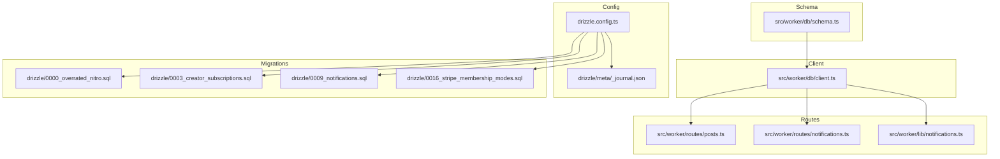
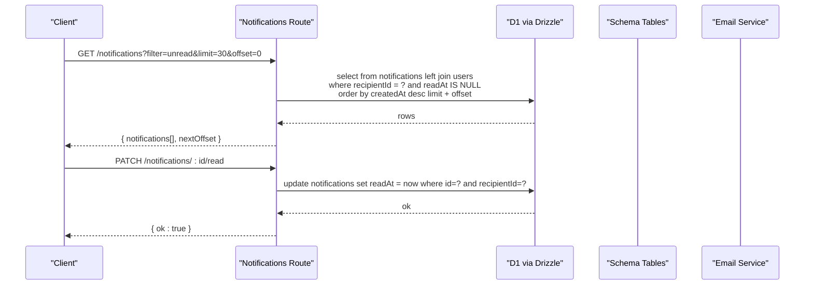
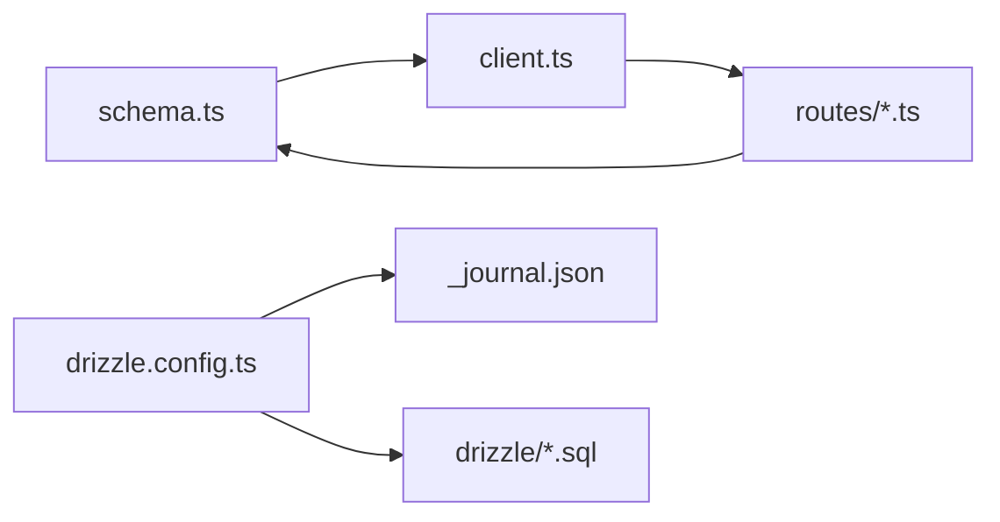

# Database Design

<cite>
**Referenced Files in This Document**
- [schema.ts](file://src/worker/db/schema.ts)
- [client.ts](file://src/worker/db/client.ts)
- [drizzle.config.ts](file://drizzle.config.ts)
- [_journal.json](file://drizzle/meta/_journal.json)
- [0000_overrated_nitro.sql](file://drizzle/0000_overrated_nitro.sql)
- [0003_creator_subscriptions.sql](file://drizzle/0003_creator_subscriptions.sql)
- [0009_notifications.sql](file://drizzle/0009_notifications.sql)
- [0016_stripe_membership_modes.sql](file://drizzle/0016_stripe_membership_modes.sql)
- [posts.ts](file://src/worker/routes/posts.ts)
- [notifications.ts](file://src/worker/routes/notifications.ts)
- [notifications.ts (lib)](file://src/worker/lib/notifications.ts)
</cite>

## Table of Contents
1. Introduction
2. Project Structure
3. Core Components
4. Architecture Overview
5. Detailed Component Analysis
6. Dependency Analysis
7. Performance Considerations
8. Troubleshooting Guide
9. Conclusion
10. Appendices

## Introduction
This document provides comprehensive data model documentation for the Zenith database schema implemented with Drizzle ORM and SQLite via Cloudflare D1. It covers entity relationships among users, posts, subscriptions, notifications, and media; field definitions and constraints; indexes; migration management using Drizzle Kit; query patterns; performance considerations specific to SQLite/D1; lifecycle policies including soft deletes and archival; and security aspects such as access control and privacy.

## Project Structure
The database layer is defined in a single schema file and accessed through a typed client. Migrations are managed by Drizzle Kit with SQL files stored under drizzle/. The worker routes demonstrate how queries are constructed and executed against D1.



**Diagram sources**
- [schema.ts](file://src/worker/db/schema.ts)
- [client.ts](file://src/worker/db/client.ts)
- [drizzle.config.ts](file://drizzle.config.ts)
- [_journal.json](file://drizzle/meta/_journal.json)
- [0000_overrated_nitro.sql](file://drizzle/0000_overrated_nitro.sql)
- [0003_creator_subscriptions.sql](file://drizzle/0003_creator_subscriptions.sql)
- [0009_notifications.sql](file://drizzle/0009_notifications.sql)
- [0016_stripe_membership_modes.sql](file://drizzle/0016_stripe_membership_modes.sql)
- [posts.ts](file://src/worker/routes/posts.ts)
- [notifications.ts](file://src/worker/routes/notifications.ts)
- [notifications.ts (lib)](file://src/worker/lib/notifications.ts)

**Section sources**
- [schema.ts](file://src/worker/db/schema.ts)
- [client.ts](file://src/worker/db/client.ts)
- [drizzle.config.ts](file://drizzle.config.ts)
- [_journal.json](file://drizzle/meta/_journal.json)

## Core Components
- Users: Identity and profile, roles, account status, timestamps.
- Posts: Central content entity with kind polymorphism (post, article, audio, photography, course).
- Media Attachments: Post-level attachments and specialized media entities (audio collections/items, photography albums/photos, course modules/lessons/attachments).
- Subscriptions and Payments: Membership plans, prices, customers, subscription memberships, revenue events, webhook processing, trial claims, transitions.
- Notifications: In-app notifications with preferences, deduplication, email status tracking.
- Interactions: Likes, replies, polls/votes, saved items, follows.
- Administration and Moderation: Admin memberships, creator applications, moderation cases, reports, audit logs.

Key constraints and indexing strategies are defined per table to optimize common queries on D1/SQLite.

**Section sources**
- [schema.ts](file://src/worker/db/schema.ts)

## Architecture Overview
The data architecture centers around Drizzle ORM with a typed schema and migrations. Routes compose queries using Drizzle’s query builder, often joining related tables and applying filters and pagination. Notifications integrate with email services based on user preferences.



**Diagram sources**
- [notifications.ts](file://src/worker/routes/notifications.ts)
- [schema.ts](file://src/worker/db/schema.ts)

**Section sources**
- [notifications.ts](file://src/worker/routes/notifications.ts)
- [schema.ts](file://src/worker/db/schema.ts)

## Detailed Component Analysis

### Users and Authentication
- users: Primary identity table with unique email and username, role enum, account status, suspension fields, and timestamps.
- session, account, verification: Better Auth integration for sessions, OAuth accounts, and verification tokens.

Indexes:
- users_account_status_idx supports filtering by account status.
- session_user_id_idx, account_user_id_idx, verification_identifier_idx support auth flows.

Relationships:
- Many-to-one from session/account/verification to users.

Security:
- Password hash stored securely; tokens and credentials handled via Better Auth tables.

**Section sources**
- [schema.ts](file://src/worker/db/schema.ts)

### Posts and Content Types
- posts: Polymorphic content with kind enum and moderation fields. Unique author+slug constraint ensures URL stability.
- articles, audioCollections/audioItems, photographyAlbums/photographyPhotos, courses/courseModules/courseLessons/courseAttachments: Specialized content types linked back to posts or creators.

Indexes:
- posts_kind_created_idx, posts_author_created_idx, posts_moderation_author_idx, posts_kind_published_idx optimize feed and discovery queries.
- Creator-specific indexes for ordering and published state.

Lifecycle:
- Soft delete via deletedAt on postReplies; moderationStatus controls visibility.

**Section sources**
- [schema.ts](file://src/worker/db/schema.ts)
- [posts.ts](file://src/worker/routes/posts.ts)

### Media Attachments
- postAttachments and replyAttachments store R2 keys and metadata for uploaded media.
- Specialized media entities include cover and original assets for audio and photography.

Constraints:
- Unique r2Key prevents duplicate references.
- displayOrder enables deterministic ordering.

**Section sources**
- [schema.ts](file://src/worker/db/schema.ts)
- [posts.ts](file://src/worker/routes/posts.ts)

### Subscriptions and Payments
Core entities:
- membershipPlans, membershipPlanPrices, paymentCustomers, subscriptionMemberships.
- revenueEvents, paymentWebhookEvents, membershipTrialClaims, membershipPlanTransitions.

Key relationships:
- subscriptionMemberships links subscriber and creator with plan and price references.
- revenueEvents ties payments to creators/subscribers/memberships.
- Webhook events track provider events with idempotency and retry semantics.

Indexes:
- subscription_memberships_subscriber_creator_unique enforces one active subscription per creator-subscriber pair.
- Indexed by creator, subscriber, provider subscription, checkout session, and plan price for fast lookups.
- revenue_events_provider_invoice_unique ensures idempotent event processing.

Migration highlights:
- Mode-based plan configuration and revisioning.
- Transition jobs for paid-mode changes with retry scheduling.

**Section sources**
- [schema.ts](file://src/worker/db/schema.ts)
- [0003_creator_subscriptions.sql](file://drizzle/0003_creator_subscriptions.sql)
- [0016_stripe_membership_modes.sql](file://drizzle/0016_stripe_membership_modes.sql)

### Notifications
Entities:
- notifications with type/category enums, dedupe_key, read_at, email status fields.
- notification_preferences per user controlling email toggles.

Indexes:
- notifications_recipient_read_created_idx and notifications_recipient_created_idx optimize listing and unread counts.
- notifications_actor_idx supports actor-centric queries.

Behavior:
- Deduplication via unique dedupe_key.
- Preference-driven email sending with status tracking.

**Section sources**
- [schema.ts](file://src/worker/db/schema.ts)
- [0009_notifications.sql](file://drizzle/0009_notifications.sql)
- [notifications.ts](file://src/worker/routes/notifications.ts)
- [notifications.ts (lib)](file://src/worker/lib/notifications.ts)

### Interactions and Social Graph
- follows: Follower-followee relationship with indexes for both sides.
- postLikes/replyLikes: Like states with composite primary keys and user indexes.
- postPolls/pollOptions/pollVotes: Polls with ordered options and per-user voting constraints.
- savedItems: User-saved posts with timestamped saves.

Indexes:
- Optimized for follower/followee enumeration, like counts, poll ordering, and saved lists.

**Section sources**
- [schema.ts](file://src/worker/db/schema.ts)

### Administration and Moderation
- adminMemberships: Role-based admin access.
- creatorApplications: Application workflow with status and review fields.
- moderationCases/contentReports/adminAuditLogs: Case management, reporting, and audit trails.

Indexes:
- Status and updated timestamps for efficient queueing and review workflows.

**Section sources**
- [schema.ts](file://src/worker/db/schema.ts)

### Data Model Diagram
```mermaid
erDiagram
USERS ||--o{ SESSIONS : "has many"
USERS ||--o{ ACCOUNTS : "has many"
USERS ||--o{ POSTS : "author"
USERS ||--o{ POST_REPLIES : "author"
USERS ||--o{ FOLLOWERS : "follower"
USERS ||--o{ FOLLOWEES : "followee"
USERS ||--o{ SUBSCRIPTION_MEMBERSHIPS : "subscriber"
USERS ||--o{ NOTIFICATIONS : "recipient"
USERS ||--o{ ADMIN_MEMBERSHIPS : "admin"
USERS ||--o{ CREATOR_APPLICATIONS : "applicant"
USERS ||--o{ PAYMENT_CUSTOMERS : "customer"
USERS ||--o{ COURSE_ATTACHMENTS : "uploader"
USERS ||--o{ POST_ATTACHMENTS : "uploader"
USERS ||--o{ REPLY_ATTACHMENTS : "uploader"
POSTS ||--|| ARTICLES : "one-to-one"
POSTS ||--o{ AUDIO_ITEMS : "one-to-one"
POSTS ||--|| PHOTOGRAPHY_ALBUMS : "one-to-one"
POSTS ||--|| COURSES : "one-to-one"
POSTS ||--o{ POST_ATTACHMENTS : "has many"
POSTS ||--o{ POST_LIKES : "likes"
POSTS ||--o{ POST_POLLS : "poll"
POSTS ||--o{ POST_REPLIES : "replies"
AUDIO_COLLECTIONS ||--o{ AUDIO_ITEMS : "contains"
PHOTOGRAPHY_ALBUMS ||--o{ PHOTOGRAPHY_PHOTOS : "contains"
COURSES ||--o{ COURSE_MODULES : "modules"
COURSE_MODULES ||--o{ COURSE_LESSONS : "lessons"
COURSE_LESSONS ||--o{ COURSE_ATTACHMENTS : "attachments"
MEMBERSHIP_PLANS ||--o{ MEMBERSHIP_PLAN_PRICES : "prices"
MEMBERSHIP_PLANS ||--o{ SUBSCRIPTION_MEMBERSHIPS : "plans"
MEMBERSHIP_PLANS ||--o{ MEMBERSHIP_TRIAL_CLAIMS : "trials"
MEMBERSHIP_PLANS ||--o{ MEMBERSHIP_PLAN_TRANSITIONS : "transitions"
SUBSCRIPTION_MEMBERSHIPS ||--o{ REVENUE_EVENTS : "events"
PAYMENT_WEBHOOK_EVENTS ||..|> SUBSCRIPTION_MEMBERSHIPS : "drives"
NOTIFICATIONS ||--|| NOTIFICATION_PREFERENCES : "per user"
```

**Diagram sources**
- [schema.ts](file://src/worker/db/schema.ts)

## Dependency Analysis
- Schema defines all tables, constraints, and indexes.
- Client wires Drizzle ORM to D1 with schema typing.
- Routes import schema tables and construct queries using Drizzle operators.
- Migrations evolve schema over time; journal tracks versions.



**Diagram sources**
- [schema.ts](file://src/worker/db/schema.ts)
- [client.ts](file://src/worker/db/client.ts)
- [drizzle.config.ts](file://drizzle.config.ts)
- [_journal.json](file://drizzle/meta/_journal.json)
- [0000_overrated_nitro.sql](file://drizzle/0000_overrated_nitro.sql)
- [0003_creator_subscriptions.sql](file://drizzle/0003_creator_subscriptions.sql)
- [0009_notifications.sql](file://drizzle/0009_notifications.sql)
- [0016_stripe_membership_modes.sql](file://drizzle/0016_stripe_membership_modes.sql)
- [posts.ts](file://src/worker/routes/posts.ts)
- [notifications.ts](file://src/worker/routes/notifications.ts)

**Section sources**
- [schema.ts](file://src/worker/db/schema.ts)
- [client.ts](file://src/worker/db/client.ts)
- [drizzle.config.ts](file://drizzle.config.ts)
- [_journal.json](file://drizzle/meta/_journal.json)

## Performance Considerations
- SQLite via D1 benefits from targeted indexes:
  - Feed queries use posts_kind_created_idx and posts_author_created_idx.
  - Notification listing uses recipient+readAt+createdAt composite index.
  - Subscription lookups indexed by creator, subscriber, provider subscription, and plan price.
- Prefer selective WHERE clauses and avoid full-table scans.
- Use LIMIT/OFFSET judiciously; consider keyset pagination for large result sets.
- Minimize joins; precompute aggregates when necessary (e.g., unread counts via count(*)).
- Batch writes for high-throughput scenarios (e.g., bulk attachment inserts).
- Leverage unique constraints for idempotency (dedupe_key, provider invoice IDs).

[No sources needed since this section provides general guidance]

## Troubleshooting Guide
Common issues and resolutions:
- Duplicate notifications: Ensure dedupe_key uniqueness; verify conflict handling in createNotification.
- Missing actor details in notifications: Confirm left join on users.actorId and nullable handling.
- Subscription conflicts: Check unique constraints on subscriber+creator pairs and plan_price references.
- Migration failures: Validate _journal.json entries and ensure SQL migrations match schema changes.
- Email not sent: Verify notification preferences and transactional email availability flags.

Operational checks:
- Inspect indexes used by EXPLAIN-like diagnostics if available in your environment.
- Review error codes and messages in content_schedules and membership_plan_transitions for retries.

**Section sources**
- [notifications.ts (lib)](file://src/worker/lib/notifications.ts)
- [notifications.ts](file://src/worker/routes/notifications.ts)
- [schema.ts](file://src/worker/db/schema.ts)

## Conclusion
The Zenith database schema is designed for clarity, performance, and extensibility on SQLite/D1. Strong typing via Drizzle ORM, robust indexing, and careful constraint design enable efficient operations across core domains: users, posts/media, subscriptions/payments, notifications, and interactions. Migrations provide safe evolution, while route-level patterns demonstrate practical query construction and optimization.

[No sources needed since this section summarizes without analyzing specific files]

## Appendices

### Migration System with Drizzle Kit
- Configuration points dialect, driver (d1-http), and credentials.
- Schema source path and output directory for generated SQL.
- Journal tracks versioned entries and breakpoints.

Usage:
- Generate migrations from schema changes.
- Apply migrations to D1 using configured credentials.

**Section sources**
- [drizzle.config.ts](file://drizzle.config.ts)
- [_journal.json](file://drizzle/meta/_journal.json)

### Example Query Patterns
- List unread notifications with pagination and actor details.
- Create post attachments and persist R2 metadata.
- Upsert notification preferences with defaults.

References:
- Notification listing and marking read.
- Attachment upload flow.
- Preferences upsert logic.

**Section sources**
- [notifications.ts](file://src/worker/routes/notifications.ts)
- [posts.ts](file://src/worker/routes/posts.ts)
- [notifications.ts (lib)](file://src/worker/lib/notifications.ts)

### Data Lifecycle Management
- Soft deletes:
  - post_replies.deletedAt indicates soft deletion; moderationStatus controls visibility.
- Archival policies:
  - Consider archiving old revenue_events and webhook events periodically.
- Cleanup procedures:
  - Purge expired sessions and verification tokens.
  - Remove orphaned media references after cascade deletes.

**Section sources**
- [schema.ts](file://src/worker/db/schema.ts)

### Security and Privacy
- Access control:
  - Middleware enforces authentication and roles; routes validate ownership.
- Encryption at rest:
  - D1 storage encryption applies at platform level; application-level sensitive fields should be minimized.
- Privacy requirements:
  - Avoid storing unnecessary PII; prefer R2 keys over inline binaries.
  - Enforce unique constraints to prevent duplicates and ensure integrity.

**Section sources**
- [schema.ts](file://src/worker/db/schema.ts)
- [posts.ts](file://src/worker/routes/posts.ts)
- [notifications.ts](file://src/worker/routes/notifications.ts)