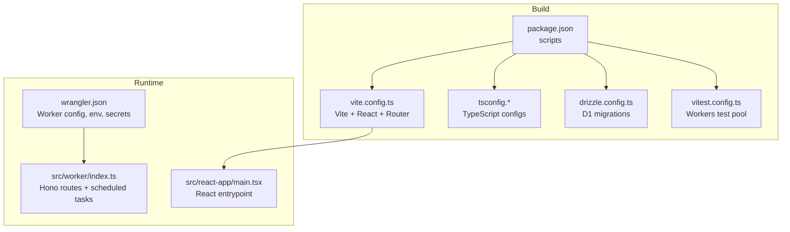
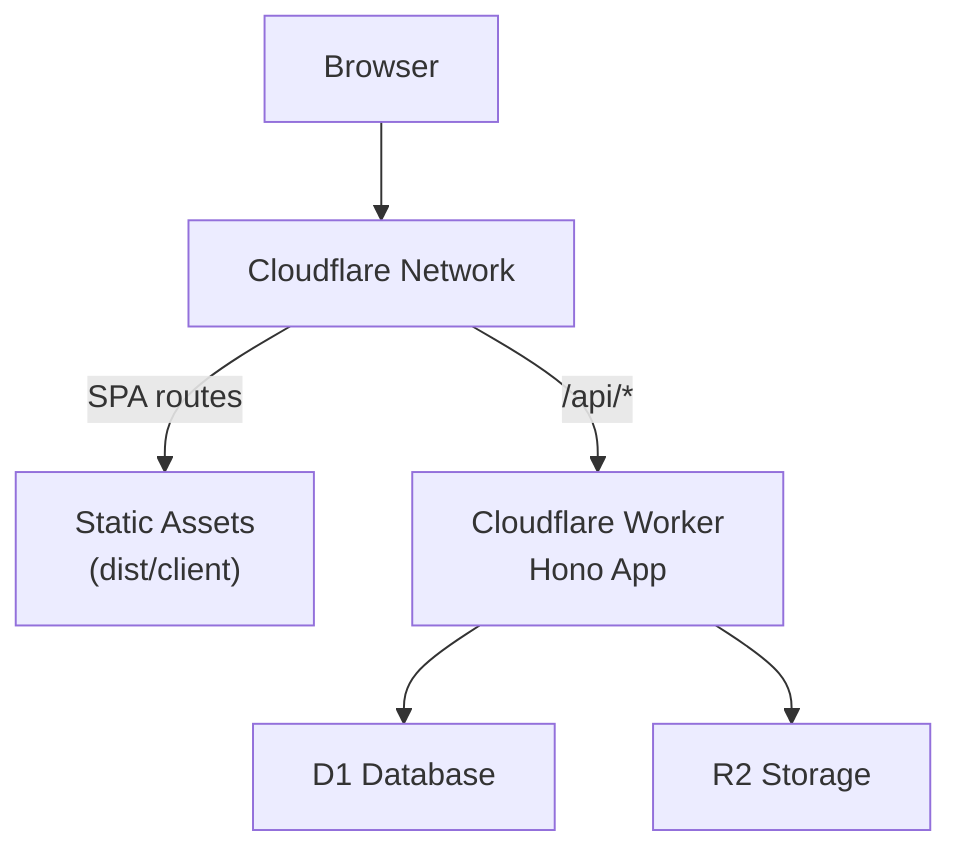
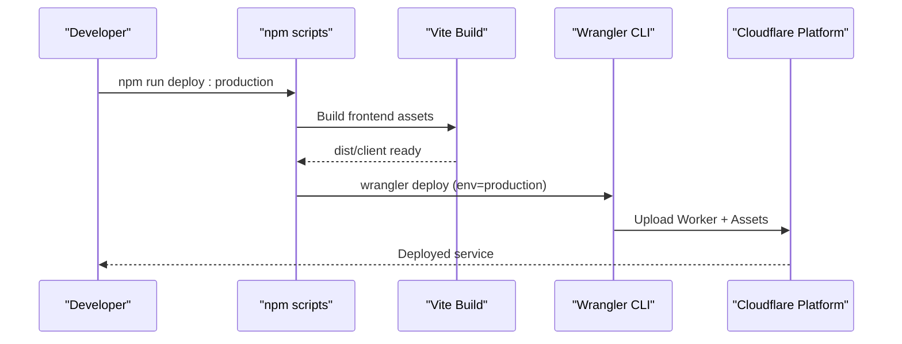
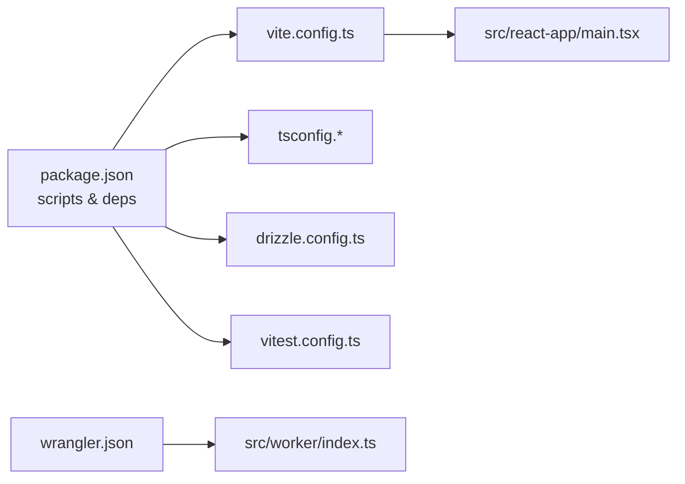

# Deployment and DevOps

<cite>
**Referenced Files in This Document**
- [package.json](file://package.json)
- [wrangler.json](file://wrangler.json)
- [vite.config.ts](file://vite.config.ts)
- [tsconfig.json](file://tsconfig.json)
- [tsconfig.worker.json](file://tsconfig.worker.json)
- [drizzle.config.ts](file://drizzle.config.ts)
- [vitest.config.ts](file://vitest.config.ts)
- [src/worker/index.ts](file://src/worker/index.ts)
- [src/react-app/main.tsx](file://src/react-app/main.tsx)
- [.codex/environments/environment.toml](file://.codex/environments/environment.toml)
</cite>

## Table of Contents
1. [Introduction](#introduction)
2. [Project Structure](#project-structure)
3. [Core Components](#core-components)
4. [Architecture Overview](#architecture-overview)
5. [Detailed Component Analysis](#detailed-component-analysis)
6. [Dependency Analysis](#dependency-analysis)
7. [Performance Considerations](#performance-considerations)
8. [Troubleshooting Guide](#troubleshooting-guide)
9. [Conclusion](#conclusion)
10. [Appendices](#appendices)

## Introduction
This document provides comprehensive deployment and DevOps guidance for Zenith, a full-stack application built with Cloudflare Workers (Hono), Vite-based React frontend, Drizzle ORM, and TypeScript. It covers:
- Cloudflare Workers deployment using Wrangler CLI
- Environment configuration management across development, staging, and production
- Build process for frontend assets and TypeScript compilation
- CI/CD pipeline recommendations, automated testing, and rollback strategies
- Monitoring and logging via Cloudflare Observability and custom solutions
- Scaling considerations, performance optimization, and security best practices
- Troubleshooting, debugging in production, and maintenance procedures

## Project Structure
Zenith is organized into two primary runtime targets:
- Frontend: React app built by Vite and served as static assets from the Worker’s assets binding
- Backend: Hono-based API running on Cloudflare Workers, with D1 database and R2 storage bindings

Key build and configuration files:
- package.json defines scripts for building, deploying, linting, and testing
- wrangler.json configures the Worker, environment variables, secrets, assets, and bindings
- vite.config.ts configures the Vite build, plugins, and asset handling
- tsconfig.* files configure TypeScript compilation for app, node, and worker targets
- drizzle.config.ts configures Drizzle migrations against D1
- vitest.config.ts sets up tests with the Cloudflare Workers pool

**Diagram sources**
- [package.json:83-95](file://package.json#L83-L95)
- [vite.config.ts:1-28](file://vite.config.ts#L1-L28)
- [tsconfig.json:1-17](file://tsconfig.json#L1-L17)
- [tsconfig.worker.json:1-10](file://tsconfig.worker.json#L1-L10)
- [drizzle.config.ts:1-14](file://drizzle.config.ts#L1-L14)
- [vitest.config.ts:1-14](file://vitest.config.ts#L1-L14)
- [wrangler.json:1-139](file://wrangler.json#L1-L139)
- [src/worker/index.ts:1-71](file://src/worker/index.ts#L1-L71)
- [src/react-app/main.tsx:1-38](file://src/react-app/main.tsx#L1-L38)

**Section sources**
- [package.json:1-98](file://package.json#L1-L98)
- [wrangler.json:1-139](file://wrangler.json#L1-L139)
- [vite.config.ts:1-28](file://vite.config.ts#L1-L28)
- [tsconfig.json:1-17](file://tsconfig.json#L1-L17)
- [tsconfig.worker.json:1-10](file://tsconfig.worker.json#L1-L10)
- [drizzle.config.ts:1-14](file://drizzle.config.ts#L1-L14)
- [vitest.config.ts:1-14](file://vitest.config.ts#L1-L14)
- [src/worker/index.ts:1-71](file://src/worker/index.ts#L1-L71)
- [src/react-app/main.tsx:1-38](file://src/react-app/main.tsx#L1-L38)

## Core Components
- Cloudflare Worker (Hono): Central API server that mounts multiple route modules and exposes a fetch handler plus a scheduled task executor.
- Assets: Static frontend assets are served through the Worker’s ASSETS binding; API requests under /api/* are routed to the Worker first.
- Environment and Secrets: Configuration via vars and secrets defined per environment in wrangler.json; sensitive values must be provided at deploy time or via CI secrets.
- Database and Storage: D1 database and R2 bucket bindings configured per environment; migrations managed via Drizzle.
- Build Pipeline: TypeScript compilation and Vite build produce optimized client assets; Wrangler packages and deploys the Worker.

Operational highlights:
- The Worker exports both fetch and scheduled handlers for background jobs.
- Error and not-found handlers provide consistent responses and asset fallback behavior.
- Tests run against a Workers-compatible test environment.

**Section sources**
- [src/worker/index.ts:1-71](file://src/worker/index.ts#L1-L71)
- [wrangler.json:26-33](file://wrangler.json#L26-L33)
- [wrangler.json:34-43](file://wrangler.json#L34-L43)
- [wrangler.json:66-114](file://wrangler.json#L66-L114)
- [drizzle.config.ts:1-14](file://drizzle.config.ts#L1-L14)
- [vitest.config.ts:1-14](file://vitest.config.ts#L1-L14)

## Architecture Overview
The system comprises a Vite-built React SPA served as static assets and a Cloudflare Worker hosting the API layer. Requests to /api/* are handled by the Worker; all other requests fall back to the SPA. Background tasks execute on a schedule.

**Diagram sources**
- [wrangler.json:26-33](file://wrangler.json#L26-L33)
- [src/worker/index.ts:24-45](file://src/worker/index.ts#L24-L45)
- [src/worker/index.ts:62-70](file://src/worker/index.ts#L62-L70)

## Detailed Component Analysis

### Cloudflare Workers Deployment with Wrangler
- Entry point and routing: The Worker exports a Hono app with mounted routes and error/not-found handlers. A scheduled handler runs periodic maintenance tasks.
- Assets integration: The assets binding serves the built SPA; API routes take precedence.
- Environments: wrangler.json defines default vars and a production environment with separate name, cron triggers, vars, secrets, and bindings.
- Secrets: Sensitive values are declared required for production and must be supplied securely during deployment.

Recommended deployment workflow:
- Local development: Use dev script to start Vite and preview locally.
- Dry-run: Validate build and deployment configuration without publishing.
- Production deploy: Build and deploy with environment flags set to production.

**Diagram sources**
- [package.json:83-95](file://package.json#L83-L95)
- [wrangler.json:66-114](file://wrangler.json#L66-L114)
- [src/worker/index.ts:62-70](file://src/worker/index.ts#L62-L70)

**Section sources**
- [wrangler.json:1-139](file://wrangler.json#L1-L139)
- [src/worker/index.ts:1-71](file://src/worker/index.ts#L1-L71)
- [package.json:83-95](file://package.json#L83-L95)

### Environment Configuration Management
- Default vars: Non-sensitive configuration is defined at the root level of wrangler.json.
- Production overrides: Separate name, cron triggers, vars, secrets, email senders, D1, and R2 bindings are specified under the production environment.
- Required secrets: Production requires specific secrets; these should be injected via CI/CD or Wrangler secret management.
- Development convenience: A local environment file exists for quick actions but is auto-generated and not intended for manual edits.

Environment variable strategy:
- Keep non-secret configuration in code (wrangler.json vars).
- Store secrets in platform-managed secret stores and reference them in deployments.
- Use environment flags to switch between environments consistently.

**Section sources**
- [wrangler.json:34-43](file://wrangler.json#L34-L43)
- [wrangler.json:66-114](file://wrangler.json#L66-L114)
- [.codex/environments/environment.toml:1-12](file://.codex/environments/environment.toml#L1-L12)

### Build Process: Vite and TypeScript
- Vite configuration: Uses React, TanStack Router plugin, Tailwind CSS, and Cloudflare plugin. Aliases simplify imports.
- TypeScript configuration: Multi-project setup with references for app, node, and worker targets; worker types include generated declarations.
- Scripts: Build compiles TypeScript then builds assets; production build sets an environment flag; dry-run validates deployment.

Build flow:
- Compile TypeScript across projects
- Generate route tree and optimize assets
- Output client bundle for assets binding

**Section sources**
- [vite.config.ts:1-28](file://vite.config.ts#L1-L28)
- [tsconfig.json:1-17](file://tsconfig.json#L1-L17)
- [tsconfig.worker.json:1-10](file://tsconfig.worker.json#L1-L10)
- [package.json:83-95](file://package.json#L83-L95)

### Database Migrations with Drizzle
- Drizzle configuration: Points to schema, output directory, dialect, driver, and credentials sourced from environment variables.
- Migrations: SQL migration files exist under drizzle; tests demonstrate applying statements against a D1 instance.

Migration workflow:
- Ensure environment variables for account, database, and token are set.
- Run migrations targeting the appropriate D1 instance.
- Verify schema consistency with tests.

**Section sources**
- [drizzle.config.ts:1-14](file://drizzle.config.ts#L1-L14)
- [src/worker/db/discussions-migration.test.ts:1-21](file://src/worker/db/discussions-migration.test.ts#L1-L21)

### Testing Strategy
- Test runner: Vitest configured with the Cloudflare Workers pool to emulate runtime bindings.
- Scope: Worker tests included by pattern; frontend tests can be configured separately if needed.

Testing workflow:
- Run unit and integration tests against a Workers-compatible environment.
- Use environment fixtures where necessary to simulate bindings.

**Section sources**
- [vitest.config.ts:1-14](file://vitest.config.ts#L1-L14)

### Frontend Entrypoint
- React bootstrap: Initializes router, providers, and theme context.
- Integration with backend: API calls are made to /api endpoints served by the Worker.

**Section sources**
- [src/react-app/main.tsx:1-38](file://src/react-app/main.tsx#L1-L38)

## Dependency Analysis
The project’s build and runtime dependencies are orchestrated through npm scripts and configuration files.

**Diagram sources**
- [package.json:1-98](file://package.json#L1-L98)
- [vite.config.ts:1-28](file://vite.config.ts#L1-L28)
- [tsconfig.json:1-17](file://tsconfig.json#L1-L17)
- [wrangler.json:1-139](file://wrangler.json#L1-L139)
- [drizzle.config.ts:1-14](file://drizzle.config.ts#L1-L14)
- [vitest.config.ts:1-14](file://vitest.config.ts#L1-L14)
- [src/worker/index.ts:1-71](file://src/worker/index.ts#L1-L71)
- [src/react-app/main.tsx:1-38](file://src/react-app/main.tsx#L1-L38)

**Section sources**
- [package.json:1-98](file://package.json#L1-L98)
- [wrangler.json:1-139](file://wrangler.json#L1-L139)

## Performance Considerations
- Smart Placement: Enable smart placement to route requests closer to users for lower latency.
- Source Maps: Upload source maps to improve error diagnostics in production.
- Asset Optimization: Vite produces optimized bundles; ensure caching headers are configured at the CDN layer.
- Cron Jobs: Scheduled tasks run periodically; keep logic efficient and idempotent.
- Observability: Enable logs and traces with appropriate sampling rates to balance visibility and cost.

[No sources needed since this section provides general guidance]

## Troubleshooting Guide
Common deployment issues and resolutions:
- Missing secrets: Ensure all required secrets are provided for the target environment before deploying.
- D1 connection errors: Verify account ID, database ID, and token are correctly set for Drizzle migrations.
- Assets not loading: Confirm the assets directory matches the build output and that the Worker’s assets binding is configured.
- Route conflicts: Ensure /api/* routes are prioritized over static assets.
- Test failures: Confirm the Workers test pool is configured and environment fixtures are available.

Debugging techniques:
- Use Wrangler’s dry-run to validate configuration and build artifacts.
- Inspect Cloudflare Observability logs and traces for request-level diagnostics.
- Leverage error and not-found handlers to standardize responses and identify misrouted requests.

Maintenance procedures:
- Regularly update dependencies and review security advisories.
- Monitor scheduled job execution and adjust intervals as needed.
- Rotate secrets periodically and audit access permissions.

**Section sources**
- [wrangler.json:84-90](file://wrangler.json#L84-L90)
- [drizzle.config.ts:8-12](file://drizzle.config.ts#L8-L12)
- [wrangler.json:26-33](file://wrangler.json#L26-L33)
- [src/worker/index.ts:47-60](file://src/worker/index.ts#L47-L60)
- [vitest.config.ts:1-14](file://vitest.config.ts#L1-L14)

## Conclusion
Zenith’s deployment model leverages Cloudflare Workers for scalable, low-latency APIs and Vite for modern frontend builds. With clear separation of concerns across configuration, environment management, and build pipelines, teams can confidently deploy to development, staging, and production. Adopting robust CI/CD practices, observability, and security measures ensures reliable operations and maintainable releases.

[No sources needed since this section summarizes without analyzing specific files]

## Appendices

### CI/CD Pipeline Recommendations
- Stages:
  - Install dependencies
  - Lint and type-check
  - Run tests (Workers pool)
  - Build frontend assets
  - Dry-run deployment
  - Deploy to target environment with secrets injected
- Rollback strategy:
  - Maintain previous successful deployments
  - Use versioned tags and environment-specific aliases
  - Automate rollback on health checks or error thresholds

Automated testing:
- Include unit and integration tests for Worker routes and database migrations.
- Mock external services where necessary to isolate tests.

Security best practices:
- Store secrets in CI/CD secret stores; never commit secrets to code.
- Restrict access to production environments and databases.
- Apply least privilege principles for service bindings.

Monitoring and logging:
- Enable Cloudflare Observability logs and traces.
- Instrument critical paths with structured logging.
- Set up alerts for error rates, latency spikes, and failed scheduled jobs.

Scaling considerations:
- Enable smart placement for global performance.
- Optimize payloads and reduce cold starts by minimizing initialization overhead.
- Use pagination and batching for large datasets.

[No sources needed since this section provides general guidance]