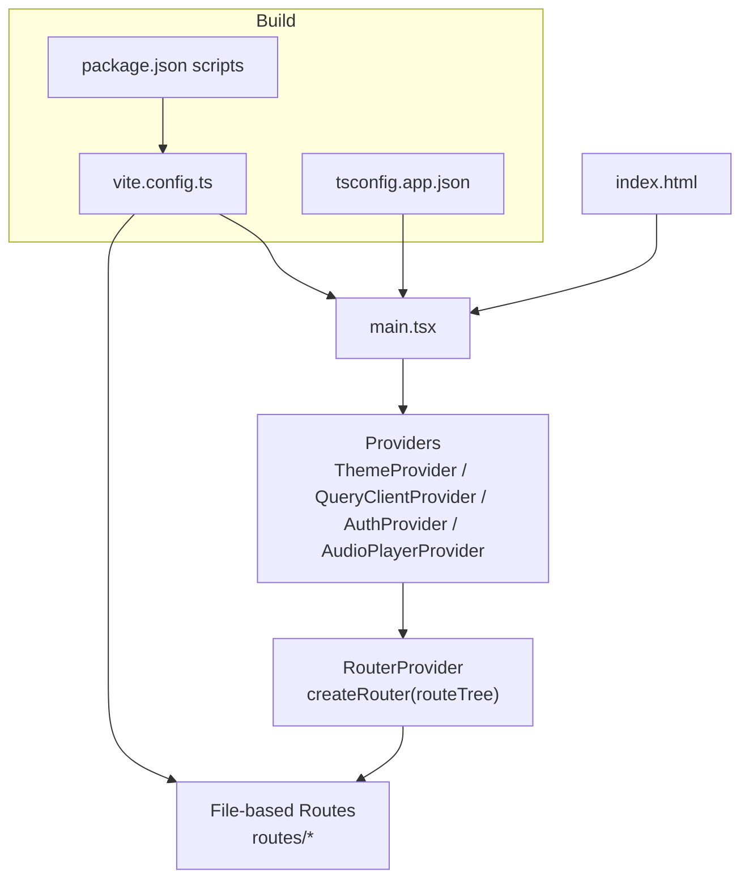
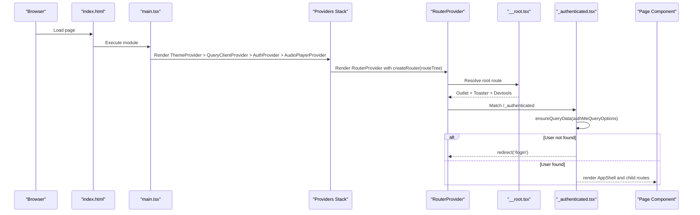
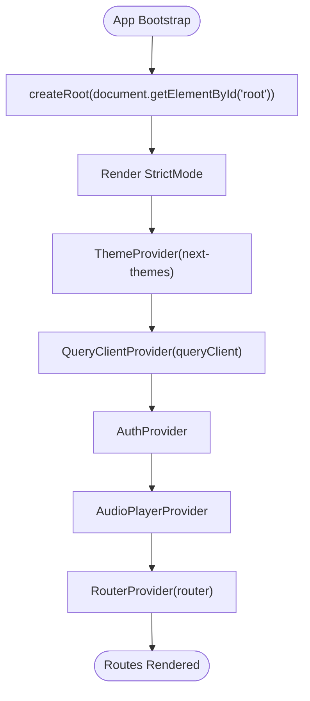
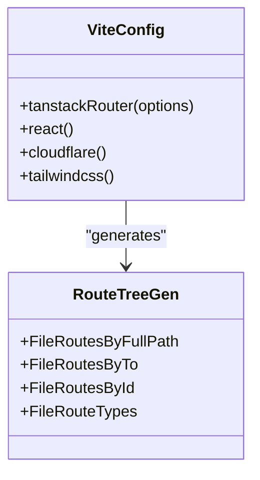
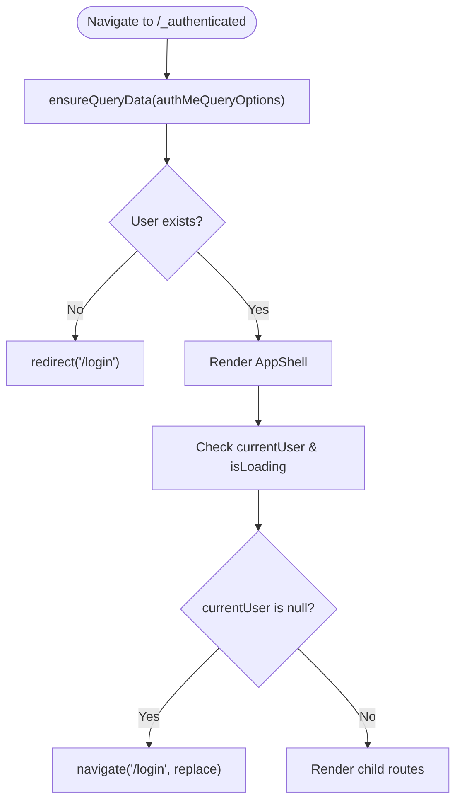
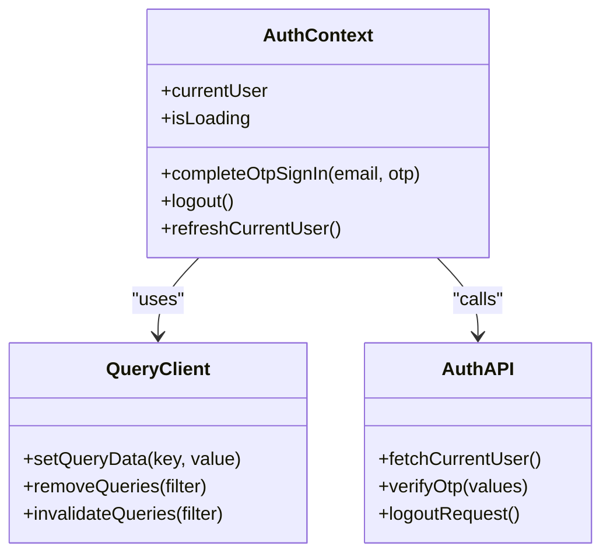
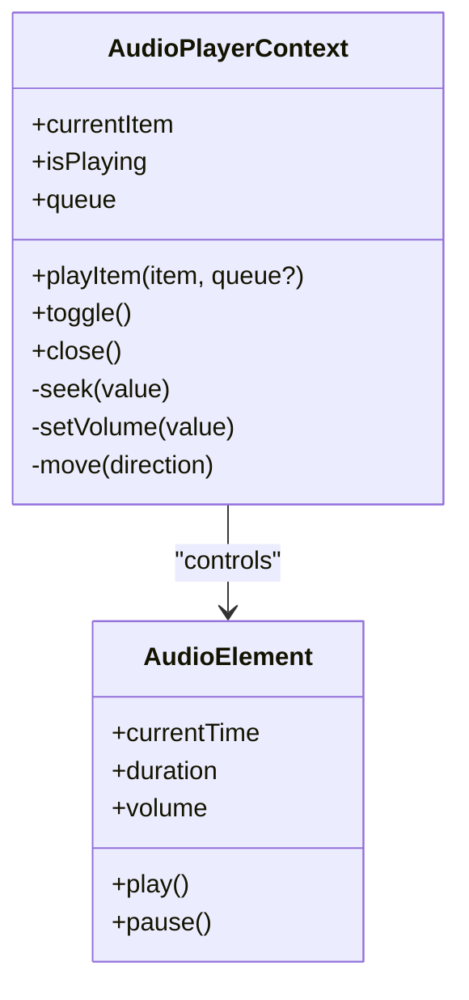
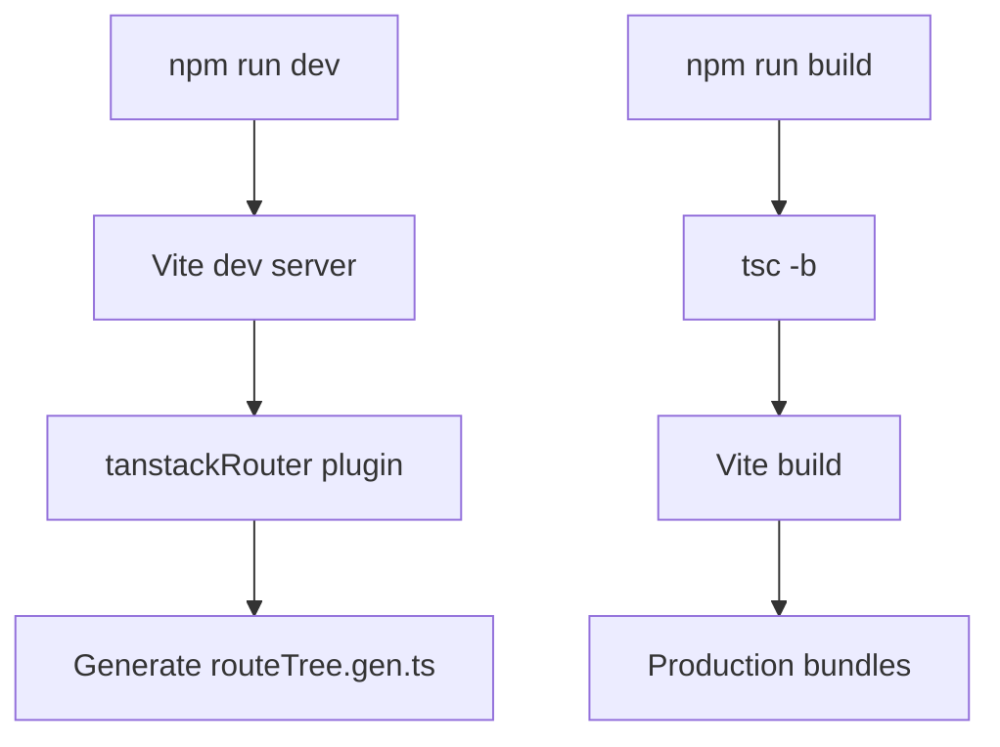
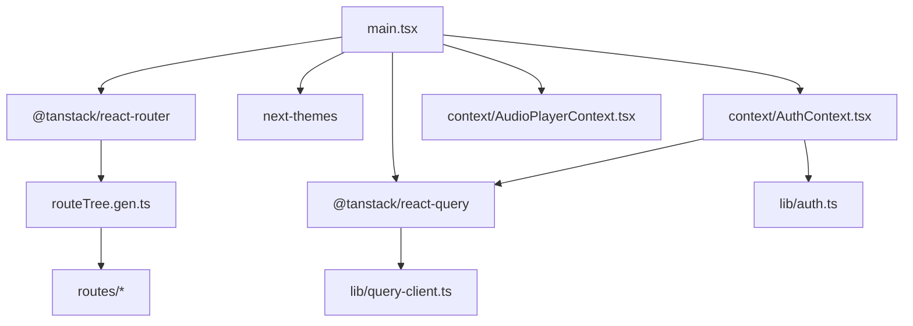

# Application Architecture

<cite>
**Referenced Files in This Document**
- [main.tsx](file://src/react-app/main.tsx)
- [vite.config.ts](file://vite.config.ts)
- [package.json](file://package.json)
- [tsconfig.app.json](file://tsconfig.app.json)
- [routeTree.gen.ts](file://src/react-app/routeTree.gen.ts)
- [AuthContext.tsx](file://src/react-app/context/AuthContext.tsx)
- [AudioPlayerContext.tsx](file://src/react-app/context/AudioPlayerContext.tsx)
- [query-client.ts](file://src/react-app/lib/query-client.ts)
- [__root.tsx](file://src/react-app/routes/__root.tsx)
- [_authenticated.tsx](file://src/react-app/routes/_authenticated.tsx)
- [index.tsx](file://src/react-app/routes/index.tsx)
- [ProtectedRoute.tsx](file://src/react-app/components/ProtectedRoute.tsx)
- [AppShell.tsx](file://src/react-app/components/AppShell.tsx)
- [auth.ts](file://src/react-app/lib/auth.ts)
- [index.html](file://index.html)
</cite>

## Table of Contents
1. Introduction
2. Project Structure
3. Core Components
4. Architecture Overview
5. Detailed Component Analysis
6. Dependency Analysis
7. Performance Considerations
8. Troubleshooting Guide
9. Conclusion

## Introduction
This document explains the React application architecture, focusing on file-based routing with TanStack Router, React 19 and modern hooks patterns, and the global provider hierarchy (ThemeProvider, QueryClientProvider, AuthProvider, AudioPlayerProvider). It covers the entry point configuration, router setup via generated route tree, global context providers, Vite build configuration, TypeScript setup, development workflow, bootstrap process, error boundaries, performance optimizations, authentication vs public routes, route guards, and navigation patterns.

## Project Structure
The frontend lives under src/react-app and is bootstrapped by index.html which loads main.tsx as the module entry. The application uses:
- File-based routing under src/react-app/routes with a generated route tree at src/react-app/routeTree.gen.ts
- Global providers configured in main.tsx
- Vite plugin for TanStack Router to generate types and code-splitting
- Tailwind CSS v4 via @tailwindcss/vite
- Cloudflare Vite plugin for deployment integration

**Diagram sources**
- [index.html:10-14](file://index.html#L10-L14)
- [main.tsx:12-37](file://src/react-app/main.tsx#L12-L37)
- [vite.config.ts:8-21](file://vite.config.ts#L8-L21)
- [tsconfig.app.json:1-33](file://tsconfig.app.json#L1-L33)
- [package.json:83-95](file://package.json#L83-L95)

**Section sources**
- [index.html:10-14](file://index.html#L10-L14)
- [main.tsx:12-37](file://src/react-app/main.tsx#L12-L37)
- [vite.config.ts:8-21](file://vite.config.ts#L8-L21)
- [tsconfig.app.json:1-33](file://tsconfig.app.json#L1-L33)
- [package.json:83-95](file://package.json#L83-L95)

## Core Components
- Entry point and providers: main.tsx creates the router with the generated routeTree and renders the provider stack around RouterProvider.
- Root route: __root.tsx defines the root route context type and includes global UI elements like Toaster and React Query Devtools.
- Authentication guard route: _authenticated.tsx ensures a user session exists before rendering authenticated layouts.
- Index redirect: index.tsx redirects based on authentication state.
- ProtectedRoute component: a reusable guard for protecting arbitrary children.
- AppShell: shared layout for authenticated pages with responsive navigation.
- Contexts:
  - AuthContext: manages current user, OTP sign-in, logout, and query cache synchronization.
  - AudioPlayerContext: manages audio playback state, queue, seek, volume, and dynamic theming from cover art colors.
- Query client: query-client.ts configures default options for queries and mutations.

**Section sources**
- [main.tsx:12-37](file://src/react-app/main.tsx#L12-L37)
- [__root.tsx:10-22](file://src/react-app/routes/__root.tsx#L10-L22)
- [_authenticated.tsx:5-19](file://src/react-app/routes/_authenticated.tsx#L5-L19)
- [index.tsx:4-13](file://src/react-app/routes/index.tsx#L4-L13)
- [ProtectedRoute.tsx:6-18](file://src/react-app/components/ProtectedRoute.tsx#L6-L18)
- [AppShell.tsx:16-25](file://src/react-app/components/AppShell.tsx#L16-L25)
- [AuthContext.tsx:23-83](file://src/react-app/context/AuthContext.tsx#L23-L83)
- [AudioPlayerContext.tsx:135-246](file://src/react-app/context/AudioPlayerContext.tsx#L135-L246)
- [query-client.ts:3-13](file://src/react-app/lib/query-client.ts#L3-L13)

## Architecture Overview
The application initializes React 19 with StrictMode, then layers providers:
- ThemeProvider (next-themes) for theme management
- QueryClientProvider for data fetching and caching
- AuthProvider for session state and auth mutations
- AudioPlayerProvider for global audio playback
- RouterProvider for TanStack Router with a typed context exposing QueryClient

TanStack Router uses file-based routes under src/react-app/routes. A virtual group route _authenticated enforces authentication using ensureQueryData and redirects unauthenticated users. The root route injects global UI and dev tools.

**Diagram sources**
- [index.html:10-14](file://index.html#L10-L14)
- [main.tsx:12-37](file://src/react-app/main.tsx#L12-L37)
- [__root.tsx:10-22](file://src/react-app/routes/__root.tsx#L10-L22)
- [_authenticated.tsx:5-19](file://src/react-app/routes/_authenticated.tsx#L5-L19)

## Detailed Component Analysis

### Provider Hierarchy and Bootstrap
- main.tsx constructs the router with routeTree and provides QueryClient via router context.
- The provider order ensures theme, data layer, auth state, and audio player are available to all routes.
- StrictMode wraps the app for development-time checks.

**Diagram sources**
- [main.tsx:25-37](file://src/react-app/main.tsx#L25-L37)

**Section sources**
- [main.tsx:12-37](file://src/react-app/main.tsx#L12-L37)

### Router Setup and Generated Route Tree
- vite.config.ts configures tanstackRouter plugin to scan routesDirectory and write generatedRouteTree.
- autoCodeSplitting is enabled for optimal bundle sizes.
- routeTree.gen.ts exports typed route definitions and path mappings used by RouterProvider.

**Diagram sources**
- [vite.config.ts:8-21](file://vite.config.ts#L8-L21)
- [routeTree.gen.ts:267-305](file://src/react-app/routeTree.gen.ts#L267-L305)

**Section sources**
- [vite.config.ts:8-21](file://vite.config.ts#L8-L21)
- [routeTree.gen.ts:267-305](file://src/react-app/routeTree.gen.ts#L267-L305)

### Authentication Flow and Route Guards
- _authenticated.tsx uses beforeLoad to ensure the current user exists via ensureQueryData(authMeQueryOptions). If missing, it redirects to /login.
- index.tsx redirects to /feed if authenticated or /login otherwise.
- ProtectedRoute component can be used to protect arbitrary children by checking currentUser and isLoading.
- AppShell performs an additional runtime check to navigate to /login when no user is present.

**Diagram sources**
- [_authenticated.tsx:5-19](file://src/react-app/routes/_authenticated.tsx#L5-L19)
- [index.tsx:4-13](file://src/react-app/routes/index.tsx#L4-L13)
- [ProtectedRoute.tsx:6-18](file://src/react-app/components/ProtectedRoute.tsx#L6-L18)
- [AppShell.tsx:21-25](file://src/react-app/components/AppShell.tsx#L21-L25)

**Section sources**
- [_authenticated.tsx:5-19](file://src/react-app/routes/_authenticated.tsx#L5-L19)
- [index.tsx:4-13](file://src/react-app/routes/index.tsx#L4-L13)
- [ProtectedRoute.tsx:6-18](file://src/react-app/components/ProtectedRoute.tsx#L6-L18)
- [AppShell.tsx:21-25](file://src/react-app/components/AppShell.tsx#L21-L25)

### Auth Context and Data Layer
- AuthContext exposes currentUser, isLoading, completeOtpSignIn, logout, refreshCurrentUser.
- It uses useQuery for current user and useMutation for OTP verification and logout, updating the QueryClient cache accordingly.
- It listens to window events for unauthorized/account-suspended to clear session state.
- auth.ts defines fetchCurrentUser and authMeQueryOptions, integrating with apiGet and apiPostRequired.

**Diagram sources**
- [AuthContext.tsx:23-83](file://src/react-app/context/AuthContext.tsx#L23-L83)
- [auth.ts:20-34](file://src/react-app/lib/auth.ts#L20-L34)
- [query-client.ts:3-13](file://src/react-app/lib/query-client.ts#L3-L13)

**Section sources**
- [AuthContext.tsx:23-83](file://src/react-app/context/AuthContext.tsx#L23-L83)
- [auth.ts:20-34](file://src/react-app/lib/auth.ts#L20-L34)
- [query-client.ts:3-13](file://src/react-app/lib/query-client.ts#L3-L13)

### Audio Player Context
- AudioPlayerContext manages playback state, queue, seek, volume, and derived theme from cover art color.
- It renders a hidden <audio> element and a persistent UI bar with controls.
- Uses useRef for audio element, useMemo for stable value object, and useEffect for side effects (play/pause, metadata updates, image color extraction).

**Diagram sources**
- [AudioPlayerContext.tsx:135-246](file://src/react-app/context/AudioPlayerContext.tsx#L135-L246)

**Section sources**
- [AudioPlayerContext.tsx:135-246](file://src/react-app/context/AudioPlayerContext.tsx#L135-L246)

### Build Configuration and Development Workflow
- Vite config enables TanStack Router plugin, React, Cloudflare, and Tailwind v4.
- Path alias "@" maps to src/react-app for clean imports.
- TypeScript configuration sets ES2020 target, JSX transform, strict mode, and path mapping.
- package.json scripts include dev, build, preview, test, and deploy commands.

**Diagram sources**
- [vite.config.ts:8-21](file://vite.config.ts#L8-L21)
- [tsconfig.app.json:1-33](file://tsconfig.app.json#L1-L33)
- [package.json:83-95](file://package.json#L83-L95)

**Section sources**
- [vite.config.ts:8-21](file://vite.config.ts#L8-L21)
- [tsconfig.app.json:1-33](file://tsconfig.app.json#L1-L33)
- [package.json:83-95](file://package.json#L83-L95)

## Dependency Analysis
The following diagram shows key dependencies between core modules and their roles in the bootstrap and routing flow.

**Diagram sources**
- [main.tsx:12-37](file://src/react-app/main.tsx#L12-L37)
- [routeTree.gen.ts:267-305](file://src/react-app/routeTree.gen.ts#L267-L305)
- [AuthContext.tsx:23-83](file://src/react-app/context/AuthContext.tsx#L23-L83)
- [auth.ts:20-34](file://src/react-app/lib/auth.ts#L20-L34)
- [query-client.ts:3-13](file://src/react-app/lib/query-client.ts#L3-L13)

**Section sources**
- [main.tsx:12-37](file://src/react-app/main.tsx#L12-L37)
- [routeTree.gen.ts:267-305](file://src/react-app/routeTree.gen.ts#L267-L305)
- [AuthContext.tsx:23-83](file://src/react-app/context/AuthContext.tsx#L23-L83)
- [auth.ts:20-34](file://src/react-app/lib/auth.ts#L20-L34)
- [query-client.ts:3-13](file://src/react-app/lib/query-client.ts#L3-L13)

## Performance Considerations
- Code splitting: TanStack Router’s autoCodeSplitting splits routes into separate chunks for faster initial load.
- Query defaults: retry disabled and refetchOnWindowFocus disabled reduce unnecessary network requests.
- Stale time: authMeQueryOptions uses staleTime to avoid frequent revalidation.
- Memoization: AudioPlayerContext uses useMemo for stable value objects; useCallback for handlers.
- StrictMode: helps catch potential issues during development without impacting production.

[No sources needed since this section provides general guidance]

## Troubleshooting Guide
- Unauthenticated access:
  - _authenticated.tsx redirects to /login if ensureQueryData returns no user.
  - AppShell navigates to /login when currentUser is null after loading.
- Session invalidation:
  - AuthContext clears auth keys.me and related queries on logout and unauthorized events.
- Query errors:
  - query-client.ts disables retries; handle errors in components/mutations explicitly.
- Audio playback:
  - AudioPlayerContext catches play failures and resets isPlaying; ensure streamUrl and coverUrl are valid.

**Section sources**
- [_authenticated.tsx:5-19](file://src/react-app/routes/_authenticated.tsx#L5-L19)
- [AppShell.tsx:21-25](file://src/react-app/components/AppShell.tsx#L21-L25)
- [AuthContext.tsx:41-49](file://src/react-app/context/AuthContext.tsx#L41-L49)
- [query-client.ts:3-13](file://src/react-app/lib/query-client.ts#L3-L13)
- [AudioPlayerContext.tsx:203-211](file://src/react-app/context/AudioPlayerContext.tsx#L203-L211)

## Conclusion
The application leverages TanStack Router’s file-based routing with a generated route tree, React 19 with modern hooks, and a layered provider architecture for theming, data, authentication, and audio playback. The bootstrap process in main.tsx wires everything together, while route-level guards and context-driven logic enforce authentication and manage state efficiently. Vite and TypeScript configurations streamline development and production builds, and performance is optimized through code splitting, query defaults, and memoization.