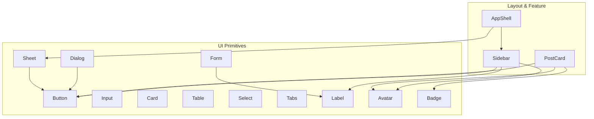
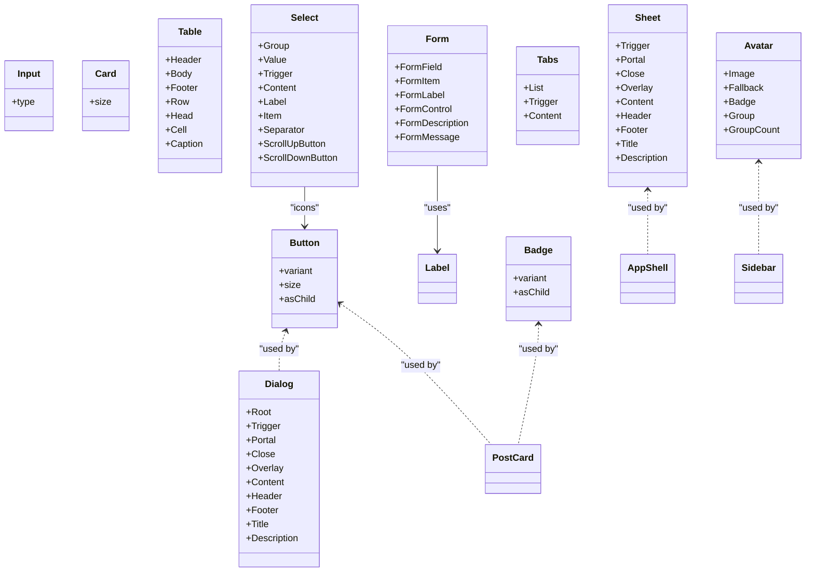
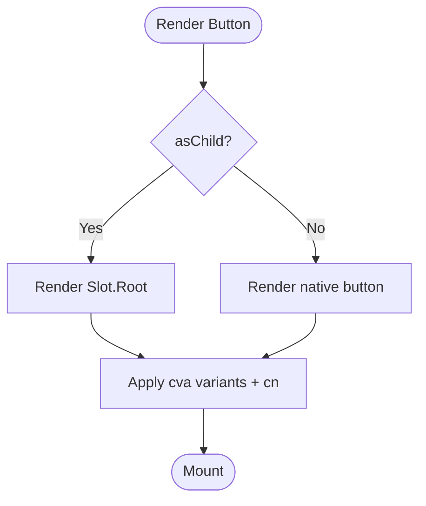
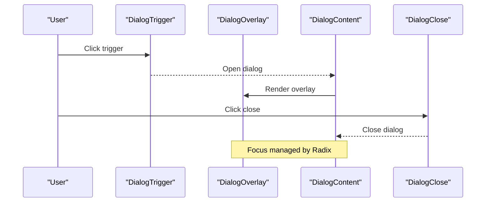
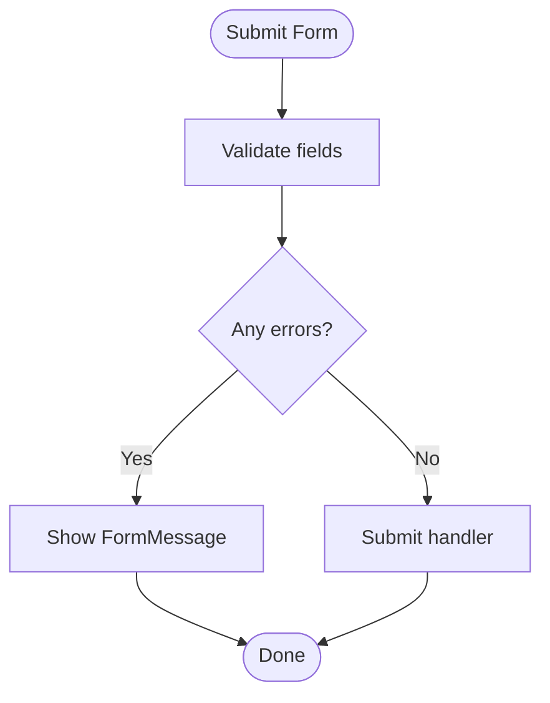
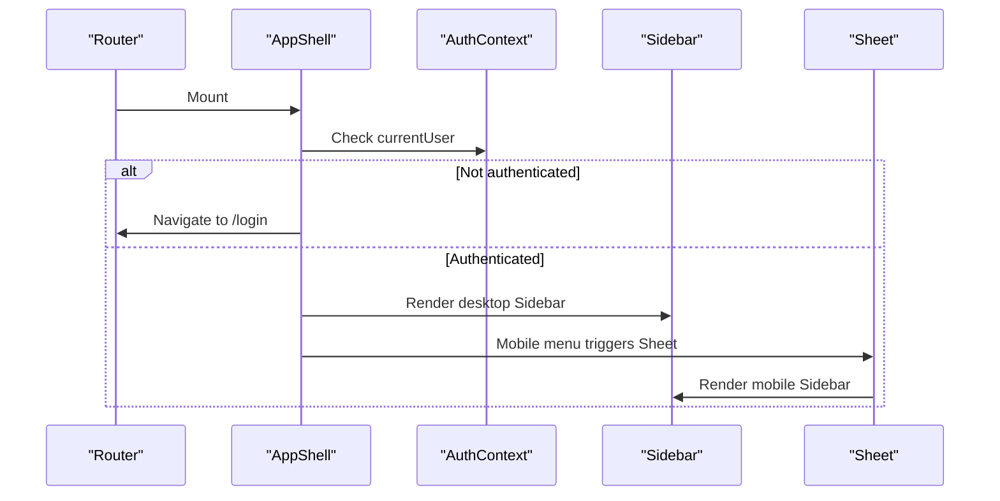
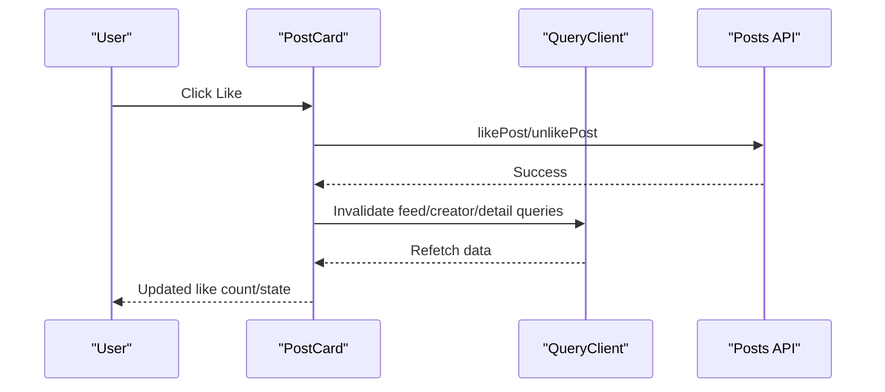
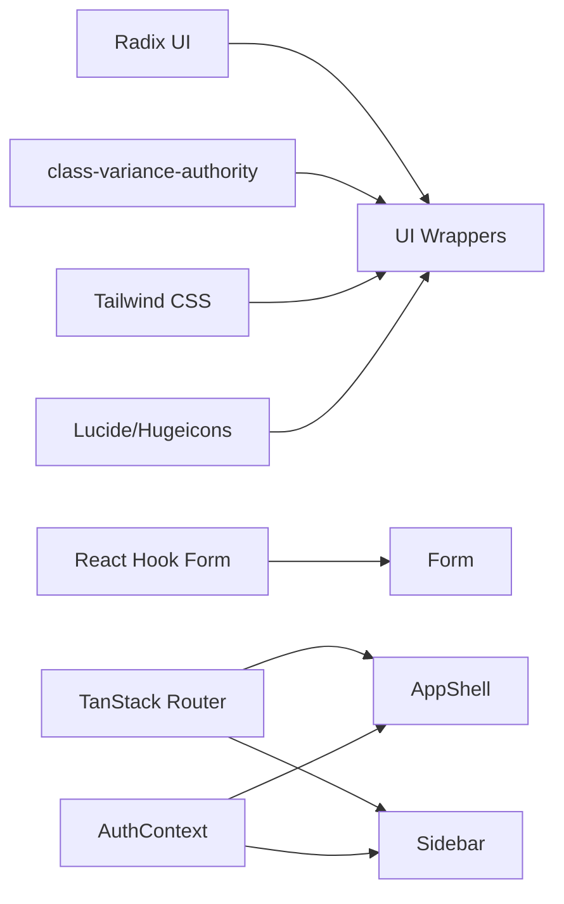

# Component Library

<cite>
**Referenced Files in This Document**
- [button.tsx](file://src/react-app/components/ui/button.tsx)
- [input.tsx](file://src/react-app/components/ui/input.tsx)
- [dialog.tsx](file://src/react-app/components/ui/dialog.tsx)
- [card.tsx](file://src/react-app/components/ui/card.tsx)
- [table.tsx](file://src/react-app/components/ui/table.tsx)
- [form.tsx](file://src/react-app/components/ui/form.tsx)
- [select.tsx](file://src/react-app/components/ui/select.tsx)
- [tabs.tsx](file://src/react-app/components/ui/tabs.tsx)
- [label.tsx](file://src/react-app/components/ui/label.tsx)
- [sheet.tsx](file://src/react-app/components/ui/sheet.tsx)
- [avatar.tsx](file://src/react-app/components/ui/avatar.tsx)
- [badge.tsx](file://src/react-app/components/ui/badge.tsx)
- [AppShell.tsx](file://src/react-app/components/AppShell.tsx)
- [Sidebar.tsx](file://src/react-app/components/Sidebar.tsx)
- [PostCard.tsx](file://src/react-app/components/PostCard.tsx)
</cite>

## Table of Contents
1. Introduction
2. Project Structure
3. Core Components
4. Architecture Overview
5. Detailed Component Analysis
6. Dependency Analysis
7. Performance Considerations
8. Troubleshooting Guide
9. Conclusion

## Introduction
This document describes the component library built with shadcn/ui and Radix UI primitives. It covers base UI components (Button, Input, Dialog, Card, Table, Form, Select, Tabs), composition patterns, prop interfaces, customization via Tailwind CSS v4, theme integration, responsive design, accessibility, keyboard navigation, screen reader support, and custom application components such as AppShell, Sidebar, and PostCard. It also provides usage guidance, best practices for composing reusable components, and guidelines for creating new components consistently with the library’s patterns.

## Project Structure
The component library is organized under src/react-app/components/ui for base UI elements and src/react-app/components for feature-specific or layout components. Base components are thin wrappers around Radix UI primitives styled with Tailwind CSS utilities and class-variance-authority variants where applicable. Custom components compose these primitives to build higher-level UI features.

[No sources needed since this diagram shows conceptual structure]

## Core Components
This section summarizes each base component’s purpose, props, styling approach, and accessibility considerations.

- Button
  - Purpose: Primary interactive element with multiple visual variants and sizes.
  - Props: className, variant, size, asChild, plus standard button attributes.
  - Styling: class-variance-authority variants; Tailwind utility classes; data-slot and data-* attributes for targeting.
  - Accessibility: Focus ring, disabled state, aria-invalid handling when used within forms.
  - Composition: Supports asChild to render as any element via radix Slot.

- Input
  - Purpose: Standard text input with consistent styling and focus states.
  - Props: className, type, and all native input attributes.
  - Styling: Tailwind utilities; focus ring; disabled and invalid states.
  - Accessibility: Proper label association via htmlFor when used with Label.

- Dialog
  - Purpose: Modal overlay with accessible focus management and animations.
  - Props: Root, Trigger, Portal, Close, Overlay, Content, Header, Footer, Title, Description.
  - Styling: Backdrop blur, entrance/exit animations, responsive sizing.
  - Accessibility: Traps focus, closes on Escape, proper ARIA roles and labels.

- Card
  - Purpose: Content container with header, content, footer, and action areas.
  - Props: size (default/sm), children, and div attributes.
  - Styling: Responsive padding and grid-based header layout.
  - Accessibility: Semantic grouping; image-first behavior handled via CSS selectors.

- Table
  - Purpose: Accessible table with scrollable container and row/cell styles.
  - Props: Table, Header, Body, Footer, Row, Head, Cell, Caption.
  - Styling: Hover states, selected state, caption positioning.
  - Accessibility: Semantic table elements; optional selection state via data-state.

- Form
  - Purpose: React Hook Form integration with accessible labeling and messaging.
  - Props: FormProvider wrapper, FormField, FormItem, FormLabel, FormControl, FormDescription, FormMessage.
  - Styling: Consistent spacing, error styling, description text.
  - Accessibility: Automatic id generation, aria-describedby linking, aria-invalid propagation.

- Select
  - Purpose: Accessible dropdown select with grouped items and scrolling.
  - Props: Root, Group, Value, Trigger, Content, Label, Item, Separator, Scroll buttons.
  - Styling: Popper positioning, item alignment, animated viewport.
  - Accessibility: Keyboard navigation, item indicators, focus management.

- Tabs
  - Purpose: Tabbed interface with horizontal and vertical orientations.
  - Props: Root, List, Trigger, Content; variant for list style.
  - Styling: Active indicator, hover/focus states, orientation-aware layout.
  - Accessibility: Role tablist/tab/tabpanel semantics, keyboard navigation.

- Label
  - Purpose: Accessible label for form controls.
  - Props: className and label attributes.
  - Styling: Disabled state, peer-disabled behavior.
  - Accessibility: htmlFor binding to control id.

- Sheet
  - Purpose: Side panel/modal drawer with slide-in/out animations.
  - Props: Root, Trigger, Close, Portal, Overlay, Content, Header, Footer, Title, Description.
  - Styling: Slide from side, backdrop, close button.
  - Accessibility: Focus trap, Escape to close, ARIA roles.

- Avatar
  - Purpose: User avatar with image, fallback, badge, and group layouts.
  - Props: Root, Image, Fallback, Badge, Group, GroupCount; size variants.
  - Styling: Size variants, ring, blend modes.
  - Accessibility: Alt text on images, semantic fallback.

- Badge
  - Purpose: Inline label for status, tags, or counts.
  - Props: className, variant, asChild, span attributes.
  - Styling: Variants (default, secondary, destructive, outline, ghost, link).
  - Accessibility: Focus ring, aria-invalid support.

**Section sources**
- [button.tsx:1-66](file://src/react-app/components/ui/button.tsx#L1-L66)
- [input.tsx:1-20](file://src/react-app/components/ui/input.tsx#L1-L20)
- [dialog.tsx:1-169](file://src/react-app/components/ui/dialog.tsx#L1-L169)
- [card.tsx:1-101](file://src/react-app/components/ui/card.tsx#L1-L101)
- [table.tsx:1-117](file://src/react-app/components/ui/table.tsx#L1-L117)
- [form.tsx:1-156](file://src/react-app/components/ui/form.tsx#L1-L156)
- [select.tsx:1-200](file://src/react-app/components/ui/select.tsx#L1-L200)
- [tabs.tsx:1-89](file://src/react-app/components/ui/tabs.tsx#L1-L89)
- [label.tsx:1-23](file://src/react-app/components/ui/label.tsx#L1-L23)
- [sheet.tsx:1-146](file://src/react-app/components/ui/sheet.tsx#L1-L146)
- [avatar.tsx:1-111](file://src/react-app/components/ui/avatar.tsx#L1-L111)
- [badge.tsx:1-50](file://src/react-app/components/ui/badge.tsx#L1-L50)

## Architecture Overview
The library follows a layered architecture:
- Primitives layer: Radix UI components provide unstyled, accessible building blocks.
- Styling layer: Tailwind CSS v4 utilities and class-variance-authority define consistent visual themes.
- Composition layer: shadcn-style wrappers combine primitives and styling into reusable components.
- Application layer: Layouts and feature components compose primitives to implement domain-specific UI.

**Diagram sources**
- [button.tsx:1-66](file://src/react-app/components/ui/button.tsx#L1-L66)
- [dialog.tsx:1-169](file://src/react-app/components/ui/dialog.tsx#L1-L169)
- [sheet.tsx:1-146](file://src/react-app/components/ui/sheet.tsx#L1-L146)
- [avatar.tsx:1-111](file://src/react-app/components/ui/avatar.tsx#L1-L111)
- [badge.tsx:1-50](file://src/react-app/components/ui/badge.tsx#L1-L50)
- [form.tsx:1-156](file://src/react-app/components/ui/form.tsx#L1-L156)
- [select.tsx:1-200](file://src/react-app/components/ui/select.tsx#L1-L200)

## Detailed Component Analysis

### Button
- Pattern: Variant-driven styling using class-variance-authority; supports asChild rendering.
- Props: variant (default, outline, secondary, ghost, destructive, link), size (default, xs, sm, lg, icon variants), asChild, className, and standard button props.
- Styling: Focus rings, disabled opacity, aria-invalid states, icon spacing helpers.
- Accessibility: Focus-visible outlines, keyboard activation, semantic role.

**Diagram sources**
- [button.tsx:1-66](file://src/react-app/components/ui/button.tsx#L1-L66)

**Section sources**
- [button.tsx:1-66](file://src/react-app/components/ui/button.tsx#L1-L66)

### Input
- Pattern: Thin wrapper over native input with consistent Tailwind styling.
- Props: type, className, and all native input attributes.
- Styling: Border, background, focus ring, disabled state, placeholder color.
- Accessibility: Works with Label via htmlFor; supports aria-invalid.

**Section sources**
- [input.tsx:1-20](file://src/react-app/components/ui/input.tsx#L1-L20)

### Dialog
- Pattern: Radix Dialog with portalized content, overlay, and optional close button.
- Props: Root, Trigger, Portal, Close, Overlay, Content (with showCloseButton), Header, Footer, Title, Description.
- Styling: Backdrop blur, fade/scale animations, responsive max-width.
- Accessibility: Focus trap, Escape to close, ARIA roles and labels.

**Diagram sources**
- [dialog.tsx:1-169](file://src/react-app/components/ui/dialog.tsx#L1-L169)

**Section sources**
- [dialog.tsx:1-169](file://src/react-app/components/ui/dialog.tsx#L1-L169)

### Card
- Pattern: Container with semantic sections and responsive grid header.
- Props: size (default/sm), children, div attributes.
- Styling: Rounded corners, shadow, image-first padding adjustments, size variants.
- Accessibility: Semantic div grouping; ensure meaningful headings inside CardTitle.

**Section sources**
- [card.tsx:1-101](file://src/react-app/components/ui/card.tsx#L1-L101)

### Table
- Pattern: Scrollable container with semantic table elements and hover/selection states.
- Props: Table, Header, Body, Footer, Row, Head, Cell, Caption.
- Styling: Borders, hover backgrounds, selected state, caption placement.
- Accessibility: Native table semantics; add aria-label or caption for context.

**Section sources**
- [table.tsx:1-117](file://src/react-app/components/ui/table.tsx#L1-L117)

### Form
- Pattern: React Hook Form integration with accessible labeling and messages.
- Props: FormProvider wrapper, FormField, FormItem, FormLabel, FormControl, FormDescription, FormMessage.
- Styling: Error colors, description text, consistent spacing.
- Accessibility: Auto-generated ids, aria-describedby linking, aria-invalid propagation.

**Diagram sources**
- [form.tsx:1-156](file://src/react-app/components/ui/form.tsx#L1-L156)

**Section sources**
- [form.tsx:1-156](file://src/react-app/components/ui/form.tsx#L1-L156)

### Select
- Pattern: Radix Select with popper positioning, item alignment, and scroll buttons.
- Props: Root, Group, Value, Trigger (size), Content (position/align), Label, Item, Separator, Scroll buttons.
- Styling: Animated viewport, item highlighting, icons for value and selection.
- Accessibility: Keyboard navigation, item indicators, focus management.

**Section sources**
- [select.tsx:1-200](file://src/react-app/components/ui/select.tsx#L1-L200)

### Tabs
- Pattern: Radix Tabs with horizontal/vertical orientation and list variants.
- Props: Root (orientation), List (variant), Trigger, Content.
- Styling: Active indicator line, hover/focus states, orientation-aware layout.
- Accessibility: Role semantics and keyboard navigation provided by Radix.

**Section sources**
- [tabs.tsx:1-89](file://src/react-app/components/ui/tabs.tsx#L1-L89)

### Label
- Pattern: Radix Label with disabled and peer-disabled behaviors.
- Props: className and label attributes.
- Styling: Muted foreground, disabled opacity.
- Accessibility: htmlFor binding to associated control id.

**Section sources**
- [label.tsx:1-23](file://src/react-app/components/ui/label.tsx#L1-L23)

### Sheet
- Pattern: Radix Dialog-based side panel with slide-in/out animations and optional close button.
- Props: Root, Trigger, Portal, Close, Overlay, Content (side, showCloseButton), Header, Footer, Title, Description.
- Styling: Slide transitions, backdrop blur, responsive widths.
- Accessibility: Focus trap, Escape to close, ARIA roles.

**Section sources**
- [sheet.tsx:1-146](file://src/react-app/components/ui/sheet.tsx#L1-L146)

### Avatar
- Pattern: Radix Avatar with image, fallback, badge, and group layouts.
- Props: Root (size), Image, Fallback, Badge, Group, GroupCount.
- Styling: Size variants, ring blending, group overlap.
- Accessibility: Alt text on images; fallback provides initials.

**Section sources**
- [avatar.tsx:1-111](file://src/react-app/components/ui/avatar.tsx#L1-L111)

### Badge
- Pattern: Inline label with multiple variants and asChild support.
- Props: variant (default, secondary, destructive, outline, ghost, link), asChild, className, span attributes.
- Styling: Focus ring, aria-invalid support, icon spacing helpers.
- Accessibility: Semantic span or slot-rendered element.

**Section sources**
- [badge.tsx:1-50](file://src/react-app/components/ui/badge.tsx#L1-L50)

### AppShell
- Purpose: Application shell with responsive sidebar and mobile sheet navigation.
- Behavior: Redirects unauthenticated users; renders Sidebar on desktop and Sheet-triggered Sidebar on mobile.
- Composition: Uses Sheet, Button, and AuthContext.

**Diagram sources**
- [AppShell.tsx:1-63](file://src/react-app/components/AppShell.tsx#L1-L63)
- [sheet.tsx:1-146](file://src/react-app/components/ui/sheet.tsx#L1-L146)

**Section sources**
- [AppShell.tsx:1-63](file://src/react-app/components/AppShell.tsx#L1-L63)

### Sidebar
- Purpose: Navigation sidebar with user info, role-based links, notifications badge, theme switcher, and logout.
- Composition: Uses Avatar, Button, Separator, ThemeSwitcher, and routing utilities.
- Behavior: Highlights active route; displays unread notification count.

**Section sources**
- [Sidebar.tsx:1-160](file://src/react-app/components/Sidebar.tsx#L1-L160)

### PostCard
- Purpose: Feed post card with author info, attachments, poll voting, like/unlike, save, and report actions.
- Composition: Uses Avatar, Badge, Button, SaveButton, ReportDialog, and query mutations.
- Behavior: Optimistic updates via query invalidation; toast notifications on errors.

**Diagram sources**
- [PostCard.tsx:1-182](file://src/react-app/components/PostCard.tsx#L1-L182)

**Section sources**
- [PostCard.tsx:1-182](file://src/react-app/components/PostCard.tsx#L1-L182)

## Dependency Analysis
- Radix UI primitives provide accessibility and behavior; components wrap them with Tailwind styling.
- class-variance-authority centralizes variant definitions for Button, Badge, and Tabs.
- React Hook Form integrates with Form components for validation and state.
- Icons come from Lucide and Hugeicons; used across components for affordances.
- Routing uses TanStack Router; authentication via context.

[No sources needed since this diagram shows conceptual dependencies]

## Performance Considerations
- Prefer memoization for expensive computations in custom components.
- Use lazy loading for images and heavy media.
- Avoid unnecessary re-renders by keeping component props minimal and stable.
- Leverage query invalidation strategically to minimize refetches.
- Keep animation durations short and use hardware-accelerated properties.

[No sources needed since this section provides general guidance]

## Troubleshooting Guide
- Form validation not showing errors: Ensure FormField wraps controlled inputs and FormMessage is placed after FormControl.
- Dialog focus issues: Verify DialogContent is rendered within Dialog and that focus is not trapped incorrectly.
- Select not closing: Confirm SelectContent is within Select and no z-index conflicts exist.
- Table selection state: Ensure data-state or aria-selected is set appropriately if implementing custom selection.
- Sheet not responding to Escape: Verify SheetPrimitive.Close is present and no modal stacking interferes.

**Section sources**
- [form.tsx:1-156](file://src/react-app/components/ui/form.tsx#L1-L156)
- [dialog.tsx:1-169](file://src/react-app/components/ui/dialog.tsx#L1-L169)
- [select.tsx:1-200](file://src/react-app/components/ui/select.tsx#L1-L200)
- [table.tsx:1-117](file://src/react-app/components/ui/table.tsx#L1-L117)
- [sheet.tsx:1-146](file://src/react-app/components/ui/sheet.tsx#L1-L146)

## Conclusion
This component library provides a cohesive, accessible, and customizable UI foundation built on Radix UI and Tailwind CSS v4. By following the established composition patterns, variant systems, and accessibility guidelines, teams can create consistent, maintainable, and user-friendly interfaces. The documented components and examples serve as a reference for extending the library with new reusable elements while preserving quality and performance.