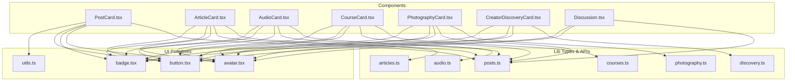
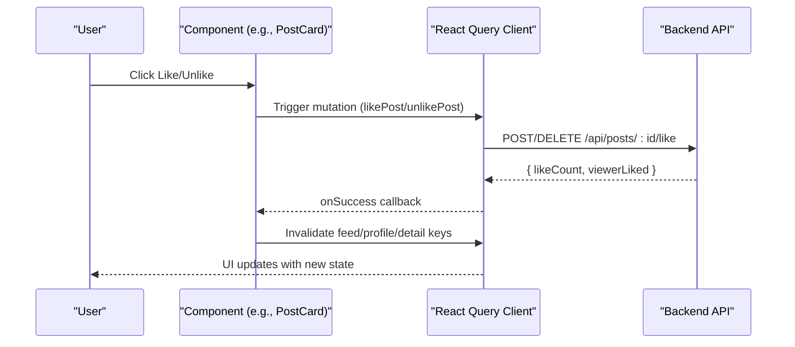
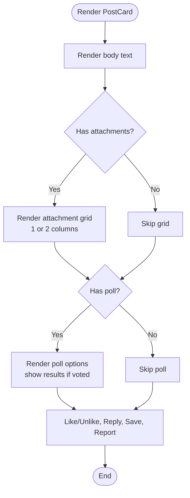
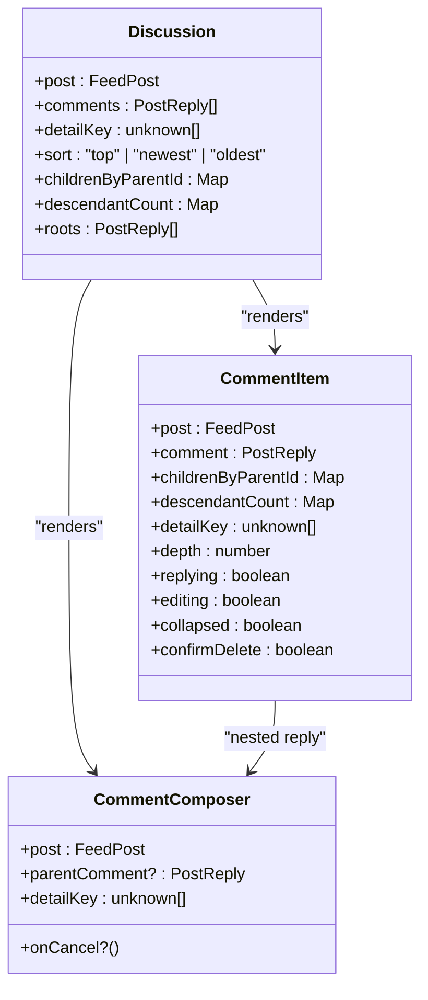
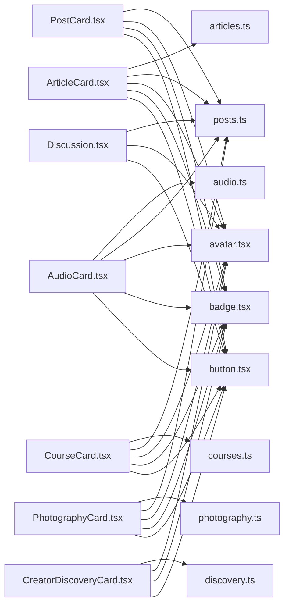

# Content Display Components

<cite>
**Referenced Files in This Document**
- [PostCard.tsx](file://src/react-app/components/PostCard.tsx)
- [ArticleCard.tsx](file://src/react-app/components/ArticleCard.tsx)
- [AudioCard.tsx](file://src/react-app/components/AudioCard.tsx)
- [CourseCard.tsx](file://src/react-app/components/CourseCard.tsx)
- [PhotographyCard.tsx](file://src/react-app/components/PhotographyCard.tsx)
- [CreatorDiscoveryCard.tsx](file://src/react-app/components/CreatorDiscoveryCard.tsx)
- [Discussion.tsx](file://src/react-app/components/Discussion.tsx)
- [posts.ts](file://src/react-app/lib/posts.ts)
- [articles.ts](file://src/react-app/lib/articles.ts)
- [audio.ts](file://src/react-app/lib/audio.ts)
- [courses.ts](file://src/react-app/lib/courses.ts)
- [photography.ts](file://src/react-app/lib/photography.ts)
- [discovery.ts](file://src/react-app/lib/discovery.ts)
- [avatar.tsx](file://src/react-app/components/ui/avatar.tsx)
- [badge.tsx](file://src/react-app/components/ui/badge.tsx)
- [button.tsx](file://src/react-app/components/ui/button.tsx)
- [utils.ts](file://src/react-app/lib/utils.ts)
</cite>

## Table of Contents
1. [Introduction](#introduction)
2. [Project Structure](#project-structure)
3. [Core Components](#core-components)
4. [Architecture Overview](#architecture-overview)
5. [Detailed Component Analysis](#detailed-component-analysis)
6. [Dependency Analysis](#dependency-analysis)
7. [Performance Considerations](#performance-considerations)
8. [Troubleshooting Guide](#troubleshooting-guide)
9. [Conclusion](#conclusion)
10. [Appendices](#appendices)

## Introduction
This document provides comprehensive documentation for content display components that render different types of media and data across the application. It covers PostCard for social posts, ArticleCard for long-form articles, AudioCard for audio items (music or podcast episodes), CourseCard for educational courses, PhotographyCard for image galleries, CreatorDiscoveryCard for creator profiles, and Discussion for threaded conversations. For each component, we detail expected data structures, rendering logic, interaction patterns, responsive design considerations, examples of data binding, loading states, error handling, and customization options.

## Project Structure
The content display components live under src/react-app/components and consume typed data from corresponding modules under src/react-app/lib. Shared UI primitives are provided by src/react-app/components/ui and utilities via src/react-app/lib/utils.

**Diagram sources**
- [PostCard.tsx:1-182](file://src/react-app/components/PostCard.tsx#L1-L182)
- [ArticleCard.tsx:1-131](file://src/react-app/components/ArticleCard.tsx#L1-L131)
- [AudioCard.tsx:1-167](file://src/react-app/components/AudioCard.tsx#L1-L167)
- [CourseCard.tsx:1-102](file://src/react-app/components/CourseCard.tsx#L1-L102)
- [PhotographyCard.tsx:1-163](file://src/react-app/components/PhotographyCard.tsx#L1-L163)
- [CreatorDiscoveryCard.tsx:1-59](file://src/react-app/components/CreatorDiscoveryCard.tsx#L1-L59)
- [Discussion.tsx:1-419](file://src/react-app/components/Discussion.tsx#L1-L419)
- [posts.ts:1-160](file://src/react-app/lib/posts.ts#L1-L160)
- [articles.ts:1-71](file://src/react-app/lib/articles.ts#L1-L71)
- [audio.ts:1-155](file://src/react-app/lib/audio.ts#L1-L155)
- [courses.ts:1-231](file://src/react-app/lib/courses.ts#L1-L231)
- [photography.ts:1-130](file://src/react-app/lib/photography.ts#L1-L130)
- [discovery.ts:1-99](file://src/react-app/lib/discovery.ts#L1-L99)
- [avatar.tsx:1-111](file://src/react-app/components/ui/avatar.tsx#L1-L111)
- [badge.tsx:1-50](file://src/react-app/components/ui/badge.tsx#L1-L50)
- [button.tsx:1-66](file://src/react-app/components/ui/button.tsx#L1-L66)
- [utils.ts:1-7](file://src/react-app/lib/utils.ts#L1-L7)

**Section sources**
- [PostCard.tsx:1-182](file://src/react-app/components/PostCard.tsx#L1-L182)
- [ArticleCard.tsx:1-131](file://src/react-app/components/ArticleCard.tsx#L1-L131)
- [AudioCard.tsx:1-167](file://src/react-app/components/AudioCard.tsx#L1-L167)
- [CourseCard.tsx:1-102](file://src/react-app/components/CourseCard.tsx#L1-L102)
- [PhotographyCard.tsx:1-163](file://src/react-app/components/PhotographyCard.tsx#L1-L163)
- [CreatorDiscoveryCard.tsx:1-59](file://src/react-app/components/CreatorDiscoveryCard.tsx#L1-L59)
- [Discussion.tsx:1-419](file://src/react-app/components/Discussion.tsx#L1-L419)
- [posts.ts:1-160](file://src/react-app/lib/posts.ts#L1-L160)
- [articles.ts:1-71](file://src/react-app/lib/articles.ts#L1-L71)
- [audio.ts:1-155](file://src/react-app/lib/audio.ts#L1-L155)
- [courses.ts:1-231](file://src/react-app/lib/courses.ts#L1-L231)
- [photography.ts:1-130](file://src/react-app/lib/photography.ts#L1-L130)
- [discovery.ts:1-99](file://src/react-app/lib/discovery.ts#L1-L99)
- [avatar.tsx:1-111](file://src/react-app/components/ui/avatar.tsx#L1-L111)
- [badge.tsx:1-50](file://src/react-app/components/ui/badge.tsx#L1-L50)
- [button.tsx:1-66](file://src/react-app/components/ui/button.tsx#L1-L66)
- [utils.ts:1-7](file://src/react-app/lib/utils.ts#L1-L7)

## Core Components
This section summarizes each component’s purpose, props, data model expectations, interactions, and responsive behavior.

- PostCard
  - Purpose: Renders a short-form social post with optional attachments and an interactive poll.
  - Props: post (FeedPost), showReplyAction (boolean).
  - Data Model: FeedPost includes author, body, attachments, likeCount, replyCount, viewerLiked/viewerSaved, and optional poll.
  - Interactions: Like/unlike, vote on poll options, save to library, report, navigate to post detail.
  - Responsive: Grid layout adapts for one or multiple attachments; text truncation and spacing adapt to screen size.
  - Loading/Error: Uses mutation hooks; errors shown via toast notifications.

- ArticleCard
  - Purpose: Renders a long-form article summary with cover image, title, excerpt, and metadata.
  - Props: article (ArticleSummary), showReplyAction (boolean).
  - Data Model: ArticleSummary includes author, slug, title, excerpt, coverUrl, timestamps, counts, and viewer flags.
  - Interactions: Like/unlike, navigate to article detail, save, report.
  - Responsive: Cover image uses aspect ratio; excerpt line-clamped for readability.

- AudioCard
  - Purpose: Renders an audio item (music or episode) with play controls and collection context.
  - Props: item (AudioItemSummary), queue (optional array of AudioItemSummary), showReplyAction (boolean).
  - Data Model: AudioItemSummary includes kind, streamUrl, coverUrl, durationSeconds, collection info, author, counts, viewer flags.
  - Interactions: Play via global audio player context, like/unlike, navigate to audio detail, save, report.
  - Responsive: Thumbnail and details stack vertically on small screens; hover overlay shows play button.

- CourseCard
  - Purpose: Renders a course summary with lesson count and access indicators.
  - Props: course (CourseSummary), showReplyAction (boolean).
  - Data Model: CourseSummary includes creator, modules (optional), hasAccess/isOwner flags, progress, counts, viewer flags.
  - Interactions: Like/unlike, navigate to course detail, save (conditional), report.
  - Responsive: Icon header and description line-clamped; lesson count computed from published lessons.

- PhotographyCard
  - Purpose: Renders a photography album with a mosaic preview of up to four photos.
  - Props: album (PhotographyAlbumSummary), showReplyAction (boolean).
  - Data Model: PhotographyAlbumSummary includes photos array, photoCount, author, counts, viewer flags.
  - Interactions: Like/unlike, navigate to album detail, save, report.
  - Responsive: Mosaic grid adapts columns based on number of photos; lazy-loaded images.

- CreatorDiscoveryCard
  - Purpose: Displays a creator profile card with categories, stats, and call-to-action.
  - Props: creator (CreatorDiscoveryCardData).
  - Data Model: CreatorDiscoveryCardData includes displayName, username, tagline, avatarUrl, categories, contentTypes, featured/subscribed flags, recommendationReason.
  - Interactions: Navigate to creator profile.
  - Responsive: Flex layout wraps badges and stats gracefully.

- Discussion
  - Purpose: Renders a threaded discussion with sorting, composing replies, editing/deleting comments, and nested replies.
  - Inputs: post (FeedPost), comments (PostReply[]), detailKey (query key for invalidation).
  - Interactions: Sort by top/newest/oldest, create/edit/delete replies, like/unlike replies, collapse/expand threads, upload images with replies.
  - Responsive: Indentation scales with depth; mobile-friendly form and actions.

**Section sources**
- [PostCard.tsx:13-182](file://src/react-app/components/PostCard.tsx#L13-L182)
- [ArticleCard.tsx:14-131](file://src/react-app/components/ArticleCard.tsx#L14-L131)
- [AudioCard.tsx:15-167](file://src/react-app/components/AudioCard.tsx#L15-L167)
- [CourseCard.tsx:14-102](file://src/react-app/components/CourseCard.tsx#L14-L102)
- [PhotographyCard.tsx:14-163](file://src/react-app/components/PhotographyCard.tsx#L14-L163)
- [CreatorDiscoveryCard.tsx:16-59](file://src/react-app/components/CreatorDiscoveryCard.tsx#L16-L59)
- [Discussion.tsx:23-419](file://src/react-app/components/Discussion.tsx#L23-L419)
- [posts.ts:30-86](file://src/react-app/lib/posts.ts#L30-L86)
- [articles.ts:5-38](file://src/react-app/lib/articles.ts#L5-L38)
- [audio.ts:32-68](file://src/react-app/lib/audio.ts#L32-L68)
- [courses.ts:47-70](file://src/react-app/lib/courses.ts#L47-L70)
- [photography.ts:35-57](file://src/react-app/lib/photography.ts#L35-L57)
- [discovery.ts:15-27](file://src/react-app/lib/discovery.ts#L15-L27)

## Architecture Overview
The components follow a consistent architecture:
- Data layer: Typed models and query/mutation helpers in lib modules.
- UI layer: Components use React Query for caching and mutations, and shared UI primitives for consistent styling.
- Interaction layer: Each component encapsulates its own mutation logic and invalidates relevant query keys to keep UI in sync.

**Diagram sources**
- [PostCard.tsx:28-38](file://src/react-app/components/PostCard.tsx#L28-L38)
- [posts.ts:133-139](file://src/react-app/lib/posts.ts#L133-L139)

**Section sources**
- [PostCard.tsx:1-182](file://src/react-app/components/PostCard.tsx#L1-L182)
- [posts.ts:1-160](file://src/react-app/lib/posts.ts#L1-L160)

## Detailed Component Analysis

### PostCard
- Data Binding
  - Binds to FeedPost fields: author, body, attachments, poll, likeCount, replyCount, viewerLiked/viewerSaved.
  - Formats date using createdAt timestamp.
- Rendering Logic
  - Displays author avatar and name, badge “Post”, body text, attachment grid, and poll if present.
  - Poll renders options with percentage bars when viewer voted.
- Interactions
  - Like/unlike toggles viewerLiked and updates counts.
  - Poll voting triggers votePoll mutation and refreshes related queries.
  - SaveButton integrates with saved state; ReportDialog allows reporting.
- Responsive Design
  - Attachment grid switches between single-column and two-column layouts.
  - Text truncation and spacing adapt to viewport width.
- Error Handling
  - Mutations catch errors and display toast messages.
- Customization Options
  - showReplyAction prop toggles reply navigation visibility.

**Diagram sources**
- [PostCard.tsx:55-144](file://src/react-app/components/PostCard.tsx#L55-L144)

**Section sources**
- [PostCard.tsx:13-182](file://src/react-app/components/PostCard.tsx#L13-L182)
- [posts.ts:30-86](file://src/react-app/lib/posts.ts#L30-L86)

### ArticleCard
- Data Binding
  - Binds to ArticleSummary fields: author, slug, title, excerpt, coverUrl, timestamps, counts, viewer flags.
- Rendering Logic
  - Shows author header, cover image (if available), “Article” badge, title, and excerpt.
- Interactions
  - Like/unlike via post mutation; navigate to article detail; save and report.
- Responsive Design
  - Cover image maintains aspect ratio; excerpt is line-clamped.
- Error Handling
  - Mutation errors displayed via toast.
- Customization Options
  - showReplyAction prop controls reply link visibility.

**Section sources**
- [ArticleCard.tsx:14-131](file://src/react-app/components/ArticleCard.tsx#L14-L131)
- [articles.ts:5-38](file://src/react-app/lib/articles.ts#L5-L38)

### AudioCard
- Data Binding
  - Binds to AudioItemSummary fields: kind, streamUrl, coverUrl, durationSeconds, collection, author, counts, viewer flags.
- Rendering Logic
  - Displays thumbnail with play overlay, kind badge (“Music” or “Episode”), duration, title, collection link, and description.
- Interactions
  - Play triggers global audio player context with optional queue; like/unlike; navigate to audio detail; save and report.
- Responsive Design
  - Thumbnail and details stack vertically on small screens; hover overlay reveals play control.
- Error Handling
  - Mutation errors handled via toast.
- Customization Options
  - showReplyAction prop toggles reply link visibility.

**Section sources**
- [AudioCard.tsx:15-167](file://src/react-app/components/AudioCard.tsx#L15-L167)
- [audio.ts:32-68](file://src/react-app/lib/audio.ts#L32-L68)

### CourseCard
- Data Binding
  - Binds to CourseSummary fields: creator, modules (optional), hasAccess/isOwner, progress, counts, viewer flags.
- Rendering Logic
  - Shows creator header, icon header, “Course” badge, lesson count (computed from published lessons), title, and description.
- Interactions
  - Like/unlike; navigate to course detail; save conditionally based on access; report.
- Responsive Design
  - Description line-clamped; lesson count computed dynamically.
- Error Handling
  - Mutation errors handled via toast.
- Customization Options
  - showReplyAction prop toggles reply link visibility.

**Section sources**
- [CourseCard.tsx:14-102](file://src/react-app/components/CourseCard.tsx#L14-L102)
- [courses.ts:47-70](file://src/react-app/lib/courses.ts#L47-L70)

### PhotographyCard
- Data Binding
  - Binds to PhotographyAlbumSummary fields: photos array, photoCount, author, counts, viewer flags.
- Rendering Logic
  - Renders PhotoMosaic showing up to four photos with responsive grid; displays “Photography” badge, photo count, title, and description.
- Interactions
  - Like/unlike; navigate to album detail; save and report.
- Responsive Design
  - Mosaic grid adapts columns; first image spans two rows when more than two photos.
- Error Handling
  - Mutation errors handled via toast.
- Customization Options
  - showReplyAction prop toggles reply link visibility.

**Section sources**
- [PhotographyCard.tsx:14-163](file://src/react-app/components/PhotographyCard.tsx#L14-L163)
- [photography.ts:35-57](file://src/react-app/lib/photography.ts#L35-L57)

### CreatorDiscoveryCard
- Data Binding
  - Binds to CreatorDiscoveryCardData fields: displayName, username, tagline, avatarUrl, categories, contentTypes, featured/subscribed flags, recommendationReason.
- Rendering Logic
  - Displays avatar, name, badges (Featured/Subscribed), tagline, category badges, stats, and optional recommendation reason.
- Interactions
  - Navigates to creator profile page.
- Responsive Design
  - Flex layout wraps badges and stats; truncated text for long names/taglines.
- Error Handling
  - No mutations; purely presentational.
- Customization Options
  - None beyond input data.

**Section sources**
- [CreatorDiscoveryCard.tsx:16-59](file://src/react-app/components/CreatorDiscoveryCard.tsx#L16-L59)
- [discovery.ts:15-27](file://src/react-app/lib/discovery.ts#L15-L27)

### Discussion
- Data Binding
  - Binds to FeedPost and PostReply[]; computes children map and descendant counts for thread structure.
- Rendering Logic
  - Sorts root comments by top/newest/oldest; renders comment composer and nested replies; handles deleted comments gracefully.
- Interactions
  - Create/edit/delete replies; like/unlike replies; collapse/expand threads; attach images to replies; mention users.
- Responsive Design
  - Indentation increases with depth; form and actions adapt to mobile widths.
- Error Handling
  - All mutations catch errors and display toast notifications.
- Customization Options
  - detailKey passed for cache invalidation; sort state managed locally.

**Diagram sources**
- [Discussion.tsx:23-123](file://src/react-app/components/Discussion.tsx#L23-L123)
- [Discussion.tsx:125-242](file://src/react-app/components/Discussion.tsx#L125-L242)
- [Discussion.tsx:244-413](file://src/react-app/components/Discussion.tsx#L244-L413)

**Section sources**
- [Discussion.tsx:1-419](file://src/react-app/components/Discussion.tsx#L1-L419)
- [posts.ts:51-86](file://src/react-app/lib/posts.ts#L51-L86)

## Dependency Analysis
Components depend on:
- lib modules for typed data and API functions.
- UI primitives for consistent visual elements.
- React Query for caching and mutations.
- Router for navigation.

**Diagram sources**
- [PostCard.tsx:1-182](file://src/react-app/components/PostCard.tsx#L1-L182)
- [ArticleCard.tsx:1-131](file://src/react-app/components/ArticleCard.tsx#L1-L131)
- [AudioCard.tsx:1-167](file://src/react-app/components/AudioCard.tsx#L1-L167)
- [CourseCard.tsx:1-102](file://src/react-app/components/CourseCard.tsx#L1-L102)
- [PhotographyCard.tsx:1-163](file://src/react-app/components/PhotographyCard.tsx#L1-L163)
- [CreatorDiscoveryCard.tsx:1-59](file://src/react-app/components/CreatorDiscoveryCard.tsx#L1-L59)
- [Discussion.tsx:1-419](file://src/react-app/components/Discussion.tsx#L1-L419)
- [posts.ts:1-160](file://src/react-app/lib/posts.ts#L1-L160)
- [articles.ts:1-71](file://src/react-app/lib/articles.ts#L1-L71)
- [audio.ts:1-155](file://src/react-app/lib/audio.ts#L1-L155)
- [courses.ts:1-231](file://src/react-app/lib/courses.ts#L1-L231)
- [photography.ts:1-130](file://src/react-app/lib/photography.ts#L1-L130)
- [discovery.ts:1-99](file://src/react-app/lib/discovery.ts#L1-L99)
- [avatar.tsx:1-111](file://src/react-app/components/ui/avatar.tsx#L1-L111)
- [badge.tsx:1-50](file://src/react-app/components/ui/badge.tsx#L1-L50)
- [button.tsx:1-66](file://src/react-app/components/ui/button.tsx#L1-L66)

**Section sources**
- [PostCard.tsx:1-182](file://src/react-app/components/PostCard.tsx#L1-L182)
- [ArticleCard.tsx:1-131](file://src/react-app/components/ArticleCard.tsx#L1-L131)
- [AudioCard.tsx:1-167](file://src/react-app/components/AudioCard.tsx#L1-L167)
- [CourseCard.tsx:1-102](file://src/react-app/components/CourseCard.tsx#L1-L102)
- [PhotographyCard.tsx:1-163](file://src/react-app/components/PhotographyCard.tsx#L1-L163)
- [CreatorDiscoveryCard.tsx:1-59](file://src/react-app/components/CreatorDiscoveryCard.tsx#L1-L59)
- [Discussion.tsx:1-419](file://src/react-app/components/Discussion.tsx#L1-L419)
- [posts.ts:1-160](file://src/react-app/lib/posts.ts#L1-L160)
- [articles.ts:1-71](file://src/react-app/lib/articles.ts#L1-L71)
- [audio.ts:1-155](file://src/react-app/lib/audio.ts#L1-L155)
- [courses.ts:1-231](file://src/react-app/lib/courses.ts#L1-L231)
- [photography.ts:1-130](file://src/react-app/lib/photography.ts#L1-L130)
- [discovery.ts:1-99](file://src/react-app/lib/discovery.ts#L1-L99)
- [avatar.tsx:1-111](file://src/react-app/components/ui/avatar.tsx#L1-L111)
- [badge.tsx:1-50](file://src/react-app/components/ui/badge.tsx#L1-L50)
- [button.tsx:1-66](file://src/react-app/components/ui/button.tsx#L1-L66)

## Performance Considerations
- Use lazy loading for images to reduce initial payload.
- Avoid unnecessary re-renders by memoizing derived data where appropriate (e.g., children maps and descendant counts in Discussion).
- Invalidate only necessary query keys after mutations to minimize refetch overhead.
- Prefer streaming or progressive loading for large media assets (audio/images).
- Keep mutation handlers lightweight; offload heavy computations to background tasks if needed.

[No sources needed since this section provides general guidance]

## Troubleshooting Guide
Common issues and resolutions:
- Like/unlike not updating: Ensure correct query keys are invalidated after mutation success.
- Poll voting fails: Verify poll exists and optionId is valid; check network responses and toast messages.
- Images not loading: Confirm URLs are accessible and CORS settings are correct; verify lazy loading attributes.
- Discussion thread not refreshing: Pass correct detailKey to Discussion and ensure invalidation occurs after create/edit/delete operations.
- Access restrictions: For CourseCard, check hasAccess/isOwner flags to enable/disable saving and other actions.

**Section sources**
- [PostCard.tsx:28-53](file://src/react-app/components/PostCard.tsx#L28-L53)
- [Discussion.tsx:142-165](file://src/react-app/components/Discussion.tsx#L142-L165)
- [CourseCard.tsx:89-95](file://src/react-app/components/CourseCard.tsx#L89-L95)

## Conclusion
The content display components provide a consistent, type-safe, and interactive experience across various media types. They leverage React Query for efficient data synchronization, shared UI primitives for visual consistency, and robust error handling for user feedback. By adhering to the documented data structures and interaction patterns, developers can extend or customize these components effectively while maintaining performance and responsiveness.

[No sources needed since this section summarizes without analyzing specific files]

## Appendices

### Data Models Reference
- FeedPost: Represents a social post with author, body, attachments, poll, and viewer flags.
- ArticleSummary: Represents a long-form article with metadata and viewer flags.
- AudioItemSummary: Represents an audio item with collection context and playback metadata.
- CourseSummary: Represents a course with modules, access flags, and progress.
- PhotographyAlbumSummary: Represents a photography album with photos and metadata.
- CreatorDiscoveryCardData: Represents a creator profile for discovery surfaces.

**Section sources**
- [posts.ts:30-86](file://src/react-app/lib/posts.ts#L30-L86)
- [articles.ts:5-38](file://src/react-app/lib/articles.ts#L5-L38)
- [audio.ts:32-68](file://src/react-app/lib/audio.ts#L32-L68)
- [courses.ts:47-70](file://src/react-app/lib/courses.ts#L47-L70)
- [photography.ts:35-57](file://src/react-app/lib/photography.ts#L35-L57)
- [discovery.ts:15-27](file://src/react-app/lib/discovery.ts#L15-L27)