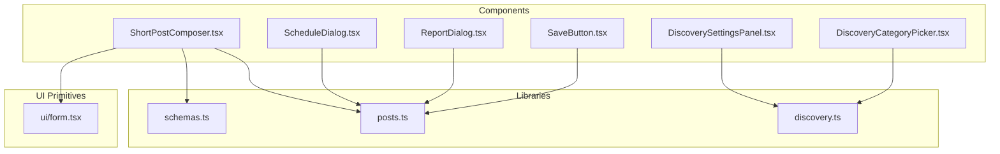
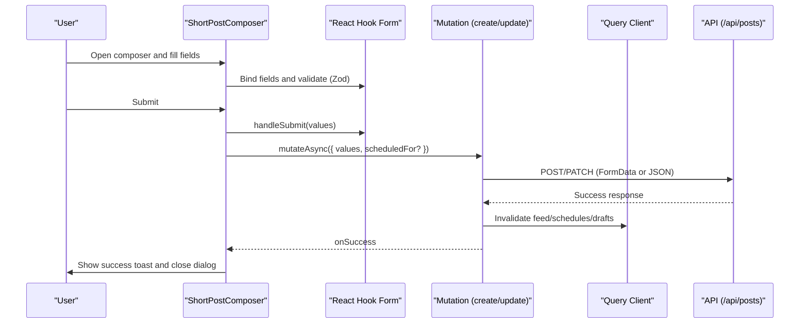
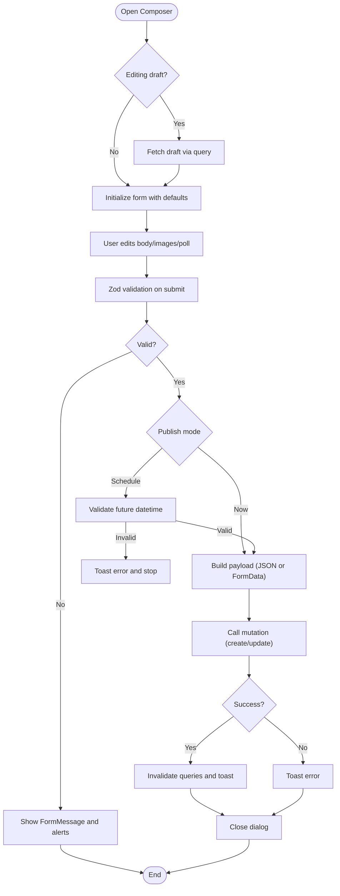
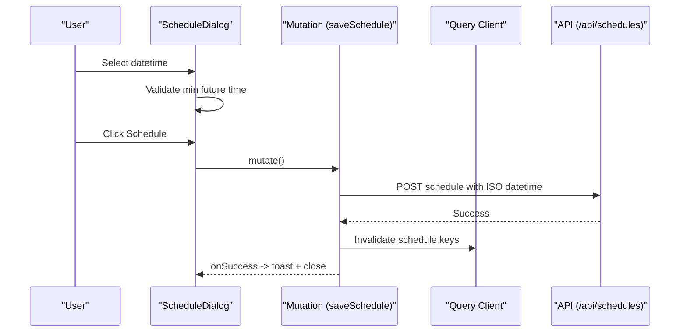
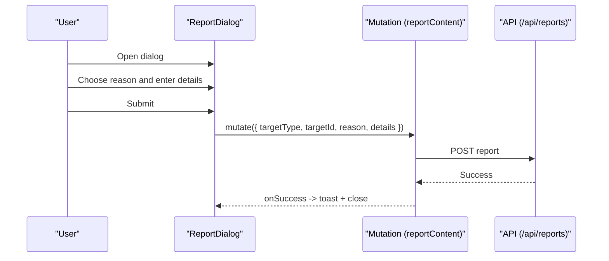
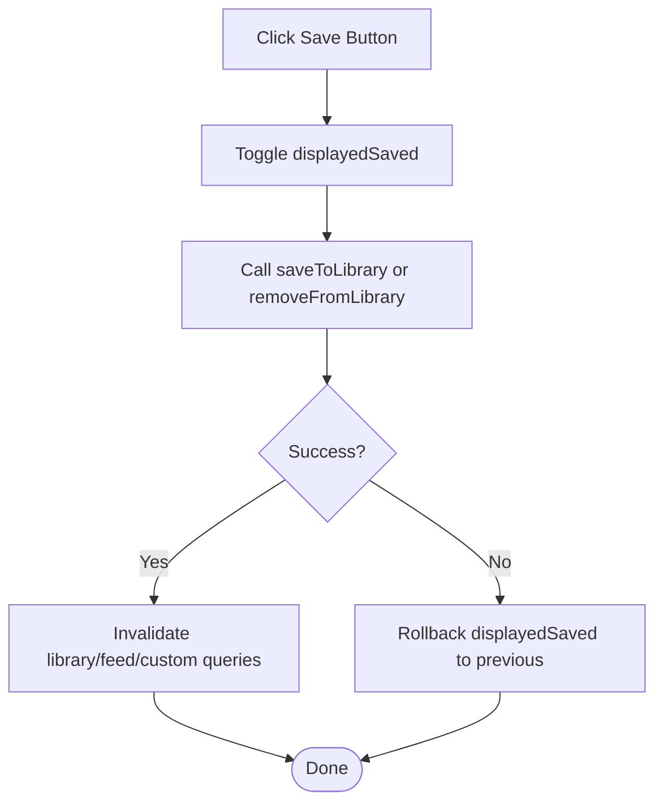
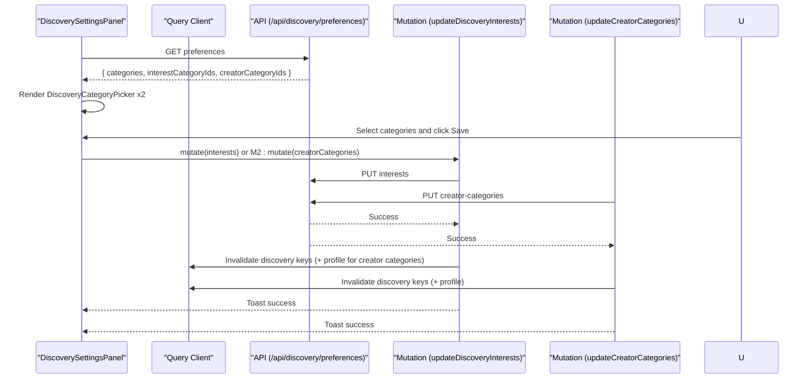
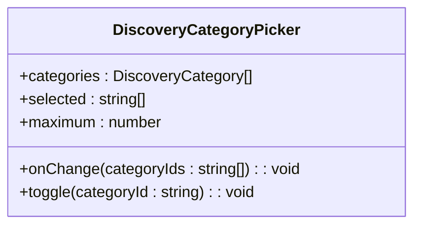
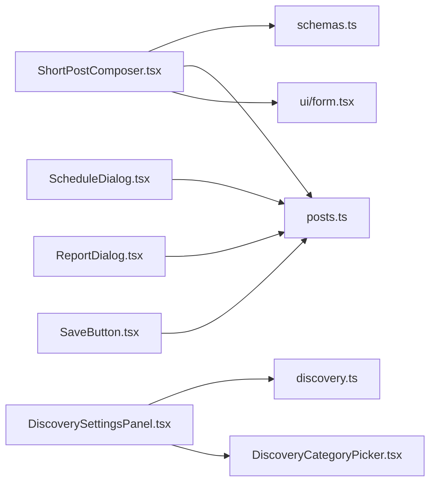

# Form and Input Components

<cite>
**Referenced Files in This Document**
- [ShortPostComposer.tsx](file://src/react-app/components/ShortPostComposer.tsx)
- [ScheduleDialog.tsx](file://src/react-app/components/ScheduleDialog.tsx)
- [ReportDialog.tsx](file://src/react-app/components/ReportDialog.tsx)
- [SaveButton.tsx](file://src/react-app/components/SaveButton.tsx)
- [DiscoverySettingsPanel.tsx](file://src/react-app/components/DiscoverySettingsPanel.tsx)
- [DiscoveryCategoryPicker.tsx](file://src/react-app/components/DiscoveryCategoryPicker.tsx)
- [schemas.ts](file://src/react-app/lib/schemas.ts)
- [form.tsx](file://src/react-app/components/ui/form.tsx)
- [posts.ts](file://src/react-app/lib/posts.ts)
- [discovery.ts](file://src/react-app/lib/discovery.ts)
</cite>

## Table of Contents
1. [Introduction](#introduction)
2. [Project Structure](#project-structure)
3. [Core Components](#core-components)
4. [Architecture Overview](#architecture-overview)
5. [Detailed Component Analysis](#detailed-component-analysis)
6. [Dependency Analysis](#dependency-analysis)
7. [Performance Considerations](#performance-considerations)
8. [Troubleshooting Guide](#troubleshooting-guide)
9. [Conclusion](#conclusion)

## Introduction
This document provides comprehensive documentation for the form and input components that power user interactions and data entry across the application. It focuses on:
- ShortPostComposer: quick post creation with rich content, images, polls, and scheduling
- ScheduleDialog: scheduling publication time for existing posts
- ReportDialog: reporting content with reason and optional details
- SaveButton: optimistic save-to-library toggle with rollback
- DiscoverySettingsPanel and DiscoveryCategoryPicker: discovery preferences and category selection

The guide explains validation patterns using Zod and React Hook Form, state management strategies, accessibility compliance, error handling, and integration points with TanStack Query and toast notifications.

## Project Structure
The relevant UI components live under src/react-app/components, with shared schemas under src/react-app/lib and reusable form primitives under src/react-app/components/ui. Data access is centralized via lib modules (posts.ts, discovery.ts).

**Diagram sources**
- [ShortPostComposer.tsx](file://src/react-app/components/ShortPostComposer.tsx)
- [ScheduleDialog.tsx](file://src/react-app/components/ScheduleDialog.tsx)
- [ReportDialog.tsx](file://src/react-app/components/ReportDialog.tsx)
- [SaveButton.tsx](file://src/react-app/components/SaveButton.tsx)
- [DiscoverySettingsPanel.tsx](file://src/react-app/components/DiscoverySettingsPanel.tsx)
- [DiscoveryCategoryPicker.tsx](file://src/react-app/components/DiscoveryCategoryPicker.tsx)
- [form.tsx](file://src/react-app/components/ui/form.tsx)
- [schemas.ts](file://src/react-app/lib/schemas.ts)
- [posts.ts](file://src/react-app/lib/posts.ts)
- [discovery.ts](file://src/react-app/lib/discovery.ts)

**Section sources**
- [ShortPostComposer.tsx](file://src/react-app/components/ShortPostComposer.tsx)
- [ScheduleDialog.tsx](file://src/react-app/components/ScheduleDialog.tsx)
- [ReportDialog.tsx](file://src/react-app/components/ReportDialog.tsx)
- [SaveButton.tsx](file://src/react-app/components/SaveButton.tsx)
- [DiscoverySettingsPanel.tsx](file://src/react-app/components/DiscoverySettingsPanel.tsx)
- [DiscoveryCategoryPicker.tsx](file://src/react-app/components/DiscoveryCategoryPicker.tsx)
- [form.tsx](file://src/react-app/components/ui/form.tsx)
- [schemas.ts](file://src/react-app/lib/schemas.ts)
- [posts.ts](file://src/react-app/lib/posts.ts)
- [discovery.ts](file://src/react-app/lib/discovery.ts)

## Core Components
- ShortPostComposer: A dialog-based composer for creating or editing short posts with text, image attachments, and polls. Supports immediate publish or scheduling. Uses React Hook Form with Zod resolver for validation, TanStack Query mutations for persistence, and toast feedback.
- ScheduleDialog: A focused dialog to set or update a publication datetime for an existing post. Validates minimum future time and converts local datetime to UTC ISO string before saving.
- ReportDialog: A modal to report content by selecting a reason and optionally adding details. Submits via mutation and shows success/error toasts.
- SaveButton: An icon button toggling “save to library” with optimistic UI updates and rollback on failure. Invalidates related queries on success.
- DiscoverySettingsPanel: Loads user’s discovery preferences and allows updating interests and creator categories independently. Integrates with DiscoveryCategoryPicker.
- DiscoveryCategoryPicker: Accessible multi-select component enforcing maximum selections and providing aria-pressed states.

Key patterns:
- Validation: Zod schemas define field-level and cross-field rules; React Hook Form enforces them at submit time.
- State: Local state for transient UI (e.g., scheduledLocal), controlled inputs where appropriate, and query cache for server state.
- Feedback: Toast messages for success and errors; inline FormMessage for validation errors.
- Accessibility: Labels, aria attributes, keyboard support via shadcn dialogs, and semantic roles.

**Section sources**
- [ShortPostComposer.tsx](file://src/react-app/components/ShortPostComposer.tsx)
- [ScheduleDialog.tsx](file://src/react-app/components/ScheduleDialog.tsx)
- [ReportDialog.tsx](file://src/react-app/components/ReportDialog.tsx)
- [SaveButton.tsx](file://src/react-app/components/SaveButton.tsx)
- [DiscoverySettingsPanel.tsx](file://src/react-app/components/DiscoverySettingsPanel.tsx)
- [DiscoveryCategoryPicker.tsx](file://src/react-app/components/DiscoveryCategoryPicker.tsx)
- [schemas.ts](file://src/react-app/lib/schemas.ts)
- [form.tsx](file://src/react-app/components/ui/form.tsx)

## Architecture Overview
The components follow a consistent architecture:
- UI layer: Dialogs and forms built with shadcn primitives and React Hook Form.
- Validation layer: Zod schemas ensure type safety and constraints.
- Mutation layer: TanStack Query mutations handle async operations and cache invalidation.
- Feedback layer: Sonner toasts provide user feedback.

**Diagram sources**
- [ShortPostComposer.tsx](file://src/react-app/components/ShortPostComposer.tsx)
- [posts.ts](file://src/react-app/lib/posts.ts)
- [schemas.ts](file://src/react-app/lib/schemas.ts)
- [form.tsx](file://src/react-app/components/ui/form.tsx)

## Detailed Component Analysis

### ShortPostComposer
Responsibilities:
- Manage form state for body, images, and poll configuration.
- Validate input using richPostSchema.
- Support publishing now or scheduling for later.
- Handle draft loading and editing flow.
- Provide image previews and attachment removal.
- Communicate with API via createPost/updateDraftPost.

Validation and UX:
- Body length limit enforced by schema and maxLength attribute.
- Poll requires question and 2–4 options when enabled.
- Publish disabled until there is valid content.
- Inline character count and accessible labels.

Data flow:
- On submit, build FormData if needed, include scheduledFor when applicable, and call mutation.
- On success, invalidate feed, schedules, and draft queries; show toast and close.

Accessibility:
- Dialog with descriptive title and description.
- Labels and aria-describedby for inputs.
- Keyboard-friendly controls and focus management.

**Diagram sources**
- [ShortPostComposer.tsx](file://src/react-app/components/ShortPostComposer.tsx)
- [schemas.ts](file://src/react-app/lib/schemas.ts)
- [posts.ts](file://src/react-app/lib/posts.ts)

**Section sources**
- [ShortPostComposer.tsx](file://src/react-app/components/ShortPostComposer.tsx)
- [schemas.ts](file://src/react-app/lib/schemas.ts)
- [posts.ts](file://src/react-app/lib/posts.ts)

### ScheduleDialog
Responsibilities:
- Present a datetime-local input constrained to a minimum future time.
- Convert local datetime to UTC ISO string.
- Save schedule via mutation and invalidate schedule queries.

Validation and UX:
- Enforces minimum future time.
- Shows timezone info.
- Provides clear success/error toasts.

**Diagram sources**
- [ScheduleDialog.tsx](file://src/react-app/components/ScheduleDialog.tsx)

**Section sources**
- [ScheduleDialog.tsx](file://src/react-app/components/ScheduleDialog.tsx)

### ReportDialog
Responsibilities:
- Allow users to select a reason and add optional details.
- Submit report via mutation and provide feedback.

Validation and UX:
- Reason is required (select control).
- Details are optional with max length.
- Toasts for success and error.

**Diagram sources**
- [ReportDialog.tsx](file://src/react-app/components/ReportDialog.tsx)

**Section sources**
- [ReportDialog.tsx](file://src/react-app/components/ReportDialog.tsx)

### SaveButton
Responsibilities:
- Toggle saving/un-saving a post to/from the library.
- Optimistically update UI and roll back on failure.
- Invalidate relevant queries on success.

State management:
- Local displayedSaved state for immediate feedback.
- Mutation handles actual save/remove calls.

**Diagram sources**
- [SaveButton.tsx](file://src/react-app/components/SaveButton.tsx)
- [posts.ts](file://src/react-app/lib/posts.ts)

**Section sources**
- [SaveButton.tsx](file://src/react-app/components/SaveButton.tsx)
- [posts.ts](file://src/react-app/lib/posts.ts)

### DiscoverySettingsPanel
Responsibilities:
- Fetch and display discovery preferences.
- Allow independent updates of interests and creator categories.
- Provide feedback via toasts and invalidate queries.

Integration:
- Uses DiscoveryCategoryPicker for selection.
- Leverages discovery.ts endpoints.

**Diagram sources**
- [DiscoverySettingsPanel.tsx](file://src/react-app/components/DiscoverySettingsPanel.tsx)
- [discovery.ts](file://src/react-app/lib/discovery.ts)

**Section sources**
- [DiscoverySettingsPanel.tsx](file://src/react-app/components/DiscoverySettingsPanel.tsx)
- [discovery.ts](file://src/react-app/lib/discovery.ts)

### DiscoveryCategoryPicker
Responsibilities:
- Render selectable categories with a maximum selection limit.
- Maintain selected IDs and notify parent via onChange.
- Ensure accessibility with aria-pressed and keyboard interaction.

Validation:
- Enforces maximum selections client-side.

**Diagram sources**
- [DiscoveryCategoryPicker.tsx](file://src/react-app/components/DiscoveryCategoryPicker.tsx)
- [discovery.ts](file://src/react-app/lib/discovery.ts)

**Section sources**
- [DiscoveryCategoryPicker.tsx](file://src/react-app/components/DiscoveryCategoryPicker.tsx)
- [discovery.ts](file://src/react-app/lib/discovery.ts)

## Dependency Analysis
- ShortPostComposer depends on:
  - React Hook Form and Zod resolver for form state and validation
  - Zod schemas for rich post validation
  - Posts library for create/update and draft queries
  - UI form primitives for accessible form structure
- ScheduleDialog depends on:
  - Schedules library for saveSchedule
  - TanStack Query for cache invalidation
- ReportDialog depends on:
  - Admin library for reportContent
- SaveButton depends on:
  - Library and posts libraries for save/remove and feed invalidation
- DiscoverySettingsPanel depends on:
  - Discovery library for preferences and updates
  - DiscoveryCategoryPicker for selection UI

**Diagram sources**
- [ShortPostComposer.tsx](file://src/react-app/components/ShortPostComposer.tsx)
- [ScheduleDialog.tsx](file://src/react-app/components/ScheduleDialog.tsx)
- [ReportDialog.tsx](file://src/react-app/components/ReportDialog.tsx)
- [SaveButton.tsx](file://src/react-app/components/SaveButton.tsx)
- [DiscoverySettingsPanel.tsx](file://src/react-app/components/DiscoverySettingsPanel.tsx)
- [DiscoveryCategoryPicker.tsx](file://src/react-app/components/DiscoveryCategoryPicker.tsx)
- [schemas.ts](file://src/react-app/lib/schemas.ts)
- [posts.ts](file://src/react-app/lib/posts.ts)
- [discovery.ts](file://src/react-app/lib/discovery.ts)
- [form.tsx](file://src/react-app/components/ui/form.tsx)

**Section sources**
- [ShortPostComposer.tsx](file://src/react-app/components/ShortPostComposer.tsx)
- [ScheduleDialog.tsx](file://src/react-app/components/ScheduleDialog.tsx)
- [ReportDialog.tsx](file://src/react-app/components/ReportDialog.tsx)
- [SaveButton.tsx](file://src/react-app/components/SaveButton.tsx)
- [DiscoverySettingsPanel.tsx](file://src/react-app/components/DiscoverySettingsPanel.tsx)
- [DiscoveryCategoryPicker.tsx](file://src/react-app/components/DiscoveryCategoryPicker.tsx)
- [schemas.ts](file://src/react-app/lib/schemas.ts)
- [posts.ts](file://src/react-app/lib/posts.ts)
- [discovery.ts](file://src/react-app/lib/discovery.ts)
- [form.tsx](file://src/react-app/components/ui/form.tsx)

## Performance Considerations
- Avoid unnecessary re-renders by memoizing derived data (e.g., image previews).
- Use controlled inputs only where necessary; leverage React Hook Form’s uncontrolled optimization for large forms.
- Debounce heavy operations if needed (not currently used here).
- Keep mutation payloads minimal; use FormData efficiently for file uploads.
- Invalidate only necessary queries to reduce network churn.

[No sources needed since this section provides general guidance]

## Troubleshooting Guide
Common issues and resolutions:
- Validation errors not showing: Ensure FormField wraps fields and FormMessage is present; verify zodResolver is correctly configured.
- Scheduling fails due to time zone: Confirm local datetime conversion to UTC ISO string; check minimum future time constraint.
- Image upload errors: Validate file types and sizes in schema; ensure accept attributes match allowed types.
- Poll submission issues: Ensure pollOptions array has 2–4 non-empty options when pollEnabled is true.
- SaveButton state rollback: Verify onError handler resets displayedSaved to previous value.
- Discovery settings not updating: Check that mutations invalidate correct query keys and toast messages reflect outcomes.

**Section sources**
- [ShortPostComposer.tsx](file://src/react-app/components/ShortPostComposer.tsx)
- [ScheduleDialog.tsx](file://src/react-app/components/ScheduleDialog.tsx)
- [ReportDialog.tsx](file://src/react-app/components/ReportDialog.tsx)
- [SaveButton.tsx](file://src/react-app/components/SaveButton.tsx)
- [DiscoverySettingsPanel.tsx](file://src/react-app/components/DiscoverySettingsPanel.tsx)
- [schemas.ts](file://src/react-app/lib/schemas.ts)

## Conclusion
These components implement robust, accessible, and user-friendly forms and inputs. They combine Zod-driven validation with React Hook Form for reliable data handling, TanStack Query for efficient state synchronization, and clear user feedback through toasts and inline messages. The modular design promotes reuse and maintainability while ensuring strong accessibility standards.

[No sources needed since this section summarizes without analyzing specific files]