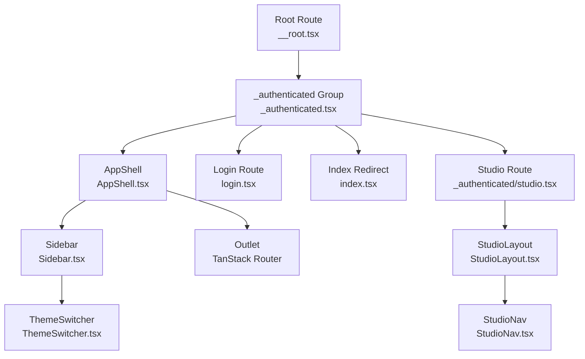
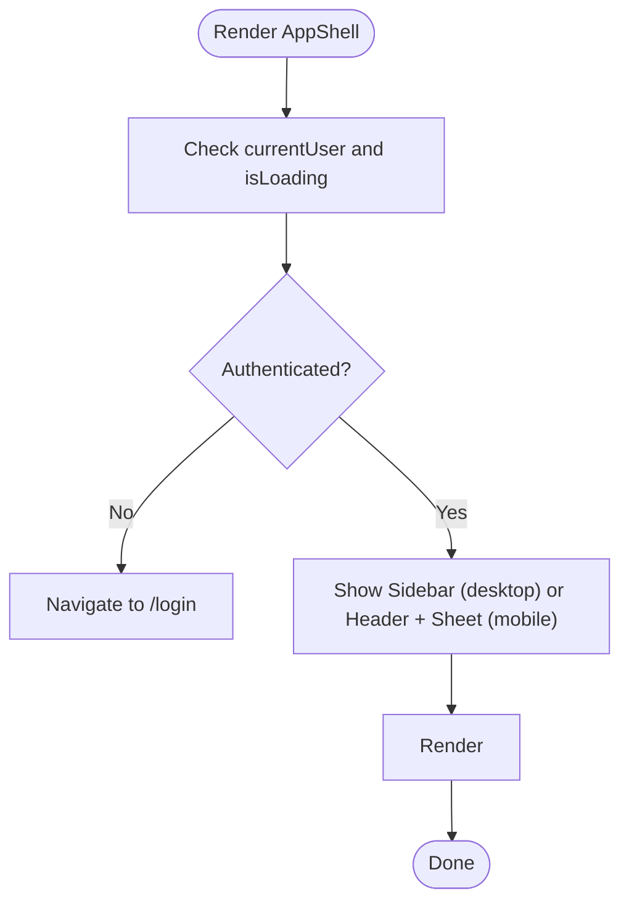
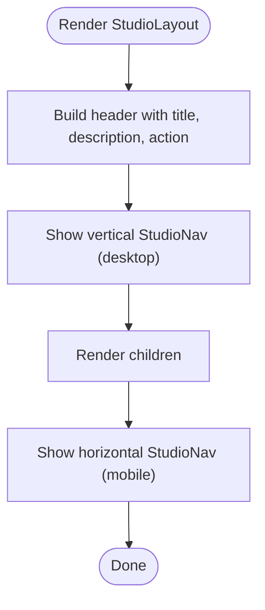
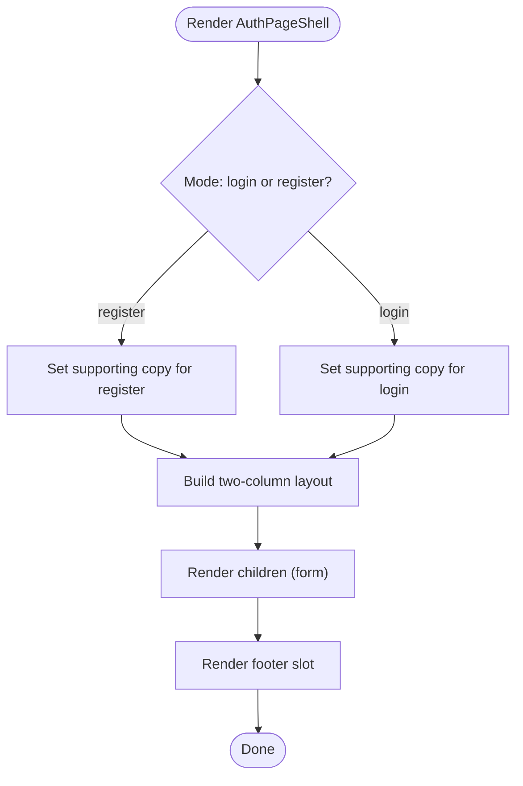
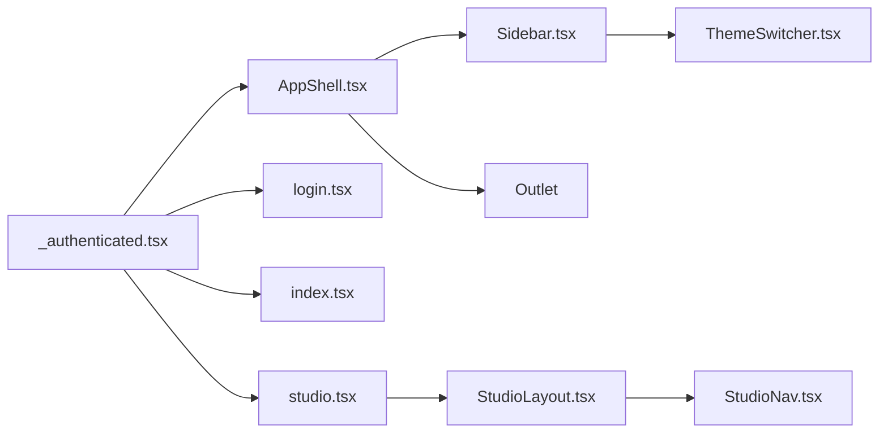

# Layout Components

<cite>
**Referenced Files in This Document**
- [AppShell.tsx](file://src/react-app/components/AppShell.tsx)
- [Sidebar.tsx](file://src/react-app/components/Sidebar.tsx)
- [StudioLayout.tsx](file://src/react-app/components/StudioLayout.tsx)
- [AuthPageShell.tsx](file://src/react-app/components/AuthPageShell.tsx)
- [ThemeSwitcher.tsx](file://src/react-app/components/ThemeSwitcher.tsx)
- [StudioNav.tsx](file://src/react-app/components/StudioNav.tsx)
- [_authenticated.tsx](file://src/react-app/routes/_authenticated.tsx)
- [index.tsx](file://src/react-app/routes/index.tsx)
- [login.tsx](file://src/react-app/routes/login.tsx)
- [studio.tsx](file://src/react-app/routes/_authenticated/studio.tsx)
- [AuthContext.tsx](file://src/react-app/context/AuthContext.tsx)
</cite>

## Table of Contents
1. [Introduction](#introduction)
2. [Project Structure](#project-structure)
3. [Core Components](#core-components)
4. [Architecture Overview](#architecture-overview)
5. [Detailed Component Analysis](#detailed-component-analysis)
6. [Dependency Analysis](#dependency-analysis)
7. [Performance Considerations](#performance-considerations)
8. [Troubleshooting Guide](#troubleshooting-guide)
9. [Conclusion](#conclusion)
10. [Appendices](#appendices)

## Introduction
This document explains the layout and shell components that define the application structure and navigation framework. It covers AppShell for the main authenticated layout, Sidebar for role-aware navigation, StudioLayout for the creator studio interface, AuthPageShell for authentication pages, and ThemeSwitcher for theme management. You will learn how layouts compose with TanStack Router, how responsive behavior is implemented, how navigation state is managed, and how to extend or customize these shells for different roles and contexts.

## Project Structure
The layout system is composed of reusable shell components and route-level wrappers:
- Route-level wrapper for authenticated routes renders AppShell and enforces authentication via beforeLoad.
- AppShell provides the global app chrome (sidebar, header, and Outlet).
- Sidebar renders role-based navigation and integrates with AuthContext and notifications.
- StudioLayout wraps studio pages with a consistent header and dual orientation navigation via StudioNav.
- AuthPageShell provides a branded login/register experience with feature highlights and footer support.
- ThemeSwitcher offers light/dark/system theme toggling using next-themes.



**Diagram sources**
- [_authenticated.tsx:1-20](file://src/react-app/routes/_authenticated.tsx#L1-L20)
- [AppShell.tsx:1-63](file://src/react-app/components/AppShell.tsx#L1-L63)
- [Sidebar.tsx:1-160](file://src/react-app/components/Sidebar.tsx#L1-L160)
- [StudioLayout.tsx:1-44](file://src/react-app/components/StudioLayout.tsx#L1-L44)
- [StudioNav.tsx:1-83](file://src/react-app/components/StudioNav.tsx#L1-L83)
- [AuthPageShell.tsx:1-242](file://src/react-app/components/AuthPageShell.tsx#L1-L242)
- [ThemeSwitcher.tsx:1-37](file://src/react-app/components/ThemeSwitcher.tsx#L1-L37)
- [index.tsx:1-14](file://src/react-app/routes/index.tsx#L1-L14)
- [login.tsx:1-17](file://src/react-app/routes/login.tsx#L1-L17)
- [studio.tsx:1-12](file://src/react-app/routes/_authenticated/studio.tsx#L1-L12)

**Section sources**
- [_authenticated.tsx:1-20](file://src/react-app/routes/_authenticated.tsx#L1-L20)
- [AppShell.tsx:1-63](file://src/react-app/components/AppShell.tsx#L1-L63)
- [Sidebar.tsx:1-160](file://src/react-app/components/Sidebar.tsx#L1-L160)
- [StudioLayout.tsx:1-44](file://src/react-app/components/StudioLayout.tsx#L1-L44)
- [AuthPageShell.tsx:1-242](file://src/react-app/components/AuthPageShell.tsx#L1-L242)
- [ThemeSwitcher.tsx:1-37](file://src/react-app/components/ThemeSwitcher.tsx#L1-L37)
- [StudioNav.tsx:1-83](file://src/react-app/components/StudioNav.tsx#L1-L83)
- [index.tsx:1-14](file://src/react-app/routes/index.tsx#L1-L14)
- [login.tsx:1-17](file://src/react-app/routes/login.tsx#L1-L17)
- [studio.tsx:1-12](file://src/react-app/routes/_authenticated/studio.tsx#L1-L12)

## Core Components
- AppShell: Provides the authenticated application shell with a persistent sidebar on desktop and a mobile sheet-triggered sidebar. It guards unauthenticated access by redirecting to login when no user is present.
- Sidebar: Role-aware navigation menu with dynamic items based on user role, unread notification badge, profile link, settings, and logout. Integrates with TanStack Router Link and router state for active highlighting.
- StudioLayout: A structured layout for studio pages with a title, description, optional action area, and a dual-orientation navigation (vertical on desktop, horizontal on mobile) powered by StudioNav.
- AuthPageShell: A branded shell for login and register pages featuring marketing copy, feature highlights, and a customizable footer.
- ThemeSwitcher: A small control to switch between light, dark, and system themes using next-themes.

Key responsibilities:
- Layout composition: AppShell composes Sidebar and Outlet; StudioLayout composes StudioNav and page content.
- Responsive behavior: AppShell hides Sidebar on small screens and shows a Sheet-triggered version; StudioLayout switches StudioNav orientation.
- Navigation state: Active states derived from router pathname; badges updated via queries.
- Authentication integration: AuthContext provides current user and logout; route guards enforce access.

**Section sources**
- [AppShell.tsx:1-63](file://src/react-app/components/AppShell.tsx#L1-L63)
- [Sidebar.tsx:1-160](file://src/react-app/components/Sidebar.tsx#L1-L160)
- [StudioLayout.tsx:1-44](file://src/react-app/components/StudioLayout.tsx#L1-L44)
- [AuthPageShell.tsx:1-242](file://src/react-app/components/AuthPageShell.tsx#L1-L242)
- [ThemeSwitcher.tsx:1-37](file://src/react-app/components/ThemeSwitcher.tsx#L1-L37)

## Architecture Overview
The application uses TanStack Router file-based routing with nested groups. The _authenticated group ensures users are authenticated before rendering AppShell. Within AppShell, the Outlet renders matched child routes. Studio pages use StudioLayout to provide a consistent workspace UI.

```mermaid
sequenceDiagram
participant Client as "Browser"
participant Router as "TanStack Router"
participant AuthGroup as "_authenticated.tsx"
participant AppShell as "AppShell.tsx"
participant Sidebar as "Sidebar.tsx"
participant Outlet as "Outlet"
participant Page as "Page Component"
Client->>Router : Navigate to /feed
Router->>AuthGroup : beforeLoad()
AuthGroup-->>Router : Ensure auth data; redirect if missing
Router->>AppShell : Render component
AppShell->>Sidebar : Render navigation
AppShell->>Outlet : Render matched route
Outlet-->>Page : Render page content
Note over AppShell,Sidebar : Mobile : Sidebar shown via Sheet
```

**Diagram sources**
- [_authenticated.tsx:1-20](file://src/react-app/routes/_authenticated.tsx#L1-L20)
- [AppShell.tsx:1-63](file://src/react-app/components/AppShell.tsx#L1-L63)
- [Sidebar.tsx:1-160](file://src/react-app/components/Sidebar.tsx#L1-L160)

## Detailed Component Analysis

### AppShell
Responsibilities:
- Enforce authentication at render time by checking currentUser and isLoading from AuthContext.
- Provide a sticky header with brand text and a mobile trigger for the Sidebar inside a Sheet.
- Render the main content area with appropriate padding and margin adjustments for the fixed sidebar on desktop.

Responsive behavior:
- Desktop: Sidebar is visible and fixed; main content has left padding to avoid overlap.
- Mobile: Sidebar is hidden; a Sheet opens on demand and contains the same Sidebar instance.

Navigation state:
- Uses TanStack Router’s Outlet to render child routes.
- Redirects to login when not authenticated.

Extensibility:
- Wrap additional chrome (e.g., top bar actions, breadcrumbs) around the existing header.
- Inject role-specific headers or toolbars above the Outlet.



**Diagram sources**
- [AppShell.tsx:1-63](file://src/react-app/components/AppShell.tsx#L1-L63)

**Section sources**
- [AppShell.tsx:1-63](file://src/react-app/components/AppShell.tsx#L1-L63)

### Sidebar
Responsibilities:
- Display user avatar and identity.
- Render role-based navigation items with icons and labels.
- Show an unread notification badge fetched via a query.
- Provide links to Profile, Settings, Admin (if adminRole), and Logout.

Navigation state:
- Active link highlighting based on current pathname from useRouterState.
- Optional onNavigate callback to close mobile Sheet after navigation.

Data flow:
- Reads currentUser and logout from AuthContext.
- Fetches unread count via a query hook.

Extensibility:
- Add new sections by extending the role-based item arrays.
- Integrate additional badges or status indicators per item.

```mermaid
classDiagram
class Sidebar {
+className : string
+onNavigate() : void
-currentUser : User | null
-logout() : Promise<void>
-pathname : string
-unreadCount : number
}
class AuthContext {
+currentUser : User | null
+isLoading : boolean
+logout() : Promise<void>
}
class NotificationsQuery {
+data : { count : number }
}
Sidebar --> AuthContext : "reads user & logout"
Sidebar --> NotificationsQuery : "fetches unread count"
```

**Diagram sources**
- [Sidebar.tsx:1-160](file://src/react-app/components/Sidebar.tsx#L1-L160)
- [AuthContext.tsx:1-90](file://src/react-app/context/AuthContext.tsx#L1-L90)

**Section sources**
- [Sidebar.tsx:1-160](file://src/react-app/components/Sidebar.tsx#L1-L160)
- [AuthContext.tsx:1-90](file://src/react-app/context/AuthContext.tsx#L1-L90)

### StudioLayout
Responsibilities:
- Provide a consistent studio page shell with title, description, optional action area, and content area.
- Include vertical StudioNav on desktop and horizontal StudioNav on mobile.

Composition:
- Accepts children (page content) and optional action node.
- Uses cn utility to merge classes for flexible styling.

Extensibility:
- Pass custom className and contentClassName to adjust layout.
- Supply action nodes like buttons or dropdowns for page-specific operations.



**Diagram sources**
- [StudioLayout.tsx:1-44](file://src/react-app/components/StudioLayout.tsx#L1-L44)
- [StudioNav.tsx:1-83](file://src/react-app/components/StudioNav.tsx#L1-L83)

**Section sources**
- [StudioLayout.tsx:1-44](file://src/react-app/components/StudioLayout.tsx#L1-L44)
- [StudioNav.tsx:1-83](file://src/react-app/components/StudioNav.tsx#L1-L83)

### AuthPageShell
Responsibilities:
- Provide a branded login/register shell with marketing copy, feature highlights, and a footer slot.
- Support two modes: login and register, adjusting supporting copy accordingly.

Structure:
- Two-column layout on desktop (marketing left, form right); single column on mobile.
- Decorative background and illustration elements enhance visual appeal.

Extensibility:
- Customize title, description, and footer content.
- Swap feature items or illustrations to reflect product messaging.



**Diagram sources**
- [AuthPageShell.tsx:1-242](file://src/react-app/components/AuthPageShell.tsx#L1-L242)

**Section sources**
- [AuthPageShell.tsx:1-242](file://src/react-app/components/AuthPageShell.tsx#L1-L242)

### ThemeSwitcher
Responsibilities:
- Offer three theme options: light, dark, and system.
- Reflect current theme selection with button variants.

Integration:
- Uses next-themes’ useTheme hook to read and set theme.

Extensility:
- Replace icons or add more theme presets by extending the button set.

**Section sources**
- [ThemeSwitcher.tsx:1-37](file://src/react-app/components/ThemeSwitcher.tsx#L1-L37)

## Dependency Analysis
- AppShell depends on:
  - TanStack Router (Outlet, useNavigate)
  - AuthContext (currentUser, isLoading)
  - Sidebar and UI primitives (Sheet, Button)
- Sidebar depends on:
  - TanStack Router (Link, useRouterState)
  - AuthContext (currentUser, logout)
  - Notifications query for unread badge
  - ThemeSwitcher
- StudioLayout depends on:
  - StudioNav for navigation
  - Utility cn for class merging
- AuthPageShell depends on:
  - TanStack Router (Link)
  - UI primitives and utilities
- Route-level guards:
  - _authenticated.tsx ensures user presence before rendering AppShell
  - index.tsx redirects based on authentication state
  - login.tsx redirects authenticated users away from login
  - studio.tsx restricts access to creators



**Diagram sources**
- [_authenticated.tsx:1-20](file://src/react-app/routes/_authenticated.tsx#L1-L20)
- [AppShell.tsx:1-63](file://src/react-app/components/AppShell.tsx#L1-L63)
- [Sidebar.tsx:1-160](file://src/react-app/components/Sidebar.tsx#L1-L160)
- [ThemeSwitcher.tsx:1-37](file://src/react-app/components/ThemeSwitcher.tsx#L1-L37)
- [index.tsx:1-14](file://src/react-app/routes/index.tsx#L1-L14)
- [login.tsx:1-17](file://src/react-app/routes/login.tsx#L1-L17)
- [studio.tsx:1-12](file://src/react-app/routes/_authenticated/studio.tsx#L1-L12)
- [StudioLayout.tsx:1-44](file://src/react-app/components/StudioLayout.tsx#L1-L44)
- [StudioNav.tsx:1-83](file://src/react-app/components/StudioNav.tsx#L1-L83)

**Section sources**
- [_authenticated.tsx:1-20](file://src/react-app/routes/_authenticated.tsx#L1-L20)
- [AppShell.tsx:1-63](file://src/react-app/components/AppShell.tsx#L1-L63)
- [Sidebar.tsx:1-160](file://src/react-app/components/Sidebar.tsx#L1-L160)
- [ThemeSwitcher.tsx:1-37](file://src/react-app/components/ThemeSwitcher.tsx#L1-L37)
- [index.tsx:1-14](file://src/react-app/routes/index.tsx#L1-L14)
- [login.tsx:1-17](file://src/react-app/routes/login.tsx#L1-L17)
- [studio.tsx:1-12](file://src/react-app/routes/_authenticated/studio.tsx#L1-L12)
- [StudioLayout.tsx:1-44](file://src/react-app/components/StudioLayout.tsx#L1-L44)
- [StudioNav.tsx:1-83](file://src/react-app/components/StudioNav.tsx#L1-L83)

## Performance Considerations
- Minimize re-renders in Sidebar by leveraging router state selectors and memoizing computed nav items where needed.
- Use query caching for unread notifications to avoid excessive refetches.
- Keep AppShell lightweight; defer heavy computations to page components.
- Prefer stable icon references and avoid recreating objects on each render.
- For large lists in future extensions, consider virtualization.

[No sources needed since this section provides general guidance]

## Troubleshooting Guide
Common issues and resolutions:
- Unauthenticated redirect loop:
  - Ensure _authenticated.tsx beforeLoad returns user data or redirects properly.
  - Verify AuthContext initializes currentUser and isLoading correctly.
- Sidebar not closing on mobile after navigation:
  - Confirm onNavigate is passed to Sidebar and triggers Sheet close.
- Notification badge not updating:
  - Check that the unread notifications query is configured and subscribed.
- StudioLayout misalignment:
  - Validate className and contentClassName usage; ensure grid and sticky behaviors are applied.
- Theme switching not persisting:
  - Ensure next-themes provider is configured at app root and ThemeSwitcher calls setTheme.

**Section sources**
- [_authenticated.tsx:1-20](file://src/react-app/routes/_authenticated.tsx#L1-L20)
- [AuthContext.tsx:1-90](file://src/react-app/context/AuthContext.tsx#L1-L90)
- [Sidebar.tsx:1-160](file://src/react-app/components/Sidebar.tsx#L1-L160)
- [StudioLayout.tsx:1-44](file://src/react-app/components/StudioLayout.tsx#L1-L44)
- [ThemeSwitcher.tsx:1-37](file://src/react-app/components/ThemeSwitcher.tsx#L1-L37)

## Conclusion
The layout system centers around AppShell and Sidebar for authenticated experiences, StudioLayout for creator workflows, and AuthPageShell for authentication flows. These components integrate tightly with TanStack Router for navigation and state, while remaining modular and extensible. By following the patterns outlined here, you can customize shells for different roles, add new navigation sections, and maintain consistent responsive behavior across the application.

[No sources needed since this section summarizes without analyzing specific files]

## Appendices

### How to Extend Layouts
- Add a new top-level section in Sidebar by extending the role-based navigation arrays.
- Create a new layout shell by composing a header, navigation, and Outlet similar to AppShell or StudioLayout.
- Implement route-level guards in _authenticated or dedicated groups to enforce access.

### Handling Routing Within Layouts
- Use TanStack Router Link for declarative navigation within Sidebar and StudioNav.
- Access current pathname via useRouterState for active highlighting.
- Programmatically navigate with useNavigate when necessary (e.g., after logout).

### Customizing the Application Shell for Roles and Contexts
- Modify role-based navigation arrays in Sidebar to show/hide sections per role.
- Wrap AppShell with additional context providers or UI layers for specialized environments.
- Use StudioLayout’s action prop to inject role-specific controls into studio pages.

**Section sources**
- [Sidebar.tsx:1-160](file://src/react-app/components/Sidebar.tsx#L1-L160)
- [AppShell.tsx:1-63](file://src/react-app/components/AppShell.tsx#L1-L63)
- [StudioLayout.tsx:1-44](file://src/react-app/components/StudioLayout.tsx#L1-L44)
- [_authenticated.tsx:1-20](file://src/react-app/routes/_authenticated.tsx#L1-L20)
- [studio.tsx:1-12](file://src/react-app/routes/_authenticated/studio.tsx#L1-L12)