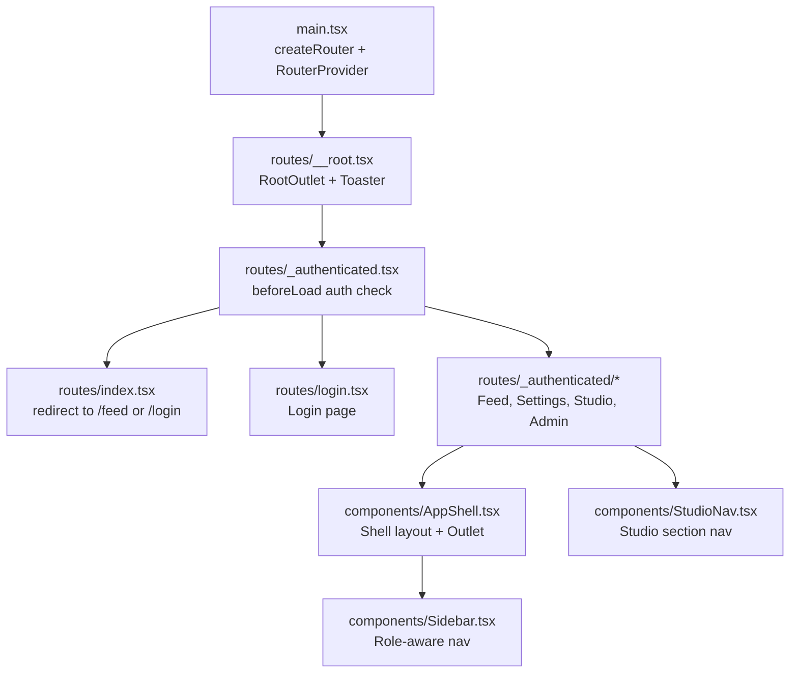
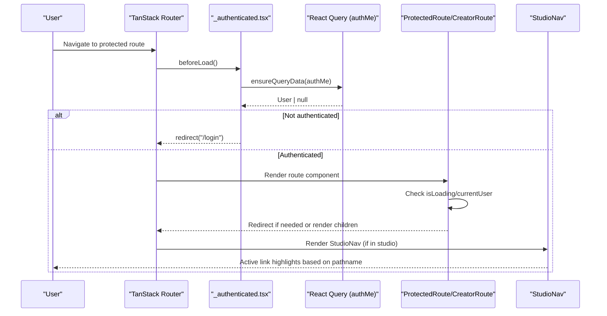
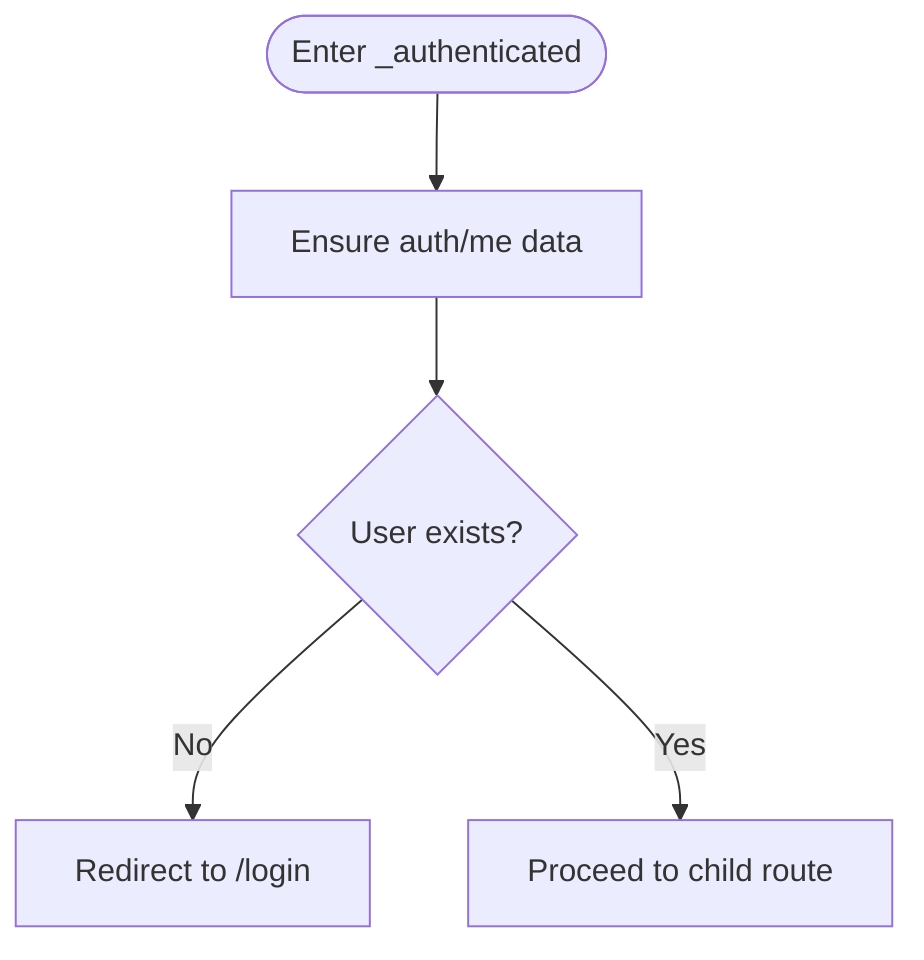
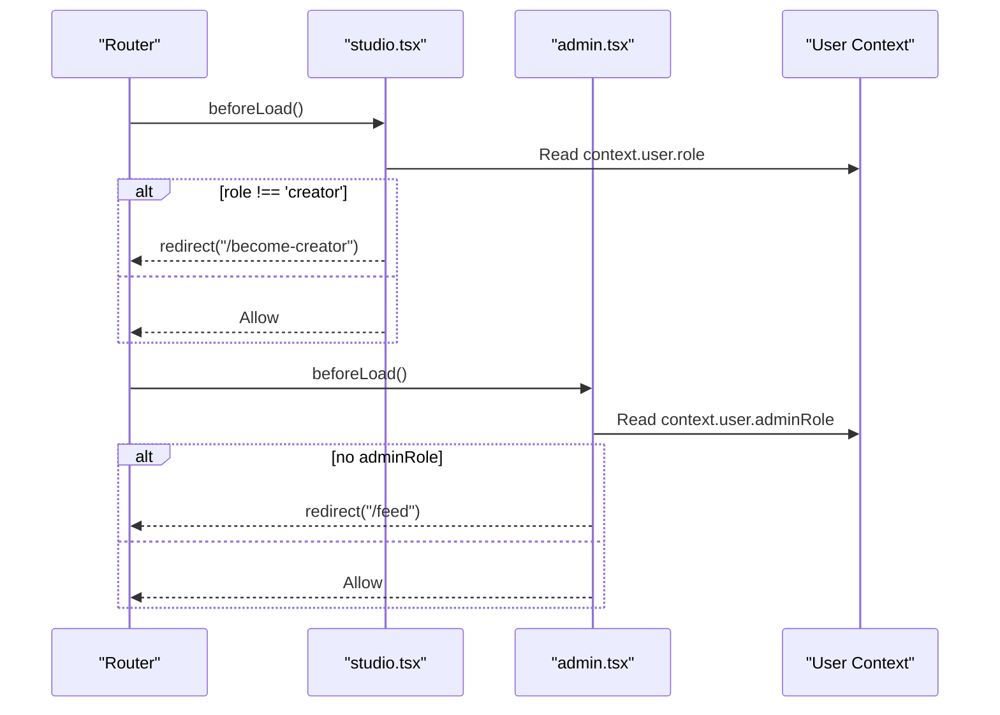
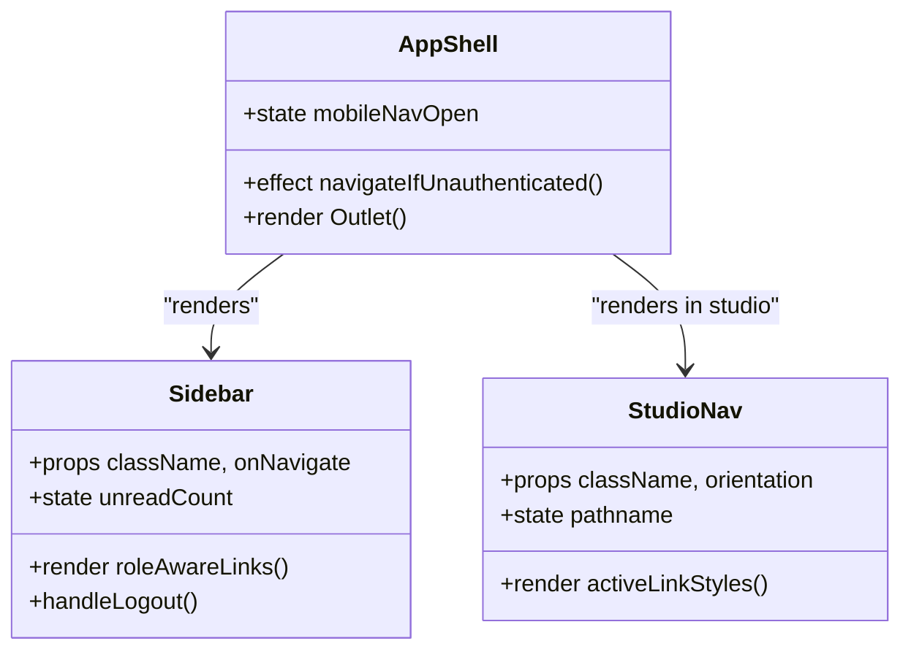
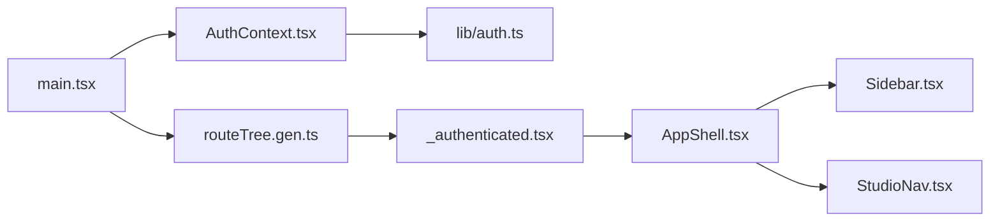

# Navigation and Routing Components

<cite>
**Referenced Files in This Document**
- [ProtectedRoute.tsx](file://src/react-app/components/ProtectedRoute.tsx)
- [CreatorRoute.tsx](file://src/react-app/components/CreatorRoute.tsx)
- [StudioNav.tsx](file://src/react-app/components/StudioNav.tsx)
- [AuthContext.tsx](file://src/react-app/context/AuthContext.tsx)
- [auth.ts](file://src/react-app/lib/auth.ts)
- [AppShell.tsx](file://src/react-app/components/AppShell.tsx)
- [Sidebar.tsx](file://src/react-app/components/Sidebar.tsx)
- [__root.tsx](file://src/react-app/routes/__root.tsx)
- [_authenticated.tsx](file://src/react-app/routes/_authenticated.tsx)
- [index.tsx](file://src/react-app/routes/index.tsx)
- [login.tsx](file://src/react-app/routes/login.tsx)
- [studio.tsx](file://src/react-app/routes/_authenticated/studio.tsx)
- [admin.tsx](file://src/react-app/routes/_authenticated/admin.tsx)
- [feed.tsx](file://src/react-app/routes/_authenticated/feed.tsx)
- [settings.tsx](file://src/react-app/routes/_authenticated/settings.tsx)
- [studio_.articles.new.tsx](file://src/react-app/routes/_authenticated/studio_.articles.new.tsx)
- [main.tsx](file://src/react-app/main.tsx)
</cite>

## Table of Contents
1. [Introduction](#introduction)
2. [Project Structure](#project-structure)
3. [Core Components](#core-components)
4. [Architecture Overview](#architecture-overview)
5. [Detailed Component Analysis](#detailed-component-analysis)
6. [Dependency Analysis](#dependency-analysis)
7. [Performance Considerations](#performance-considerations)
8. [Troubleshooting Guide](#troubleshooting-guide)
9. [Conclusion](#conclusion)

## Introduction
This document explains the navigation and routing system built with TanStack Router, focusing on authentication-based protection, role-based authorization, and studio-specific navigation. It covers:
- ProtectedRoute for guarding authenticated routes
- CreatorRoute for enforcing creator-only access
- StudioNav for navigating within the creator workspace
- Route guards using beforeLoad hooks
- Nested routing patterns and dynamic routes
- Integration with React Query and Auth context for state management

## Project Structure
The application uses file-based routing under src/react-app/routes. Authentication is enforced at both the route level (beforeLoad) and component level (route guards). The root layout provides global providers and UI chrome.

**Diagram sources**
- [main.tsx:12-17](file://src/react-app/main.tsx#L12-L17)
- [__root.tsx:10-22](file://src/react-app/routes/__root.tsx#L10-L22)
- [_authenticated.tsx:5-19](file://src/react-app/routes/_authenticated.tsx#L5-L19)
- [index.tsx:4-13](file://src/react-app/routes/index.tsx#L4-L13)
- [login.tsx:5-16](file://src/react-app/routes/login.tsx#L5-L16)
- [AppShell.tsx:16-62](file://src/react-app/components/AppShell.tsx#L16-L62)
- [Sidebar.tsx:36-159](file://src/react-app/components/Sidebar.tsx#L36-L159)
- [StudioNav.tsx:27-82](file://src/react-app/components/StudioNav.tsx#L27-L82)

**Section sources**
- [main.tsx:12-17](file://src/react-app/main.tsx#L12-L17)
- [__root.tsx:10-22](file://src/react-app/routes/__root.tsx#L10-L22)
- [_authenticated.tsx:5-19](file://src/react-app/routes/_authenticated.tsx#L5-L19)
- [index.tsx:4-13](file://src/react-app/routes/index.tsx#L4-L13)
- [login.tsx:5-16](file://src/react-app/routes/login.tsx#L5-L16)
- [AppShell.tsx:16-62](file://src/react-app/components/AppShell.tsx#L16-L62)
- [Sidebar.tsx:36-159](file://src/react-app/components/Sidebar.tsx#L36-L159)
- [StudioNav.tsx:27-82](file://src/react-app/components/StudioNav.tsx#L27-L82)

## Core Components
- ProtectedRoute: Renders a loading indicator while checking session; redirects unauthenticated users to login.
- CreatorRoute: Ensures the current user has the creator role; otherwise redirects to become-creator flow.
- StudioNav: Provides horizontal or vertical navigation for studio sections with active-state detection.

These components integrate with AuthContext for current user state and use TanStack Router’s Navigate for redirections.

**Section sources**
- [ProtectedRoute.tsx:6-18](file://src/react-app/components/ProtectedRoute.tsx#L6-L18)
- [CreatorRoute.tsx:6-22](file://src/react-app/components/CreatorRoute.tsx#L6-L22)
- [StudioNav.tsx:27-82](file://src/react-app/components/StudioNav.tsx#L27-L82)
- [AuthContext.tsx:23-83](file://src/react-app/context/AuthContext.tsx#L23-L83)

## Architecture Overview
TanStack Router drives navigation and guards via beforeLoad hooks. The _authenticated group enforces authentication globally, while individual routes enforce role-based access. AppShell wraps authenticated content and handles client-side fallbacks. Sidebar renders role-aware links; StudioNav renders studio-specific links.

**Diagram sources**
- [_authenticated.tsx:5-19](file://src/react-app/routes/_authenticated.tsx#L5-L19)
- [auth.ts:20-34](file://src/react-app/lib/auth.ts#L20-L34)
- [ProtectedRoute.tsx:6-18](file://src/react-app/components/ProtectedRoute.tsx#L6-L18)
- [CreatorRoute.tsx:6-22](file://src/react-app/components/CreatorRoute.tsx#L6-L22)
- [StudioNav.tsx:27-82](file://src/react-app/components/StudioNav.tsx#L27-L82)

## Detailed Component Analysis

### ProtectedRoute
Purpose:
- Guard authenticated routes by verifying session state from AuthContext.
- Show a loading state while fetching current user.
- Redirect to login when not authenticated.

Behavior:
- Uses useAuth to read currentUser and isLoading.
- Renders LoadingBlock during load.
- Navigates to /login when no user is present.

Integration:
- Works alongside TanStack Router’s route-level guards for defense-in-depth.

**Section sources**
- [ProtectedRoute.tsx:6-18](file://src/react-app/components/ProtectedRoute.tsx#L6-L18)
- [AuthContext.tsx:23-83](file://src/react-app/context/AuthContext.tsx#L23-L83)

### CreatorRoute
Purpose:
- Enforce creator-only access for features requiring creator privileges.

Behavior:
- Checks isLoading and currentUser.
- Redirects to /login if not authenticated.
- Redirects to /become-creator if role is not creator.

Usage pattern:
- Wrap creator-only pages or nested routes to prevent unauthorized access.

**Section sources**
- [CreatorRoute.tsx:6-22](file://src/react-app/components/CreatorRoute.tsx#L6-L22)
- [auth.ts:4-14](file://src/react-app/lib/auth.ts#L4-L14)

### StudioNav
Purpose:
- Provide navigation across studio sections with active-state highlighting.

Key features:
- Supports horizontal and vertical orientations.
- Computes active state based on exact match or prefix matching for nested routes (e.g., articles new vs editing).
- Uses useRouterState to derive pathname for accurate active styling.

Navigation items:
- Create, Scheduled, Articles, Photography, Audio, Courses, Subscriptions, Money.

**Section sources**
- [StudioNav.tsx:27-82](file://src/react-app/components/StudioNav.tsx#L27-L82)

### Route Guards and Patterns

#### Global Authentication Guard (_authenticated)
- Ensures a valid user exists before rendering any authenticated routes.
- Fetches current user via React Query and redirects to login if missing.

**Diagram sources**
- [_authenticated.tsx:5-19](file://src/react-app/routes/_authenticated.tsx#L5-L19)
- [auth.ts:20-34](file://src/react-app/lib/auth.ts#L20-L34)

**Section sources**
- [_authenticated.tsx:5-19](file://src/react-app/routes/_authenticated.tsx#L5-L19)

#### Role-Based Authorization (Studio and Admin)
- Studio route checks creator role and redirects to become-creator if not authorized.
- Admin route checks adminRole and redirects away if unauthorized.

**Diagram sources**
- [studio.tsx:4-11](file://src/react-app/routes/_authenticated/studio.tsx#L4-L11)
- [admin.tsx:3-8](file://src/react-app/routes/_authenticated/admin.tsx#L3-L8)

**Section sources**
- [studio.tsx:4-11](file://src/react-app/routes/_authenticated/studio.tsx#L4-L11)
- [admin.tsx:3-8](file://src/react-app/routes/_authenticated/admin.tsx#L3-L8)

#### Dynamic Routes and Nested Routing
- Profile routes use dynamic segments like u.$username and nested sub-routes for album, article, audio, course, photography, podcast, post.
- Studio content includes nested routes such as studio_/articles/new and studio_/courses.$courseId.edit.

Examples:
- Dynamic profile path: /u/$username
- Nested article creation: /_authenticated/studio_/articles/new
- Course edit: /_authenticated/studio_/courses.$courseId.edit

**Section sources**
- [studio_.articles.new.tsx:4-11](file://src/react-app/routes/_authenticated/studio_.articles.new.tsx#L4-L11)

#### Root and Login Redirections
- Root route redirects authenticated users to feed and unauthenticated users to login.
- Login route redirects authenticated users back to feed.

**Section sources**
- [index.tsx:4-13](file://src/react-app/routes/index.tsx#L4-L13)
- [login.tsx:5-16](file://src/react-app/routes/login.tsx#L5-L16)

### Shell and Navigation State Management
- AppShell ensures authenticated state before rendering content and navigates to login if needed.
- Sidebar renders role-aware navigation and integrates logout functionality.
- StudioNav manages active state using router state for precise highlighting.

**Diagram sources**
- [AppShell.tsx:16-62](file://src/react-app/components/AppShell.tsx#L16-L62)
- [Sidebar.tsx:36-159](file://src/react-app/components/Sidebar.tsx#L36-L159)
- [StudioNav.tsx:27-82](file://src/react-app/components/StudioNav.tsx#L27-L82)

**Section sources**
- [AppShell.tsx:16-62](file://src/react-app/components/AppShell.tsx#L16-L62)
- [Sidebar.tsx:36-159](file://src/react-app/components/Sidebar.tsx#L36-L159)
- [StudioNav.tsx:27-82](file://src/react-app/components/StudioNav.tsx#L27-L82)

## Dependency Analysis
- main.tsx initializes the router with a shared queryClient and mounts providers (ThemeProvider, QueryClientProvider, AuthProvider, AudioPlayerProvider).
- AuthContext depends on React Query for fetching and caching current user data.
- Route guards depend on context.user populated by _authenticated beforeLoad.
- StudioNav depends on TanStack Router’s useRouterState for pathname.

**Diagram sources**
- [main.tsx:12-17](file://src/react-app/main.tsx#L12-L17)
- [AuthContext.tsx:23-83](file://src/react-app/context/AuthContext.tsx#L23-L83)
- [auth.ts:20-34](file://src/react-app/lib/auth.ts#L20-L34)
- [_authenticated.tsx:5-19](file://src/react-app/routes/_authenticated.tsx#L5-L19)
- [AppShell.tsx:16-62](file://src/react-app/components/AppShell.tsx#L16-L62)
- [Sidebar.tsx:36-159](file://src/react-app/components/Sidebar.tsx#L36-L159)
- [StudioNav.tsx:27-82](file://src/react-app/components/StudioNav.tsx#L27-L82)

**Section sources**
- [main.tsx:12-17](file://src/react-app/main.tsx#L12-L17)
- [AuthContext.tsx:23-83](file://src/react-app/context/AuthContext.tsx#L23-L83)
- [auth.ts:20-34](file://src/react-app/lib/auth.ts#L20-L34)
- [_authenticated.tsx:5-19](file://src/react-app/routes/_authenticated.tsx#L5-L19)
- [AppShell.tsx:16-62](file://src/react-app/components/AppShell.tsx#L16-L62)
- [Sidebar.tsx:36-159](file://src/react-app/components/Sidebar.tsx#L36-L159)
- [StudioNav.tsx:27-82](file://src/react-app/components/StudioNav.tsx#L27-L82)

## Performance Considerations
- Use route-level beforeLoad guards to avoid unnecessary component rendering and reduce client-side checks.
- Leverage React Query caching for auth data to minimize network requests and improve perceived performance.
- Prefer TanStack Router’s Navigate for efficient client-side redirections.
- Keep StudioNav active-state logic simple and rely on pathname comparisons to avoid heavy computations.

[No sources needed since this section provides general guidance]

## Troubleshooting Guide
Common issues and resolutions:
- Infinite redirect loops: Ensure beforeLoad guards do not redirect to routes that also require authentication without proper conditions.
- Stale auth state: Invalidate or refresh auth queries after logout or OTP verification to keep currentUser consistent.
- Incorrect active states in StudioNav: Verify pathname comparisons and prefix matching for nested routes.
- Missing user context: Confirm _authenticated beforeLoad runs and sets context.user before child routes execute.

Relevant integration points:
- AuthContext event listeners handle unauthorized and account-suspended events to clear user state.
- AppShell navigates to login when currentUser is absent after loading completes.

**Section sources**
- [AuthContext.tsx:41-49](file://src/react-app/context/AuthContext.tsx#L41-L49)
- [AppShell.tsx:21-25](file://src/react-app/components/AppShell.tsx#L21-L25)

## Conclusion
The navigation and routing system combines TanStack Router’s powerful file-based routing and beforeLoad guards with React Query-driven authentication state. ProtectedRoute and CreatorRoute provide layered security, while StudioNav delivers an intuitive creator workspace experience. By centralizing auth checks at the route level and leveraging router state for UI feedback, the application maintains robust access control and smooth user flows.

[No sources needed since this section summarizes without analyzing specific files]