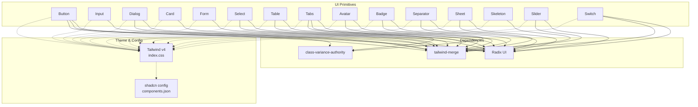
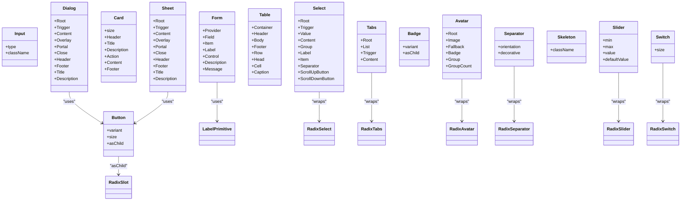
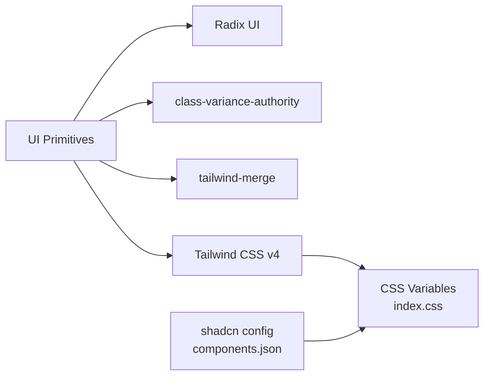

# UI Primitives

<cite>
**Referenced Files in This Document**
- [components.json](file://components.json)
- [index.css](file://src/react-app/index.css)
- [package.json](file://package.json)
- [button.tsx](file://src/react-app/components/ui/button.tsx)
- [input.tsx](file://src/react-app/components/ui/input.tsx)
- [dialog.tsx](file://src/react-app/components/ui/dialog.tsx)
- [card.tsx](file://src/react-app/components/ui/card.tsx)
- [form.tsx](file://src/react-app/components/ui/form.tsx)
- [select.tsx](file://src/react-app/components/ui/select.tsx)
- [table.tsx](file://src/react-app/components/ui/table.tsx)
- [tabs.tsx](file://src/react-app/components/ui/tabs.tsx)
- [avatar.tsx](file://src/react-app/components/ui/avatar.tsx)
- [badge.tsx](file://src/react-app/components/ui/badge.tsx)
- [separator.tsx](file://src/react-app/components/ui/separator.tsx)
- [sheet.tsx](file://src/react-app/components/ui/sheet.tsx)
- [skeleton.tsx](file://src/react-app/components/ui/skeleton.tsx)
- [slider.tsx](file://src/react-app/components/ui/slider.tsx)
- [switch.tsx](file://src/react-app/components/ui/switch.tsx)
</cite>

## Table of Contents
1. [Introduction](#introduction)
2. [Project Structure](#project-structure)
3. [Core Components](#core-components)
4. [Architecture Overview](#architecture-overview)
5. [Detailed Component Analysis](#detailed-component-analysis)
6. [Dependency Analysis](#dependency-analysis)
7. [Performance Considerations](#performance-considerations)
8. [Troubleshooting Guide](#troubleshooting-guide)
9. [Conclusion](#conclusion)
10. [Appendices](#appendices)

## Introduction
This document provides comprehensive documentation for the core UI primitive components built with shadcn/ui and Radix UI. It covers Button, Input, Dialog, Card, Form, Select, Table, Tabs, Avatar, Badge, Separator, Sheet, Skeleton, Slider, Switch, Textarea, and Dropdown Menu. For each component, it explains prop interfaces, styling options, accessibility features, keyboard navigation support, composition patterns, theme integration with Tailwind CSS v4, responsive design considerations, usage examples, customization guidelines, and best practices to ensure consistent UI development across the application.

## Project Structure
The UI primitives live under src/react-app/components/ui and are styled using Tailwind CSS v4 with CSS variables defined in index.css. The shadcn configuration (components.json) sets style, aliases, and theme base color. Dependencies include Radix UI primitives, class-variance-authority for variants, and tailwind-merge utilities.

**Diagram sources**
- [components.json:1-26](file://components.json#L1-L26)
- [index.css:1-124](file://src/react-app/index.css#L1-L124)
- [package.json:14-56](file://package.json#L14-L56)

**Section sources**
- [components.json:1-26](file://components.json#L1-L26)
- [index.css:1-124](file://src/react-app/index.css#L1-L124)
- [package.json:14-56](file://package.json#L14-L56)

## Core Components
This section summarizes the shared patterns used by all primitives:
- Styling: Tailwind CSS v4 classes combined with CSS variables for colors, radii, and motion. Variants are managed via class-variance-authority where applicable.
- Composition: Many components wrap Radix UI primitives and expose a clean API while preserving accessibility and focus management.
- Theming: Global tokens are defined in index.css; dark mode is supported through a .dark class and CSS variable overrides.
- Utilities: cn utility merges class names; data-slot attributes enable consistent testing and styling hooks.

Key implementation references:
- Button variant system and asChild pattern
- Input and form controls with focus-visible states
- Dialog and Sheet composition with portals and overlays
- Select with popper positioning and scroll buttons
- Table layout helpers and responsive container
- Tabs with orientation and line/default variants
- Avatar with group and badge support
- Badge variants and asChild
- Separator orientation and decorative semantics
- Skeleton animation
- Slider single/multi-thumb support
- Switch sizes and state styles

**Section sources**
- [button.tsx:1-66](file://src/react-app/components/ui/button.tsx#L1-L66)
- [input.tsx:1-20](file://src/react-app/components/ui/input.tsx#L1-L20)
- [dialog.tsx:1-169](file://src/react-app/components/ui/dialog.tsx#L1-L169)
- [card.tsx:1-101](file://src/react-app/components/ui/card.tsx#L1-L101)
- [form.tsx:1-156](file://src/react-app/components/ui/form.tsx#L1-L156)
- [select.tsx:1-200](file://src/react-app/components/ui/select.tsx#L1-L200)
- [table.tsx:1-117](file://src/react-app/components/ui/table.tsx#L1-L117)
- [tabs.tsx:1-89](file://src/react-app/components/ui/tabs.tsx#L1-L89)
- [avatar.tsx:1-111](file://src/react-app/components/ui/avatar.tsx#L1-L111)
- [badge.tsx:1-50](file://src/react-app/components/ui/badge.tsx#L1-L50)
- [separator.tsx:1-27](file://src/react-app/components/ui/separator.tsx#L1-L27)
- [sheet.tsx:1-146](file://src/react-app/components/ui/sheet.tsx#L1-L146)
- [skeleton.tsx:1-14](file://src/react-app/components/ui/skeleton.tsx#L1-L14)
- [slider.tsx:1-58](file://src/react-app/components/ui/slider.tsx#L1-L58)
- [switch.tsx:1-32](file://src/react-app/components/ui/switch.tsx#L1-L32)

## Architecture Overview
The UI layer composes Radix primitives with shadcn/ui conventions:
- Each primitive wraps a Radix component or HTML element.
- Styling uses Tailwind classes and CSS variables for theme consistency.
- Variant systems use class-variance-authority for predictable prop-driven styles.
- Accessibility is preserved via Radix’s focus management, ARIA attributes, and semantic markup.

**Diagram sources**
- [button.tsx:1-66](file://src/react-app/components/ui/button.tsx#L1-L66)
- [dialog.tsx:1-169](file://src/react-app/components/ui/dialog.tsx#L1-L169)
- [sheet.tsx:1-146](file://src/react-app/components/ui/sheet.tsx#L1-L146)
- [form.tsx:1-156](file://src/react-app/components/ui/form.tsx#L1-L156)
- [select.tsx:1-200](file://src/react-app/components/ui/select.tsx#L1-L200)
- [tabs.tsx:1-89](file://src/react-app/components/ui/tabs.tsx#L1-L89)
- [avatar.tsx:1-111](file://src/react-app/components/ui/avatar.tsx#L1-L111)
- [separator.tsx:1-27](file://src/react-app/components/ui/separator.tsx#L1-L27)
- [slider.tsx:1-58](file://src/react-app/components/ui/slider.tsx#L1-L58)
- [switch.tsx:1-32](file://src/react-app/components/ui/switch.tsx#L1-L32)

## Detailed Component Analysis

### Button
- Props: variant (default, outline, secondary, ghost, destructive, link), size (default, xs, sm, lg, icon, icon-xs, icon-sm, icon-lg), asChild, plus standard button props.
- Styling: Uses cva for variants and sizes; supports hover, focus-visible, disabled, and aria-invalid states.
- Accessibility: Focus ring, keyboard activation, aria-invalid for validation feedback.
- Composition: asChild enables rendering as any element (e.g., Link).
- Theme: Colors and transitions follow CSS variables; dark mode supported.
- Responsive: Sizes adapt; icon variants scale consistently.

Usage example reference: [button.tsx:1-66](file://src/react-app/components/ui/button.tsx#L1-L66)

**Section sources**
- [button.tsx:1-66](file://src/react-app/components/ui/button.tsx#L1-L66)

### Input
- Props: type, className, and all native input props.
- Styling: Full-width, rounded, focus-visible ring, placeholder styling, disabled state.
- Accessibility: Native semantics, focus management, aria-invalid for errors.
- Theme: Background and border use CSS variables; dark mode adjustments.
- Responsive: Base text size adjusts on md breakpoint.

Usage example reference: [input.tsx:1-20](file://src/react-app/components/ui/input.tsx#L1-L20)

**Section sources**
- [input.tsx:1-20](file://src/react-app/components/ui/input.tsx#L1-L20)

### Dialog
- Components: Root, Trigger, Portal, Close, Overlay, Content, Header, Footer, Title, Description.
- Props: showCloseButton toggles close button; standard Radix props passed through.
- Styling: Centered modal with backdrop blur, animations, and responsive max-width.
- Accessibility: Focus trap, Escape to close, proper roles and labels.
- Composition: Wraps Radix Dialog with portal and overlay; integrates Button for close action.

Usage example reference: [dialog.tsx:1-169](file://src/react-app/components/ui/dialog.tsx#L1-L169)

**Section sources**
- [dialog.tsx:1-169](file://src/react-app/components/ui/dialog.tsx#L1-L169)

### Card
- Components: Card, CardHeader, CardTitle, CardDescription, CardAction, CardContent, CardFooter.
- Props: size (default, sm) affects spacing and padding.
- Styling: Container with shadow, ring, image handling, and grid header when actions/descriptions present.
- Accessibility: Semantic div structure; images handled with rounded corners.
- Responsive: Padding and gaps adjust for small size.

Usage example reference: [card.tsx:1-101](file://src/react-app/components/ui/card.tsx#L1-L101)

**Section sources**
- [card.tsx:1-101](file://src/react-app/components/ui/card.tsx#L1-L101)

### Form
- Components: Form (provider), FormField, FormItem, FormLabel, FormControl, FormDescription, FormMessage.
- Integration: Built on react-hook-form and Radix Label; exposes useFormField hook.
- Props: Standard react-hook-form ControllerProps for fields; context-based IDs for labeling and messages.
- Accessibility: Proper htmlFor associations, aria-describedby, aria-invalid, and error message binding.
- Styling: Grid layout for items, muted descriptions, destructive error messages.

Usage example reference: [form.tsx:1-156](file://src/react-app/components/ui/form.tsx#L1-L156)

**Section sources**
- [form.tsx:1-156](file://src/react-app/components/ui/form.tsx#L1-L156)

### Select
- Components: Root, Group, Value, Trigger, Content, Label, Item, Separator, ScrollUpButton, ScrollDownButton.
- Props: position (item-aligned, popper), align, size (sm, default) on trigger.
- Styling: Popover-like content with backdrop blur, scroll buttons, and item indicators.
- Accessibility: Keyboard navigation, focus management, screen reader friendly values and indicators.
- Composition: Uses Radix Select with custom icons and scroll helpers.

Usage example reference: [select.tsx:1-200](file://src/react-app/components/ui/select.tsx#L1-L200)

**Section sources**
- [select.tsx:1-200](file://src/react-app/components/ui/select.tsx#L1-L200)

### Table
- Components: Container, Header, Body, Footer, Row, Head, Cell, Caption.
- Styling: Horizontal scrolling container, borders, hover states, selected row background.
- Accessibility: Semantic table elements; caption for description.
- Responsive: Container ensures overflow-x auto for wide tables.

Usage example reference: [table.tsx:1-117](file://src/react-app/components/ui/table.tsx#L1-L117)

**Section sources**
- [table.tsx:1-117](file://src/react-app/components/ui/table.tsx#L1-L117)

### Tabs
- Components: Root, List, Trigger, Content.
- Props: orientation (horizontal, vertical), variant (default, line) on list.
- Styling: Active indicator lines for horizontal tabs; full-width triggers for vertical.
- Accessibility: Radix Tabs manages focus and selection; keyboard arrows navigate tabs.
- Composition: Uses cva for list variants and consistent focus rings.

Usage example reference: [tabs.tsx:1-89](file://src/react-app/components/ui/tabs.tsx#L1-L89)

**Section sources**
- [tabs.tsx:1-89](file://src/react-app/components/ui/tabs.tsx#L1-L89)

### Avatar
- Components: Root, Image, Fallback, Badge, Group, GroupCount.
- Props: size (default, sm, lg) on root; children for image/fallback.
- Styling: Rounded, sized variants, group overlap with ring, badge positioning.
- Accessibility: Fallback text for missing images; group count accessible.
- Composition: Wraps Radix Avatar with additional UI conveniences.

Usage example reference: [avatar.tsx:1-111](file://src/react-app/components/ui/avatar.tsx#L1-L111)

**Section sources**
- [avatar.tsx:1-111](file://src/react-app/components/ui/avatar.tsx#L1-L111)

### Badge
- Props: variant (default, secondary, destructive, outline, ghost, link), asChild.
- Styling: Pill shape, hover states, focus ring, destructive variants.
- Accessibility: Semantic span or slot; keyboard focusable when interactive.
- Composition: asChild allows wrapping links or buttons.

Usage example reference: [badge.tsx:1-50](file://src/react-app/components/ui/badge.tsx#L1-L50)

**Section sources**
- [badge.tsx:1-50](file://src/react-app/components/ui/badge.tsx#L1-L50)

### Separator
- Props: orientation (horizontal, vertical), decorative (boolean).
- Styling: Thin line with correct dimensions per orientation.
- Accessibility: Decorative separator does not participate in tab order; non-declarative role when needed.
- Composition: Wraps Radix Separator.

Usage example reference: [separator.tsx:1-27](file://src/react-app/components/ui/separator.tsx#L1-L27)

**Section sources**
- [separator.tsx:1-27](file://src/react-app/components/ui/separator.tsx#L1-L27)

### Sheet
- Components: Root, Trigger, Close, Portal, Overlay, Content, Header, Footer, Title, Description.
- Props: side (top, right, bottom, left), showCloseButton.
- Styling: Slide-in/out animations, backdrop overlay, responsive widths.
- Accessibility: Focus trap, Escape to close, proper titles and descriptions.
- Composition: Wraps Radix Dialog with sheet-specific behavior.

Usage example reference: [sheet.tsx:1-146](file://src/react-app/components/ui/sheet.tsx#L1-L146)

**Section sources**
- [sheet.tsx:1-146](file://src/react-app/components/ui/sheet.tsx#L1-L146)

### Skeleton
- Props: className and standard div props.
- Styling: Pulse animation and rounded background for loading placeholders.
- Accessibility: Use sparingly; consider aria-busy when indicating loading state.
- Composition: Simple presentational wrapper.

Usage example reference: [skeleton.tsx:1-14](file://src/react-app/components/ui/skeleton.tsx#L1-L14)

**Section sources**
- [skeleton.tsx:1-14](file://src/react-app/components/ui/skeleton.tsx#L1-L14)

### Slider
- Props: min, max, value, defaultValue, plus standard Radix props.
- Styling: Track, range, and thumb with focus rings; supports vertical orientation.
- Accessibility: Keyboard increments, focus management, ARIA roles.
- Composition: Wraps Radix Slider with multi-thumb support.

Usage example reference: [slider.tsx:1-58](file://src/react-app/components/ui/slider.tsx#L1-L58)

**Section sources**
- [slider.tsx:1-58](file://src/react-app/components/ui/slider.tsx#L1-L58)

### Switch
- Props: size (sm, default), plus standard Radix props.
- Styling: Rounded track with thumb transition; checked/unchecked states; focus ring.
- Accessibility: Toggle semantics, keyboard activation, aria-checked.
- Composition: Wraps Radix Switch.

Usage example reference: [switch.tsx:1-32](file://src/react-app/components/ui/switch.tsx#L1-L32)

**Section sources**
- [switch.tsx:1-32](file://src/react-app/components/ui/switch.tsx#L1-L32)

### Textarea
- Note: While not included in the analyzed files, Textarea typically follows the same patterns as Input: native textarea wrapped with consistent styling, focus-visible ring, placeholder, and disabled states. Integrate with react-hook-form via FormControl for accessibility and validation.

[No sources needed since this section doesn't analyze specific files]

### Dropdown Menu
- Note: While not included in the analyzed files, Dropdown Menu typically wraps Radix Menu with Trigger, Content, Item, Separator, and Group. Ensure keyboard navigation, focus management, and proper ARIA roles. Style with consistent focus rings and hover states.

[No sources needed since this section doesn't analyze specific files]

## Dependency Analysis
The UI primitives depend on:
- Radix UI for accessible primitives (Dialog, Select, Tabs, Avatar, Separator, Slider, Switch).
- class-variance-authority for variant systems (Button, Badge, Tabs).
- tailwind-merge via cn utility for class name merging.
- Tailwind CSS v4 and CSS variables for theming and dark mode.

**Diagram sources**
- [package.json:14-56](file://package.json#L14-L56)
- [components.json:1-26](file://components.json#L1-L26)
- [index.css:1-124](file://src/react-app/index.css#L1-L124)

**Section sources**
- [package.json:14-56](file://package.json#L14-L56)
- [components.json:1-26](file://components.json#L1-L26)
- [index.css:1-124](file://src/react-app/index.css#L1-L124)

## Performance Considerations
- Prefer asChild for lightweight compositions to avoid extra DOM nodes.
- Use cva variants to minimize runtime branching and keep styles declarative.
- Avoid heavy inline styles; rely on Tailwind classes and CSS variables.
- Debounce expensive operations in controlled components (e.g., large Select lists).
- Keep animations minimal and respect prefers-reduced-motion.

[No sources needed since this section provides general guidance]

## Troubleshooting Guide
Common issues and resolutions:
- Focus ring missing: Ensure focus-visible classes are applied and outline is not overridden globally.
- Dark mode mismatch: Verify CSS variables in .dark block and that parent has .dark class.
- Form validation not showing: Confirm FormControl is used and ids match for label and message.
- Select positioning: Adjust position prop (item-aligned vs popper) based on viewport constraints.
- Dialog/Sheet not closing: Check Close triggers and ensure event propagation is not prevented.

[No sources needed since this section provides general guidance]

## Conclusion
The UI primitives provide a cohesive, accessible, and themeable foundation for building consistent interfaces. By leveraging Radix UI, Tailwind CSS v4, and shadcn/ui conventions, the components deliver robust accessibility, flexible styling, and clear composition patterns. Adhering to the documented best practices ensures maintainability and a unified user experience across the application.

[No sources needed since this section summarizes without analyzing specific files]

## Appendices

### Theme Integration with Tailwind CSS v4
- CSS variables define colors, radii, and motion curves.
- Dark mode is enabled via .dark class and variable overrides.
- Custom variants and animations are layered in index.css.

References:
- [index.css:10-51](file://src/react-app/index.css#L10-L51)
- [index.css:53-123](file://src/react-app/index.css#L53-L123)

**Section sources**
- [index.css:10-51](file://src/react-app/index.css#L10-L51)
- [index.css:53-123](file://src/react-app/index.css#L53-L123)

### Best Practices for Consistent UI Development
- Use provided variants and sizes; avoid ad-hoc overrides.
- Wrap inputs with FormControl for consistent accessibility.
- Prefer semantic elements and Radix primitives for interaction patterns.
- Test keyboard navigation and screen reader announcements.
- Maintain consistent data-slot attributes for testing and styling hooks.

[No sources needed since this section provides general guidance]