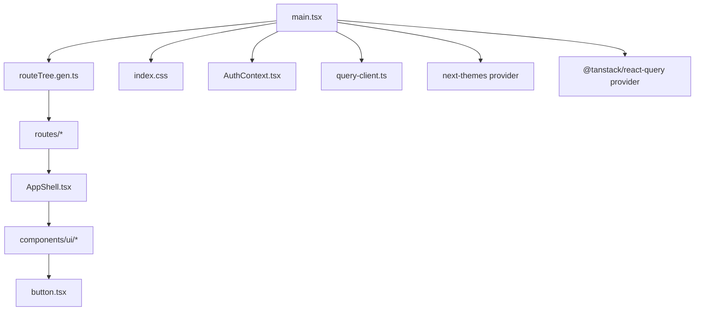
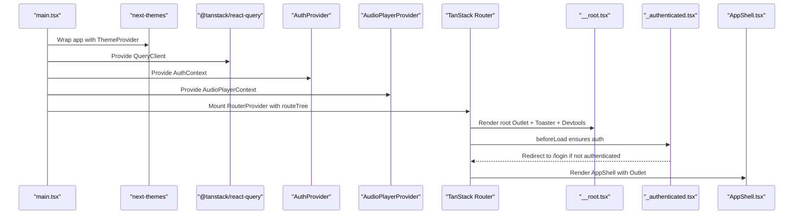
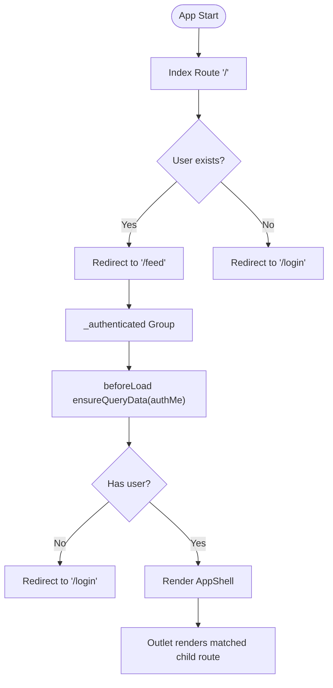
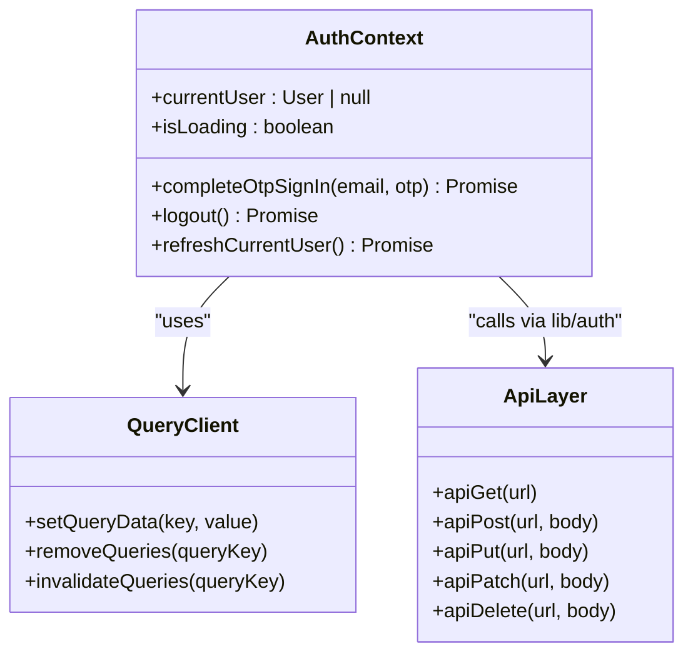
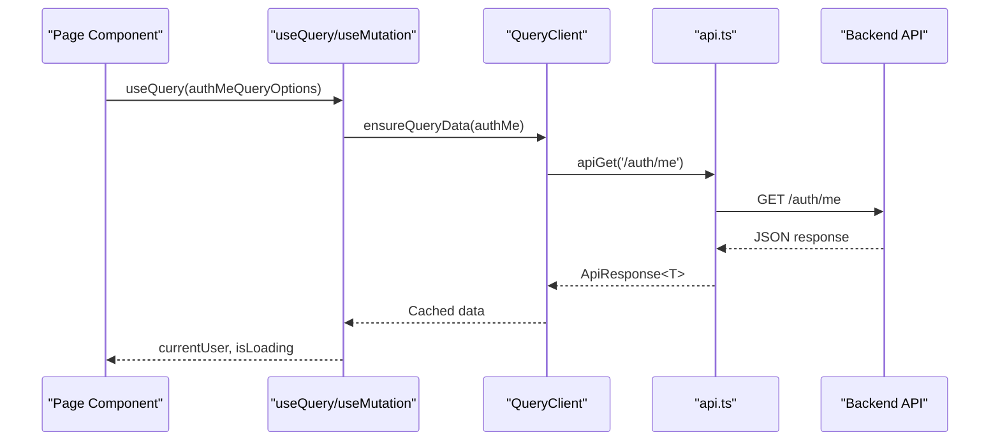
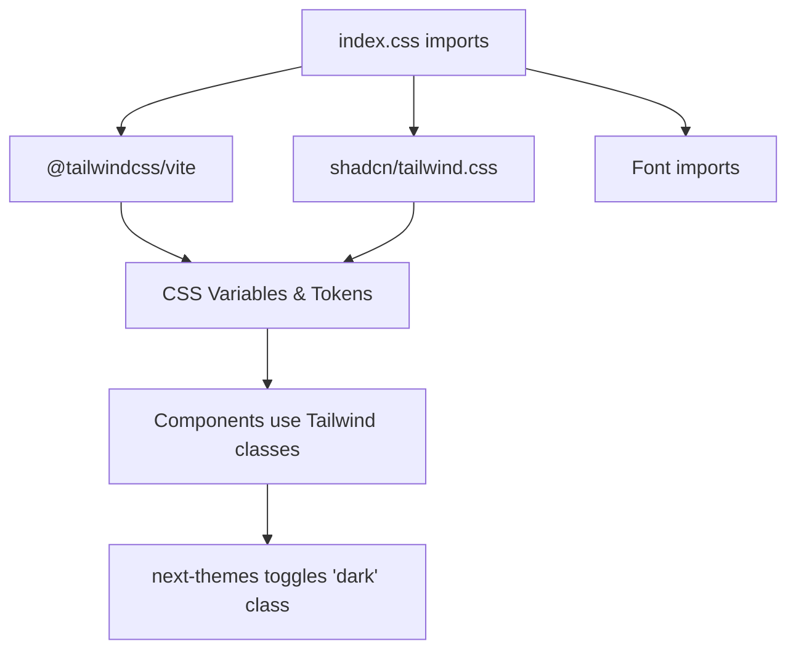
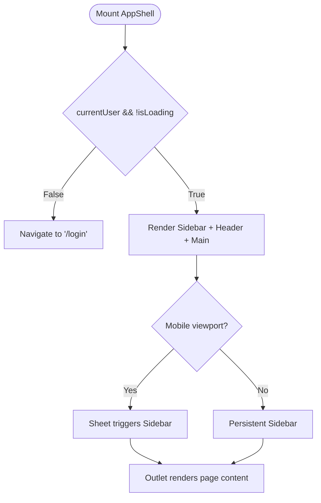
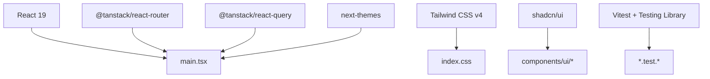

# Frontend Application

<cite>
**Referenced Files in This Document**
- [package.json](file://package.json)
- [vite.config.ts](file://vite.config.ts)
- [vitest.config.frontend.ts](file://vitest.config.frontend.ts)
- [components.json](file://components.json)
- [src/react-app/main.tsx](file://src/react-app/main.tsx)
- [src/react-app/index.css](file://src/react-app/index.css)
- [src/react-app/routeTree.gen.ts](file://src/react-app/routeTree.gen.ts)
- [src/react-app/routes/__root.tsx](file://src/react-app/routes/__root.tsx)
- [src/react-app/routes/_authenticated.tsx](file://src/react-app/routes/_authenticated.tsx)
- [src/react-app/routes/index.tsx](file://src/react-app/routes/index.tsx)
- [src/react-app/context/AuthContext.tsx](file://src/react-app/context/AuthContext.tsx)
- [src/react-app/lib/query-client.ts](file://src/react-app/lib/query-client.ts)
- [src/react-app/lib/api.ts](file://src/react-app/lib/api.ts)
- [src/react-app/components/AppShell.tsx](file://src/react-app/components/AppShell.tsx)
- [src/react-app/components/ui/button.tsx](file://src/react-app/components/ui/button.tsx)
</cite>

## Table of Contents
1. [Introduction](#introduction)
2. [Project Structure](#project-structure)
3. [Core Components](#core-components)
4. [Architecture Overview](#architecture-overview)
5. [Detailed Component Analysis](#detailed-component-analysis)
6. [Dependency Analysis](#dependency-analysis)
7. [Performance Considerations](#performance-considerations)
8. [Troubleshooting Guide](#troubleshooting-guide)
9. [Conclusion](#conclusion)
10. [Appendices](#appendices)

## Introduction
This document provides comprehensive documentation for the React frontend application. It covers the file-based routing with TanStack Router, React 19 with modern hooks patterns, Tailwind CSS v4 styling, and a component library built with shadcn/ui and Radix UI primitives. It also explains state management using React Context and TanStack Query for data fetching and caching, page organization (authenticated vs public routes), theme system implementation with next-themes, testing strategies with Vitest and Testing Library, responsive design patterns, accessibility compliance, performance optimization techniques, and guidance for adding new components, pages, and integrating with the backend API layer.

## Project Structure
The frontend is organized under src/react-app with clear separation of concerns:
- Entry point and providers are defined in main.tsx.
- File-based routes live under routes/ and are auto-generated into routeTree.gen.ts by the TanStack Router Vite plugin.
- Shared UI components reside under components/ui/, while feature-specific components are placed alongside their pages or in components/.
- Global styles and theming are configured via index.css using Tailwind CSS v4 and shadcn/ui variables.
- State and data fetching are centralized through contexts and TanStack Query configuration.



**Diagram sources**
- [src/react-app/main.tsx:1-38](file://src/react-app/main.tsx#L1-L38)
- [src/react-app/routeTree.gen.ts:1-120](file://src/react-app/routeTree.gen.ts#L1-L120)
- [src/react-app/index.css:1-50](file://src/react-app/index.css#L1-L50)
- [src/react-app/context/AuthContext.tsx:1-90](file://src/react-app/context/AuthContext.tsx#L1-L90)
- [src/react-app/lib/query-client.ts:1-14](file://src/react-app/lib/query-client.ts#L1-L14)
- [src/react-app/components/AppShell.tsx:1-63](file://src/react-app/components/AppShell.tsx#L1-L63)
- [src/react-app/components/ui/button.tsx:1-66](file://src/react-app/components/ui/button.tsx#L1-L66)

**Section sources**
- [package.json:14-56](file://package.json#L14-L56)
- [vite.config.ts:1-28](file://vite.config.ts#L1-L28)
- [components.json:1-26](file://components.json#L1-L26)
- [src/react-app/main.tsx:1-38](file://src/react-app/main.tsx#L1-L38)
- [src/react-app/routeTree.gen.ts:1-120](file://src/react-app/routeTree.gen.ts#L1-L120)

## Core Components
Key building blocks include:
- AppShell: Provides layout, responsive navigation, and guards unauthenticated access.
- Button: A shadcn/ui primitive styled with Tailwind CSS v4 and class-variance-authority variants.
- AuthContext: Encapsulates authentication state and mutations, integrated with TanStack Query.
- Query Client: Centralized TanStack Query configuration with retry and refetch policies.
- API Layer: Unified fetch wrapper with normalized error handling and HTTP method helpers.

These components work together to deliver a consistent user experience, robust data handling, and accessible UI elements.

**Section sources**
- [src/react-app/components/AppShell.tsx:1-63](file://src/react-app/components/AppShell.tsx#L1-L63)
- [src/react-app/components/ui/button.tsx:1-66](file://src/react-app/components/ui/button.tsx#L1-L66)
- [src/react-app/context/AuthContext.tsx:1-90](file://src/react-app/context/AuthContext.tsx#L1-L90)
- [src/react-app/lib/query-client.ts:1-14](file://src/react-app/lib/query-client.ts#L1-L14)
- [src/react-app/lib/api.ts:1-164](file://src/react-app/lib/api.ts#L1-L164)

## Architecture Overview
The application bootstraps with providers for theming, data fetching, authentication, and audio playback, then mounts the TanStack Router. Routes are declared as files; the router generates a type-safe tree used at runtime. The root route includes global UI like toast notifications and devtools. Authenticated routes enforce login checks before rendering the app shell.



**Diagram sources**
- [src/react-app/main.tsx:1-38](file://src/react-app/main.tsx#L1-L38)
- [src/react-app/routes/__root.tsx:1-23](file://src/react-app/routes/__root.tsx#L1-L23)
- [src/react-app/routes/_authenticated.tsx:1-20](file://src/react-app/routes/_authenticated.tsx#L1-L20)
- [src/react-app/components/AppShell.tsx:1-63](file://src/react-app/components/AppShell.tsx#L1-L63)

## Detailed Component Analysis

### Routing System (TanStack Router)
- File-based routes under routes/ are compiled into routeTree.gen.ts.
- Public routes: index redirects based on authentication state; login/register are top-level.
- Authenticated routes: _authenticated enforces login via beforeLoad and renders AppShell.
- Nested routes: studio, settings, admin, and user profiles use nested segments and parameters.



**Diagram sources**
- [src/react-app/routes/index.tsx:1-14](file://src/react-app/routes/index.tsx#L1-L14)
- [src/react-app/routes/_authenticated.tsx:1-20](file://src/react-app/routes/_authenticated.tsx#L1-L20)
- [src/react-app/routeTree.gen.ts:1-120](file://src/react-app/routeTree.gen.ts#L1-L120)

**Section sources**
- [src/react-app/routeTree.gen.ts:1-120](file://src/react-app/routeTree.gen.ts#L1-L120)
- [src/react-app/routes/index.tsx:1-14](file://src/react-app/routes/index.tsx#L1-L14)
- [src/react-app/routes/_authenticated.tsx:1-20](file://src/react-app/routes/_authenticated.tsx#L1-L20)

### Authentication Flow and Context
- AuthContext exposes current user, loading state, OTP sign-in completion, logout, and refresh.
- Integrates with TanStack Query to cache and invalidate user data.
- Listens to custom events for unauthorized and account-suspended states to reset context.



**Diagram sources**
- [src/react-app/context/AuthContext.tsx:1-90](file://src/react-app/context/AuthContext.tsx#L1-L90)
- [src/react-app/lib/query-client.ts:1-14](file://src/react-app/lib/query-client.ts#L1-L14)
- [src/react-app/lib/api.ts:1-164](file://src/react-app/lib/api.ts#L1-L164)

**Section sources**
- [src/react-app/context/AuthContext.tsx:1-90](file://src/react-app/context/AuthContext.tsx#L1-L90)
- [src/react-app/lib/query-client.ts:1-14](file://src/react-app/lib/query-client.ts#L1-L14)

### Data Fetching and Caching (TanStack Query)
- Query client disables retries and window focus refetch by default.
- Queries and mutations are managed centrally; AuthContext updates query data upon success.
- Error handling and event dispatching integrate with API layer for global state reactions.



**Diagram sources**
- [src/react-app/lib/query-client.ts:1-14](file://src/react-app/lib/query-client.ts#L1-L14)
- [src/react-app/lib/api.ts:1-164](file://src/react-app/lib/api.ts#L1-L164)
- [src/react-app/context/AuthContext.tsx:1-90](file://src/react-app/context/AuthContext.tsx#L1-L90)

**Section sources**
- [src/react-app/lib/query-client.ts:1-14](file://src/react-app/lib/query-client.ts#L1-L14)
- [src/react-app/lib/api.ts:1-164](file://src/react-app/lib/api.ts#L1-L164)

### Styling and Theme System (Tailwind CSS v4 + shadcn/ui + next-themes)
- Tailwind CSS v4 is configured via @tailwindcss/vite and imported in index.css.
- shadcn/ui style is set to radix-luma with CSS variables mapped to Tailwind tokens.
- next-themes wraps the app with attribute-based class toggling for dark mode.
- Custom animations and utility classes are defined in index.css.



**Diagram sources**
- [src/react-app/index.css:1-50](file://src/react-app/index.css#L1-L50)
- [components.json:1-26](file://components.json#L1-L26)
- [src/react-app/main.tsx:1-38](file://src/react-app/main.tsx#L1-L38)

**Section sources**
- [src/react-app/index.css:1-267](file://src/react-app/index.css#L1-L267)
- [components.json:1-26](file://components.json#L1-L26)
- [src/react-app/main.tsx:1-38](file://src/react-app/main.tsx#L1-L38)

### UI Component Library (shadcn/ui + Radix UI)
- Components like Button leverage class-variance-authority for variant and size control.
- Radix UI primitives provide accessible foundations (e.g., Slot usage).
- Utilities like cn merge class names efficiently.

```mermaid
classDiagram
class Button {
+variant : string
+size : string
+asChild : boolean
+render() JSX
}
class Variants {
+cva("base", { variants, defaultVariants })
}
class RadixSlot {
+Slot.Root
}
Button --> Variants : "uses cva"
Button --> RadixSlot : "renders as Child"
```

**Diagram sources**
- [src/react-app/components/ui/button.tsx:1-66](file://src/react-app/components/ui/button.tsx#L1-L66)

**Section sources**
- [src/react-app/components/ui/button.tsx:1-66](file://src/react-app/components/ui/button.tsx#L1-L66)

### Layout and Responsive Navigation (AppShell)
- AppShell renders a persistent sidebar on large screens and a mobile sheet-triggered menu on small screens.
- Guards against unauthenticated users by redirecting to login when needed.
- Uses Tailwind responsive utilities for layout adaptation.



**Diagram sources**
- [src/react-app/components/AppShell.tsx:1-63](file://src/react-app/components/AppShell.tsx#L1-L63)

**Section sources**
- [src/react-app/components/AppShell.tsx:1-63](file://src/react-app/components/AppShell.tsx#L1-L63)

## Dependency Analysis
High-level dependencies:
- React 19 and DOM client entrypoint.
- TanStack Router for file-based routing and code splitting.
- TanStack Query for data fetching and caching.
- next-themes for theme switching.
- Tailwind CSS v4 and shadcn/ui for styling.
- Vitest and Testing Library for testing.



**Diagram sources**
- [package.json:14-56](file://package.json#L14-L56)
- [vite.config.ts:1-28](file://vite.config.ts#L1-L28)
- [vitest.config.frontend.ts:1-19](file://vitest.config.frontend.ts#L1-L19)
- [src/react-app/main.tsx:1-38](file://src/react-app/main.tsx#L1-L38)

**Section sources**
- [package.json:14-56](file://package.json#L14-L56)
- [vite.config.ts:1-28](file://vite.config.ts#L1-L28)
- [vitest.config.frontend.ts:1-19](file://vitest.config.frontend.ts#L1-L19)

## Performance Considerations
- Code splitting: TanStack Router enables automatic code splitting per route.
- Query tuning: Default no-retry and disabled refetch-on-focus reduce unnecessary network calls.
- Rendering efficiency: StrictMode in development helps catch issues early; production builds optimize bundle size.
- Styling: Tailwind CSS v4 uses atomic classes and CSS variables for efficient theme switching.
- Accessibility: Reduced motion media queries disable animations for users who prefer reduced motion.

[No sources needed since this section provides general guidance]

## Troubleshooting Guide
Common issues and resolutions:
- Unauthorized redirects: Ensure API responses emit correct status codes and that the app listens to unauthorized events.
- Account suspended flow: Handle account-suspended events to reset state and prompt re-authentication.
- Query cache inconsistencies: Use invalidateQueries after mutations to keep data fresh.
- Theme toggle problems: Verify next-themes configuration and CSS variable mappings.

**Section sources**
- [src/react-app/lib/api.ts:1-164](file://src/react-app/lib/api.ts#L1-L164)
- [src/react-app/context/AuthContext.tsx:1-90](file://src/react-app/context/AuthContext.tsx#L1-L90)

## Conclusion
The frontend leverages modern React patterns with TanStack Router for scalable file-based routing, TanStack Query for robust data management, and Tailwind CSS v4 with shadcn/ui for a cohesive, accessible UI. The architecture emphasizes clear separation of concerns, strong typing, and developer ergonomics. Following the guidelines in this document will help maintain consistency, performance, and accessibility as the application grows.

[No sources needed since this section summarizes without analyzing specific files]

## Appendices

### Adding New Pages
- Create a new file under routes/ following TanStack Router conventions.
- Use createFileRoute to define path and beforeLoad logic if authentication is required.
- Leverage AppShell for authenticated layouts and ensure proper redirects.

**Section sources**
- [src/react-app/routeTree.gen.ts:1-120](file://src/react-app/routeTree.gen.ts#L1-L120)
- [src/react-app/routes/_authenticated.tsx:1-20](file://src/react-app/routes/_authenticated.tsx#L1-L20)

### Adding New Components
- Place reusable UI components under components/ui/ or feature-specific folders.
- Use shadcn/ui primitives and Tailwind CSS v4 classes for styling.
- Export components with clear props and types.

**Section sources**
- [src/react-app/components/ui/button.tsx:1-66](file://src/react-app/components/ui/button.tsx#L1-L66)
- [components.json:1-26](file://components.json#L1-L26)

### Integrating with Backend API
- Use api.ts methods for HTTP requests; handle ApiResponse<T> consistently.
- Wrap mutations with TanStack Query for caching and invalidation.
- Emit custom events for global state changes (e.g., unauthorized, account-suspended).

**Section sources**
- [src/react-app/lib/api.ts:1-164](file://src/react-app/lib/api.ts#L1-L164)
- [src/react-app/context/AuthContext.tsx:1-90](file://src/react-app/context/AuthContext.tsx#L1-L90)

### Testing Strategies
- Configure Vitest with jsdom environment and Testing Library.
- Write tests for components and utilities under src/react-app/**/*.test.*.
- Mock API responses and query client where necessary.

**Section sources**
- [vitest.config.frontend.ts:1-19](file://vitest.config.frontend.ts#L1-L19)