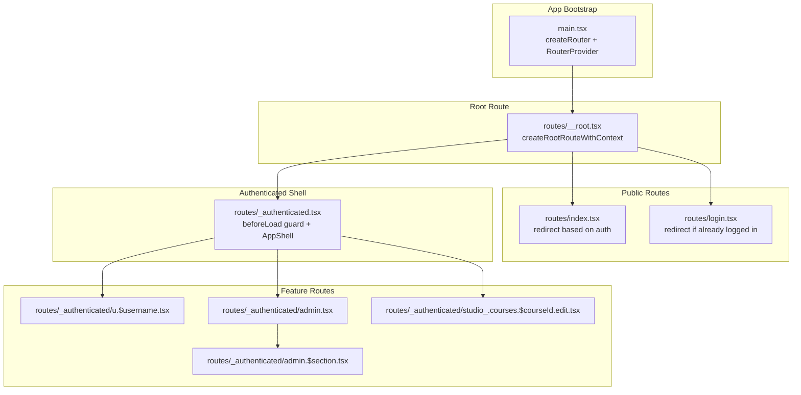
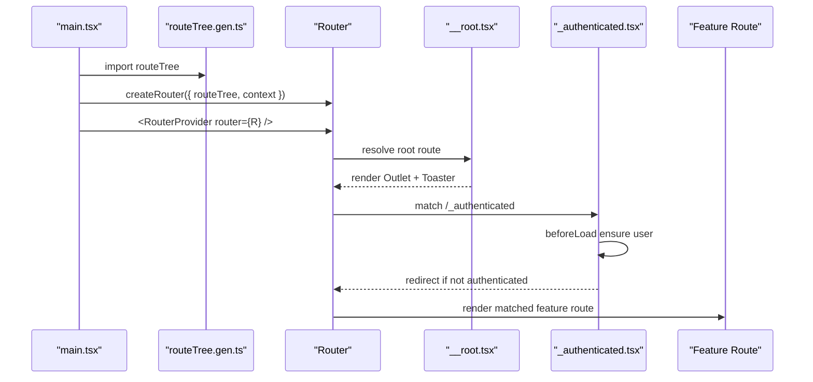
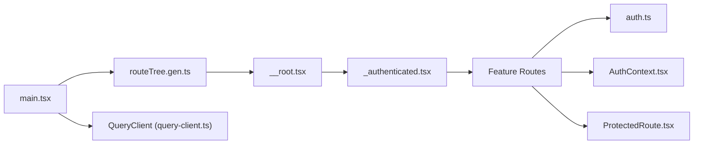

# Routing and Navigation

<cite>
**Referenced Files in This Document**
- [main.tsx](file://src/react-app/main.tsx)
- [routeTree.gen.ts](file://src/react-app/routeTree.gen.ts)
- [__root.tsx](file://src/react-app/routes/__root.tsx)
- [_authenticated.tsx](file://src/react-app/routes/_authenticated.tsx)
- [index.tsx](file://src/react-app/routes/index.tsx)
- [login.tsx](file://src/react-app/routes/login.tsx)
- [u.$username.tsx](file://src/react-app/routes/_authenticated/u.$username.tsx)
- [studio_.courses.$courseId.edit.tsx](file://src/react-app/routes/_authenticated/studio_.courses.$courseId.edit.tsx)
- [admin.tsx](file://src/react-app/routes/_authenticated/admin.tsx)
- [admin.$section.tsx](file://src/react-app/routes/_authenticated/admin.$section.tsx)
- [ProtectedRoute.tsx](file://src/react-app/components/ProtectedRoute.tsx)
- [AuthContext.tsx](file://src/react-app/context/AuthContext.tsx)
- [auth.ts](file://src/react-app/lib/auth.ts)
- [query-client.ts](file://src/react-app/lib/query-client.ts)
</cite>

## Table of Contents
1. [Introduction](#introduction)
2. [Project Structure](#project-structure)
3. [Core Components](#core-components)
4. [Architecture Overview](#architecture-overview)
5. [Detailed Component Analysis](#detailed-component-analysis)
6. [Dependency Analysis](#dependency-analysis)
7. [Performance Considerations](#performance-considerations)
8. [Troubleshooting Guide](#troubleshooting-guide)
9. [Conclusion](#conclusion)
10. [Appendices](#appendices)

## Introduction
This document explains the TanStack Router-based routing system used in the application. It covers file-based routing, nested routes, route parameters, authentication guards, middleware-like behavior via beforeLoad, route tree generation, lazy loading strategies, code splitting, navigation patterns, programmatic routing, URL parameter handling, query parameters, search state management, route-based data fetching with loaders, error boundaries, and common scenarios such as user profiles, content details, and admin sections.

## Project Structure
The routing is implemented using TanStack Router’s file-based conventions under src/react-app/routes. A generated route tree maps files to typed routes and paths. The root route provides global UI and context injection. Authentication is enforced at a parent route level, while specific routes enforce additional role checks.

**Diagram sources**
- [main.tsx:12-17](file://src/react-app/main.tsx#L12-L17)
- [__root.tsx:10-12](file://src/react-app/routes/__root.tsx#L10-L12)
- [index.tsx:4-13](file://src/react-app/routes/index.tsx#L4-L13)
- [login.tsx:5-16](file://src/react-app/routes/login.tsx#L5-L16)
- [_authenticated.tsx:5-19](file://src/react-app/routes/_authenticated.tsx#L5-L19)
- [u.$username.tsx:4-11](file://src/react-app/routes/_authenticated/u.$username.tsx#L4-L11)
- [admin.tsx:3-8](file://src/react-app/routes/_authenticated/admin.tsx#L3-L8)
- [admin.$section.tsx:6-13](file://src/react-app/routes/_authenticated/admin.$section.tsx#L6-L13)
- [studio_.courses.$courseId.edit.tsx:4-11](file://src/react-app/routes/_authenticated/studio_.courses.$courseId.edit.tsx#L4-L11)

**Section sources**
- [main.tsx:12-17](file://src/react-app/main.tsx#L12-L17)
- [routeTree.gen.ts:11-50](file://src/react-app/routeTree.gen.ts#L11-L50)
- [__root.tsx:10-12](file://src/react-app/routes/__root.tsx#L10-L12)

## Core Components
- Router bootstrap: Creates the router instance with the generated route tree and injects a shared context (QueryClient).
- Root route: Provides global UI shell and dev tools; exposes context to all child routes.
- Authenticated shell: Enforces login by ensuring current user exists before rendering authenticated features.
- Public routes: Redirect based on authentication state to avoid redundant pages.
- Feature routes: Define nested routes with parameters and optional authorization checks.

Key responsibilities:
- File-to-route mapping and type safety are provided by the generated route tree.
- beforeLoad hooks implement route-level guards and preloading logic.
- Context injection enables consistent access to QueryClient across routes.

**Section sources**
- [main.tsx:12-17](file://src/react-app/main.tsx#L12-L17)
- [__root.tsx:10-12](file://src/react-app/routes/__root.tsx#L10-L12)
- [_authenticated.tsx:5-19](file://src/react-app/routes/_authenticated.tsx#L5-L19)
- [index.tsx:4-13](file://src/react-app/routes/index.tsx#L4-L13)
- [login.tsx:5-16](file://src/react-app/routes/login.tsx#L5-L16)

## Architecture Overview
TanStack Router composes routes from files into a typed tree. The router is instantiated once and mounted via RouterProvider. Global providers wrap the router to supply React Query and theme context.

**Diagram sources**
- [main.tsx:12-17](file://src/react-app/main.tsx#L12-L17)
- [routeTree.gen.ts:11-50](file://src/react-app/routeTree.gen.ts#L11-L50)
- [__root.tsx:10-12](file://src/react-app/routes/__root.tsx#L10-L12)
- [_authenticated.tsx:5-19](file://src/react-app/routes/_authenticated.tsx#L5-L19)

## Detailed Component Analysis

### Router Bootstrap and Context
- The router is created with the generated route tree and a context object containing the QueryClient instance.
- The Register module augments TypeScript types for the router context.

Implementation highlights:
- Router creation and mounting.
- Context injection for data fetching and caching.

**Section sources**
- [main.tsx:12-17](file://src/react-app/main.tsx#L12-L17)
- [query-client.ts:3-13](file://src/react-app/lib/query-client.ts#L3-L13)

### Root Route
- Defines the root route with a context type that includes the QueryClient.
- Renders an Outlet for nested routes and global UI elements like toast notifications and React Query Devtools.

**Section sources**
- [__root.tsx:6-12](file://src/react-app/routes/__root.tsx#L6-L12)

### Public Routes and Redirection
- Root index redirects to feed if authenticated or to login otherwise.
- Login page redirects to feed if the user is already authenticated.

Behavior:
- Uses ensureQueryData to fetch current user before deciding redirection.
- Throws redirect to prevent rendering unnecessary components.

**Section sources**
- [index.tsx:4-13](file://src/react-app/routes/index.tsx#L4-L13)
- [login.tsx:5-16](file://src/react-app/routes/login.tsx#L5-L16)
- [auth.ts:29-34](file://src/react-app/lib/auth.ts#L29-L34)

### Authenticated Shell and Guard
- The _authenticated route ensures a valid user session before allowing access to protected areas.
- If no user is found, it redirects to login with replace semantics.
- Returns user data through context for downstream use.

Guard pattern:
- beforeLoad acts as middleware to validate authentication state.
- Consistent protection across all nested authenticated routes.

**Section sources**
- [_authenticated.tsx:5-19](file://src/react-app/routes/_authenticated.tsx#L5-L19)
- [auth.ts:29-34](file://src/react-app/lib/auth.ts#L29-L34)

### Nested Routes and Parameters
- User profile route uses a dynamic segment $username to load a profile page.
- Course edit route demonstrates nested segments with multiple parameters.

Parameter usage:
- Route.useParams() extracts typed parameters within component functions.
- Parent-child relationships are defined by file naming conventions.

**Section sources**
- [u.$username.tsx:4-11](file://src/react-app/routes/_authenticated/u.$username.tsx#L4-L11)
- [studio_.courses.$courseId.edit.tsx:4-11](file://src/react-app/routes/_authenticated/studio_.courses.$courseId.edit.tsx#L4-L11)

### Admin Section Authorization
- Admin route enforces adminRole presence; unauthorized users are redirected.
- Admin section route validates allowed sections and restricts sensitive sections to owners.

Authorization flow:
- beforeLoad checks context.user.adminRole and params.section against allowed set.
- Throws notFound for invalid sections or redirects for insufficient privileges.

**Section sources**
- [admin.tsx:3-8](file://src/react-app/routes/_authenticated/admin.tsx#L3-L8)
- [admin.$section.tsx:6-13](file://src/react-app/routes/_authenticated/admin.$section.tsx#L6-L13)

### Route Tree Generation and Type Safety
- The generated route tree maps file paths to typed route objects and fullPaths.
- Exposes interfaces for full path lookup, id lookup, and type-safe navigation helpers.

Benefits:
- Compile-time validation of route paths and parameters.
- Centralized source of truth for route structure.

**Section sources**
- [routeTree.gen.ts:267-343](file://src/react-app/routeTree.gen.ts#L267-L343)
- [routeTree.gen.ts:344-504](file://src/react-app/routeTree.gen.ts#L344-L504)

### ProtectedRoute Component (Component-Level Guard)
- A reusable component that checks authentication state via context and navigates to login when needed.
- Useful for protecting arbitrary component trees without route-level guards.

Use cases:
- Wrapping sections inside pages where route-level guards are not applicable.
- Providing consistent loading states during authentication checks.

**Section sources**
- [ProtectedRoute.tsx:6-18](file://src/react-app/components/ProtectedRoute.tsx#L6-L18)
- [AuthContext.tsx:23-83](file://src/react-app/context/AuthContext.tsx#L23-L83)

### Data Fetching and Loaders
- Routes use beforeLoad to preload data via QueryClient.ensureQueryData.
- The authMeQueryOptions centralizes current user fetching configuration.
- Pages can use useQuery and useMutation for feature-specific data operations.

Patterns:
- Preload critical data at route boundaries to avoid waterfalls.
- Leverage React Query caching and invalidation for consistency.

**Section sources**
- [_authenticated.tsx:6-16](file://src/react-app/routes/_authenticated.tsx#L6-L16)
- [auth.ts:29-34](file://src/react-app/lib/auth.ts#L29-L34)

### Error Boundaries and Not Found Handling
- Admin section route throws notFound for invalid sections.
- General error handling can be implemented via route-level error components or global error boundaries.

Recommendations:
- Use notFound to trigger 404 UI consistently.
- Implement error components per route or globally for graceful degradation.

**Section sources**
- [admin.$section.tsx:6-13](file://src/react-app/routes/_authenticated/admin.$section.tsx#L6-L13)

## Dependency Analysis
The routing layer depends on React Query for data fetching and caching, and on context providers for shared state. Route guards rely on the same auth queries to determine access.

**Diagram sources**
- [main.tsx:12-17](file://src/react-app/main.tsx#L12-L17)
- [routeTree.gen.ts:11-50](file://src/react-app/routeTree.gen.ts#L11-L50)
- [__root.tsx:10-12](file://src/react-app/routes/__root.tsx#L10-L12)
- [_authenticated.tsx:5-19](file://src/react-app/routes/_authenticated.tsx#L5-L19)
- [auth.ts:29-34](file://src/react-app/lib/auth.ts#L29-L34)
- [AuthContext.tsx:23-83](file://src/react-app/context/AuthContext.tsx#L23-L83)
- [ProtectedRoute.tsx:6-18](file://src/react-app/components/ProtectedRoute.tsx#L6-L18)

**Section sources**
- [main.tsx:12-17](file://src/react-app/main.tsx#L12-L17)
- [routeTree.gen.ts:11-50](file://src/react-app/routeTree.gen.ts#L11-L50)

## Performance Considerations
- Lazy loading: TanStack Router supports route-level code splitting; ensure each route file is small and only imports necessary dependencies.
- Data prefetching: Use beforeLoad to preload essential data and reduce perceived latency.
- Caching: Configure QueryClient defaults to minimize unnecessary refetches and retries.
- Avoid heavy computations in route components; defer to background tasks or memoization.

[No sources needed since this section provides general guidance]

## Troubleshooting Guide
Common issues and resolutions:
- Redirect loops: Ensure beforeLoad conditions do not conflict; verify authentication state and redirect targets.
- Missing parameters: Validate route params with notFound or default values to handle edge cases.
- Unauthorized access: Confirm that _authenticated guard runs before feature routes and that context.user is available.
- Data inconsistencies: Invalidate relevant queries after mutations to keep cache in sync.

Practical tips:
- Use console logs or React Query Devtools to inspect route transitions and data states.
- Wrap risky operations in try/catch and surface errors via toast notifications.

**Section sources**
- [_authenticated.tsx:5-19](file://src/react-app/routes/_authenticated.tsx#L5-L19)
- [admin.$section.tsx:6-13](file://src/react-app/routes/_authenticated/admin.$section.tsx#L6-L13)
- [query-client.ts:3-13](file://src/react-app/lib/query-client.ts#L3-L13)

## Conclusion
The routing system leverages TanStack Router’s file-based conventions to provide a scalable, type-safe, and maintainable navigation architecture. Authentication and authorization are enforced at route boundaries using beforeLoad, while React Query powers efficient data fetching and caching. The generated route tree ensures compile-time correctness and simplifies navigation across complex nested structures.

[No sources needed since this section summarizes without analyzing specific files]

## Appendices

### Common Scenarios

#### User Profiles
- Route: /u/$username
- Parameter extraction via Route.useParams()
- Data fetching via React Query hooks in the page component

**Section sources**
- [u.$username.tsx:4-11](file://src/react-app/routes/_authenticated/u.$username.tsx#L4-L11)

#### Content Details
- Example: /u/$username/article/$slug, /u/$username/course/$slug
- Multiple dynamic segments enable flexible content addressing
- Use Route.useParams() to extract both username and slug

**Section sources**
- [routeTree.gen.ts:212-253](file://src/react-app/routeTree.gen.ts#L212-L253)

#### Admin Sections
- Route: /admin/$section with strict validation of allowed sections
- Role-based access control prevents unauthorized access to sensitive sections

**Section sources**
- [admin.$section.tsx:6-13](file://src/react-app/routes/_authenticated/admin.$section.tsx#L6-L13)

### Navigation Patterns and Programmatic Routing
- Use Link for declarative navigation within components.
- Use Navigate for conditional redirection in response to user actions or state changes.
- For programmatic navigation outside components, leverage router APIs exposed by TanStack Router.

Best practices:
- Prefer typed navigation helpers derived from the route tree to avoid path typos.
- Combine with search state for filtering and pagination.

[No sources needed since this section provides general guidance]

### URL Parameters and Search State Management
- Dynamic segments capture path parameters (e.g., $username, $slug).
- Search state can be managed via React Query keys and local state for filters.
- Keep URLs predictable and shareable by encoding important state in query strings when appropriate.

[No sources needed since this section provides general guidance]

### Route-Based Data Fetching and Error Boundaries
- Use beforeLoad to preload data and handle early exits.
- Implement notFound for invalid resource identifiers.
- Provide fallback UI for loading and error states within components.

**Section sources**
- [_authenticated.tsx:6-16](file://src/react-app/routes/_authenticated.tsx#L6-L16)
- [admin.$section.tsx:6-13](file://src/react-app/routes/_authenticated/admin.$section.tsx#L6-L13)