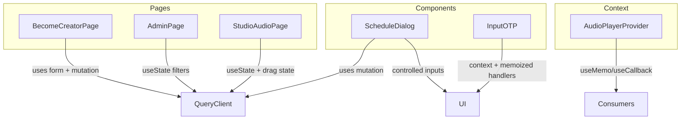
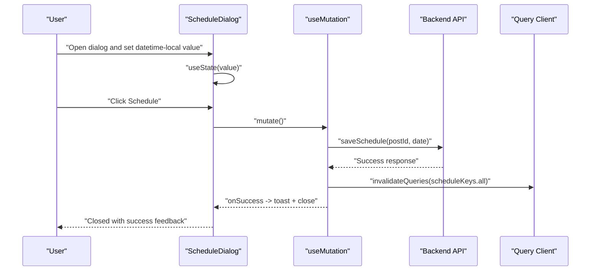
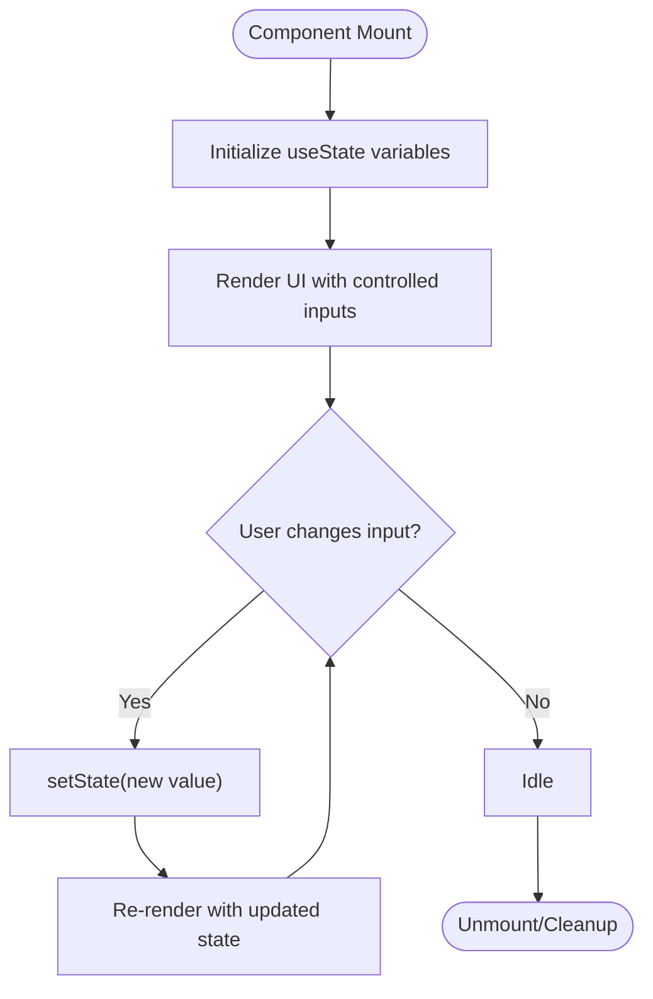
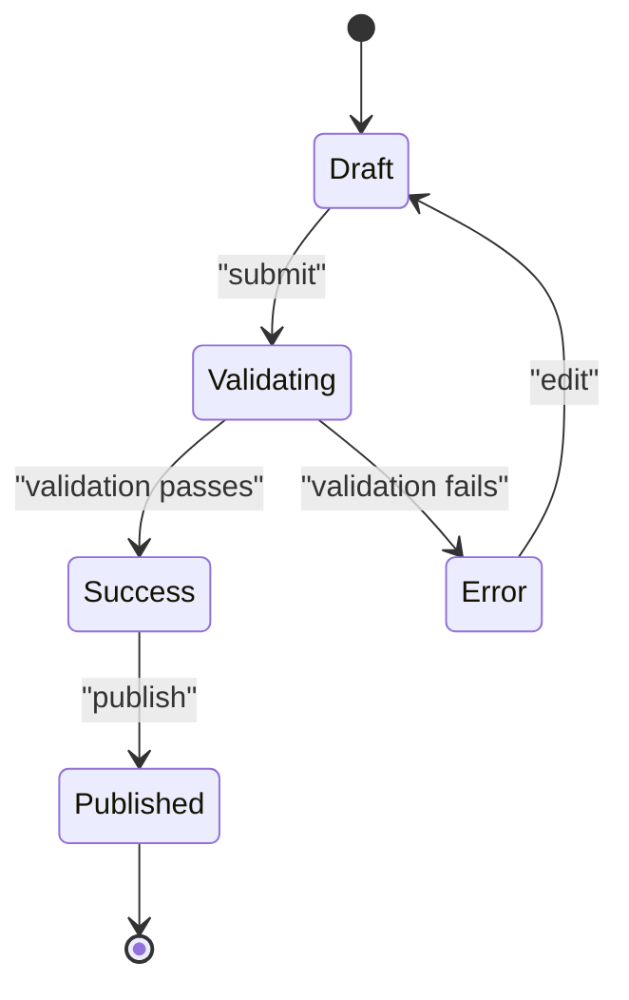
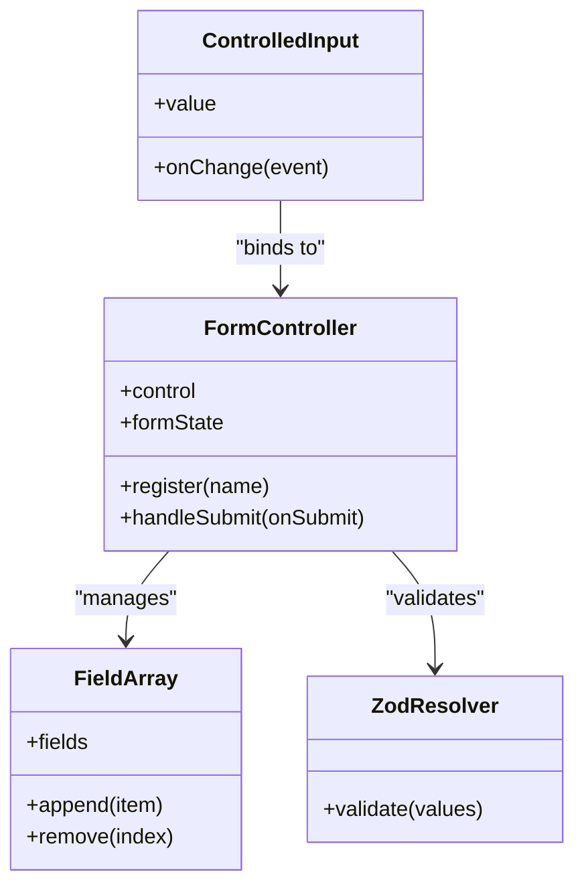
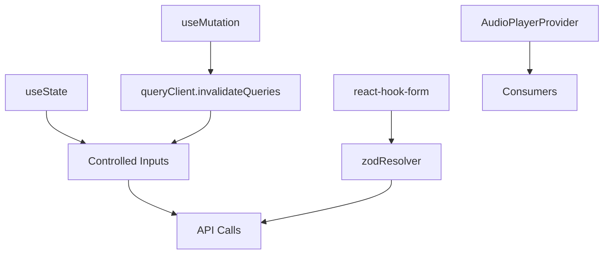

# Local Component State

<cite>
**Referenced Files in This Document**
- [ScheduleDialog.tsx](file://src/react-app/components/ScheduleDialog.tsx)
- [AudioPlayerContext.tsx](file://src/react-app/context/AudioPlayerContext.tsx)
- [BecomeCreatorPage.tsx](file://src/react-app/pages/BecomeCreatorPage.tsx)
- [AdminPage.tsx](file://src/react-app/pages/AdminPage.tsx)
- [StudioAudioPage.tsx](file://src/react-app/pages/StudioAudioPage.tsx)
- [input-otp.tsx](file://src/react-app/components/ui/input-otp.tsx)
</cite>

## Table of Contents
1. [Introduction](#introduction)
2. [Project Structure](#project-structure)
3. [Core Components](#core-components)
4. [Architecture Overview](#architecture-overview)
5. [Detailed Component Analysis](#detailed-component-analysis)
6. [Dependency Analysis](#dependency-analysis)
7. [Performance Considerations](#performance-considerations)
8. [Troubleshooting Guide](#troubleshooting-guide)
9. [Conclusion](#conclusion)

## Introduction
This document explains local component state management patterns using React hooks as implemented in the codebase. It focuses on:
- useState for form fields, UI toggles, and temporary data
- useReducer for complex state transitions (conceptual guidance with examples from the codebase)
- Controlled components and validation patterns
- Performance optimization with useMemo and useCallback
- Side effects with useEffect and cleanup patterns
- Patterns for lifting state up when needed
- Notes on persistence and hydration where applicable

The goal is to make these patterns accessible to both new and experienced developers while grounding explanations in actual source files.

## Project Structure
Local state lives primarily within components and small provider contexts:
- Dialogs and forms manage their own input state and submission flow
- A global audio player context manages shared playback state across the app
- Pages combine multiple pieces of local state for filtering, pagination, and interactions



[No sources needed since this diagram shows conceptual workflow, not actual code structure]

## Core Components
Key patterns demonstrated in the codebase:
- useState for simple, localized state such as dialog values, toggles, and filter parameters
- Controlled inputs bound to state via onChange and value props
- Form handling with react-hook-form and zod validation
- useMutation for side effects tied to user actions
- Context-based state sharing with AudioPlayerProvider
- Memoization and callbacks for performance

**Section sources**
- [ScheduleDialog.tsx:1-108](file://src/react-app/components/ScheduleDialog.tsx#L1-L108)
- [AudioPlayerContext.tsx:1-361](file://src/react-app/context/AudioPlayerContext.tsx#L1-L361)
- [BecomeCreatorPage.tsx:1-438](file://src/react-app/pages/BecomeCreatorPage.tsx#L1-L438)
- [AdminPage.tsx:361-800](file://src/react-app/pages/AdminPage.tsx#L361-L800)
- [StudioAudioPage.tsx:364-413](file://src/react-app/pages/StudioAudioPage.tsx#L364-L413)
- [input-otp.tsx:1-40](file://src/react-app/components/ui/input-otp.tsx#L1-L40)

## Architecture Overview
The application uses a combination of local state and query-driven data:
- Local state drives immediate UI feedback and transient interactions
- Queries and mutations handle server synchronization and caching
- Context provides cross-component state for media playback



**Diagram sources**
- [ScheduleDialog.tsx:54-77](file://src/react-app/components/ScheduleDialog.tsx#L54-L77)

**Section sources**
- [ScheduleDialog.tsx:54-77](file://src/react-app/components/ScheduleDialog.tsx#L54-L77)

## Detailed Component Analysis

### useState for Form State, UI Toggles, and Temporary Data
Patterns:
- Single boolean toggle for UI state
- Multiple independent string or number states for filters
- Controlled inputs bound to state via value and onChange
- Resetting or initializing state based on external data

Examples:
- Dialog scheduling time stored in useState and used as controlled input value
- Admin page filters managed with separate useState variables for page, search, status, role, admin flags
- Become Creator page uses a boolean flag to track already applied state



**Diagram sources**
- [ScheduleDialog.tsx:54-61](file://src/react-app/components/ScheduleDialog.tsx#L54-L61)
- [AdminPage.tsx:361-405](file://src/react-app/pages/AdminPage.tsx#L361-L405)
- [AdminPage.tsx:719-800](file://src/react-app/pages/AdminPage.tsx#L719-L800)
- [BecomeCreatorPage.tsx:26-31](file://src/react-app/pages/BecomeCreatorPage.tsx#L26-L31)

**Section sources**
- [ScheduleDialog.tsx:54-61](file://src/react-app/components/ScheduleDialog.tsx#L54-L61)
- [AdminPage.tsx:361-405](file://src/react-app/pages/AdminPage.tsx#L361-L405)
- [AdminPage.tsx:719-800](file://src/react-app/pages/AdminPage.tsx#L719-L800)
- [BecomeCreatorPage.tsx:26-31](file://src/react-app/pages/BecomeCreatorPage.tsx#L26-L31)

### useReducer for Complex State Logic
While the codebase predominantly uses useState and react-hook-form, useReducer is suitable for complex state machines with many related fields and transitions. The following conceptual example illustrates how you might model a multi-step wizard or a rich editor state:



[No sources needed since this diagram shows conceptual workflow, not actual code structure]

Guidance:
- Use useReducer when state logic involves multiple sub-values and complex transitions
- Keep action creators pure and explicit about state shape changes
- Prefer splitting reducers into smaller units if state grows large

### Controlled Components and Validation
Patterns:
- Controlled inputs bind value and onChange to state
- react-hook-form centralizes validation with zod schema
- Field arrays manage dynamic lists of inputs
- Errors are surfaced near inputs via formState.errors

Examples:
- Become Creator Page uses react-hook-form with zod resolver for validation and field arrays for social/content links
- Studio Audio Page binds select and file inputs to form fields
- InputOTP component maintains internal state and exposes memoized handlers through context



**Diagram sources**
- [BecomeCreatorPage.tsx:32-44](file://src/react-app/pages/BecomeCreatorPage.tsx#L32-L44)
- [StudioAudioPage.tsx:516-566](file://src/react-app/pages/StudioAudioPage.tsx#L516-L566)
- [input-otp.tsx:122-172](file://src/react-app/components/ui/input-otp.tsx#L122-L172)

**Section sources**
- [BecomeCreatorPage.tsx:32-44](file://src/react-app/pages/BecomeCreatorPage.tsx#L32-L44)
- [StudioAudioPage.tsx:516-566](file://src/react-app/pages/StudioAudioPage.tsx#L516-L566)
- [input-otp.tsx:122-172](file://src/react-app/components/ui/input-otp.tsx#L122-L172)

### Context-Based State Sharing (Audio Player)
The AudioPlayerProvider demonstrates:
- useState for queue, index, playing state, playback details, volume, and derived theme
- useRef for DOM access to the audio element
- useCallback for stable handlers like playItem, toggle, seek, setVolume, move
- useMemo for deriving current item and exposing a stable context value
- useEffect to sync volume and control playback based on state changes

```mermaid
classDiagram
class AudioPlayerProvider {
-queue : AudioItemSummary[]
-index : number
-isPlaying : boolean
-playback : { itemId, currentTime, duration }
-volume : number
-coverTheme : PlayerTheme
+playItem(item, queue?)
+toggle()
+seek(values)
+setVolume(values)
+move(direction)
+close()
}
class AudioElement {
+currentTime : number
+duration : number
+volume : number
+play()
+pause()
}
AudioPlayerProvider --> AudioElement : "controls via ref"
```

**Diagram sources**
- [AudioPlayerContext.tsx:135-242](file://src/react-app/context/AudioPlayerContext.tsx#L135-L242)

**Section sources**
- [AudioPlayerContext.tsx:135-242](file://src/react-app/context/AudioPlayerContext.tsx#L135-L242)

### Lifting State Up Patterns
When multiple sibling components need shared state, lift it to a common parent or context:
- In StudioAudioPage, local items state is updated during drag operations and passed down to child rows
- In AdminPage, filter state is kept at the page level and consumed by table panels
- For dialogs like ScheduleDialog, open/close and values are controlled by parent props and local state

Recommendations:
- Keep state as close to consumers as possible
- Lift only what is necessary to avoid unnecessary re-renders
- Use memoization to prevent prop churn

**Section sources**
- [StudioAudioPage.tsx:364-372](file://src/react-app/pages/StudioAudioPage.tsx#L364-L372)
- [AdminPage.tsx:361-405](file://src/react-app/pages/AdminPage.tsx#L361-L405)
- [ScheduleDialog.tsx:16-39](file://src/react-app/components/ScheduleDialog.tsx#L16-L39)

### State Normalization Techniques
Normalization helps keep derived data consistent and efficient:
- Maintain a single source of truth for IDs and references
- Derive display names and labels from normalized records
- Avoid duplicating nested objects; store IDs and look up details when needed

Conceptual approach:
- Store entities in a flat map keyed by ID
- Reference entities by ID in collections
- Compute derived views on demand

[No sources needed since this section provides general guidance]

### Side Effects and Cleanup
Common patterns:
- useEffect to synchronize DOM/audio state with React state
- Cleanup functions to remove event listeners or abort requests
- Conditional execution based on dependencies

Examples:
- AudioPlayerProvider sets audio.volume and controls playback via useEffect
- InputOTP updates focus and value through memoized handlers

**Section sources**
- [AudioPlayerContext.tsx:197-211](file://src/react-app/context/AudioPlayerContext.tsx#L197-L211)
- [input-otp.tsx:122-172](file://src/react-app/components/ui/input-otp.tsx#L122-L172)

## Dependency Analysis
Local state interacts with queries and mutations:
- useState drives UI state and filters
- useMutation handles side effects and invalidates caches
- Context shares state across components without prop drilling



**Diagram sources**
- [ScheduleDialog.tsx:62-77](file://src/react-app/components/ScheduleDialog.tsx#L62-L77)
- [BecomeCreatorPage.tsx:90-95](file://src/react-app/pages/BecomeCreatorPage.tsx#L90-L95)
- [AudioPlayerContext.tsx:235-242](file://src/react-app/context/AudioPlayerContext.tsx#L235-L242)

**Section sources**
- [ScheduleDialog.tsx:62-77](file://src/react-app/components/ScheduleDialog.tsx#L62-L77)
- [BecomeCreatorPage.tsx:90-95](file://src/react-app/pages/BecomeCreatorPage.tsx#L90-L95)
- [AudioPlayerContext.tsx:235-242](file://src/react-app/context/AudioPlayerContext.tsx#L235-L242)

## Performance Considerations
Optimization techniques observed and recommended:
- useMemo for expensive computations and derived values
- useCallback for stable function references to avoid unnecessary re-renders
- Controlled inputs with minimal state updates
- Avoiding heavy work inside render paths

Examples:
- AudioPlayerProvider uses useMemo to compute context value and useCallback for handlers
- InputOTP uses useMemo to create a stable context object and useCallback for update handlers
- StudioAudioPage computes styles with useMemo for transform and transition

**Section sources**
- [AudioPlayerContext.tsx:235-242](file://src/react-app/context/AudioPlayerContext.tsx#L235-L242)
- [input-otp.tsx:136-172](file://src/react-app/components/ui/input-otp.tsx#L136-L172)
- [StudioAudioPage.tsx:412-413](file://src/react-app/pages/StudioAudioPage.tsx#L412-L413)

## Troubleshooting Guide
Common issues and resolutions:
- Uncontrolled vs controlled inputs: ensure value and onChange are consistently bound
- Validation errors: check zod schema and formState.errors
- Mutation failures: inspect error responses and invalidate caches appropriately
- Audio playback: verify streamUrl availability and handle autoplay restrictions

Checklist:
- Confirm all inputs are controlled
- Validate schemas match expected payloads
- Handle network errors gracefully with user feedback
- Ensure cleanup of side effects (e.g., pause audio on unmount)

**Section sources**
- [BecomeCreatorPage.tsx:115-128](file://src/react-app/pages/BecomeCreatorPage.tsx#L115-L128)
- [ScheduleDialog.tsx:68-77](file://src/react-app/components/ScheduleDialog.tsx#L68-L77)
- [AudioPlayerContext.tsx:203-211](file://src/react-app/context/AudioPlayerContext.tsx#L203-L211)

## Conclusion
The codebase demonstrates robust local state management using useState, controlled components, and react-hook-form with zod validation. Context-based state sharing via AudioPlayerProvider showcases effective use of useMemo and useCallback for performance. These patterns provide a solid foundation for building responsive, maintainable interfaces while keeping state localized and predictable.

[No sources needed since this section summarizes without analyzing specific files]