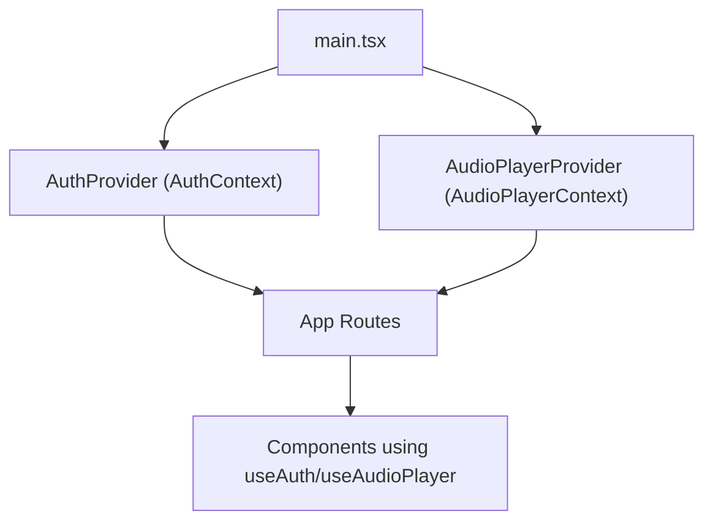
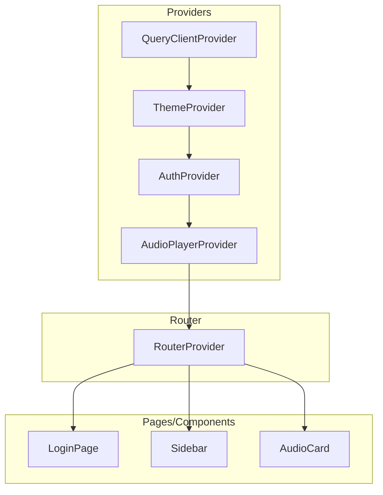
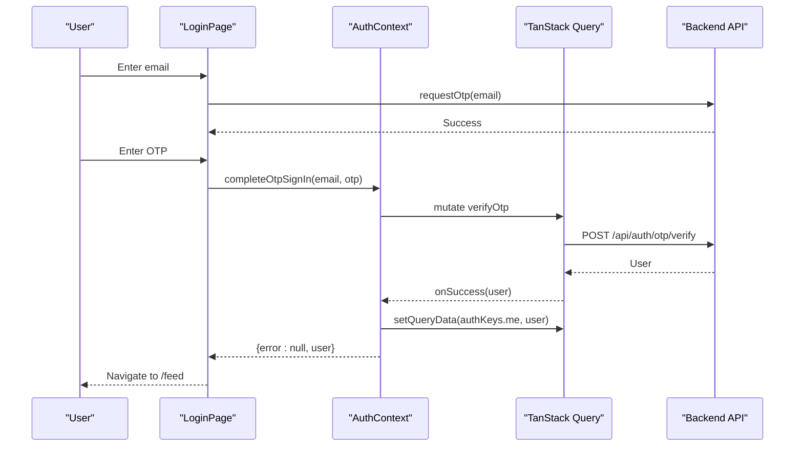
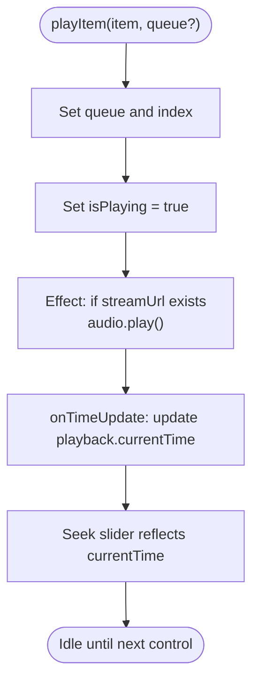
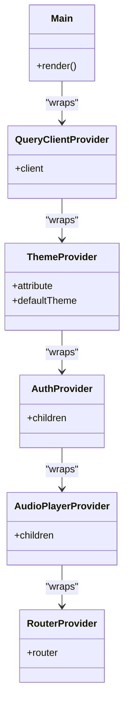
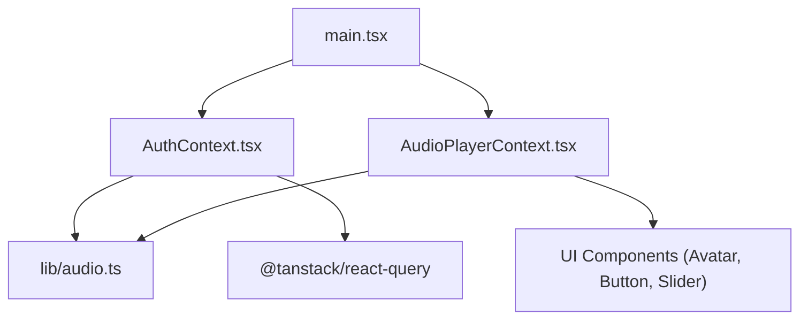

# React Context State

<cite>
**Referenced Files in This Document**
- [AuthContext.tsx](file://src/react-app/context/AuthContext.tsx)
- [AudioPlayerContext.tsx](file://src/react-app/context/AudioPlayerContext.tsx)
- [auth.ts](file://src/react-app/lib/auth.ts)
- [audio.ts](file://src/react-app/lib/audio.ts)
- [main.tsx](file://src/react-app/main.tsx)
- [LoginPage.tsx](file://src/react-app/pages/LoginPage.tsx)
- [Sidebar.tsx](file://src/react-app/components/Sidebar.tsx)
- [AudioCard.tsx](file://src/react-app/components/AudioCard.tsx)
</cite>

## Table of Contents
1. [Introduction](#introduction)
2. [Project Structure](#project-structure)
3. [Core Components](#core-components)
4. [Architecture Overview](#architecture-overview)
5. [Detailed Component Analysis](#detailed-component-analysis)
6. [Dependency Analysis](#dependency-analysis)
7. [Performance Considerations](#performance-considerations)
8. [Troubleshooting Guide](#troubleshooting-guide)
9. [Conclusion](#conclusion)

## Introduction
This document explains the React Context implementation in the Zenith application, focusing on two primary contexts:
- AuthContext for authentication state management, including user session handling, OTP verification flow, and logout functionality.
- AudioPlayerContext for media playback state management, covering audio player controls, queue management, and cross-component audio state synchronization.

It also documents context value structures, provider composition patterns, custom hooks usage (useAuth, useAudioPlayer), error handling strategies, loading states, initialization patterns, and performance considerations such as memoization techniques to prevent unnecessary re-renders.

## Project Structure
The application initializes providers at the root level to share global state across components. The main entry point composes QueryClientProvider, ThemeProvider, AuthProvider, and AudioPlayerProvider around the router.

**Diagram sources**
- [main.tsx:25-37](file://src/react-app/main.tsx#L25-L37)

**Section sources**
- [main.tsx:25-37](file://src/react-app/main.tsx#L25-L37)

## Core Components
- AuthContext provides current user data, loading state, OTP sign-in completion, logout, and refresh capabilities. It integrates with TanStack Query to manage the authenticated user and invalidate related queries on logout or unauthorized events.
- AudioPlayerContext manages a single HTMLAudioElement instance, playback queue, current item index, play/pause state, volume, seek position, and derived UI theme based on cover art colors. It exposes methods to play items, toggle playback, close the player, and navigate the queue.

Key responsibilities:
- AuthContext:
  - Fetches and caches the current user via TanStack Query.
  - Handles OTP verification mutation and updates cache on success.
  - Clears cache and removes related queries on logout.
  - Subscribes to window events to clear auth state on unauthorized or account-suspended signals.
- AudioPlayerContext:
  - Maintains queue, index, isPlaying, playback metadata, and volume.
  - Derives currentItem, currentTime, duration, and theme from state.
  - Synchronizes audio element lifecycle with React state via effects.
  - Computes dynamic theme from cover image color using canvas sampling.

**Section sources**
- [AuthContext.tsx:1-90](file://src/react-app/context/AuthContext.tsx#L1-L90)
- [AudioPlayerContext.tsx:1-361](file://src/react-app/context/AudioPlayerContext.tsx#L1-L361)

## Architecture Overview
The application uses a layered architecture where providers wrap the routing layer, enabling deep access to shared state without prop drilling.

**Diagram sources**
- [main.tsx:25-37](file://src/react-app/main.tsx#L25-L37)

## Detailed Component Analysis

### AuthContext Analysis
AuthContext encapsulates authentication logic and integrates with TanStack Query for caching and mutations.

- Context value structure:
  - currentUser: User object or null.
  - isLoading: boolean indicating pending query state.
  - completeOtpSignIn(email, otp): Promise returning an object with error and user fields.
  - logout(): Promise that clears auth state and invalidates relevant queries.
  - refreshCurrentUser(): Invalidates the current user query.

- Provider behavior:
  - Uses useQuery to fetch current user with retry disabled and stale time set.
  - Uses useMutation for OTP verification; on success, sets user into cache key for current user.
  - Uses useMutation for logout; on success, clears current user and removes feed/profile queries.
  - Subscribes to window events to clear auth state when unauthorized or account-suspended.

- Custom hook:
  - useAuth returns the context value and throws if used outside provider.

- Integration points:
  - LoginPage uses completeOtpSignIn to finalize OTP-based sign-in and navigates upon success.
  - Sidebar calls logout to terminate session and update navigation.

**Diagram sources**
- [AuthContext.tsx:26-39](file://src/react-app/context/AuthContext.tsx#L26-L39)
- [auth.ts:36-46](file://src/react-app/lib/auth.ts#L36-L46)
- [LoginPage.tsx:34-51](file://src/react-app/pages/LoginPage.tsx#L34-L51)

**Section sources**
- [AuthContext.tsx:1-90](file://src/react-app/context/AuthContext.tsx#L1-L90)
- [auth.ts:1-55](file://src/react-app/lib/auth.ts#L1-L55)
- [LoginPage.tsx:20-51](file://src/react-app/pages/LoginPage.tsx#L20-L51)
- [Sidebar.tsx:36-81](file://src/react-app/components/Sidebar.tsx#L36-L81)

### AudioPlayerContext Analysis
AudioPlayerContext centralizes audio playback state and UI, ensuring consistent behavior across components.

- Context value structure:
  - currentItem: Current AudioItemSummary or null.
  - isPlaying: boolean.
  - queue: Array of AudioItemSummary.
  - playItem(item, queue?): Start playback with optional queue override.
  - toggle(): Toggle play/pause.
  - close(): Pause and reset queue/index.

- Internal state:
  - queue, index, isPlaying, playback (itemId, currentTime, duration), volume, coverTheme.
  - Derived values: currentItem, currentTime, duration, playerTheme.

- Effects and lifecycle:
  - Volume applied to audio element when changed.
  - Play/pause triggered by isPlaying and streamUrl changes.
  - Cover image sampled to compute theme; fallback theme applied on errors.

- UI integration:
  - Renders a fixed bottom bar with avatar, title, controls (previous, play/pause, next), seek slider, volume slider, and close button.
  - Uses formatAudioDuration utility for time formatting.

**Diagram sources**
- [AudioPlayerContext.tsx:150-168](file://src/react-app/context/AudioPlayerContext.tsx#L150-L168)
- [AudioPlayerContext.tsx:197-211](file://src/react-app/context/AudioPlayerContext.tsx#L197-L211)
- [AudioPlayerContext.tsx:251-267](file://src/react-app/context/AudioPlayerContext.tsx#L251-L267)

**Section sources**
- [AudioPlayerContext.tsx:1-361](file://src/react-app/context/AudioPlayerContext.tsx#L1-L361)
- [audio.ts:149-155](file://src/react-app/lib/audio.ts#L149-L155)

### Provider Composition Patterns
Providers are composed at the app root to ensure all routes and components have access to shared state.

- Composition order:
  - QueryClientProvider wraps the entire app for data fetching.
  - ThemeProvider applies theme context.
  - AuthProvider enables authentication state.
  - AudioPlayerProvider enables media playback state.
  - RouterProvider renders routes within these contexts.

**Diagram sources**
- [main.tsx:25-37](file://src/react-app/main.tsx#L25-L37)

**Section sources**
- [main.tsx:25-37](file://src/react-app/main.tsx#L25-L37)

### Custom Hooks Usage
- useAuth:
  - Consumed by pages and components to access currentUser, isLoading, completeOtpSignIn, logout, and refreshCurrentUser.
  - Throws if used outside AuthProvider.

- useAudioPlayer:
  - Consumed by components like AudioCard to trigger playback, toggle, and close actions.
  - Throws if used outside AudioPlayerProvider.

Usage examples:
- LoginPage calls completeOtpSignIn to finalize OTP sign-in.
- Sidebar calls logout to terminate session.
- AudioCard calls playItem to start playback with optional queue.

**Section sources**
- [AuthContext.tsx:85-89](file://src/react-app/context/AuthContext.tsx#L85-L89)
- [AudioPlayerContext.tsx:129-133](file://src/react-app/context/AudioPlayerContext.tsx#L129-L133)
- [LoginPage.tsx:20-51](file://src/react-app/pages/LoginPage.tsx#L20-L51)
- [Sidebar.tsx:36-81](file://src/react-app/components/Sidebar.tsx#L36-L81)
- [AudioCard.tsx:21-80](file://src/react-app/components/AudioCard.tsx#L21-L80)

## Dependency Analysis
Contexts depend on libraries and utilities for data fetching, types, and formatting.

**Diagram sources**
- [AuthContext.tsx:1-10](file://src/react-app/context/AuthContext.tsx#L1-L10)
- [AudioPlayerContext.tsx:1-8](file://src/react-app/context/AudioPlayerContext.tsx#L1-L8)
- [main.tsx:7-10](file://src/react-app/main.tsx#L7-L10)

**Section sources**
- [AuthContext.tsx:1-10](file://src/react-app/context/AuthContext.tsx#L1-L10)
- [AudioPlayerContext.tsx:1-8](file://src/react-app/context/AudioPlayerContext.tsx#L1-L8)
- [auth.ts:1-55](file://src/react-app/lib/auth.ts#L1-L55)
- [audio.ts:1-155](file://src/react-app/lib/audio.ts#L1-L155)

## Performance Considerations
- Memoization:
  - AudioPlayerContext uses useMemo to construct the context value, minimizing re-renders by stabilizing the reference unless dependencies change.
  - useCallback is used for handlers like playItem, toggle, close, seek, setVolume, and move to avoid recreating functions on each render.

- Selector patterns:
  - While not implemented here, consumers can subscribe to specific parts of context values to reduce re-renders. For example, components only needing isPlaying could be wrapped with a selector pattern.

- Query caching:
  - AuthContext leverages TanStack Query with staleTime and retry settings to optimize network requests and reduce unnecessary refetches.

- Avoiding heavy computations:
  - Cover image color extraction is performed only when coverUrl changes, and errors fall back to a default theme to prevent blocking.

[No sources needed since this section provides general guidance]

## Troubleshooting Guide
Common issues and resolutions:
- useAuth used outside provider:
  - Ensure components are rendered within AuthProvider.
  - Check provider composition in main.tsx.

- useAudioPlayer used outside provider:
  - Ensure components are rendered within AudioPlayerProvider.
  - Verify provider composition in main.tsx.

- OTP verification fails:
  - Inspect error returned by completeOtpSignIn and handle appropriately in UI.
  - Confirm backend availability and OTP validity.

- Logout does not clear state:
  - Verify logout mutation succeeds and clears authKeys.me.
  - Check window event listeners for unauthorized/account-suspended.

- Audio playback not starting:
  - Ensure currentItem.streamUrl is available.
  - Check browser autoplay policies and user interaction requirements.

**Section sources**
- [AuthContext.tsx:85-89](file://src/react-app/context/AuthContext.tsx#L85-L89)
- [AudioPlayerContext.tsx:129-133](file://src/react-app/context/AudioPlayerContext.tsx#L129-L133)
- [LoginPage.tsx:44-51](file://src/react-app/pages/LoginPage.tsx#L44-L51)
- [AuthContext.tsx:41-49](file://src/react-app/context/AuthContext.tsx#L41-L49)
- [AudioPlayerContext.tsx:203-211](file://src/react-app/context/AudioPlayerContext.tsx#L203-L211)

## Conclusion
The Zenith application employs React Context to manage global authentication and audio playback states effectively. AuthContext integrates with TanStack Query for robust session management, while AudioPlayerContext centralizes media playback logic and UI. Provider composition at the app root ensures seamless access to shared state. Memoization and careful effect management contribute to performance. Following the documented patterns and troubleshooting steps will help maintain a reliable and responsive user experience.