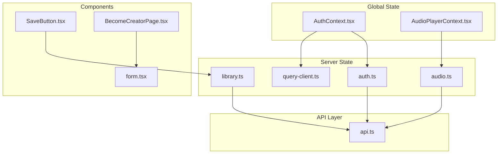
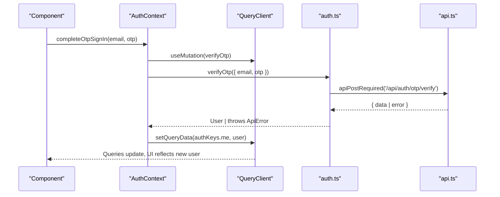
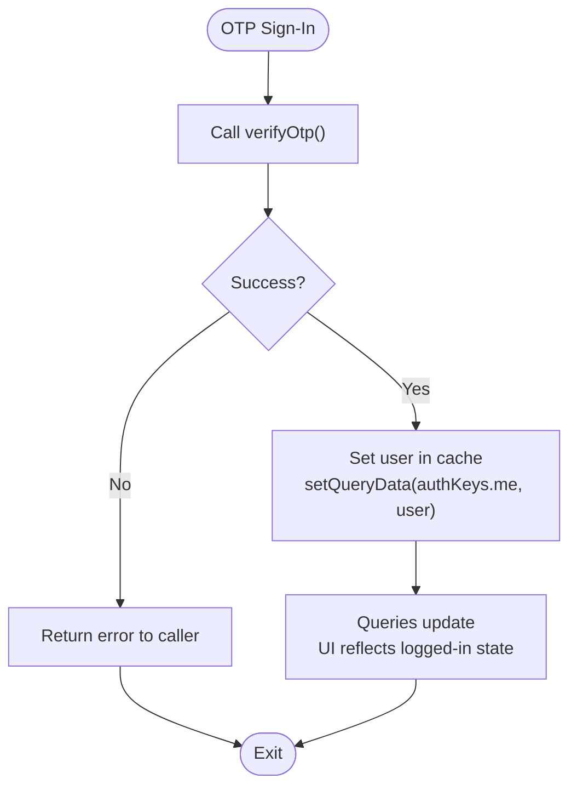
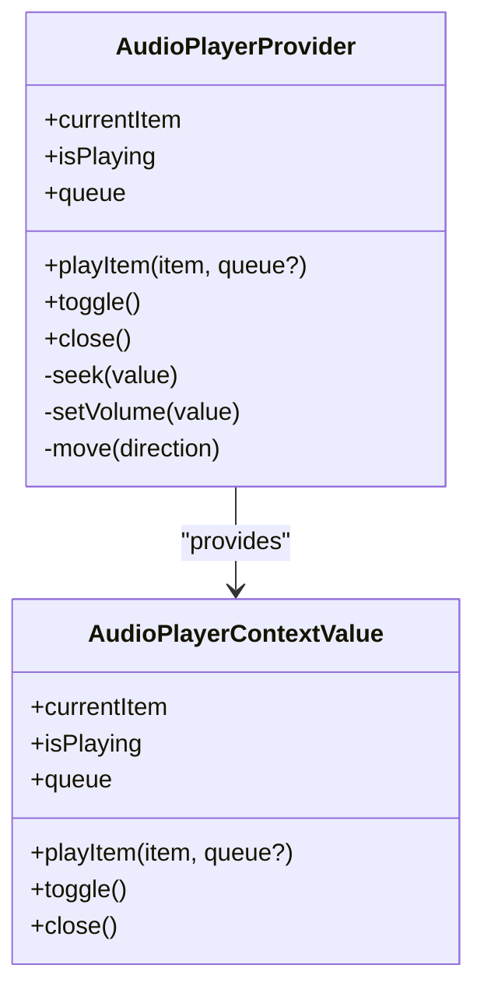
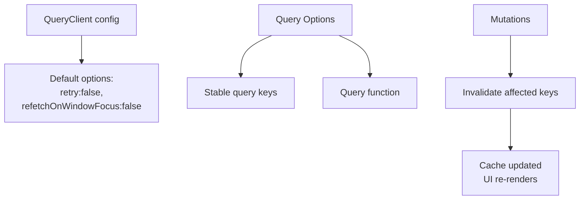
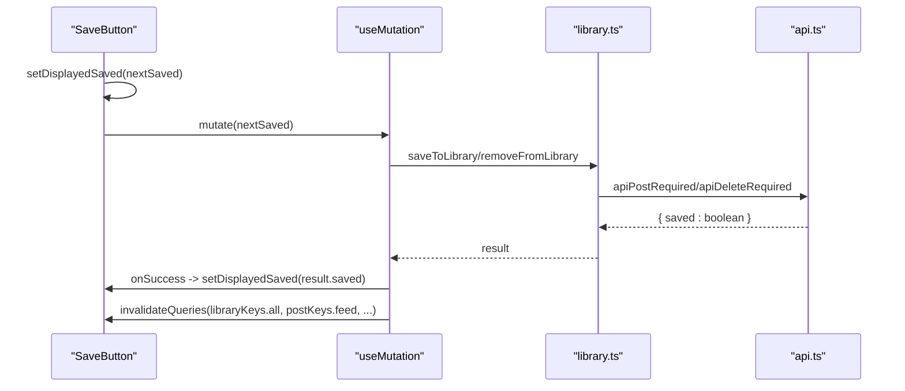
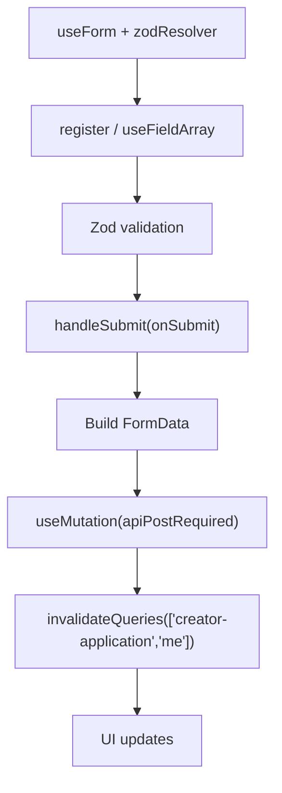
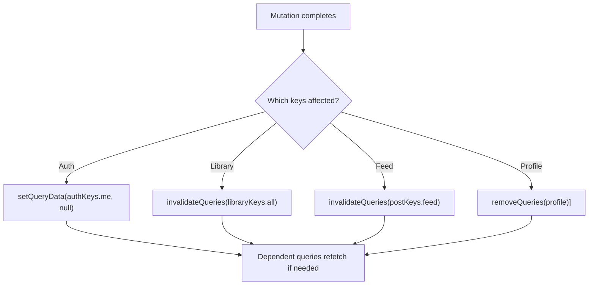
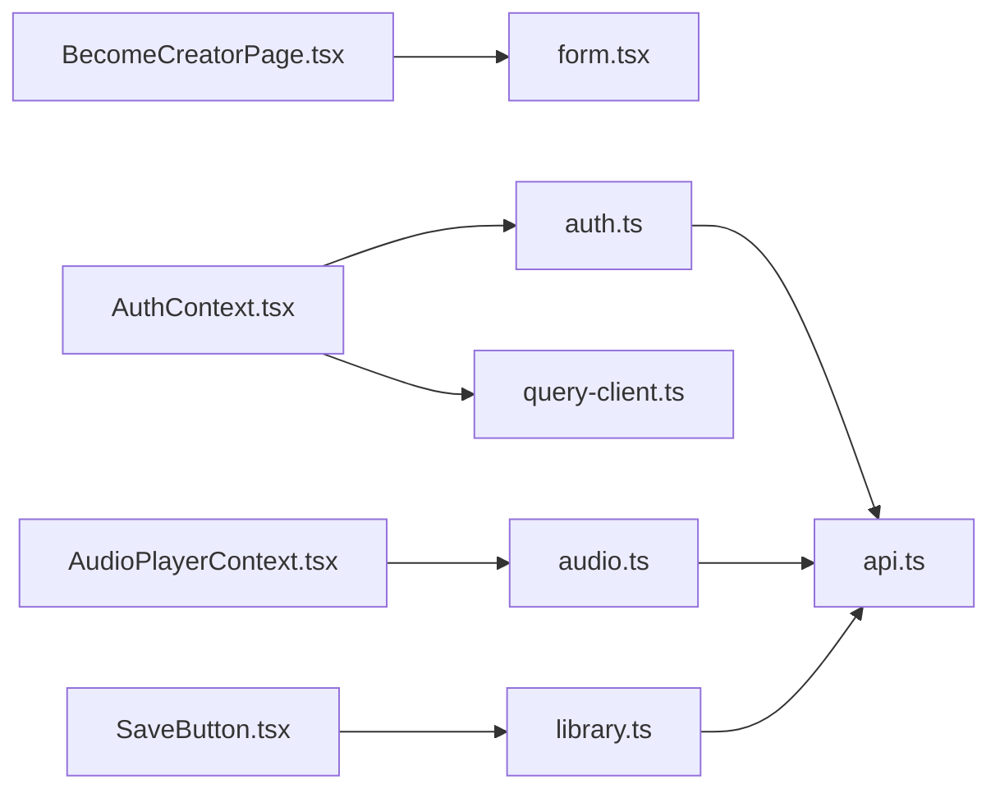

# State Management

<cite>
**Referenced Files in This Document**
- [query-client.ts](file://src/react-app/lib/query-client.ts)
- [AuthContext.tsx](file://src/react-app/context/AuthContext.tsx)
- [AudioPlayerContext.tsx](file://src/react-app/context/AudioPlayerContext.tsx)
- [auth.ts](file://src/react-app/lib/auth.ts)
- [api.ts](file://src/react-app/lib/api.ts)
- [audio.ts](file://src/react-app/lib/audio.ts)
- [library.ts](file://src/react-app/lib/library.ts)
- [SaveButton.tsx](file://src/react-app/components/SaveButton.tsx)
- [form.tsx](file://src/react-app/components/ui/form.tsx)
- [BecomeCreatorPage.tsx](file://src/react-app/pages/BecomeCreatorPage.tsx)
</cite>

## Table of Contents
1. Introduction
2. Project Structure
3. Core Components
4. Architecture Overview
5. Detailed Component Analysis
6. Dependency Analysis
7. Performance Considerations
8. Troubleshooting Guide
9. Conclusion

## Introduction
This document explains the state management patterns used in the React application, focusing on:
- Global UI and session state via React Context (authentication and audio playback)
- Server state management with TanStack Query, including caching, invalidation, and optimistic updates
- Local component state using useState and useReducer patterns
- Form state handling with react-hook-form and zod validation
- Persistence strategies for local storage and hydration
- Performance optimizations such as memoization, selective re-renders, and normalized data structures

## Project Structure
State-related code is organized into focused layers:
- Context providers for global UI/session state live under src/react-app/context
- Server state configuration and query keys live under src/react-app/lib
- API utilities and error normalization live under src/react-app/lib/api.ts
- Feature-specific pages and components consume contexts and queries

**Diagram sources**
- [query-client.ts:1-14](file://src/react-app/lib/query-client.ts#L1-L14)
- [AuthContext.tsx:1-90](file://src/react-app/context/AuthContext.tsx#L1-L90)
- [AudioPlayerContext.tsx:1-361](file://src/react-app/context/AudioPlayerContext.tsx#L1-L361)
- [auth.ts:1-55](file://src/react-app/lib/auth.ts#L1-L55)
- [audio.ts:1-155](file://src/react-app/lib/audio.ts#L1-L155)
- [library.ts:1-70](file://src/react-app/lib/library.ts#L1-L70)
- [api.ts:1-164](file://src/react-app/lib/api.ts#L1-L164)
- [SaveButton.tsx:1-81](file://src/react-app/components/SaveButton.tsx#L1-L81)
- [form.tsx:1-156](file://src/react-app/components/ui/form.tsx#L1-L156)
- [BecomeCreatorPage.tsx:1-195](file://src/react-app/pages/BecomeCreatorPage.tsx#L1-L195)

**Section sources**
- [query-client.ts:1-14](file://src/react-app/lib/query-client.ts#L1-L14)
- [AuthContext.tsx:1-90](file://src/react-app/context/AuthContext.tsx#L1-L90)
- [AudioPlayerContext.tsx:1-361](file://src/react-app/context/AudioPlayerContext.tsx#L1-L361)
- [auth.ts:1-55](file://src/react-app/lib/auth.ts#L1-L55)
- [api.ts:1-164](file://src/react-app/lib/api.ts#L1-L164)
- [audio.ts:1-155](file://src/react-app/lib/audio.ts#L1-L155)
- [library.ts:1-70](file://src/react-app/lib/library.ts#L1-L70)
- [SaveButton.tsx:1-81](file://src/react-app/components/SaveButton.tsx#L1-L81)
- [form.tsx:1-156](file://src/react-app/components/ui/form.tsx#L1-L156)
- [BecomeCreatorPage.tsx:1-195](file://src/react-app/pages/BecomeCreatorPage.tsx#L1-L195)

## Core Components
- AuthContext: Provides current user, loading state, OTP sign-in, logout, and refresh flows. Integrates with TanStack Query to manage the authenticated user cache and clears related caches on logout or unauthorized events.
- AudioPlayerContext: Manages media playback state (queue, index, play/pause, seek, volume), derives theme from cover art colors, and renders a persistent player UI. Uses refs for DOM access and effects to synchronize with the HTMLAudioElement.
- Query Client: Central TanStack Query configuration with retry disabled and refetch policies tuned for this app’s needs.
- API Layer: Normalizes responses and errors, dispatches custom window events for auth state changes, and provides typed helpers for GET/POST/PUT/PATCH/DELETE.

Key responsibilities:
- Global UI/session state: AuthContext, AudioPlayerContext
- Server state: TanStack Query with queryOptions and mutation hooks
- Data fetching and error normalization: api.ts
- Domain query keys and options: auth.ts, audio.ts, library.ts

**Section sources**
- [AuthContext.tsx:1-90](file://src/react-app/context/AuthContext.tsx#L1-L90)
- [AudioPlayerContext.tsx:1-361](file://src/react-app/context/AudioPlayerContext.tsx#L1-L361)
- [query-client.ts:1-14](file://src/react-app/lib/query-client.ts#L1-L14)
- [api.ts:1-164](file://src/react-app/lib/api.ts#L1-L164)
- [auth.ts:1-55](file://src/react-app/lib/auth.ts#L1-L55)
- [audio.ts:1-155](file://src/react-app/lib/audio.ts#L1-L155)
- [library.ts:1-70](file://src/react-app/lib/library.ts#L1-L70)

## Architecture Overview
The application separates concerns across three layers:
- Global context layer for cross-cutting UI/session state
- Server state layer via TanStack Query for caching and synchronization
- API layer for HTTP requests and error normalization

**Diagram sources**
- [AuthContext.tsx:23-39](file://src/react-app/context/AuthContext.tsx#L23-L39)
- [auth.ts:36-46](file://src/react-app/lib/auth.ts#L36-L46)
- [api.ts:136-145](file://src/react-app/lib/api.ts#L136-L145)

**Section sources**
- [AuthContext.tsx:1-90](file://src/react-app/context/AuthContext.tsx#L1-L90)
- [auth.ts:1-55](file://src/react-app/lib/auth.ts#L1-L55)
- [api.ts:1-164](file://src/react-app/lib/api.ts#L1-L164)

## Detailed Component Analysis

### Authentication State with AuthContext
AuthContext encapsulates authentication lifecycle:
- Reads current user via TanStack Query using authMeQueryOptions
- Completes OTP sign-in via mutation and sets user in cache
- Logs out by calling server endpoint and clearing relevant caches
- Listens to unauthorized/account-suspended events to reset user state
- Exposes refreshCurrentUser to invalidate and refetch user data

**Diagram sources**
- [AuthContext.tsx:26-31](file://src/react-app/context/AuthContext.tsx#L26-L31)
- [auth.ts:40-42](file://src/react-app/lib/auth.ts#L40-L42)

**Section sources**
- [AuthContext.tsx:1-90](file://src/react-app/context/AuthContext.tsx#L1-L90)
- [auth.ts:1-55](file://src/react-app/lib/auth.ts#L1-L55)

### Media Playback State with AudioPlayerContext
AudioPlayerContext manages:
- Queue and current item index
- Play/pause toggle and playback controls
- Seek and volume updates synchronized with an HTMLAudioElement
- Dynamic theme derived from cover image color
- A persistent player UI rendered within the provider

**Diagram sources**
- [AudioPlayerContext.tsx:129-133](file://src/react-app/context/AudioPlayerContext.tsx#L129-L133)
- [AudioPlayerContext.tsx:135-242](file://src/react-app/context/AudioPlayerContext.tsx#L135-L242)

**Section sources**
- [AudioPlayerContext.tsx:1-361](file://src/react-app/context/AudioPlayerContext.tsx#L1-L361)

### TanStack Query Configuration and Caching Strategy
The QueryClient is configured with:
- No automatic retries for queries and mutations
- Disabled refetchOnWindowFocus to avoid unnecessary network calls
- Stale time and retry settings per query where applicable (e.g., auth me query has staleTime)

Caching strategy highlights:
- Use queryOptions to define stable query keys and functions
- Invalidate specific keys after mutations to keep UI consistent
- Use placeholderData keepPreviousData for smooth pagination transitions

**Diagram sources**
- [query-client.ts:1-14](file://src/react-app/lib/query-client.ts#L1-L14)
- [auth.ts:29-34](file://src/react-app/lib/auth.ts#L29-L34)
- [library.ts:48-61](file://src/react-app/lib/library.ts#L48-L61)

**Section sources**
- [query-client.ts:1-14](file://src/react-app/lib/query-client.ts#L1-L14)
- [auth.ts:1-55](file://src/react-app/lib/auth.ts#L1-L55)
- [library.ts:1-70](file://src/react-app/lib/library.ts#L1-L70)

### Optimistic Updates Pattern
Optimistic updates are implemented at the component level:
- SaveButton toggles displayedSaved immediately before sending the mutation
- On success, it persists the change and invalidates relevant queries
- On error, it rolls back to the previous saved state and shows a toast

**Diagram sources**
- [SaveButton.tsx:37-58](file://src/react-app/components/SaveButton.tsx#L37-L58)
- [library.ts:63-69](file://src/react-app/lib/library.ts#L63-L69)
- [api.ts:136-163](file://src/react-app/lib/api.ts#L136-L163)

**Section sources**
- [SaveButton.tsx:1-81](file://src/react-app/components/SaveButton.tsx#L1-L81)
- [library.ts:1-70](file://src/react-app/lib/library.ts#L1-L70)
- [api.ts:1-164](file://src/react-app/lib/api.ts#L1-L164)

### Form State Handling
Forms are built with react-hook-form and zod validation:
- useForm initializes form state and integrates with zod resolver
- useFieldArray manages dynamic arrays (socialLinks, contentLinks)
- Form fields are wrapped with controlled UI components (FormField, FormControl, FormMessage)
- Submit handlers build FormData and trigger mutations, then invalidate queries

**Diagram sources**
- [BecomeCreatorPage.tsx:32-44](file://src/react-app/pages/BecomeCreatorPage.tsx#L32-L44)
- [form.tsx:1-156](file://src/react-app/components/ui/form.tsx#L1-L156)

**Section sources**
- [BecomeCreatorPage.tsx:1-195](file://src/react-app/pages/BecomeCreatorPage.tsx#L1-L195)
- [form.tsx:1-156](file://src/react-app/components/ui/form.tsx#L1-L156)

### Data Synchronization and Cache Invalidation
Common invalidation patterns:
- After OTP verification, set user in cache and let dependent queries pick up the change
- After logout, clear user cache and remove feed/profile queries
- After saving/removing from library, invalidate library and feed lists
- After creator application submission, invalidate the application status query

**Diagram sources**
- [AuthContext.tsx:32-39](file://src/react-app/context/AuthContext.tsx#L32-L39)
- [SaveButton.tsx:46-53](file://src/react-app/components/SaveButton.tsx#L46-L53)
- [BecomeCreatorPage.tsx:90-95](file://src/react-app/pages/BecomeCreatorPage.tsx#L90-L95)

**Section sources**
- [AuthContext.tsx:1-90](file://src/react-app/context/AuthContext.tsx#L1-L90)
- [SaveButton.tsx:1-81](file://src/react-app/components/SaveButton.tsx#L1-L81)
- [BecomeCreatorPage.tsx:1-195](file://src/react-app/pages/BecomeCreatorPage.tsx#L1-L195)

### Local State Patterns with useState and useReducer
- useState is used for simple flags and values (e.g., alreadyApplied, displayedSaved, isPlaying)
- For complex state transitions, consider useReducer; while not present in the analyzed files, the pattern fits well for multi-step forms or complex queues
- Selective re-renders are achieved by passing stable callbacks via useCallback and deriving values with useMemo

Examples:
- SaveButton uses useState for displayedSaved and mutation state
- AudioPlayerContext uses multiple useState slices for queue, index, playback, volume, and theme

**Section sources**
- [SaveButton.tsx:37-58](file://src/react-app/components/SaveButton.tsx#L37-L58)
- [AudioPlayerContext.tsx:135-148](file://src/react-app/context/AudioPlayerContext.tsx#L135-L148)

### State Persistence and Hydration
- The API layer dispatches custom window events for unauthorized and account-suspended states, enabling global listeners to reset cached user state without persistence
- There is no explicit localStorage usage in the analyzed files; server sessions appear to be managed via cookies (credentials: include)
- Hydration strategy relies on initial query fetches (e.g., auth me) to populate state on mount

Recommendations:
- If client-side persistence is required (e.g., theme preferences), integrate localStorage with useEffect to sync with state
- Ensure sensitive data is not stored in localStorage; prefer server-managed sessions

**Section sources**
- [api.ts:61-82](file://src/react-app/lib/api.ts#L61-L82)
- [auth.ts:20-27](file://src/react-app/lib/auth.ts#L20-L27)

## Dependency Analysis
The following diagram shows how components and libraries depend on each other for state management:

**Diagram sources**
- [SaveButton.tsx:1-81](file://src/react-app/components/SaveButton.tsx#L1-L81)
- [library.ts:1-70](file://src/react-app/lib/library.ts#L1-L70)
- [BecomeCreatorPage.tsx:1-195](file://src/react-app/pages/BecomeCreatorPage.tsx#L1-L195)
- [form.tsx:1-156](file://src/react-app/components/ui/form.tsx#L1-L156)
- [AuthContext.tsx:1-90](file://src/react-app/context/AuthContext.tsx#L1-L90)
- [auth.ts:1-55](file://src/react-app/lib/auth.ts#L1-L55)
- [AudioPlayerContext.tsx:1-361](file://src/react-app/context/AudioPlayerContext.tsx#L1-L361)
- [audio.ts:1-155](file://src/react-app/lib/audio.ts#L1-L155)
- [api.ts:1-164](file://src/react-app/lib/api.ts#L1-L164)
- [query-client.ts:1-14](file://src/react-app/lib/query-client.ts#L1-L14)

**Section sources**
- [SaveButton.tsx:1-81](file://src/react-app/components/SaveButton.tsx#L1-L81)
- [library.ts:1-70](file://src/react-app/lib/library.ts#L1-L70)
- [BecomeCreatorPage.tsx:1-195](file://src/react-app/pages/BecomeCreatorPage.tsx#L1-L195)
- [form.tsx:1-156](file://src/react-app/components/ui/form.tsx#L1-L156)
- [AuthContext.tsx:1-90](file://src/react-app/context/AuthContext.tsx#L1-L90)
- [auth.ts:1-55](file://src/react-app/lib/auth.ts#L1-L55)
- [AudioPlayerContext.tsx:1-361](file://src/react-app/context/AudioPlayerContext.tsx#L1-L361)
- [audio.ts:1-155](file://src/react-app/lib/audio.ts#L1-L155)
- [api.ts:1-164](file://src/react-app/lib/api.ts#L1-L164)
- [query-client.ts:1-14](file://src/react-app/lib/query-client.ts#L1-L14)

## Performance Considerations
- Memoization:
  - Use useMemo for derived values (e.g., playerTheme, computed lists)
  - Use useCallback for event handlers passed to child components to prevent unnecessary re-renders
- Selective Re-renders:
  - Keep context values minimal; split large contexts when necessary
  - Prefer stable query keys to limit refetch scope
- State Normalization:
  - Store entities by ID in normalized structures to avoid duplication and simplify updates
- Query Tuning:
  - Configure staleTime and gcTime appropriately to balance freshness and performance
  - Use placeholderData keepPreviousData for smoother pagination transitions

[No sources needed since this section provides general guidance]

## Troubleshooting Guide
Common issues and resolutions:
- Unauthorized or suspended accounts:
  - The API layer dispatches 'unauthorized' and 'account-suspended' events; ensure global listeners clear user cache and redirect appropriately
- Mutation failures:
  - Implement onError handlers to roll back optimistic state and show user-friendly messages
- Form validation errors:
  - Ensure zod schemas match backend expectations; display field-level errors using FormMessage
- Audio playback issues:
  - Verify streamUrl availability and handle autoplay restrictions; catch play() promise rejections

**Section sources**
- [api.ts:61-82](file://src/react-app/lib/api.ts#L61-L82)
- [SaveButton.tsx:54-58](file://src/react-app/components/SaveButton.tsx#L54-L58)
- [form.tsx:127-144](file://src/react-app/components/ui/form.tsx#L127-L144)
- [AudioPlayerContext.tsx:203-211](file://src/react-app/context/AudioPlayerContext.tsx#L203-L211)

## Conclusion
The application employs a layered state management approach:
- React Context for global UI/session state (authentication and audio playback)
- TanStack Query for robust server state caching, synchronization, and optimistic updates
- Local state via useState/useReducer for component-level concerns
- Form state handled with react-hook-form and zod for reliable validation and submission flows
- API layer centralizes error handling and auth event signaling

Adhering to these patterns ensures predictable state updates, efficient re-renders, and a responsive user experience.