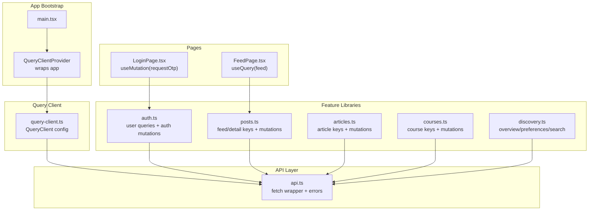
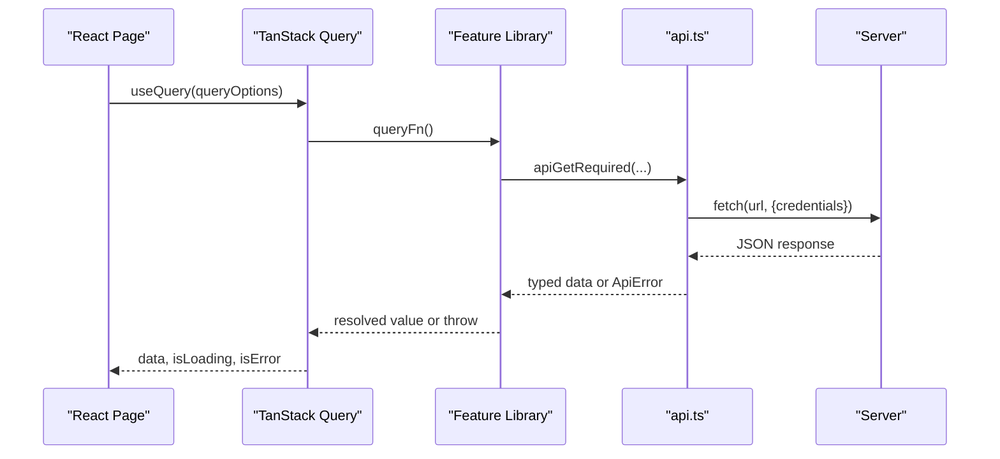
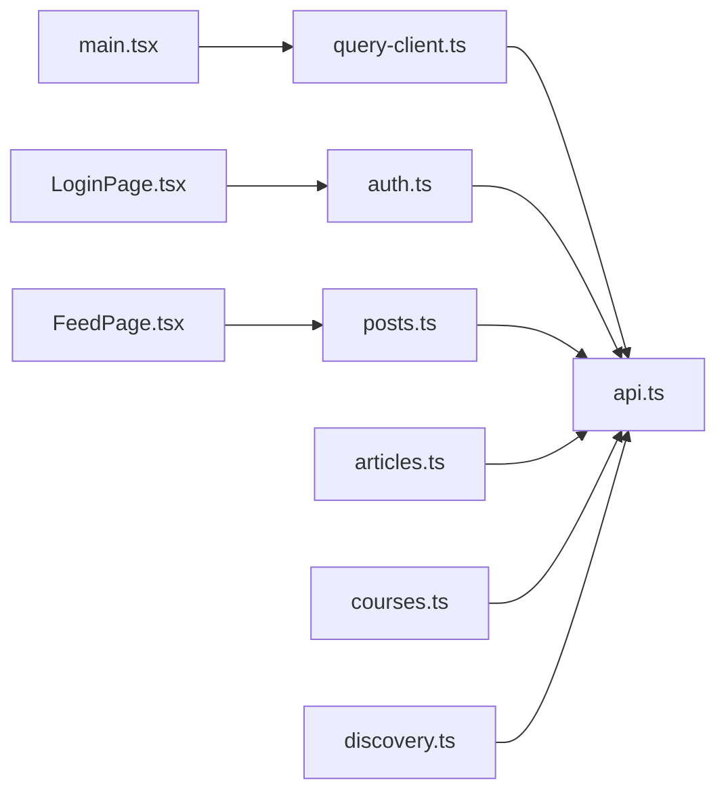

# TanStack Query Server State

<cite>
**Referenced Files in This Document**
- [query-client.ts](file://src/react-app/lib/query-client.ts)
- [main.tsx](file://src/react-app/main.tsx)
- [api.ts](file://src/react-app/lib/api.ts)
- [auth.ts](file://src/react-app/lib/auth.ts)
- [posts.ts](file://src/react-app/lib/posts.ts)
- [articles.ts](file://src/react-app/lib/articles.ts)
- [courses.ts](file://src/react-app/lib/courses.ts)
- [discovery.ts](file://src/react-app/lib/discovery.ts)
- [FeedPage.tsx](file://src/react-app/pages/FeedPage.tsx)
- [LoginPage.tsx](file://src/react-app/pages/LoginPage.tsx)
</cite>

## Table of Contents
1. [Introduction](#introduction)
2. [Project Structure](#project-structure)
3. [Core Components](#core-components)
4. [Architecture Overview](#architecture-overview)
5. [Detailed Component Analysis](#detailed-component-analysis)
6. [Dependency Analysis](#dependency-analysis)
7. [Performance Considerations](#performance-considerations)
8. [Troubleshooting Guide](#troubleshooting-guide)
9. [Conclusion](#conclusion)

## Introduction
This document explains how the application uses TanStack Query to manage server state. It covers query client configuration, cache behavior, retry policies, background refetch strategies, query key patterns, mutation functions, data synchronization between client and server, caching strategies (including stale-while-revalidate), optimistic updates, cache invalidation, error handling with retry logic, loading states, pagination patterns, authentication integration, request/response interceptors, custom hooks for common API operations, and performance optimizations such as deduplication, selective refetching, and memory management.

## Project Structure
TanStack Query is configured at the app root and consumed across feature modules via shared lib files that define typed query options and mutations. Pages consume these options and hooks to render UI and handle user interactions.

**Diagram sources**
- [main.tsx:1-38](file://src/react-app/main.tsx#L1-L38)
- [query-client.ts:1-14](file://src/react-app/lib/query-client.ts#L1-L14)
- [api.ts:1-164](file://src/react-app/lib/api.ts#L1-L164)
- [auth.ts:1-55](file://src/react-app/lib/auth.ts#L1-L55)
- [posts.ts:1-160](file://src/react-app/lib/posts.ts#L1-L160)
- [articles.ts:1-71](file://src/react-app/lib/articles.ts#L1-L71)
- [courses.ts:1-231](file://src/react-app/lib/courses.ts#L1-L231)
- [discovery.ts:1-99](file://src/react-app/lib/discovery.ts#L1-L99)
- [FeedPage.tsx:1-60](file://src/react-app/pages/FeedPage.tsx#L1-L60)
- [LoginPage.tsx:1-158](file://src/react-app/pages/LoginPage.tsx#L1-L158)

**Section sources**
- [main.tsx:1-38](file://src/react-app/main.tsx#L1-L38)
- [query-client.ts:1-14](file://src/react-app/lib/query-client.ts#L1-L14)

## Core Components
- QueryClient configuration: centralized defaults for retries and refetch triggers.
- API layer: a unified fetch wrapper with normalized error shapes and HTTP method helpers.
- Feature libraries: typed query options and mutation functions per domain (auth, posts, articles, courses, discovery).
- Pages: use TanStack Query hooks to read and write server state.

Key responsibilities:
- Centralized cache behavior and global defaults.
- Consistent error normalization and propagation.
- Stable query keys for deduplication and cache coherence.
- Clear separation between reads (queryOptions) and writes (mutations).

**Section sources**
- [query-client.ts:1-14](file://src/react-app/lib/query-client.ts#L1-L14)
- [api.ts:1-164](file://src/react-app/lib/api.ts#L1-L164)
- [auth.ts:1-55](file://src/react-app/lib/auth.ts#L1-L55)
- [posts.ts:1-160](file://src/react-app/lib/posts.ts#L1-L160)
- [articles.ts:1-71](file://src/react-app/lib/articles.ts#L1-L71)
- [courses.ts:1-231](file://src/react-app/lib/courses.ts#L1-L231)
- [discovery.ts:1-99](file://src/react-app/lib/discovery.ts#L1-L99)

## Architecture Overview
The application bootstraps a single QueryClient instance and provides it through React context. Feature modules define query options using stable keys and call into a typed API layer. Pages consume these options with useQuery and useMutation to interact with the server.

**Diagram sources**
- [FeedPage.tsx:1-60](file://src/react-app/pages/FeedPage.tsx#L1-L60)
- [posts.ts:1-160](file://src/react-app/lib/posts.ts#L1-L160)
- [api.ts:1-164](file://src/react-app/lib/api.ts#L1-L164)

## Detailed Component Analysis

### Query Client Configuration
- Global defaults disable automatic retries and window-focus refetches.
- Mutations also have retry disabled by default.
- The client is provided at the app root so all components share one cache.

Implications:
- No background refetch on window focus; explicit refetches are required when needed.
- Retries must be configured per-query or per-mutation if desired.
- Cache persistence and garbage collection rely on default behaviors unless customized.

**Section sources**
- [query-client.ts:1-14](file://src/react-app/lib/query-client.ts#L1-L14)
- [main.tsx:1-38](file://src/react-app/main.tsx#L1-L38)

### API Layer and Interceptors
- Unified fetch wrapper normalizes responses and errors into a consistent shape.
- Non-JSON responses and network failures are handled gracefully.
- Special events are dispatched for 401 and account-suspended statuses to support auth flows.
- Convenience methods exist for GET/POST/PUT/PATCH/DELETE and their “required” variants that throw on non-success.

Interception points:
- Authorization headers can be injected here for authenticated requests.
- Global error handling and analytics/logging can be added around the fetch call.
- Response transforms can be applied before returning data.

**Section sources**
- [api.ts:1-164](file://src/react-app/lib/api.ts#L1-L164)

### Authentication Flow and User Queries
- A dedicated query option fetches the current user with a short stale time.
- OTP-based sign-in uses mutations to request and verify codes.
- Logout and email change flows are exposed as mutations.

Data synchronization:
- After successful sign-in, invalidate user-related queries to refresh cached state.
- On logout, clear relevant cache entries to avoid stale user data.

**Section sources**
- [auth.ts:1-55](file://src/react-app/lib/auth.ts#L1-L55)
- [LoginPage.tsx:1-158](file://src/react-app/pages/LoginPage.tsx#L1-L158)

### Posts and Feed: Query Keys and Mutations
- Stable query keys for feed, post detail, replies, and drafts ensure deduplication and precise invalidation.
- Feed page consumes a query option and renders different card types based on item type.
- Mutations include creating posts/replies, liking/unliking, updating/deleting content, and voting on polls.

Caching strategy:
- Use staleTime to keep recent feed data fresh without immediate refetches.
- Invalidate feed or specific post keys after mutations to reflect changes.

**Section sources**
- [posts.ts:1-160](file://src/react-app/lib/posts.ts#L1-L160)
- [FeedPage.tsx:1-60](file://src/react-app/pages/FeedPage.tsx#L1-L60)

### Articles: Typed Options and Mutations
- Query keys for article detail and creator lists enable targeted cache updates.
- Mutations cover creation, updates, and publishing.

Optimization tips:
- Set appropriate staleTime for list vs detail views.
- Invalidate creator lists after publish/unpublish actions.

**Section sources**
- [articles.ts:1-71](file://src/react-app/lib/articles.ts#L1-L71)

### Courses: Complex Entities and Uploads
- Comprehensive keys for mine, detail, byId, and creator-scoped lists.
- Mutations for CRUD on courses, modules, lessons, attachments, and progress tracking.
- Multi-part upload flow with progress callbacks and cleanup on failure.

Cache considerations:
- Invalidate course lists after create/update/delete.
- Update lesson progress locally with optimistic updates where possible, then reconcile with server.

**Section sources**
- [courses.ts:1-231](file://src/react-app/lib/courses.ts#L1-L231)

### Discovery: Overview, Preferences, and Search
- Overview and preferences queries use longer stale times suitable for less-frequently changing data.
- Creator search supports pagination via input parameters encoded in the query key.

Pagination pattern:
- Include page and pageSize in the query key to maintain separate cache entries per page.
- Refetch only the affected page after mutations that impact results.

**Section sources**
- [discovery.ts:1-99](file://src/react-app/lib/discovery.ts#L1-L99)

### Query Key Patterns
- Domain-prefixed arrays with function factories for dynamic segments.
- Examples:
  - Auth: ["auth", "me"]
  - Posts: ["feed"], ["profile", username, "posts"], ["posts", username, slug], ["posts", postId, "replies"], ["posts", postId, "draft"]
  - Articles: ["articles", username, slug], ["articles", postId], ["profile", username, "articles"]
  - Courses: ["studio", "courses"], ["courses", username, slug], ["courses", courseId], ["profile", username, "courses"]
  - Discovery: ["discovery"], ["discovery", "overview"], ["discovery", "preferences"], ["discovery", "creators", input]

Benefits:
- Predictable cache keys enable precise invalidation.
- Function factories ensure consistent serialization and deduplication.

**Section sources**
- [auth.ts:1-55](file://src/react-app/lib/auth.ts#L1-L55)
- [posts.ts:1-160](file://src/react-app/lib/posts.ts#L1-L160)
- [articles.ts:1-71](file://src/react-app/lib/articles.ts#L1-L71)
- [courses.ts:1-231](file://src/react-app/lib/courses.ts#L1-L231)
- [discovery.ts:1-99](file://src/react-app/lib/discovery.ts#L1-L99)

### Mutation Functions and Data Synchronization
- Mutations encapsulate side effects and return typed promises.
- Typical synchronization steps:
  - Optimistically update local state (optional).
  - Execute mutation.
  - Invalidate dependent queries to refetch fresh data.
  - Handle errors and revert optimistic changes if necessary.

Examples:
- Like/unlike posts and replies update counts and viewerLiked flags.
- Create/update/delete posts, articles, courses, and related resources.
- Course attachment uploads with progress and cleanup.

**Section sources**
- [posts.ts:1-160](file://src/react-app/lib/posts.ts#L1-L160)
- [articles.ts:1-71](file://src/react-app/lib/articles.ts#L1-L71)
- [courses.ts:1-231](file://src/react-app/lib/courses.ts#L1-L231)

### Caching Strategies: Stale-While-Revalidate and Selective Refetch
- Stale-while-revalidate:
  - Serve cached data immediately while fetching an updated version in the background.
  - Configure staleTime per query to balance freshness and performance.
- Selective refetch:
  - Invalidate specific keys after mutations to trigger targeted refetches.
  - Avoid full-page refetches by scoping invalidation to relevant domains.

Practical guidance:
- Shorter staleTime for frequently changing data (e.g., feed).
- Longer staleTime for static or rarely updated data (e.g., discovery overview).

**Section sources**
- [auth.ts:1-55](file://src/react-app/lib/auth.ts#L1-L55)
- [discovery.ts:1-99](file://src/react-app/lib/discovery.ts#L1-L99)

### Optimistic Updates
- For fast UX, pre-update UI state before receiving server confirmation.
- Reconcile with server response; roll back on error.
- Suitable for simple toggles like likes and small edits.

Implementation pattern:
- Use useMutation’s onMutate callback to set optimistic values.
- Invalidate affected queries on success; rollback on error.

[No sources needed since this section describes general patterns]

### Cache Invalidation Techniques
- Invalidate by exact key after mutations that affect that resource.
- Invalidate parent keys to cascade updates (e.g., profile lists after editing a child resource).
- Combine with query filters to target multiple related keys efficiently.

[No sources needed since this section describes general patterns]

### Error Handling and Retry Logic
- Global defaults disable retries; configure per-query or per-mutation as needed.
- Normalize server errors into a consistent shape with status, code, and details.
- Dispatch browser events for special cases (e.g., unauthorized, account suspended) to centralize handling.

Best practices:
- Surface user-friendly messages from normalized errors.
- Implement retry only for idempotent operations or transient failures.

**Section sources**
- [api.ts:1-164](file://src/react-app/lib/api.ts#L1-L164)
- [query-client.ts:1-14](file://src/react-app/lib/query-client.ts#L1-L14)

### Loading States Management
- useQuery exposes isPending/isLoading to guard rendering until data arrives.
- Provide meaningful placeholders and error states in UI.
- Avoid skeleton overuse; show concise messages for empty states.

**Section sources**
- [FeedPage.tsx:1-60](file://src/react-app/pages/FeedPage.tsx#L1-L60)

### Pagination Patterns
- Encode pagination parameters (page, pageSize) in query keys to cache each page separately.
- Refetch only the impacted page after mutations affecting list contents.
- Use enabled flags to conditionally fetch when dependencies are ready.

**Section sources**
- [discovery.ts:1-99](file://src/react-app/lib/discovery.ts#L1-L99)

### Integration with Authentication Flows
- Fetch current user with a short-lived staleTime to keep session info fresh.
- On login success, invalidate user queries and navigate to protected routes.
- On logout, clear relevant cache entries and redirect to public pages.
- Intercept 401 responses to trigger re-authentication flows.

**Section sources**
- [auth.ts:1-55](file://src/react-app/lib/auth.ts#L1-L55)
- [LoginPage.tsx:1-158](file://src/react-app/pages/LoginPage.tsx#L1-L158)
- [api.ts:1-164](file://src/react-app/lib/api.ts#L1-L164)

### Custom Hooks for Common API Operations
- Encapsulate repeated query options and mutations in feature libraries.
- Expose factory functions for queryOptions to standardize keys and options.
- Keep mutation signatures consistent across features for easier composition.

**Section sources**
- [posts.ts:1-160](file://src/react-app/lib/posts.ts#L1-L160)
- [articles.ts:1-71](file://src/react-app/lib/articles.ts#L1-L71)
- [courses.ts:1-231](file://src/react-app/lib/courses.ts#L1-L231)
- [discovery.ts:1-99](file://src/react-app/lib/discovery.ts#L1-L99)

## Dependency Analysis
The following diagram maps core dependencies among the bootstrap, query client, API layer, feature libraries, and pages.

**Diagram sources**
- [main.tsx:1-38](file://src/react-app/main.tsx#L1-L38)
- [query-client.ts:1-14](file://src/react-app/lib/query-client.ts#L1-L14)
- [api.ts:1-164](file://src/react-app/lib/api.ts#L1-L164)
- [auth.ts:1-55](file://src/react-app/lib/auth.ts#L1-L55)
- [posts.ts:1-160](file://src/react-app/lib/posts.ts#L1-L160)
- [articles.ts:1-71](file://src/react-app/lib/articles.ts#L1-L71)
- [courses.ts:1-231](file://src/react-app/lib/courses.ts#L1-L231)
- [discovery.ts:1-99](file://src/react-app/lib/discovery.ts#L1-L99)
- [FeedPage.tsx:1-60](file://src/react-app/pages/FeedPage.tsx#L1-L60)
- [LoginPage.tsx:1-158](file://src/react-app/pages/LoginPage.tsx#L1-L158)

**Section sources**
- [main.tsx:1-38](file://src/react-app/main.tsx#L1-L38)
- [query-client.ts:1-14](file://src/react-app/lib/query-client.ts#L1-L14)
- [api.ts:1-164](file://src/react-app/lib/api.ts#L1-L164)

## Performance Considerations
- Deduplication: Stable query keys ensure identical requests are coalesced automatically by TanStack Query.
- Selective refetching: Invalidate only affected keys to minimize unnecessary network calls.
- Memory management:
  - Use staleTime to reduce refetch frequency.
  - Leverage gc and removeQueries to clean up unused caches.
- Background updates:
  - Since refetchOnWindowFocus is disabled, implement explicit refetch triggers for critical paths.
- Network efficiency:
  - Batch independent mutations where possible.
  - Use conditional enabled flags to prevent premature requests.

[No sources needed since this section provides general guidance]

## Troubleshooting Guide
Common issues and resolutions:
- Unexpected 401 redirects: Ensure unauthorized event listeners are active and re-authentication flows are triggered.
- Stale data not refreshing: Verify invalidation keys match actual query keys; consider explicit refetch calls.
- Empty or null data: Check API error normalization and ensure required fields are present in responses.
- Upload failures: Confirm multi-part upload sequence and cleanup on error; review progress callbacks.

Debugging tips:
- Inspect query cache via React DevTools.
- Log API payloads and responses in development.
- Add temporary console logs in mutation handlers to trace state transitions.

**Section sources**
- [api.ts:1-164](file://src/react-app/lib/api.ts#L1-L164)
- [auth.ts:1-55](file://src/react-app/lib/auth.ts#L1-L55)
- [courses.ts:1-231](file://src/react-app/lib/courses.ts#L1-L231)

## Conclusion
The application adopts a clean separation between the API layer, feature libraries, and UI components, leveraging TanStack Query for robust server state management. By using stable query keys, thoughtful caching strategies, and consistent error handling, the system achieves predictable performance and maintainability. Extending the setup with per-operation retry policies, optimistic updates, and targeted invalidation will further enhance user experience and reliability.